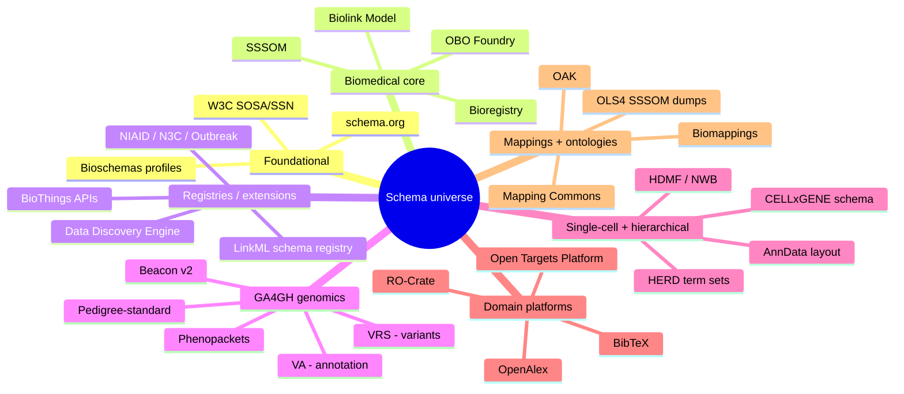
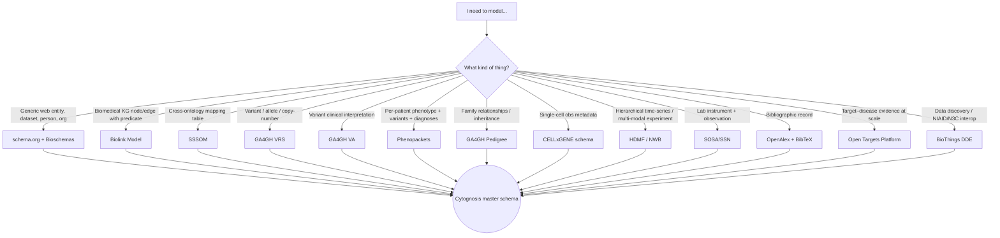
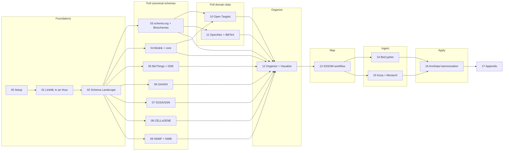

# 02 — The Schema Landscape

> **Goal** – get a map of every schema family relevant to Cytognosis,
> decide which you actually need, and pre-stage the folder layout
> you'll fill in chapters 03–12.
> **Time** – 30 minutes.
> **Prereqs** – chapter 01.

---

## The 30-second take

There are *a lot* of schemas in biomedical data. They were authored by
different communities, in different DSLs (JSON-LD, JSON Schema, OWL,
Protobuf, HDMF-SLF, hand-written markdown), at different levels of
rigor. The plan in this playbook is:

1. **Convert them all to LinkML** before extending. That's the only way
   to compare, inventory, and reuse without writing duplicate types.
2. **Layer Cytognosis-specific subclasses on top.** Authoring once in
   LinkML lets us codegen Pydantic, JSON Schema, OWL, SHACL, SQL DDL,
   Cypher, and JSON-LD for any consumer.
3. **Use the right ingest framework per data shape**: BioCypher for
   direct-to-Neo4j, Koza for Biolink-shaped multi-source merges, OAK +
   SSSOM for ontology resolution, HDMF for hierarchical binary I/O.

This chapter is the map. Subsequent chapters are the territory.

---

## The schema universe



---

## "What schema do I need for X?" — decision tree



---

## The target stack at a glance

| Layer | Schema(s) | Owner / source | Format | Covered in |
| --- | --- | --- | --- | --- |
| Generic web typing | schema.org, Bioschemas | W3C / Bioschemas | JSON-LD | ch 03 |
| Biomedical KG core | Biolink Model | NCATS Translator | LinkML | ch 04 |
| Cross-ontology mapping | SSSOM | Mapping Commons | LinkML | ch 04, 13 |
| Identifier hygiene | Bioregistry, prefixmaps, curies | Biopragmatics | LinkML / YAML | ch 04 |
| Schema registry (JSON-LD) | DDE namespaces | BioThings / Scripps | JSON-LD | ch 05 |
| Live entity APIs | MyGene/MyVariant/MyChem/MyDisease | BioThings | JSON | ch 05 |
| Variant representation | VRS | GA4GH | YAML JSON Schema | ch 06 |
| Variant annotation | VA | GA4GH | YAML JSON Schema | ch 06 |
| Patient cases | Phenopackets | GA4GH (cmungall LinkML port) | LinkML | ch 06 |
| Family relationships | Pedigree | GA4GH | JSON Schema | ch 06 |
| Discovery API | Beacon v2 | GA4GH | OpenAPI + JSON Schema | ch 06 |
| Sensors / observations | SOSA / SSN | W3C | OWL/TTL | ch 07 |
| Single-cell metadata | CELLxGENE schema | CZI | Markdown + Python validators | ch 08 |
| Hierarchical binary | HDMF + NWB + HERD | hdmf-dev / NWB | HDMF-SLF (+ LinkML bridges) | ch 09 |
| Target–disease evidence | Open Targets | EBI / OT | Parquet + JSON Schema | ch 10 |
| Bibliographic | OpenAlex, BibTeX | OurResearch / BibTeX std | JSON / BibTeX | ch 11 |

---

## Recommended folder layout (pre-stage now)

```
schemas/
├── cytognosis/
│   ├── master.yaml              # imports everything
│   ├── core.yaml                # NamedThing, mixins, identifier slots
│   ├── scholarly.yaml           # Paper, Author, Citation
│   ├── artifacts.yaml           # Code, Dataset, Model, Workflow
│   ├── cell.yaml                # CytoCellMetadataRow extends CELLxGENE
│   ├── instruments.yaml         # CytoSensor extends sosa:Sensor
│   ├── mappings.yaml            # EntityMapping extends sssom:Mapping
│   └── presentations.yaml
├── schema_org/                  # ch 03
├── bioschemas/                  # ch 03
├── biolink/                     # ch 04
├── sssom/                       # ch 04, 13
├── biothings/                   # ch 05 (live API responses)
├── dde/                         # ch 05 (registry pulls)
├── ga4gh/                       # ch 06
│   ├── vrs.yaml
│   ├── va_statements.yaml
│   ├── phenopacket/
│   ├── pedigree.yaml
│   └── beacon/
├── sosa_ssn/                    # ch 07
├── cellxgene/                   # ch 08
├── hdmf/                        # ch 09
├── opentargets/                 # ch 10
├── openalex/                    # ch 11
└── bibtex/                      # ch 11

downloads/                       # untouched upstream sources (mirror of schemas/)
build/                           # codegen output
```

Pre-create the empty subfolders now so there's a parking spot when each
chapter says "drop the YAML here":

```bash
cd "linkml_kg_playbook"
mkdir -p schemas/{cytognosis,schema_org,bioschemas,biolink,sssom,biothings,dde,ga4gh/{phenopacket,beacon},sosa_ssn,cellxgene,hdmf,opentargets,openalex,bibtex}
mkdir -p downloads/{schema_org,bioschemas,biolink,sssom,ga4gh,sosa_ssn,cellxgene,hdmf,opentargets,openalex,dde,biothings}
mkdir -p build scripts
```

---

## How the rest of this playbook fits together



The arc:
1. **Foundations** (00–02) — install, learn LinkML syntax, get the map.
2. **Pull canonical schemas** (03–09) — convert each upstream schema
   family to LinkML.
3. **Pull domain data** (10–11) — same conversion patterns applied to
   real data sources.
4. **Organize** (12) — assemble everything into a master schema and
   visualize the inheritance tree to find gaps.
5. **Map** (13) — wire SSSOM into the master so cross-ontology bridges
   are first-class.
6. **Ingest** (14–15) — turn schemas-plus-data into actual KGs with
   BioCypher and Koza.
7. **Apply** (16) — end-to-end CELLxGENE-compliant AnnData
   harmonization using everything you built.
8. **Reference** (17) — cheatsheets, common errors, link pack.

---

## Reading order tips

- **Linear is fine** if you have a few hours; the chapters were
  ordered for it.
- **Skim then dive** if you have a specific problem: read 02 (this), then
  jump to the chapter that solves today's problem; come back later.
- **The Goal/Time/Prereqs box** at the top of every chapter tells you
  the minimum upstream you need.
- **Hands-on boxes** are the fastest way to internalize each chapter.
  If you skip them you'll know but not remember.

---

## Pitfalls

- **Don't try to extend before inventorying.** It's the most common
  trap in schema work — define `cyto:Cohort` then realize NIAID, N3C,
  and Bioschemas already shipped near-equivalent classes you could
  have inherited from.
- **Schemas have politics.** Biolink, GA4GH, CELLxGENE, and Bioschemas
  each have governance. Don't fork — extend via mixins / subclasses /
  named extensions wherever possible.
- **Format proliferation is real.** A given concept might exist in
  schema.org as `Dataset`, in Bioschemas as `bioschemas:Dataset`, in
  Biolink as `biolink:Dataset`, in DDE under multiple namespaces, and
  in HDMF as a `Container`. Pick one as your *primary* parent class
  per Cytognosis class and record the others as
  `exact_mappings:` — that's what SSSOM and `mappings.yaml` are for.

---

## Further reading

- The LinkML schemas registry (community LinkML ports of common
  vocabularies): https://linkml.io/linkml/schemas/
- OBO Foundry (the ontology side of this universe):
  https://obofoundry.org/
- Bioregistry (the identifier side): https://bioregistry.io/
