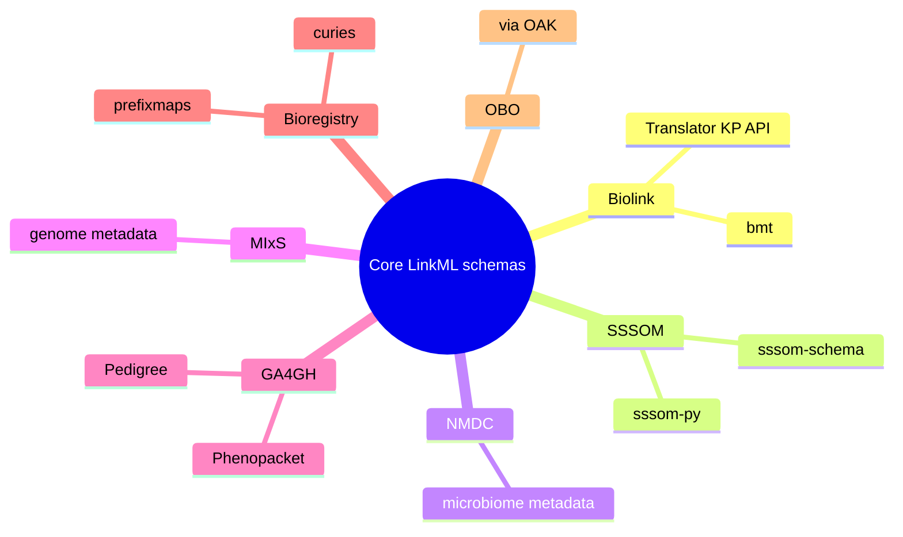

# 04 — Biolink Model and Other Key LinkML Schemas

> **Goal** – pull every "canonical" LinkML schema (Biolink, SSSOM, NMDC,
> MIxS, GA4GH, Bioregistry) so you can `import:` them rather than
> redefine them.
> **Time** – 30 minutes.
> **Prereqs** – chapters 01, 02.

---

## What's "core"?



You almost never write these from scratch. Treat them as third-party
libraries: install, pin a version, import.

---

## 1. Biolink Model

The "OS-level" schema for biomedical knowledge graphs. Everyone in the
NCATS Translator ecosystem uses it.

### 1.1 Get it

```bash
# YAML schema
curl -L -o downloads/biolink/biolink-model.yaml \
  https://raw.githubusercontent.com/biolink/biolink-model/master/src/biolink_model/schema/biolink_model.yaml

# Python toolkit
pip install bmt
```

### 1.2 What's inside

| Layer | Examples |
| --- | --- |
| Top-level entities | `BiologicalEntity`, `ChemicalEntity`, `Disease`, `Gene`, `PhenotypicFeature` |
| Associations (edges) | `GeneToDiseaseAssociation`, `ChemicalToGeneAssociation` |
| Predicates | `treats`, `affects`, `interacts_with` (mapped to RO/SIO) |
| Mixins | `ThingWithTaxon`, `MacromolecularMachineMixin` |

### 1.3 Use bmt to introspect

```python
from bmt import Toolkit
tk = Toolkit()                       # downloads model on first use

print(tk.get_descendants("disease"))
print(tk.get_element("treats"))      # predicate metadata
print(tk.get_all_classes()[:10])
```

### 1.4 Import into your schema

```yaml
imports:
  - linkml:types
  - https://w3id.org/biolink/biolink-model

classes:
  CytognosisDisease:
    is_a: biolink:Disease
    slot_usage:
      id:
        pattern: "^MONDO:[0-9]+$"
```

> **Checkpoint** – `linkml-validate -s your_master.yaml` succeeds with
> the Biolink import; `gen-pydantic` produces a Pydantic class that
> inherits from `biolink_model.Disease`.

---

## 2. SSSOM schema

Already covered in [14_sssom_snomed_workflow.md](14_sssom_snomed_workflow.md)
and `sssom_tooling_for_cytognosis.md`. The summary:

```bash
pip install sssom-schema
python -c "
import sssom_schema, os
print(os.path.dirname(sssom_schema.__file__) + '/schema/sssom_schema.yaml')
"
```

In your master schema:

```yaml
imports:
  - sssom_schema:sssom_schema
```

---

## 3. Other LinkML schemas worth knowing

| Schema | Domain | Repo |
| --- | --- | --- |
| Biolink Model | KG core types/predicates | https://github.com/biolink/biolink-model |
| SSSOM Schema | mappings | https://github.com/mapping-commons/sssom |
| NMDC Schema | microbiome data | https://github.com/microbiomedata/nmdc-schema |
| MIxS | genome/metagenome metadata | https://github.com/GenomicsStandardsConsortium/mixs |
| Phenopacket Schema | clinical case rep. | https://github.com/phenopackets/phenopacket-schema |
| GA4GH Pedigree | family pedigrees | https://github.com/ga4gh/pedigree-standard |
| ROBOT/OBO patterns | DOSDP templates | https://github.com/ontodev/robot |
| Bioregistry LinkML | identifier registry | https://github.com/biopragmatics/bioregistry-schema |
| LinkML metamodel | LinkML for LinkML | https://github.com/linkml/linkml-model |

You can pull any of them with `git clone --depth 1` into `downloads/`
and `import:` them, or install from PyPI when packaged
(`pip install nmdc-schema`, `pip install phenopackets`).

---

## 4. The "import" pattern

```yaml
# schemas/cytognosis/master.yaml
id: https://cytognosis.org/schemas/master
name: cytognosis_master
imports:
  - linkml:types
  - https://w3id.org/biolink/biolink-model
  - sssom_schema:sssom_schema
  - ../bioschemas/dataset
  - ../bioschemas/computationalworkflow
  - ../sosa_ssn/sosa_ssn
  - ../cellxgene/cellxgene
  - ../openalex/openalex
  - ./scholarly                 # local subschema
  - ./artifacts                 # local subschema
```

Two takeaways:

1. **Imports can be local files, PyPI-installed schemas (resolved by
   `name`), or absolute URLs.**
2. **Imports are transitive** – Biolink already imports a lot, so be
   careful not to override its names.

---

## 5. Verify the assembled schema

```bash
SCHEMA=schemas/cytognosis/master.yaml

linkml-validate --schema "$SCHEMA" --target-class CytognosisDisease \
  test_data/disease.yaml

gen-pydantic "$SCHEMA"      > build/master.py
gen-erdiagram "$SCHEMA"     > build/master.mmd
gen-json-schema "$SCHEMA"   > build/master.schema.json
```

If `gen-erdiagram` produces a Mermaid file with all your imported types
visible, your imports are wired correctly.

---

## 6. Hands-on

1. Add Biolink and SSSOM imports to a fresh `schemas/cytognosis/master.yaml`.
2. Define one class that inherits from `biolink:Disease`.
3. Run `linkml-validate` and `gen-pydantic` end-to-end.
4. Use `bmt` to print all descendants of `biolink:ChemicalEntity`.

---

## 7. Pitfalls

- **Biolink is big.** First codegen takes a couple of minutes; subsequent
  runs are fast.
- **Slot name collisions** – if you redeclare `name` or `id` your schema
  silently overrides Biolink's. Use `slot_usage` instead.
- **`bmt`'s default model URL** points at GitHub `master`. Pin a version
  for reproducibility: `Toolkit(schema='path/to/biolink-model.yaml')`.
- **Phenopacket schema** publishes both Protobuf and LinkML; for
  LinkML pulls use `phenopacket-schema/src/schema/`.

---

## Further reading

- Biolink overview: https://biolink.github.io/biolink-model/
- bmt API: https://github.com/biolink/biolink-model-toolkit
- LinkML registry of schemas: https://linkml.io/linkml/schemas/
