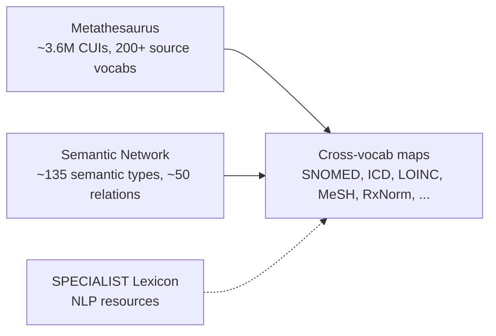
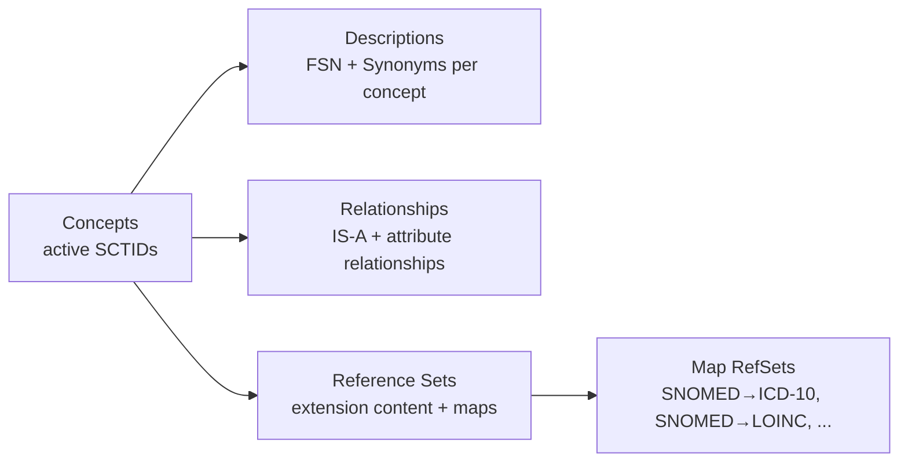
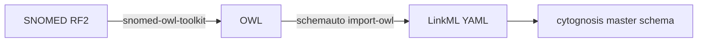
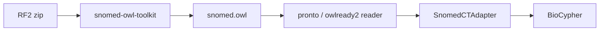
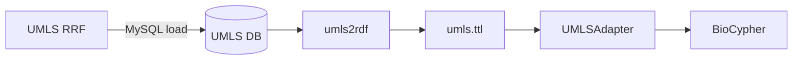

# 05 — UMLS and SNOMED CT

> **Goal** – understand UMLS and SNOMED CT well enough to convert them
> for use in Cytognosis, extract their cross-vocabulary mappings as
> SSSOM, and build a BioCypher-style adapter to ingest them into the KG.
> **Time** – 90 minutes.
> **Prereqs** – chapters 01, 02, 04 (Biolink). Chapter 14 (SSSOM) is
> useful next.

> **Cytognosis-local note.** A read-only mirror of UMLS and SNOMED CT
> releases is expected at `_data/umls/` and `_data/snomed/` (in the
> Infrastructure and Tooling project root). Don't modify those folders;
> always work from copies under `downloads/umls/` and `downloads/snomed/`.

---

## Why this chapter exists, in one paragraph

Almost every clinical data source you'll touch — EHRs, registries, claims
data, biobank cohorts — speaks SNOMED CT or some UMLS-mapped vocabulary
internally. If Cytognosis is going to harmonize clinical entities at all,
UMLS and SNOMED CT are not optional. The trick is that both are *huge*,
both have non-trivial licenses, and both ship in formats (RRF for UMLS,
RF2 for SNOMED CT) that aren't directly LinkML-importable. This chapter
lays out the converters, the mapping extracts, and the adapter pattern.

---

## 1. Coverage, licenses, and what you actually get

| | UMLS Metathesaurus | SNOMED CT (International Edition) |
| --- | --- | --- |
| Owner | NLM (US National Library of Medicine) | SNOMED International (IHTSDO) |
| Concepts | ~4.6M atoms collapsing to ~3.6M unique CUIs | ~360k active concepts |
| Source vocabularies | 200+ (SNOMED CT, ICD-9/10, MeSH, RxNorm, LOINC, NCI Thesaurus, MedDRA, …) | 1 (it's a single ontology, not a meta-thesaurus) |
| Release cadence | Twice a year (e.g., 2024AA, 2024AB) | Twice a year (Jan, Jul) |
| License | UMLS Metathesaurus License (free, requires NLM UTS account) | Affiliate License Agreement; **free in US for NLM-affiliate use**, paid elsewhere |
| Distribution format | RRF (Rich Release Format), pipe-delimited | RF2 (Release Format 2), tab-delimited |
| What you get | Cross-vocab CUI hub + semantic types + lexical resources | Hierarchical concept model with stated/inferred relationships |

**Two practical implications for Cytognosis:**
- The UMLS license check is annual; track it in `Infrastructure and
  Tooling/_data/umls/LICENSE_RENEWED.txt` so the renewal doesn't lapse
  silently mid-quarter.
- For SNOMED CT international content outside the US affiliate
  framework, you may only have the US Edition or the international
  Global Patient Set (GPS) subset. The OLS4 mapping export covers the
  redistributable portions.

---

## 2. Key components

### 2.1 UMLS



| Component | What it is | RRF file |
| --- | --- | --- |
| **Metathesaurus** | The CUI hub. Each concept aggregates atoms from many sources. | `MRCONSO.RRF` (concepts), `MRREL.RRF` (relationships), `MRSTY.RRF` (semantic types) |
| **Semantic Network** | Type system above the Metathesaurus: `Disease or Syndrome`, `Pharmacologic Substance`, `Gene or Genome`, etc. | `SRDEF`, `SRSTR` |
| **SPECIALIST Lexicon** | NLP resources (lemmas, variants, abbreviations) | `LRABR`, `LRAGR`, … |

The CUI is the gravity well — it's what lets you say "ICD-10 `E11.9` and
SNOMED CT `44054006` and MeSH `D003924` are all the same concept" with
a single anchor (`C0011860`).

### 2.2 SNOMED CT



| Component | What it is | RF2 file pattern |
| --- | --- | --- |
| **Concepts** | The terminology — every SCTID is here | `sct2_Concept_Snapshot_*.txt` |
| **Descriptions** | Fully-Specified Names + Synonyms per concept | `sct2_Description_Snapshot_*.txt` |
| **Relationships** | Stated + inferred IS-A and attribute relationships | `sct2_Relationship_Snapshot_*.txt`, `sct2_StatedRelationship_*` |
| **Reference Sets** | Extensions, language refsets, simple/complex map refsets | `der2_*Refset_*Snapshot_*.txt` |

The Concept Model has 19 top-level hierarchies — the ones you'll meet
constantly: `Clinical finding`, `Procedure`, `Body structure`,
`Substance`, `Pharmaceutical/biologic product`, `Organism`,
`Observable entity`. Cytognosis cohort/EHR ingests will live mostly in
the first three.

---

## 3. Release format — RF2 (and RRF) tour

### 3.1 RF2 file layout (SNOMED CT)

```
SnomedCT_InternationalRF2_PRODUCTION_<DATE>/
├── Snapshot/
│   ├── Terminology/
│   │   ├── sct2_Concept_Snapshot_INT_<DATE>.txt
│   │   ├── sct2_Description_Snapshot-en_INT_<DATE>.txt
│   │   ├── sct2_Relationship_Snapshot_INT_<DATE>.txt
│   │   └── ...
│   └── Refset/
│       ├── Content/        # simple refsets
│       ├── Map/            # map refsets (SNOMED→ICD-10, etc.)
│       └── Language/
├── Full/                   # full history, every change
└── Delta/                  # changes since last release
```

You almost always want **Snapshot** — it's the current state of every
concept; `Full` is the cumulative history; `Delta` is the patch from
the previous release.

### 3.2 RRF file layout (UMLS)

```
META/
├── MRCONSO.RRF        # concepts: CUI | LANG | TS | LUI | ... | SAB | TTY | CODE | STR
├── MRREL.RRF          # relationships: CUI1 | REL | CUI2 | RELA | SAB | ...
├── MRSTY.RRF          # semantic types per CUI
├── MRSAB.RRF          # source vocabulary metadata
└── MRMAP.RRF          # mappings between source vocabularies
```

Both formats are flat-file, line-oriented, easy to stream with DuckDB
or pandas.

### 3.3 Convert RF2 → OWL with snomed-owl-toolkit (Java)

Repo: https://github.com/IHTSDO/snomed-owl-toolkit

```bash
mkdir -p downloads/snomed/build
cp _data/snomed/SnomedCT_InternationalRF2_PRODUCTION_*.zip downloads/snomed/

java -jar snomed-owl-toolkit.jar \
  -rf2-to-owl \
  -rf2-snapshot-archives downloads/snomed/SnomedCT_InternationalRF2_PRODUCTION_*.zip \
  -output downloads/snomed/build/snomed.owl
```

Output: a single OWL functional-syntax (or Turtle, with `-format owl`)
file with the full SNOMED ontology — concepts as classes, IS-A as
`SubClassOf`, attribute relationships as object property axioms.

### 3.4 Convert RRF → RDF with umls2rdf (Python)

Repo: https://github.com/ncbo/umls2rdf

```bash
git clone --depth 1 https://github.com/ncbo/umls2rdf downloads/tools/umls2rdf
cd downloads/tools/umls2rdf

# Configure UMLS DB connection (umls2rdf expects a MySQL load of the RRF)
mysql -u root -p umls < load_umls.sql
# (or: pip install umls-tools and use a python loader)

python umls2rdf.py --conf=conf.ini --output=downloads/umls/build/umls.ttl
```

Output: Turtle RDF with each CUI as a `skos:Concept`, source codes via
`skos:notation`, cross-vocab equivalences via `skos:exactMatch` /
`skos:closeMatch`.

### 3.5 RF2 → LinkML (via OWL bridge)

You can't go RF2 → LinkML directly. The chain:



```bash
schemauto import-owl \
  downloads/snomed/build/snomed.owl \
  --output schemas/snomed/snomed_subset.yaml
```

Realistically you don't want every SCTID as a LinkML class. Subset
first to top-level hierarchies (Clinical finding, Procedure, etc.) and
let `cytognosis:Disease` etc. carry SCTIDs as `id` values constrained
by pattern.

---

## 4. OLS4 release: the easy path for SSSOM

OLS4 hosts a redistributable SNOMED CT subset and ships pre-built SSSOM
mapping TSVs as part of the bulk mappings tarball you already pulled in
chapter 14:

```bash
ls downloads/sssom/extracted/ | grep -i snomed
# snomed.ols.sssom.tsv      <- the file we worked with in ch 14
```

This is the lowest-effort path to SNOMED CT cross-vocab mappings — no
RF2 parsing, no OWL build, just a TSV with `SNOMED:* → MONDO:*`,
`SNOMED:* → ICD10CM:*`, etc. Use chapter 14 §6.5 to load it directly.

For full cross-vocab coverage (everything UMLS knows), extract
`MRMAP.RRF` from the Metathesaurus instead — it carries the
cross-vocabulary maps for sources OLS4 doesn't redistribute.

---

## 5. BioCypher adapter for SNOMED CT — two implementations compared

The BioCypher community has been working on a SNOMED CT adapter (see
https://github.com/biocypher/biocypher/issues/291). Two underlying
toolchains are in play:

### 5.1 Option A: snomed-owl-toolkit (BioCypher-recommended path)



**Pros:**
- Faithful translation: IS-A → `SubClassOf`, attribute relationships
  preserved as OWL axioms.
- Plays well with chapter 15's BioCypher ontology integration —
  BioCypher can ingest OWL directly as a head ontology.
- Maintained by IHTSDO; tracks RF2 spec changes.

**Cons:**
- Java toolchain (need JRE 11+ in your build container).
- Output OWL file is large (~1 GB Turtle); load times non-trivial.
- Requires you to think in OWL terms.

### 5.2 Option B: umls2rdf (Python end-to-end)



**Pros:**
- Pure Python; trivial to add to a `pyproject.toml`.
- Reaches *all* UMLS source vocabularies in one shot, not just SNOMED.
- Covers the cross-vocab mappings via `skos:exactMatch` directly.

**Cons:**
- Requires a MySQL UMLS load step (the official NLM `MetamorphoSys`
  output) — non-trivial first time.
- Output is "UMLS-shaped" (CUIs at the center, source codes peripheral)
  rather than "SNOMED-shaped" (SCTIDs central). For SNOMED-as-primary
  workflows this is awkward.
- Less actively maintained than snomed-owl-toolkit.

### 5.3 Comparison and Cytognosis recommendation

| Criterion | snomed-owl-toolkit (Option A) | umls2rdf (Option B) |
| --- | --- | --- |
| Output format | OWL (functional / Turtle) | Turtle RDF |
| Hierarchy fidelity | High (full DL semantics) | Medium (SKOS) |
| Cross-vocab coverage | SNOMED CT only | All UMLS source vocabs |
| Setup complexity | Java + RF2 zip | MySQL + RRF + Python |
| BioCypher fit | Direct OWL ingest | Custom adapter on Turtle |
| Best for | SNOMED-centric ingest | Multi-vocab UMLS ingest |

**Cytognosis recommendation:** use **Option A** as the primary SNOMED
adapter — it's BioCypher's recommended path and matches the OWL-first
ontology integration we'll cover in chapter 15. Use **Option B** only
if you need cross-vocab UMLS coverage that the OLS4 SSSOM (chapter 14)
doesn't already give you. In practice, OLS4 SSSOM covers ~90% of the
mappings Cytognosis needs.

A skeleton SNOMED adapter (full version belongs in chapter 15):

```python
# adapters/snomed_ct_adapter.py
from pathlib import Path
import owlready2 as owl

class SnomedCTAdapter:
    def __init__(self, owl_path: str):
        self.onto = owl.get_ontology(f"file://{Path(owl_path).resolve()}").load()

    def get_nodes(self):
        for cls in self.onto.classes():
            if not cls.name.isdigit():
                continue
            sctid = cls.name
            label = (cls.label.first() if cls.label else None) or sctid
            yield (
                f"SNOMED:{sctid}",
                "snomed_concept",
                {"label": label, "fully_specified_name": label},
            )

    def get_edges(self):
        for cls in self.onto.classes():
            if not cls.name.isdigit():
                continue
            for parent in cls.is_a:
                if isinstance(parent, owl.ThingClass) and parent.name.isdigit():
                    yield (
                        None,
                        f"SNOMED:{cls.name}",
                        f"SNOMED:{parent.name}",
                        "is_a",
                        {},
                    )
```

Wire it into `schema_config.yaml`:

```yaml
snomed concept:
  represented_as: node
  preferred_id: snomed
  input_label: snomed_concept
  is_a: biolink:OntologyClass

is_a:
  represented_as: edge
  source: snomed concept
  target: snomed concept
  is_a: biolink:subclass_of
```

Chapter 15 covers BioCypher's ontology head + adapter mechanism in
depth; this skeleton is enough to validate the toolchain end-to-end.

---

## 6. Hands-on

1. **Inventory.** Confirm `_data/snomed/` and `_data/umls/` are present
   and check each release date matches what's in `LICENSE_RENEWED.txt`.
2. **OLS4 SSSOM first** (the fast win). From chapter 14's tarball,
   load `snomed.ols.sssom.tsv` and check that you can resolve at least
   one SNOMED→MONDO mapping you care about.
3. **Run snomed-owl-toolkit** end-to-end on the latest RF2 zip; output
   `snomed.owl`. Time it — first conversion is 5–15 minutes.
4. **Sanity-check the OWL.** `python -c "import owlready2 as o; \
   onto = o.get_ontology('file://./snomed.owl').load(); \
   print(sum(1 for _ in onto.classes()))"` should land near ~360k.
5. **Skeleton adapter.** Wire the snippet from §5.3 into a tiny
   BioCypher project; emit nodes for one SNOMED top-level hierarchy
   (e.g., `Clinical finding`) and verify Neo4j ingest.
6. **Optional Option B path.** Stand up the UMLS MySQL load and run
   `umls2rdf` so you've seen both flavors before deciding.

---

## 7. Pitfalls

- **License auto-renewal**: the UMLS UTS account is annual. Build a
  calendar reminder *and* a CI check on `LICENSE_RENEWED.txt`'s
  modification date. NLM does not warn you in advance.
- **SNOMED active vs inactive concepts.** RF2 carries inactive
  concepts; filter on `active='1'` in `sct2_Concept_Snapshot_*.txt`
  before downstream processing.
- **Stated vs inferred relationships.** For RF2 → OWL, prefer
  *inferred* relationships (post-classifier output) — stated relationships
  are the curator's intent, not the reasoned hierarchy.
- **MRCONSO contains every atom**, including obsolete and suppressible
  ones. Filter on `SUPPRESS='N'` before extracting concept labels.
- **CUI ≠ Concept.** A UMLS CUI bundles synonymous atoms; a SNOMED
  Concept is a single editorial unit. They're related, not identical;
  don't conflate.
- **Re-deriving the SSSOM mappings yourself** is rarely worth it when
  OLS4's redistribution covers your needs. Spend the time on adapter
  quality instead.

---

## Further reading

- UMLS docs: https://www.nlm.nih.gov/research/umls/index.html
- UMLS RRF spec: https://www.nlm.nih.gov/research/umls/knowledge_sources/metathesaurus/release/file_descriptions.html
- SNOMED CT docs: https://confluence.ihtsdotools.org/
- RF2 reference: https://confluence.ihtsdotools.org/display/DOCRELFMT
- snomed-owl-toolkit: https://github.com/IHTSDO/snomed-owl-toolkit
- umls2rdf: https://github.com/ncbo/umls2rdf
- BioCypher SNOMED CT discussion: https://github.com/biocypher/biocypher/issues/291
- OLS4 SNOMED page: https://www.ebi.ac.uk/ols4/ontologies/snomed
