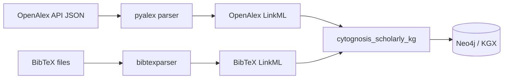

# 12 — OpenAlex and BibTeX → LinkML

> **Goal** – LinkML representations of OpenAlex `Work` (and friends) and
> the BibTeX entry universe, ready to import into your scholarly KG.
> **Time** – 60 minutes.
> **Prereqs** – chapters 01, 02, 03 (schema.org), 04 (Biolink).

---

## Why both?



OpenAlex is your live citation graph; BibTeX is what shows up in
researcher submissions, Zotero exports, ReadCube libraries. You want
both shapes round-tripping into the same internal model.

---

## 1. OpenAlex

### 1.1 Pull a schema reference

OpenAlex doesn't publish a JSON Schema file you can `schemauto
import-jsonschema` directly. Two options:

- **Option A** – fetch the docs page and parse table headers
  (https://docs.openalex.org/api-entities/works).
- **Option B** – fetch sample records via `pyalex` and infer.

We'll do Option B because it produces a schema grounded in actual
response shape.

```python
# scripts/openalex_schema_infer.py
from pyalex import Works, Authors, Sources, Institutions
import yaml, json
from genson import SchemaBuilder        # pip install genson

def infer(api, n=200, name="Work"):
    builder = SchemaBuilder()
    for i, rec in enumerate(api().get(per_page=200)):
        builder.add_object(rec)
        if i >= n: break
    return builder.to_schema()

for name, api in [("Work", Works), ("Author", Authors),
                  ("Source", Sources), ("Institution", Institutions)]:
    s = infer(api, name=name)
    open(f"schemas/openalex/{name.lower()}.json", "w").write(json.dumps(s, indent=2))
```

### 1.2 Convert JSON Schema to LinkML

The JSON Schema importer lives in **`schema-automator`** (CLI: `schemauto`),
not in core LinkML.

```bash
pip install schema-automator

schemauto import-jsonschema \
  schemas/openalex/work.json \
  --output schemas/openalex/work.yaml
```

If `schemauto` errors on `oneOf` constructs (common with `genson`-inferred
schemas), pass `--use-attributes` to keep nested objects inline rather
than promoting them to anonymous classes — easier to clean up afterwards.

### 1.3 Hand-tune

The auto-conversion will:
- create lots of anonymous classes for nested objects (clean these up)
- give every field `range: string` (tighten dates → `datetime`,
  IDs → `uriorcurie`)
- not understand OpenAlex's CURIE-like IDs (`W4404091856`, `A5028301...`)

Tightened slot:

```yaml
slots:
  id:
    identifier: true
    range: uriorcurie
    pattern: "^https://openalex.org/[WAISG][0-9]+$"
  doi:
    range: uriorcurie
    pattern: "^https://doi.org/10\\..+"
  publication_year:
    range: integer
    minimum_value: 1500
```

### 1.4 Wire to Biolink

```yaml
classes:
  OpenAlexWork:
    is_a: biolink:Article         # or biolink:Publication
    class_uri: schema:ScholarlyArticle
```

### 1.5 Round-trip a record

```python
from build.openalex_pydantic import OpenAlexWork
from pyalex import Works

raw = next(iter(Works().filter(doi="10.1038/s41586-023-06600-9").get()))
work = OpenAlexWork(**raw)
print(work.model_dump_json(indent=2)[:400])
```

---

## 2. BibTeX

### 2.1 Standard entry types

BibTeX has 14 canonical entry types. Treat each as a LinkML class.

| Entry | Use case | Required fields (BibTeX std) |
| --- | --- | --- |
| `article` | Journal article | author, title, journal, year |
| `book` | Authored book | author, title, publisher, year |
| `booklet` | Printed but unpublished | title |
| `inbook` | Chapter in book | author, title, chapter/pages, publisher, year |
| `incollection` | Part of an edited book | author, title, booktitle, publisher, year |
| `inproceedings` | Conference paper | author, title, booktitle, year |
| `manual` | Technical manual | title |
| `mastersthesis` | Master's thesis | author, title, school, year |
| `misc` | Anything else | (none) |
| `phdthesis` | PhD thesis | author, title, school, year |
| `proceedings` | Conference proceedings | title, year |
| `techreport` | Technical report | author, title, institution, year |
| `unpublished` | Unpublished | author, title, note |
| `online`/`electronic` | Web resource | author/title, url |

### 2.2 Generate the LinkML schema (hand-written, small)

```yaml
# schemas/bibtex/bibtex.yaml
id: https://cytognosis.org/schemas/bibtex
name: bibtex
prefixes:
  bibtex: https://w3id.org/cyto/bibtex/
  schema: http://schema.org/
  linkml: https://w3id.org/linkml/
default_prefix: bibtex
imports:
  - linkml:types
classes:
  BibtexEntry:
    abstract: true
    slots: [citekey, title, year, author, note, url]
    class_uri: schema:CreativeWork
  Article:
    is_a: BibtexEntry
    class_uri: schema:ScholarlyArticle
    slot_usage:
      author: {required: true}
      year:   {required: true}
    slots: [journal, volume, number, pages, doi]
  Book:
    is_a: BibtexEntry
    class_uri: schema:Book
    slot_usage: {title: {required: true}, year: {required: true}}
    slots: [publisher, address, edition, isbn]
  InBook:
    is_a: Book
    slots: [chapter, pages]
  InCollection:
    is_a: Book
    slots: [booktitle, pages, editor]
  InProceedings:
    is_a: BibtexEntry
    class_uri: schema:ScholarlyArticle
    slots: [booktitle, pages, organization, publisher]
  PhDThesis:
    is_a: BibtexEntry
    class_uri: schema:Thesis
    slots: [school, address]
  MastersThesis:
    is_a: PhDThesis
  TechReport:
    is_a: BibtexEntry
    slots: [institution, number, type]
  Manual:
    is_a: BibtexEntry
    slots: [organization, address, edition]
  Misc:
    is_a: BibtexEntry
slots:
  citekey:
    identifier: true
    range: string
    pattern: "^[A-Za-z][A-Za-z0-9_:-]*$"
  title:    {range: string}
  year:     {range: integer, minimum_value: 1500}
  author:   {range: string, multivalued: true}
  editor:   {range: string, multivalued: true}
  journal:  {range: string}
  volume:   {range: string}
  number:   {range: string}
  pages:    {range: string}
  publisher:{range: string}
  address:  {range: string}
  edition:  {range: string}
  isbn:     {range: string}
  booktitle:{range: string}
  organization: {range: string}
  institution:  {range: string}
  school:   {range: string}
  type:     {range: string}
  chapter:  {range: string}
  doi:      {range: uriorcurie, pattern: "^10\\..+"}
  url:      {range: uri}
  note:     {range: string}
```

### 2.3 Parser → Pydantic round-trip

```python
import bibtexparser
from pathlib import Path
from build.bibtex_pydantic import Article, Book, InProceedings, PhDThesis, MastersThesis, Misc

ENTRY_MAP = {
    "article": Article, "book": Book, "inproceedings": InProceedings,
    "phdthesis": PhDThesis, "mastersthesis": MastersThesis, "misc": Misc,
}

with open("library.bib") as f:
    db = bibtexparser.load(f)

records = []
for e in db.entries:
    cls = ENTRY_MAP.get(e["ENTRYTYPE"], Misc)
    payload = {"citekey": e["ID"]} | {k: v for k, v in e.items()
                                      if k not in ("ID", "ENTRYTYPE")}
    if "year" in payload:
        payload["year"] = int(payload["year"])
    if "author" in payload:
        payload["author"] = [a.strip() for a in payload["author"].split(" and ")]
    records.append(cls(**payload))
```

### 2.4 Import bibtex into the master schema

```yaml
# schemas/cytognosis/master.yaml
imports:
  - ../bibtex/bibtex
  - ../openalex/work
  - ./scholarly                 # Cytognosis-specific extensions
```

In `scholarly.yaml` you can declare equivalences:

```yaml
classes:
  CytognosisPaper:
    is_a: bibtex:Article
    mixins: [HasROCrateMetadata]
    exact_mappings:
      - openalex:OpenAlexWork
      - schema:ScholarlyArticle
      - biolink:Article
```

---

## 3. Hands-on

1. Run `openalex_schema_infer.py` for `Work` and `Author`.
2. `schemauto import-jsonschema` on each.
3. Copy `bibtex.yaml` above; tweak field names if your BibTeX uses
   nonstandard fields.
4. Round-trip one of your existing `.bib` entries through the Pydantic
   class.

---

## 4. Pitfalls

- **OpenAlex JSON has nested objects as both objects and lists.**
  `genson` will emit `oneOf`; LinkML's JSON Schema importer doesn't
  always lift `oneOf` into `union_of`. Manual touch-up needed.
- **BibTeX `author` is a single string with `and` separators, not a
  list.** Split on `and` (case-insensitive, surrounded by whitespace).
- **`crossref` BibTeX field** lets one entry inherit fields from another;
  resolve before validation.
- **OpenAlex IDs are URLs not CURIEs.** Decide whether to store as URL
  or compress to `openalex:W4404091856` via `curies`.

---

## Further reading

- OpenAlex API: https://docs.openalex.org/
- pyalex: https://github.com/J535D165/pyalex
- BibTeX type reference: https://www.bibtex.com/e/entry-types/
- bibtexparser: https://bibtexparser.readthedocs.io/
