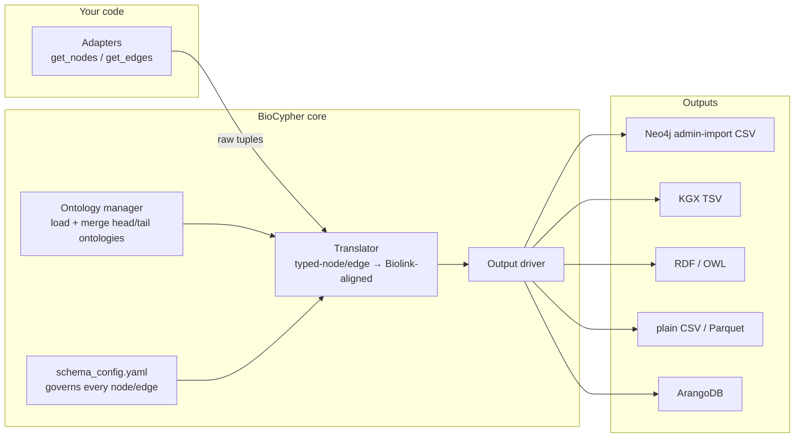
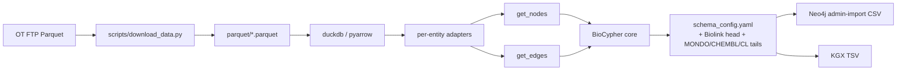

# 15 — BioCypher: schema-driven KG ingestion

> **Goal** – understand BioCypher both as a *tool* (the
> `biocypher/biocypher` Python package) and as an *ecosystem* of
> related repos (adapters, biochatter, project templates), build
> adapters for Biolink, MONDO, and SNOMED CT, and walk through the
> Open Targets adapter end-to-end.
> **Time** – 2 hours.
> **Prereqs** – chapters 01–13. Chapter 05 (UMLS/SNOMED) for the
> SNOMED adapter section.

---

## BioCypher is two things

1. **The tool** — `biocypher/biocypher` on GitHub. A Python library
   that turns schema-typed nodes/edges into Neo4j / RDF / KGX / CSV
   output, driven by a Biolink-rooted YAML schema config.
2. **The ecosystem** — the rest of `github.com/biocypher` org:
   `biochatter` (LLM integration, chapter 19), per-source adapters
   (`open-targets`, `crossbar`, etc.), the `project-template` scaffold,
   and tutorials.

This chapter covers the tool's architecture, ontologies, schemas, and
adapter design pattern, with concrete adapter examples for Biolink
(self-test), MONDO, and SNOMED CT, then the Open Targets case study.

---

## 1. Architecture

Reference: https://biocypher.org/BioCypher/learn/explanation/architecture-migration/



The **architecture migration** the BioCypher docs describe is the move
from a monolithic translator to a pipeline where:

- **Adapters** are pure data sources — they yield raw node/edge tuples.
- **The Translator** owns all the schema/ontology decisions — what
  Biolink class each entity becomes, which slots are required, how
  predicates normalize.
- **Output drivers** are pluggable — you swap `dbms.dbms = neo4j` for
  `rdf` without touching adapters.

This separation is what makes BioCypher worth using over hand-rolling
Cypher: you can add a new source by writing an adapter only, never
touching the translation logic.

---

## 2. Ontologies

References:
- https://biocypher.org/BioCypher/learn/explanation/ontologies/
- https://biocypher.org/BioCypher/learn/tutorials/tutorial002_handling_ontologies/

BioCypher has first-class support for **head** and **tail** ontologies:

| Term | Meaning |
| --- | --- |
| **Head ontology** | The "primary" ontology for the KG. Defaults to Biolink Model. Every entity's `is_a:` chain resolves into the head. |
| **Tail ontology** | A secondary ontology grafted onto a specific Biolink class. E.g., MONDO grafted onto `biolink:Disease` so MONDO's is-a hierarchy becomes available below `Disease`. |
| **Hybrid mode** | Multiple tails grafted onto different Biolink classes — produces a single coherent ontology graph. |

```yaml
# config/biocypher_config.yaml
biocypher:
  head_ontology:
    url: https://w3id.org/biolink/biolink-model.owl.ttl
    root_node: entity
  tail_ontologies:
    mondo:
      url: http://purl.obolibrary.org/obo/mondo.owl
      head_join_node: disease           # Biolink class
      tail_join_node: MONDO_0000001     # MONDO root
    cl:
      url: http://purl.obolibrary.org/obo/cl.owl
      head_join_node: cell
      tail_join_node: CL_0000000
    snomed:
      url: file://downloads/snomed/build/snomed.owl
      head_join_node: clinical_finding
      tail_join_node: 138875005          # SNOMED root
```

Once tails are configured, every node BioCypher emits gets a typed
`is_a:` chain that walks all the way from a leaf SCTID up through
SNOMED, into the SNOMED root, into Biolink's `clinical_finding`, into
`disease_or_phenotypic_feature`, into `entity`. That's the
single-ontology coherence the architecture buys you.

The **chapter 05 SNOMED OWL build** is exactly the artifact you'd plug
in here as a tail.

---

## 3. Schemas — `schema_config.yaml` philosophy

References:
- https://biocypher.org/BioCypher/learn/explanation/schema-config-philosophy
- https://biocypher.org/BioCypher/reference/schema-config/

The schema config is the **declarative contract** between adapters and
output. It says "here's what each input label means, and here's how it
should be emitted."

### 3.1 The minimal shape

```yaml
# config/schema_config.yaml
gene:
  represented_as: node
  preferred_id: ensembl
  input_label: ensembl_gene
  is_a: biolink:Gene
  properties:
    symbol: str
    description: str

disease:
  represented_as: node
  preferred_id: mondo
  input_label: [mondo_disease, doid_disease]   # accept either
  is_a: biolink:Disease
  properties:
    name: str
    synonyms: str[]

gene to disease association:
  represented_as: edge
  source: gene
  target: disease
  is_a: biolink:GeneToDiseaseAssociation
  properties:
    evidence_score: float
    publications: str[]
```

### 3.2 Three philosophical commitments

1. **Biolink as ground truth.** Every `is_a:` resolves into a Biolink
   class. If you need types Biolink doesn't have, declare them as
   `is_a:` extensions and add a tail ontology.
2. **One label, one entity.** `input_label` is what your adapter
   yields; the schema decides what type that means. Adapters never
   reach into Biolink names directly.
3. **Properties are typed.** `str`, `int`, `float`, `bool`, plus `[]`
   for arrays and `{}` for objects. Type errors at write time, not at
   query time.

### 3.3 Multi-label entities

When the same logical entity comes in under different upstream labels
(diseases as MONDO from Open Targets *and* DOID from CTD), give the
schema both:

```yaml
disease:
  represented_as: node
  preferred_id: mondo            # canonical
  input_label: [mondo_disease, doid_disease]
  is_a: biolink:Disease
```

BioCypher will normalize both onto the `disease` node type using the
preferred ID system; cross-source identifier resolution falls back to
SSSOM (chapter 14) when the upstreams don't agree.

---

## 4. Adapters

References:
- https://biocypher.org/BioCypher/learn/explanation/adapters/
- https://biocypher.org/BioCypher/learn/tutorials/tutorial003_adapters/

An adapter is a Python class with two generators:

```python
class MyAdapter:
    def get_nodes(self):
        # yield (id, label, properties_dict)
        yield "ENSG00000139618", "ensembl_gene", {"symbol": "BRCA2"}

    def get_edges(self):
        # yield (relationship_id, source_id, target_id, label, properties)
        yield (None, "ENSG00000139618", "MONDO:0007254",
               "gene to disease association",
               {"evidence_score": 0.92})
```

That's the entire contract. Everything else — Biolink alignment,
ontology resolution, output writing — is BioCypher's problem.

### 4.1 Adapter design patterns

| Pattern | When to use | Example |
| --- | --- | --- |
| Single-source | One file → one entity type | OLS4 ontology dump → MONDO concepts |
| Polymorphic | One source, many entity types | Open Targets adapter |
| Streaming | Source is huge | Open Targets evidence (50 GB) |
| Two-pass | Edges need both endpoints loaded first | nodes pass, then edges with id-lookup cache |
| API-backed | Source is a live REST API | BioThings as source for chapter 06 |

### 4.2 Example — Biolink test adapter

Reference: https://github.com/biocypher/biocypher/issues/117

The simplest sanity-check adapter — yields one of every Biolink
top-level entity and one canonical association. Useful for verifying
your schema config and ontology setup before pointing real data at the
pipeline.

```python
# adapters/biolink_test_adapter.py
class BiolinkTestAdapter:
    """Minimal adapter that yields one node per top-level Biolink class
    and one association edge — for smoke-testing schema/ontology config."""

    def get_nodes(self):
        yield "TEST:gene/1",     "ensembl_gene",   {"symbol": "TP53"}
        yield "TEST:disease/1",  "mondo_disease",  {"name": "test disease"}
        yield "TEST:chemical/1", "chembl_drug",    {"name": "aspirin"}

    def get_edges(self):
        yield (None, "TEST:gene/1", "TEST:disease/1",
               "gene to disease association",
               {"evidence_score": 1.0, "source": "test"})
```

```bash
python -c "
from biocypher import BioCypher
from adapters.biolink_test_adapter import BiolinkTestAdapter
bc = BioCypher(schema_config_path='config/schema_config.yaml',
               biocypher_config_path='config/biocypher_config.yaml')
a = BiolinkTestAdapter()
bc.write_nodes(a.get_nodes())
bc.write_edges(a.get_edges())
bc.summary()
"
```

If this round-trips cleanly, your config is sound. Real adapters can
follow.

### 4.3 Example — MONDO ontology adapter

Reference: https://github.com/biocypher/biocypher/issues/156

MONDO ships an OBO/OWL file. You can let BioCypher's tail-ontology
mechanism handle the IS-A graph (§2 above), but you'll usually want
extra MONDO metadata as node properties (synonyms, xrefs) — that's
where an adapter helps.

```python
# adapters/mondo_adapter.py
import pronto

class MondoAdapter:
    def __init__(self, obo_path: str):
        self.onto = pronto.Ontology(obo_path)

    def get_nodes(self):
        for term in self.onto.terms():
            if term.obsolete or not term.id.startswith("MONDO:"):
                continue
            yield (
                term.id,
                "mondo_disease",
                {
                    "name": term.name,
                    "synonyms": [s.description for s in term.synonyms],
                    "xrefs": [str(x) for x in term.xrefs],
                    "definition": (term.definition.text
                                    if term.definition else None),
                },
            )

    def get_edges(self):
        for term in self.onto.terms():
            if term.obsolete or not term.id.startswith("MONDO:"):
                continue
            for parent in term.superclasses(distance=1, with_self=False):
                if parent.id.startswith("MONDO:"):
                    yield (None, term.id, parent.id,
                           "subclass of", {})
```

The schema config side:

```yaml
mondo disease:
  represented_as: node
  preferred_id: mondo
  input_label: mondo_disease
  is_a: biolink:Disease

subclass of:
  represented_as: edge
  source: mondo disease
  target: mondo disease
  is_a: biolink:subclass_of
```

### 4.4 Example — SNOMED CT adapter

Reference: https://github.com/biocypher/biocypher/issues/291

SNOMED CT requires the chapter 05 OWL build (RF2 → OWL via
snomed-owl-toolkit). Adapter pattern is structurally identical to the
MONDO adapter, just sourcing from the SNOMED OWL file.

```python
# adapters/snomed_ct_adapter.py
from pathlib import Path
import owlready2 as owl

class SnomedCTAdapter:
    def __init__(self, owl_path: str, top_hierarchies=None):
        self.onto = owl.get_ontology(
            f"file://{Path(owl_path).resolve()}").load()
        self.allow = set(top_hierarchies or [])

    def _in_scope(self, cls):
        if not self.allow:
            return cls.name.isdigit()
        ancestors = {p.name for p in cls.ancestors() if p.name.isdigit()}
        return cls.name.isdigit() and bool(ancestors & self.allow)

    def get_nodes(self):
        for cls in self.onto.classes():
            if not self._in_scope(cls):
                continue
            yield (
                f"SNOMED:{cls.name}",
                "snomed_concept",
                {
                    "label": (cls.label.first() if cls.label else cls.name),
                    "fully_specified_name": cls.label.first() if cls.label else None,
                    "synonyms": list(cls.label),
                },
            )

    def get_edges(self):
        for cls in self.onto.classes():
            if not self._in_scope(cls):
                continue
            for parent in cls.is_a:
                if isinstance(parent, owl.ThingClass) and parent.name.isdigit():
                    yield (None, f"SNOMED:{cls.name}",
                           f"SNOMED:{parent.name}",
                           "is_a", {})
```

```python
# Limit to clinical findings + procedures + body structures
adapter = SnomedCTAdapter(
    "downloads/snomed/build/snomed.owl",
    top_hierarchies={"404684003",  # clinical finding
                     "71388002",   # procedure
                     "123037004"}, # body structure
)
```

**snomed-owl-toolkit vs umls2rdf** — covered in chapter 05 §5; the
short version is that the OWL path (above) is BioCypher's recommended
SNOMED route, while umls2rdf produces UMLS-shaped (CUI-centered) data
that's better when you need multi-vocab UMLS coverage rather than
SNOMED-primary ingest.

### 4.5 The biocypher org of related repos

| Repo | Purpose |
| --- | --- |
| `biocypher/biocypher` | The core library |
| `biocypher/project-template` | Scaffold for new BioCypher KG projects |
| `biocypher/open-targets` | Open Targets adapter (case study below) |
| `biocypher/biochatter` | LLM-based query layer (chapter 19) |
| `biocypher/CROssBARv2-KG` | Multi-source KG built on BioCypher; great adapter examples (e.g., STRING) |

Browse the org when starting a new ingest — there's a high chance an
adapter for your source already exists.

---

## 5. Case study: Open Targets adapter

Repo: https://github.com/biocypher/open-targets

Open Targets ships data as Parquet on FTP, organized by entity type
(`targets/`, `diseases/`, `drug/molecule/`, `evidence/`,
`associations/`). The BioCypher adapter project is the canonical
example of a polymorphic, multi-table ingest.

### 5.1 Project layout

```
open-targets/
├── adapters/
│   ├── target_adapter.py
│   ├── disease_adapter.py
│   ├── drug_adapter.py
│   └── evidence_adapter.py
├── config/
│   ├── biocypher_config.yaml
│   └── schema_config.yaml
├── scripts/
│   └── download_data.py
├── create_knowledge_graph.py
└── pyproject.toml
```

### 5.2 Architecture overview



### 5.3 Driver

```python
# create_knowledge_graph.py
from biocypher import BioCypher
from adapters.target_adapter import TargetAdapter
from adapters.disease_adapter import DiseaseAdapter
from adapters.drug_adapter import DrugAdapter
from adapters.evidence_adapter import EvidenceAdapter

bc = BioCypher(
    schema_config_path="config/schema_config.yaml",
    biocypher_config_path="config/biocypher_config.yaml",
)

for AdapterCls, path in [
    (TargetAdapter,   "data/targets/*.parquet"),
    (DiseaseAdapter,  "data/diseases/*.parquet"),
    (DrugAdapter,     "data/drug/molecule/*.parquet"),
    (EvidenceAdapter, "data/evidence/*.parquet"),
]:
    a = AdapterCls(path)
    bc.write_nodes(a.get_nodes())
    bc.write_edges(a.get_edges())

bc.write_import_call()
bc.summary()
```

### 5.4 Run it

```bash
python scripts/download_data.py        # ~30 min, ~50 GB
python create_knowledge_graph.py
ls biocypher-out/                       # nodes/, edges/, neo4j-admin-import-call.sh
bash biocypher-out/neo4j-admin-import-call.sh
```

### 5.5 What to copy for Cytognosis

- `adapters/` per-entity layout — clean separation of concerns.
- DuckDB-against-Parquet for streaming reads.
- `download_data.py` idempotent and resumable.
- `schema_config.yaml` keyed to Biolink + tail ontologies (MONDO,
  CHEMBL, CL).

Chapter 17 picks up the side-by-side comparison with Monarch's
Koza-based path on the same Open Targets data.

---

## 6. Hands-on

1. Clone `biocypher/project-template` as the scaffold for a tiny
   Cytognosis pilot KG.
2. Wire `BiolinkTestAdapter` from §4.2 — verify the schema/ontology
   config is sound.
3. Add `MondoAdapter` from §4.3 against the MONDO OWL file you
   downloaded in chapter 04. Verify ~25k disease nodes emitted.
4. Add `SnomedCTAdapter` from §4.4 against the chapter 05 OWL build,
   restricted to `clinical_finding` (top hierarchy `404684003`).
5. Read `config/schema_config.yaml` from `biocypher/open-targets`. Map
   each entry back to its Biolink class and tail ontology.
6. Run BioCypher with `dbms.dbms = csv` first to sanity-check shapes
   before pointing at Neo4j.

---

## 7. Pitfalls

- **Adapter-ontology coupling.** If your adapter yields IDs in a prefix
  BioCypher's CURIE map doesn't know (`SNOMEDCT_US:` instead of
  `SNOMED:`), nothing emits and the error is downstream and cryptic.
  Fix in `prefix_map` before debugging adapters.
- **`get_nodes` and `get_edges` must be generators.** Returning lists
  works on small data and blows memory at Open-Targets scale.
- **Tail ontology join nodes are easy to misalign.** `head_join_node`
  must be a Biolink class id (snake_case, lowercase); `tail_join_node`
  must be the ontology root's local id. Mismatches produce silent
  no-ops.
- **`bc.summary()` is the truth.** Run it every ingest. It tells you
  what got dropped and why.
- **Don't fork Biolink for new types.** Add `is_a:` extensions in
  `schema_config.yaml` and graft via tail ontologies — much easier to
  maintain.

---

## Further reading

- BioCypher docs: https://biocypher.org
- Architecture migration: https://biocypher.org/BioCypher/learn/explanation/architecture-migration/
- Adapters explanation: https://biocypher.org/BioCypher/learn/explanation/adapters/
- Adapter tutorial: https://biocypher.org/BioCypher/learn/tutorials/tutorial003_adapters/
- Ontologies explanation: https://biocypher.org/BioCypher/learn/explanation/ontologies/
- Ontologies tutorial: https://biocypher.org/BioCypher/learn/tutorials/tutorial002_handling_ontologies/
- Schema-config philosophy: https://biocypher.org/BioCypher/learn/explanation/schema-config-philosophy
- Schema-config reference: https://biocypher.org/BioCypher/reference/schema-config/
- Biolink test discussion: https://github.com/biocypher/biocypher/issues/117
- MONDO adapter discussion: https://github.com/biocypher/biocypher/issues/156
- SNOMED CT adapter discussion: https://github.com/biocypher/biocypher/issues/291
- Open Targets adapter: https://github.com/biocypher/open-targets
- Project template: https://github.com/biocypher/project-template
- CROssBARv2 (multi-source KG with many adapters): https://github.com/HUBioDataLab/CROssBARv2-KG
