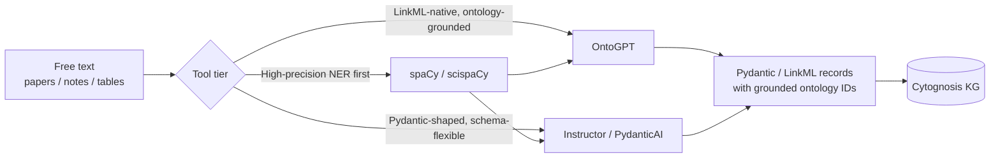
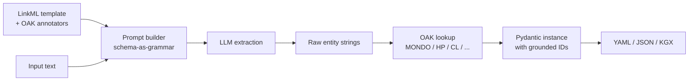
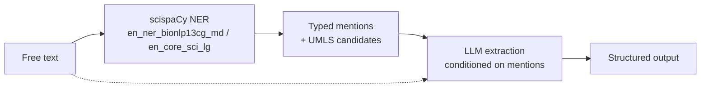

# 20 — Structured Extraction with Schemas and Ontologies

> **Goal** – pull structured, ontology-grounded data out of free text
> using LinkML schemas: OntoGPT for templated extraction, Instructor /
> PydanticAI for general-purpose Pydantic-typed LLM extraction, and
> spaCy / scispaCy as the fallback / high-precision NER layer.
> **Time** – 75 minutes.
> **Prereqs** – chapter 01 (LinkML), chapter 04 (Biolink), chapter 19
> (LLM patterns).

---

## Why this chapter exists

You'll constantly need to turn free text — paper abstracts, clinical
notes, EHR free-text fields, supplementary tables in PDFs — into
typed records that match your LinkML schema. The naïve "ask GPT to
return JSON" pattern works *until it doesn't*: hallucinated entities,
inconsistent IDs, no provenance, schema drift. The tools below all
solve this with **schema-conditioned generation** and **ontology-
grounded entity normalization**.



---

## 1. OntoGPT — templated extraction with LinkML and ontologies

Repo: https://github.com/monarch-initiative/ontogpt

OntoGPT is the **canonical LinkML-aware extraction tool**. You author
a LinkML schema with `annotations:` that tag slots with target
ontologies (CL, MONDO, HP, etc.), point OntoGPT at free text, and it
produces a Pydantic instance with **ontology-grounded IDs** rather
than free-text strings.

### 1.1 Install

```bash
pip install ontogpt
ontogpt --help
```

OntoGPT supports many LLM backends (OpenAI, Anthropic, local Ollama).
Set credentials per their docs.

### 1.2 Author a templated schema

A "template" is just a LinkML schema with extraction annotations:

```yaml
# templates/disease_phenotype.yaml
id: https://cytognosis.org/templates/disease_phenotype
name: disease_phenotype_template
prefixes:
  cyto: https://cytognosis.org/
  linkml: https://w3id.org/linkml/
  MONDO: http://purl.obolibrary.org/obo/MONDO_
  HP:    http://purl.obolibrary.org/obo/HP_
default_prefix: cyto
imports:
  - linkml:types

classes:
  CaseReport:
    tree_root: true
    description: One patient case extracted from free text.
    attributes:
      disease:
        description: The primary disease the case is about.
        range: Disease
      phenotypes:
        description: All phenotypic features mentioned.
        multivalued: true
        range: PhenotypicFeature

  Disease:
    description: A disease grounded in MONDO.
    attributes:
      id:
        identifier: true
        annotations:
          annotators: sqlite:obo:mondo

  PhenotypicFeature:
    description: A phenotype grounded in HPO.
    attributes:
      id:
        identifier: true
        annotations:
          annotators: sqlite:obo:hp
```

The key magic: `annotations.annotators: sqlite:obo:mondo` tells OntoGPT
"when you extract a Disease, look it up in the OAK MONDO adapter and
return the canonical MONDO ID, not free text."

### 1.3 Run extraction

```bash
echo "A 6-year-old female presented with cystic fibrosis, exhibiting
chronic cough, recurrent pulmonary infections, and pancreatic
insufficiency." > text.txt

ontogpt extract \
  -t templates/disease_phenotype.yaml \
  -i text.txt \
  -o build/extracted.yaml \
  -m claude-sonnet-4-6
```

Output (excerpt):

```yaml
disease:
  id: MONDO:0009061           # cystic fibrosis — looked up via OAK
  label: cystic fibrosis
phenotypes:
  - id: HP:0031246
    label: chronic cough
  - id: HP:0006532
    label: recurrent pneumonia
  - id: HP:0001737
    label: pancreatitis
```

Notice every extracted entity has an **ontology ID**, not free text.
That's what makes OntoGPT outputs ingest-ready for the Cytognosis KG.

### 1.4 What OntoGPT does under the hood



Three things this gets you over hand-rolling:

1. **Schema-as-grammar.** The LinkML schema becomes the LLM's output
   contract — it can't return shapes that don't fit.
2. **Ontology grounding via OAK.** Free-text mentions become canonical
   IDs. Same OAK adapter you used in chapters 14 and 18.
3. **Reusable templates.** Schemas are versioned, shareable, and live
   alongside your other Cytognosis LinkML.

---

## 2. Instructor — Pydantic + LLM, schema-flexible

Docs: https://python.useinstructor.com/

Instructor is a thinner wrapper: it takes any Pydantic model and
makes the LLM return instances of it. Less ontology-aware than
OntoGPT, but much more flexible — works with any Pydantic schema you
have lying around (including the ones you codegen from LinkML).

### 2.1 Install

```bash
pip install instructor anthropic
```

### 2.2 LinkML → Pydantic → Instructor — the canonical Cytognosis pattern

```bash
gen-pydantic templates/disease_phenotype.yaml \
  > build/disease_phenotype_pydantic.py
```

```python
from build.disease_phenotype_pydantic import CaseReport
import instructor
from anthropic import Anthropic

client = instructor.from_anthropic(Anthropic())

text = """A 6-year-old female presented with cystic fibrosis,
exhibiting chronic cough, recurrent pulmonary infections, and
pancreatic insufficiency."""

case = client.messages.create(
    model="claude-sonnet-4-6",
    max_tokens=1024,
    messages=[{"role": "user",
               "content": f"Extract a CaseReport from:\n\n{text}"}],
    response_model=CaseReport,
)

print(case.model_dump_json(indent=2))
```

Note: Instructor returns a **typed Pydantic instance** with all the
LinkML pattern/range constraints enforced. If the LLM tries to put
"hyperglycemia" in a slot whose `range: Disease` requires a MONDO
pattern, Pydantic raises before any downstream code runs.

### 2.3 Where Instructor fits vs OntoGPT

| Need | Tool |
| --- | --- |
| Ontology grounding (free text → MONDO ID) | **OntoGPT** |
| Generic structured extraction with no ontology lookup | **Instructor** |
| Quick prototype, no LinkML yet | **Instructor** |
| Production, ontology-grounded, reproducible | **OntoGPT** (or Instructor + post-process via OAK) |
| Works with non-LinkML Pydantic | **Instructor** |

For Cytognosis: OntoGPT for clinical/phenotype extraction (where
ontology IDs are mandatory); Instructor for everything else (paper
metadata, scholarly artifacts, lighter-weight extraction tasks).

---

## 3. PydanticAI

Docs: https://pydantic.dev/docs/ai/overview/

PydanticAI is the official Pydantic team's LLM agent framework — same
Pydantic-typed extraction guarantee as Instructor, plus an agent
runtime with tool use, dependencies injection, and streaming.

### 3.1 Install

```bash
pip install pydantic-ai
```

### 3.2 Agentic extraction example

```python
from pydantic_ai import Agent
from build.disease_phenotype_pydantic import CaseReport

agent = Agent(
    "anthropic:claude-sonnet-4-6",
    result_type=CaseReport,
    system_prompt=(
        "You are a clinical text extractor. Return a CaseReport with "
        "disease and phenotypes grounded in MONDO and HPO IDs. If you "
        "are unsure of an ID, leave it null rather than guessing."
    ),
)

result = agent.run_sync("A 6-year-old female presented with...")
print(result.data.model_dump_json(indent=2))
```

### 3.3 PydanticAI vs Instructor

PydanticAI is a fuller agent framework (think LangChain-lite from the
Pydantic team), while Instructor is a thin extraction layer. For
Cytognosis:

- **Instructor** when you just want one-shot typed extraction.
- **PydanticAI** when the extraction needs tool use (look up an ID,
  call a calculator, hit a web API mid-extraction).

Both compose with LinkML-codegen'd Pydantic identically.

---

## 4. Hands-on: end-to-end LinkML → Pydantic → Instructor

This is the hands-on the user asked for explicitly. Build it once;
reuse the pattern everywhere.

### 4.1 Schema

```bash
mkdir -p schemas/extraction build/extraction
cat > schemas/extraction/cohort_card.yaml <<'YAML'
id: https://cytognosis.org/schemas/cohort_card
name: cohort_card
prefixes:
  cyto: https://cytognosis.org/
  linkml: https://w3id.org/linkml/
  MONDO: http://purl.obolibrary.org/obo/MONDO_
  HP:    http://purl.obolibrary.org/obo/HP_
default_prefix: cyto
imports:
  - linkml:types
classes:
  CohortCard:
    tree_root: true
    attributes:
      cohort_name: {range: string}
      n_patients: {range: integer}
      median_age_years: {range: float}
      primary_disease:
        range: uriorcurie
        pattern: "^MONDO:[0-9]+$"
      sex_distribution:
        range: SexDistribution
      key_phenotypes:
        multivalued: true
        range: uriorcurie
        pattern: "^HP:[0-9]+$"
  SexDistribution:
    attributes:
      n_female: {range: integer}
      n_male: {range: integer}
YAML
```

### 4.2 Codegen Pydantic

```bash
gen-pydantic schemas/extraction/cohort_card.yaml \
  > build/extraction/cohort_card_pydantic.py
```

### 4.3 Extract with Instructor

```python
# scripts/extract_cohort_card.py
import sys
import instructor
from anthropic import Anthropic
from build.extraction.cohort_card_pydantic import CohortCard

client = instructor.from_anthropic(Anthropic())

text = sys.stdin.read()

card = client.messages.create(
    model="claude-sonnet-4-6",
    max_tokens=1024,
    messages=[{"role": "user", "content": (
        "Extract a CohortCard from the methods section below. "
        "If a value is not stated, omit it; do not guess.\n\n" + text
    )}],
    response_model=CohortCard,
)

print(card.model_dump_json(indent=2))
```

```bash
echo "We enrolled 142 children with cystic fibrosis (78 female, 64 male,
median age 7.3y). Common findings included chronic cough, recurrent
pulmonary infections, and pancreatic insufficiency." | \
  python scripts/extract_cohort_card.py
```

Expected output:

```json
{
  "cohort_name": null,
  "n_patients": 142,
  "median_age_years": 7.3,
  "primary_disease": "MONDO:0009061",
  "sex_distribution": { "n_female": 78, "n_male": 64 },
  "key_phenotypes": ["HP:0031246", "HP:0006532", "HP:0001737"]
}
```

> Important caveat: Instructor relies on the LLM to produce the right
> ontology IDs, with no actual lookup. Numbers and names are fine;
> ontology IDs are flaky. For ontology grounding, switch to OntoGPT (§1)
> or post-process with OAK (chapter 18 tier 1).

### 4.4 OntoGPT-grounded version

```bash
ontogpt extract \
  -t schemas/extraction/cohort_card.yaml \
  -i text.txt \
  -o build/extraction/cohort_card.yaml \
  -m claude-sonnet-4-6
```

Compare outputs — the OntoGPT version's `MONDO:` and `HP:` IDs will be
*correct* because they came from OAK lookup, not LLM guess.

---

## 5. Where spaCy / scispaCy fit

spaCy is the classical NLP framework; scispaCy adds biomedical models
(NER for genes, diseases, drugs, anatomy) plus UMLS linkers.

### 5.1 The relationship to LLM-based extraction



scispaCy is *much* faster and *much* cheaper than LLM extraction, and
its UMLS entity linker gives you ontology IDs without any LLM call.
For high-volume processing (e.g., 100k abstracts), running scispaCy
first to identify candidate mentions and then using an LLM only for
ambiguous cases is dramatically more efficient.

### 5.2 Install

```bash
pip install spacy scispacy
pip install https://s3-us-west-2.amazonaws.com/ai2-s2-scispacy/releases/v0.5.4/en_core_sci_lg-0.5.4.tar.gz

# Optional: UMLS linker
python -c "import scispacy; from scispacy.linking import EntityLinker"
```

### 5.3 Minimal pipeline

```python
import spacy
from scispacy.linking import EntityLinker

nlp = spacy.load("en_core_sci_lg")
nlp.add_pipe("scispacy_linker", config={"resolve_abbreviations": True,
                                         "linker_name": "umls"})

doc = nlp("The patient was diagnosed with cystic fibrosis and exhibits "
          "chronic cough and pancreatic insufficiency.")

linker = nlp.get_pipe("scispacy_linker")
for ent in doc.ents:
    print(ent.text, ent.label_)
    for cui, score in ent._.kb_ents[:3]:
        kb_ent = linker.kb.cui_to_entity[cui]
        print(f"  CUI:{cui} ({score:.2f})  {kb_ent.canonical_name}")
```

### 5.4 Hybrid scispaCy + Instructor pattern

```python
import spacy, instructor
from anthropic import Anthropic

nlp = spacy.load("en_core_sci_lg")
client = instructor.from_anthropic(Anthropic())

def extract_cohort_card(text: str) -> CohortCard:
    # Step 1: NER candidate mentions cheaply
    doc = nlp(text)
    candidates = [(e.text, e.label_) for e in doc.ents]

    # Step 2: condition LLM on the NER mentions
    return client.messages.create(
        model="claude-haiku-4-5-20251001",   # cheaper; we've narrowed scope
        messages=[{"role": "user", "content": (
            f"Mentions detected: {candidates}\n\nText: {text}\n\n"
            "Build a CohortCard."
        )}],
        response_model=CohortCard,
    )
```

This pattern reduces LLM cost by ~10x on long text without losing
accuracy.

### 5.5 Where it sits in the Cytognosis stack

| Tier | Tool | Best for |
| --- | --- | --- |
| 0 (cheapest) | scispaCy NER + UMLS linker | Bulk pre-annotation; CUI-level grounding |
| 1 | OntoGPT | LinkML-templated extraction with OAK ontology grounding |
| 2 | Instructor / PydanticAI | Pydantic-typed extraction, no ontology constraints |
| 3 (most expensive) | Agentic LangGraph (chapter 19) | Multi-step extraction with tool use |

Most production pipelines combine: scispaCy first to prune, then
OntoGPT or Instructor for the typed final extraction.

---

## 6. Hands-on

1. Install OntoGPT, Instructor, PydanticAI, scispaCy.
2. Write the §4.1 LinkML template, codegen Pydantic.
3. Run extraction with Instructor (§4.3) on three sample texts.
4. Run the OntoGPT version (§4.4) on the same three texts. Compare
   ontology-ID accuracy between the two.
5. Add a scispaCy pre-pass (§5.4); measure latency and cost difference
   on a 50-abstract sample.

---

## 7. Pitfalls

- **LLM-guessed ontology IDs are wrong more often than they look.**
  Always ground via OntoGPT/OAK before trusting them.
- **Schema bloat.** OntoGPT prompt size grows with schema complexity;
  keep templates focused (one extraction task per template).
- **Hallucinated values look plausible.** Add `pattern:` constraints
  to LinkML slots — Pydantic enforcement catches a lot.
- **scispaCy models are large** (~700 MB for `en_core_sci_lg`).
  Cache aggressively; don't re-download per CI run.
- **UMLS linker requires UMLS access.** scispaCy ships a public-data
  fallback that works but with reduced coverage; full UMLS gives best
  results.
- **Don't mix temperature settings.** For typed extraction set
  `temperature=0`. Drift between runs is a debugging nightmare
  otherwise.

---

## Further reading

- OntoGPT: https://github.com/monarch-initiative/ontogpt
- OntoGPT docs: https://monarch-initiative.github.io/ontogpt/
- Instructor: https://python.useinstructor.com/
- PydanticAI: https://pydantic.dev/docs/ai/overview/
- spaCy: https://spacy.io/
- scispaCy: https://allenai.github.io/scispacy/
- LinkML annotators: https://linkml.io/linkml/schemas/annotations.html
