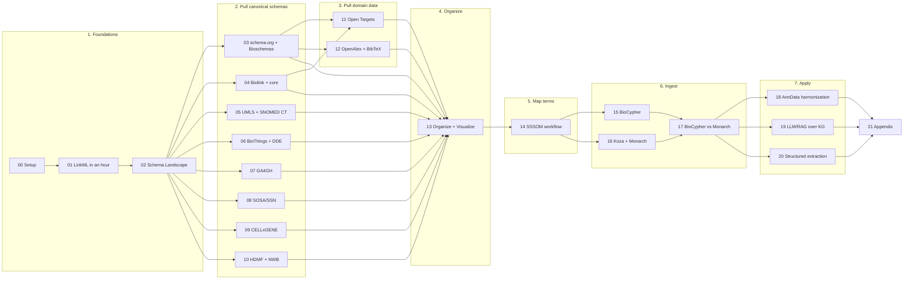

# LinkML + KG Playbook for Cytognosis

A hands-on, end-to-end tutorial for building, organizing, validating,
ingesting, and applying biomedical knowledge graphs with LinkML,
Biolink, BioCypher, Koza, SSSOM, OntoGPT, biochatter and friends.

Designed to be read in short, self-contained chapters. Every chapter
has the same skeleton so you always know where you are:

> **Goal** – the one thing you'll be able to do at the end.
> **Time** – realistic estimate.
> **Prereqs** – earlier chapters or installs you need.
> **Hands-on** – copy-paste-runnable steps.
> **Checkpoint** – verify you got it right.
> **Pitfalls** – the traps I've stepped in so you don't have to.
> **Further reading** – authoritative links for going deeper.

---

## Who this is for

You already maintain `cytognosis_scholarly_kg_v0.4.0.yaml`. You want to
turn it into a production knowledge graph that:

1. Reuses canonical schemas (schema.org, Bioschemas, Biolink, SSSOM,
   UMLS/SNOMED, BioThings/DDE, GA4GH, SOSA/SSN, CELLxGENE, HDMF/NWB)
   instead of reinventing them.
2. Ingests real domain data (Open Targets, OpenAlex, BibTeX) using the
   same conversion patterns.
3. Has a clean inheritance structure with cross-ontology mappings
   (SSSOM) wired in.
4. Materializes via BioCypher (for Neo4j) or Koza (for KGX) — or both,
   when each is the right tool.
5. Powers downstream applications — single-cell harmonization, LLM/RAG
   over the KG, structured extraction from text — using your typed
   schemas as grounding.

---

## The story this playbook tells (8 stages, 22 chapters)



The arc:

1. **Foundations** (00–02) — install, learn LinkML, get the map.
2. **Pull canonical schemas** (03–10) — convert each upstream schema
   family to LinkML.
3. **Pull domain data** (11–12) — same patterns applied to real data
   sources.
4. **Organize** (13) — assemble the master schema and visualize.
5. **Map terms** (14) — wire SSSOM in for cross-ontology bridges.
6. **Ingest** (15–17) — BioCypher (Neo4j), Koza+Monarch (KGX), and
   the comparative chapter that shows when to use each.
7. **Apply** (18–20) — CELLxGENE-compliant AnnData harmonization, LLM
   and RAG over the KG, structured extraction from text.
8. **Reference** (21) — cheatsheets, common errors, link pack.

Read linearly in a few hours, or skim 00–02 and jump to whichever
chapter solves today's problem. Each chapter is 30–90 minutes
hands-on.

---

## Repo layout

```
linkml_kg_playbook/
├── README.md                              # this file
│
├── 00_setup.md                            # 1. FOUNDATIONS
├── 01_linkml_in_an_hour.md
├── 02_schema_landscape.md
│
├── 03_jsonld_to_linkml.md                 # 2. PULL CANONICAL SCHEMAS
├── 04_biolink_and_core_schemas.md
├── 05_umls_snomed.md
├── 06_biothings.md
├── 07_ga4gh.md
├── 08_sosa_ssn_to_linkml.md
├── 09_cellxgene_to_linkml.md
├── 10_hdmf_nwb.md
│
├── 11_open_targets_to_linkml.md           # 3. PULL DOMAIN DATA
├── 12_openalex_bibtex_to_linkml.md
│
├── 13_organize_and_visualize.md           # 4. ORGANIZE
│
├── 14_sssom_snomed_workflow.md            # 5. MAP TERMS
│
├── 15_biocypher.md                        # 6. INGEST
├── 16_koza_and_monarch.md
├── 17_biocypher_vs_monarch.md
│
├── 18_anndata_harmonization.md            # 7. APPLY
├── 19_llm_rag_for_biology.md
├── 20_structured_extraction.md
│
├── 21_appendix.md                         # 8. REFERENCE
│
└── bin/
    ├── setup_env.sh
    └── download_schemas.sh
```

---

## Quick navigation

### 1. Foundations

| Need to… | Go to |
| --- | --- |
| Set up Python + LinkML + tools | [00_setup.md](00_setup.md) |
| Write your first LinkML schema | [01_linkml_in_an_hour.md](01_linkml_in_an_hour.md) |
| Get a map of every schema in this universe | [02_schema_landscape.md](02_schema_landscape.md) |

### 2. Pull canonical schemas

| Need to… | Go to |
| --- | --- |
| Pull schema.org / Bioschemas in | [03_jsonld_to_linkml.md](03_jsonld_to_linkml.md) |
| Pull Biolink + SSSOM + others | [04_biolink_and_core_schemas.md](04_biolink_and_core_schemas.md) |
| Convert UMLS / SNOMED CT (RF2 → OWL → LinkML) | [05_umls_snomed.md](05_umls_snomed.md) |
| Use BioThings APIs / publish on DDE | [06_biothings.md](06_biothings.md) |
| Bulk-extract a BioThings backend to Parquet | [06_biothings.md](06_biothings.md) §1.3 |
| Inventory and convert DDE schemas to LinkML | [06_biothings.md](06_biothings.md) §3.5 |
| Convert GA4GH VRS / VA / Phenopackets / Pedigree | [07_ga4gh.md](07_ga4gh.md) |
| Convert SOSA/SSN | [08_sosa_ssn_to_linkml.md](08_sosa_ssn_to_linkml.md) |
| Convert CZI CELLxGENE | [09_cellxgene_to_linkml.md](09_cellxgene_to_linkml.md) |
| Use HDMF / NWB / HERD with LinkML schemas | [10_hdmf_nwb.md](10_hdmf_nwb.md) |

### 3. Pull domain data

| Need to… | Go to |
| --- | --- |
| Convert Open Targets schemas | [11_open_targets_to_linkml.md](11_open_targets_to_linkml.md) |
| Convert OpenAlex + BibTeX | [12_openalex_bibtex_to_linkml.md](12_openalex_bibtex_to_linkml.md) |

### 4. Organize

| Need to… | Go to |
| --- | --- |
| Decide one-file vs many-file layout | [13_organize_and_visualize.md](13_organize_and_visualize.md) |
| Visualize the inheritance tree and find gaps | [13_organize_and_visualize.md](13_organize_and_visualize.md) |

### 5. Map terms

| Need to… | Go to |
| --- | --- |
| Load and use OLS4 SSSOM TSVs | [14_sssom_snomed_workflow.md](14_sssom_snomed_workflow.md) |

### 6. Ingest

| Need to… | Go to |
| --- | --- |
| Understand BioCypher + build an adapter | [15_biocypher.md](15_biocypher.md) |
| Understand Koza + Monarch ecosystem + KG | [16_koza_and_monarch.md](16_koza_and_monarch.md) |
| Decide BioCypher vs Monarch + Open Targets / STRING use cases | [17_biocypher_vs_monarch.md](17_biocypher_vs_monarch.md) |

### 7. Apply

| Need to… | Go to |
| --- | --- |
| Validate + harmonize AnnData | [18_anndata_harmonization.md](18_anndata_harmonization.md) |
| Build LLM/RAG over the Cytognosis KG (biochatter, phenomics-assistant, LangGraph) | [19_llm_rag_for_biology.md](19_llm_rag_for_biology.md) |
| Extract structured data from text (OntoGPT, Instructor, scispaCy) | [20_structured_extraction.md](20_structured_extraction.md) |

### 8. Reference

| Need to… | Go to |
| --- | --- |
| Cheatsheets, common errors, link pack | [21_appendix.md](21_appendix.md) |

---

## How to use this if you have ADHD

- **Read in 30-minute pomodoros.** Each chapter is sized for one.
- **Skim the table at the top, then run the hands-on box.** Don't try
  to read every word the first pass.
- **Highlight the Pitfalls box** — that's where the time-saving lives.
- **Ignore optional sections** marked with `*`. They're depth, not
  core.
- **The Checkpoint box is your "done" signal.** If it passes, move on.

---

## Pinned versions used in this playbook

| Tool | Version assumed | Why pinned |
| --- | --- | --- |
| Python | 3.11+ | LinkML 1.7+ requires it |
| linkml | ≥ 1.7 | gen-erdiagram, gen-pydantic v2 |
| linkml-runtime | matches linkml | runtime classes |
| schema-automator | ≥ 0.4 | import-rdfs, import-jsonschema |
| sssom | ≥ 0.4 | OLS4 TSV header support |
| oaklib | ≥ 0.6 | runoak lexmatch + mappings |
| biocypher | ≥ 0.7 | Biolink schema injection |
| biochatter | ≥ 0.5 | LangGraph KG agent |
| koza | ≥ 0.6 | LinkML-driven configs |
| anndata | ≥ 0.10 | AnnData v2 layout |
| cellxgene-schema | ≥ 5.2 | CL/MONDO pinned versions |
| hdmf | ≥ 3 | term sets / HERD |
| pynwb | ≥ 2.5 | NWB 2.7+ schema |
| ontogpt | ≥ 1.0 | OAK-based grounding |
| instructor | ≥ 1 | Anthropic-from-anthropic helper |
| scispacy | ≥ 0.5 | UMLS linker |

If your versions are older, expect mostly-similar but not-identical
output.

---

## Companion docs

- `sssom_tooling_for_cytognosis.md` — detailed reference for the SSSOM
  stack, written first; this playbook expands it into runnable form.
- `cytognosis_scholarly_kg_v0.4.0.yaml` — the existing schema you're
  extending.
- `_data/umls/` and `_data/snomed/` — read-only mirrors of upstream
  releases (per chapter 05). Don't modify; always work from copies in
  `linkml_kg_playbook/downloads/`.
