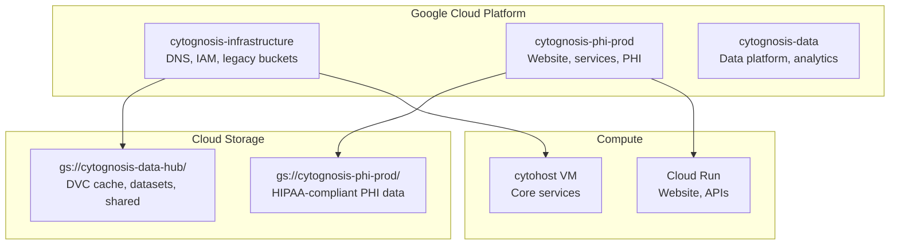
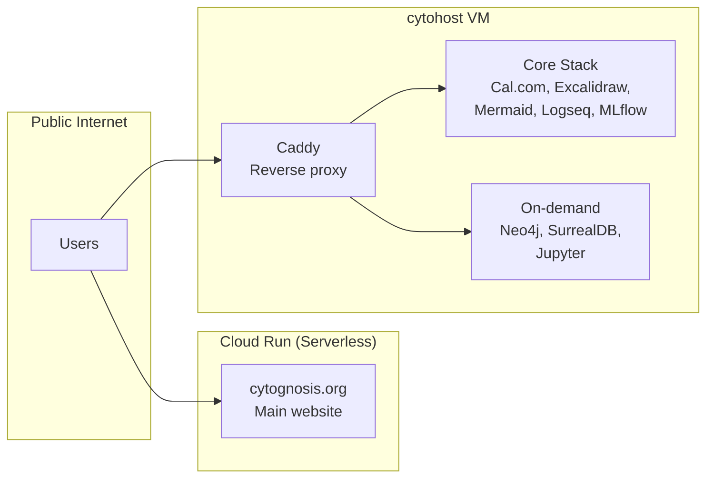

# Infrastructure Architecture Overview

> v1.0 | Last updated: 2026-05-26

The Cytognosis infrastructure follows extreme simplicity, serverless-first, and HIPAA-ready architectural choices. Three GCP projects, three domain TLDs, and a composable container framework serve all platform needs.

## GCP Project Topology



| Project ID | Purpose | Classification |
|------------|---------|----------------|
| `cytognosis-infrastructure` | DNS zones, IAM root, legacy buckets | Management |
| `cytognosis-phi-prod` | Website, services, user data | **Sensitive (PHI)** |
| `cytognosis-data` | Data platform, analytics | Regulated |

## Domain Architecture

Three primary apex domains:

| Domain | Purpose | Registrar |
|--------|---------|-----------|
| `cytognosis.org` | Primary canonical | Squarespace |
| `cytognosis.com` | Secondary canonical | Squarespace |
| `cytognosis.ai` | Technology canonical | Squarespace |

DNS routing uses a dual-zone topology in Cloud DNS for backward compatibility:

- Active canonical zones: `cg-org`, `cg-com`, `cg-ai`
- Legacy fallback zones: `org-zone`, `com-zone`, `ai-zone`

## Service Architecture



### On-Demand Service Model

Services default OFF and start when needed. The `core` stack runs always-on behind Caddy. Everything else (Neo4j, Jupyter, SurrealDB) starts on demand via `stack_manager.py`.

| Stack | Services | Mode |
|-------|----------|------|
| **core** | Caddy, Cal.com, Excalidraw, Mermaid, Logseq, MLflow | Always-on |
| **research** | Neo4j, Jupyter, MLflow | On-demand |
| **neo4j-only** | Neo4j | On-demand |

See [Container Framework](container-framework.md) for full details.

## Data Layer

```
gs://cytognosis-data-hub/
├── dvc-cache/                 Content-addressed DVC cache (shared)
├── processed/cytos/dvc/       Cytos project DVC remote
├── purdue/                    Collaborator workspace
├── shared/
│   ├── soma/                  TileDB-SOMA exports
│   ├── gwas/                  GWAS summary statistics
│   ├── embeddings/            Feature vectors
│   └── reference/             GRCh38, GENCODE GTFs
├── public-mirror/             Public dataset mirrors
└── manifests/                 Dataset manifest JSONs
```

See [GCP Setup](gcp-setup.md) and [DVC Strategy](dvc-strategy.md) for details.

## Provenance Stack

```
L0: DVC + VFS         Content-addressed hashes, SWHID for code
L1: redun / Nextflow  Workflow DAG lineage
L2: Artifact Registry Queryable metadata
L3: MLflow            Experiment tracking
L4: RO-Crate          FAIR publication packages
```

## Related Documentation

- [GCP Setup](gcp-setup.md)
- [Container Framework](container-framework.md)
- [DVC Strategy](dvc-strategy.md)
- [Master Infrastructure](MASTER_INFRASTRUCTURE.md)
