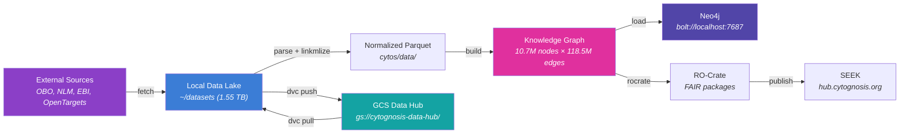

# Data Infrastructure Overview

> ADHD-friendly quick reference. For full details, see the [infrastructure repo docs](file:///home/mohammadi/repos/cytognosis/infrastructure/docs/data-strategy/).

## How Data Flows



## GCS Bucket Map

| Bucket | Purpose | Access | Project |
|--------|---------|--------|---------|
| `cytognosis-data-hub` | DVC cache + shared data | T2 | infra |
| `cytognosis-internal` | Non-PHI ops | T2 | infra |
| `cytognosis-public-data` | De-identified open data | T1 | infra |
| `cytognosis-phi-core` | Raw PHI vault (CMEK) | T4 | phi-prod |
| `cytognosis-phi-collab-nih` | Restricted joint-analysis | T3 | phi-prod |
| `cytognosis` | Public media/assets | T1 | infra |

## Provenance Stack (5 Layers)

| Layer | Tool | What It Tracks |
|-------|------|----------------|
| L0 | **DVC + VFS** | Dataset versions, content hashes |
| L1 | **redun / Nextflow** | Workflow DAG, call graph lineage |
| L2 | **Artifact Registry** | Queryable metadata, biological context |
| L3 | **MLflow** | Experiments, hyperparameters, metrics |
| L4 | **RO-Crate** | FAIR publication packages |

## Quick Commands

```bash
# Check DVC status
conda activate cytognosis && dvc version

# Track a file
dvc add ~/datasets/01-ontologies/go/go-plus.owl

# Push to cloud
dvc push

# Pull from cloud
dvc pull

# Run cytos KG pipeline
cd ~/repos/cytognosis/cytos && dvc repro

# Check Neo4j
cypher-shell -u neo4j -p cytognosis2026 "MATCH (n) RETURN count(n)"
```

## Access Tiers (Unified)

| Tier | Label | Auth Required | GCS Location |
|------|-------|---------------|-------------|
| T1 | Open | None | `cytognosis-public-data` |
| T2 | Registered | Click-through DUA | `cytognosis-data-hub` |
| T3 | Controlled | DAR + IRB + DUC | `cytognosis-data-hub` (restricted) |
| T4 | Restricted (PHI) | HIPAA + BAA | `cytognosis-phi-core` |

## Wave-Based Ingestion

| Wave | What | Status |
|------|------|--------|
| **0** | Infra testing: GO-Plus, OLS4 SSSOM, UMLS/SnomedCT verify | 🔄 In progress |
| **1** | Public KGs: Monarch, PrimeKG, Open Targets, UniChem | 📋 Next |
| **2** | Controlled: NBB, PEC, PsychAD, ROSMAP | 📋 After DUC |
| **3** | PHI cohorts | 📋 After HIPAA controls |

## Related Docs

- [DVC Configuration](file:///home/mohammadi/repos/cytognosis/infrastructure/docs/data-strategy/dvc-configuration.md)
- [Dataset Catalog](file:///home/mohammadi/repos/cytognosis/infrastructure/docs/data-strategy/catalog.yaml)
- [Download Sources](file:///home/mohammadi/repos/cytognosis/infrastructure/docs/data-strategy/download-sources.yaml)
- [Data Hub Architecture](file:///home/mohammadi/repos/cytognosis/infrastructure/docs/data-strategy/data-hub.md)
- [Master Data Strategy](file:///home/mohammadi/repos/cytognosis/infrastructure/docs/data-strategy/master-data-strategy.md)
