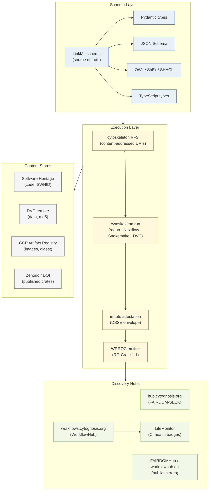

# Reproducibility & FAIR Strategy
**Applies to**: all Cytognosis repos — cytoskeleton, cytos, Yar, neuro-*
**Status**: Strategy complete; implementation in progress (cytoskeleton v2 Phase 1)
**Last updated**: 2026-05-22

---

## The Goal in One Sentence

Any Cytognosis computational result published after 2026 should be verifiable and
re-runnable by a third party using only public resources and a single command:
```bash
cytoskeleton reproduce <doi-or-crate-ref>
```

---

## Six Core Principles

| # | Principle | Key technology |
|---|---|---|
| P1 | **cytoskeleton is the single asset and environment manager** | VFS, RO-Crate emitter, schema registry |
| P2 | **LinkML is the single schema source of truth** | Compiles to Pydantic, JSON Schema, GraphQL, OWL, ShEx, SHACL, SQL DDL, TypeScript |
| P3 | **Artifacts are content-addressed; configs reference them by ID** | SWHID (code), DVC md5 (data), sha256 (blobs), OCI digest (images) |
| P4 | **Environments and containers are signed and pinned** | uv lockfiles, OCI images, sigstore, pixi |
| P5 | **Every run emits a Workflow Run Crate (WRROC)** | RO-Crate + in-toto attestation + OTel trace |
| P6 | **FAIRDOM-SEEK + WorkflowHub are the public hubs** | Self-hosted SEEK, workflowhub.eu |

---

## Architecture



---

## Document Map

| Doc | Contents |
|---|---|
| [schema-strategy.md](schema-strategy.md) | LinkML as single schema source; compilation targets; ISA, RO-Crate, GA4GH alignment |
| [artifact-vfs-swhid.md](artifact-vfs-swhid.md) | Virtual File System design; content-addressing; driver implementations; hash strategy |
| [envs-containers.md](envs-containers.md) | 66-cell env matrix; OCI image policy; sigstore signing; SLSA L3 |
| [provenance-lineage.md](provenance-lineage.md) | in-toto attestation; DSSE envelopes; WRROC/Process Run Crate/Five Safes Crate structure |
| [seek-workflowhub.md](seek-workflowhub.md) | SEEK/WorkflowHub deployment; LifeMonitor; FAIRSCAPE; public mirroring |
| [acceptance-kpis.md](acceptance-kpis.md) | Definitions of "Reproducible", "FAIR Workflow", "FAIR Dataset", "FAIR Model"; monthly KPIs |

---

## Implementation Phases

| Phase | What | Status |
|---|---|---|
| cytoskeleton v2 core | VFS drivers, WRROC emitter, schema registry | ⏳ In design |
| First cytos migration | Migrate biolink source config to VFS + SWHID | ⏳ Pending cytoskeleton v2 |
| SEEK bring-up | Deploy FAIRDOM-SEEK on Cloud Run | ⏳ Phase 11 (infrastructure) |
| WorkflowHub bring-up | Deploy WorkflowHub on Cloud Run | ⏳ Phase 11 |
| cytos full migration | All 10 source configs + dvc.yaml generated from LinkML | ⏳ Phase 6 |
| Yar integration | Capture pipeline emits Process Run Crates | ⏳ Phase 7 |
| Public mirroring | workflowhub.eu + FAIRDOMHub Programme registration | ⏳ With first public release |

---

## Quick-Start Verification Commands

```bash
# Validate a published Crate
cytoskeleton verify crate <path-or-doi>

# Reproduce a published run
cytoskeleton reproduce <doi-or-crate-ref>

# Verify a code SWHID against a local checkout
cytoskeleton verify swhid /path/to/repo

# Verify a container image signature + CVEs
cytoskeleton verify image us-central1-docker.pkg.dev/.../cytognosis-base:v2.1.0

# Full audit of a local run
cytoskeleton audit run .crates/<run-id>/
```

---

## Success Criterion

At EOY 2026, a researcher outside Cytognosis can:
1. Find a Cytognosis result on Zenodo / Google Scholar.
2. Run `cytoskeleton reproduce <doi>`.
3. Have the workflow re-execute, pulling code by SWHID, image by OCI digest, and data by sha256.
4. Receive outputs whose hashes match within numerical tolerance (`REPRODUCIBLE` or `EQUIVALENT`).
5. See LifeMonitor green badge confirming the workflow's tests still pass.
6. Generate a BibTeX entry via `cytoskeleton cite`.
