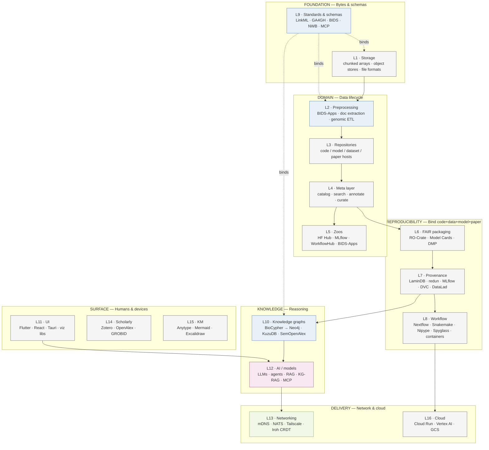
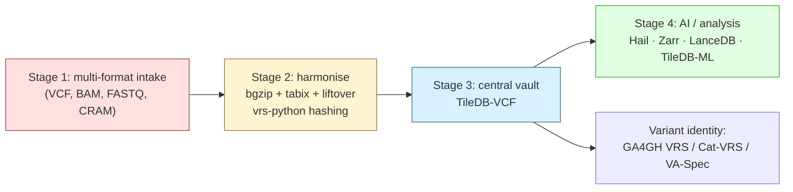
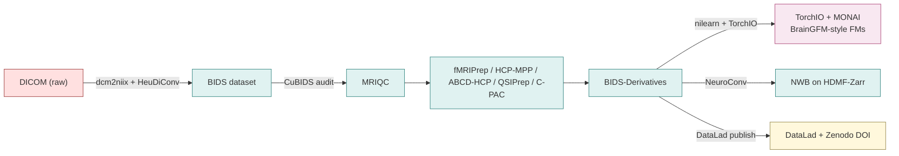
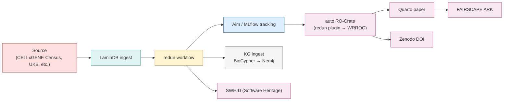
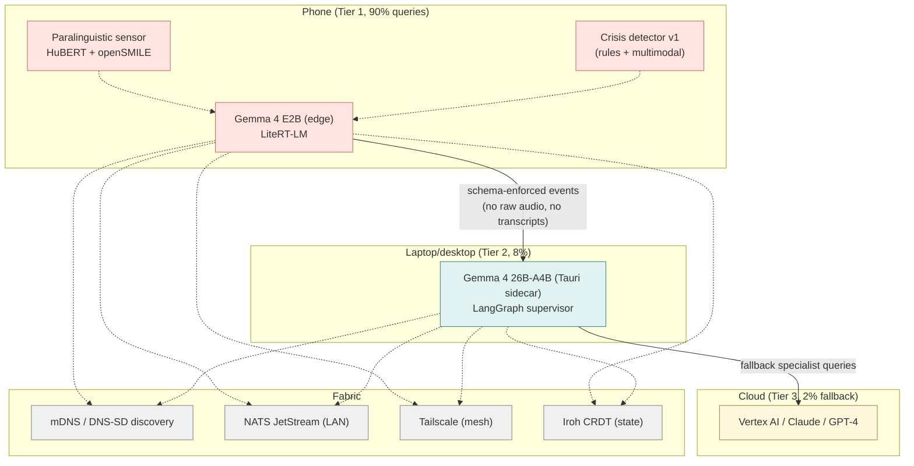

# Cytognosis Infrastructure Stack

> How the bytes become FAIR-published reasoning, layer by layer, with the actual tools at each layer named.

Companion to [`tools-master-catalog.md`](tools-master-catalog.md) (the catalog) and [`tools-master-catalog.xlsx`](tools-master-catalog.xlsx) (the searchable spreadsheet). This doc focuses on the *infrastructure* — storage, repositories, the meta layer that annotates/shares/searches them, provenance tracking, FAIR experiment packaging, workflow execution, and how it all fits together as data flows.

## 30-second navigation

- **Layer architecture diagram** → §1
- **Storage options** (file formats + chunked stores + cloud blob stores) → §2
- **Code / model / dataset / paper repositories** → §3
- **Meta layer** — annotate, search, comment, curate, share → §4
- **FAIR experiment packaging** (RO-Crate family) → §5
- **Provenance & lineage** (code / data / model / experiment) → §6
- **Workflow management & resource allocation** → §7
- **Standards, schemas, ontologies** that bind it all together → §8
- **Data flow diagrams** end-to-end → §9
- **The 16-component summary table** → §10
---

## §1. Layer architecture



The **schema layer (L9)** is special — it threads through every other layer rather than sitting between them. LinkML is the source of truth: schemas compile down to L1 (TileDB schemas), L2 (Pydantic types for ingestion), L4 (catalog metadata), L6 (RO-Crate types), L10 (Neo4j labels), and L11 (TypeScript types for UI).
---

## §2. Storage options

Every byte in the system lands in one of five storage tiers. Pick by *what's stored* and *who reads it next.*

### 2.1 Generic chunked array & columnar storage

| Tool | Org | License | When to pick |
|---|---|---|---|
| **TileDB** | TileDB Inc. | MIT | Multi-dimensional with ACID + versioning. Default substrate for genomic / cellular / future connectomic. |
| **Zarr v3** | zarr-developers | MIT | Cloud-native chunked array storage. Default for 4D fMRI volumes + general training-tier arrays. |
| **Apache Parquet** | Apache | Apache 2.0 | Tabular default — per-ROI / per-timepoint stores, Phenopacket tables. |
| **Apache Arrow** | Apache | Apache 2.0 | In-memory columnar interchange. PyArrow is the canonical Python binding. |
| **HDF5** | HDF Group | BSD-3 | Legacy NWB + AnnData h5ad. Use h5py from Python. Reach for HDMF-Zarr when cloud reads matter. |
| **NetCDF4** | Unidata | MIT | xarray backend; labelled multi-dimensional arrays. |
| **polars** | pola-rs | MIT | Faster pandas-style dataframe for in-memory large-table ops. |

### 2.2 Bio-specific storage

| Domain | Tool | Notes |
|---|---|---|
| Genomic (VCF) | **TileDB-VCF** | Eliminates N+1 problem of GenomicsDB; central genomic vault. |
| Genomic (transfer) | **BCF / bgzipped VCF** | Universal interchange. |
| Genomic (raw seq) | **CRAM** | >30% smaller than BAM. |
| Genomic (QC single-node) | **PGEN (PLINK2)** | Default for single-machine QC. |
| Genomic (distributed ETL) | **Hail VDS / MatrixTable** | Spark-based distributed transformations. |
| Genomic (AI training) | **VCF-Zarr / sgkit / LanceDB / SLAF** | Tensor-ready, 300× CPU reduction in some benchmarks. |
| Single-cell | **TileDB-SOMA** | Cellular omics on TileDB; CELLxGENE-schema compliant. |
| Single-cell (legacy) | **AnnData (h5ad)** | Compatibility tier; read via h5py. |
| Bio-imaging | **TileDB-BioImaging** | Note: does NOT support BIDS — substantial wrapper project deferred. |
| Neuroimaging (raw) | **BIDS on filesystem** | CC0 standard. DataLad versions it. |
| Neuroimaging (derived) | **BIDS-Derivatives + HDMF-Zarr** | HDMF-Zarr collapses "FAIR archive" and "model-training" formats into one artifact. |
| Neurophysiology | **NWB on HDF5 or HDMF-Zarr** | Default standard for ephys/ophys/behaviour. |

### 2.3 Blob / cloud object storage

| Tool | License | Notes |
|---|---|---|
| **GCS** (Google Cloud Storage) | proprietary | Default cloud blob store for Cytognosis. |
| **S3** | proprietary | Universal object store; fsspec/s3fs gives cloud-agnostic access. |
| **R2** (Cloudflare) | proprietary | S3-compatible, no egress fees. |
| **AIStor Free** | open | Replacement for MinIO (which was flagged deprecated). |
| ~~MinIO~~ | rejected | License v1.16+ concerns. Use AIStor Free or vendor S3. |

### 2.4 Model weight formats

Pick by *lifecycle phase*, not by personal preference.

| Phase | Format | License | Notes |
|---|---|---|---|
| Public weight distribution | **Safetensors** | Apache 2.0 | Replaces Pickle. Sleepy Pickle attacks evade 89-100% of scanners. |
| Local / edge LLM | **GGUF / GGUFv3** | MIT | 53.5% of HF LLMs ship GGUF; 70B at Q4_K_M fits in 35 GB. |
| Cross-platform inference | **ONNX 1.21+** | MIT | 2-bit quant + TensorRT/CoreML/QNN/WebGPU. |
| Enterprise serving | **TensorFlow SavedModel** | Apache 2.0 | Production TF deployments. |
| Backend-agnostic authoring | **Keras v3 (.keras)** | Apache 2.0 | TF / PyTorch / JAX / OpenVINO targets. |
| Apple Silicon edge | **MLX** | MIT | Native M-series. |
| Mobile NPU | **LiteRT** | Apache 2.0 | Successor to TFLite. |
| PyTorch mobile | **ExecuTorch (.pte)** | BSD-3 | TorchScript successor. |
| Distributed training | **Orbax** | Apache 2.0 | JAX-native checkpointing. |
| Compiler IR | **StableHLO** | Apache 2.0 | 5-year backward-compat guarantee. |
| Browser | **TensorFlow.js + WebGPU** | Apache 2.0 | Client-side inference. |
| ~~Pickle (.pt/.pth)~~ | rejected | — | Arbitrary code execution risk. |
---

## §3. Code / model / dataset / paper repositories

Each artefact type has its own canonical home. Cytognosis uses a *shared external set* + a *small internal mirror*.

### 3.1 Code repositories

| Tool | Role | License |
|---|---|---|
| **GitHub** | Primary code host. Public Cytognosis orgs live here. | proprietary |
| **Software Heritage** | Permanent archival of all open-source code + SWHID minting (ISO 18670:2025). | open |
| **Codeberg** / **Gitea** | Open self-hosting option; Gitea deferred — revisit if GitHub policy changes. | open |
| **Zoekt** | Trigram-indexed code search across many repos. Replaces Sourcegraph (which went private Aug 2024). | Apache 2.0 |
| **GitNexus** | MCP-native code KG via Tree-sitter ASTs + Leiden clustering on KuzuDB. 7 MCP tools (impact / detect_changes / rename / cypher). | MIT |

### 3.2 Model repositories & zoos

| Tool | License | Notes |
|---|---|---|
| **Hugging Face Hub** | Apache 2.0 | Canonical open-model host. |
| **Zenodo** | open | Model + dataset DOIs (often for one-off snapshots). |
| **MLflow Model Registry** | Apache 2.0 | Team-tier internal model registry. |
| **TensorFlow Hub** | Apache 2.0 | TF-specific. |
| **Ollama** | MIT | Local model server with GGUF backend. |
| **DagsHub** | open | Git + UI for ML projects, integrates DVC + MLflow. |

### 3.3 Dataset repositories (generic + bio)

| Repo | Domain | License default |
|---|---|---|
| **Zenodo** | Generic | CC variants |
| **OSF** | Generic + preregistration | CC variants |
| **Figshare** | Generic | various |
| **Dryad** | Generic (sci) | CC0 |
| **AWS Open Data Registry** | Cloud-hosted public | various |
| **CELLxGENE Census** | Single-cell | open |
| **dbGaP** | Genomic (controlled) | DUA |
| **GTEx** | Genomic (tissue expression) | open |
| **gnomAD** | Genomic (population variation) | open |
| **UK Biobank** | Multi-modal | DUA + UKB-RAP compute-to-data |
| **AnVIL** | Genomic (cloud-hosted) | DUA |
| **OpenNeuro** | Neuroimaging (BIDS) | CC0 default |
| **DANDI Archive** | Neurophysiology (NWB) | per-dataset |
| **Reproducible Brain Corpus (RBC)** | Neuroimaging derivatives | CC-BY |
| **HCP / ABCD / ABIDE / ADHD-200 / ADNI** | Neuroimaging cohorts | DUA / open |
| **NeMO Archive** | Neuro multi-omic | DUA |
| **SPARC** | Peripheral nervous system | open |
| **MIMIC-IV / eICU** | EHR (ICU) | DUA |
| **All of Us** | Multi-modal NIH | DUA |
| **OMOP CDM** | Standardized EHR schema | open |

### 3.4 Literature & preprint repositories

| Repo | License |
|---|---|
| **arXiv** | open |
| **bioRxiv / medRxiv** | open |
| **PubMed Central (PMC)** | open |
| **OpenAlex** | CC0 (data), MIT (code) |
| **SemOpenAlex** | CC0 (data) |
| **Unpaywall** | CC0 |
| **CrossRef** | open |
| **Internet Archive Scholar** | open |

Local-folder convention (repos.md): every external org clones into a stable path so cross-machine consistency holds. See `tools_master.xlsx` → "By Organization" sheet for the full mapping.
---

## §4. Meta layer — annotate, search, curate, share

The meta layer is what turns piles of artefacts into a *findable, citable, comparable* corpus. Six sub-roles:

### 4.1 Catalogs & registries

| Tool | Role |
|---|---|
| **Bioregistry** | Meta-registry of biomedical identifier prefixes; resolves CURIEs. |
| **NCATS NodeNormalization** | Runtime CURIE merge across KG sources. |
| **NCATS NameResolution / Babel** | Map biomedical names to canonical IDs. |
| **BioContextAI registry** | Community-curated MCP-server catalog. |
| **KG Registry** | Catalogue of disease-specific knowledge graphs. |
| **NDX Catalog** | NWB schema extensions. |
| **BIDS Apps catalogue** | Containerised BIDS-aware applications. |
| **NWB Core + Community tool catalogues** | Curated NWB-ecosystem tools. |
| **Bioschemas / Data Discovery Engine (DDE)** | Schema.org markup for discoverability. |
| **Open Targets json_schema** | Drug-target evidence schemas. |

### 4.2 Search

| Tool | Role |
|---|---|
| **Zoekt** | Trigram code search. |
| **GitNexus** | MCP-native code KG search. |
| **KGX search / DuckDB** | KG analytics tier. |
| **Solr** (LinkML-Solr) | LinkML-aware full-text. |
| **Elasticsearch** | Catch-all open search backend. |

### 4.3 Annotation (sovereign + standards-first)

| Tool | Standard | Role |
|---|---|---|
| **Hypothes.is** | W3C WADM | Canonical web annotation. Self-host on Cloud Run for ~$20-50/mo. |
| **Pundit** | LOD-based | Semantic annotation alternative. |
| **INCEpTION** | semantic w/ recommenders | spaCy/SBERT/sklearn recommenders. |
| **ISO 32000 PDF annotations** | PDF native | Sovereign per-file annotations; Drive transparently syncs. |
| **ndx-hed** | HED in NWB | Bridge between BIDS events.tsv and NWB. |
| ~~Memex (WorldBrain)~~ | non-WADM | Rejected — storex backend outdated. |
| ~~Omnivore~~ | shut down | Cloud service deprecated. |

### 4.4 Citation tooling

| Tool | Role |
|---|---|
| **CITATION.cff** | Citation file format; in every Cytognosis repo. |
| **CiteAs (OurResearch)** | Discovers correct citation for software / dataset / model. |
| **CrossRef** | DOI metadata. |
| **DataCite** | DOIs for non-paper artefacts. |
| **ORCID** | Person IDs. |
| **ROR** | Research org IDs. |

### 4.5 Ontology access

| Tool | Role |
|---|---|
| **OAK (OAKlib)** | Ontology Access Kit; programmatic access to MONDO/HP/UBERON/GO/CL/NCIT. |
| **bionty** | LaminDB plugin for biomedical ontologies. |
| **OnToma** | Map disease/phenotype terms to EFO. |
| **PyOBO** | Unified Python interface to OBO ontologies. |
| **SSSOM** | Simple Standard for Sharing Ontological Mappings. |
| **SeMRA** | Semantic Mapping Reasoning and Analysis — large-scale entity alignment. |

### 4.6 Persistent identifiers

| ID | Service | Notes |
|---|---|---|
| **DOI** | Zenodo (datasets/papers), CrossRef (papers), DataCite | Universal. |
| **SWHID** (ISO 18670:2025) | Software Heritage | Code archival hashes. |
| **ARK** | FAIRSCAPE | Internal artefact identifiers. |
| **Handle System** | CNRI | DOI's predecessor; alternative for non-DOI artefacts. |
| **CURIE + Bioregistry** | meta | Compact URI Expression for bio entities. |
| **ORCID** | ORCID | Person. |
| **ROR** | ROR | Org. |

Cytognosis policy: every published artefact carries at least *two* of {{DOI, SWHID, ARK}} — the tri-identifier coverage that makes citation robust.
---

## §5. FAIR experiment packaging

FAIR is not a checklist run at publication time — it's *operational*. Every workflow run auto-emits a Workflow Run RO-Crate.

### 5.1 The RO-Crate family

| Profile | Maturity | Role |
|---|---|---|
| **Process Run Crate** | MVP | Single execution; lowest-friction starter profile. |
| **Workflow Run Crate (WRROC)** | Stable | Full workflow execution: code + data + parameters + outputs. |
| **Provenance Run Crate** | Stable | Adds detailed activity-level provenance. |
| **Five Safes RO-Crate** | Emerging | TRE-FX governance extension for controlled-access work. |

### 5.2 Surrounding tools

| Tool | Role |
|---|---|
| **FAIRSCAPE** | Reference RO-Crate emitter + ARK minter + dashboard. ~2-4 GB RAM minimum. |
| **rocrate-py** | Python library for emitting RO-Crate JSON-LD. |
| **Zenodo** | DOI minting + archival. RO-Crate aware. |
| **Software Heritage** | Code archival + SWHID minting. |
| **Workflowhub.eu** | Registry of FAIR workflows. |
| **Model Cards** (Mitchell 2019, 9 sections) | ML model documentation — embedded in RO-Crate. |
| **Datasheets for Datasets** (Gebru 2018) | Dataset documentation — embedded in RO-Crate. |

### 5.3 Data Management Plans (DMP)

One **master DMP** + four agency extracts:

| Funder | Format | Deadline |
|---|---|---|
| NIH | 7-element format (NOT-OD-26-046, 2-page limit) | **mandatory 2026-05-25** |
| ARPA-H | Milestone-driven | per-program |
| NSF Tech Labs | Research.gov DMP tool | launches 2026-04-27 |
| EU Horizon Europe | Full DMP Month 6; CC0 metadata mandatory; Zenodo recommended | varies |
---

## §6. Provenance & lineage

Provenance binds code + data + model + paper into one citable graph. Four sub-axes:

### 6.1 Code provenance

| Tool | Role |
|---|---|
| **Git** | Per-commit SHA. |
| **SWHID** (ISO 18670:2025) | Permanent code hash via Software Heritage. |
| **sigstore** | Code signing + transparency. |
| **Reproducible Builds** | Build-output determinism. |

### 6.2 Data versioning

| Scale / type | Tool | Notes |
|---|---|---|
| < 100 GB mixed | **DVC + Git** | Hashes data only. |
| PB-scale lakehouse | **lakeFS** | Git-style branches over object storage. |
| Update-heavy tables | **Apache Hudi** | ACID upserts on data lake. |
| BIDS / neuroimaging | **DataLad + git-annex** | Content-addressable; sub-dataset hierarchies. |
| Single-cell | **TileDB-SOMA** | Built-in versioning. |
| Tabular | **Parquet via LaminDB** | LaminDB tracks lineage. |

### 6.3 Model & experiment tracking

| Tool | Tier | Role |
|---|---|---|
| **MLflow** | Team | Default when team > 3 people. With MCP server. |
| **Aim** | Solo | Default for solo founder; small ecosystem (~600 stars). |
| **DagsHub** | Team | Git + UI + DVC + MLflow integration. |
| ~~Weights & Biases~~ | rejected | Cloud-tied, expensive at scale. |
| **Neptune.ai / ClearML** | alternative | Kept on radar. |

### 6.4 Experiment / compute graph

| Tool | Role |
|---|---|
| **redun (Insitro)** | AST + data hashing. The *single most important internal artifact* in the Cytognosis build backlog (its RO-Crate plugin). |
| **Nextflow + nf-prov** | Cohort-scale workflow + provenance fallback. |
| **Snakemake** | Make-style alternative. |
| **Nipype** | In-process orchestration over FSL/ANTs/AFNI/FreeSurfer. |
| **Spyglass** | Pipeline + reproducibility framework over NWB + DataJoint. |
| **Pachyderm / Flyte / Dagster / Prefect** | Heavier-weight alternatives. |

### 6.5 Lineage fabric

| Tool | Role |
|---|---|
| **LaminDB** | Artifact registry + Run/Transform lineage + Feature curation. Default catalog layer. |
| **bionty** | LaminDB plugin for biomedical ontologies. |
| **OpenLineage** | Cross-tool lineage protocol. |
---

## §7. Workflow management & resource allocation

Workflow engines turn pipeline definitions into reproducible runs that survive node failures and resume from checkpoints.

### 7.1 Batch workflow engines

| Tool | Type | Notes |
|---|---|---|
| **Nextflow** | DSL + Spark-esque | Cohort-scale BIDS-App orchestration. Excellent container support. |
| **Snakemake** | Make-style DSL | Bioinformatics community standard. |
| **redun** | AST-aware Python | Cytognosis primary (data+code hashing). |
| **Cromwell** | WDL | GA4GH-compatible. |
| **Airflow** | Python DAG | Heavyweight; common in enterprise. |
| **Dagster** | Python | Modern asset-oriented. |
| **Prefect** | Python | Lightweight alternative. |

### 7.2 In-process pipeline

| Tool | Role |
|---|---|
| **Nipype** | Wraps FSL / ANTs / AFNI / FreeSurfer as Python nodes. Used inside fMRIPrep. |
| **Spyglass** | Pipeline + reproducibility framework over NWB + DataJoint. |
| **DataJoint** | Data-pipeline definition and execution. |

### 7.3 Container runtimes

| Runtime | Role |
|---|---|
| **Docker** | Default local container runtime. |
| **Apptainer** (Singularity successor) | Reproducible runtime for BIDS-Apps; HPC-friendly. |
| **Podman** | Rootless Docker alternative. |

### 7.4 BIDS-Apps to keep pre-pulled

```bash
docker pull nipreps/mriqc:24.0.2
docker pull nipreps/fmriprep:24.1.1
docker pull nipreps/smriprep:0.16.1
docker pull pennlinc/qsiprep:0.23.0
docker pull bids/hcppipelines:v4.7.0
docker pull dcanumn/abcd-hcp-pipeline:v0.1.3
docker pull poldracklab/fitlins:0.12.0
```

Pin SHAs, never `latest`. LaminDB Run captures container SHA256 automatically when called via `ln.track()`.
---

## §8. Standards, schemas, ontologies

The glue that makes everything else interoperable.

### 8.1 Schema authoring

```
               LinkML schema (YAML, CC0)
                      |
┌────────────┬────────┴────────┬────────────┬────────────┐
Pydantic    JSON Schema    GraphQL SDL    OWL/ShEx     SQL DDL
    │            │                │           │             │
 API types    Validators      API server   RDF/SPARQL   Databases
```

**LinkML is the hub.** Author once in YAML, generate everything downstream — Pydantic, JSON-Schema, GraphQL, OWL, ShEx, JSON-LD, SHACL, SQL DDL, Markdown stubs, TypeScript types.

### 8.2 Bio standards

| Standard | What it covers | License |
|---|---|---|
| **GA4GH VRS / Cat-VRS / VA-Spec** | Variant identity (cryptographic hashes replace fragile rsIDs) | Apache 2.0 |
| **GA4GH Phenopackets** | Subject + phenotype + clinical | Apache 2.0 |
| **GA4GH DRS / TRS / Passports** | Data Repository / Tool Registry / Access tokens | Apache 2.0 |
| **BIDS** | Filesystem layout for MRI/EEG/MEG/iEEG/PET/behaviour | CC0 |
| **NWB** | Neurophysiology format on HDF5/Zarr | CC-BY 4.0 |
| **HED** | Hierarchical Event Descriptors (events.tsv) | CC0 |
| **Biolink Model** | De-facto biomedical KG ontology | CC0 + Apache 2.0 |
| **KGX** | KG Exchange format (Biolink-compatible) | BSD-3 |
| **SSSOM** | Simple Standard for Sharing Ontological Mappings | CC0 |
| **CELLxGENE schema 7.0.0** | Single-cell metadata norm | open |
| **OBO Foundry** | HPO, MONDO, UBERON, CL, EFO, GO, NCBITaxon, ChEBI, … | CC-BY |

### 8.3 Scholarly standards

| Standard | Role |
|---|---|
| **RO-Crate (incl. WRROC / PRC / FAIRSCAPE)** | FAIR experiment packaging |
| **CITATION.cff** | Citation file format |
| **Schema.org / Bioschemas** | Web markup for discoverability |
| **JSON-LD** | Linked-data JSON |
| **W3C WADM** | Web Annotation Data Model |
| **ISO 32000** | PDF annotations (sovereign) |
| **JATS** | Journal Article Tag Suite (XML) |
| **TEI** | Text Encoding Initiative |
| **ORCID / ROR** | Person / org identifiers |

### 8.4 Agent protocols

| Protocol | Status | Role |
|---|---|---|
| **MCP** (Anthropic) | de facto | Agent-to-tool standard. |
| **A2A** | growing | Agent-to-agent standard. |
| **TRAPI** (NCATS) | KG-specific | Translator Reasoner API. |
| ACP / ANP / LMOS | watch list | Agent protocols not yet consolidated. |
---

## §9. End-to-end data flow

### 9.1 Genomic intake (4-stage Cytognosis pipeline)



### 9.2 Neuroimaging intake (BIDS-first)



### 9.3 End-to-end reproducible-research happy path



### 9.4 Multi-agent voice flow (Cytonome)


---

## §10. 16-component summary table

| # | Component | Primary pick | License | Surface |
|---|---|---|---|---|
| 1 | UI Cytonome shell | Flutter + Rive (mobile); React 19 + Vite + Tauri v2 + shadcn (desktop+web) | BSD-3 / MIT/Apache 2.0 | Cytonome |
| 2 | Empathic Voice Agent | Whisper + Gemma 4 + Kokoro (Phase 1) → Gemma 4 cascaded (Phase 3) | Apache 2.0 | Cytonome |
| 3 | Multi-Agent runtime | Dapr Agents + Google ADK + LangGraph + mDNS + NATS + Tailscale + Iroh CRDT | Apache 2.0 / MIT / BSD-3 | Cytonome |
| 4 | Knowledge Graph | LinkML + Biolink Model + BioCypher → Neo4j; LaminDB + bionty; OAK + DuckDB + Parquet | Apache 2.0 / MIT | Cytoverse |
| 5 | Standards, Ontologies, FAIR | LinkML; GA4GH (VRS, Cat-VRS, Phenopackets, DRS); OBO (HPO, MONDO, UBERON, CL, EFO); SSSOM + Bioregistry; W3C WADM; RO-Crate; SWHID; CITATION.cff | various open | Spine |
| 6 | Document Pipeline | Docling + GROBID + spaCy/scispacy + Quarto + Typst + docxtpl + openpyxl + Jinja; LinkML schema hub; Pydantic + Instructor for LLM fill | Apache 2.0 / MIT | Spine |
| 7 | AI Artifact Storage | Safetensors + GGUF + ONNX + LiteRT + ExecuTorch + MLX + Keras v3 + Orbax + StableHLO | Apache 2.0 / MIT | Spine |
| 8 | Genomic Data Stack | TileDB Ecosystem (VCF, SOMA, BioImaging, ML); CRAM; BCF/VCF; GA4GH VRS; Hail VDS; VCF-Zarr; LanceDB/SLAF | Apache 2.0 / MIT | Cytoverse |
| 9 | Reproducible Research | LaminDB + redun + Aim/MLflow + Zoekt + GitNexus + auto RO-Crate + FAIRSCAPE + Zenodo + Software Heritage | Apache 2.0 / MIT | Spine |
| 10 | Knowledge Management | Hypothes.is + Anytype + Zotero + Better BibTeX + Zotero MCP + Mermaid + tldraw / Excalidraw | open / MIT / AGPL where flagged | Spine |
| 11 | External Repositories | 16 catalogued GitHub orgs cloned into Cytognosis dev env | mixed | Spine |
| 12 | Neuroimaging Stack (added 2026-05) | BIDS + NWB + HED triad; fMRIPrep / MRIQC / sMRIPrep / QSIPrep / HCP-MPP / ABCD-HCP / C-PAC; HDMF-Zarr; NeuroConv; DataLad; TemplateFlow; nilearn + nibabel + MONAI + TorchIO | CC0 / BSD-3 / Apache 2.0 / FSL Licence | Cytoverse |
| 13 | Foundation-Model fMRI (under eval) | NeuroSTORM (Mamba) / Brain-Semantoks (ROI) / SLIM-Brain (JEPA) / Omni-fMRI (dynamic patch) / BrainGFM (graph) | open weights or promised | Cytoverse |
| 14 | Networking & State | mDNS / DNS-SD + NATS JetStream + Tailscale (or Nebula) + Iroh Documents (CRDT) | MIT / Apache 2.0 | Cytonome |
| 15 | Persistent Identifiers | DOI (Zenodo) + SWHID (Software Heritage) + ARK (FAIRSCAPE) + Handle + ORCID + ROR + CURIE (Bioregistry) | open | Spine |
| 16 | Agent Protocols | MCP (de facto) + A2A; TRAPI for KG | Apache 2.0 / open | Multiple |

---

> *Cytognosis exists so no one else waits decades for answers.*
