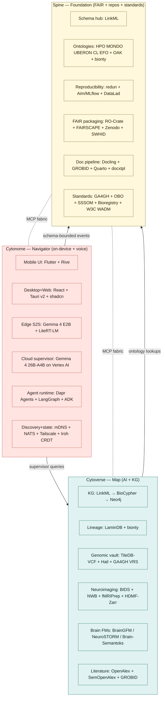
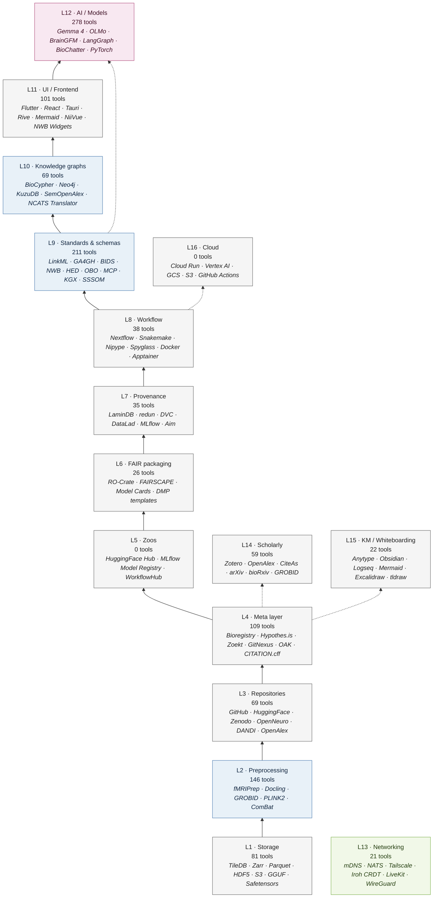
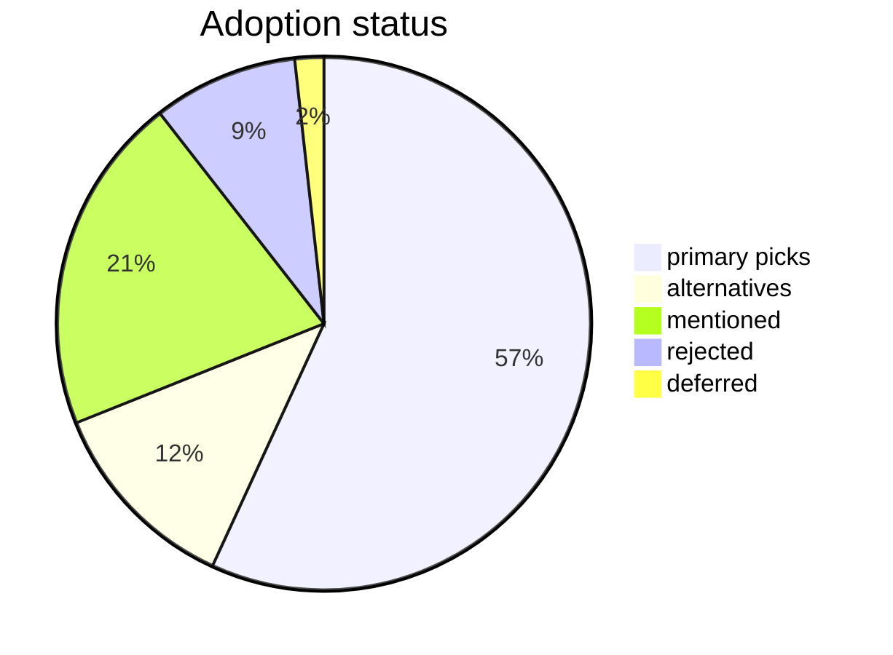
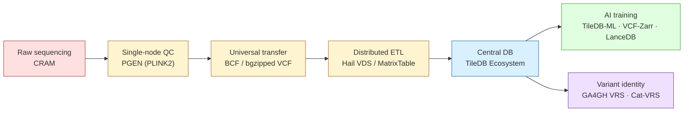
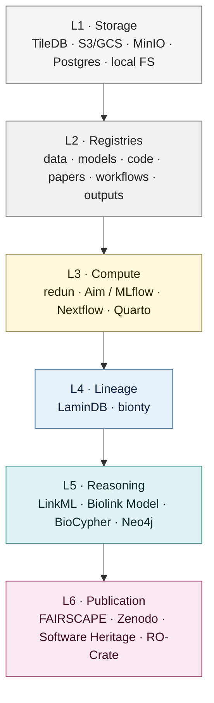
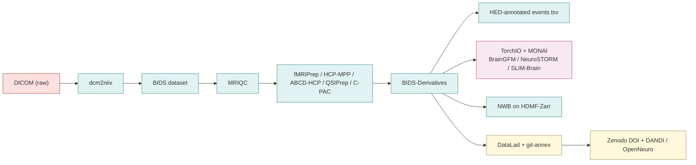

# Cytognosis Tools Master Catalog

> *Cytognosis exists so no one else waits decades for answers.*

A single source of truth for every named tool, repo, standard, ontology, schema, model, dataset, format, framework, or service we've researched across the Cytognosis Foundation infrastructure stack. Union of the five archive sources plus the May 2026 connectomics review. ADHD-friendly: plenty of diagrams, short summaries, jump anywhere.

**Companion files:**
- [`tools-master-catalog.xlsx`](tools-master-catalog.xlsx) — the same data as a filterable spreadsheet with separate views by layer, surface, status, organisation.
- [`tools-infrastructure-stack.md`](tools-infrastructure-stack.md) — a deep dive on the infra layers (storage → repos → meta → FAIR → provenance → workflow → KG) with data-flow diagrams.
## 30-second TL;DR
- **911 unique tools** consolidated (1,845 raw mentions deduplicated). Every primary pick is permissively licensed (Apache 2.0, MIT, BSD-3, CC0) unless explicitly flagged.
- **3 product surfaces:** Cytonome (on-device navigator + voice), Cytoverse (AI map + KG), Spine (FAIR/reproducibility/standards). One stack.
- **16 stack layers** from storage to cloud, with **106 application-area sub-tags**.
- **Status mix:** 518 primary picks, 110 alternatives, 16 deferred, 80 explicitly rejected (preserved here so we don't relitigate).
- **Schema is the hub.** LinkML compiles to Pydantic / JSON Schema / GraphQL / OWL / ShEx / SHACL / SQL DDL / Markdown stubs / TypeScript types. One source of truth, many sinks.
- **MCP is the agent fabric.** Anthropic's Model Context Protocol is the de-facto agent-to-tool standard; BioContextAI is the biomedical registry.
- **FAIR is operational, not aspirational.** RO-Crate auto-emits from every workflow run; tri-identifier coverage with DOI + SWHID + ARK; CC0 metadata everywhere.
- **Connectomics adds 148 extra tools** — the BIDS / HED / NWB triad and the 2026 foundation-model paper stack (NeuroSTORM, Brain-Semantoks, SLIM-Brain, Omni-fMRI, BrainGFM).
## How to use this doc
- **Need a tool?** Skim the *Three product surfaces at a glance* section, then jump to the relevant layer.
- **Already know the layer?** Use the *Layers table of contents* below.
- **Researching a decision?** Read *Cross-cutting themes* then *Rejections & deferrals* — both are condensed.
- **Want everything searchable?** Open `tools_master.xlsx` and filter by tag, status, surface, or organisation.

### Symbol legend

| Symbol | Meaning |
|---|---|
| ✅ primary | Recommended pick / adopted in the stack |
| 🟡 alternative | Strong alternative kept on radar |
| ⏸️ deferred | Revisit later (e.g. license, maturity) |
| ❌ rejected | Explicitly ruled out — see notes for reason |
| • mentioned | Named but not actionable (benchmark, ref) |
## Three product surfaces, one infrastructure spine
Cytognosis is *GPS for Health.* The map (Cytoverse), the sensor (Cytoscope), the navigator (Cytonome), and the foundation that connects them (Spine).



| Surface | Tool count | Description |
|---|---:|---|
| 🌸 **Cytonome** | 200 | On-device navigator + empathic voice interviewer. The phone the patient holds. |
| 🟢 **Cytoverse** | 308 | The AI map: knowledge graph + foundation-model platform + multi-omic data lake. |
| 🟡 **Spine** | 396 | FAIR-compliant foundations: standards, repositories, lineage, reproducibility. |
| ⚪ **Multiple** | 7 | Spans more than one surface. |
## The 16-layer stack at a glance
Each tool sits in one or more *layers*. Layers stack from bytes up.



> Many tools cross-cut multiple layers (e.g. LinkML lives in L9 standards but threads through L4 meta, L10 KG, and L11 UI). The full set of tag assignments is in the spreadsheet.
### Layers — table of contents
| Layer | Tools | What it covers |
|---|---:|---|
| [L1-storage](#l1storage) | 81 | Storage backends, file formats, chunked arrays, blob stores |
| [L2-preprocessing](#l2preprocessing) | 146 | Domain-specific ingestion & preprocessing pipelines |
| [L3-repository](#l3repository) | 69 | Code/model/dataset/literature repositories & registries |
| [L4-meta](#l4meta) | 109 | Meta layer: annotate, search, curate, share, catalog |
| [L5-zoo](#l5zoo) | 0 | Hybrid storage+meta+extras (model/dataset/code zoos) |
| [L6-fair](#l6fair) | 26 | FAIR-compliant experiment packaging (RO-Crate, etc.) |
| [L7-provenance](#l7provenance) | 35 | Provenance/lineage tracking (code, data, model, experiment) |
| [L8-workflow](#l8workflow) | 38 | Workflow engines, orchestration, execution |
| [L9-standard](#l9standard) | 211 | Standards, schemas, ontologies, protocols |
| [L10-kg](#l10kg) | 69 | Knowledge graph ingestion / storage / analytics |
| [L11-ui](#l11ui) | 101 | Frontend UI frameworks & viz libraries |
| [L12-ai](#l12ai) | 278 | AI/ML models, frameworks, orchestration, RAG, memory |
| [L13-net](#l13net) | 21 | Networking, discovery, mesh, CRDT, transport, security |
| [L14-scholarly](#l14scholarly) | 59 | Reference mgmt, literature graph, preprints, citation |
| [L15-km](#l15km) | 22 | Knowledge mgmt, notes, whiteboarding, diagramming |
| [L16-cloud](#l16cloud) | 0 | Cloud runtime, CI/CD, container registry, monitoring |

## Status distribution
Of 911 unique tools across the entire research corpus:



Rejections are kept in the catalog on purpose — to prevent re-litigation. Common rejection patterns:

| Pattern | Examples | Why |
|---|---|---|
| License incompatibility | PyMuPDF, MinIO (BUSL), OpenRAIL-M, Marker | AGPL/proprietary clauses block PBC commercialisation |
| Single-process agents | AutoGen, CrewAI, Letta, OpenAI Swarm, AgentScope | Wrong tier for HIPAA + multi-device therapy use case |
| Crypto-token agents | Fetch.ai uAgents, Olas, Bittensor, Morpheus | Cryptocurrency unacceptable for healthcare |
| Closed/proprietary cloud | Hume EVI, Sesame CSM, Nova Sonic, W&B | Not open; cloud-tied; vendor lock-in |
| Wrong abstraction | SCION, LlamaParse v2, IPFS, Sourcegraph | Either over-spec'd or pivoted away from openness |
| Heavyweight UI | Electron, Qt, MAUI, NativeScript, Ionic | 30× the binary, MS tail risk, declining ecosystems |
| Pickle / .pt / .pth | n/a | "Sleepy Pickle" attacks evade 89-100% of scanners (2023) |
## Top organisations by tool count
These are the labs and communities that show up most often in the catalog. Each links to a section in the spreadsheet.

| Org / Lab / Community | Tools | Surface focus |
|---|---:|---|
| AI2 | 30 | Spine (23), Cytonome (4), Cytoverse (3) |
| GA4GH | 24 | Cytoverse (23), Spine (1) |
| Google | 17 | Spine (8), Cytonome (6), Multiple (3) |
| NCATS Translator | 14 | Cytoverse (11), Spine (3) |
| LangChain Inc. | 12 | Cytonome (10), Multiple (1), Spine (1) |
| Monarch Initiative | 12 | Cytoverse (12) |
| OurResearch | 12 | Spine (11), Cytoverse (1) |
| Open Targets | 11 | Cytoverse (11) |
| BioContextAI | 10 | Cytoverse (10) |
| neurodatawithoutborders | 10 | Spine (6), Cytoverse (4) |
| W3C | 9 | Spine (8), Cytonome (1) |
| Biopragmatics | 8 | Spine (8) |
| Google DeepMind | 8 | Cytonome (8) |
| Liquid AI | 8 | Cytonome (8) |
| Microsoft | 7 | Cytonome (5), Spine (2) |
| LinkML community | 7 | Spine (7) |
| LinkML | 6 | Cytoverse (4), Spine (2) |
| BioCypher | 5 | Cytoverse (5) |
| Apache Software Foundation | 5 | Spine (3), Cytonome (1), Cytoverse (1) |
| GROBID Org | 5 | Spine (5) |

---

# Tools by Layer

## L1-storage

**Storage backends, file formats, chunked arrays, blob stores**

*81 tools.*

### ✅ primary (65)

| Tool | Org | Surface | What it does |
|---|---|---|---|
| ✅ [AIStor Free](https://min.io) | MinIO Inc. | Spine | Successor to MinIO; exascale data store for high-performance AI workloads |
| ✅ [AnnData / h5ad](https://anndata.readthedocs.io) | scverse / Theis Lab | Cytoverse | Annotated data matrix for single-cell genomics; h5ad file format |
| ✅ [Anytype](https://anytype.io) | Any Association | Spine | Zero-knowledge encryption offline-first knowledge workspace; LinkML classes map to Anytype Types |
| ✅ [Apache Parquet](https://parquet.apache.org) | Apache Software Foundation | Spine | Columnar tabular storage format; default for analytical tabular outputs |
| ✅ [AWS S3 / GCS](https://aws.amazon.com/s3/) | AWS / Google | Spine | Object storage backends used by LaminDB |
| ✅ [BCF / bgzipped VCF](http://samtools.github.io/) | Samtools / htslib | Cytoverse | Universal genomic variant transfer format; Tabix-indexed |
| ✅ [BIDS (Brain Imaging Data Structure)](https://bids.neuroimaging.io) | BIDS community | Cytoverse | Brain Imaging Data Structure — filesystem layout & sidecar metadata for MRI/EEG/MEG/iEEG/PET/behaviour; includes Stats Models and BIDS-App spec. |
| ✅ [CELLxGENE Census](https://cellxgene.cziscience.com/census) | Chan Zuckerberg Initiative | Cytoverse | Standardized single-cell data aggregation; built on TileDB-SOMA |
| ✅ [CRAM](http://www.htslib.org/cram) | EMBL-EBI / GA4GH | Cytoverse | Reference-based compression for raw sequencing data; >30% smaller than BAM |
| ✅ [DuckDB](https://duckdb.org) | DuckDB Foundation | Spine | Embedded analytical SQL DB; vectorized columnar execution; ~50x faster than SQLite for large aggregations on Parquet |
| ✅ [ExecuTorch (.pte)](https://github.com/pytorch/executorch) | Meta / PyTorch Foundation | Cytonome | PyTorch-native edge format (.pte); AOTAutograd export; sub-50KB runtime; XNNPACK backend |
| ✅ [fsspec](https://github.com/fsspec/filesystem_spec) | fsspec | Spine | Cloud filesystem abstraction; backbone for s3fs/gcsfs. |
| ✅ [gcsfs](https://github.com/fsspec/gcsfs) | fsspec | Spine | GCS filesystem for fsspec. |
| ✅ [Gemma 4 E2B](https://ai.google.dev/gemma) | Google DeepMind | Cytonome | ~2B effective parameter audio-input LLM with native ASR and audio understanding; PLE architecture; 128K context; for smartphones via LiteRT-LM |
| ✅ [GGUF / GGUFv3](https://github.com/ggerganov/ggml) | Georgi Gerganov / llama.cpp | Spine | Quantized LLM format for llama.cpp/Ollama/LM Studio; 53.5% of HuggingFace LLMs; block-based quant (Q4_K_M, Q5_K_M, Q8_0) |
| ✅ [Google Cloud Storage](https://cloud.google.com/storage) | Google Cloud | Spine | Versioned object storage (gs://cytognosis-dvc-store) |
| ✅ [Google Drive](https://drive.google.com) | Google | Multiple | Cloud storage acting as canonical PDF/file store and the sync layer for embedded PDF annotations. |
| ✅ [h5py](https://github.com/h5py/h5py) | h5py | Spine | HDF5 access for legacy NWB and AnnData h5ad. |
| ✅ [HDMF](https://github.com/hdmf-dev/hdmf) | hdmf-dev | Spine | Hierarchical Data Modeling Framework — engine underneath NWB. |
| ✅ [HDMF-Zarr](https://github.com/hdmf-dev/hdmf-zarr) | hdmf-dev | Cytoverse | Zarr backend for HDMF/NWB — cloud-friendly chunked storage. |
| ✅ [Iroh Documents](https://github.com/n0-computer/iroh) | Number Zero / Iroh project | Cytonome | Rust distributed system on QUIC; content-addressed blobs (BLAKE3); CRDT documents; gossip pub-sub; mobile-ready (iOS/Android/embedded) |
| ✅ [Keras v3 (.keras)](https://keras.io) | Google / Keras team | Spine | Backend-agnostic authoring; runs on TF/PyTorch/JAX/OpenVINO; zip archive replacing .h5 |
| ✅ [KuzuDB](https://github.com/kuzudb/kuzu) | Kùzu Inc. | Spine | Embedded graph database used by GitNexus |
| ✅ [LanceDB](https://github.com/lancedb/lancedb) | LanceDB / Eto Labs | Cytoverse | Multimodal vector + tabular lakehouse |
| ✅ [linkml-map](https://github.com/linkml/linkml-map) | LinkML community | Spine | Data transformation and mapping framework using LinkML schemas; declarative source-to-target mapping; compiles to Python or DuckDB SQL |
| ✅ [linkml-store](https://github.com/linkml/linkml-store) | LinkML community | Spine | Storage abstraction layer for LinkML-defined data. |
| ✅ [LiteRT (formerly TF Lite)](https://ai.google.dev/edge/litert) | Google | Cytonome | Mobile NPU inference runtime using FlatBuffers; cross-platform on Qualcomm Snapdragon, MediaTek, Google Tensor; INT8 and 4-bit quant |
| ✅ [LiteRT-LM](https://github.com/google-ai-edge/litert) | Google | Cytonome | LiteRT large-model loader; runs Gemma 4 E2B/E4B on-device with native audio |
| ✅ [llama.cpp](https://github.com/ggerganov/llama.cpp) | Georgi Gerganov | Cytonome | C/C++ LLM inference engine; primary GGUF runtime; iOS/Android/desktop |
| ✅ [MinIO](https://github.com/minio/minio) | MinIO Inc. | Spine | S3-compatible object storage (deprecated; replaced by AIStor Free) |
| ✅ [MLX](https://github.com/ml-explore/mlx) | Apple | Cytonome | Apple's array framework optimized for Apple Silicon unified memory |
| ✅ [MongoDB](https://www.mongodb.com) | MongoDB Inc. | Spine | Document database; backs FAIRSCAPE metadata store |
| ✅ [Neo4j](https://github.com/neo4j/neo4j) | Neo4j Inc. | Cytoverse | Property graph database with Cypher query language; community edition adopted for Cytognosis KG |
| ✅ [netCDF4-python](https://github.com/Unidata/netcdf4-python) | Unidata | Spine | Python netCDF format binding (xarray backend). |
| ✅ [Netron](https://github.com/lutzroeder/netron) | Lutz Roeder | Spine | Visualizer for neural network, deep learning and machine learning models (ONNX, Safetensors, GGUF) |
| ✅ [nibabel](https://github.com/nipy/nibabel) | nipy | Cytoverse | NIfTI/GIFTI/CIFTI I/O — universal Python neuroimaging I/O. |
| ✅ [NWB](https://www.nwb.org/) | neurodatawithoutborders | Cytoverse | Neurodata Without Borders — HDF5/Zarr-backed standard for neurophysiology (ephys, ophys, behaviour); complement to BIDS for non-BOLD modalities. |
| ✅ [Ollama (mobile)](https://github.com/ollama/ollama) | Ollama team | Cytonome | Docker-for-LLMs desktop runtime; GGUF; built-in function calling for Qwen, Llama, Mistral |
| ✅ [ONNX (Open Neural Network Exchange)](https://github.com/onnx/onnx) | ONNX/Linux Foundation | Spine | Cross-platform inference bridge; v1.21+ with 2-bit quant; TensorRT, CoreML, QNN, WebGPU EPs |
| ✅ [ONNX 1.21+](https://onnx.ai) | ONNX / Linux Foundation | Spine | Open Neural Network Exchange cross-platform inference bridge; 2-bit quant |
| ✅ [Orbax](https://github.com/google/orbax) | Google / JAX | Spine | Distributed JAX checkpoint manager with async resharding; orbax-export bridges to SavedModel |
| ✅ [Parquet](https://parquet.apache.org) | Apache Software Foundation | Spine | Columnar storage format |
| ✅ [pgvector](https://github.com/pgvector/pgvector) | Andrew Kane | Cytonome | Vector similarity search extension for Postgres |
| ✅ [polars](https://github.com/pola-rs/polars) | pola-rs | Spine | Faster pandas-style dataframe. |
| ✅ [Postgres](https://www.postgresql.org) | PostgreSQL Global Development Group | Spine | Relational DB (LaminDB backend) |
| ✅ [PostgreSQL](https://www.postgresql.org) | PostgreSQL Global Development Group | Spine | Relational database backing the self-hosted Hypothes.is annotation store. |
| ✅ [PyArrow](https://arrow.apache.org/) | apache | Spine | Parquet / Arrow tabular storage. |
| ✅ [s3fs](https://github.com/fsspec/s3fs) | fsspec | Spine | S3 filesystem for fsspec. |
| ✅ [Safetensors](https://github.com/huggingface/safetensors) | Hugging Face | Spine | Pickle-replacement weight format; zero-copy mmap; JSON header + flat 8-byte aligned byte buffer; HuggingFace standard |
| ✅ [Semantic-SQL](https://github.com/INCATools/semantic-sql) | Monarch Initiative | Cytoverse | SQLite database compilation of OBO ontologies for low-memory transactional access |

*… and 15 more in the spreadsheet.*


### 🟡 alternative (5)

| Tool | Org | Surface | What it does |
|---|---|---|---|
| 🟡 [Apache Hudi](https://github.com/apache/hudi) | Apache Software Foundation | Spine | Lakehouse with ACID upserts and non-blocking concurrency at scale |
| 🟡 [Hypercore](https://github.com/holepunchto/hypercore) | Holepunch / Hypercore Protocol | Cytonome | Append-only log with sparse replication |
| 🟡 [LakeFS](https://github.com/treeverse/lakeFS) | Treeverse | Spine | Petabyte-scale data version control via Graveler SSTables |
| 🟡 [ONNX Runtime](https://github.com/microsoft/onnxruntime) | Microsoft / ONNX | Cytonome | Cross-platform model inference engine with Execution Providers |
| 🟡 [OrbitDB](https://github.com/orbitdb/orbit-db) | OrbitDB community | Cytonome | Distributed peer-to-peer database on IPFS |

### ⏸️ deferred (1)

| Tool | Org | Surface | What it does |
|---|---|---|---|
| ⏸️ [Autonomi (v2.0)](https://autonomi.com) | MaidSafe | Cytonome | Decentralized network with post-quantum crypto (Feb 2026 watch) |

### ❌ rejected (6)

| Tool | Org | Surface | What it does |
|---|---|---|---|
| ❌ .ckpt | Various | Spine | Training checkpoint format |
| ❌ .pt / .pth (Pickle) | Meta | Spine | PyTorch pickle weights |
| ❌ [GenomicsDB](https://github.com/GenomicsDB/GenomicsDB) | Intel / Broad | Cytoverse | Database backend for genomic variant data |
| ❌ [IPFS](https://ipfs.tech) | Protocol Labs | Cytonome | Content-addressed distributed file system; mature but HIPAA-hostile |
| ❌ Msgpack/Flax | Google | Spine | JAX research serialization |
| ❌ [TorchScript](https://pytorch.org) | PyTorch | Spine | Legacy PyTorch serialization; use ExecuTorch for new code |

### • mentioned (4)

| Tool | Org | Surface | What it does |
|---|---|---|---|
| • BAM/SAM | samtools | Cytoverse | Legacy sequence alignment formats |
| • [LanceDB / SLAF](https://github.com/lancedb/lance) | Lance / LanceDB | Cytoverse | Columnar Arrow-native lakehouse with zero-copy evolution; SLAF for single-cell + large-scale; PyTorch Dataset interface |
| • [TileDB Cloud](https://tiledb.com/cloud) | TileDB Inc. | Cytoverse | Managed TileDB platform |
| • WASM-SQLite | SQLite | Cytonome | SQLite compiled to WebAssembly for browser |


## L2-preprocessing

**Domain-specific ingestion & preprocessing pipelines**

*146 tools.*

### ✅ primary (97)

| Tool | Org | Surface | What it does |
|---|---|---|---|
| ✅ AAL-116 / AAL3v1 | Tzourio-Mazoyer 2002 / Rolls 2020 | Cytoverse | Automated Anatomical Labelling atlas — SPM default; AAL3v1 adds finer subcortex/cerebellum. |
| ✅ [abagen](https://github.com/rmarkello/abagen) | rmarkello | Cytoverse | Allen Human Brain Atlas gene-expression workflow. |
| ✅ [ABCD-HCP pipeline](https://github.com/DCAN-Labs/abcd-hcp-pipeline) | dcanumn | Cytoverse | ABCD-flavoured HCP-style preprocessing (DCAN Labs). |
| ✅ [AFNI](https://afni.nimh.nih.gov/) | afni | Cytoverse | Analysis of Functional NeuroImages — 3dDespike, 3dvolreg, 3dTproject. |
| ✅ [Allen Human Brain Atlas](https://human.brain-map.org/) | Allen Institute | Cytoverse | Gene expression mapping (used via abagen). |
| ✅ [Anthropic unpack.py / pack.py](https://anthropic.com) | Anthropic | Spine | DOCX XML round-trip utility for non-templated funder DOCX |
| ✅ [ANTs](https://github.com/ANTsX/ANTs) | ants | Cytoverse | Advanced Normalization Tools — symmetric normalisation, N4 bias correction. |
| ✅ [article_dataset_builder](https://github.com/grobidOrg/article_dataset_builder) | GROBID Org | Spine | Pipeline for creating structured scientific article corpora from PDFs. |
| ✅ [BIDS (Brain Imaging Data Structure)](https://bids.neuroimaging.io) | BIDS community | Cytoverse | Brain Imaging Data Structure — filesystem layout & sidecar metadata for MRI/EEG/MEG/iEEG/PET/behaviour; includes Stats Models and BIDS-App spec. |
| ✅ [bids-validator](https://github.com/bids-standard/bids-validator) | BIDS / OpenNeuro | Cytoverse | Official BIDS validator (Deno + JS). |
| ✅ [brain_data_standards_ontologies](https://github.com/obophenotype/brain_data_standards_ontologies) | OBO Phenotype / Allen Brain Atlas | Cytoverse | Ontologies for standardizing brain cell type data (Allen Brain Atlas aligned). |
| ✅ [BrainSpace](https://github.com/MICA-MNI/BrainSpace) | MICA-MNI | Cytoverse | FC gradients via diffusion-map embedding (Taylor 2026 lineage). |
| ✅ [BrainStat](https://github.com/MICA-MNI/BrainStat) | MICA-MNI | Cytoverse | Cortical surface statistics (vertex-wise mass-univariate). |
| ✅ Buckner-7 cerebellar atlas | Buckner 2011 | Cytoverse | Functional cerebellar atlas (7 networks). |
| ✅ [C-PAC](https://github.com/FCP-INDI/C-PAC) | fcp-indi | Cytoverse | Configurable Pipeline for the Analysis of Connectomes — rs-fMRI preprocessing; ABIDE/ADHD-200 derivatives. |
| ✅ CC200 atlas | Craddock 2012 | Cytoverse | Functional ABIDE-derived 200-ROI atlas. |
| ✅ [ComBat / NeuroComBat](https://github.com/Jfortin1/ComBatHarmonization) | Jfortin1 | Cytoverse | Empirical-Bayes site-effect correction (original ComBat tailored to neuroimaging). |
| ✅ [Connectome Workbench](https://www.humanconnectome.org/software/connectome-workbench) | Human Connectome Project | Cytoverse | GIFTI/CIFTI/dtseries handling — wb_command. |
| ✅ [Copier](https://copier.readthedocs.io) | Copier community | Spine | Project/directory scaffolding tool using Jinja; supports seamless updates (superior to Cookiecutter) |
| ✅ [CuBIDS](https://github.com/PennLINC/CuBIDS) | pennlinc | Cytoverse | Cross-cohort BIDS heterogeneity audit, key-grouping, batch validation. |
| ✅ [DANDI Archive](https://dandiarchive.org/) | dandi-archive | Spine | NIH BRAIN Initiative archive for publishing NWB data — BIDS-equivalent for neurophysiology. |
| ✅ [datastet](https://github.com/grobidOrg/datastet) | GROBID Org | Spine | Dataset mention identification and extraction from scientific articles. |
| ✅ [dcm2niix](https://github.com/rordenlab/dcm2niix) | rordenlab | Cytoverse | DICOM-to-NIfTI binary; the default raw conversion step. |
| ✅ Desikan-Killiany atlas | FreeSurfer | Cytoverse | Anatomical 68-ROI cortical atlas bundled with FreeSurfer. |
| ✅ [DiPy](https://github.com/dipy/dipy) | dipy | Cytoverse | Diffusion MRI analysis. |
| ✅ [Docling](https://github.com/DS4SD/docling) | IBM Research / LF AI & Data | Spine | Universal document parser supporting PDF/DOCX/PPTX/XLSX/HTML/LaTeX/audio/images; outputs unified DoclingDocument JSON, Markdown, HTML, DocTags; includes MCP server |
| ✅ [docxtpl](https://docxtpl.readthedocs.io) | docxtpl community | Spine | Jinja-style templating over .docx files; preserves funder template layout |
| ✅ [en_core_sci_lg](https://github.com/allenai/scispacy) | AI2 / scispacy | Spine | Large scientific spaCy model |
| ✅ [en_ner_bc5cdr_md](https://github.com/allenai/scispacy) | AI2 / scispacy | Spine | Medium scispacy NER model trained on BC5CDR (chemicals/diseases) |
| ✅ [FitLins](https://github.com/poldracklab/fitlins) | poldracklab | Cytoverse | First-level GLMs against BIDS Stats Models JSON; emits BIDS-Derivatives. |
| ✅ [fMRIPrep](https://github.com/nipreps/fmriprep) | nipreps | Cytoverse | BIDS-App for rs / task fMRI preprocessing — the default cross-cohort pipeline. |
| ✅ [FreeSurfer](https://surfer.nmr.mgh.harvard.edu/) | freesurfer | Cytoverse | Cortical surface reconstruction, recon-all, mri_convert. |
| ✅ [FSL](https://fsl.fmrib.ox.ac.uk/) | fmrib | Cytoverse | mcflirt, topup, BBR, MELODIC, ICA-AROMA, ICA-FIX, FIRST. Default motion+denoising engine. |
| ✅ Gordon-333 atlas | Gordon 2016 | Cytoverse | Functional gradient + network atlas (333 ROIs). |
| ✅ [GROBID](https://github.com/grobidOrg/grobid) | Patrice Lopez (Science Miner) | Spine | ML library for extracting structured TEI/XML from scientific PDFs; ~0.87 F1 reference extraction; ~10.6 PDFs/sec |
| ✅ [grobid-client-python](https://github.com/grobidOrg/grobid-client-python) | GROBID Org | Spine | Python client for the GROBID REST API. |
| ✅ [grobid-ner](https://github.com/grobidOrg/grobid-ner) | GROBID Org | Spine | Named entity recognition module for GROBID. |
| ✅ [GWASLab](https://cloufield.github.io/gwaslab/) | He Yunye et al. | Cytoverse | Python toolkit for GWAS summary statistics harmonization |
| ✅ Harvard-Oxford atlas | Desikan 2006 | Cytoverse | Anatomical atlas bundled with FSL. |
| ✅ [HCP minimal preprocessing pipeline](https://github.com/Washington-University/HCPpipelines) | Human Connectome Project | Cytoverse | Canonical HCP-family rs / tfMRI / sMRI preprocessing. |
| ✅ [HDMF-Zarr](https://github.com/hdmf-dev/hdmf-zarr) | hdmf-dev | Cytoverse | Zarr backend for HDMF/NWB — cloud-friendly chunked storage. |
| ✅ [hedtools (hed-python)](https://github.com/hed-standard/hed-python) | hed-standard | Spine | Python validator and processor for HED tags. |
| ✅ [HeuDiConv](https://github.com/nipy/heudiconv) | nipy | Cytoverse | Heuristic DICOM-to-BIDS converter (Python wrapper around dcm2niix). |
| ✅ [ICA-AROMA](https://github.com/maartenmennes/ICA-AROMA) | Maartensson | Cytoverse | ICA-based motion-component removal for fMRI. |
| ✅ [ICA-FIX](https://fsl.fmrib.ox.ac.uk/fsl/fslwiki/FIX) | FMRIB | Cytoverse | FMRIB's ICA-based Xnoiseifier — denoising for fMRI (bundled in HCP-MPP). |
| ✅ [Instructor](https://github.com/jxnl/instructor) | Jason Liu | Spine | LLM structured output library using Pydantic; gold standard for forcing typed JSON from LLMs |
| ✅ [Jinja2](https://github.com/pallets/jinja) | Pallets | Spine | Python templating engine |
| ✅ [LibreOffice (soffice headless)](https://www.libreoffice.org) | The Document Foundation | Spine | Universal office I/O converter (DOC<->DOCX, DOCX->PDF, XLSX recalc, PPTX->PDF) |
| ✅ [markitdown](https://github.com/microsoft/markitdown) | Microsoft | Spine | Token-efficient Markdown converter from 15+ formats (PDF, DOCX, PPTX, XLSX, images-with-OCR, audio-with-transcription, YouTube URLs) for LLM context windows |
| ✅ [Mermaid](https://github.com/mermaid-js/mermaid) | Mermaid | Spine | Markdown-friendly code-as-diagram language; integrates into Quarto/Markdown |

*… and 47 more in the spreadsheet.*


### 🟡 alternative (17)

| Tool | Org | Surface | What it does |
|---|---|---|---|
| 🟡 [ancpbids](https://github.com/ANCPLabOldenburg/ancpbids) | ancp-bids | Spine | Schema-aware BIDS dataset API alternative to PyBIDS. |
| 🟡 [AqNWB](https://github.com/NeurodataWithoutBorders/aqnwb) | neurodatawithoutborders | Cytoverse | C++ API for direct acquisition into NWB (hardware-side). |
| 🟡 [Atlantes](https://github.com/allenai/atlantes) | AI2 | Spine | Large-scale document understanding and extraction. |
| 🟡 [biblio-glutton](https://github.com/kermitt2/biblio-glutton) | Patrice Lopez | Spine | DOI resolution and metadata service used by GROBID for reference consolidation |
| 🟡 [BIDScoin](https://github.com/Donders-Institute/bidscoin) | marcelzwiers | Spine | DICOM-to-BIDS GUI plus Python. |
| 🟡 [CovBat](https://github.com/andy1764/CovBat_Harmonization) | andy1764 | Cytoverse | Covariance-preserving ComBat extension. |
| 🟡 [dcm2bids](https://github.com/UNFmontreal/Dcm2Bids) | unfmontreal | Cytoverse | Simpler DICOM-to-BIDS alternative for small datasets. |
| 🟡 [docx-js (docx)](https://github.com/dolanmiu/docx) | Dolan Miu | Spine | Node-based DOCX generation library used by Anthropic skills for ad-hoc creation |
| 🟡 [LlamaIndex (Extraction)](https://github.com/run-llama/llama_index) | LlamaIndex Inc. | Spine | RAG framework with extraction frameworks for synthesizing entities across chunked documents |
| 🟡 [longCombat](https://github.com/jcbeer/longCombat) | jcbeer | Cytoverse | Longitudinal ComBat extension. |
| 🟡 [MatNWB](https://github.com/NeurodataWithoutBorders/matnwb) | neurodatawithoutborders | Cytoverse | MATLAB API for NWB. |
| 🟡 [MyST](https://github.com/executablebooks/MyST-Parser) | Executable Books Project | Spine | Markedly Structured Text; Jupyter-integrated computational narratives with Sphinx; alternative to Quarto |
| 🟡 [open-canvas](https://github.com/langchain-ai/open-canvas) | LangChain Inc. | Cytonome | Open-source collaborative AI canvas for document creation. |
| 🟡 [pptxgenjs](https://github.com/gitbrent/PptxGenJS) | Brent Ely | Spine | Node-based PPTX generation library used by Anthropic skills |
| 🟡 Spherical Demons | Yeo Lab | Cytoverse | Spherical surface registration. |
| 🟡 [Stirling-pdf](https://github.com/Stirling-Tools/Stirling-PDF) | Stirling-Tools | Spine | Local PDF web application for editing/manipulation |
| 🟡 [Unstructured.io](https://github.com/Unstructured-IO/unstructured) | Unstructured Technologies | Spine | Enterprise ingestion with intelligent chunking across many formats; for RAG systems |

### ⏸️ deferred (1)

| Tool | Org | Surface | What it does |
|---|---|---|---|
| ⏸️ [Marker (Datalab)](https://github.com/VikParuchuri/marker) | Datalab / Vik Paruchuri | Spine | PDF/EPUB/DOCX/XLSX to Markdown converter; best LaTeX equation rendering in open source |

### ❌ rejected (8)

| Tool | Org | Surface | What it does |
|---|---|---|---|
| ❌ [docassemble](https://docassemble.org) | Jonathan Pyle | Spine | Document automation for legal/forms |
| ❌ LaTeX + Jinja | — | Spine | LaTeX template fill via Jinja |
| ❌ [LlamaParse v2](https://developers.llamaindex.ai/llamaparse/) | LlamaIndex | Spine | PDF to structured Markdown/JSON; cloud API at $0.003/page |
| ❌ [Mathpix markdown-it](https://github.com/Mathpix/markdown-it) | Mathpix Inc. | Spine | Enhanced Markdown renderer with LaTeX math, SMILES chemistry, MathJax v3 |
| ❌ [MkDocs](https://github.com/mkdocs/mkdocs) | Tom Christie / MkDocs community | Spine | Markdown documentation site generator |
| ❌ [python-docx](https://python-docx.readthedocs.io) | python-openxml | Spine | Python DOCX generation |
| ❌ [Sphinx](https://github.com/sphinx-doc/sphinx) | Sphinx community | Spine | Python documentation generator |
| ❌ [xlsxwriter](https://github.com/jmcnamara/XlsxWriter) | John McNamara | Spine | XLSX file writer for Python |

### • mentioned (23)

| Tool | Org | Surface | What it does |
|---|---|---|---|
| • [ABCD](https://abcdstudy.org/) | ABCD Study | Cytoverse | Adolescent Brain Cognitive Development dataset. |
| • [ABIDE](http://fcon_1000.projects.nitrc.org/indi/abide/) | INDI | Cytoverse | Autism Brain Imaging Data Exchange — rs-fMRI for autism research. |
| • [ADHD-200](http://fcon_1000.projects.nitrc.org/indi/adhd200/) | INDI | Cytoverse | ADHD-200 rs-fMRI consortium dataset. |
| • [ADNI](https://adni.loni.usc.edu/) | ADNI | Cytoverse | Alzheimer's Disease Neuroimaging Initiative. |
| • [AOMIC](https://nilab-uva.github.io/AOMIC.github.io/) | Snoek et al. | Cytoverse | Amsterdam Open MRI Collection. |
| • Brain-JEPA | various | Cytoverse | Pre-NeuroSTORM JEPA-based fMRI FM baseline. |
| • Brain-Semantoks | Gijsen et al. | Cytoverse | ROI-token transformer with per-network multi-scale tokeniser; DINO/iBOT-style self-distillation + Teacher-guided Temporal Regulariser. arXiv 2025. Most compute-efficient fMRI FM. |
| • [BrainGFM](https://github.com/weixinxu666/BrainGFM) | Wei et al. | Cytoverse | Graph Transformer brain-graph FM with multi-atlas pretraining, [T/D] + [A/P] BioClinicalBERT prompts, MAML graph prompts. ICLR 2026. |
| • [ENIGMA](http://enigma.ini.usc.edu) | ENIGMA Consortium | Cytoverse | Imaging genetics consortium with neuroimaging meta-analysis protocols |
| • [ENIGMA Consortium](https://enigma.ini.usc.edu/) | ENIGMA | Cytoverse | Mega-analysis consortium for neuroimaging genetics across disorders. |
| • [ENIGMA sumstats](http://enigma.ini.usc.edu) | ENIGMA Consortium | Cytoverse | Neuroimaging genomics consortium sumstats |
| • [FreeSurfer / FSL / SPM](https://surfer.nmr.mgh.harvard.edu/) | Various | Cytoverse | ENIGMA Consortium imaging protocols rely on these |
| • [Granite-Docling VLM](https://huggingface.co/ibm-granite/granite-docling-258M) | IBM | Spine | Visual Language Model used by Docling for layout-aware PDF parsing |
| • [HCP (Human Connectome Project)](https://www.humanconnectome.org/) | Human Connectome Project | Cytoverse | Large open neuroimaging dataset (young adult + lifespan + development). |
| • [HPO Mapper](https://github.com/monarch-initiative/clintlk) | Monarch Initiative | Cytoverse | Phenotype mapper for unstructured clinical text (~85% accuracy) |
| • [Karenina](https://github.com/biocypher/Karenina) | BioCypher project | Cytoverse | Biomedical data extraction from text and other modalities (under development). |
| • [NeMO Archive](https://nemoarchive.org) | NIH BRAIN Initiative | Cytoverse | NeMO Neuroscience Multi-Omic Archive. |
| • NeuroSTORM | Wang et al. | Cytoverse | Shifted-Window Mamba 4D fMRI foundation model with MAE + Spatiotemporal Redundancy Dropout; TPT fine-tuning. Nat Biomed Eng 2026. |
| • Omni-fMRI | Wang et al. | Cytoverse | Atlas-free 4D ViT-MAE with dynamic content-adaptive patch tokenisation. arXiv 2026. |
| • SLIM-Brain | Wang et al. | Cytoverse | Two-stage 4D fMRI FM: ViT-MAE window selector → Hiera-JEPA voxel encoder. arXiv 2026. |
| • [SPARC (Stimulating Peripheral Activity to Relieve Conditions)](https://sparc.science) | NIH Common Fund | Cytoverse | Stimulating Peripheral Activity to Relieve Conditions Repository with SDS dataset structure |
| • [StudyForrest](https://www.studyforrest.org/) | Hanke et al. | Cytoverse | Annotated naturalistic-stimulus fMRI dataset. |
| • [Tesseract OCR](https://github.com/tesseract-ocr/tesseract) | Google / open-source | Spine | OCR engine; fallback for scanned PDFs when Docling OCR fails |


## L3-repository

**Code/model/dataset/literature repositories & registries**

*69 tools.*

### ✅ primary (44)

| Tool | Org | Surface | What it does |
|---|---|---|---|
| ✅ [ai2-scholarqa-lib](https://github.com/allenai/ai2-scholarqa-lib) | AI2 | Spine | Library for question-answering over scientific literature (Semantic Scholar). |
| ✅ [Allen Human Brain Atlas](https://human.brain-map.org/) | Allen Institute | Cytoverse | Gene expression mapping (used via abagen). |
| ✅ [AnnData / h5ad](https://anndata.readthedocs.io) | scverse / Theis Lab | Cytoverse | Annotated data matrix for single-cell genomics; h5ad file format |
| ✅ [arXiv](https://arxiv.org) | Cornell University | Spine | Open repository for scientific preprints |
| ✅ [CELLxGENE Census](https://cellxgene.cziscience.com/census) | Chan Zuckerberg Initiative | Cytoverse | Standardized single-cell data aggregation; built on TileDB-SOMA |
| ✅ [Copier](https://copier.readthedocs.io) | Copier community | Spine | Project/directory scaffolding tool using Jinja; supports seamless updates (superior to Cookiecutter) |
| ✅ [DANDI Archive](https://dandiarchive.org/) | dandi-archive | Spine | NIH BRAIN Initiative archive for publishing NWB data — BIDS-equivalent for neurophysiology. |
| ✅ [Entrez (NCBI E-utilities)](https://www.ncbi.nlm.nih.gov/Entrez/) | NCBI | Spine | NCBI E-utilities API for PubMed/databases |
| ✅ [GitHub](https://github.com) | Microsoft / GitHub | Spine | Code hosting (does not yet support SHA-256 as of 2026) |
| ✅ [GitNexus](https://github.com/gitnexus) | GitNexus / community | Spine | MCP-native code knowledge graph using Tree-sitter ASTs, Leiden clustering, KuzuDB; 7 MCP tools (impact, detect_changes, rename, cypher) |
| ✅ [GROBID](https://github.com/grobidOrg/grobid) | Patrice Lopez (Science Miner) | Spine | ML library for extracting structured TEI/XML from scientific PDFs; ~0.87 F1 reference extraction; ~10.6 PDFs/sec |
| ✅ [Hugging Face Hub](https://huggingface.co) | Hugging Face | Spine | Model/dataset hub |
| ✅ [kg-alzheimers](https://github.com/Knowledge-Graph-Hub/kg-alzheimers) | Knowledge Graph Hub (KGHub) | Cytoverse | Alzheimer's disease knowledge graph construction pipeline |
| ✅ [kg-idg](https://github.com/Knowledge-Graph-Hub/kg-idg) | KGHub/Monarch | Cytoverse | Knowledge graph for Illuminating the Druggable Genome (IDG) targets |
| ✅ [mcp-server-cookiecutter](https://github.com/biocontext-ai/mcp-server-cookiecutter) | BioContextAI | Cytoverse | Template for scaffolding new biomedical MCP servers. |
| ✅ [Neurosynth](https://neurosynth.org/) | neurosynth | Cytoverse | Original meta-analytic term maps service. |
| ✅ [OLMo](https://github.com/allenai/OLMo) | Allen Institute for AI (AI2) | Spine | Open Language Model; fully open-source LLM with weights, data, and training code |
| ✅ [OLMo-core](https://github.com/allenai/OLMo-core) | AI2 | Spine | Core training infrastructure for OLMo models. |
| ✅ [OLMoE](https://github.com/allenai/OLMoE) | AI2 | Spine | OLMo Mixture-of-Experts variant for efficient inference. |
| ✅ [Open Targets Platform](https://platform.opentargets.org) | Open Targets | Cytoverse | Drug-target evidence platform with GraphQL API |
| ✅ [OpenAlex](https://github.com/ourresearch/openalex-guts) | OurResearch | Spine | Fully open catalog of 250M+ scholarly works, authors, institutions; succeeded Microsoft Academic Graph; 115M+ API calls/month |
| ✅ [openalex-concept-tagging](https://github.com/ourresearch/openalex-concept-tagging) | OurResearch | Spine | ML pipeline for automatically tagging scholarly works with hierarchical research concepts. |
| ✅ [OpenNeuro](https://openneuro.org) | OpenNeuro / Stanford | Cytoverse | BIDS-native public archive for raw MRI/EEG/MEG; CC0 default. |
| ✅ [openneuro-py](https://github.com/hoechenberger/openneuro-py) | openneuro | Spine | Programmatic OpenNeuro pull client. |
| ✅ [OpenScholar](https://github.com/allenai/OpenScholar) | AI2 | Spine | AI system for synthesizing scientific literature with citations. |
| ✅ [Phenopackets](https://github.com/ga4gh/phenopacket-schema) | GA4GH | Cytoverse | Standard for sharing disease and phenotype information for diagnostics and research |
| ✅ [PubMed](https://pubmed.ncbi.nlm.nih.gov/) | NIH / NLM | Spine | Biomedical citation database; data source for OpenAlex. |
| ✅ [PubMed Central (PMC)](https://www.ncbi.nlm.nih.gov/pmc/) | NLM | Spine | Free biomedical literature archive |
| ✅ [PyPaperRetriever](https://github.com/JosephIsaacTurner/pypaperretriever) | Joseph Isaac Turner | Spine | Bulk PDF retrieval via DOI/PMID with Unpaywall, Crossref, Entrez integration; tracks citation networks; BIDS-compatible naming |
| ✅ [Reproducible Brain Corpus (RBC)](https://reprobrainchart.github.io/) | PennLINC | Spine | Multi-cohort harmonised BIDS-Derivatives release with single pipeline-version stamp. |
| ✅ [Semantic Scholar](https://semanticscholar.org) | AI2 | Spine | AI-powered scholarly search; used by ai2-scholarqa-lib |
| ✅ [SemOpenAlex](https://github.com/metaphacts/semopenalex) | Metaphacts + KIT (Karlsruhe Institute of Technology) | Spine | Transforms OpenAlex into a 26B+ RDF triple knowledge graph with SPARQL endpoint, DistMult embeddings, entity disambiguation |
| ✅ [SLAF](https://github.com/slaf-project/slaf) | SLAF project | Cytoverse | Single-Cell Lakehouse Foundation; multimodal storage |
| ✅ [SNOMED CT](https://www.snomed.org) | SNOMED International | Cytoverse | Multilingual healthcare terminology for clinical diagnoses; extracted via ELK reasoner to KGX |
| ✅ [Software Heritage](https://www.softwareheritage.org) | Inria/Software Heritage | Spine | Universal source code archive with SWHID (ISO 18670:2025) |
| ✅ [Software Heritage / SWHID](https://www.softwareheritage.org) | Software Heritage / Inria | Spine | Universal code archive with SWHID (ISO 18670:2025); content-addressed code identifier |
| ✅ [TileDB-BioImaging](https://github.com/TileDB-Inc/TileDB-BioImaging) | TileDB Inc. | Cytoverse | OME-Zarr/OME-TIFF microscopy imaging storage; no BIDS support yet |
| ✅ [TileDB-SOMA](https://github.com/single-cell-data/TileDB-SOMA) | TileDB Inc. / CZI | Cytoverse | Stack of Matrices, Annotated; single-cell genomics storage; CELLxGENE Census uses it natively |
| ✅ [TileDB-VCF](https://github.com/TileDB-Inc/TileDB-VCF) | TileDB Inc. | Cytoverse | VCF data in 3D sparse arrays; native ingestion of single-sample VCF/BCF |
| ✅ [Tree-sitter](https://github.com/tree-sitter/tree-sitter) | GitHub / Max Brunsfeld | Spine | Parser generator and incremental parsing library used by GitNexus |
| ✅ [UMLS](https://www.nlm.nih.gov/research/umls/) | U.S. NLM | Cytoverse | Unified Medical Language System; stored as SSSOM tables, never imported as graph |
| ✅ [Unpaywall](https://unpaywall.org) | OurResearch | Spine | Open-access location service; data feeds into OpenAlex. |
| ✅ [Zenodo](https://zenodo.org) | CERN/EU | Spine | Long-term archival repository with DOI minting; recommended by EU Horizon Europe |
| ✅ [Zoekt](https://github.com/google/zoekt) | Sourcegraph (formerly Google / Han-Wen Nienhuys) | Spine | Trigram-based code search; Go binary or Docker; 30-minute setup; 3-5x source-size memory |

### 🟡 alternative (1)

| Tool | Org | Surface | What it does |
|---|---|---|---|
| 🟡 [total-impact-core (ImpactStory)](https://github.com/ourresearch/total-impact-core) | OurResearch | Spine | Core engine for ImpactStory/Total Impact altmetrics. |

### ⏸️ deferred (1)

| Tool | Org | Surface | What it does |
|---|---|---|---|
| ⏸️ [Gitea](https://gitea.io) | Gitea | Spine | Self-hosted Git service |

### ❌ rejected (1)

| Tool | Org | Surface | What it does |
|---|---|---|---|
| ❌ [Sourcegraph](https://sourcegraph.com) | Sourcegraph Inc. | Spine | Code search platform — went private |

### • mentioned (22)

| Tool | Org | Surface | What it does |
|---|---|---|---|
| • [ABCD](https://abcdstudy.org/) | ABCD Study | Cytoverse | Adolescent Brain Cognitive Development dataset. |
| • [ABIDE](http://fcon_1000.projects.nitrc.org/indi/abide/) | INDI | Cytoverse | Autism Brain Imaging Data Exchange — rs-fMRI for autism research. |
| • [ADHD-200](http://fcon_1000.projects.nitrc.org/indi/adhd200/) | INDI | Cytoverse | ADHD-200 rs-fMRI consortium dataset. |
| • [ADNI](https://adni.loni.usc.edu/) | ADNI | Cytoverse | Alzheimer's Disease Neuroimaging Initiative. |
| • [AOMIC](https://nilab-uva.github.io/AOMIC.github.io/) | Snoek et al. | Cytoverse | Amsterdam Open MRI Collection. |
| • [BigBio / Bigscience](https://github.com/bigscience-workshop/biomedical) | BigScience Workshop | Spine | Biomedical NLP dataset hub |
| • [Codeberg](https://codeberg.org) | Codeberg e.V. | Spine | Non-profit Gitea-based code hosting; supports Git SHA-256 |
| • [Crossref REST API](https://api.crossref.org) | Crossref | Spine | DOI resolution and metadata API |
| • [Dolma](https://github.com/allenai/dolma) | AI2 | Spine | Dataset for OLMo: curated open pretraining corpus (~3T tokens). |
| • [ENIGMA Consortium](https://enigma.ini.usc.edu/) | ENIGMA | Cytoverse | Mega-analysis consortium for neuroimaging genetics across disorders. |
| • [ENIGMA sumstats](http://enigma.ini.usc.edu) | ENIGMA Consortium | Cytoverse | Neuroimaging genomics consortium sumstats |
| • [GitLab](https://gitlab.com) | GitLab Inc. | Spine | Git platform with code search at scale; supports Git SHA-256 |
| • [HCP (Human Connectome Project)](https://www.humanconnectome.org/) | Human Connectome Project | Cytoverse | Large open neuroimaging dataset (young adult + lifespan + development). |
| • [NeMO Archive](https://nemoarchive.org) | NIH BRAIN Initiative | Cytoverse | NeMO Neuroscience Multi-Omic Archive. |
| • [OpenAlex guts](https://github.com/ourresearch/openalex-guts) | OurResearch | Spine | Core backend computation engine for OpenAlex |
| • [Pan-UKBB](https://pan.ukbb.broadinstitute.org) | Pan-UKBB Consortium | Cytoverse | Pan-ancestry UK Biobank GWAS sum-stats (natural log p-values) |
| • [PGC sumstats](https://pgc.unc.edu) | Psychiatric Genomics Consortium | Cytoverse | Psychiatric genomics summary statistics |
| • [PMC (PubMed Central)](https://www.ncbi.nlm.nih.gov/pmc/) | NIH NLM | Spine | Full-text archive of biomedical literature |
| • [Sci-Hub](https://sci-hub.se) | Alexandra Elbakyan | Spine | Free access to research papers; optional fallback in PyPaperRetriever |
| • [SPARC (Stimulating Peripheral Activity to Relieve Conditions)](https://sparc.science) | NIH Common Fund | Cytoverse | Stimulating Peripheral Activity to Relieve Conditions Repository with SDS dataset structure |
| • [StudyForrest](https://www.studyforrest.org/) | Hanke et al. | Cytoverse | Annotated naturalistic-stimulus fMRI dataset. |
| • [UKB-RAP](https://ukbiobank.dnanexus.com) | UK Biobank / DNAnexus | Cytoverse | UK Biobank Research Analysis Platform; compute-to-data model |


## L4-meta

**Meta layer: annotate, search, curate, share, catalog**

*109 tools.*

### ✅ primary (70)

| Tool | Org | Surface | What it does |
|---|---|---|---|
| ✅ Apple Preview | Apple | Spine | Built-in macOS PDF reader with usable annotation that writes to the file. |
| ✅ [ARK (Archival Resource Key)](https://arks.org) | California Digital Library | Spine | Persistent identifier for digital objects (used by FAIRSCAPE) |
| ✅ [Babel](https://github.com/NCATSTranslator/Babel) | NCATS Translator | Cytoverse | Entity identifier mapping and normalization service; maps between CURIE namespaces |
| ✅ [BIDS Apps catalogue](https://bids-apps.neuroimaging.io/) | bids-standard | Spine | Reference index of containerised BIDS-aware applications. |
| ✅ [bids-validator](https://github.com/bids-standard/bids-validator) | BIDS / OpenNeuro | Cytoverse | Official BIDS validator (Deno + JS). |
| ✅ [biocontext registry](https://github.com/biocontext-ai/registry) | BioContextAI | Cytoverse | Community catalog of biomedical MCP servers with metadata; powers biocontext.ai. |
| ✅ [BioContextAI](https://biocontext.ai) | biocontext-ai community | Cytoverse | Open-source initiative bridging LLMs and biomedical knowledge through MCP; registry of biomedical MCP servers enforcing FAIR principles |
| ✅ [BioContextAI registry](https://github.com/biocontext-ai/registry) | BioContextAI | Cytoverse | MCP registry data |
| ✅ [biolexica](https://github.com/biopragmatics/biolexica) | Biopragmatics | Spine | Biomedical lexicon generation and NER resource building. |
| ✅ [biolookup](https://github.com/biopragmatics/biolookup) | Biopragmatics | Spine | Web service for resolving biomedical identifiers to names, definitions, and cross-references |
| ✅ [biomappings](https://github.com/biopragmatics/biomappings) | Biopragmatics | Spine | Community-curated, manually verified mappings between biomedical entities across ontologies. |
| ✅ [bionty](https://github.com/laminlabs/bionty) | Lamin Labs | Cytoverse | LaminDB plugin for biomedical ontologies (MONDO, HP, NCIT, UBERON, CL, NCBI Taxon, etc.). |
| ✅ [Biopragmatics](https://github.com/biopragmatics) | Biopragmatics (Charles Tapley Hoyt) | Cytoverse | Pragmatic tools for biomedical data integration: identifier standardization, ontology access, mapping. |
| ✅ [Bioregistry](https://bioregistry.io) | Biopragmatics (Charles Tapley Hoyt) | Spine | Meta-registry of biomedical identifier prefixes; resolves CURIEs, normalizes prefixes, tracks resource metadata |
| ✅ [biosynonyms](https://github.com/biopragmatics/biosynonyms) | Biopragmatics | Spine | Curated synonym database for biomedical entities. |
| ✅ [biothings.io](https://biothings.io) | BioThings (Scripps) | Cytoverse | Identifier services (mygene, mychem, mydisease) |
| ✅ [bioversions](https://github.com/biopragmatics/bioversions) | Biopragmatics | Spine | Tracks latest versions of biomedical databases and ontologies. |
| ✅ [Crossref](https://www.crossref.org) | Crossref | Spine | DOI metadata service |
| ✅ [Crossref API](https://api.crossref.org) | Crossref | Spine | DOI metadata lookup service used by the intake pipeline to resolve PDFs to bibliographic records. |
| ✅ [dandi CLI](https://github.com/dandi/dandi-cli) | dandi-archive | Spine | Official submission CLI for DANDI. |
| ✅ [Data Discovery Engine (DDE)](https://discovery.biothings.io) | Scripps Research / BioThings | Spine | Registry, markup generator, validator, and schema playground for Bioschemas and Schema.org |
| ✅ [DOI / CrossRef](https://www.crossref.org) | International DOI Foundation / Crossref | Spine | Digital Object Identifier system; 190M+ identifiers, 3B+ monthly resolutions |
| ✅ [Drawboard PDF](https://www.drawboard.com/) | Drawboard | Spine | Windows PDF reader with rich pen/touch annotation tools. |
| ✅ [FAIRSCAPE](https://fairscape.github.io) | U-Va FAIRSCAPE / CommonFund FAIR | Spine | Self-hosted FAIR research object archive with ARK identifiers; FastAPI + MongoDB + MinIO |
| ✅ [GA4GH Cat-VRS](https://github.com/ga4gh/cat-vrs) | GA4GH | Cytoverse | Categorical Variation Representation Specification |
| ✅ [GA4GH DRS](https://github.com/ga4gh/data-repository-service-schemas) | GA4GH | Cytoverse | Data Repository Service API specification for locating and accessing data objects across clouds |
| ✅ [GA4GH Passports](https://github.com/ga4gh/data-security) | GA4GH | Cytoverse | Genomic data security standards and federated access auth (GA4GH Passports) |
| ✅ [GA4GH TRS](https://github.com/ga4gh/tool-registry-service-schemas) | GA4GH | Cytoverse | Tool Registry Service API for sharing computational tools and workflows |
| ✅ [GA4GH VA-Spec](https://github.com/ga4gh/va-spec) | GA4GH | Cytoverse | Variation Annotation Specification (variant interpretation/clinical assertion model) |
| ✅ [GA4GH VRS](https://github.com/ga4gh/vrs) | Global Alliance for Genomics and Health | Cytoverse | Variation Representation Specification; computational JSON schema producing cryptographic hash IDs for genomic variants |
| ✅ [GoodReader](https://goodreader.com/) | Good.iWare | Spine | Top iOS PDF reader/annotator with Google Drive sync. |
| ✅ [Google Drive](https://drive.google.com) | Google | Multiple | Cloud storage acting as canonical PDF/file store and the sync layer for embedded PDF annotations. |
| ✅ [hedtools (hed-python)](https://github.com/hed-standard/hed-python) | hed-standard | Spine | Python validator and processor for HED tags. |
| ✅ HIPAA Safe Harbor | HHS | Spine | 18-identifier de-identification standard |
| ✅ [Hypothes.is (self-hosted)](https://github.com/hypothesis) | Hypothesis Project | Spine | Gold-standard W3C WADM annotation implementation with multi-repo support and PDF.js integration |
| ✅ [Hypothes.is Client](https://github.com/hypothesis/client) | Hypothes.is | Spine | Web annotation client/overlay (browser extension and embed) for Hypothes.is server. |
| ✅ [Hypothes.is Via](https://github.com/hypothesis/via) | Hypothes.is | Spine | Proxy service that lets Hypothes.is annotate remote PDFs (e.g., Google Drive URLs). |
| ✅ [ISO 32000 (PDF standard)](https://www.iso.org/standard/75839.html) | ISO | Spine | PDF file format spec, including the annotation model used for in-PDF highlights/notes. |
| ✅ [LaminDB](https://github.com/laminlabs/lamindb) | Lamin Labs | Cytoverse | Artifact registry + Run/Transform lineage + Feature curation. Default provenance / catalog layer. |
| ✅ [meta-mcp](https://github.com/biocontext-ai/meta-mcp) | BioContextAI | Cytoverse | Meta-server that orchestrates multiple MCP servers. |
| ✅ [MLflow](https://mlflow.org) | Databricks / LF AI | Spine | ML lifecycle platform with tracking, registry, MCP server (v3.4+); team-scale |
| ✅ [NameResolution](https://github.com/NCATSTranslator/NameResolution) | NCATS Translator | Cytoverse | Service for resolving biomedical entity names to canonical identifiers. |
| ✅ [NCATS NodeNormalization](https://github.com/TranslatorSRI/NodeNormalization) | NCATS Translator | Spine | Runtime CURIE merge and identifier normalization service |
| ✅ [NDX Catalog](https://nwb-extensions.github.io/) | neurodatawithoutborders | Spine | Community-curated registry of typed NWB schema extensions. |
| ✅ [ndx-hed](https://github.com/hed-standard/ndx-hed) | hed-standard | Cytoverse | NWB extension that integrates HED tags into NWB files. |
| ✅ [NodeNormalization](https://github.com/NCATSTranslator/NodeNormalization) | NCATS Translator | Cytoverse | Service for normalizing node identifiers to preferred CURIEs across KG sources. |
| ✅ [NWB Inspector](https://github.com/NeurodataWithoutBorders/nwbinspector) | neurodatawithoutborders | Spine | Schema + best-practice validator for NWB files (DANDI ingest gate). |
| ✅ [OAKlib (OAK)](https://github.com/INCATools/ontology-access-kit) | INCATools | Spine | Ontology Access Kit; programmatic access to MONDO/HP/UBERON/GO/CL/NCIT/etc. |
| ✅ [Okular](https://okular.kde.org/) | KDE | Spine | KDE universal document viewer; top open-source pick for annotating PDFs on Linux. |
| ✅ [OnToma](https://github.com/opentargets/OnToma) | Open Targets | Cytoverse | Ontology mapping tool for mapping disease/phenotype terms to EFO. |

*… and 20 more in the spreadsheet.*


### 🟡 alternative (13)

| Tool | Org | Surface | What it does |
|---|---|---|---|
| 🟡 [biblio-glutton](https://github.com/kermitt2/biblio-glutton) | Patrice Lopez | Spine | DOI resolution and metadata service used by GROBID for reference consolidation |
| 🟡 [Handle System](https://www.handle.net) | DONA Foundation | Spine | Persistent-identifier protocol for PIDs |
| 🟡 [INCEpTION](https://github.com/inception-project/inception) | UKP Lab TU Darmstadt | Spine | Semantic annotation platform with intelligent suggestions via spaCy/SBERT/sklearn |
| 🟡 [MuPDF](https://mupdf.com/) | Artifex Software | Spine | Lightweight cross-platform PDF viewer with full annotation toolbar. |
| 🟡 [Naptha AI](https://github.com/NapthaAI) | Naptha AI | Cytonome | Decentralized multi-agent framework with hub registry; modules architecture |
| 🟡 [PDF Expert](https://pdfexpert.com/) | Readdle | Spine | Premium PDF annotator for macOS / iOS / iPadOS. |
| 🟡 [Pundit](https://github.com/net7/pundit) | Net7 | Spine | Linked Open Data based annotation tool from DM2E Project |
| 🟡 [Qoppa PDF Studio Pro](https://www.qoppa.com/pdfstudio/) | Qoppa Software | Spine | Mature Java-based cross-platform PDF editor; predecessor/sibling to Xodo PDF Studio. |
| 🟡 [RecognitoStudio](https://github.com/Recognito-Vision/RecognitoStudio) | Performant Software | Spine | Annotation studio with text-annotator-js components |
| 🟡 [Skim](https://skim-app.sourceforge.io/) | Skim project | Spine | Research-oriented macOS PDF reader with notes panel, bookmarks, LaTeX sync. |
| 🟡 [WorkflowHub](https://workflowhub.eu) | WorkflowHub | Spine | Registry of scientific computational workflows |
| 🟡 [Xodo PDF Studio Pro](https://www.xodo.com/pdf-studio) | Qoppa Software / Xodo (Apryse) | Spine | Premium PDF editor with native Linux/macOS/Windows support; OCR, batch, redaction, signatures. |
| 🟡 [Xournal++](https://xournalpp.github.io/) | Xournal++ community | Spine | Cross-platform handwritten notetaking and PDF annotation, especially good with a stylus. |

### ⏸️ deferred (1)

| Tool | Org | Surface | What it does |
|---|---|---|---|
| ⏸️ [FAIR Digital Objects (FDO)](https://fairdigitalobjects.eu/) | FAIR DO community | Spine | Emerging framework; sparse implementations as of 2026 |

### ❌ rejected (6)

| Tool | Org | Surface | What it does |
|---|---|---|---|
| ❌ [AgentScope 1.0](https://github.com/modelscope/agentscope) | Alibaba / AgentScope | Cytonome | Multi-agent framework with Nacos registry; weak HA primitives |
| ❌ [Fetch.ai uAgents](https://fetch.ai) | Fetch.ai | Cytonome | Hierarchical agent framework with Almanac on-chain registry |
| ❌ [Memex (WorldBrain)](https://github.com/WorldBrain/Memex) | WorldBrain | Spine | Local-first web annotation; storex backend outdated; WADM-non-compliant |
| ❌ [Morpheus](https://github.com/MorpheusAIs) | Morpheus AI | Cytonome | Crypto registry-based agent framework |
| ❌ [Omnivore](https://github.com/omnivore-app/omnivore) | Omnivore App | Spine | Read-it-later / annotation service; cloud service deprecated |
| ❌ Zotero built-in PDF reader | Corporation for Digital Scholarship | Spine | PDF reader bundled with Zotero 7. |

### • mentioned (19)

| Tool | Org | Surface | What it does |
|---|---|---|---|
| • [ARK identifiers](https://arks.org) | California Digital Library | Spine | Archival Resource Keys (PIDs) |
| • [AWS Open Data Registry](https://github.com/awslabs/open-data-registry) | AWS Labs | Cytoverse | Registry of open datasets on AWS including genomics, health, climate |
| • [biocontext-ai website](https://github.com/biocontext-ai/website) | BioContextAI | Cytoverse | Source for biocontext.ai (registry UI, chat interface, documentation). |
| • [BioPortal](https://bioportal.bioontology.org) | Stanford CBMI | Cytoverse | Repository of biomedical ontologies |
| • [FAIRsharing](https://fairsharing.org/) | FAIRsharing.org | Spine | Registry of standards, databases, and data policies for FAIR data sharing |
| • [GA4GH-RegBot](https://github.com/ga4gh/GA4GH-RegBot) | GA4GH | Cytoverse | Automated tooling for GA4GH registry management. |
| • [ga4gh-registry](https://github.com/ga4gh/ga4gh-registry) | GA4GH | Cytoverse | Registry of GA4GH-compliant service implementations. |
| • [HuggingFace Hub](https://huggingface.co) | Hugging Face | Spine | Public model and dataset registry; Git-LFS backed |
| • [hypothesis client](https://github.com/hypothesis/client) | Hypothesis | Spine | Browser-injected client for Hypothes.is annotations |
| • [information-resource-registry](https://github.com/biocypher/information-resource-registry) | BioCypher | Cytoverse | Registry of information resources for KG provenance tracking. |
| • [kg-registry](https://github.com/Knowledge-Graph-Hub/kg-registry) | KGHub | Cytoverse | Registry of available KGs with metadata. |
| • [Knowledge Graph Exchange Registry (KGE)](https://github.com/NCATSTranslator/Knowledge_Graph_Exchange_Registry) | NCATS Translator | Cytoverse | Registry for federated KG file exchange |
| • [Knowledge_Graph_Exchange_Registry](https://github.com/NCATSTranslator/Knowledge_Graph_Exchange_Registry) | NCATS Translator | Cytoverse | Registry of available knowledge graph sources and their Biolink compatibility |
| • [kozahub](https://github.com/monarch-initiative/kozahub) | Monarch Initiative | Cytoverse | Hub for discovering and sharing Koza ingestion configurations. |
| • [linkml-registry](https://github.com/linkml/linkml-registry) | LinkML | Spine | Registry of publicly available LinkML schemas. |
| • [NCATS Babel](https://github.com/TranslatorSRI/Babel) | NCATS Translator | Spine | Builds knowledge-source compendia for node normalization |
| • [NCATS NameResolution](https://github.com/TranslatorSRI/NameResolution) | NCATS Translator | Spine | Service mapping text strings to ontology CURIEs |
| • [tool-registry-service-schemas (TRS)](https://github.com/ga4gh/tool-registry-service-schemas) | GA4GH | Cytoverse | TRS API spec for sharing computational tools and workflows. |
| • TRS (Tool Registry Service) | GA4GH | Spine | Registry API for bioinformatics tools |


## L6-fair

**FAIR-compliant experiment packaging (RO-Crate, etc.)**

*26 tools.*

### ✅ primary (19)

| Tool | Org | Surface | What it does |
|---|---|---|---|
| ✅ [ARK (Archival Resource Key)](https://arks.org) | California Digital Library | Spine | Persistent identifier for digital objects (used by FAIRSCAPE) |
| ✅ [BioContextAI](https://biocontext.ai) | biocontext-ai community | Cytoverse | Open-source initiative bridging LLMs and biomedical knowledge through MCP; registry of biomedical MCP servers enforcing FAIR principles |
| ✅ [Bioschemas](https://bioschemas.org) | Bioschemas Community | Spine | Life-science profiles extending Schema.org for Gene, Protein, Dataset, ComputationalTool |
| ✅ [Data Discovery Engine (DDE)](https://discovery.biothings.io) | Scripps Research / BioThings | Spine | Registry, markup generator, validator, and schema playground for Bioschemas and Schema.org |
| ✅ [DataLad](https://www.datalad.org/) | datalad | Spine | Content-addressable dataset versioning built on git-annex; sub-dataset hierarchies, FAIR distribution. |
| ✅ [Datasheets for Datasets (Gebru 2018)](https://arxiv.org/abs/1803.09010) | Gebru et al. 2018 | Spine | Documentation standard for datasets |
| ✅ [FAIR principles](https://www.go-fair.org) | FORCE11 / GO FAIR | Spine | Findable, Accessible, Interoperable, Reusable data principles enforced by BioContextAI. |
| ✅ [FAIRSCAPE](https://fairscape.github.io) | U-Va FAIRSCAPE / CommonFund FAIR | Spine | Self-hosted FAIR research object archive with ARK identifiers; FastAPI + MongoDB + MinIO |
| ✅ [JSON-LD](https://json-ld.org) | W3C | Spine | JSON-based Linked Data serialization; foundation of RO-Crate |
| ✅ [MongoDB](https://www.mongodb.com) | MongoDB Inc. | Spine | Document database; backs FAIRSCAPE metadata store |
| ✅ [Nextflow](https://github.com/nextflow-io/nextflow) | Seqera Labs | Spine | Production genomics workflow engine; nf-prov plugin emits RO-Crate |
| ✅ [nf-prov](https://github.com/nextflow-io/nf-prov) | Nextflow community | Spine | Nextflow plugin emitting Workflow Run RO-Crate provenance |
| ✅ Process Run Crate | Research Object Community | Spine | Lightweight per-process run crate |
| ✅ Provenance Run Crate | Research Object Community | Spine | Provenance-detailed crate profile |
| ✅ [ro-crate (Python)](https://github.com/ResearchObject/ro-crate) | Research Object Community | Spine | FAIR-aligned packaging for code, data, runs, papers; auto-emitted from workflow runs |
| ✅ [rocrate-py](https://github.com/ResearchObject/ro-crate-py) | ResearchObject.org | Spine | Python library for creating/consuming RO-Crates |
| ✅ [Workflow Run RO-Crate (WRROC)](https://www.researchobject.org/workflow-run-crate/) | Research Object Community | Spine | Three nested provenance profiles: Process Run Crate, Workflow Run Crate, Provenance Run Crate |
| ✅ [WRROC (Workflow Run RO-Crate)](https://www.researchobject.org/workflow-run-crate/) | WRROC Working Group | Spine | RO-Crate profiles for Process/Workflow/Provenance Run Crates |
| ✅ [Zenodo](https://zenodo.org) | CERN/EU | Spine | Long-term archival repository with DOI minting; recommended by EU Horizon Europe |

### 🟡 alternative (1)

| Tool | Org | Surface | What it does |
|---|---|---|---|
| 🟡 [Galaxy](https://galaxyproject.org) | Galaxy Project | Spine | Web-based platform for accessible biomedical data analysis; emits RO-Crate |

### ⏸️ deferred (2)

| Tool | Org | Surface | What it does |
|---|---|---|---|
| ⏸️ [FAIR Digital Objects (FDO)](https://fairdigitalobjects.eu/) | FAIR DO community | Spine | Emerging framework; sparse implementations as of 2026 |
| ⏸️ [Five Safes RO-Crate](https://trefx.uk) | Trusted Research Environment FX (TRE-FX) | Spine | RO-Crate profile for Trusted Research Environments under Five Safes framework |

### • mentioned (4)

| Tool | Org | Surface | What it does |
|---|---|---|---|
| • [BioThings](https://biothings.io/) | Scripps Research | Cytoverse | FAIR API ecosystem for biomedical knowledge |
| • [FAIRsharing](https://fairsharing.org/) | FAIRsharing.org | Spine | Registry of standards, databases, and data policies for FAIR data sharing |
| • [ro-crate-py](https://github.com/ResearchObject/ro-crate-py) | ResearchObject community | Spine | Python library to read/write RO-Crate |
| • [rocrate Python library](https://github.com/ResearchObject/ro-crate-py) | ResearchObject | Spine | ro-crate-py for programmatic RO-Crate generation post-MLflow training |


## L7-provenance

**Provenance/lineage tracking (code, data, model, experiment)**

*35 tools.*

### ✅ primary (28)

| Tool | Org | Surface | What it does |
|---|---|---|---|
| ✅ [Aim](https://aimstack.io/) | Aimhub Inc. | Spine | Lightweight open-source experiment tracker; 200-500MB RAM; 100K runs in SQLite |
| ✅ [AWS S3 / GCS](https://aws.amazon.com/s3/) | AWS / Google | Spine | Object storage backends used by LaminDB |
| ✅ [bionty](https://github.com/laminlabs/bionty) | Lamin Labs | Cytoverse | LaminDB plugin for biomedical ontologies (MONDO, HP, NCIT, UBERON, CL, NCBI Taxon, etc.). |
| ✅ [BrainSpace](https://github.com/MICA-MNI/BrainSpace) | MICA-MNI | Cytoverse | FC gradients via diffusion-map embedding (Taylor 2026 lineage). |
| ✅ [DagsHub](https://dagshub.com) | DagsHub Inc. | Spine | Git server + collaboration UI for ML; integrates external MLflow |
| ✅ [DataLad](https://www.datalad.org/) | datalad | Spine | Content-addressable dataset versioning built on git-annex; sub-dataset hierarchies, FAIR distribution. |
| ✅ [DataLad-next](https://github.com/datalad/datalad-next) | datalad | Spine | Modern DataLad extensions. |
| ✅ [DVC](https://dvc.org) | Iterative | Spine | Data Version Control: Git-integrated data/model versioning with cloud remotes; native Hugging Face import |
| ✅ [FAIRSCAPE](https://fairscape.github.io) | U-Va FAIRSCAPE / CommonFund FAIR | Spine | Self-hosted FAIR research object archive with ARK identifiers; FastAPI + MongoDB + MinIO |
| ✅ [git-annex](https://git-annex.branchable.com/) | Joey Hess | Spine | Large-file handling under DataLad / standalone. |
| ✅ [Google Cloud Storage](https://cloud.google.com/storage) | Google Cloud | Spine | Versioned object storage (gs://cytognosis-dvc-store) |
| ✅ [LaminDB](https://github.com/laminlabs/lamindb) | Lamin Labs | Cytoverse | Artifact registry + Run/Transform lineage + Feature curation. Default provenance / catalog layer. |
| ✅ [MLflow](https://mlflow.org) | Databricks / LF AI | Spine | ML lifecycle platform with tracking, registry, MCP server (v3.4+); team-scale |
| ✅ [MLflow 3.4+](https://github.com/mlflow/mlflow) | Databricks / Linux Foundation | Spine | Team-scale experiment tracker; MLflow MCP Server in 3.4+ |
| ✅ MLflow MCP Server | MLflow community | Spine | MCP server for MLflow operations |
| ✅ [Netron](https://github.com/lutzroeder/netron) | Lutz Roeder | Spine | Visualizer for neural network, deep learning and machine learning models (ONNX, Safetensors, GGUF) |
| ✅ [nf-prov](https://github.com/nextflow-io/nf-prov) | Nextflow community | Spine | Nextflow plugin emitting Workflow Run RO-Crate provenance |
| ✅ [Postgres](https://www.postgresql.org) | PostgreSQL Global Development Group | Spine | Relational DB (LaminDB backend) |
| ✅ Process Run Crate | Research Object Community | Spine | Lightweight per-process run crate |
| ✅ Provenance Run Crate | Research Object Community | Spine | Provenance-detailed crate profile |
| ✅ [PyTorch Geometric](https://github.com/pyg-team/pytorch_geometric) | pyg-team | Cytoverse | Graph neural networks (BrainGFM lineage). |
| ✅ [Quarto](https://github.com/quarto-dev/quarto-cli) | Posit / Quarto | Spine | Pandoc-based scientific publishing system; multi-format (PDF/HTML/MD/DOCX) with Typst backend for fast PDF compilation; executable code chunks in Python/R/Julia |
| ✅ [redun](https://github.com/insitro/redun) | Insitro | Spine | Python workflow engine with AST + data hashing; Merkle-tree call graph; true content-addressable recomputation |
| ✅ [ro-crate (Python)](https://github.com/ResearchObject/ro-crate) | Research Object Community | Spine | FAIR-aligned packaging for code, data, runs, papers; auto-emitted from workflow runs |
| ✅ [Software Heritage / SWHID](https://www.softwareheritage.org) | Software Heritage / Inria | Spine | Universal code archive with SWHID (ISO 18670:2025); content-addressed code identifier |
| ✅ [Spyglass](https://github.com/LorenFrankLab/spyglass) | LorenFrankLab | Spine | Pipeline + reproducibility framework over NWB + DataJoint. |
| ✅ [Workflow Run RO-Crate (WRROC)](https://www.researchobject.org/workflow-run-crate/) | Research Object Community | Spine | Three nested provenance profiles: Process Run Crate, Workflow Run Crate, Provenance Run Crate |
| ✅ [WRROC (Workflow Run RO-Crate)](https://www.researchobject.org/workflow-run-crate/) | WRROC Working Group | Spine | RO-Crate profiles for Process/Workflow/Provenance Run Crates |

### 🟡 alternative (4)

| Tool | Org | Surface | What it does |
|---|---|---|---|
| 🟡 [ClearML](https://clear.ml) | Allegro AI | Spine | Full MLOps platform with experiment tracking; 1-2GB RAM |
| 🟡 [LakeFS](https://github.com/treeverse/lakeFS) | Treeverse | Spine | Petabyte-scale data version control via Graveler SSTables |
| 🟡 [Nix](https://nixos.org) | NixOS | Spine | Reproducible package manager / build system |
| 🟡 [PROV-O](https://www.w3.org/TR/prov-o/) | W3C | Spine | Provenance Ontology for representing provenance information |

### ❌ rejected (1)

| Tool | Org | Surface | What it does |
|---|---|---|---|
| ❌ [Weights & Biases](https://wandb.ai) | Weights & Biases | Spine | Cloud-tied experiment tracking; best-in-class HF integration |

### • mentioned (2)

| Tool | Org | Surface | What it does |
|---|---|---|---|
| • [information-resource-registry](https://github.com/biocypher/information-resource-registry) | BioCypher | Cytoverse | Registry of information resources for KG provenance tracking. |
| • [rocrate Python library](https://github.com/ResearchObject/ro-crate-py) | ResearchObject | Spine | ro-crate-py for programmatic RO-Crate generation post-MLflow training |


## L8-workflow

**Workflow engines, orchestration, execution**

*38 tools.*

### ✅ primary (24)

| Tool | Org | Surface | What it does |
|---|---|---|---|
| ✅ [abagen](https://github.com/rmarkello/abagen) | rmarkello | Cytoverse | Allen Human Brain Atlas gene-expression workflow. |
| ✅ [Apptainer](https://apptainer.org/) | apptainer | Spine | Reproducible container runtime (Singularity successor) used for BIDS-Apps. |
| ✅ AWS Batch executor for redun | Cytognosis-internal (planned) | Spine | AWS Batch backend for redun when scale demands |
| ✅ [BIDS Apps catalogue](https://bids-apps.neuroimaging.io/) | bids-standard | Spine | Reference index of containerised BIDS-aware applications. |
| ✅ [Cloud Run](https://cloud.google.com/run) | Google Cloud | Spine | Serverless container service; Netron deploy, PID reverse proxy |
| ✅ [conda](https://docs.conda.io) | Anaconda Inc. | Spine | Package and environment manager |
| ✅ [Dapr Agents](https://dapr.io) | Dapr / CNCF | Cytonome | Virtual actor distributed runtime with language-agnostic sidecar; durable workflows; mTLS; pub/sub |
| ✅ [DataJoint](https://github.com/datajoint/datajoint-python) | datajoint | Spine | Data-pipeline definition and execution framework. |
| ✅ [Docker](https://www.docker.com/) | Docker Inc. | Spine | Container runtime used for self-hosted services (Hypothes.is, PdfDing, etc.). |
| ✅ [Docker / Docker Compose](https://www.docker.com) | Docker | Spine | Container runtime + orchestration |
| ✅ [Docker Compose](https://github.com/docker/compose) | Docker Inc. | Spine | Multi-container orchestration |
| ✅ [GA4GH TRS](https://github.com/ga4gh/tool-registry-service-schemas) | GA4GH | Cytoverse | Tool Registry Service API for sharing computational tools and workflows |
| ✅ [LangGraph](https://github.com/langchain-ai/langgraph) | LangChain Inc. | Cytonome | Stateful multi-agent orchestration framework using graph-based workflows; mature checkpointing |
| ✅ [Nextflow](https://github.com/nextflow-io/nextflow) | Seqera Labs | Spine | Production genomics workflow engine; nf-prov plugin emits RO-Crate |
| ✅ [nf-prov](https://github.com/nextflow-io/nf-prov) | Nextflow community | Spine | Nextflow plugin emitting Workflow Run RO-Crate provenance |
| ✅ [Nipype](https://github.com/nipy/nipype) | nipy | Cytoverse | In-process workflow engine over FSL/ANTs/AFNI/FreeSurfer. |
| ✅ [pyenv](https://github.com/pyenv/pyenv) | pyenv community | Spine | Python version manager |
| ✅ [Ray + A2A](https://github.com/ray-project/ray) | Anyscale / Ray project | Cytonome | Distributed compute framework for cloud agent tier |
| ✅ [redun](https://github.com/insitro/redun) | Insitro | Spine | Python workflow engine with AST + data hashing; Merkle-tree call graph; true content-addressable recomputation |
| ✅ [ro-crate (Python)](https://github.com/ResearchObject/ro-crate) | Research Object Community | Spine | FAIR-aligned packaging for code, data, runs, papers; auto-emitted from workflow runs |
| ✅ [ROBOT](https://github.com/ontodev/robot) | OBO Foundry | Spine | Java CLI for ontology workflows; format conversion, reasoning (ELK/HermiT), MIREOT extraction, template-based axiom generation |
| ✅ [Spyglass](https://github.com/LorenFrankLab/spyglass) | LorenFrankLab | Spine | Pipeline + reproducibility framework over NWB + DataJoint. |
| ✅ [Workflow Run RO-Crate (WRROC)](https://www.researchobject.org/workflow-run-crate/) | Research Object Community | Spine | Three nested provenance profiles: Process Run Crate, Workflow Run Crate, Provenance Run Crate |
| ✅ [WRROC (Workflow Run RO-Crate)](https://www.researchobject.org/workflow-run-crate/) | WRROC Working Group | Spine | RO-Crate profiles for Process/Workflow/Provenance Run Crates |

### 🟡 alternative (10)

| Tool | Org | Surface | What it does |
|---|---|---|---|
| 🟡 [CWL (Common Workflow Language)](https://www.commonwl.org) | Common Workflow Language | Spine | Standard for describing computational workflows |
| 🟡 [Flyte](https://flyte.org) | Linux Foundation / Union.ai | Spine | Kubernetes-native workflow orchestrator |
| 🟡 [Galaxy](https://galaxyproject.org) | Galaxy Project | Spine | Web-based platform for accessible biomedical data analysis; emits RO-Crate |
| 🟡 [Guix](https://guix.gnu.org) | GNU | Spine | Functional package manager (Nix-like) |
| 🟡 [Metaflow](https://github.com/Netflix/metaflow) | Netflix | Spine | Workflow framework for data scientists with input fingerprinting |
| 🟡 [Nix](https://nixos.org) | NixOS | Spine | Reproducible package manager / build system |
| 🟡 [Pachyderm](https://github.com/pachyderm/pachyderm) | HPE / Pachyderm | Spine | Data versioning + workflow engine using input-fingerprint caching |
| 🟡 [Snakemake](https://snakemake.github.io/) | snakemake | Spine | Make-style workflow engine widely used in bioinformatics. |
| 🟡 [WorkflowHub](https://workflowhub.eu) | WorkflowHub | Spine | Registry of scientific computational workflows |
| 🟡 [ZenML](https://github.com/zenml-io/zenml) | ZenML GmbH | Spine | MLOps orchestrator with input-fingerprint caching |

### ❌ rejected (1)

| Tool | Org | Surface | What it does |
|---|---|---|---|
| ❌ [Expo](https://expo.dev) | Expo | Cytonome | React Native managed workflow |

### • mentioned (3)

| Tool | Org | Surface | What it does |
|---|---|---|---|
| • [Google Cloud Run](https://cloud.google.com/run) | Google Cloud | Cytonome | Serverless container deployment; supports Gemma 4 on Blackwell GPUs |
| • [Nix / Guix](https://nixos.org) | NixOS / GNU | Spine | Functional package managers; true input-determinism for builds; not workflow engines |
| • [tool-registry-service-schemas (TRS)](https://github.com/ga4gh/tool-registry-service-schemas) | GA4GH | Cytoverse | TRS API spec for sharing computational tools and workflows. |


## L9-standard

**Standards, schemas, ontologies, protocols**

*211 tools.*

### ✅ primary (152)

| Tool | Org | Surface | What it does |
|---|---|---|---|
| ✅ [Anytype](https://anytype.io) | Any Association | Spine | Zero-knowledge encryption offline-first knowledge workspace; LinkML classes map to Anytype Types |
| ✅ [Apptainer](https://apptainer.org/) | apptainer | Spine | Reproducible container runtime (Singularity successor) used for BIDS-Apps. |
| ✅ [BIDS (Brain Imaging Data Structure)](https://bids.neuroimaging.io) | BIDS community | Cytoverse | Brain Imaging Data Structure — filesystem layout & sidecar metadata for MRI/EEG/MEG/iEEG/PET/behaviour; includes Stats Models and BIDS-App spec. |
| ✅ [BIDS Apps catalogue](https://bids-apps.neuroimaging.io/) | bids-standard | Spine | Reference index of containerised BIDS-aware applications. |
| ✅ [bids-validator](https://github.com/bids-standard/bids-validator) | BIDS / OpenNeuro | Cytoverse | Official BIDS validator (Deno + JS). |
| ✅ [bidsschematools](https://github.com/bids-standard/bidsschematools) | bids-standard | Spine | Programmatic access to the BIDS schema for pinning and CI checks. |
| ✅ [bio-attribute-ontology](https://github.com/obophenotype/bio-attribute-ontology) | OBO Phenotype | Cytoverse | Ontology for biological attributes (measurable traits). |
| ✅ [BioContextAI](https://biocontext.ai) | biocontext-ai community | Cytoverse | Open-source initiative bridging LLMs and biomedical knowledge through MCP; registry of biomedical MCP servers enforcing FAIR principles |
| ✅ [BioCypher](https://biocypher.org) | BioCypher consortium (Saez-Rodriguez lab et al.) | Cytoverse | Modular knowledge graph construction framework with adapters, schema_config.yaml, and ontology integration; native Neo4j bulk import |
| ✅ [Biolink Model](https://biolink.github.io/biolink-model/) | Monarch Initiative / NCATS Translator | Cytoverse | LinkML-authored biomedical KG ontology defining standard entity types (Gene, Disease, ChemicalSubstance) and predicates (treats, interacts_with); v4.3.9 |
| ✅ [Biolink Model Toolkit (BMT)](https://github.com/biolink/biolink-model-toolkit) | Monarch Initiative / BioCypher | Cytoverse | Python toolkit for programmatic interaction with the Biolink Model schema |
| ✅ [biolink-api](https://github.com/monarch-initiative/biolink-api) | Monarch Initiative | Cytoverse | API for querying the Monarch/Biolink knowledge graph |
| ✅ [biolink-model (BioCypher fork)](https://github.com/biocypher/biolink-model) | Biolink/Monarch | Cytoverse | Fork/reference of Biolink Model ontology used by BioCypher for schema mapping. |
| ✅ [biolink-model-pydantic](https://github.com/monarch-initiative/biolink-model-pydantic) | Monarch Initiative | Cytoverse | Pydantic models auto-generated from the Biolink Model schema |
| ✅ [biolink-model-toolkit (BMT)](https://github.com/biocypher/biolink-model-toolkit) | Biolink/Monarch | Cytoverse | Python library for programmatic Biolink Model interaction |
| ✅ [biomappings](https://github.com/biopragmatics/biomappings) | Biopragmatics | Spine | Community-curated, manually verified mappings between biomedical entities across ontologies. |
| ✅ [bionty](https://github.com/laminlabs/bionty) | Lamin Labs | Cytoverse | LaminDB plugin for biomedical ontologies (MONDO, HP, NCIT, UBERON, CL, NCBI Taxon, etc.). |
| ✅ [bioontologies](https://github.com/biopragmatics/bioontologies) | Biopragmatics | Spine | Tools for accessing and processing OBO Foundry and other biomedical ontologies |
| ✅ [Biopragmatics](https://github.com/biopragmatics) | Biopragmatics (Charles Tapley Hoyt) | Cytoverse | Pragmatic tools for biomedical data integration: identifier standardization, ontology access, mapping. |
| ✅ [Bioschemas](https://bioschemas.org) | Bioschemas Community | Spine | Life-science profiles extending Schema.org for Gene, Protein, Dataset, ComputationalTool |
| ✅ [brain_data_standards_ontologies](https://github.com/obophenotype/brain_data_standards_ontologies) | OBO Phenotype / Allen Brain Atlas | Cytoverse | Ontologies for standardizing brain cell type data (Allen Brain Atlas aligned). |
| ✅ [Cat-VRS](https://github.com/ga4gh/cat-vrs) | GA4GH | Cytoverse | Categorical Variation Representation Specification; computable framework for sets of genomic alterations sharing properties |
| ✅ [cat-vrs-python](https://github.com/ga4gh/cat-vrs-python) | GA4GH | Cytoverse | Python implementation of GA4GH Cat-VRS |
| ✅ [Cell Ontology (CL)](https://github.com/obophenotype/cell-ontology) | OBO Foundry / obophenotype | Cytoverse | Structured vocabulary of cell types used in the KG. |
| ✅ [Cell Ontology (CL) repo](https://github.com/obophenotype/cell-ontology) | obophenotype | Cytoverse | Structured vocabulary for cell types. |
| ✅ CELLxGENE schema 5.1.0 / 7.0.0 | CZI | Cytoverse | Single-cell metadata schema |
| ✅ cron / launchd | Unix / Apple | Spine | OS-level schedulers used to run intake and link sync scripts. |
| ✅ [CuBIDS](https://github.com/PennLINC/CuBIDS) | pennlinc | Cytoverse | Cross-cohort BIDS heterogeneity audit, key-grouping, batch validation. |
| ✅ [DANDI Archive](https://dandiarchive.org/) | dandi-archive | Spine | NIH BRAIN Initiative archive for publishing NWB data — BIDS-equivalent for neurophysiology. |
| ✅ [Data Discovery Engine (DDE)](https://discovery.biothings.io) | Scripps Research / BioThings | Spine | Registry, markup generator, validator, and schema playground for Bioschemas and Schema.org |
| ✅ [data-repository-service-schemas (DRS)](https://github.com/ga4gh/data-repository-service-schemas) | GA4GH | Cytoverse | DRS API spec for locating and accessing data objects across clouds. |
| ✅ [Disease Ontology](https://disease-ontology.org/) | DO Consortium | Cytoverse | Disease classification ontology used in the KG. |
| ✅ [EDAM](https://edamontology.org) | EDAM consortium | Cytoverse | Bioscientific data analysis and management ontology |
| ✅ [EFO (Experimental Factor Ontology)](https://www.ebi.ac.uk/efo/) | EMBL-EBI SPOT | Cytoverse | Experimental Factor Ontology; biological experiments and GWAS traits; 97% of UK Biobank traits mapped to EFO |
| ✅ [ELK reasoner](https://github.com/liveontologies/elk-reasoner) | University of Oxford | Cytoverse | OWL EL reasoner used for SNOMED CT hierarchy inference and KGX export |
| ✅ [FitLins](https://github.com/poldracklab/fitlins) | poldracklab | Cytoverse | First-level GLMs against BIDS Stats Models JSON; emits BIDS-Derivatives. |
| ✅ [fMRIPrep](https://github.com/nipreps/fmriprep) | nipreps | Cytoverse | BIDS-App for rs / task fMRI preprocessing — the default cross-cohort pipeline. |
| ✅ [GA4GH](https://github.com/ga4gh) | Global Alliance for Genomics and Health | Cytoverse | International standards body for responsible genomic and health data sharing (VRS, Phenopackets, DRS, Passports). |
| ✅ [GA4GH Cat-VRS](https://github.com/ga4gh/cat-vrs) | GA4GH | Cytoverse | Categorical Variation Representation Specification |
| ✅ [GA4GH DRS](https://github.com/ga4gh/data-repository-service-schemas) | GA4GH | Cytoverse | Data Repository Service API specification for locating and accessing data objects across clouds |
| ✅ [GA4GH Passports](https://github.com/ga4gh/data-security) | GA4GH | Cytoverse | Genomic data security standards and federated access auth (GA4GH Passports) |
| ✅ [GA4GH Phenopackets](http://phenopackets.org) | GA4GH | Cytoverse | Federated exchange standard for phenotypic and clinical data |
| ✅ [GA4GH TRS](https://github.com/ga4gh/tool-registry-service-schemas) | GA4GH | Cytoverse | Tool Registry Service API for sharing computational tools and workflows |
| ✅ [GA4GH VA-Spec](https://github.com/ga4gh/va-spec) | GA4GH | Cytoverse | Variation Annotation Specification (variant interpretation/clinical assertion model) |
| ✅ [GA4GH VRS](https://github.com/ga4gh/vrs) | Global Alliance for Genomics and Health | Cytoverse | Variation Representation Specification; computational JSON schema producing cryptographic hash IDs for genomic variants |
| ✅ [ga4gh.vrs-python](https://github.com/ga4gh/vrs-python) | ga4gh | Cytoverse | Python implementation of GA4GH VRS. |
| ✅ [Gene Ontology (GO)](http://geneontology.org/) | GO Consortium | Cytoverse | Ontology of biological functions feeding the KG biological entity layer. |
| ✅ [GitNexus](https://github.com/gitnexus) | GitNexus / community | Spine | MCP-native code knowledge graph using Tree-sitter ASTs, Leiden clustering, KuzuDB; 7 MCP tools (impact, detect_changes, rename, cypher) |
| ✅ [h5py](https://github.com/h5py/h5py) | h5py | Spine | HDF5 access for legacy NWB and AnnData h5ad. |
| ✅ [HDMF](https://github.com/hdmf-dev/hdmf) | hdmf-dev | Spine | Hierarchical Data Modeling Framework — engine underneath NWB. |

*… and 102 more in the spreadsheet.*


### 🟡 alternative (14)

| Tool | Org | Surface | What it does |
|---|---|---|---|
| 🟡 [Affine](https://affine.pro) | Toeverything | Spine | Open-source knowledge base + whiteboard; alternative to Notion |
| 🟡 [ancpbids](https://github.com/ANCPLabOldenburg/ancpbids) | ancp-bids | Spine | Schema-aware BIDS dataset API alternative to PyBIDS. |
| 🟡 [AqNWB](https://github.com/NeurodataWithoutBorders/aqnwb) | neurodatawithoutborders | Cytoverse | C++ API for direct acquisition into NWB (hardware-side). |
| 🟡 [BIDScoin](https://github.com/Donders-Institute/bidscoin) | marcelzwiers | Spine | DICOM-to-BIDS GUI plus Python. |
| 🟡 [dcm2bids](https://github.com/UNFmontreal/Dcm2Bids) | unfmontreal | Cytoverse | Simpler DICOM-to-BIDS alternative for small datasets. |
| 🟡 [Joplin](https://github.com/laurent22/joplin) | Laurent Cozic | Spine | Open-source note-taking and to-do app |
| 🟡 [linkml-solr](https://github.com/linkml/linkml-solr) | LinkML | Spine | Solr search integration for LinkML-defined data. |
| 🟡 [Logseq](https://github.com/logseq/logseq) | Logseq community | Spine | Outliner-style knowledge management with block-based notes |
| 🟡 [MatNWB](https://github.com/NeurodataWithoutBorders/matnwb) | neurodatawithoutborders | Cytoverse | MATLAB API for NWB. |
| 🟡 [NWB Explorer](https://github.com/MetaCell/nwb-explorer) | metacell | Spine | Web app for reading, visualising, exploring NWB 2 files. |
| 🟡 [Obsidian](https://obsidian.md) | Obsidian.md | Spine | Markdown-only local-first knowledge management with mature ecosystem |
| 🟡 [PROV-O](https://www.w3.org/TR/prov-o/) | W3C | Spine | Provenance Ontology for representing provenance information |
| 🟡 [Reor](https://github.com/reorproject/reor) | Reor Project | Spine | AI-powered note-taking with local LLM |
| 🟡 [Zod](https://github.com/colinhacks/zod) | Colin McDonnell | Cytonome | TypeScript-first schema declaration and validation library; alternative to Pydantic |

### ⏸️ deferred (1)

| Tool | Org | Surface | What it does |
|---|---|---|---|
| ⏸️ [Neo4j Community Edition](https://neo4j.com/) | Neo4j Inc. | Cytoverse | Graph database planned to hold the Cytognosis knowledge graph (papers, authors, code, models, datasets, ontologies). |

### ❌ rejected (3)

| Tool | Org | Surface | What it does |
|---|---|---|---|
| ❌ [MyScript](https://www.myscript.com) | MyScript | Spine | Handwriting + math recognition (inspirational pattern) |
| ❌ [Tana](https://tana.inc) | Tana Inc. | Spine | Closed KM with interactive voice notes and super-tags as KGs (inspirational pattern) |
| ❌ [WorldBrain Memex](https://github.com/WorldBrain/Memex) | WorldBrain | Cytoverse | Local-first knowledge management browser extension |

### • mentioned (41)

| Tool | Org | Surface | What it does |
|---|---|---|---|
| • [agent-alz-assistant](https://github.com/Knowledge-Graph-Hub/agent-alz-assistant) | KGHub | Cytoverse | AI agent for querying Alzheimer's disease knowledge graphs |
| • [BioDBCore](https://doi.org/10.25504/FAIRsharing.qhn29e) | FAIRsharing | Spine | Core Attributes of Biological Databases standard |
| • [Biolink/POSI principles](https://openscholarlyinfrastructure.org/) | Open Scholarly Infrastructure community | Multiple | Principles of Open Scholarly Infrastructure; OurResearch is POSI-aligned. |
| • [BioPortal](https://bioportal.bioontology.org) | Stanford CBMI | Cytoverse | Repository of biomedical ontologies |
| • [BioThings](https://biothings.io/) | Scripps Research | Cytoverse | FAIR API ecosystem for biomedical knowledge |
| • [Brain Data Standards Ontologies](https://github.com/obophenotype/brain_data_standards_ontologies) | obophenotype / Allen Institute | Cytoverse | Brain cell type ontologies |
| • [CARO](https://github.com/obophenotype/caro) | OBO Phenotype | Cytoverse | Common Anatomy Reference Ontology: upper-level anatomy framework. |
| • [chebi_obo_slim](https://github.com/obophenotype/chebi_obo_slim) | OBO Phenotype | Cytoverse | Slim version of ChEBI chemical ontology in OBO format |
| • [developmental-stage-ontologies](https://github.com/obophenotype/developmental-stage-ontologies) | OBO Phenotype | Cytoverse | Stage-specific developmental ontologies across species. |
| • [EFO-UKB-mappings](https://github.com/EBISPOT/EFO-UKB-mappings) | EMBL-EBI SPOT | Cytoverse | Mapping pipeline from UK Biobank phenotypes to EFO ontology terms |
| • [executive-ai-assistant](https://github.com/langchain-ai/executive-ai-assistant) | LangChain Inc. | Multiple | Executive assistant agent with planning, scheduling, document handling. |
| • [GA4GH data-security](https://github.com/ga4gh/data-security) | GA4GH | Cytoverse | Data security standards and policies for genomic data sharing. |
| • [GA4GH experiments-metadata](https://github.com/ga4gh/experiments-metadata) | GA4GH | Cytoverse | Metadata standards for genomic experiments. |
| • [GA4GH-RegBot](https://github.com/ga4gh/GA4GH-RegBot) | GA4GH | Cytoverse | Automated tooling for GA4GH registry management. |
| • [ga4gh-registry](https://github.com/ga4gh/ga4gh-registry) | GA4GH | Cytoverse | Registry of GA4GH-compliant service implementations. |
| • [ga4gh-sdk](https://github.com/ga4gh/ga4gh-sdk) | GA4GH | Cytoverse | SDK for GA4GH APIs. |
| • [gks2clinvar](https://github.com/ga4gh/gks2clinvar) | GA4GH | Cytoverse | Converts GA4GH Genomic Knowledge Standards reps to ClinVar submissions. |
| • [HermiT](http://www.hermit-reasoner.com/) | University of Oxford / Comlab | Spine | OWL reasoner used by ROBOT |
| • [ingest-metadata](https://github.com/biocypher/ingest-metadata) | BioCypher | Cytoverse | Metadata standards for data ingestion pipelines. |
| • [kg-registry](https://github.com/Knowledge-Graph-Hub/kg-registry) | KGHub | Cytoverse | Registry of available KGs with metadata. |
| • [Knowledge Graph Exchange Registry (KGE)](https://github.com/NCATSTranslator/Knowledge_Graph_Exchange_Registry) | NCATS Translator | Cytoverse | Registry for federated KG file exchange |
| • [Knowledge_Graph_Exchange_Registry](https://github.com/NCATSTranslator/Knowledge_Graph_Exchange_Registry) | NCATS Translator | Cytoverse | Registry of available knowledge graph sources and their Biolink compatibility |
| • [linkml-model](https://github.com/linkml/linkml-model) | LinkML | Cytoverse | The LinkML metamodel (LinkML defined in LinkML). |
| • [linkml-registry](https://github.com/linkml/linkml-registry) | LinkML | Spine | Registry of publicly available LinkML schemas. |
| • [linkml-tutorial](https://github.com/linkml/linkml-tutorial) | LinkML | Cytoverse | Interactive tutorials for learning LinkML. |
| • [MAKG (Microsoft Academic Knowledge Graph)](http://ma-graph.org/) | Microsoft Research (legacy) | Cytoverse | Legacy academic KG predecessor; SemOpenAlex links entities back to MAKG. |
| • [Metaphactory](https://github.com/metaphacts/metaphactory) | Metaphacts GmbH | Spine | Linked Data publication and management platform based on W3C standards (RDF, SPARQL, OWL, SHACL, SKOS) |
| • [Metaphacts](https://github.com/metaphacts) | Metaphacts GmbH | Cytoverse | Knowledge graph platform company (metaphactory); collaborator on SemOpenAlex. |
| • [MOMSI](https://doi.org/10.25504/FAIRsharing.2fa4fb) | Multi-Omics Metadata Standards | Cytoverse | Multi-Omics Metadata Standards Integration Working Group Iterative Collection |
| • [Monarch AI](https://github.com/monarch-initiative/AI) | Monarch Initiative | Cytoverse | AI/ML experiments and tools within the Monarch ecosystem. |
| • [NCATS Babel](https://github.com/TranslatorSRI/Babel) | NCATS Translator | Spine | Builds knowledge-source compendia for node normalization |
| • [NCATS NameResolution](https://github.com/TranslatorSRI/NameResolution) | NCATS Translator | Spine | Service mapping text strings to ontology CURIEs |
| • [NIFSTD](https://neuinfo.org/) | Neuroscience Information Framework | Cytoverse | Neuroscience Information Framework Standard ontology. |
| • [Open Targets json_schema](https://github.com/opentargets/json_schema) | Open Targets | Cytoverse | JSON Schema definitions for Open Targets data model and evidence objects. |
| • [Provisional Cell Ontology](https://github.com/obophenotype/provisional_cell_ontology) | obophenotype | Cytoverse | Provisional cell-type ontology bridge |
| • [pyjsg](https://github.com/linkml/pyjsg) | LinkML | Cytoverse | Python implementation of JSON Schema Grammar; used by LinkML internals. |
| • [resource-ingest-guide-schema](https://github.com/biocypher/resource-ingest-guide-schema) | BioCypher | Cytoverse | Schema definitions for standardizing resource ingestion documentation. |
| • [tool-registry-service-schemas (TRS)](https://github.com/ga4gh/tool-registry-service-schemas) | GA4GH | Cytoverse | TRS API spec for sharing computational tools and workflows. |
| • [Ubergraph](https://github.com/INCATools/ubergraph) | Phenomics community | Cytoverse | Pre-reasoned graph of OBO ontologies with SPARQL endpoint |
| • [Wikidata](https://www.wikidata.org) | Wikimedia | Cytoverse | Collaboratively edited knowledge graph; referenced by SemOpenAlex URIs |
| • [Wikidata / Wikipedia (linked from SemOpenAlex)](https://www.wikidata.org/) | Wikimedia Foundation | Cytoverse | Open knowledge bases that SemOpenAlex entity URIs link to. |


## L10-kg

**Knowledge graph ingestion / storage / analytics**

*69 tools.*

### ✅ primary (50)

| Tool | Org | Surface | What it does |
|---|---|---|---|
| ✅ [BioChatter](https://github.com/biocypher/BioChatter) | BioCypher project | Cytoverse | Framework for building biomedical AI agents; connects KGs to LLMs via RAG and natural-language-to-Cypher |
| ✅ [BioCypher](https://biocypher.org) | BioCypher consortium (Saez-Rodriguez lab et al.) | Cytoverse | Modular knowledge graph construction framework with adapters, schema_config.yaml, and ontology integration; native Neo4j bulk import |
| ✅ [Biolink Model](https://biolink.github.io/biolink-model/) | Monarch Initiative / NCATS Translator | Cytoverse | LinkML-authored biomedical KG ontology defining standard entity types (Gene, Disease, ChemicalSubstance) and predicates (treats, interacts_with); v4.3.9 |
| ✅ [biolink-api](https://github.com/monarch-initiative/biolink-api) | Monarch Initiative | Cytoverse | API for querying the Monarch/Biolink knowledge graph |
| ✅ [biolink-model (BioCypher fork)](https://github.com/biocypher/biolink-model) | Biolink/Monarch | Cytoverse | Fork/reference of Biolink Model ontology used by BioCypher for schema mapping. |
| ✅ [biotope](https://github.com/biocypher/biotope) | BioCypher | Cytoverse | BioCypher adapter collection and pipeline management. |
| ✅ [Cell Ontology (CL)](https://github.com/obophenotype/cell-ontology) | OBO Foundry / obophenotype | Cytoverse | Structured vocabulary of cell types used in the KG. |
| ✅ [Cytoscape.js](https://github.com/cytoscape/cytoscape.js) | Cytoscape Consortium | Cytonome | Graph theory library for visualization |
| ✅ [Disease Ontology](https://disease-ontology.org/) | DO Consortium | Cytoverse | Disease classification ontology used in the KG. |
| ✅ [DuckDB](https://duckdb.org) | DuckDB Foundation | Spine | Embedded analytical SQL DB; vectorized columnar execution; ~50x faster than SQLite for large aggregations on Parquet |
| ✅ [ELK reasoner](https://github.com/liveontologies/elk-reasoner) | University of Oxford | Cytoverse | OWL EL reasoner used for SNOMED CT hierarchy inference and KGX export |
| ✅ [Gene Ontology (GO)](http://geneontology.org/) | GO Consortium | Cytoverse | Ontology of biological functions feeding the KG biological entity layer. |
| ✅ [GitHub API](https://docs.github.com/en/rest) | GitHub (Microsoft) | Cytoverse | REST/GraphQL APIs used to ingest code repositories linked to papers into the KG. |
| ✅ [GitNexus](https://github.com/gitnexus) | GitNexus / community | Spine | MCP-native code knowledge graph using Tree-sitter ASTs, Leiden clustering, KuzuDB; 7 MCP tools (impact, detect_changes, rename, cypher) |
| ✅ [Google Cloud Platform (GCP)](https://cloud.google.com/) | Google | Multiple | Cloud provider hosting self-hosted services and the future KG. |
| ✅ [GraphDB](https://graphdb.ontotext.com/) | Ontotext | Cytoverse | RDF triple store used by SemOpenAlex to host the 26B+ triple KG and SPARQL endpoint. |
| ✅ [HuggingFace Hub API](https://huggingface.co/docs/hub/api) | Hugging Face | Cytoverse | API for discovering and linking ML models in the KG. |
| ✅ [kg-alzheimers](https://github.com/Knowledge-Graph-Hub/kg-alzheimers) | Knowledge Graph Hub (KGHub) | Cytoverse | Alzheimer's disease knowledge graph construction pipeline |
| ✅ [kg-chat](https://github.com/Knowledge-Graph-Hub/kg-chat) | KGHub | Cytoverse | Chat interface for querying knowledge graphs via LLMs. |
| ✅ [kg-idg](https://github.com/Knowledge-Graph-Hub/kg-idg) | KGHub/Monarch | Cytoverse | Knowledge graph for Illuminating the Druggable Genome (IDG) targets |
| ✅ [kg-obo](https://github.com/Knowledge-Graph-Hub/kg-obo) | KGHub/Monarch | Cytoverse | Knowledge graph built from OBO Foundry ontologies |
| ✅ [kg-phenio](https://github.com/Knowledge-Graph-Hub/kg-phenio) | KGHub/Monarch | Cytoverse | Knowledge graph for phenotype and disease ontology integration |
| ✅ [KGX](https://github.com/biocypher/kgx) | Biolink / Monarch | Cytoverse | Knowledge Graph Exchange format and tools for Biolink-compliant graphs |
| ✅ [Knowledge Graph Hub (KGHub)](https://github.com/Knowledge-Graph-Hub) | Knowledge-Graph-Hub / Monarch / NCATS | Cytoverse | Platform for building/exchanging biomedical KGs using Biolink Model and KGX. |
| ✅ [knowledgebase-mcp](https://github.com/biocontext-ai/knowledgebase-mcp) | BioContextAI | Cytoverse | Production MCP server providing unified LLM access to UniProt, NCBI, STRING and other biomedical databases |
| ✅ [Koza](https://github.com/monarch-initiative/koza) | Monarch Initiative | Cytoverse | Data transformation framework for building Biolink-compatible KGs from CSV/JSON/JSONL via declarative YAML configs |
| ✅ [KuzuDB](https://github.com/kuzudb/kuzu) | Kùzu Inc. | Spine | Embedded graph database used by GitNexus |
| ✅ [Monarch ingestion](https://github.com/monarch-initiative/ingestion) | Monarch Initiative | Cytoverse | Data ingestion pipelines for the Monarch KG. |
| ✅ [Monarch Initiative](https://github.com/monarch-initiative) | Monarch Initiative (NIH/NHGRI-funded) | Cytoverse | Open-science KG integrating genes, diseases, phenotypes, model organisms; home of Biolink Model. |
| ✅ [NCATS Translator](https://github.com/NCATSTranslator) | NIH NCATS | Cytoverse | Knowledge-graph-based translational research platform using Biolink Model and TRAPI. |
| ✅ [Neo4j](https://github.com/neo4j/neo4j) | Neo4j Inc. | Cytoverse | Property graph database with Cypher query language; community edition adopted for Cytognosis KG |
| ✅ [NodeNormalization](https://github.com/NCATSTranslator/NodeNormalization) | NCATS Translator | Cytoverse | Service for normalizing node identifiers to preferred CURIEs across KG sources. |
| ✅ [OAK (Ontology Access Kit)](https://github.com/INCATools/ontology-access-kit) | Monarch Initiative / INCATools | Spine | Python interface to ontologies via local OBO, SPARQL endpoints (Ubergraph), SQL DBs, BioPortal API |
| ✅ [OBO Foundry](https://obofoundry.org/) | OBO Foundry consortium | Cytoverse | Ecosystem of biomedical ontologies; obophenotype is a member, kg-obo ingests from it. |
| ✅ [Open Targets](https://github.com/opentargets) | Open Targets (EMBL-EBI, Sanger, GSK, et al.) | Cytoverse | Public-private partnership using genetics to identify and prioritize drug targets. |
| ✅ [Open Targets Platform](https://platform.opentargets.org) | Open Targets | Cytoverse | Drug-target evidence platform with GraphQL API |
| ✅ [open-targets-platform-mcp](https://github.com/opentargets/open-targets-platform-mcp) | Open Targets / BioContextAI | Cytoverse | MCP server for querying the Open Targets Platform via LLMs. |
| ✅ [PhEval](https://github.com/monarch-initiative/pheval) | Monarch Initiative | Cytoverse | Framework for evaluating phenotype-driven variant/gene prioritization tools. |
| ✅ [RDF / Turtle](https://www.w3.org/RDF/) | W3C | Spine | Resource Description Framework and Turtle syntax for semantic web |
| ✅ [RDF / Turtle / OWL / SHACL / ShEx](https://www.w3.org/RDF/) | W3C | Spine | Semantic Web stack |
| ✅ [rdflib](https://github.com/RDFLib/rdflib) | rdflib community | Cytoverse | Python library for working with RDF; used in SemOpenAlex RDF generation. |
| ✅ [ReasonerAPI (TRAPI)](https://github.com/NCATSTranslator/ReasonerAPI) | NCATS Translator | Cytoverse | Translator Reasoner API specification; standard query/response format for federated reasoning across biomedical KGs |
| ✅ [SemOpenAlex](https://github.com/metaphacts/semopenalex) | Metaphacts + KIT (Karlsruhe Institute of Technology) | Spine | Transforms OpenAlex into a 26B+ RDF triple knowledge graph with SPARQL endpoint, DistMult embeddings, entity disambiguation |
| ✅ [SHACL](https://www.w3.org/TR/shacl/) | W3C | Spine | Shapes Constraint Language for RDF validation |
| ✅ [ShEx](http://shex.io) | Shape Expressions community | Spine | Shape Expressions for RDF validation |
| ✅ [SNOMED CT](https://www.snomed.org) | SNOMED International | Cytoverse | Multilingual healthcare terminology for clinical diagnoses; extracted via ELK reasoner to KGX |
| ✅ [SSSOM](https://github.com/mapping-commons/sssom) | Monarch Initiative / Biopragmatics | Spine | Simple Standard for Sharing Ontological Mappings; TSV/RDF format with SKOS predicates plus curator and confidence metadata |
| ✅ [translator-ingests](https://github.com/NCATSTranslator/translator-ingests) | NCATS Translator | Cytoverse | Data ingestion pipelines feeding the Translator KG. |
| ✅ [W3C Web Annotation Data Model (WADM)](https://www.w3.org/TR/annotation-model/) | W3C | Spine | JSON-LD standard for annotating any URI-addressable resource; basis of Hypothes.is and the Layer 2 personalization KG. |
| ✅ [Zotero Web API](https://www.zotero.org/support/dev/web_api) | Corporation for Digital Scholarship | Spine | Web API for programmatic access to Zotero libraries (used for automation and KG ingestion). |

### 🟡 alternative (2)

| Tool | Org | Surface | What it does |
|---|---|---|---|
| 🟡 [Apache Jena](https://jena.apache.org) | Apache Foundation | Cytoverse | Java RDF triple store + SPARQL |
| 🟡 [Blazegraph](https://github.com/blazegraph/database) | Systap (now archived) / Blazegraph | Cytoverse | RDF triple store and SPARQL endpoint |

### ⏸️ deferred (1)

| Tool | Org | Surface | What it does |
|---|---|---|---|
| ⏸️ [Neo4j Community Edition](https://neo4j.com/) | Neo4j Inc. | Cytoverse | Graph database planned to hold the Cytognosis knowledge graph (papers, authors, code, models, datasets, ontologies). |

### ❌ rejected (1)

| Tool | Org | Surface | What it does |
|---|---|---|---|
| ❌ [Tana](https://tana.inc) | Tana Inc. | Spine | Closed KM with interactive voice notes and super-tags as KGs (inspirational pattern) |

### • mentioned (15)

| Tool | Org | Surface | What it does |
|---|---|---|---|
| • [agent-alz-assistant](https://github.com/Knowledge-Graph-Hub/agent-alz-assistant) | KGHub | Cytoverse | AI agent for querying Alzheimer's disease knowledge graphs |
| • [alfredo](https://github.com/biocypher/alfredo) | BioCypher | Cytoverse | Unified interface to BioCypher ecosystem resources. |
| • [information-resource-registry](https://github.com/biocypher/information-resource-registry) | BioCypher | Cytoverse | Registry of information resources for KG provenance tracking. |
| • [Karenina](https://github.com/biocypher/Karenina) | BioCypher project | Cytoverse | Biomedical data extraction from text and other modalities (under development). |
| • [kg-registry](https://github.com/Knowledge-Graph-Hub/kg-registry) | KGHub | Cytoverse | Registry of available KGs with metadata. |
| • [Knowledge Graph Exchange Registry (KGE)](https://github.com/NCATSTranslator/Knowledge_Graph_Exchange_Registry) | NCATS Translator | Cytoverse | Registry for federated KG file exchange |
| • [Knowledge_Graph_Exchange_Registry](https://github.com/NCATSTranslator/Knowledge_Graph_Exchange_Registry) | NCATS Translator | Cytoverse | Registry of available knowledge graph sources and their Biolink compatibility |
| • [MAKG (Microsoft Academic Knowledge Graph)](http://ma-graph.org/) | Microsoft Research (legacy) | Cytoverse | Legacy academic KG predecessor; SemOpenAlex links entities back to MAKG. |
| • [Metaphactory](https://github.com/metaphacts/metaphactory) | Metaphacts GmbH | Spine | Linked Data publication and management platform based on W3C standards (RDF, SPARQL, OWL, SHACL, SKOS) |
| • [Metaphacts](https://github.com/metaphacts) | Metaphacts GmbH | Cytoverse | Knowledge graph platform company (metaphactory); collaborator on SemOpenAlex. |
| • [Open Targets Gentropy](https://github.com/opentargets/gentropy) | Open Targets | Cytoverse | Open Targets Genetics pipeline (Spark, GWAS/QTL) |
| • [Open Targets Platform API](https://github.com/opentargets/platform-api) | Open Targets | Cytoverse | GraphQL API for the Open Targets Platform |
| • [SPARQL](https://www.w3.org/TR/sparql11-overview/) | W3C | Spine | RDF query language |
| • [Ubergraph](https://github.com/INCATools/ubergraph) | Phenomics community | Cytoverse | Pre-reasoned graph of OBO ontologies with SPARQL endpoint |
| • [Wikidata](https://www.wikidata.org) | Wikimedia | Cytoverse | Collaboratively edited knowledge graph; referenced by SemOpenAlex URIs |


## L11-ui

**Frontend UI frameworks & viz libraries**

*101 tools.*

### ✅ primary (50)

| Tool | Org | Surface | What it does |
|---|---|---|---|
| ✅ [AG Grid](https://github.com/ag-grid/ag-grid) | AG Grid Ltd. | Cytonome | Advanced data grid for React/Angular/Vue |
| ✅ [Anytype](https://anytype.io) | Any Association | Spine | Zero-knowledge encryption offline-first knowledge workspace; LinkML classes map to Anytype Types |
| ✅ [Apache ECharts](https://echarts.apache.org) | Apache Software Foundation | Cytonome | Powerful JS charting library |
| ✅ [bonsoir (Flutter mDNS)](https://github.com/Skyost/Bonsoir) | Hugo Delaunay | Cytonome | Flutter mDNS/Zeroconf service discovery library |
| ✅ CC200 atlas | Craddock 2012 | Cytoverse | Functional ABIDE-derived 200-ROI atlas. |
| ✅ [Clerk](https://clerk.com) | Clerk Inc. | Cytonome | Identity provider focused on React/Next.js |
| ✅ [Cytoscape.js](https://github.com/cytoscape/cytoscape.js) | Cytoscape Consortium | Cytonome | Graph theory library for visualization |
| ✅ [D3.js](https://d3js.org) | Mike Bostock / D3 community | Cytonome | Data-driven documents; custom visualization library |
| ✅ [Excalidraw](https://excalidraw.com) | Excalidraw community | Spine | Open-source whiteboard with hand-drawn style |
| ✅ [Flutter (3.41+)](https://flutter.dev) | Google / Canonical (Linux) | Cytonome | Cross-platform UI toolkit with Impeller renderer; pixel-perfect rendering across iOS/Android; v3.41+ |
| ✅ [Flutter 3.41+](https://github.com/flutter/flutter) | Google | Cytonome | Cross-platform mobile UI with Impeller renderer; primary phone framework |
| ✅ [flutter_sound](https://pub.dev/packages/flutter_sound) | open community | Cytonome | Flutter audio recording/playback |
| ✅ [flutter_tts](https://pub.dev/packages/flutter_tts) | open community | Cytonome | Platform TTS engine wrapper for Flutter |
| ✅ [GoodReader](https://goodreader.com/) | Good.iWare | Spine | Top iOS PDF reader/annotator with Google Drive sync. |
| ✅ [Google Apps Script](https://www.google.com/script/start/) | Google | Spine | Scripting platform used to build the Bibliography Linker that hyperlinks Google Docs citations to Drive PDFs. |
| ✅ [Google Drive](https://drive.google.com) | Google | Multiple | Cloud storage acting as canonical PDF/file store and the sync layer for embedded PDF annotations. |
| ✅ [Google Drive for Desktop](https://www.google.com/drive/download/) | Google | Multiple | Desktop client mounting the shared Drive as a local filesystem path on each member's machine. |
| ✅ [google-api-python-client](https://github.com/googleapis/google-api-python-client) | Google | Spine | Official Python client for Google APIs (Drive, Docs, etc.). |
| ✅ [Hypothes.is Via](https://github.com/hypothesis/via) | Hypothes.is | Spine | Proxy service that lets Hypothes.is annotate remote PDFs (e.g., Google Drive URLs). |
| ✅ Impeller | Google / Flutter | Cytonome | Flutter's modern renderer |
| ✅ [just_audio](https://pub.dev/packages/just_audio) | open community | Cytonome | Audio playback for Flutter |
| ✅ [linkml-owl](https://github.com/linkml/linkml-owl) | LinkML community | Spine | OWL generator for LinkML schemas; enables ontology-driven data modeling. |
| ✅ [mdns-sd (Rust)](https://github.com/keepsimple1/mdns-sd) | mdns-sd community | Cytonome | Rust mDNS Service Discovery library; for Tauri desktop |
| ✅ [Neurosift](https://github.com/flatironinstitute/neurosift) | magland | Spine | Browser-based interactive NWB and DANDI viewer. |
| ✅ [NWB GUIDE](https://github.com/NeurodataWithoutBorders/nwb-guide) | neurodatawithoutborders | Spine | Desktop no-code GUI for NWB conversion. |
| ✅ [NWB Widgets](https://github.com/NeurodataWithoutBorders/nwbwidgets) | neurodatawithoutborders | Spine | Jupyter widgets for navigating and visualising NWB files. |
| ✅ [Observable Plot](https://github.com/observablehq/plot) | Observable | Cytonome | JavaScript library for exploratory data visualization |
| ✅ [PhEval](https://github.com/monarch-initiative/pheval) | Monarch Initiative | Cytoverse | Framework for evaluating phenotype-driven variant/gene prioritization tools. |
| ✅ [Plotly.js](https://github.com/plotly/plotly.js) | Plotly | Cytonome | JS scientific charting library |
| ✅ [Radix UI](https://github.com/radix-ui/primitives) | Radix UI / WorkOS | Cytonome | Accessible primitives for React components |
| ✅ [React 19](https://github.com/facebook/react) | React Foundation / Meta | Cytonome | JS UI library; primary desktop+web framework |
| ✅ [React Flow](https://github.com/xyflow/xyflow) | xyflow | Cytonome | Library for building node-based UIs |
| ✅ [React Hook Form](https://github.com/react-hook-form/react-hook-form) | React Hook Form | Cytonome | Performant React form library |
| ✅ [Recharts](https://github.com/recharts/recharts) | Recharts community | Cytonome | React charting library |
| ✅ [record (Flutter)](https://pub.dev/packages/record) | Cyrille Lebeaupin | Cytonome | Audio recording for Flutter |
| ✅ [Rive](https://github.com/rive-app) | Rive Inc. | Cytonome | Interactive state-machine-driven GPU-accelerated animation; first-class Flutter support |
| ✅ [shadcn/ui](https://github.com/shadcn-ui/ui) | shadcn | Cytonome | Accessible React component library built on Radix UI and Tailwind |
| ✅ [speech_to_text (Flutter)](https://pub.dev/packages/speech_to_text) | open community | Cytonome | Wraps native iOS Speech framework and Android SpeechRecognizer for STT |
| ✅ [Style Dictionary](https://amzn.github.io/style-dictionary/) | Amazon | Cytonome | Design token pipeline; compiles to Flutter ThemeData and Tailwind CSS variables |
| ✅ [Tailwind CSS](https://github.com/tailwindlabs/tailwindcss) | Tailwind Labs | Cytonome | Utility-first CSS framework |
| ✅ [TanStack Table](https://github.com/TanStack/table) | TanStack / Tanner Linsley | Cytonome | Headless table library for React |
| ✅ [Tauri v2](https://github.com/tauri-apps/tauri) | Tauri / CrabNebula | Cytonome | Rust-based cross-platform desktop framework; 30x lighter than Electron; ~600KB binary, 30-40MB RAM |
| ✅ [tldraw](https://github.com/tldraw/tldraw) | tldraw Inc. | Spine | Open-source whiteboard library |
| ✅ [TypeScript](https://github.com/microsoft/TypeScript) | Microsoft | Cytonome | Typed JavaScript superset |
| ✅ [visx](https://airbnb.io/visx/) | Airbnb | Cytonome | Composable React visualization primitives |
| ✅ [Vite](https://github.com/vitejs/vite) | Evan You / Vite | Cytonome | Fast frontend build tool |
| ✅ [web_socket_channel (Flutter)](https://pub.dev/packages/web_socket_channel) | Dart Team | Cytonome | WebSocket streaming for Flutter |
| ✅ [whisper_flutter_new](https://pub.dev/packages/whisper_flutter_new) | open community | Cytonome | Whisper.cpp wrapper for Flutter on-device STT |
| ✅ [Xodo (free)](https://xodo.com/) | Apryse / Xodo Technologies | Spine | Cross-platform PDF reader/annotator; recommended Android free option with Google Drive integration. |
| ✅ [ZotMoov](https://github.com/wileyyugioh/zotmoov) | wileyyugioh / community Zotero plugin | Spine | Zotero plugin that auto-moves attached PDFs from Zotero storage to an external folder (e.g., Google Drive). |

### 🟡 alternative (14)

| Tool | Org | Surface | What it does |
|---|---|---|---|
| 🟡 [Affine](https://affine.pro) | Toeverything | Spine | Open-source knowledge base + whiteboard; alternative to Notion |
| 🟡 [Drawio](https://github.com/jgraph/drawio) | JGraph | Spine | Diagram editor |
| 🟡 [drawnix](https://github.com/plait-board/drawnix) | Plait Board | Spine | Open-source whiteboarding tool |
| 🟡 [Joplin](https://github.com/laurent22/joplin) | Laurent Cozic | Spine | Open-source note-taking and to-do app |
| 🟡 [Kotlin Multiplatform + Compose](https://kotlinlang.org/lp/multiplatform/) | JetBrains | Cytonome | KMP UI with Compose |
| 🟡 [Logseq](https://github.com/logseq/logseq) | Logseq community | Spine | Outliner-style knowledge management with block-based notes |
| 🟡 Native iOS/Android | Apple/Google | Cytonome | Platform-native SDKs |
| 🟡 [NWB Explorer](https://github.com/MetaCell/nwb-explorer) | metacell | Spine | Web app for reading, visualising, exploring NWB 2 files. |
| 🟡 [Obsidian](https://obsidian.md) | Obsidian.md | Spine | Markdown-only local-first knowledge management with mature ecosystem |
| 🟡 [open-canvas](https://github.com/langchain-ai/open-canvas) | LangChain Inc. | Cytonome | Open-source collaborative AI canvas for document creation. |
| 🟡 [PlantUML](https://github.com/plantuml/plantuml) | PlantUML community | Spine | Text-based UML diagram tool |
| 🟡 [Pointless](https://github.com/kkoomen/pointless) | Community | Spine | Endless drawing whiteboard |
| 🟡 [Reor](https://github.com/reorproject/reor) | Reor Project | Spine | AI-powered note-taking with local LLM |
| 🟡 [ZenUML](https://zenuml.com) | ZenUML | Spine | Sequence diagram tool |

### ⏸️ deferred (2)

| Tool | Org | Surface | What it does |
|---|---|---|---|
| ⏸️ [Lynx (ByteDance)](https://lynxjs.org) | ByteDance | Cytonome | Cross-platform mobile framework; claims 2.5x faster than RN; too early for production (March 2025) |
| ⏸️ [Valdi (Snapchat)](https://valdi.dev) | Snap Inc. | Cytonome | TypeScript-to-native compiler; beta Nov 2025 |

### ❌ rejected (26)

| Tool | Org | Surface | What it does |
|---|---|---|---|
| ❌ [.NET MAUI](https://dotnet.microsoft.com/en-us/apps/maui) | Microsoft | Cytonome | Microsoft's cross-platform .NET UI framework |
| ❌ [Apache Cordova](https://github.com/apache/cordova) | Apache Foundation | Cytonome | Legacy hybrid mobile framework |
| ❌ [ClickUp](https://clickup.com) | ClickUp | Spine | Closed productivity platform with whiteboards |
| ❌ Compose Multiplatform Desktop | JetBrains | Cytonome | Compose on JVM desktop |
| ❌ [Cordova](https://cordova.apache.org) | Apache | Cytonome | Mobile app framework using web technologies; superseded |
| ❌ [Dioxus](https://dioxuslabs.com) | Dioxus Labs | Cytonome | React-like Rust UI framework |
| ❌ [Electron](https://electronjs.org) | OpenJS Foundation | Cytonome | Chromium-based desktop framework; 150MB binaries, 200-300MB RAM |
| ❌ [Expo](https://expo.dev) | Expo | Cytonome | React Native managed workflow |
| ❌ Flutter Desktop | Google | Cytonome | Flutter on desktop |
| ❌ [Iced](https://github.com/iced-rs/iced) | Héctor Ramón | Cytonome | Rust-native UI framework |
| ❌ [Ionic / Capacitor](https://github.com/ionic-team/capacitor) | Ionic Inc. | Cytonome | Hybrid mobile framework |
| ❌ [Kotlin Multiplatform / Compose Multiplatform](https://github.com/JetBrains/compose-multiplatform) | JetBrains | Cytonome | Kotlin-based cross-platform UI |
| ❌ [Lucidspark](https://lucid.app) | Lucid Software | Spine | Closed whiteboard platform |
| ❌ [Microsoft Agent Framework (MAF)](https://github.com/microsoft/agent-framework) | Microsoft | Cytonome | Agent framework on Orleans cluster + MAUI; rejected for Cytognosis due to Flutter mobile pick incompatibility |
| ❌ [Microsoft Whiteboard](https://www.microsoft.com/en-us/microsoft-365/microsoft-whiteboard/) | Microsoft | Spine | Closed whiteboard platform |
| ❌ [Miro](https://miro.com) | Miro | Spine | Closed whiteboard platform |
| ❌ [NativeScript](https://github.com/NativeScript/NativeScript) | Progress / community | Cytonome | Native mobile app framework; declining community |
| ❌ [Neutralinojs](https://neutralino.js.org) | Neutralinojs | Cytonome | Lightweight cross-platform JS desktop |
| ❌ [NodeGUI](https://nodegui.org) | NodeGUI | Cytonome | Node + Qt desktop |
| ❌ [Qt 6.x](https://www.qt.io) | Qt Group | Cytonome | Cross-platform C++ UI; dominant in embedded/medical |
| ❌ [React Native](https://reactnative.dev) | Meta / React Foundation | Cytonome | Cross-platform mobile UI using native widgets |
| ❌ [React Native + Expo](https://github.com/facebook/react-native) | Meta / Expo | Cytonome | Native mobile JS framework |
| ❌ [Slint](https://github.com/slint-ui/slint) | SixtyFPS GmbH | Cytonome | Declarative Rust/C++ UI for embedded/safety-critical |
| ❌ [Tana](https://tana.inc) | Tana Inc. | Spine | Closed KM with interactive voice notes and super-tags as KGs (inspirational pattern) |
| ❌ [Uno Platform](https://github.com/unoplatform/uno) | Uno Platform Inc. | Cytonome | Cross-platform .NET UI; Skia (Skiko) rendering; most complete .NET coverage |
| ❌ [Wails v3](https://github.com/wailsapp/wails) | Wails community | Cytonome | Go-based desktop framework |

### • mentioned (9)

| Tool | Org | Surface | What it does |
|---|---|---|---|
| • [CanvyDocs](https://github.com/CanvyDocs/CanvyDocs) | CanvyDocs | Spine | Open whiteboard/docs hybrid (mentioned) |
| • [ClickUp Whiteboard](https://clickup.com) | ClickUp | Spine | Commercial whiteboard |
| • [Kotlin Multiplatform / Compose MP](https://kotlinlang.org/lp/multiplatform/) | JetBrains | Cytonome | Cross-platform Kotlin/Compose UI; pixel-perfect via Skia; iOS stable May 2025 |
| • [Lorien](https://github.com/mbrlabs/Lorien) | Marius Brl Labs | Spine | Infinite digital whiteboard for sketching |
| • [Next.js](https://nextjs.org) | Vercel | Cytonome | React framework with SSR/SSG; for public marketing surfaces |
| • [Nextcloud Whiteboard](https://github.com/nextcloud/whiteboard) | Nextcloud | Spine | Whiteboard integration for Nextcloud |
| • [nextcloud/whiteboard](https://github.com/nextcloud/whiteboard) | Nextcloud | Spine | Nextcloud collaborative whiteboard |
| • [react-pdf](https://github.com/wojtekmaj/react-pdf) | Wojtek Maj | Spine | React component for PDF.js |
| • [WebKit / WebKitGTK / WebView2](https://webkit.org) | Apple / GNOME / Microsoft | Cytonome | Platform WebView engines used by Tauri v2 |


## L12-ai

**AI/ML models, frameworks, orchestration, RAG, memory**

*278 tools.*

### ✅ primary (150)

| Tool | Org | Surface | What it does |
|---|---|---|---|
| ✅ [A2A (Agent-to-Agent)](https://a2aprotocol.org) | Google / A2A working group | Cytonome | Agent-to-agent collaboration protocol; 150+ org adoption |
| ✅ [accelerate](https://github.com/huggingface/accelerate) | huggingface | Cytoverse | Distributed training, FSDP, DeepSpeed glue. |
| ✅ [ai2-scholarqa-lib](https://github.com/allenai/ai2-scholarqa-lib) | AI2 | Spine | Library for question-answering over scientific literature (Semantic Scholar). |
| ✅ [AIStor Free](https://min.io) | MinIO Inc. | Spine | Successor to MinIO; exascale data store for high-performance AI workloads |
| ✅ [Allen Institute for AI (AI2)](https://github.com/allenai) | Allen Institute for AI | Multiple | Nonprofit AI research institute (OLMo, ScispaCy, OpenScholar, SERA). |
| ✅ [AnnData](https://anndata.readthedocs.io/) | scverse | Cytoverse | Annotated data format for single-cell datasets; backend for anndata-mcp. |
| ✅ [AnnData / h5ad](https://anndata.readthedocs.io) | scverse / Theis Lab | Cytoverse | Annotated data matrix for single-cell genomics; h5ad file format |
| ✅ [anndata-mcp](https://github.com/biocontext-ai/anndata-mcp) | BioContextAI | Cytoverse | MCP server for querying AnnData single-cell objects via lazy reading. |
| ✅ [Anytype](https://anytype.io) | Any Association | Spine | Zero-knowledge encryption offline-first knowledge workspace; LinkML classes map to Anytype Types |
| ✅ [Apache Parquet](https://parquet.apache.org) | Apache Software Foundation | Spine | Columnar tabular storage format; default for analytical tabular outputs |
| ✅ [AWS S3 / GCS](https://aws.amazon.com/s3/) | AWS / Google | Spine | Object storage backends used by LaminDB |
| ✅ [BIDS (Brain Imaging Data Structure)](https://bids.neuroimaging.io) | BIDS community | Cytoverse | Brain Imaging Data Structure — filesystem layout & sidecar metadata for MRI/EEG/MEG/iEEG/PET/behaviour; includes Stats Models and BIDS-App spec. |
| ✅ [BioChatter](https://github.com/biocypher/BioChatter) | BioCypher project | Cytoverse | Framework for building biomedical AI agents; connects KGs to LLMs via RAG and natural-language-to-Cypher |
| ✅ [BioClinicalBERT](https://huggingface.co/emilyalsentzer/Bio_ClinicalBERT) | EmilyAlsentzer | Cytoverse | Clinical-text encoder used by BrainGFM for [T/D] and [A/P] tokens. |
| ✅ [biocontext registry](https://github.com/biocontext-ai/registry) | BioContextAI | Cytoverse | Community catalog of biomedical MCP servers with metadata; powers biocontext.ai. |
| ✅ [BioContextAI](https://biocontext.ai) | biocontext-ai community | Cytoverse | Open-source initiative bridging LLMs and biomedical knowledge through MCP; registry of biomedical MCP servers enforcing FAIR principles |
| ✅ [BioContextAI registry](https://github.com/biocontext-ai/registry) | BioContextAI | Cytoverse | MCP registry data |
| ✅ [Biopragmatics](https://github.com/biopragmatics) | Biopragmatics (Charles Tapley Hoyt) | Cytoverse | Pragmatic tools for biomedical data integration: identifier standardization, ontology access, mapping. |
| ✅ [bonsoir (Flutter mDNS)](https://github.com/Skyost/Bonsoir) | Hugo Delaunay | Cytonome | Flutter mDNS/Zeroconf service discovery library |
| ✅ [Claude API](https://www.anthropic.com) | Anthropic | Spine | Claude LLM API |
| ✅ [Claude Skills](https://www.anthropic.com/news/agent-skills) | Anthropic | Cytonome | Anthropic's Skills format for Claude agents; bridged to MCP via skill-to-mcp. |
| ✅ [CRAM](http://www.htslib.org/cram) | EMBL-EBI / GA4GH | Cytoverse | Reference-based compression for raw sequencing data; >30% smaller than BAM |
| ✅ [Dapr Agents](https://dapr.io) | Dapr / CNCF | Cytonome | Virtual actor distributed runtime with language-agnostic sidecar; durable workflows; mTLS; pub/sub |
| ✅ [deepagents](https://github.com/langchain-ai/deepagents) | LangChain Inc. | Cytonome | Deep research agent implementations. |
| ✅ [Docling](https://github.com/DS4SD/docling) | IBM Research / LF AI & Data | Spine | Universal document parser supporting PDF/DOCX/PPTX/XLSX/HTML/LaTeX/audio/images; outputs unified DoclingDocument JSON, Markdown, HTML, DocTags; includes MCP server |
| ✅ [DuckDB](https://duckdb.org) | DuckDB Foundation | Spine | Embedded analytical SQL DB; vectorized columnar execution; ~50x faster than SQLite for large aggregations on Parquet |
| ✅ [einops](https://github.com/arogozhnikov/einops) | arogozhnikov | Cytoverse | Tensor manipulation. |
| ✅ [ExecuTorch (.pte)](https://github.com/pytorch/executorch) | Meta / PyTorch Foundation | Cytonome | PyTorch-native edge format (.pte); AOTAutograd export; sub-50KB runtime; XNNPACK backend |
| ✅ [FastAPI](https://fastapi.tiangolo.com) | Sebastián Ramírez | Cytonome | Modern Python web framework; supervisor backend |
| ✅ [FlexOlmo](https://github.com/allenai/FlexOlmo) | AI2 | Cytoverse | Flexible fine-tuning and adaptation toolkit for OLMo. |
| ✅ [flutter_tts](https://pub.dev/packages/flutter_tts) | open community | Cytonome | Platform TTS engine wrapper for Flutter |
| ✅ [fsspec](https://github.com/fsspec/filesystem_spec) | fsspec | Spine | Cloud filesystem abstraction; backbone for s3fs/gcsfs. |
| ✅ [gcsfs](https://github.com/fsspec/gcsfs) | fsspec | Spine | GCS filesystem for fsspec. |
| ✅ [Gemma 4 26B-A4B MoE](https://ai.google.dev/gemma) | Google DeepMind | Cytonome | 26B total / 4B active Mixture-of-Experts; 256K context; #6 LMArena open; supervisor model |
| ✅ [Gemma 4 31B](https://ai.google.dev/gemma) | Google DeepMind | Cytonome | Larger Gemma 4 variant |
| ✅ [Gemma 4 31B Dense](https://huggingface.co/google/gemma-4-31B-it) | Google DeepMind | Cytonome | 31B dense LLM; #3 LMArena open; H100 80GB required |
| ✅ [Gemma 4 E2B](https://ai.google.dev/gemma) | Google DeepMind | Cytonome | ~2B effective parameter audio-input LLM with native ASR and audio understanding; PLE architecture; 128K context; for smartphones via LiteRT-LM |
| ✅ [Gemma 4 E4B](https://ai.google.dev/gemma) | Google DeepMind | Cytonome | ~4B effective parameter audio-input LLM; flagship phones, laptops; 128K context |
| ✅ [Gemma 4 family](https://ai.google.dev/gemma) | Google DeepMind | Cytonome | Open Gemma 4 model family (E2B, E4B, 26B-A4B MoE, 31B Dense) |
| ✅ [GGUF / GGUFv3](https://github.com/ggerganov/ggml) | Georgi Gerganov / llama.cpp | Spine | Quantized LLM format for llama.cpp/Ollama/LM Studio; 53.5% of HuggingFace LLMs; block-based quant (Q4_K_M, Q5_K_M, Q8_0) |
| ✅ [GitNexus](https://github.com/gitnexus) | GitNexus / community | Spine | MCP-native code knowledge graph using Tree-sitter ASTs, Leiden clustering, KuzuDB; 7 MCP tools (impact, detect_changes, rename, cypher) |
| ✅ [GLIMPSE2](https://github.com/odelaneau/GLIMPSE) | Simone Rubinacci et al. | Cytoverse | Phasing and imputation for low-coverage whole-genome sequencing |
| ✅ [Google ADK](https://github.com/google/adk) | Google | Cytonome | Agent Development Kit; orchestration logic with native function calling; pairs with Vertex AI |
| ✅ [Google Cloud Storage](https://cloud.google.com/storage) | Google Cloud | Spine | Versioned object storage (gs://cytognosis-dvc-store) |
| ✅ [Google Drive](https://drive.google.com) | Google | Multiple | Cloud storage acting as canonical PDF/file store and the sync layer for embedded PDF annotations. |
| ✅ [gRPC](https://grpc.io) | Google / CNCF | Cytonome | RPC framework over HTTP/2 with Protocol Buffers; ~225-300μs latency |
| ✅ [h5py](https://github.com/h5py/h5py) | h5py | Spine | HDF5 access for legacy NWB and AnnData h5ad. |
| ✅ [HDMF](https://github.com/hdmf-dev/hdmf) | hdmf-dev | Spine | Hierarchical Data Modeling Framework — engine underneath NWB. |
| ✅ [HDMF-Zarr](https://github.com/hdmf-dev/hdmf-zarr) | hdmf-dev | Cytoverse | Zarr backend for HDMF/NWB — cloud-friendly chunked storage. |
| ✅ [HuBERT-large (SER)](https://github.com/facebookresearch/fairseq) | Meta AI / Facebook Research | Cytonome | Self-supervised speech model; strong base for speech emotion recognition fine-tuning (SER) |

*… and 100 more in the spreadsheet.*


### 🟡 alternative (49)

| Tool | Org | Surface | What it does |
|---|---|---|---|
| 🟡 [Apache Hudi](https://github.com/apache/hudi) | Apache Software Foundation | Spine | Lakehouse with ACID upserts and non-blocking concurrency at scale |
| 🟡 [AssemblyAI](https://assemblyai.com) | AssemblyAI | Cytonome | Cloud ASR + audio intelligence |
| 🟡 [awslabs/mcp](https://github.com/awslabs/mcp) | AWS Labs | Cytoverse | AWS reference implementation of MCP servers and tools. |
| 🟡 [Cartesia Sonic](https://cartesia.ai) | Cartesia | Cytonome | Cloud voice model API |
| 🟡 [Deepgram Nova-2](https://deepgram.com) | Deepgram | Cytonome | Cloud ASR API |
| 🟡 [DGL](https://github.com/dmlc/dgl) | dmlc | Cytoverse | Deep Graph Library — alternative GNN framework. |
| 🟡 [ElevenLabs](https://elevenlabs.io) | ElevenLabs | Cytonome | AI voice synthesis |
| 🟡 [Fish Audio S2 Pro](https://fish.audio) | Fish Audio | Cytonome | Speech-to-speech model (research license) |
| 🟡 [Flax](https://github.com/google/flax) | Google | Spine | Neural network library for JAX; uses Msgpack serialization |
| 🟡 [GLM-4-Voice 9B](https://github.com/THUDM/GLM-4-Voice) | Zhipu AI / Tsinghua | Cytonome | 9B full-duplex S2S with high voice quality |
| 🟡 [Hypercore](https://github.com/holepunchto/hypercore) | Holepunch / Hypercore Protocol | Cytonome | Append-only log with sparse replication |
| 🟡 [JAX](https://github.com/google/jax) | google | Cytoverse | NumPy on TPUs/GPUs with autodiff & XLA. |
| 🟡 [LakeFS](https://github.com/treeverse/lakeFS) | Treeverse | Spine | Petabyte-scale data version control via Graveler SSTables |
| 🟡 LFM2-8B-A1B MoE | Liquid AI | Cytonome | 8B-A1B supervisor MoE option |
| 🟡 [LFM2.5-Audio-1.5B](https://huggingface.co/LiquidAI/LFM2.5-Audio-1.5B) | Liquid AI | Cytonome | Native S2S audio-LM; 1.5B params, ~1GB RAM; 8x faster detokenizer than Mimi; NPU-optimized |
| 🟡 [libp2p](https://github.com/libp2p) | Protocol Labs | Cytonome | Modular networking stack: TCP/QUIC/WebSocket/WebRTC/WebTransport; mDNS + DHT discovery; NAT traversal; Noise/TLS encryption |
| 🟡 [Liquid Foundation 2.5 (LFM2.5)](https://www.liquid.ai) | Liquid AI | Cytonome | Liquid foundation model family |
| 🟡 [LLaMA-Omni 2](https://github.com/ictnlp/LLaMA-Omni) | ICTNLP / Chinese Academy of Sciences | Cytonome | Lightweight 3B AR-streaming S2S; ~226ms latency |
| 🟡 [LlamaIndex (Extraction)](https://github.com/run-llama/llama_index) | LlamaIndex Inc. | Spine | RAG framework with extraction frameworks for synthesizing entities across chunked documents |
| 🟡 [Marvin](https://github.com/PrefectHQ/marvin) | PrefectHQ | Spine | Developer-friendly Python NLP framework for classification and extraction |
| 🟡 [MiniCPM-o 2.6](https://github.com/OpenBMB/MiniCPM-o) | OpenBMB / Tsinghua | Cytonome | Omni-modal small model; alternative to Qwen3-Omni at smaller scale |
| 🟡 [MLC-LLM](https://github.com/mlc-ai/mlc-llm) | MLC AI / CMU | Cytonome | Universal LLM deployment; iOS, Android, WebGPU; compiled models |
| 🟡 [Molmo2](https://github.com/allenai/molmo2) | AI2 | Cytoverse | Second-generation multimodal language model. |
| 🟡 [Moshi 7B](https://github.com/kyutai-labs/moshi) | Kyutai Labs | Cytonome | Speech-text foundation model with Mimi neural audio codec; native full-duplex S2S; 200ms first audio out |
| 🟡 [Naptha](https://naptha.ai) | Naptha AI | Cytonome | Multi-agent decentralized platform (duplicate of earlier Naptha AI entry) |
| 🟡 [Naptha AI](https://github.com/NapthaAI) | Naptha AI | Cytonome | Decentralized multi-agent framework with hub registry; modules architecture |
| 🟡 [NexaSDK](https://github.com/NexaAI/nexa-sdk) | Nexa AI | Cytonome | NPU-accelerated LLM SDK for mobile and edge |
| 🟡 [ONNX Runtime](https://github.com/microsoft/onnxruntime) | Microsoft / ONNX | Cytonome | Cross-platform model inference engine with Execution Providers |
| 🟡 [open-canvas](https://github.com/langchain-ai/open-canvas) | LangChain Inc. | Cytonome | Open-source collaborative AI canvas for document creation. |
| 🟡 [open-instruct](https://github.com/allenai/open-instruct) | AI2 | Spine | Open-source instruction tuning framework for LLMs. |
| 🟡 [open-swe](https://github.com/langchain-ai/open-swe) | LangChain Inc. | Cytonome | Open-source software engineering agent. |
| 🟡 [OpenAI Realtime](https://platform.openai.com/docs/guides/realtime) | OpenAI | Cytonome | OpenAI streaming voice API |
| 🟡 [opengpts](https://github.com/langchain-ai/opengpts) | LangChain Inc. | Spine | Open-source GPTs platform with customizable agent configurations. |
| 🟡 [OrbitDB](https://github.com/orbitdb/orbit-db) | OrbitDB community | Cytonome | Distributed peer-to-peer database on IPFS |
| 🟡 [papis-ask](https://github.com/jghauser/papis-ask) | jghauser | Spine | AI Q&A over Papis library |
| 🟡 [Pipecat](https://github.com/pipecat-ai/pipecat) | Daily.co / Pipecat | Cytonome | Open-source framework for voice and multimodal conversational AI |
| 🟡 [QUIC / HTTP/3](https://www.rfc-editor.org/rfc/rfc9000) | IETF | Cytonome | UDP-based encrypted transport protocol |
| 🟡 [Qwen3-Omni 30B-A3B](https://github.com/QwenLM/Qwen3-Omni) | Alibaba / Qwen | Cytonome | Omni-modal MoE (text/audio/vision) 30B total/3B active; SOTA on 32/36 audio benchmarks; 19 input/10 output languages |
| 🟡 [Reor](https://github.com/reorproject/reor) | Reor Project | Spine | AI-powered note-taking with local LLM |
| 🟡 [Retell AI](https://retellai.com) | Retell AI | Cytonome | Managed conversational AI platform |
| 🟡 [sentence-transformers](https://github.com/UKPLab/sentence-transformers) | UKP Lab TU Darmstadt | Spine | Python framework for state-of-the-art sentence embeddings |
| 🟡 [SERA / SERA-SWE-agent](https://github.com/allenai/SERA) | AI2 | Spine | AI2 SWE agent |
| 🟡 [SWE-agent](https://github.com/allenai/SWE-agent) | AI2 | Spine | Software Engineering agent for autonomous code generation and debugging. |
| 🟡 [TensorFlow.js (LayersModel)](https://github.com/tensorflow/tfjs) | Google | Spine | Browser-side ML inference via WebGL/WebGPU; LayersModel format |
| 🟡 [Unstructured.io](https://github.com/Unstructured-IO/unstructured) | Unstructured Technologies | Spine | Enterprise ingestion with intelligent chunking across many formats; for RAG systems |
| 🟡 [Vapi](https://vapi.ai) | Vapi AI | Cytonome | Managed voice agent platform |
| 🟡 [vLLM](https://github.com/vllm-project/vllm) | vLLM project | Cytonome | Fast LLM serving with PagedAttention |
| 🟡 [WebRTC](https://webrtc.org) | W3C / Google | Cytonome | Real-time peer-to-peer communication with ICE/STUN/TURN, SCTP |
| 🟡 [ZeroMQ](https://zeromq.org) | iMatix / ZeroMQ community | Cytonome | Lowest-latency messaging library; 15-40μs |

### ⏸️ deferred (6)

| Tool | Org | Surface | What it does |
|---|---|---|---|
| ⏸️ [ACP (Agent Communication Protocol)](https://acp-protocol.org) | IBM / Linux Foundation | Cytonome | Agent Communication Protocol (watch list) |
| ⏸️ [ANP (Agent Network Protocol)](https://anp.foundation) | W3C DID community | Cytonome | Identity-based agent network protocol |
| ⏸️ [Autonomi (v2.0)](https://autonomi.com) | MaidSafe | Cytonome | Decentralized network with post-quantum crypto (Feb 2026 watch) |
| ⏸️ [LMOS (Language Model Operating System)](https://eclipse.dev/lmos/) | Eclipse Foundation | Cytonome | Language Model Operating System (watch list) |
| ⏸️ Media over QUIC (MoQ) | IETF | Cytonome | WebRTC successor for media (watch) |
| ⏸️ [NIST AI Agent Standards Initiative (CAISI 2026)](https://www.nist.gov/aisi) | NIST | Cytonome | Cryptographic agent identity using SCIM + NGAC; 2026 initiative |

### ❌ rejected (30)

| Tool | Org | Surface | What it does |
|---|---|---|---|
| ❌ [AgentScope 1.0](https://github.com/modelscope/agentscope) | Alibaba / AgentScope | Cytonome | Multi-agent framework with Nacos registry; weak HA primitives |
| ❌ [Amazon Nova Sonic](https://aws.amazon.com/ai/generative-ai/nova/) | Amazon | Cytonome | Amazon speech model; closed |
| ❌ [AutoGen / AG2](https://github.com/ag2ai/ag2) | Microsoft Research / AG2 community | Cytonome | Single-process multi-agent conversation framework with K8s option |
| ❌ Beaver | Community Zotero plugin | Spine | AI chat plugin for conversing with Zotero-stored papers. |
| ❌ [Bittensor](https://bittensor.com) | Opentensor Foundation | Cytonome | Decentralized ML compute network with subnet validators/miners on blockchain |
| ❌ [CrewAI](https://crewai.com) | CrewAI Inc. | Cytonome | Single-process hierarchical agent framework; cloud focus |
| ❌ [Fetch.ai uAgents](https://fetch.ai) | Fetch.ai | Cytonome | Hierarchical agent framework with Almanac on-chain registry |
| ❌ [GenomicsDB](https://github.com/GenomicsDB/GenomicsDB) | Intel / Broad | Cytoverse | Database backend for genomic variant data |
| ❌ [Google Scion (agent framework)](https://github.com/google/scion) | Google | Cytonome | Google experimental agent framework (not the network protocol) |
| ❌ [Hume EVI](https://hume.ai) | Hume AI | Cytonome | Closed empathic voice agent API; emotion benchmarking reference |
| ❌ [IPFS](https://ipfs.tech) | Protocol Labs | Cytonome | Content-addressed distributed file system; mature but HIPAA-hostile |
| ❌ [Letta (MemGPT)](https://github.com/letta-ai/letta) | Letta | Cytonome | Stateful agent server with persistent state; single-process |
| ❌ [LiveKit Agents](https://github.com/livekit/agents) | LiveKit | Cytonome | Server-side voice AI agent framework; STT/LLM/TTS pipeline orchestration over WebRTC; sub-500ms latency |
| ❌ [Microsoft Agent Framework (MAF)](https://github.com/microsoft/agent-framework) | Microsoft | Cytonome | Agent framework on Orleans cluster + MAUI; rejected for Cytognosis due to Flutter mobile pick incompatibility |
| ❌ Microsoft Agent Framework (MAF) on Orleans | Microsoft | Cytonome | Distributed agent framework on Orleans |
| ❌ [Microsoft Agent Framework (MAF) on Orleans + MAUI](https://github.com/microsoft/AgentFramework) | Microsoft | Cytonome | Orleans virtual-actor framework with MAUI mobile |
| ❌ [Morpheus](https://github.com/MorpheusAIs) | Morpheus AI | Cytonome | Crypto registry-based agent framework |
| ❌ [MyScript](https://www.myscript.com) | MyScript | Spine | Handwriting + math recognition (inspirational pattern) |
| ❌ [Nova Sonic (Amazon)](https://aws.amazon.com/ai/generative-ai/nova/) | Amazon | Cytonome | Amazon speech-to-speech cloud model |
| ❌ [Olas (Autonolas)](https://github.com/valory-xyz) | Olas | Cytonome | Crypto autonomous agent framework |
| ❌ [Olas / Autonolas](https://olas.network) | Valory | Cytonome | Crypto agent service network |
| ❌ [Olas/Autonolas](https://github.com/valory-xyz/open-autonomy) | Olas / Autonolas | Cytonome | Service composition agent framework on blockchain |
| ❌ [OpenAI Swarm](https://github.com/openai/swarm) | OpenAI | Cytonome | Educational lightweight agent handoffs; no persistence |
| ❌ PapersGPT | Community Zotero plugin | Spine | Plugin for chatting with papers via an LLM inside Zotero. |
| ❌ [SCION](https://github.com/scionproto/scion) | ETH Zürich / Anapaya | Cytonome | Path-aware inter-domain networking with cryptographic security; designed for ISP/critical infrastructure |
| ❌ [Sesame CSM](https://sesame.com) | Sesame AI | Cytonome | Closed empathic voice model; benchmarking reference only |
| ❌ [Step-Audio 2](https://github.com/stepfun-ai/Step-Audio) | StepFun | Cytonome | 130B native S2S with emotion/prosody; cloud only; too large for edge |
| ❌ [Tana](https://tana.inc) | Tana Inc. | Spine | Closed KM with interactive voice notes and super-tags as KGs (inspirational pattern) |
| ❌ [Ultravox v0.7](https://github.com/fixie-ai/ultravox) | Fixie AI | Cytonome | Audio understanding LLM; text output only; needs separate TTS |
| ❌ [Uno Platform](https://github.com/unoplatform/uno) | Uno Platform Inc. | Cytonome | Cross-platform .NET UI; Skia (Skiko) rendering; most complete .NET coverage |

### • mentioned (43)

| Tool | Org | Surface | What it does |
|---|---|---|---|
| • [agent-alz-assistant](https://github.com/Knowledge-Graph-Hub/agent-alz-assistant) | KGHub | Cytoverse | AI agent for querying Alzheimer's disease knowledge graphs |
| • [agent-baselines](https://github.com/allenai/agent-baselines) | AI2 | Cytonome | Baseline implementations for AI agent benchmarks. |
| • [agent-protocol](https://github.com/langchain-ai/agent-protocol) | LangChain Inc. | Cytonome | Standardized protocol for AI agent communication. |
| • [AskOlmo](https://github.com/allenai/AskOlmo) | AI2 | Cytoverse | Interactive Q&A interface for OLMo models. |
| • [AutoDiscovery](https://github.com/allenai/autodiscovery) | AI2 | Spine | Automated scientific discovery framework. |
| • [AWS Labs MCP](https://github.com/awslabs/mcp) | AWS Labs | Spine | Reference AWS MCP server implementation |
| • [AWS MCP](https://github.com/awslabs/mcp) | AWS Labs | Spine | AWS reference implementation of Model Context Protocol servers and tools |
| • [biocontext-ai website](https://github.com/biocontext-ai/website) | BioContextAI | Cytoverse | Source for biocontext.ai (registry UI, chat interface, documentation). |
| • Brain-JEPA | various | Cytoverse | Pre-NeuroSTORM JEPA-based fMRI FM baseline. |
| • Brain-Semantoks | Gijsen et al. | Cytoverse | ROI-token transformer with per-network multi-scale tokeniser; DINO/iBOT-style self-distillation + Teacher-guided Temporal Regulariser. arXiv 2025. Most compute-efficient fMRI FM. |
| • [BrainGFM](https://github.com/weixinxu666/BrainGFM) | Wei et al. | Cytoverse | Graph Transformer brain-graph FM with multi-atlas pretraining, [T/D] + [A/P] BioClinicalBERT prompts, MAML graph prompts. ICLR 2026. |
| • BrainGNN | various | Cytoverse | Brain-graph GNN baseline. |
| • BrainLM | Caro et al. | Cytoverse | Earlier ROI-time-series brain foundation model — comparison baseline. |
| • BrainMass | various | Cytoverse | Connectome/static-FC FM — prior baseline. |
| • BrainNetCNN | various | Cytoverse | Early connectome CNN baseline. |
| • BrainNetTF | various | Cytoverse | Connectome-transformer baseline. |
| • [codescientist](https://github.com/allenai/codescientist) | AI2 | Spine | AI agent for writing and executing scientific code. |
| • [ContextEval](https://github.com/allenai/ContextEval) | AI2 | Spine | Evaluation framework for context-dependent language understanding. |
| • [Dolma](https://github.com/allenai/dolma) | AI2 | Spine | Dataset for OLMo: curated open pretraining corpus (~3T tokens). |
| • [executive-ai-assistant](https://github.com/langchain-ai/executive-ai-assistant) | LangChain Inc. | Multiple | Executive assistant agent with planning, scheduling, document handling. |
| • [Fish Audio S2 Pro / Fish-Speech](https://fish.audio/s2) | Fish Audio | Cytonome | Expressive TTS with 48+ emotions; best-in-class emotional voice quality |
| • [Google Cloud Run](https://cloud.google.com/run) | Google Cloud | Cytonome | Serverless container deployment; supports Gemma 4 on Blackwell GPUs |
| • [GPT-4](https://openai.com) | OpenAI | Spine | OpenAI GPT-4 family |
| • [LanceDB / SLAF](https://github.com/lancedb/lance) | Lance / LanceDB | Cytoverse | Columnar Arrow-native lakehouse with zero-copy evolution; SLAF for single-cell + large-scale; PyTorch Dataset interface |
| • [LFM2-350M / 700M / 1.2B / 2.6B](https://huggingface.co/LiquidAI) | Liquid AI | Cytonome | LFM2 dense text models; edge-optimized via hardware-in-the-loop architecture search |
| • [LFM2-8B-A1B](https://huggingface.co/LiquidAI/LFM2-8B-A1B) | Liquid AI | Cytonome | MoE 8.3B total / 1.5B active; supervisor option for edge |
| • [LFM2.5-1.2B-Instruct](https://huggingface.co/LiquidAI/LFM2.5-1.2B-Instruct) | Liquid AI | Cytonome | 1.2B edge-optimized text LLM; 86.23 IFEval; 32K context |
| • [LFM2.5-VL-1.6B](https://huggingface.co/LiquidAI/LFM2.5-VL-1.6B) | Liquid AI | Cytonome | VLM 1.6B params; text + image input |
| • [mDNS / DNS-SD / Zeroconf](https://en.wikipedia.org/wiki/Multicast_DNS) | Apple Bonjour / RFC 6762, 6763 | Cytonome | Multicast DNS Service Discovery; only true zero-config LAN discovery; service _cytonome-agent._tcp |
| • [Mimi codec](https://github.com/kyutai-labs/moshi) | Kyutai Labs | Cytonome | Kyutai's neural audio codec used in Moshi for unified audio token streams |
| • [molmo-utils](https://github.com/allenai/molmo-utils) | AI2 | Cytonome | Utilities for Molmo multimodal models. |
| • [Molmoact](https://github.com/allenai/molmoact) | AI2 | Spine | Action-oriented multimodal model for agent tasks. |
| • NeuroSTORM | Wang et al. | Cytoverse | Shifted-Window Mamba 4D fMRI foundation model with MAE + Spatiotemporal Redundancy Dropout; TPT fine-tuning. Nat Biomed Eng 2026. |
| • Omni-fMRI | Wang et al. | Cytoverse | Atlas-free 4D ViT-MAE with dynamic content-adaptive patch tokenisation. arXiv 2026. |
| • [OpenAI Realtime API](https://platform.openai.com/docs/guides/realtime) | OpenAI | Cytonome | Realtime speech-to-speech API |
| • [openSMILE](https://github.com/audeering/opensmile) | audeering / TUM | Cytonome | Open-source acoustic feature extractor; eGeMAPSv02 set (88 features per frame) |
| • [SERA-SWE-agent](https://github.com/allenai/SERA-SWE-agent) | AI2 | Spine | SERA integration with SWE-agent for code-level scientific experimentation. |
| • [ShieldGemma 4](https://huggingface.co/google/shieldgemma) | Google DeepMind | Cytonome | Safety classifier shipping alongside Gemma 4 family |
| • SLIM-Brain | Wang et al. | Cytoverse | Two-stage 4D fMRI FM: ViT-MAE window selector → Hiera-JEPA voxel encoder. arXiv 2026. |
| • Temporal Personal Memory Graphs | Research concept | Cytonome | Selective-forgetting memory architecture for agents |
| • [TileDB Cloud](https://tiledb.com/cloud) | TileDB Inc. | Cytoverse | Managed TileDB platform |
| • WASM-SQLite | SQLite | Cytonome | SQLite compiled to WebAssembly for browser |
| • [Whisper.cpp](https://github.com/ggerganov/whisper.cpp) | Georgi Gerganov | Cytonome | C/C++ port of Whisper for on-device ASR |


## L13-net

**Networking, discovery, mesh, CRDT, transport, security**

*21 tools.*

### ✅ primary (14)

| Tool | Org | Surface | What it does |
|---|---|---|---|
| ✅ [Bioschemas](https://bioschemas.org) | Bioschemas Community | Spine | Life-science profiles extending Schema.org for Gene, Protein, Dataset, ComputationalTool |
| ✅ [bonsoir (Flutter mDNS)](https://github.com/Skyost/Bonsoir) | Hugo Delaunay | Cytonome | Flutter mDNS/Zeroconf service discovery library |
| ✅ [Data Discovery Engine (DDE)](https://discovery.biothings.io) | Scripps Research / BioThings | Spine | Registry, markup generator, validator, and schema playground for Bioschemas and Schema.org |
| ✅ [Headscale](https://github.com/juanfont/headscale) | Juan Font | Cytonome | Open-source self-hosted Tailscale control plane alternative |
| ✅ [Iroh Documents](https://github.com/n0-computer/iroh) | Number Zero / Iroh project | Cytonome | Rust distributed system on QUIC; content-addressed blobs (BLAKE3); CRDT documents; gossip pub-sub; mobile-ready (iOS/Android/embedded) |
| ✅ [mDNS / Zeroconf / DNS-SD](https://datatracker.ietf.org/doc/html/rfc6762) | IETF / Apple Bonjour | Cytonome | Zero-configuration LAN service discovery; the only true zero-config option |
| ✅ [mdns-sd (Rust)](https://github.com/keepsimple1/mdns-sd) | mdns-sd community | Cytonome | Rust mDNS Service Discovery library; for Tauri desktop |
| ✅ [NATS + JetStream](https://github.com/nats-io/nats-server) | Synadia / CNCF | Cytonome | Cloud-native messaging; sub-ms LAN latency; ~20MB binary; JetStream persistence/streaming; multi-tenancy |
| ✅ [NATS / JetStream](https://nats.io) | Synadia / CNCF | Cytonome | Sub-ms pub/sub messaging (20MB single binary) |
| ✅ [Nebula](https://github.com/slackhq/nebula) | Slack | Cytonome | WireGuard-based mesh VPN; Noise Protocol Framework; self-hosted lighthouse; 3-4 Gbps; fully MIT |
| ✅ [Open Targets](https://github.com/opentargets) | Open Targets (EMBL-EBI, Sanger, GSK, et al.) | Cytoverse | Public-private partnership using genetics to identify and prioritize drug targets. |
| ✅ [open-targets-platform-mcp](https://github.com/opentargets/open-targets-platform-mcp) | Open Targets / BioContextAI | Cytoverse | MCP server for querying the Open Targets Platform via LLMs. |
| ✅ [Tailscale](https://github.com/tailscale/tailscale) | Tailscale Inc. | Cytonome | WireGuard-based encrypted mesh VPN; kernel WireGuard; 5-6 Gbps; great mobile experience |
| ✅ [WireGuard](https://www.wireguard.com) | Jason A. Donenfeld / WireGuard | Cytonome | Modern VPN protocol with ChaCha20-Poly1305 and Curve25519 |

### 🟡 alternative (2)

| Tool | Org | Surface | What it does |
|---|---|---|---|
| 🟡 [libp2p](https://github.com/libp2p) | Protocol Labs | Cytonome | Modular networking stack: TCP/QUIC/WebSocket/WebRTC/WebTransport; mDNS + DHT discovery; NAT traversal; Noise/TLS encryption |
| 🟡 [WebRTC](https://webrtc.org) | W3C / Google | Cytonome | Real-time peer-to-peer communication with ICE/STUN/TURN, SCTP |

### ⏸️ deferred (1)

| Tool | Org | Surface | What it does |
|---|---|---|---|
| ⏸️ Media over QUIC (MoQ) | IETF | Cytonome | WebRTC successor for media (watch) |

### ❌ rejected (1)

| Tool | Org | Surface | What it does |
|---|---|---|---|
| ❌ [LiveKit Agents](https://github.com/livekit/agents) | LiveKit | Cytonome | Server-side voice AI agent framework; STT/LLM/TTS pipeline orchestration over WebRTC; sub-500ms latency |

### • mentioned (3)

| Tool | Org | Surface | What it does |
|---|---|---|---|
| • [AutoDiscovery](https://github.com/allenai/autodiscovery) | AI2 | Spine | Automated scientific discovery framework. |
| • [mDNS / DNS-SD / Zeroconf](https://en.wikipedia.org/wiki/Multicast_DNS) | Apple Bonjour / RFC 6762, 6763 | Cytonome | Multicast DNS Service Discovery; only true zero-config LAN discovery; service _cytonome-agent._tcp |
| • [PowerSync](https://powersync.com) | PowerSync | Cytonome | Modern sync engine (alternative to legacy storex-sync) |


## L14-scholarly

**Reference mgmt, literature graph, preprints, citation**

*59 tools.*

### ✅ primary (31)

| Tool | Org | Surface | What it does |
|---|---|---|---|
| ✅ [ai2-scholarqa-lib](https://github.com/allenai/ai2-scholarqa-lib) | AI2 | Spine | Library for question-answering over scientific literature (Semantic Scholar). |
| ✅ [arXiv](https://arxiv.org) | Cornell University | Spine | Open repository for scientific preprints |
| ✅ [Better BibTeX](https://retorque.re/zotero-better-bibtex/) | Emiliano Heyns | Spine | Zotero plugin for stable citekeys and BibTeX export |
| ✅ [Better BibTeX for Zotero](https://github.com/retorquere/zotero-better-bibtex) | Emiliano Heyns (community plugin) | Spine | Zotero plugin providing reliable BibTeX/BibLaTeX export and stable citation keys. |
| ✅ [CITATION.cff](https://citation-file-format.github.io) | Citation File Format Initiative | Spine | Plain-text citation metadata format for software repositories |
| ✅ [CiteAs](https://citeas.org) | OurResearch | Spine | API discovering citation formats for software, datasets, and other research outputs given a URL or DOI |
| ✅ [Crossref API](https://api.crossref.org) | Crossref | Spine | DOI metadata lookup service used by the intake pipeline to resolve PDFs to bibliographic records. |
| ✅ [Entrez (NCBI E-utilities)](https://www.ncbi.nlm.nih.gov/Entrez/) | NCBI | Spine | NCBI E-utilities API for PubMed/databases |
| ✅ [GraphDB](https://graphdb.ontotext.com/) | Ontotext | Cytoverse | RDF triple store used by SemOpenAlex to host the 26B+ triple KG and SPARQL endpoint. |
| ✅ [GROBID](https://github.com/grobidOrg/grobid) | Patrice Lopez (Science Miner) | Spine | ML library for extracting structured TEI/XML from scientific PDFs; ~0.87 F1 reference extraction; ~10.6 PDFs/sec |
| ✅ [OpenAlex](https://github.com/ourresearch/openalex-guts) | OurResearch | Spine | Fully open catalog of 250M+ scholarly works, authors, institutions; succeeded Microsoft Academic Graph; 115M+ API calls/month |
| ✅ [OpenAlex API](https://openalex.org) | OurResearch | Cytoverse | Open scholarly graph: 474M+ works, 100M+ authors, institutions, funders, topics, citations. |
| ✅ [openalex-concept-tagging](https://github.com/ourresearch/openalex-concept-tagging) | OurResearch | Spine | ML pipeline for automatically tagging scholarly works with hierarchical research concepts. |
| ✅ [openalex-pdf-parser](https://github.com/ourresearch/openalex-pdf-parser) | OurResearch | Spine | PDF parsing and full-text extraction for scholarly articles ingested into OpenAlex. |
| ✅ [OpenScholar](https://github.com/allenai/OpenScholar) | AI2 | Spine | AI system for synthesizing scientific literature with citations. |
| ✅ [ORCID](https://orcid.org/) | ORCID, Inc. | Cytoverse | Author identifier registry integrated into OpenAlex. |
| ✅ [OurResearch / OpenAlex (org)](https://github.com/ourresearch) | OurResearch (501(c)(3)) | Cytoverse | Nonprofit building open scholarly infrastructure (POSI-aligned); OpenAlex, ImpactStory, CiteAs. |
| ✅ [PubMed](https://pubmed.ncbi.nlm.nih.gov/) | NIH / NLM | Spine | Biomedical citation database; data source for OpenAlex. |
| ✅ [PyPaperRetriever](https://github.com/JosephIsaacTurner/pypaperretriever) | Joseph Isaac Turner | Spine | Bulk PDF retrieval via DOI/PMID with Unpaywall, Crossref, Entrez integration; tracks citation networks; BIDS-compatible naming |
| ✅ [pyzotero](https://github.com/urschrei/pyzotero) | Stephen Hudson (community) | Spine | Python client for the Zotero Web API; backbone of automation scripts. |
| ✅ [rdflib](https://github.com/RDFLib/rdflib) | rdflib community | Cytoverse | Python library for working with RDF; used in SemOpenAlex RDF generation. |
| ✅ [schema.org (Metaphacts fork)](https://github.com/metaphacts/schema.org) | Metaphacts (fork of schema.org) | Spine | Fork of schema.org vocabulary used for SemOpenAlex's ontology alignment. |
| ✅ [Semantic Scholar](https://semanticscholar.org) | AI2 | Spine | AI-powered scholarly search; used by ai2-scholarqa-lib |
| ✅ [SemOpenAlex](https://github.com/metaphacts/semopenalex) | Metaphacts + KIT (Karlsruhe Institute of Technology) | Spine | Transforms OpenAlex into a 26B+ RDF triple knowledge graph with SPARQL endpoint, DistMult embeddings, entity disambiguation |
| ✅ [Unpaywall](https://unpaywall.org) | OurResearch | Spine | Open-access location service; data feeds into OpenAlex. |
| ✅ [Zotero (Desktop, v7)](https://github.com/zotero) | Corporation for Digital Scholarship / Roy Rosenzweig CHNM | Spine | Open-source reference manager used as the primary metadata store for the foundation's library. |
| ✅ [Zotero Connector](https://www.zotero.org/download) | Corporation for Digital Scholarship | Spine | Browser extension (Chrome/Firefox/Edge/Safari) for one-click capture of paper metadata into Zotero. |
| ✅ Zotero Google Docs Plugin | Corporation for Digital Scholarship | Spine | Adds the Zotero menu to Google Docs for inserting and managing citations. |
| ✅ [Zotero MCP server](https://github.com/54yyyu/zotero-mcp) | community / 54yyyu | Spine | MCP server for Zotero (vector search, DOI lookup, Unpaywall/arXiv/Semantic Scholar/PMC PDF cascade) |
| ✅ [Zotero Web API](https://www.zotero.org/support/dev/web_api) | Corporation for Digital Scholarship | Spine | Web API for programmatic access to Zotero libraries (used for automation and KG ingestion). |
| ✅ [ZotMoov](https://github.com/wileyyugioh/zotmoov) | wileyyugioh / community Zotero plugin | Spine | Zotero plugin that auto-moves attached PDFs from Zotero storage to an external folder (e.g., Google Drive). |

### 🟡 alternative (5)

| Tool | Org | Surface | What it does |
|---|---|---|---|
| 🟡 [biblio-glutton](https://github.com/kermitt2/biblio-glutton) | Patrice Lopez | Spine | DOI resolution and metadata service used by GROBID for reference consolidation |
| 🟡 [Papis](https://github.com/papis/papis) | Alejandro Gallo | Spine | CLI document/reference manager |
| 🟡 [papis-ask](https://github.com/jghauser/papis-ask) | jghauser | Spine | AI Q&A over Papis library |
| 🟡 [papis-zotero](https://github.com/papis/papis-zotero) | Papis community | Spine | Papis plugin to import from Zotero |
| 🟡 [total-impact-core (ImpactStory)](https://github.com/ourresearch/total-impact-core) | OurResearch | Spine | Core engine for ImpactStory/Total Impact altmetrics. |

### ⏸️ deferred (1)

| Tool | Org | Surface | What it does |
|---|---|---|---|
| ⏸️ zotero-selfhost / zotprime / dockerized-zotero | Various community projects | Spine | Community projects offering self-hosted Zotero data servers. |

### ❌ rejected (8)

| Tool | Org | Surface | What it does |
|---|---|---|---|
| ❌ Beaver | Community Zotero plugin | Spine | AI chat plugin for conversing with Zotero-stored papers. |
| ❌ [JabRef](https://github.com/JabRef/jabref) | JabRef Research e.V. | Spine | Open-source local-first BibTeX-native reference manager. |
| ❌ [Mendeley](https://www.mendeley.com/) | Elsevier | Spine | Elsevier-owned reference manager; explicitly rejected on openness grounds. |
| ❌ [Paperpile](https://paperpile.com) | Paperpile LLC | Spine | Closed reference manager (mentioned as non-open example) |
| ❌ PapersGPT | Community Zotero plugin | Spine | Plugin for chatting with papers via an LLM inside Zotero. |
| ❌ [ReadCube Papers](https://www.papersapp.com) | ReadCube / Digital Science | Spine | Closed reference manager (mentioned as non-open example) |
| ❌ Zotero built-in PDF reader | Corporation for Digital Scholarship | Spine | PDF reader bundled with Zotero 7. |
| ❌ ZotSeek | Community Zotero plugin | Spine | AI-powered semantic search across Zotero paper contents. |

### • mentioned (14)

| Tool | Org | Surface | What it does |
|---|---|---|---|
| • [bibiman](https://codeberg.org/lukeflo/bibiman) | Community | Spine | TUI reference manager |
| • [bibman](https://codeberg.org/KMIJPH/bibman) | Community | Spine | Reference manager |
| • [cobib](https://github.com/mrossinek/cobib) | Max Rossmannek | Spine | Console-based bibliography manager |
| • [DOAJ](https://doaj.org/) | DOAJ | Cytoverse | Directory of Open Access Journals; data source for OpenAlex. |
| • [MAKG (Microsoft Academic Knowledge Graph)](http://ma-graph.org/) | Microsoft Research (legacy) | Cytoverse | Legacy academic KG predecessor; SemOpenAlex links entities back to MAKG. |
| • [Metaphacts](https://github.com/metaphacts) | Metaphacts GmbH | Cytoverse | Knowledge graph platform company (metaphactory); collaborator on SemOpenAlex. |
| • [OpenAlex guts](https://github.com/ourresearch/openalex-guts) | OurResearch | Spine | Core backend computation engine for OpenAlex |
| • [openalex-guts](https://github.com/ourresearch/openalex-guts) | OurResearch | Spine | Core backend computation engine for OpenAlex. |
| • [PMC (PubMed Central)](https://www.ncbi.nlm.nih.gov/pmc/) | NIH NLM | Spine | Full-text archive of biomedical literature |
| • [pubs](https://github.com/pubs/pubs/) | pubs community | Spine | Command-line scientific paper manager |
| • RIS export format | Research Information Systems | Spine | Tagged file format for bibliographic data used for ReadCube to Zotero migration. |
| • [Wikidata](https://www.wikidata.org) | Wikimedia | Cytoverse | Collaboratively edited knowledge graph; referenced by SemOpenAlex URIs |
| • [Wikidata / Wikipedia (linked from SemOpenAlex)](https://www.wikidata.org/) | Wikimedia Foundation | Cytoverse | Open knowledge bases that SemOpenAlex entity URIs link to. |
| • zotero2papis | Papis | Spine | Migrate Zotero to Papis |


## L15-km

**Knowledge mgmt, notes, whiteboarding, diagramming**

*22 tools.*

### ✅ primary (5)

| Tool | Org | Surface | What it does |
|---|---|---|---|
| ✅ [Excalidraw](https://excalidraw.com) | Excalidraw community | Spine | Open-source whiteboard with hand-drawn style |
| ✅ [Mermaid](https://github.com/mermaid-js/mermaid) | Mermaid | Spine | Markdown-friendly code-as-diagram language; integrates into Quarto/Markdown |
| ✅ [mermaid-live-editor](https://github.com/mermaid-js/mermaid-live-editor) | Mermaid | Spine | Live editor for Mermaid diagrams |
| ✅ [tldraw](https://github.com/tldraw/tldraw) | tldraw Inc. | Spine | Open-source whiteboard library |
| ✅ [zenuml-core](https://github.com/ZenUml/zenuml-core) | ZenUML | Spine | Sequence-diagram engine used by Mermaid |

### 🟡 alternative (6)

| Tool | Org | Surface | What it does |
|---|---|---|---|
| 🟡 [Affine](https://affine.pro) | Toeverything | Spine | Open-source knowledge base + whiteboard; alternative to Notion |
| 🟡 [Drawio](https://github.com/jgraph/drawio) | JGraph | Spine | Diagram editor |
| 🟡 [drawnix](https://github.com/plait-board/drawnix) | Plait Board | Spine | Open-source whiteboarding tool |
| 🟡 [PlantUML](https://github.com/plantuml/plantuml) | PlantUML community | Spine | Text-based UML diagram tool |
| 🟡 [Pointless](https://github.com/kkoomen/pointless) | Community | Spine | Endless drawing whiteboard |
| 🟡 [ZenUML](https://zenuml.com) | ZenUML | Spine | Sequence diagram tool |

### ❌ rejected (4)

| Tool | Org | Surface | What it does |
|---|---|---|---|
| ❌ [ClickUp](https://clickup.com) | ClickUp | Spine | Closed productivity platform with whiteboards |
| ❌ [Lucidspark](https://lucid.app) | Lucid Software | Spine | Closed whiteboard platform |
| ❌ [Microsoft Whiteboard](https://www.microsoft.com/en-us/microsoft-365/microsoft-whiteboard/) | Microsoft | Spine | Closed whiteboard platform |
| ❌ [Miro](https://miro.com) | Miro | Spine | Closed whiteboard platform |

### • mentioned (7)

| Tool | Org | Surface | What it does |
|---|---|---|---|
| • [CanvyDocs](https://github.com/CanvyDocs/CanvyDocs) | CanvyDocs | Spine | Open whiteboard/docs hybrid (mentioned) |
| • [ClickUp Whiteboard](https://clickup.com) | ClickUp | Spine | Commercial whiteboard |
| • [Lorien](https://github.com/mbrlabs/Lorien) | Marius Brl Labs | Spine | Infinite digital whiteboard for sketching |
| • [Mermaid Live Editor](https://github.com/mermaid-js/mermaid-live-editor) | Mermaid | Spine | Interactive Mermaid editor |
| • Mermaid live-editor | Mermaid | Spine | Online Mermaid editor |
| • [Nextcloud Whiteboard](https://github.com/nextcloud/whiteboard) | Nextcloud | Spine | Whiteboard integration for Nextcloud |
| • [nextcloud/whiteboard](https://github.com/nextcloud/whiteboard) | Nextcloud | Spine | Nextcloud collaborative whiteboard |

---

# Cross-cutting themes
These seven invariants thread through every layer.

1. **Open by default.** Every primary pick is permissively licensed (Apache 2.0 / MIT / BSD-3 / CC0). AGPL exposure is limited to Zotero. Aligns with Cytognosis FRO mission.
2. **Schema is the hub.** LinkML threads through doc generation, KG, lineage, and grant templating. Compile downstream artifacts (Pydantic, JSON-Schema, GraphQL, OWL, ShEx, JSON-LD, SHACL, SQL DDL, Markdown stubs, TypeScript) from one source of truth.
3. **Local-first and privacy-preserving.** Edge inference, on-device persona, CRDT state. PHI never leaves the phone except through schema-enforced filtered events. Iroh + Tauri + DuckDB anchor this story.
4. **Interoperability through MCP.** Model Context Protocol is the de facto agent-to-tool standard. BioContextAI registry, Zotero MCP, MLflow MCP, GitNexus MCP, SemOpenAlex SPARQL — these are the four canonical Cytognosis-exposed MCP fabrics.
5. **FAIR is operational, not aspirational.** RO-Crate auto-emits from every workflow run. Tri-identifier coverage: SWHID + DOI + ARK. CC0 metadata everywhere. CITATION.cff in every repo.
6. **Dual-tier S2S, never single-process.** Phone interviewer (Tier 1, 90% queries, edge-only) + cloud or laptop supervisor (Tier 2, 8%) + optional specialist (Tier 3, 2%, cloud only). Single-process frameworks like AutoGen/CrewAI/Letta are out.
7. **Reproducibility as system property.** AST + data hashing (redun). Provenance binds code, data, model, paper. Cookiecutter templates ensure every new repo starts FAIR-compliant.
## Recommended Cytognosis stack at a glance
Compact summary of the headline picks across all layers — the "if you read nothing else" view.

| Layer | Pick | License | Surface |
|---|---|---|---|
| UI mobile | Flutter 3.41 + Rive | BSD-3 | Cytonome |
| UI desktop+web | React 19 + Vite + Tauri v2 + shadcn/ui | MIT/Apache 2.0 | Cytonome |
| Edge S2S | Gemma 4 E2B + LiteRT-LM (native audio) | Apache 2.0 | Cytonome |
| Cloud supervisor | Gemma 4 26B-A4B MoE on Vertex AI / Tauri sidecar | Apache 2.0 | Cytonome |
| Paralinguistic | HuBERT-large SER + openSMILE eGeMAPSv02 | BSD-3 / open | Cytonome |
| Agent runtime | Dapr Agents + Google ADK + LangGraph | Apache 2.0 | Cytonome |
| Discovery + msg | mDNS / DNS-SD + NATS JetStream + Tailscale (or Nebula) | MIT/Apache 2.0 | Cytonome |
| Distributed state | Iroh Documents (CRDT) | MIT | Cytonome |
| Knowledge graph | LinkML → BioCypher → Neo4j (Biolink Model) | MIT/Apache 2.0 | Cytoverse |
| Lineage fabric | LaminDB + bionty + redun (AST + data hash) | Apache 2.0 | Cytoverse |
| Genomic vault | TileDB (VCF, SOMA, BioImaging, ML) | MIT | Cytoverse |
| Variant identity | GA4GH VRS / Cat-VRS / VA-Spec | Apache 2.0 | Cytoverse |
| Neuroimaging stack | BIDS + NWB + HED + fMRIPrep + MRIQC + DataLad + HDMF-Zarr | CC0 / BSD-3 / Apache 2.0 | Cytoverse |
| Doc ingestion | Docling + GROBID + spaCy / scispacy | MIT/Apache 2.0 | Spine |
| Doc generation | Quarto + Typst + docxtpl + openpyxl + Pydantic + Instructor | MIT/Apache 2.0 | Spine |
| Model serialization | Safetensors (share) + GGUF (edge) + ONNX (bridge) | Apache 2.0 | Spine |
| Experiment tracking | Aim (solo) → MLflow (team) | Apache 2.0 | Spine |
| Code intelligence | Zoekt (search) + GitNexus (MCP code KG) | Apache 2.0/MIT | Spine |
| FAIR packaging | RO-Crate (Workflow Run profile, auto-emit) + FAIRSCAPE | open | Spine |
| Persistent IDs | DOI (Zenodo) + SWHID (Software Heritage) + ARK (FAIRSCAPE) | open | Spine |
| Annotation | Hypothes.is (W3C WADM) + Anytype (interim KM) | open | Spine |
| Reference manager | Zotero + Better BibTeX + Zotero MCP server | AGPL / open | Spine |
## Voice architecture — four options compared
The Cytonome interviewer is the hardest single piece. No open S2S model scores ≥ 8/10 on all seven hard requirements at once (sub-300 ms latency, user barge-in, supervisor barge-in, native paralinguistic, open weights, edge-only inference, multi-agent collaboration).

| Architecture | Stack | License | When to pick |
|---|---|---|---|
| **Arch A** (target) | Gemma 4 cascaded — E4B + Kokoro / 26B-A4B | Apache 2.0 | Target state from Phase 3 onward |
| **Arch B** (naturalism) | Moshi 7B + Qwen3-Omni 30B-A3B | CC-BY 4.0 + Apache 2.0 | Only if naturalism research justifies CC-BY |
| **Arch C** (smallest edge) | LFM2.5-Audio-1.5B + Gemma 4 26B-A4B | LFM Open License < $10M rev | When phone RAM ceiling is < 8GB |
| **Arch D** (Phase 1 default) | Whisper + Gemma 4 E4B + Kokoro | Apache 2.0 | Lowest-risk pilot |

**Cannot-defer pieces of the voice subsystem:**

- Paralinguistic sensor (HuBERT-large SER + openSMILE eGeMAPSv02 + jitter/shimmer/HNR + filled-pause detection) — 3–6 months.
- Crisis detection v1 (rules + multi-modal classifier + 988 handoff) — 6–12 months.
- Privacy boundary as LinkML schema with CI gates — must precede Phase 1.
## Storage hierarchy by data type


| Stage | First choice | Legacy / not picked |
|---|---|---|
| Raw seq | **CRAM** | BAM / FASTQ |
| Single-node QC | **PGEN (PLINK2)** | BED/BIM/FAM |
| Universal transfer | **BCF / bgzipped VCF** | TSV |
| Distributed ETL | **Hail VDS / MatrixTable** | — |
| Central DB | **TileDB Ecosystem** | GenomicsDB |
| AI training | **TileDB-ML / VCF-Zarr / LanceDB** | Parquet/TSV |
| Variant ID | **GA4GH VRS / Cat-VRS** | dbSNP rsIDs |

### Dataset versioning by scale

| Scale | Tool |
|---|---|
| < 100 GB mixed | DVC + Git |
| PB-scale | LakeFS |
| Update-heavy | Apache Hudi |
| Single-cell | TileDB-SOMA |
| Neuroimaging raw | BIDS + DataLad on filesystem |
| Neuroimaging derivatives | HDMF-Zarr (NWB) or BIDS-Derivatives on Zarr v3 |
| Genomic variants | TileDB-VCF |
| Tabular | Parquet via LaminDB |
## The six-layer reproducible-research architecture
The Cytognosis "reproducibility as system property" stance compresses to six layers, top to bottom.



**Why redun.** Hashes both *code AST* and *data* (DVC hashes data only). Existing Merkle-tree call graph maps directly to WRROC entities. redun's RO-Crate plugin is the *single most important internal artifact* in the Cytognosis build backlog.

**End-to-end flow** (the schema-bounded happy path):

```
Public source (e.g. CELLxGENE Census)
  → LaminDB ingest
    → redun workflow
      → Aim/MLflow tracking
        → auto RO-Crate (redun plugin emits WRROC)
          → KG (BioCypher → Neo4j)
            → Quarto paper
              → publication (FAIRSCAPE ARK + Zenodo DOI + SWHID)
```
## Neuroimaging / connectomics stack (May 2026)
The 2026 fMRI literature has converged on a small, well-curated stack. 148 tools in the catalog came from the May 2026 connectomics review.

**Three first-class community standards:**

| Standard | Owner | Spec licence | Covers |
|---|---|---|---|
| **BIDS** | bids-standard.github.io | CC0 | Filesystem layout, sidecar metadata, derivatives, BIDS-Apps, Stats Models |
| **HED** | hedtags.org | CC0 | Controlled-vocabulary tagging of events in time-locked recordings |
| **NWB** | nwb.org | CC-BY 4.0 (spec) | HDF5- or Zarr-backed standard for neurophysiology |



**Per-stage default tool** (one line per stage):

| Stage | Default |
|---|---|
| DICOM → NIfTI | dcm2niix |
| DICOM → BIDS | HeuDiConv |
| BIDS curation | CuBIDS (PennLINC) |
| BIDS validation | bids-validator + PyBIDS |
| BIDS template management | TemplateFlow |
| Raw / derivatives QC | MRIQC (NIPRePs) |
| HCP-family preprocessing | HCP minimal preprocessing pipeline |
| ABCD preprocessing | ABCD-HCP (DCAN Labs) |
| Generic rs / task fMRI | fMRIPrep (NIPRePs) |
| dMRI | QSIPrep (PennLINC) |
| Surface I/O | Connectome Workbench + nibabel |
| Atlas / ROI extraction | nilearn (+ Schaefer + Tian + Buckner + Yeo + …) |
| Task GLM | FitLins on BIDS Stats Models |
| Event annotation | hedtools (HED v8.x) |
| Site harmonisation | NeuroHarmonize (at analysis time) |
| Versioning | DataLad + git-annex |
| Cloud storage | Zarr v3 + Parquet |
| Persistent DOI | Zenodo + OpenNeuro (raw) + RBC pattern (derivatives) |
| NWB conversion | NeuroConv |
| NWB validation | NWB Inspector |
| NWB Zarr backend | HDMF-Zarr |
| NWB Python API | PyNWB |
| HED-in-NWB | ndx-hed |
| DANDI submission | dandi CLI |

**Foundation-model paper trail** (six fMRI FMs reviewed in May 2026, all entered in catalog as `mentioned`):

| Paper | Input | Backbone | Pretraining | Adaptation |
|---|---|---|---|---|
| Taylor 2026 (HCP lifespan) | Surface vertex | n/a (analytical) | n/a | n/a |
| NeuroSTORM | 4D voxel | Shifted-Window Mamba | MAE + STRD | TPT (< 5%) |
| Brain-Semantoks | ROI time series | Transformer + multi-network tokeniser | DINO/iBOT + TTR | Linear probe |
| SLIM-Brain | 4D voxel | ViT-MAE selector → Hiera-JEPA | JEPA | Linear/full FT |
| Omni-fMRI | 4D voxel | ViT + dynamic-patch | MAE | Linear/full FT |
| BrainGFM | Brain graph (FC) | Graph Transformer + RWSE | GCL + GMAE | MAML G-Prompt + language |

Cytognosis is positioned to fill the *single biggest open gap* in this literature: none of the six papers publishes its preprocessed corpus as a FAIR-compliant DataLad-versioned BIDS-Derivatives release. The Cytognosis Milestone 1 substrate closes exactly that gap.
## Rejections & deferrals — kept on the record
We catalog explicitly-rejected tools so they don't get reconsidered without reason. Most rejections fall into 7 categories:

1. **License incompatibility** (PyMuPDF AGPL, MinIO BUSL, Marker RAIL-M, OpenRAIL-M).
2. **Single-process agents** (AutoGen, CrewAI, Letta/MemGPT, OpenAI Swarm, AgentScope 1.0).
3. **Crypto-token agents** (Fetch.ai uAgents, Olas, Bittensor, Morpheus).
4. **Closed / proprietary** (Hume EVI, Sesame CSM, Nova Sonic, Weights & Biases as primary, Sourcegraph since Aug 2024).
5. **Wrong abstraction / overspec'd** (SCION as application network layer, LlamaParse v2, IPFS for PHI, Memex non-WADM).
6. **Heavy / declining UI** (Electron, Qt LGPL, MAUI/Uno, NativeScript, Ionic, Cordova).
7. **Security-vulnerable** (Pickle .pt/.pth — Sleepy Pickle attacks evade 89-100% of scanners).

### The full rejection list

| Tool | Org | Reason / replacement |
|---|---|---|
| .ckpt | Various | Not for production / Training-only |
| .NET MAUI | Microsoft | MS tail risk |
| .pt / .pth (Pickle) | Meta | OBSOLETE for public sharing — arbitrary code execution |
| AgentScope 1.0 | Alibaba / AgentScope | REJECTED: weak HA / Weak HA primitives / Weak HA primitives |
| Amazon Nova Sonic | Amazon | Proprietary |
| Apache Cordova | Apache Foundation | Declining |
| AutoGen / AG2 | Microsoft Research / AG2 community | REJECTED: single-process, wrong tier / Single-process, wrong tier |
| Beaver | Community Zotero plugin | Needs PDF content stored in Zotero — incompatible with sovereign architecture. |
| Bittensor | Opentensor Foundation | Healthcare-incompatible / REJECTED: crypto-heavy |
| ClickUp | ClickUp | Closed |
| Compose Multiplatform Desktop | JetBrains |  |
| Cordova | Apache |  |
| CrewAI | CrewAI Inc. | REJECTED: single-process / Single-process |
| Dioxus | Dioxus Labs | Niche |
| docassemble | Jonathan Pyle | Wrong domain for grant artifacts |
| Electron | OpenJS Foundation | 150MB vs Tauri 600KB / REJECTED: 30x heavier than Tauri / 30× heavier than Tauri |
| Evince | GNOME | Annotation write support minimal/unreliable. |
| Expo | Expo |  |
| Fetch.ai uAgents | Fetch.ai | Crypto dependency disqualifies for healthcare / Healthcare-incompatible / REJECTED: crypto dependency unacceptable for healthcare |
| Flutter Desktop | Google |  |
| GenomicsDB | Intel / Broad | REJECTED: replaced by TileDB / Replaced by TileDB / Superseded by TileDB ecosystem |
| Google Scion (agent framework) | Google | DEFER: experimental / Experimental / Experimental |
| Hume EVI | Hume AI | Closed / Closed; benchmark reference |
| Iced | Héctor Ramón | Niche |
| Ionic / Capacitor | Ionic Inc. | Superseded ecosystem |
| IPFS | Protocol Labs | DEFER: HIPAA-hostile for PHI / HIPAA right-to-be-forgotten conflict / Limited mobile + healthcare right-to-be-forgotten conflicts |
| JabRef | JabRef Research e.V. | Weak Google Docs integration; LaTeX-focused; not for Google Workspace org. |
| Kotlin Multiplatform / Compose Multiplatform | JetBrains | Compose iOS still maturing |
| LaTeX | LaTeX | LaTeX+Jinja rejected; LLMs handle LaTeX poorly |
| LaTeX + Jinja | — | LLM-hostile syntax |
| Letta (MemGPT) | Letta | REJECTED for Cytonome: single-process / Single-process |
| LiveKit Agents | LiveKit | Allowed as Architecture A.2 optional voice enhancement only / Cloud voice fallback only (Arch A.2) / Reduced to optional cloud voice fallback (Architecture A.2) |
| LlamaParse v2 | LlamaIndex | REJECTED v2: replaced by Docling (open-source, local, no cost) / Replaced by Docling (MIT, local) / Replaced by Docling in v2 — vendor lock-in, paid API |
| Lucidspark | Lucid Software | Closed |
| Mathpix markdown-it | Mathpix Inc. | Rejected for grants; wrong domain / Wrong domain / Wrong domain (no equations in grants) |
| Memex (WorldBrain) | WorldBrain | REJECTED: outdated, non-WADM / storex backend outdated; not WADM-compliant |
| Mendeley | Elsevier | Encrypts local DB; antithesis of open science. |
| Microsoft Agent Framework (MAF) | Microsoft | REJECTED: MAUI lock-in |
| Microsoft Agent Framework (MAF) on Orleans | Microsoft | Incompatible with Flutter mobile choice |
| Microsoft Agent Framework (MAF) on Orleans + MAUI | Microsoft | MAUI lock-in incompatible with Flutter pick |
| Microsoft Whiteboard | Microsoft | Closed |
| Miro | Miro | Closed |
| MkDocs | Tom Christie / MkDocs community | Not for grant artifacts / Rejected for grant artifacts (Quarto+Typst wins) |
| Morpheus | Morpheus AI | Healthcare-incompatible / REJECTED: crypto |
| Msgpack/Flax | Google | Siloed in JAX research |
| MyScript | MyScript | Closed but inspirational / Closed; inspirational |
| NativeScript | Progress / community | Declining ecosystem |
| Neutralinojs | Neutralinojs |  |
| NodeGUI | NodeGUI |  |
| Nova Sonic (Amazon) | Amazon | Disqualified by openness requirement |
| Olas (Autonolas) | Olas | Healthcare-incompatible |
| Olas / Autonolas | Valory |  |
| Olas/Autonolas | Olas / Autonolas | REJECTED: crypto |
| Omnivore | Omnivore App | Cloud service deprecated / Cloud service shut down / REJECTED: cloud deprecated |
| OpenAI Swarm | OpenAI | Educational/single-process / REJECTED: educational only |
| OpenRAIL | BigScience | Not OSI-approved for safety-critical |
| Paperpile | Paperpile LLC | Non-open / Stores library metadata on Paperpile servers; fails openness/sovereignty test. |
| PapersGPT | Community Zotero plugin | Expects stored PDFs in Zotero — incompatible. |
| Pickle (.pt, .pth) | Python community | Sleepy Pickle 89-100% scanner evasion |
| python-docx | python-openxml | Wrong tool — we fill templates, not generate |
| Qt 6.x | Qt Group | LGPL burden; no web target |
| React Native | Meta / React Foundation | Alternative; weaker animation than Flutter / Weaker brand parity / animation than Flutter |
| React Native + Expo | Meta / Expo | Native widget drift breaks brand parity |
| ReadCube Papers | ReadCube / Digital Science | Non-open / Source of PDF/metadata import; not the destination. |
| SCION | ETH Zürich / Anapaya | REJECTED: wrong abstraction layer, no mobile SDK, no discovery / Wrong abstraction layer; no mobile SDK / Wrong abstraction layer; no discovery; no mobile SDK |
| Sesame CSM | Sesame AI | Closed / Closed; benchmark reference |
| Slint | SixtyFPS GmbH | Niche |
| Sourcegraph | Sourcegraph Inc. | REJECTED: private since Aug 2024; replaced by Zoekt + GitNexus / Went private Aug 2024 |
| Sphinx | Sphinx community | Rejected for grant artifacts |
| Step-Audio 2 | StepFun |  |
| Tana | Tana Inc. | Closed but inspirational / Closed; inspirational |
| TorchScript | PyTorch | Legacy / Legacy; use ExecuTorch for new code / Legacy/transitional |
| Ultravox v0.7 | Fixie AI |  |
| Uno Platform | Uno Platform Inc. | MS tail risk, small dev pool |
| Wails v3 | Wails community | Niche |
| Weights & Biases | Weights & Biases | Cloud-tied, expensive / REJECTED for Cytognosis: cloud-tied |
| WorldBrain Memex | WorldBrain | storex backend outdated, not WADM-compliant |
| xlsxwriter | John McNamara | openpyxl wins / openpyxl wins by convergence |
| Zotero built-in PDF reader | Corporation for Digital Scholarship | Stores annotations in zotero.sqlite, not in the PDF — incompatible with Drive-sync architecture. |
| ZotSeek | Community Zotero plugin | Requires indexed PDF text in Zotero storage — incompatible with metadata-only architecture. |

### Deferred (watch list)

| Tool | Org | Why deferred |
|---|---|---|
| ACP (Agent Communication Protocol) | IBM / Linux Foundation | Watch list until industry consolidates |
| ANP (Agent Network Protocol) | W3C DID community |  |
| Autonomi (v2.0) | MaidSafe | Watch list / Watch list: unproven |
| FAIR Digital Objects (FDO) | FAIR DO community | Sparse implementations / Sparse implementations as of 2026 |
| Five Safes RO-Crate | Trusted Research Environment FX (TRE-FX) |  |
| Gitea | Gitea | Only if regulatory/air-gap requires |
| IEEE P2941 family | IEEE | Emerging governance |
| LMOS (Language Model Operating System) | Eclipse Foundation |  |
| Lynx (ByteDance) | ByteDance | DEFER: too early / Too early |
| Marker (Datalab) | Datalab / Vik Paruchuri | Deferred due to RAIL-M license risk; redundant with Docling / RAIL-M license risk for open-stack policy / RAIL-M license risk; deferred for Cytognosis |
| Media over QUIC (MoQ) | IETF |  |
| Neo4j Community Edition | Neo4j Inc. | Hosted on GCP. Layer 1 of two-layer KG. |
| NIST AI Agent Standards Initiative (CAISI 2026) | NIST |  |
| Valdi (Snapchat) | Snap Inc. | DEFER: premature / Too early |
| ZeroTier | ZeroTier Inc. | DEFER: license issue v1.16+ / License concerns post-1.16 / License restrictions v1.16+ |
| zotero-selfhost / zotprime / dockerized-zotero | Various community projects | Not production-ready for a small team; revisit later. |

---

## Source provenance

This catalog is the *union* of 6 sources, deduplicated by canonical tool name with conflicting fields merged (longest description wins; status takes the most decisive value; URLs union; notes concatenated):

| Source doc | Tools mentioned | Notes |
|---|---:|---|
| `archive/cytognosis_tools_master_unsorted.md` | 508 | 1.3 MB / 7 700 lines — the largest single source. Unsorted union of all 19 research tabs. |
| `archive/cytognosis_tools_consolidated.md` | 439 | 582 KB May-5 harmonisation — 11-component architecture across 3 surfaces. |
| `archive/_research_outline.md` | 494 | 99 KB April-26 outline — preserves rejection rationale and deferred items most completely. |
| `archive/repos.md` | 194 | 32 KB external GitHub directory — 16 catalogued orgs with constituent repos. |
| `archive/zotero-setup-guide.md` | 60 | 42 KB — reference-manager stack, PDF tooling, annotation pipeline, automation scripts. |
| `methods/connectomics/*.md` (May 2026) | 148 | BIDS / HED / NWB triad + fMRI foundation-model review; added in this consolidation pass. |

**Caveats:**

- Some tools appear in only one source (sticky benchmark references in research_outline.md, niche Zotero plugins in zotero-setup-guide.md). They are kept in case they're relevant later.
- Decisions captured in any source are preserved — *we never lose a rejection rationale*.
- The status field reflects the *most decisive* value across sources. If a tool is listed as `primary` in master_unsorted.md but `rejected` in consolidated.md, rejected wins (rejection is more decisive).
---

## Tag glossary (short version)

Full definitions live in the spreadsheet's *Tag Glossary* sheet. Quick reference:

### Facet 1 — Layer (16 tags)

| Tag | Definition |
|---|---|
| L1-storage | Storage backends, file formats, chunked arrays, blob stores |
| L2-preprocessing | Domain-specific ingestion & preprocessing pipelines |
| L3-repository | Code/model/dataset/literature repositories & registries |
| L4-meta | Meta layer: annotate, search, curate, share, catalog |
| L5-zoo | Hybrid storage+meta+extras (model/dataset/code zoos) |
| L6-fair | FAIR-compliant experiment packaging (RO-Crate, etc.) |
| L7-provenance | Provenance/lineage tracking (code, data, model, experiment) |
| L8-workflow | Workflow engines, orchestration, execution |
| L9-standard | Standards, schemas, ontologies, protocols |
| L10-kg | Knowledge graph ingestion / storage / analytics |
| L11-ui | Frontend UI frameworks & viz libraries |
| L12-ai | AI/ML models, frameworks, orchestration, RAG, memory |
| L13-net | Networking, discovery, mesh, CRDT, transport, security |
| L14-scholarly | Reference mgmt, literature graph, preprints, citation |
| L15-km | Knowledge mgmt, notes, whiteboarding, diagramming |
| L16-cloud | Cloud runtime, CI/CD, container registry, monitoring |

### Facet 2 — Area (sub-role within a layer, 80+ tags)

See [`tools-master-catalog.xlsx`](tools-master-catalog.xlsx) → *Tag Glossary*.

### Facet 3 — Surface

| Tag | Definition |
|---|---|
| Cytonome | On-device navigator + voice interviewer |
| Cytoverse | AI map / knowledge graph / foundation-model platform |
| Spine | FAIR / reproducibility / standards / repositories (foundation) |
| Multiple | Spans more than one surface |

### Facet 4 — Status

| Tag | Definition |
|---|---|
| primary | Recommended primary pick / adopted |
| alternative | Strong alternative / kept on radar |
| rejected | Explicitly ruled out (see notes for reason) |
| deferred | Revisit later / not picked yet |
| mentioned | Named but not actionable / benchmark reference |

---

> **Cytognosis exists so no one else waits decades for answers.**
