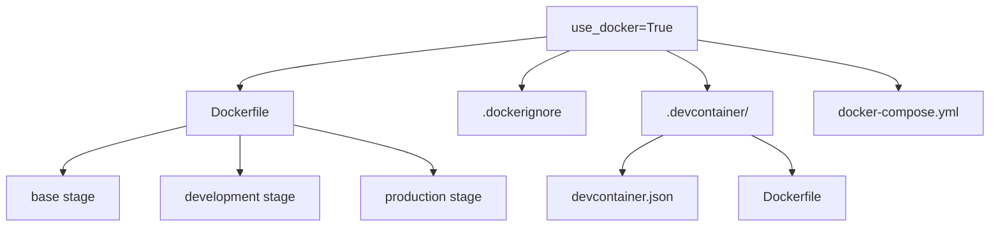

# Docker & Containers

Cytocast generates a complete containerization stack when `use_docker=True`: a multi-stage Dockerfile, DevContainer configuration, docker-compose for local orchestration, and a configurable base image.

## Architecture



## Multi-Stage Dockerfile (F51)

The generated Dockerfile uses three stages for efficient builds:

### Base Stage

```dockerfile
FROM ubuntu:24.04 as base
RUN apt-get update && apt-get install -y python3 python3-pip python3-venv git curl
RUN pip install uv
WORKDIR /app
COPY pyproject.toml README.md ./
RUN uv pip install --system -e .
```

### Development Stage

```dockerfile
FROM base as development
RUN uv pip install --system -e ".[dev,test,notebooks]"
# If use_experiments=True:
RUN uv pip install --system -e ".[mlops]"
```

### Production Stage

```dockerfile
FROM base as production
COPY src/ ./src/
RUN useradd --create-home --shell /bin/bash app
USER app
HEALTHCHECK --interval=30s --timeout=30s --start-period=5s --retries=3 \
    CMD python -c "import my_package; print('OK')" || exit 1
CMD ["python", "-m", "my_package"]
```

## .dockerignore (F52)

Auto-generated to exclude:

- `.git/`, `.venv/`, `__pycache__/`
- `*.pyc`, `*.pyo`
- `data/`, `logs/`, `results/` (large directories)
- `.env` (secrets)

## DevContainer Configuration (F53)

The DevContainer setup enables one-click development environments in VS Code, GitHub Codespaces, or any DevContainer-compatible IDE:

```json
{
  "name": "my-project-dev",
  "build": {
    "dockerfile": "Dockerfile",
    "target": "development"
  },
  "features": {
    "ghcr.io/rocker-org/devcontainer-features/quarto-cli:1": {}
  },
  "customizations": {
    "vscode": {
      "extensions": [
        "charliermarsh.ruff",
        "ms-python.python",
        "ms-python.ty",
        "quarto.quarto"
      ]
    }
  }
}
```

## docker-compose.yml (F54)

For local multi-container setups:

```yaml
services:
  app:
    build:
      context: .
      target: development
    volumes:
      - .:/app
    ports:
      - "8888:8888"  # JupyterLab
```

## Base Image Selection (F55)

The `docker_base_image` parameter controls the base image:

```bash
# Default: Ubuntu 24.04
copier copy --trust gh:cytognosis/cytocast my-project \
  --data docker_base_image=ubuntu:24.04

# NVIDIA CUDA base for GPU workloads
copier copy --trust gh:cytognosis/cytocast my-project \
  --data docker_base_image=nvidia/cuda:12.1-devel-ubuntu22.04
```

## Nox Docker Sessions

Two nox sessions manage Docker builds:

```bash
# Build the Docker image
nox -s docker_build

# Push to registry (uses docker_image from copier.yaml)
nox -s docker_push
```

The image name defaults to `ghcr.io/<github_user>/<github_repo>`.

## Design Decisions

**Why multi-stage builds?**
The development stage includes all dev dependencies (linters, test tools, notebooks) while the production stage ships only runtime dependencies, resulting in smaller images.

**Why DevContainer features instead of manual install?**
DevContainer features are declarative, cached, and compose cleanly. Installing Quarto via a feature is more reliable than apt-get in a Dockerfile.

[← Back to Feature Index](index.md)
