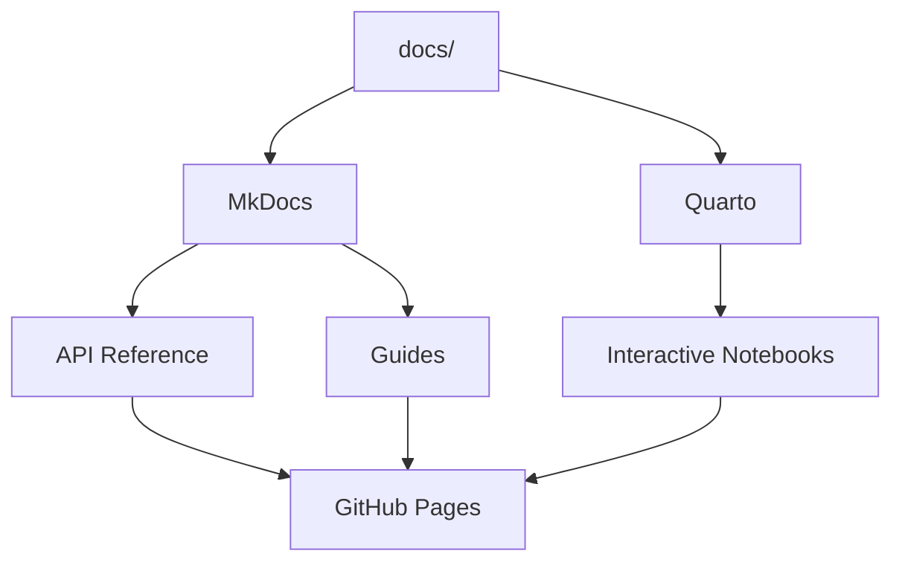

# Documentation Framework

Cytocast generates a complete documentation pipeline supporting MkDocs (API reference) and Quarto (interactive notebooks), with automated deployment to GitHub Pages.

## Documentation Architecture



## MkDocs Setup

Cytocast uses MkDocs with the Material theme for API documentation and guides:

```bash
# Build documentation
nox -s docs_build

# Serve locally with live reload
nox -s docs_serve

# Deploy to GitHub Pages
nox -s docs_publish
```

### Configuration

Generated projects include a `mkdocs.yml`:

```yaml
site_name: My Project
theme:
  name: material
  palette:
    scheme: slate

plugins:
  - search
  - mkdocstrings:
      handlers:
        python:
          options:
            docstring_style: google
```

## Quarto Setup

For projects with `include_notebooks=True`, Quarto handles interactive content:

```bash
# Preview with live reload
nox -s quarto_preview

# Build to static HTML
nox -s quarto_build

# Publish to GitHub Pages
nox -s quarto_publish
```

### Configuration

The `_quarto.yml` configures rendering:

```yaml
project:
  type: website
  output-dir: _site

website:
  title: My Project
  navbar:
    left:
      - text: Home
        href: index.qmd
      - text: Notebooks
        href: notebooks/

format:
  html:
    theme: cosmo
```

## Docstring Standard

Cytocast defaults to Google-style docstrings, validated by Ruff's `D` rules (from Local Dev tier onwards):

```python
def detect_biomarkers(
    sample: CellSample,
    threshold: float = 0.95,
) -> list[Biomarker]:
    """Detect biomarkers in a cell sample above the given threshold.

    Args:
        sample: The cell sample to analyze.
        threshold: Minimum confidence score for detection.

    Returns:
        List of detected biomarkers above the threshold.

    Raises:
        InvalidSampleError: If the sample is corrupted.
    """
```

Alternative styles are available via the `docstring_style` parameter:
- `google` (default): Google Python Style Guide
- `numpy`: NumPy docstring format
- `sphinx`: Sphinx-compatible reStructuredText

## GitHub Actions Integration

### docs.yml Workflow

```yaml
name: Deploy Docs
on:
  push:
    branches: [main]

jobs:
  deploy:
    runs-on: ubuntu-latest
    steps:
      - uses: actions/checkout@v4
      - name: Build and deploy
        run: |
          nox -s docs_build
          nox -s docs_publish
```

### quarto.yaml Workflow

Renders Quarto notebooks on PRs and comments preview links:

```yaml
on:
  pull_request:
    paths: ['**/*.qmd', '_quarto.yml']

steps:
  - name: Render notebooks
    run: quarto render docs/
  - name: Upload artifact
    uses: actions/upload-artifact@v4
    with:
      name: quarto-preview
      path: docs/_site/
```

## Optional Dependencies

Documentation tools are in the `docs` optional group:

```toml
[project.optional-dependencies]
docs = [
    "mkdocs>=1.5",
    "mkdocs-material>=9.0",
    "mkdocstrings[python]>=0.24",
]
```

```bash
# Install documentation dependencies
uv sync --extra docs
```

[← Back to the Comparative Study](comparative_study.md)
