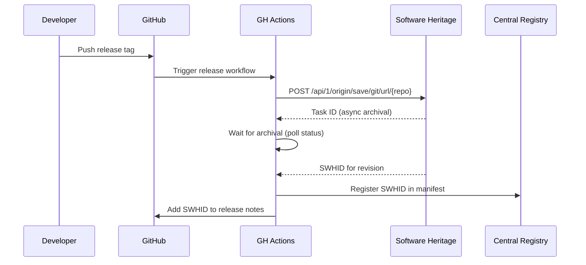

# Central Asset Registry: Backend Research & Architecture

> D1: Storage backends per entity type, specialized repositories, and central registry design.

---

## 1. Executive Summary

The Cytognosis Central Asset Registry (`cytognosis://` URI scheme) abstracts multiple specialized storage backends behind a uniform interface. Each entity type uses the **best-fit primary backend** for its data characteristics, with standardized metadata in the registry catalog.

This document maps every entity type to its recommended primary and secondary backends, evaluates specialized repositories for bio-specific assets, and defines the integration architecture.

---

## 2. Entity Types and Backend Requirements

### Asset Classification

| Entity Type | Size Range | Mutability | Versioning | FAIR Needs | Access Pattern |
|------------|-----------|------------|------------|-----------|---------------|
| **Schemas/ontologies** | KB–MB | Low (versioned releases) | Semantic versioning | DOI + SWHID | Pull-on-change |
| **Locked envs** | KB | Low | Per-release | SWHID | Pull-at-build |
| **Dockerfiles** | KB | Low | Per-release | SWHID | Pull-at-build |
| **Source code** | KB–GB | High | Git commits | SWHID | Clone/checkout |
| **Skills (agent)** | KB–MB | Medium | Git + semver | SWHID | Pull-on-change |
| **MCPs** | KB–MB | Medium | Git + semver | SWHID | Pull-on-change |
| **Datasets (tabular)** | MB–TB | Low (append-only) | Content-hash | DOI + DVC hash | Stream/query |
| **Datasets (genomic)** | GB–PB | Very low | Content-hash | DOI + DVC hash | TileDB query |
| **Datasets (imaging)** | GB–TB | Very low | Content-hash | DOI + DVC hash | TileDB/Zarr |
| **ML models** | MB–GB | Low (versioned) | Model registry | DOI + HF rev | Pull-for-inference |
| **RO-Crates** | MB | Immutable (published) | DOI | DOI | Fetch-by-ID |
| **KG snapshots** | GB | Low (rebuilt) | Content-hash | DOI + DVC hash | Neo4j import |
| **Components** | KB | Low | Semver | SWHID | Pull-at-build |
| **Container images** | MB–GB | Immutable (built) | OCI digest | OCI digest | Pull-at-run |
| **Papers (PDFs)** | MB | Immutable | DOI | DOI | Fetch-by-DOI |
| **Annotations** | KB–MB | High | Temporal | URN | Stream/query |

---

## 3. Primary Backends Per Entity Type

### 3.1 Text/Code-Like Artifacts (SWHID-identified)

These are small, text-based, slowly-changing assets where content-addressing via SWHID provides strong provenance guarantees.

| Asset | Primary Backend | Secondary | Identifier |
|-------|----------------|-----------|------------|
| Schemas/ontologies | **GitHub** + GCP Artifact Registry (Python) | Zenodo (archived releases) | `swhid:` |
| Locked envs | **GitHub** (in cytoskeleton repo) | GCP AR | `swhid:` |
| Dockerfiles | **GitHub** (in cytoskeleton repo) | GCP AR | `swhid:` |
| Components | **GitHub** (in cytoskeleton repo) | GCP AR | `swhid:` |
| Skills | **GitHub** (in cytoskills repo) | PyPI/GCP AR | `swhid:` |
| MCPs | **GitHub** (in cytoskills repo) | npm/GCP AR | `swhid:` |
| Source code | **GitHub** | Software Heritage | `swhid:` |

> [!NOTE]
> **SWHID for text artifacts**: Software Heritage Identifiers (ISO 18670:2025) provide content-addressed, persistent identifiers for any textual artifact. For schemas, locked envs, Dockerfiles, and similar small text files, SWHID is the natural choice because:
> - Content-addressed (any change = new ID)
> - Persistent (archived by Software Heritage)
> - Standardized (ISO standard)
> - Free and open
>
> **Alternatives considered**: Git blob SHAs (not persistent), DOI (overkill for individual files), ARK (less tooling), IPFS CID (no persistence guarantee)

### 3.2 Data Artifacts (Content-hash identified)

| Asset | Primary Backend | Secondary | Identifier |
|-------|----------------|-----------|------------|
| Tabular datasets | **GCS** (`gs://cytognosis-data/`) | DVC remote | `sha256:` or `dvc:md5:` |
| Genomic (VCF) | **TileDB-VCF** on GCS | DVC for raw files | `tiledb:` URI |
| Single-cell (h5ad) | **TileDB-SOMA** on GCS | CELLxGENE Discover | `tiledb:` URI |
| Imaging | **TileDB-BioImaging** on GCS | Zarr on GCS | `tiledb:` URI |
| Papers (PDFs) | **Google Drive** (Library/) | GCS archive | `doi:` |
| KG snapshots | **GCS** + **Neo4j** | DVC | `sha256:` |

### 3.3 Model Artifacts

| Asset | Primary Backend | Secondary | Identifier |
|-------|----------------|-----------|------------|
| ML models (general) | **Hugging Face** (`cytognosis/` org) | GCS + MLflow | `hf:org/model@rev` |
| Bio models (LEGO) | **Hugging Face** (w/ biotoolsSchema card) | GCS + MLflow | `hf:org/model@rev` |
| ONNX exports | **Hugging Face** | GCS | `hf:` |
| Safetensors | **Hugging Face** | GCS | `hf:` |

### 3.4 Compute Artifacts

| Asset | Primary Backend | Secondary | Identifier |
|-------|----------------|-----------|------------|
| Container images | **GCP Artifact Registry** (Docker) | GitHub Container Registry | `oci:sha256:` |
| Published packages | **GCP Artifact Registry** (Python) | PyPI (public releases) | PyPI name@version |
| npm packages | **GCP Artifact Registry** (npm) | npmjs (public releases) | npm name@version |

### 3.5 Published Research Objects

| Asset | Primary Backend | Secondary | Identifier |
|-------|----------------|-----------|------------|
| RO-Crates | **FAIRDOM-SEEK** (`hub.cytognosis.org`) | Zenodo | `doi:` |
| Workflows | **WorkflowHub** (`workflows.cytognosis.org`) | workflowhub.eu | TRS ID + `doi:` |
| Investigations | **FAIRDOM-SEEK** | FAIRDOMHub | `doi:` |

---

## 4. Specialized Repository Evaluation

### 4.1 Model Repositories

| Repository | Fit | Domain | LEGO Compatible? | Recommendation |
|-----------|-----|--------|-------------------|----------------|
| **Hugging Face Hub** | Primary | General ML | Yes (model cards, inference API) | **USE as primary model backend** |
| **MONAI Model Zoo** | Reference | Medical imaging | Yes (bundle format is composable) | Adopt MONAI Bundle metadata format |
| **Kipoi** | Reference | Genomics | Yes (dataloader + model specs) | Adopt Kipoi-style I/O typing |
| **Bioimage.IO** | Reference | Bioimaging | Yes (RDF spec for tensor I/O) | Adopt tensor axis specification |
| **sfaira** | Reference | Single-cell | Partial (data loaders only) | Use patterns for data loading |
| **scvi-hub** | Reference | Single-cell | Yes (HF-wrapped) | Follow HF wrapping pattern |
| **MLflow Model Registry** | Secondary | Experiment tracking | Yes (run linkage) | USE for experiment-model linkage |

### 4.2 Dataset Repositories

| Repository | Fit | Domain | Recommendation |
|-----------|-----|--------|----------------|
| **LaminDB** | Primary candidate | Biological datasets | **EVALUATE DEEPLY** (agent researching) |
| **CELLxGENE Discover** | Mirror | Single-cell census | Mirror public datasets there |
| **OpenNeuro** | Mirror | Neuroimaging (BIDS) | Mirror neuro datasets there |
| **PhysioNet** | Source | Physiological data | Pull from, publish to |
| **Zenodo** | Archival | All types | Publish DOI-minted releases |
| **Dryad** | Alternative | Research data | Consider for specific journals |
| **Figshare** | Alternative | Research data | Consider for supplementary data |

### 4.3 Code Repositories

| Repository | Fit | Purpose | Recommendation |
|-----------|-----|---------|----------------|
| **GitHub** | Primary | Source code, CI/CD | Already using |
| **Software Heritage** | Archival | Persistent code archival | Submit on release → SWHID |
| **Zoekt** | Internal | Code search across repos | **Deploy at `code.cytognosis.org`** |
| **GitNexus** | Alternative | Repo ingestion + AI | **EVALUATE** (interesting for agent-accessible code browsing) |

### 4.4 Schema/Ontology Repositories

| Repository | Fit | Purpose | Recommendation |
|-----------|-----|---------|----------------|
| **BioPortal** | Mirror | Ontology hosting | Submit our ontologies there |
| **Ontology Lookup Service (OLS)** | Reference | Search/browse | Reference for external ontologies |
| **Linked Open Vocabularies (LOV)** | Mirror | SKOS vocabularies | Submit our SKOS vocabs |
| **Bioregistry** | Reference | Prefix registry | Align all our prefixes |
| **Prefix.cc** | Reference | CURIE resolution | Register `cytognosis:` prefix |

---

## 5. SWHID Implementation Details

### 5.1 What Gets a SWHID?

| Artifact | SWHID Type | When Minted | How |
|----------|-----------|-------------|-----|
| Git repository | `swh:1:ori:` (origin) | On first SWH archival | SWH Save Code Now API |
| Git revision | `swh:1:rev:` | On each release | SWH API |
| Directory tree | `swh:1:dir:` | On each archival | SWH API |
| Individual file | `swh:1:cnt:` | On each archival | SWH API |
| Snapshot | `swh:1:snp:` | On each archival | SWH API |
| Release tag | `swh:1:rel:` | On each release | SWH API |

### 5.2 SWHID Minting Flow



### 5.3 SWHID in Configs

```yaml
# cytoskeleton/configs/components/python/biocypher/component.yaml
name: biocypher
version: "0.6.9"
swhid: "swh:1:cnt:abc123..."  # Content hash of this specific file
source_swhid: "swh:1:rev:def456..."  # The cytoskeleton revision that contains it
```

### 5.4 Alternatives Considered

| Identifier | Pros | Cons | Verdict |
|-----------|------|------|---------|
| SWHID | ISO standard, persistent, content-addressed, free | Submission latency (hours-days) | **Primary for code/text** |
| Git blob SHA | Instant, content-addressed | Not persistent outside repo, no standard URI | Use locally, SWHID for publishing |
| IPFS CID | Content-addressed, distributed | No persistence guarantee, needs pinning | Skip |
| DOI | Persistent, widely recognized | Not content-addressed, costs money at scale | Use for published research objects only |
| ARK | Persistent, content-neutral | Less tooling, less recognized | Use via FAIRSCAPE for internal artifacts |
| Handle | Persistent | Less common in software | Skip |

---

## 6. VFS Chain Resolution

The `cytoskeleton.vfs` module resolves `cytognosis://` URIs by walking a configured driver chain:

```
cytognosis://data/sha256:abc123...
     ↓ (parse URI scheme + type + hash)
     ↓
[1] Local cache  → ~/.cytognosis/cache/sha256/abc123...
     ↓ (miss)
[2] DVC remote   → gs://cytognosis-data/dvc/files/md5/ab/c123...
     ↓ (miss)  
[3] GCS direct   → gs://cytognosis-data/datasets/...
     ↓ (miss)
[4] TileDB       → tiledb://cytognosis/datasets/...
     ↓ (miss)
[5] Zenodo       → https://zenodo.org/api/records/...
     ↓ (miss)
[6] SWH          → https://archive.softwareheritage.org/api/1/content/sha256:abc123.../raw/
     ↓ (miss)
[ERROR] Artifact not found in any configured backend
```

### Driver Priority Configuration

```yaml
# cytoskeleton VFS config (per environment)
vfs:
  drivers:
    - type: local
      cache_dir: ~/.cytognosis/cache
      max_cache_gb: 50
    - type: dvc
      remote: cytognosis-gcs
    - type: gcs
      project: cytognosis-data
      buckets: [cytognosis-data, cytognosis-phi-prod]
    - type: tiledb
      namespace: cytognosis
    - type: zenodo
      token: ${ZENODO_TOKEN}
    - type: swh
      # No auth needed for reads
    - type: hf
      token: ${HF_TOKEN}
  
  # HIPAA-isolated environments
  hipaa_isolated:
    drivers:
      - type: local
      - type: gcs
        project: cytognosis-phi-prod
        buckets: [cytognosis-phi-prod]
      # No Drive, HF, Zenodo, or SWH
```

---

## 7. Integration with FAIRDOM-SEEK

### Self-Hosted SEEK Instance

Per the reproducibility strategy, we deploy FAIRDOM-SEEK at `hub.cytognosis.org`:

- **Purpose**: ISA-compliant experiment registry (Investigations → Studies → Assays)
- **Architecture**: Cloud Run (Rails app) + Cloud SQL (Postgres) + Solr
- **Federation**: Mirrors to FAIRDOMHub, WorkflowHub
- **Auth**: ELIXIR-AAI via OIDC

### SEEK as Registry, Not Storage

SEEK stores **metadata and small files** only. Large data assets remain in their primary backends (GCS, TileDB, HF). SEEK references them by `cytognosis://` URI.

```
SEEK DataFile entity:
  title: "ABCD HRV Features"
  content_blobs:
    - url: "cytognosis://data/sha256:abc123..."  # Resolved by VFS
      original_filename: "abcd_hrv_features.parquet"
      content_type: "application/parquet"
```

---

## 8. Tagging and Discovery

### CURIE Resolution

All entity references use fully-qualified CURIEs:

```
cytognosis:schema/sensor/v1.0.0     → cytoskeleton/schemas/domains/sensor.yaml@v1.0.0
cytognosis:model/cytoscope-v1       → hf:cytognosis/cytoscope-v1
cytognosis:data/mcphases/cgm        → gs://cytognosis-data/datasets/mcphases/cgm/
cytognosis:skill/pubmed-database    → cytoskills skills registry
cytognosis:env/cytognosis-base/v2.1 → cytoskeleton configs/environments/cytognosis-base/
```

### Prefix Registry

| Prefix | URI Base | Registry |
|--------|----------|----------|
| `cytognosis:` | `https://cytognosis.org/ns/` | Bioregistry + prefix.cc |
| `cyto:` | `https://cytognosis.org/ontology/` | Our ontologies (SE, org function) |
| `apqc:` | `urn:apqc:pcf:` | APQC PCF (per skill-tagging recommendation) |
| All bioregistry prefixes | Per bioregistry | Inherited |

### Tagging System

Per the [skill-tagging ontology recommendation](file:///home/mohammadi/Documents/Claude/Projects/Refactor/skill-tagging-ontology-recommendation.md):

- **Axis A** (coding/use-case): `cyto:se/*` — SWEBOK-derived, Wikidata-backed, GitHub Topics aliases
- **Axis B** (org function): `apqc:pcf:*` — APQC PCF, ArchiMate typed, ESCO enriched
- **Configurable labels**: Users can configure which labels/facets appear in their views. The underlying ontology IDs are stable; display labels are a presentation concern.

---

## 9. Open Questions

> [!IMPORTANT]
> **LaminDB vs. build-our-own**: The LaminDB deep analysis (D6) will determine whether we adopt LaminDB as our artifact registry or build equivalent functionality in cytoskeleton. Key factors: dependency weight, API compatibility, ontology overlap with cytos KG.

> [!IMPORTANT]
> **GitNexus evaluation**: Need to assess whether GitNexus provides meaningful advantages over Zoekt for agent-accessible code search across our multi-repo ecosystem.

---

## 10. Next Steps

1. Wait for LaminDB deep analysis (D6) before finalizing artifact registry strategy
2. Wait for TileDB Cloud analysis (D8) for compute integration patterns
3. Implement `cytoskeleton.uri` parser for `cytognosis://` URIs
4. Implement `cytoskeleton.vfs.chain` resolver with local + GCS drivers first
5. Register `cytognosis:` prefix with Bioregistry
