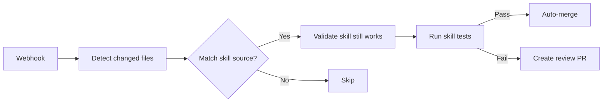

# Cytoskills Automation & Agent Tooling

> D14: Auto-update from linked repos, agent tooling distribution

---

## 1. Problem Statement

Cytoskills houses three types of agent tooling:
1. **Skills** (SKILL.md + scripts + examples): Instructions for AI agents to perform specialized tasks
2. **MCP servers** (server.py/index.ts + config): Model Context Protocol tools that extend agent capabilities
3. **Agent memories/configs** (MEMORY.md + agent.json): Persistent knowledge and personality configs

Currently, skills are manually maintained. When upstream repos change (e.g., a new API endpoint in a bio database), the corresponding skill becomes stale. Similarly, when new skills are developed during agent conversations (via `workflow-skill-creator`), they must be manually added to cytoskills.

---

## 2. Auto-Update Architecture

### 2.1 Linked Repository Pattern

Each skill can declare a source repository that it wraps or depends on:

```yaml
# skills/pubmed-database/SKILL.md frontmatter
---
name: pubmed-database
description: Search PubMed for scientific literature
source:
  repo: https://github.com/cytognosis/cytos
  path: src/cytos/scholarly/pubmed/
  watch:
    - src/cytos/scholarly/pubmed/**/*.py
    - schemas/domains/scholarly.yaml
version_sync: true
auto_update:
  trigger: source_change
  action: regenerate_skill
---
```

### 2.2 Update Triggers

| Trigger | Mechanism | Action |
|---------|-----------|--------|
| Source repo change | GitHub webhook → CI | Re-validate skill, flag for review |
| API spec change | Scheduled check | Update API endpoints in skill |
| Schema change | LinkML schema diff | Update type references |
| New skill created | Agent `workflow-skill-creator` | PR to cytoskills |
| Deprecation | Upstream deprecation notice | Flag skill for removal/update |

### 2.3 CI Pipeline



---

## 3. Skill Registry Design

### 3.1 Skill Manifest

Each skill publishes a manifest to the central registry:

```yaml
# skills/pubmed-database/manifest.yaml
id: cytognosis:skill/pubmed-database
name: pubmed-database
version: 2.1.0
swhid: swh:1:cnt:abc123...
description: Search PubMed for scientific literature
tags:
  use_case:
    primary: cyto:se/construction
    aliases: [literature-search, pubmed, ncbi]
  org_function:
    primary: cyto:science/scholarly
    aliases: [research, literature, papers]
triggers:
  - pattern: "pubmed|ncbi|literature search|find papers"
    confidence: high
  - pattern: "search for.*papers|scientific literature"
    confidence: medium
dependencies:
  python: ["biopython>=1.80", "httpx>=0.25"]
  skills: ["science-skills-common"]
platforms:
  - antigravity
  - claude
  - cursor
```

### 3.2 Registry Index

The registry maintains an index for fast discovery:

```
cytoskills/
├── registry/
│   ├── index.yaml         # Full skill index (name → manifest)
│   ├── by-tag.yaml        # Tag → skills mapping
│   ├── by-trigger.yaml    # Trigger patterns → skills
│   └── by-platform.yaml   # Platform → available skills
├── skills/
│   ├── pubmed-database/
│   ├── uniprot-database/
│   └── ...
├── mcps/
│   ├── sequential-thinking/
│   ├── obsidian/
│   └── ...
└── agents/
    ├── memories/
    └── configs/
```

---

## 4. Agent Tooling Distribution

### 4.1 MCP Server Management

MCP servers need:
- Installation (npm/pip/cargo)
- Configuration (ports, auth tokens)
- Health monitoring
- Version pinning

```yaml
# mcps/sequential-thinking/mcp.yaml
id: cytognosis:mcp/sequential-thinking
name: sequential-thinking
version: 1.5.0
runtime: node
package: "@modelcontextprotocol/server-sequential-thinking"
install: "npx -y @modelcontextprotocol/server-sequential-thinking"
config:
  transport: stdio
tools:
  - sequentialthinking
platforms:
  - antigravity
  - claude-desktop
```

### 4.2 Memory/Config Distribution

Agent memories and configurations are version-controlled:

```
agents/
├── memories/
│   ├── MEMORY.md              # Global memory (shared across all agents)
│   ├── cytognosis-brand.md    # Brand-specific knowledge
│   └── scientific-platform.md # Platform knowledge
├── configs/
│   ├── antigravity/
│   │   ├── settings.json
│   │   └── keybindings.json
│   ├── claude/
│   │   ├── CLAUDE.md
│   │   └── settings.json
│   └── cursor/
│       └── .cursorrules
└── personas/
    ├── researcher.yaml        # Researcher persona config
    ├── engineer.yaml          # Engineer persona config
    └── communicator.yaml      # Communications persona config
```

---

## 5. Configurable Tagging Labels

### User-Configurable Display

The underlying ontology (SWEBOK Axis A, APQC Axis B) provides stable machine-readable IDs. Display labels are configurable per user/workspace:

```yaml
# .cytoskills/display-config.yaml
label_preferences:
  # Show simplified labels instead of full APQC paths
  "apqc:pcf:8.0": "IT & Engineering"
  "apqc:pcf:3.0": "Marketing & Sales"
  "cyto:se/construction": "Coding"
  "cyto:se/testing": "Testing"
  
  # Custom groupings
  groups:
    "Biomedical Research":
      - "cyto:science/computational-biology"
      - "cyto:science/genomics"
      - "cyto:science/scholarly"
    "Infrastructure":
      - "apqc:pcf:8.0"
      - "cyto:se/operations"
```

---

## 6. Implementation Priority

| Task | Priority | Depends On |
|------|----------|-----------|
| Skill manifest schema (LinkML) | P0 | — |
| Registry index generator | P0 | Manifest schema |
| CI validation pipeline | P1 | Registry index |
| Source-watching webhooks | P1 | CI pipeline |
| MCP management CLI | P1 | — |
| Display label configuration | P2 | Tagging ontology |
| Auto-skill-creation from conversations | P2 | Workflow-skill-creator |
