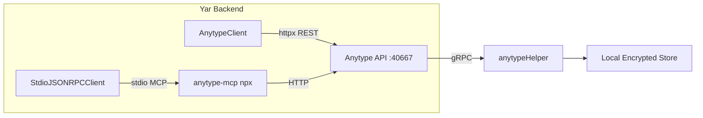

# Anytype API & MCP Reference for Yar

> [!NOTE]
> Extracted from [developers.anytype.io](https://developers.anytype.io) (v2025-11-08) and [anytype-mcp](https://github.com/anyproto/anytype-mcp) v1.2.7. Scoped to Yar's cognitive companion use cases.

## Architecture Overview



**Key insight**: The Anytype MCP server is just an OpenAPI-to-MCP bridge. It converts the REST API spec into MCP tools, then proxies requests to the same local HTTP API. For production use, calling the REST API directly via `httpx` eliminates subprocess overhead, process lifecycle management, and the MCP protocol handshake.

## Authentication

| Method | Flow | Use Case |
|---|---|---|
| **Desktop UI** | Settings → API Keys → Create new | Manual setup |
| **Programmatic** | `POST /v1/auth/challenges` → get `challenge_id` → user reads 4-digit code from Anytype UI → `POST /v1/auth/api_keys` with `challenge_id` + `code` → returns `api_key` | Automated onboarding |

**Auth header**: `Authorization: Bearer <api_key>` + `Anytype-Version: 2025-11-08`

**Rate limits**: Sustained 1 req/s, burst size 60. Disable with `ANYTYPE_API_DISABLE_RATE_LIMIT=1`.

**Port**: The `anytypeHelper` process binds to a **random port** (not the documented 31009). Port must be discovered dynamically by inspecting the process or reading the Electron config.

---

## Complete Endpoint Map (v2025-11-08)

### Auth (2 endpoints)

| Method | Path | Description |
|---|---|---|
| `POST` | `/v1/auth/challenges` | Create auth challenge (returns `challenge_id`) |
| `POST` | `/v1/auth/api_keys` | Exchange `challenge_id` + `code` for API key |

### Search (2 endpoints) — **Critical for Yar**

| Method | Path | Description |
|---|---|---|
| `POST` | `/v1/search` | Global search across all spaces |
| `POST` | `/v1/spaces/{space_id}/search` | Search within a specific space |

**Request body**:
```json
{
  "query": "project",
  "types": ["page", "task"],
  "sort": {
    "direction": "desc",
    "property": "last_modified_date"
  }
}
```
**Pagination**: `?offset=0&limit=10` (query params)

### Spaces (4 endpoints)

| Method | Path | Description |
|---|---|---|
| `GET` | `/v1/spaces` | List all spaces |
| `GET` | `/v1/spaces/{space_id}` | Get space details |
| `PATCH` | `/v1/spaces/{space_id}` | Update space |
| `POST` | `/v1/spaces` | Create space |

### Objects (5 endpoints) — **Critical for Yar**

| Method | Path | Description |
|---|---|---|
| `GET` | `/v1/spaces/{space_id}/objects` | List objects (paginated) |
| `GET` | `/v1/spaces/{space_id}/objects/{object_id}` | Get object (with markdown body) |
| `POST` | `/v1/spaces/{space_id}/objects` | Create object |
| `PATCH` | `/v1/spaces/{space_id}/objects/{object_id}` | Update object (name, body, type_key, properties) |
| `DELETE` | `/v1/spaces/{space_id}/objects/{object_id}` | Archive object |

**Create Object payload**:
```json
{
  "name": "Research Notes",
  "icon": {"emoji": "📄", "format": "emoji"},
  "body": "## Introduction\nThis project will...",
  "type_key": "page",
  "properties": [
    {"key": "description", "text": "My notes"},
    {"key": "done", "checkbox": true}
  ]
}
```

### Lists / Collections (4 endpoints)

| Method | Path | Description |
|---|---|---|
| `POST` | `/v1/spaces/{space_id}/lists/{list_id}/objects` | Add objects to list |
| `DELETE` | `/v1/spaces/{space_id}/lists/{list_id}/objects` | Remove objects from list |
| `GET` | `/v1/spaces/{space_id}/lists/{list_id}/views` | List views in a list |
| `GET` | `/v1/spaces/{space_id}/lists/{list_id}/views/{view_id}/objects` | Get objects in a list view |

### Types (5 endpoints)

| Method | Path | Description |
|---|---|---|
| `GET` | `/v1/spaces/{space_id}/types` | List types |
| `GET` | `/v1/spaces/{space_id}/types/{type_id}` | Get type |
| `POST` | `/v1/spaces/{space_id}/types` | Create type (with `key` in camel_case) |
| `PATCH` | `/v1/spaces/{space_id}/types/{type_id}` | Update type |
| `DELETE` | `/v1/spaces/{space_id}/types/{type_id}` | Delete type |

### Properties (5 endpoints)

| Method | Path | Description |
|---|---|---|
| `GET` | `/v1/spaces/{space_id}/properties` | List properties |
| `GET` | `/v1/spaces/{space_id}/properties/{property_id}` | Get property |
| `POST` | `/v1/spaces/{space_id}/properties` | Create property |
| `PATCH` | `/v1/spaces/{space_id}/properties/{property_id}` | Update property |
| `DELETE` | `/v1/spaces/{space_id}/properties/{property_id}` | Delete property |

### Tags (5 endpoints, nested under properties)

| Method | Path | Description |
|---|---|---|
| `GET` | `/v1/spaces/{space_id}/properties/{prop_id}/tags` | List tags |
| `GET` | `/v1/spaces/{space_id}/properties/{prop_id}/tags/{tag_id}` | Get tag |
| `POST` | `/v1/spaces/{space_id}/properties/{prop_id}/tags` | Create tag |
| `PATCH` | `/v1/spaces/{space_id}/properties/{prop_id}/tags/{tag_id}` | Update tag |
| `DELETE` | `/v1/spaces/{space_id}/properties/{prop_id}/tags/{tag_id}` | Delete tag |

### Templates (2 endpoints) & Members (2 endpoints)

| Method | Path | Description |
|---|---|---|
| `GET` | `/v1/spaces/{space_id}/types/{type_id}/templates` | List templates |
| `GET` | `/v1/spaces/{space_id}/types/{type_id}/templates/{template_id}` | Get template |
| `GET` | `/v1/spaces/{space_id}/members` | List members |
| `GET` | `/v1/spaces/{space_id}/members/{member_id}` | Get member |

**Total**: 36 endpoints across 10 resource groups.

---

## MCP Server Tool Mapping

The `@anyproto/anytype-mcp` server auto-generates MCP tools from the OpenAPI spec. Each API endpoint becomes a tool named like `API-<method>-<path-slug>`.

| MCP Tool Name | Maps To |
|---|---|
| `API-search-global` | `POST /v1/search` |
| `API-search-space` | `POST /v1/spaces/{space_id}/search` |
| `API-list-spaces` | `GET /v1/spaces` |
| `API-get-space` | `GET /v1/spaces/{space_id}` |
| `API-list-objects` | `GET /v1/spaces/{space_id}/objects` |
| `API-get-object` | `GET /v1/spaces/{space_id}/objects/{object_id}` |
| `API-create-object` | `POST /v1/spaces/{space_id}/objects` |
| `API-update-object` | `PATCH /v1/spaces/{space_id}/objects/{object_id}` |
| `API-delete-object` | `DELETE /v1/spaces/{space_id}/objects/{object_id}` |
| `API-list-types` | `GET /v1/spaces/{space_id}/types` |
| `API-create-type` | `POST /v1/spaces/{space_id}/types` |
| `API-list-properties` | `GET /v1/spaces/{space_id}/properties` |
| `API-create-property` | `POST /v1/spaces/{space_id}/properties` |
| `API-add-list-objects` | `POST /v1/spaces/{space_id}/lists/{list_id}/objects` |

---

## Gap Analysis: Yar Adapter vs Anytype API

| # | Capability | API Support | Current Yar Status | Priority |
|---|---|---|---|---|
| 1 | **Direct REST client** | Native HTTP API | MCP stdio only | **P0** |
| 2 | **Markdown body** | `body` field on create/update | Manually composing in payload mapper | **P0** |
| 3 | **Port auto-discovery** | Dynamic port binding | Hardcoded/env-only | **P1** |
| 4 | **Type CRUD** | Full CRUD | Read-only via MCP tool discovery | **P1** |
| 5 | **Property CRUD** | Full CRUD | None | **P1** |
| 6 | **Property-based filtering** | Query params on search/list | Not used | **P1** |
| 7 | **Pagination** | `offset`/`limit` on all list endpoints | Not handled | **P1** |
| 8 | **Rate limiting** | 1 req/s sustained, burst 60 | No client-side limiter | **P2** |
| 9 | **Tags** | Full CRUD under properties | None | **P2** |
| 10 | **Collections/Lists** | Add/remove objects, views | None | **P2** |
| 11 | **Templates** | Read-only | None | **P3** |
| 12 | **Auth flow** | Challenge-based programmatic auth | Manual key only | **P3** |
| 13 | **Members** | List/get members | None | **P3** |

---

## Yar-Relevant Property Formats

| Anytype Format | JSON Key | Example |
|---|---|---|
| `text` | `"text": "value"` | `{"key": "description", "text": "A note"}` |
| `number` | `"number": 42` | `{"key": "score", "number": 95}` |
| `checkbox` | `"checkbox": true` | `{"key": "done", "checkbox": false}` |
| `date` | `"date": "2025-11-08"` | `{"key": "due_date", "date": "2025-12-01"}` |
| `url` | `"url": "https://..."` | `{"key": "source", "url": "https://arxiv.org/..."}` |
| `select` | `"select": "option_id"` | `{"key": "status", "select": "in_progress"}` |
| `multi_select` | `"multi_select": [...]` | `{"key": "tags", "multi_select": ["ai", "neuro"]}` |
| `object` | `"object": "obj_id"` | `{"key": "author", "object": "baf..."}` |
| `files` | `"files": [...]` | `{"key": "attachments", "files": ["file_id"]}` |
