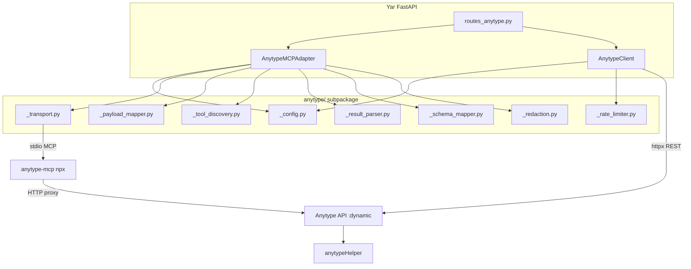

# Anytype Integration Refactor Plan

> [!NOTE]
> Updated 2026-05-17. All docs consolidated into `docs/` within the Yar repo.

## Architecture



## Status Tracker

| # | Task | Status | Notes |
|---|---|---|---|
| 1 | Decompose monolith → 8 modules | ✅ Done | 1,283 → 558 lines |
| 2 | Update all imports codebase-wide | ✅ Done | 127/127 pass |
| 3 | Backward-compat re-exports | ✅ Done | `integrations/__init__.py` |
| 4 | Direct REST client (`client.py`) | ✅ Done | 36 endpoints, rate-limited |
| 5 | Port auto-discovery | ✅ Done | `ss -tlnp` + `ANYTYPE_API_BASE_URL` fallback |
| 6 | Rate limiter | ✅ Done | Token bucket, 1 req/s sustained, burst 60 |
| 7 | Config extended | ✅ Done | `rest_configured`, `mcp_configured`, `api_base_url` |
| 8 | Comprehensive test suite | ✅ Done | 35 new tests, 162/162 total |
| 9 | API reference doc | ✅ Done | `docs/integrations/anytype_api_reference.md` |
| 10 | Docs consolidated to repo | ✅ Done | 23 docs in `docs/`, indexed |
| 11 | Extract business logic to `anytype_service.py` | 🔲 TODO | Move `_apply_cap_lite_to_plan()` from routes |
| 12 | Split `models/anytype.py` | 🔲 TODO | `anytype_status.py`, `anytype_search.py`, `anytype_write.py` |
| 13 | Shared `_ensure_connected()` decorator | 🔲 TODO | Remove repetitive status checks |
| 14 | Wire `AnytypeClient` into routes (dual-mode) | 🔲 TODO | Prefer REST, fallback to MCP |
| 15 | Live integration tests | 🔲 BLOCKED | Awaiting local Anytype API key config |

## Test Results

```
162 passed, 1 warning in 5.97s
```

## Remaining Tasks Detail

### Task 11: Extract Business Logic (`anytype_service.py`)

`routes_anytype.py` contains plan-building logic (`_apply_cap_lite_to_plan()`) that belongs in a service layer. Create `src/yar/core/anytype_service.py`:
- Move `_apply_cap_lite_to_plan()` and write-plan assembly
- Routes become thin dispatchers
- Estimated: ~30 min

### Task 12: Split `models/anytype.py`

Current file groups all Anytype Pydantic models. Split into:
- `models/anytype_status.py` — `AnytypeStatus`, `AnytypeToolInfo`
- `models/anytype_search.py` — `AnytypeSearchRequest`, `AnytypeSearchResult`
- `models/anytype_write.py` — `AnytypeWritePlan`, `AnytypeWriteResult`
- Estimated: ~20 min

### Task 13: `_ensure_connected()` Decorator

The adapter has repetitive `status()` + `list_tools()` calls in most methods. Extract into a shared decorator or context manager.
- Estimated: ~15 min

### Task 14: Wire `AnytypeClient` into Routes (Dual-Mode)

Make `routes_anytype.py` prefer the direct REST client when `rest_configured` is true, falling back to the MCP adapter. This is the key integration point:
- Add `get_anytype_client()` dependency alongside `get_anytype_adapter()`
- Modify search/read endpoints to use REST client directly
- Write endpoints continue through MCP adapter (for now) due to CAP guard integration
- Estimated: ~45 min

### Task 15: Live Integration Tests

Requires: local Anytype running + valid API key in `ANYTYPE_API_KEY`.
- Test spaces listing
- Test object CRUD cycle (create → read → update → delete)
- Test search with type filtering
- Test property creation
- Skip decorator: `@pytest.mark.skipunless(os.getenv("ANYTYPE_LIVE_TEST"))`
