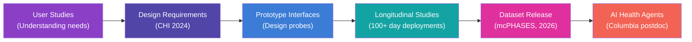
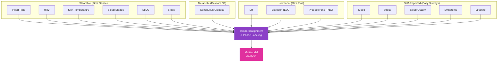

# Blue (Georgianna) Lin: Projects Deep Dive — Design Inspiration for Yar

> **Document Type:** Design Inspiration Research
> **Author:** Cytognosis AI Agent
> **Date:** 2026-05-30
> **Version:** 1.0
> **Scope:** Comprehensive analysis of Blue Lin's health data projects, UX patterns, and design philosophy for Yar product roadmap
> **Status:** Final
> **Primary Source:** [bluelin.me](https://bluelin.me)
> **Cross-References:**
> - [yar-unified-feature-comparison.md](file:///home/mohammadi/repos/cytognosis/docs/cytonome/yar/research/yar-unified-feature-comparison.md)
> - [cytonome-master-reference.md](file:///home/mohammadi/repos/cytognosis/docs/cytonome/yar/cytonome-master-reference.md)

---

## 1. Executive Summary

Blue (Georgianna) Lin is a Postdoctoral Research Fellow at Columbia University's Department of Biomedical Informatics, working with Xuhai "Orson" Xu and Noémie Elhadad on multi-agent systems for women's health and longitudinal, personalized health agents. She earned her PhD in Computer Science from the University of Toronto (advised by Khai N. Truong and Alex Mariakakis), with a dissertation titled "Multimodal Tracking with Ubiquitous Devices to Foster Holistic Menstrual Health Sensemaking." Her work sits at the intersection of Human-Computer Interaction (HCI), AI/ML, health informatics, and human physiology, with a consistent focus on enhancing user agency, supporting health sensemaking, and building tools that empower individuals to understand their bodies through data.

This document analyzes Lin's research portfolio as a design inspiration study for Yar, Cytognosis's cognitive companion for neurodivergent users. While Lin's work focuses on menstrual health and Yar targets cognitive/emotional state tracking, the underlying design challenges are deeply parallel: both require users to interpret complex, multimodal, longitudinal biological signals; both must support sensemaking without overwhelming users; both must be inclusive, personalized, and respectful of user agency. Lin's work represents some of the most rigorous, user-centered health data visualization research in HCI, and her patterns translate directly to Yar's challenge space.

> [!IMPORTANT]
> This is NOT a competitor analysis. Lin's work is academic research, not a commercial product competing with Yar. This document studies her design patterns, visualization techniques, and methodological approaches as inspiration for Yar's health-aware cognitive companion features.

---

## 2. Researcher Profile

### 2.1 Academic Background

| Attribute | Detail |
|:---|:---|
| **Name** | Georgianna "Blue" Lin |
| **Current Role** | Postdoctoral Research Fellow, Columbia University (Dept. of Biomedical Informatics) |
| **Co-Advisors** | Xuhai "Orson" Xu, Noémie Elhadad |
| **PhD** | Computer Science, University of Toronto (2024) |
| **PhD Advisors** | Khai N. Truong, Alex Mariakakis |
| **Prior Education** | B.S. and M.S. in Computer Science, Georgia Institute of Technology |
| **Research Areas** | HCI, health informatics, AI/ML, ubiquitous computing, personal informatics |
| **Website** | [bluelin.me](https://bluelin.me) |

### 2.2 Awards and Recognition

- **Google PhD Fellowship** (2023)
- **Wolfond Fellowship**
- **Bill Buxton Outstanding Dissertation Award** in HCI
- **GVU Distinguished Master's Student Award** (Georgia Tech)

### 2.3 Research Identity

Lin describes her work as "augmenting health and wellbeing, particularly for marginalized communities, through multimodal ubiquitous technologies." This framing directly parallels Cytognosis's mission of making precision health a human right. Her consistent focus on user agency over automated decision-making, on sensemaking over prediction, and on inclusivity over convenience makes her work a natural reference point for Yar's design philosophy.

---

## 3. Project Portfolio Overview

### 3.1 Primary Research Thread: Menstrual Health Sensemaking

Lin's PhD and postdoctoral work form a coherent research program that progresses from understanding user needs, through building prototypes, to releasing research infrastructure (datasets), and finally to designing AI-powered longitudinal health agents. The progression is:



### 3.2 Publication Timeline

| Year | Venue | Title / Topic | Significance |
|:---|:---|:---|:---|
| 2023 | npj Digital Medicine | Blood glucose variance measured by CGM across the menstrual cycle | First rigorous CGM-menstrual cycle correlation study |
| 2024 | npj Women's Health | Understanding wrist skin temperature changes to hormone variations | Wearable-hormone association mapping |
| 2024 | CHI | Functional Design Requirements to Facilitate Menstrual Health Data Exploration | Five validated design requirements for health data UX |
| 2024 | IMWUT/UbiComp | Users' Perspectives on Multimodal Menstrual Tracking Using Consumer Health Devices | Longitudinal user study of multimodal tracking |
| 2025 | IMWUT | The Cognitive Strategies Behind Multimodal Health Sensemaking | Cognitive framework for health data interpretation |
| 2026 | Scientific Data | mcPHASES dataset release | Public multimodal menstrual health dataset on PhysioNet |
| Ongoing | Columbia | Multi-agent systems for longitudinal personalized health | AI agents for women's health |

### 3.3 Earlier Work: Georgia Tech

During her time at Georgia Tech, Lin worked on ubiquitous computing topics including head-worn displays for task guidance ("Towards Finding the Optimum Position in the Visual Field for a Head Worn Display Used for Task Guidance with Non-registered Graphics," IMWUT). This earlier work in spatial computing and task guidance shares DNA with Yar's PiP focus mode and ambient awareness features, where information must be positioned to assist without overwhelming.

---

## 4. Menstrual Health Tracking: Deep Dive

### 4.1 Problem Framing

Lin's central argument is that existing menstrual health trackers suffer from three fundamental design failures:

1. **Reductionism**: Most trackers reduce menstrual health to a single prediction (next period date) and a symptom log, ignoring the complex interplay of hormones, metabolism, sleep, stress, and physiology across the cycle.

2. **Passive data collection**: Apps collect data but provide minimal support for interpretation, leaving users to make sense of complex, multimodal information on their own.

3. **One-size-fits-all**: Interfaces assume a "standard" 28-day cycle and fail to accommodate the wide variability in cycle length, symptom patterns, hormonal profiles, life stages (menarche, pregnancy, menopause), and gender identity among people who menstruate.

> [!NOTE]
> Replace "menstrual health" with "cognitive/emotional state" and these three failures describe the exact challenges Yar faces. Existing mood trackers, productivity tools, and mental health apps suffer from the same reductionism (mood = happy/sad), passive collection (log but don't interpret), and one-size-fits-all design (standard neurotypical assumptions).

### 4.2 The Five Functional Design Requirements (CHI 2024)

Lin's CHI 2024 paper, "Functional Design Requirements to Facilitate Menstrual Health Data Exploration," is the most directly actionable output for Yar's design. The requirements were developed through interviews with 30 individuals who menstruate and validated through two proof-of-concept interfaces (design probes).

| # | Requirement | Description | Yar Parallel |
|:---|:---|:---|:---|
| DR1 | **Effective communication of predicted phases and symptom variance** | Show not just "when" but "what to expect" during each cycle phase, including expected variability | Communicate predicted cognitive states: "Your focus typically dips in the afternoon" with expected variance |
| DR2 | **Support for different user interaction patterns** | Some users check daily; others review weekly trends; others deep-dive into specific episodes. The interface must accommodate all patterns. | Yar users vary: some want daily check-ins, others weekly reflections, others only crisis support |
| DR3 | **Personalization of viewable signals** | Users should choose which signals matter to them and arrange dashboards accordingly | Cognitive signals vary by neurotype: an ADHD user tracks focus/impulsivity; an autistic user tracks sensory load/social fatigue |
| DR4 | **Integration of educational resources** | Explain the biological connections between tracked signals (why does heart rate change during the luteal phase?) | Explain why cognitive patterns emerge: "Dopamine regulation affects focus differently before/after meals" |
| DR5 | **Side-by-side cycle comparison with context** | Compare multiple cycles to identify trends, regressions, and anomalies, with contextual annotations | Compare cognitive performance across weeks/months: "Your focus was better this week vs. last; you slept more consistently" |

### 4.3 Design Probes: Proof-of-Concept Interfaces

Lin built and tested two proof-of-concept interfaces as "design probes" to validate the five requirements:

**Probe A: Phase-Centric View**
- Color-coded cycle phases (menstruation, follicular, ovulation, luteal) as the primary organizational axis
- Signals arranged vertically within each phase
- Users could see how individual signals (heart rate, skin temperature, sleep, mood) fluctuated relative to their cycle stage
- Finding: Users appreciated the phase framing because it gave biological context to their symptoms

**Probe B: Signal-Centric View**
- Individual signals as the primary axis, with cycle phases overlaid as background color bands
- Users could toggle between signals and aggregate views
- Multiple cycles overlaid for comparison
- Finding: Power users preferred this view for hypothesis testing ("Is my glucose always higher in the luteal phase?")

**Key UX Insight**: Neither probe was universally preferred. The effective design supports both mental models (phase-first and signal-first) and lets users switch between them. This mirrors Tana's multi-view rendering (List, Table, Kanban, Calendar) and Capacities' "thinking in things" flexibility, validated here in a health data context.

### 4.4 Visualization Techniques

Lin's work documents several specific visualization patterns for longitudinal health data:

#### 4.4.1 Circular Timeline vs. Linear Calendar

Traditional trackers use linear calendars. Lin explored circular timelines that reflect the cyclical nature of the menstrual cycle. The circular view:
- Represents a single cycle as a ring, with phase segments color-coded
- Allows at-a-glance identification of cycle regularity
- Reduces the cognitive bias toward "missed days" that linear calendars create

**Yar application**: Cognitive state tracking is not strictly cyclical, but ultradian rhythms (90-minute focus cycles), circadian patterns (morning vs. evening cognition), and weekly rhythms (weekday vs. weekend patterns) could benefit from circular or radial visualizations that reveal periodicity rather than forcing linear chronology.

#### 4.4.2 Phase-Coded Signal Overlays

Color-coding background regions by biological phase while plotting signal values on the y-axis:
- Provides biological context without cluttering the data
- Allows pattern recognition: "My heart rate variability drops during the luteal phase"
- Uses subtle background fills rather than heavy annotations

**Yar application**: Overlay cognitive state phases (focus, transition, rest, recovery) on activity timelines. Use subtle background fills to show when a user was in a high-focus vs. low-focus state, with active voice session markers, task completions, and mood check-ins plotted on top.

#### 4.4.3 Multi-Cycle Superposition

Overlaying multiple cycles on the same axes, aligned by phase rather than by calendar date:
- Reveals patterns that single-cycle views obscure
- Shows intrapersonal variability (how much does this person's cycle vary?)
- Uses transparency or line weight to distinguish recent vs. historical cycles

**Yar application**: Superpose multiple weeks of cognitive data, aligned by day-of-week or by sleep onset rather than by calendar date, to reveal weekly patterns. Show the last 4 weeks of focus scores overlaid, with the current week highlighted, to help users see "Is this a normal Tuesday for me?"

#### 4.4.4 Signal Grouping and Custom Dashboards

Allowing users to create custom groupings of signals:
- Group related signals (e.g., "hormonal" = LH + E3G + PdG; "metabolic" = glucose + steps + calories)
- Arrange groups spatially on a dashboard
- Toggle groups on/off to reduce visual complexity

**Yar application**: Let users define custom signal groups: "Energy" = sleep quality + caffeine intake + step count; "Social" = interaction count + communication difficulty rating + sensory load. Each group becomes a composite index with drill-down capability.

#### 4.4.5 Contextual Annotations

Rich annotation support that goes beyond simple notes:
- Life event markers (travel, illness, medication changes, stress events)
- Automatic detection of contextual shifts (new exercise routine, changed sleep schedule)
- Annotations visible across all signal views for cross-referencing

**Yar application**: Auto-detect context shifts from Yar's capture pipeline (new project at work, travel, medication changes mentioned in voice sessions) and overlay these as vertical event markers across all cognitive signal views. This helps users answer "Why did my focus drop last week?" without manually correlating events.

---

## 5. The mcPHASES Dataset

### 5.1 Dataset Architecture

mcPHASES (menstrual cycle Physiological, Hormonal, and Self-Reported Events and Symptoms) is one of the first comprehensive, public multimodal datasets for menstrual health research. Released in 2026 via Scientific Data (Nature) and hosted on PhysioNet.

| Attribute | Detail |
|:---|:---|
| **Participants** | 42 young adult menstruators in Canada |
| **Duration** | 3 months initial; 20 participants extended to 6 months |
| **Data Modalities** | 4 (wearable, metabolic, hormonal, self-reported) |
| **Structured Tables** | 23 tables organized by signal category |
| **Wearable Device** | Fitbit Sense (heart rate, HRV, skin temperature, sleep stages, SpO2, steps) |
| **Metabolic Device** | Dexcom G6 continuous glucose monitor (CGM) |
| **Hormonal Device** | Mira Plus at-home urinalysis (LH, E3G, PdG) |
| **Self-Report** | Daily surveys: lifestyle, stress, sleep quality, menstrual symptoms, mood |

### 5.2 Data Integration Design

The dataset's 23-table schema demonstrates thoughtful multimodal data integration:



### 5.3 Key Findings from Dataset Analysis

Lin's publications using mcPHASES data revealed several findings relevant to Yar:

**Blood Glucose (npj Digital Medicine, 2023):**
- Daily median blood glucose follows a biphasic pattern across the menstrual cycle
- Glucose peaks during the luteal phase, reaches minimum during late-follicular phase
- Negative associations between glucose and daily estrogen levels, step counts, and low fatigue
- Positive associations between higher glucose and food cravings

**Wrist Skin Temperature (npj Women's Health, 2024):**
- Nightly wrist skin temperature (WST) correlates with hormone levels (estrogen, LH)
- Negative correlation when hormone levels are below average
- WST from consumer wearables can serve as a proxy for hormonal phase detection

> [!TIP]
> **Yar relevance**: These findings demonstrate that consumer wearable data contains meaningful biological signals when analyzed longitudinally and correlated with self-report. Yar's planned wearable integration (Fitbit, Apple Watch, Oura data via HealthKit/Health Connect) can similarly extract cognitive-relevant signals (HRV as stress proxy, sleep architecture as cognitive readiness predictor, step patterns as circadian regularity indicator) and correlate them with self-reported cognitive states.

### 5.4 Dataset as Research Infrastructure

The decision to release mcPHASES publicly on PhysioNet reflects a "research infrastructure" philosophy that aligns with Cytognosis's open-science mission:

- **Reproducibility**: Other researchers can validate and extend findings
- **Benchmark**: Enables standardized comparison of menstrual health algorithms
- **Community**: Lowers barriers to entry for researchers without clinical data access
- **Equity**: Data collected from diverse participants, not just convenience samples

**Yar parallel**: Cytognosis could release anonymized, consented cognitive state datasets (with appropriate IRB approval and privacy protections) as research infrastructure for the neurodivergent health informatics community. This would establish Cytognosis as a Focused Research Organization that produces public goods, not just products.

---

## 6. Design Philosophy Analysis

### 6.1 Core Design Principles

Analyzing Lin's publications and project descriptions reveals five consistent design principles:

#### Principle 1: Sensemaking Over Prediction

Lin consistently prioritizes helping users understand their data over predicting future events. While prediction (next period date, ovulation window) is useful, sensemaking, the process of constructing meaning from complex data, is the deeper value.

**Evidence**: Her CHI 2024 paper explicitly argues that "prediction-focused" trackers create a dependency relationship where users trust the app's prediction without understanding why. Sensemaking-focused design instead builds user expertise over time.

**Yar adoption**: Yar should prioritize helping users understand their cognitive patterns ("You tend to have your best focus 2-3 hours after waking, and it drops after lunch") over automated scheduling ("I've blocked focus time for you"). The user should become the expert on their own cognition, with Yar as a supportive tool, not an opaque oracle.

#### Principle 2: User Agency as the Primary Design Goal

Every design decision in Lin's work serves user agency: the user's capacity to make informed, autonomous decisions about their health.

**Evidence**: Her design probes offer multiple views (phase-centric, signal-centric), customizable signal groupings, and optional educational content. None of these are forced; the user controls what they see and how.

**Yar adoption**: This directly supports Yar's persona schema principle of `shame_avoidance: true` and `authority_level: "companion"`. Yar should never dictate; it should illuminate. The user decides what to do with the information.

#### Principle 3: Multimodal Integration Without Overwhelm

Lin's work demonstrates that more data modalities create more insight, but also more cognitive load. The design challenge is to integrate modalities meaningfully without creating a wall of charts.

**Evidence**: The mcPHASES dataset has 23 tables across 4 modalities, but Lin's prototype interfaces never show all 23 simultaneously. Instead, they use progressive disclosure: start with a summary view, let users drill into signal groups, and provide correlation highlights that surface the most interesting cross-modal patterns.

**Yar adoption**: Yar captures voice, text, behavioral signals (app usage, typing patterns), and potentially wearable data. The default view should be a simple emotional/cognitive summary (a composite "state" indicator). Drill-down reveals individual signals. AI highlights cross-modal insights ("Your voice showed more hesitation today; this often correlates with your lower sleep scores").

#### Principle 4: Longitudinal Context is Essential

Single-day or single-cycle views are insufficient. Health patterns only become visible when viewed across weeks, months, and seasons.

**Evidence**: mcPHASES collected 3-6 months of data per participant. The multi-cycle superposition visualization exists specifically to reveal longitudinal patterns. The 2024 IMWUT paper on cognitive strategies found that users who successfully made sense of their data were those who compared across time periods, not those who analyzed individual data points.

**Yar adoption**: Yar must make longitudinal comparison effortless. The weekly reflection should compare to the previous week. The monthly report should compare to the previous month. Seasonal patterns (winter SAD effects, exam season stress) should be surfaced automatically after sufficient data accumulation. This aligns with the "queries as first-class objects" pattern from Tana: a longitudinal comparison is a persistent, embeddable query, not a one-time report.

#### Principle 5: Inclusive, Culturally Responsive Design

Lin's work is explicitly framed within an intersectional perspective on sex and gender. Her study designs account for gender diversity, different life stages, and varying levels of sexual health education.

**Evidence**: Her research at C4DHI (Centre for Digital Health Interventions) specifically investigates culturally responsive health tracking for individuals with minimal sexual health education, identifying structural health inequities embedded in technology design.

**Yar adoption**: Yar serves neurodivergent users across cultures, genders, ages, and levels of health literacy. Design decisions should not assume a specific neurotype profile, education level, or cultural context. The communication coaching feature (bidirectional ND/NT bridging) must itself be culturally responsive, recognizing that "neurodivergent" experiences vary dramatically across cultures that pathologize vs. accommodate cognitive differences.

### 6.2 Design Anti-Patterns (What Lin's Work Avoids)

Lin's work implicitly critiques several common health app anti-patterns that Yar should also avoid:

| Anti-Pattern | Description | Lin's Alternative | Yar Implication |
|:---|:---|:---|:---|
| **Streak gamification** | Daily login streaks, badges, points that create guilt when broken | No gamification; data is intrinsically motivating when well-presented | `shame_avoidance: true` in persona schema |
| **Normative comparison** | "Your cycle is X days vs. the average of 28" | Individual-first; compare to your own history, not population norms | Compare focus to the user's own baseline, not a neurotypical ideal |
| **Prediction overconfidence** | "Your period will start on [date]" without uncertainty | Communicate uncertainty ranges and expected variability | "Your focus typically dips between 2-4pm, with moderate variability" |
| **Data hoarding** | Collect everything, show little | Collect purposefully, show meaningfully, explain connections | Every data point Yar collects must have a visible, user-facing purpose |
| **Pink-washing** | Feminine aesthetic that excludes non-binary users | Neutral, customizable design language | Yar's design system follows Cytognosis brand (scientific, dark, fluorescence-inspired) |

---

## 7. Technical Implementation Analysis

### 7.1 Data Collection Infrastructure

Lin's research uses consumer-grade devices, not clinical instruments:

| Device | Data Type | Sampling Rate | Cost | Accessibility |
|:---|:---|:---|:---|:---|
| Fitbit Sense | HR, HRV, skin temp, sleep, SpO2, steps | Minute-level (HR), daily (temp, sleep) | ~$200 | Consumer, widely available |
| Dexcom G6 | Continuous glucose | Every 5 minutes | ~$200-400/mo | Prescription in most countries |
| Mira Plus | LH, E3G, PdG (urine hormones) | Daily | ~$200 + $40/mo cartridges | Consumer, at-home |
| Daily surveys | Mood, stress, symptoms, lifestyle | Daily (self-paced) | Free | Universal |

**Design principle**: Use devices people already own or can easily acquire. Don't require clinical-grade instrumentation that limits accessibility.

**Yar parallel**: Yar's primary data sources should be the phone itself (voice, accelerometer, screen usage patterns, typing dynamics) and optionally connected wearables that users already own. The barrier to data collection should be near zero.

### 7.2 Data Schema Design

The 23-table schema in mcPHASES follows a signal-category organization:

```
mcPHASES/
├── participant_metadata/
│   ├── demographics.csv
│   └── study_timeline.csv
├── wearable/
│   ├── heart_rate.csv
│   ├── hrv.csv
│   ├── skin_temperature.csv
│   ├── sleep_stages.csv
│   ├── spo2.csv
│   └── steps.csv
├── metabolic/
│   └── glucose.csv
├── hormonal/
│   ├── lh.csv
│   ├── e3g.csv
│   └── pdg.csv
├── self_report/
│   ├── daily_survey.csv
│   ├── symptoms.csv
│   ├── lifestyle.csv
│   └── mood.csv
└── derived/
    ├── cycle_phases.csv
    ├── phase_labels.csv
    └── signal_summaries.csv
```

**Key design decisions**:
- Separate tables per signal type (not one monolithic table) for modularity
- Derived tables for computed values (cycle phases, phase labels)
- Temporal alignment handled in the integration layer, not at storage
- Each table has consistent temporal keys for joining

**Yar parallel**: Yar's SQLite schema should follow a similar modular pattern. Separate tables for voice turn data, text captures, wearable signals, behavioral observations, and self-reported states. Derived tables for computed cognitive state estimates, pattern summaries, and trend scores. The Schema Registry (LinkML-like YAML) already supports this approach.

### 7.3 Cognitive Strategies Framework (IMWUT 2025)

Lin's 2025 IMWUT paper, "The Cognitive Strategies Behind Multimodal Health Sensemaking," identifies the cognitive processes users employ when interpreting complex health data. This is directly relevant to Yar's AI agent design, as Yar's agent needs to support these cognitive processes rather than replace them.

Key cognitive strategies identified:

| Strategy | Description | User Behavior | AI Support Opportunity |
|:---|:---|:---|:---|
| **Hypothesis formation** | Users form hypotheses about their bodies ("I think my sleep affects my cramps") | Users actively seek confirming/disconfirming evidence in their data | Yar's agent can suggest hypotheses based on detected correlations and help users test them |
| **Signal triangulation** | Users compare multiple signals to validate or invalidate a hypothesis | Looking at sleep + mood + activity together, not in isolation | Present correlated signals together; highlight when signals agree or disagree |
| **Temporal anchoring** | Users anchor their interpretation to specific events or phases | "During that stressful week, everything was off" | Auto-detect event anchors (mentioned stressors, life changes) and offer them as interpretation frames |
| **Pattern recognition** | Users look for recurring patterns across time periods | "Every third week, my energy drops" | Surface recurring patterns with statistical confidence; let users confirm or dismiss |
| **Anomaly detection** | Users notice when data deviates from their personal norm | "My glucose was unusually high this week" | Flag anomalies relative to personal baselines, not population norms |
| **Causal reasoning** | Users attempt to establish cause-effect relationships | "When I exercise more, I sleep better, and my mood improves" | Provide correlation data while explicitly noting that correlation is not causation |

> [!WARNING]
> Lin's work explicitly cautions that users sometimes form incorrect causal hypotheses from correlational data. Yar's agent must support hypothesis testing without reinforcing unfounded causal claims. This aligns with CAP's non-diagnostic constraint: Yar can say "These signals often move together in your data" but not "X causes Y."

---

## 8. Accessibility and Inclusivity Patterns

### 8.1 Gender-Inclusive Health Tracking

Lin's research consistently uses the term "people who menstruate" rather than "women," acknowledging that transgender men, non-binary individuals, and intersex people may also menstruate. Her study designs explicitly recruit gender-diverse participants.

**Design implications**:
- Avoid gendered language in health tracking interfaces
- Don't assume gender from tracked health signals
- Allow users to self-identify and customize their experience accordingly

**Yar adoption**: Yar should never assume neurotype from behavioral data. A user who exhibits ADHD-like patterns (task switching, impulsivity) might not identify as ADHD. The interface should present observed patterns neutrally and let users apply their own labels.

### 8.2 Health Literacy Scaffolding

Lin's DR4 (integration of educational resources) addresses the reality that many users lack the biological knowledge to interpret their health data. Her interfaces include:

- **Contextual explainers**: Tap on a signal to see a brief explanation of what it measures and why it matters
- **Connection explainers**: See why two signals might be related ("Estrogen affects glucose metabolism, which is why your blood sugar may change across your cycle")
- **Progressive depth**: Start with simple explanations, offer deeper dives for curious users

**Yar adoption**: Many neurodivergent users don't have a clear understanding of executive function, dopamine regulation, or circadian biology. Yar should offer contextual educational content: "What is working memory?", "Why does sleep affect focus?", "How does exercise change mood chemistry?" This content should be accessible at varying literacy levels and available in the user's preferred modality (text, audio, visual).

### 8.3 Culturally Responsive Design

Lin's work at C4DHI (Centre for Digital Health Interventions) investigates how health tracking can be made more accessible and inclusive for individuals with diverse backgrounds, specifically those with minimal sexual health education. This involves:

- **Not assuming prior knowledge**: Interfaces should not require users to know medical terminology
- **Respecting cultural sensitivities**: Some topics (menstruation, mental health, neurodivergence) carry cultural stigma
- **Supporting multiple languages**: Lin's work with diverse Canadian populations includes multilingual considerations

**Yar adoption**: Neurodivergence is culturally constructed differently across societies. In some cultures, ADHD is heavily pathologized; in others, the concept barely exists. Yar's educational content and persona should be adaptable to cultural context, avoiding Western-centric assumptions about neurodivergence while remaining scientifically grounded.

### 8.4 Reducing Capture Burden

A recurring theme in Lin's work is reducing the burden of data capture. Self-report surveys are powerful but fatiguing. Lin's approach:

- **Minimize required inputs**: Make most surveys optional; highlight the most impactful questions
- **Leverage passive sensing**: Use wearable data (automatically collected) to reduce reliance on self-report
- **Contextual prompting**: Ask for self-report at natural transition points (morning, bedtime) rather than randomly

**Yar adoption**: Yar's voice-first capture is inherently lower-friction than typed self-report. The emotional/cognitive state can be partially inferred from voice prosody (HuBERT), reducing the need for explicit self-rating. When Yar does request explicit input, it should do so at natural transition points (end of a focus session, before bed, during a scheduled check-in) and make every question optional.

---

## 9. Health Data Visualization Techniques Catalog

This section catalogs specific visualization techniques from Lin's work and broader menstrual health informatics research, mapped to Yar applications.

### 9.1 Technique Matrix

| Technique | Source | Data Type | Cognitive Load | Yar Application |
|:---|:---|:---|:---|:---|
| **Phase-coded timeline** | Lin CHI 2024 | Temporal + categorical | Low | Color-code daily timeline by cognitive state (focus, transition, rest, recovery) |
| **Multi-cycle overlay** | Lin CHI 2024 | Longitudinal temporal | Medium | Overlay weekly focus scores aligned by day-of-week |
| **Circular timeline** | Lin design probes | Cyclical temporal | Medium | Radial view of circadian cognitive patterns (24-hour clock face) |
| **Signal heatmap** | mcPHASES analysis | Multivariate temporal | Medium-High | Week-by-hour heatmap of focus/energy levels |
| **Correlation sparklines** | Lin cognitive strategies | Pairwise correlation | Low | Small inline charts showing how sleep and focus correlate over time |
| **Anomaly markers** | Lin sensemaking framework | Deviation detection | Low | Subtle badges when today's pattern deviates from personal norm |
| **Contextual annotation overlay** | Lin DR5 | Event + temporal | Low | Life event markers (travel, illness, medication) visible across all views |
| **Progressive disclosure dashboard** | Lin design philosophy | Summary → detail | Low initially | Default: composite state card. Tap to expand into signal groups. Tap again for raw data |
| **Empathetic data framing** | Lin inclusivity work | Tone/language | N/A | Present data neutrally: "Your focus was lower today" not "You had a bad day" |

### 9.2 The Progressive Disclosure Pattern (Detailed)

Lin's most transferable visualization pattern is progressive disclosure of health data complexity:

```
Level 0: Status Indicator
├── "Your cycle is in the luteal phase"
├── [Yar equivalent: "You seem to be in a low-focus period"]
│
Level 1: Summary Dashboard
├── Key signals as sparklines with trend arrows
├── Phase progress bar
├── Notable patterns highlighted
├── [Yar equivalent: Focus score, energy level, sleep quality, mood — each as a small card]
│
Level 2: Signal Group Detail
├── Expanded view of one signal group (e.g., "hormonal")
├── Multiple signals on shared time axis
├── Phase background overlay
├── [Yar equivalent: "Cognitive Signals" group showing focus, task switching, error rate]
│
Level 3: Raw Data + Comparison
├── Full resolution data with annotations
├── Multi-period overlay
├── Statistical summaries
├── [Yar equivalent: Full week of voice session analytics, HRV data, behavioral signals, with last 4 weeks overlaid]
```

### 9.3 Data-Dense Yet Digestible Design

Lin's interfaces achieve high information density without overwhelming users through several micro-design patterns:

- **Semantic color coding**: Each signal type has a consistent color across all views (glucose = warm amber, hormones = purple, sleep = deep blue). Users learn the color language and can scan quickly.
- **Sparklines over full charts**: Summary views use sparklines (tiny inline charts) rather than full-size charts, providing trend information without consuming screen real estate.
- **Trend arrows**: Directional indicators (↑ rising, → stable, ↓ falling) next to current values give instant trend context.
- **Confidence indicators**: Where predictions are shown, they include uncertainty bands (shaded regions) rather than single-line predictions.

**Yar adoption**: Define a consistent color language for cognitive signals using Cytognosis brand colors:
- Focus/cognition: Azure #3B7DD6 (Alexa Fluor)
- Energy/vitality: Magenta #E0309E (Rhodamine)
- Mood/emotional: Violet #8B3FC7 (DAPI)
- Sleep/recovery: Teal #14A3A3 (GFP)
- Stress/load: Coral #F26355 (MitoTracker)

---

## 10. Cross-Reference: Blue Lin's Patterns and Yar's Architecture

### 10.1 Mapping Lin's Concepts to Yar's Layers

| Lin Concept | Yar Layer | Implementation Path |
|:---|:---|:---|
| Multimodal data collection (wearable + hormonal + self-report) | Layer 1 (Edge AI) + Layer 6 (Voice & Audio) | Voice prosody (HuBERT) + wearable data (HealthKit/Health Connect) + self-report (voice check-ins) |
| Sensemaking support | Layer 5 (UI Framework) | Progressive disclosure dashboards in Flutter mobile and React desktop |
| Cognitive strategies framework | Layer 7 (Persona & Identity) + AI Agent | Yar's agent supports hypothesis formation, signal triangulation, temporal anchoring |
| Phase-coded visualizations | Layer 5 (UI Framework) | Cognitive state phases mapped to Cytognosis color system |
| Longitudinal comparison | Layer 4 (Storage & KG) | SQLite schema with temporal alignment tables; "queries as first-class objects" for longitudinal views |
| Educational resources | Knowledge Base / Content Layer | Neuroscience explainers accessible via Yar's interface; voice-first delivery option |
| Dataset release (mcPHASES) | Cytognosis open-science mission | Anonymous cognitive state datasets on PhysioNet (future, with IRB) |
| Multi-agent health systems | Layer 2 (Distributed Runtime) + Layer 3 (CAP) | Yar's phone agent + supervisor agent + specialized tool agents |
| Inclusive design | Layer 7 (Persona) + UI | Culturally responsive persona; gender-neutral, neurotype-neutral language |

### 10.2 Gap Analysis: What Lin Does That Yar Doesn't (Yet)

| Capability | Lin's Implementation | Yar Status | Priority |
|:---|:---|:---|:---|
| Multi-cycle/multi-week comparison views | Validated design probes with overlay charts | Not implemented | HIGH — Phase 2 |
| Contextual annotation system | Life event markers across all signal views | Not designed | HIGH — Phase 2 |
| Signal group customization | User-defined groupings of tracked signals | Not designed | MEDIUM — Phase 3 |
| Educational content integration | Contextual explainers for biological connections | Not planned | MEDIUM — Phase 3 |
| Circular/radial time visualization | Design probes testing cyclical time views | Not explored | LOW — Phase 4 |
| Public dataset release | mcPHASES on PhysioNet | Not planned | LOW — Future |
| Correlation highlighting | AI-surfaced cross-modal correlations | Planned (paralinguistic sensor) | HIGH — Phase 3 |
| Uncertainty communication | Confidence bands on predictions | Not designed | HIGH — Phase 2 |

### 10.3 What Yar Does That Lin's Work Doesn't

| Capability | Yar Implementation | Lin's Work |
|:---|:---|:---|
| Voice-first interaction | HuBERT emotion sensing + Gemma reasoning + voice capture | Survey-based self-report |
| Real-time emotional detection | Paralinguistic sensor pipeline (prosody, jitter, shimmer) | Retrospective survey data |
| On-device AI agent | Gemma 4 on-device with CAP safety constraints | Cloud-based analysis |
| Safety boundaries (CAP) | Clinical-adjacent safety protocol | No safety boundary framework |
| Neurodivergent-specific accommodations | Shame avoidance, focus modes, communication coaching | General population design |
| Cognitive companion persona | Persistent, personality-consistent agent with emotional aftercare | Research tools, not companions |
| Distributed multi-device runtime | Phone + laptop + cloud with HA failover | Single-device data collection |

---

## 11. Lessons for Yar's Health-Aware Cognitive Companion

### 11.1 Lesson 1: Sensemaking is the Product, Not Data Collection

Lin's most important insight is that data collection is table stakes. The product is the sensemaking experience: helping users construct meaning from their data. For Yar, this means:

- **Don't just log cognitive states; help users understand them.** When Yar detects a focus dip, it should offer context: "Your focus dipped after lunch. This is consistent with your usual pattern. Your heart rate variability was also lower than your baseline."
- **Support user-initiated exploration, not just passive reports.** Users should be able to ask Yar: "How was my focus this week compared to last week?" or "Do I focus better on days when I exercise in the morning?"
- **Build expertise, not dependency.** Over time, users should become experts on their own cognitive patterns, with Yar as a supportive tool that confirms, challenges, or extends their self-knowledge.

### 11.2 Lesson 2: The Five Design Requirements Transfer Directly

Lin's five functional design requirements map to Yar with minimal adaptation:

| Lin DR | Yar Equivalent | Implementation Priority |
|:---|:---|:---|
| DR1: Communicate predicted phases and variance | Communicate predicted cognitive states with confidence ranges | Phase 2 |
| DR2: Support different interaction patterns | Offer daily check-ins, weekly summaries, on-demand deep-dives, and crisis-only modes | Phase 1 (partial, already in persona) |
| DR3: Personalize viewable signals | Let users choose which cognitive signals to track and display | Phase 3 |
| DR4: Integrate educational resources | Explain neuroscience behind observed patterns | Phase 3 |
| DR5: Side-by-side comparison with context | Compare weeks/months with contextual annotations | Phase 2 |

### 11.3 Lesson 3: Multimodal Data Requires Progressive Disclosure

Yar will eventually collect voice prosody, text sentiment, behavioral signals, wearable data, and self-reported states. Showing all of this simultaneously would overwhelm any user, especially neurodivergent users with sensory processing sensitivities. Lin's progressive disclosure pattern (status → summary → detail → raw data) is the proven approach.

**Specific implementation**: Yar's default view should be a single, composite "How am I doing?" indicator, a cognitive state card that uses color, a brief text summary, and a trend arrow. Tapping reveals a summary dashboard. Tapping further reveals individual signals. This matches Lin's probe design and aligns with Goblin Tools' micro-utility philosophy (do one thing, do it clearly).

### 11.4 Lesson 4: Longitudinal Patterns Matter More Than Real-Time Data

Lin's research consistently shows that the most valuable insights come from longitudinal patterns, not real-time data points. A single day's glucose reading is noise; a month of glucose-cycle correlations is insight. Similarly for Yar:

- A single focus score is noise
- A week of focus scores reveals daily patterns
- A month of focus scores reveals weekly patterns
- Three months of data reveals the user's personal cognitive signature

**Implementation**: Yar should suppress real-time data anxiety (don't show a live "focus score" that fluctuates every minute) and instead emphasize trend views (daily summary, weekly trends, monthly patterns). Real-time data should only surface during active focus sessions where it serves as feedback, not during passive browsing.

### 11.5 Lesson 5: Context Transforms Data Into Insight

The most consistent finding across Lin's publications is that data without context is meaningless. A drop in heart rate variability means nothing without knowing that the user was traveling, or stressed about a deadline, or recovering from illness. Context transforms data into insight.

**Yar implementation**:
- Auto-capture context from voice sessions (mentioned stressors, events, plans)
- Integrate calendar data (meetings, deadlines, travel)
- Allow quick contextual tags (good sleep, bad sleep, exercise, illness, medication change)
- Display context alongside data in all views
- Use context for anomaly explanation: "Your focus was lower this week, possibly related to the travel you mentioned on Tuesday"

### 11.6 Lesson 6: Inclusive Design is Not Optional

Lin's intersectional, culturally responsive approach is not an add-on; it is foundational. For Yar, this means:

- **Don't pathologize neurodivergence**: Present cognitive patterns as natural variation, not deficits to fix
- **Don't assume a "normal" baseline**: Each user's baseline is their own; never compare to a neurotypical norm
- **Support diverse communication styles**: Some users prefer text, some voice, some visual. All should be first-class
- **Respect cultural context**: Neurodivergence is perceived differently across cultures. Yar's persona and educational content should be adaptable
- **Language matters**: Use "differences" not "deficits," "patterns" not "symptoms," "your baseline" not "normal"

---

## 12. Longitudinal Health Tracking Patterns Applied to Cognitive/Emotional State

### 12.1 The Fundamental Parallel

Menstrual health tracking and cognitive/emotional state tracking share a deep structural parallel:

| Dimension | Menstrual Health | Cognitive/Emotional State |
|:---|:---|:---|
| **Temporal pattern** | Cyclical (~28 days, variable) | Circadian (daily), ultradian (90-min), weekly, seasonal |
| **Data modalities** | Wearable + hormonal + metabolic + self-report | Voice prosody + behavioral + wearable + self-report |
| **User goal** | Understand body, predict states, manage symptoms | Understand cognition, predict states, manage executive function |
| **Key challenge** | Multimodal data integration without overwhelm | Multimodal data integration without overwhelm |
| **Design failure mode** | Reductionism (period = one date) | Reductionism (mood = happy/sad) |
| **Individual variation** | Enormous (21-35 day cycles, different symptoms) | Enormous (ADHD, autism, dyslexia, combination, undiagnosed) |
| **Cultural sensitivity** | Gender, stigma, health literacy | Neurodivergence stigma, cultural attitudes, disability politics |
| **Sensemaking challenge** | "Why do I feel this way during this phase?" | "Why can I focus some days and not others?" |

### 12.2 Transferable Tracking Patterns

#### Pattern 1: Phase-Based Organization

**Menstrual**: Organize data by cycle phase (menstrual, follicular, ovulation, luteal).
**Cognitive**: Organize data by cognitive phase. Define personalized phases based on the user's data:
- **Peak focus**: High HRV, low voice hesitation, high task completion rate
- **Transition**: Moderate signals, context-switching period
- **Low energy**: Low HRV, increased voice hesitation, reduced output
- **Recovery**: Sleep, rest, recharge periods

Phase detection can be automated by Yar's AI agent analyzing multimodal signals, analogous to how menstrual phase detection uses hormone levels.

#### Pattern 2: Personal Baseline, Not Population Norm

**Menstrual**: mcPHASES measures intrapersonal variability (how much does this person's cycle vary?) rather than comparing to a population average.
**Cognitive**: Yar should establish a personal cognitive baseline for each user and track deviations from that baseline. A user whose "normal" focus score is 4/10 should not be compared to a user whose "normal" is 8/10. Each user's journey is their own.

#### Pattern 3: Contextual Correlation, Not Isolated Metrics

**Menstrual**: Glucose patterns make sense only when correlated with cycle phase, exercise, diet, and stress.
**Cognitive**: Focus patterns make sense only when correlated with sleep quality, time of day, recent exercise, social interaction load, medication timing, and environmental factors (noise, lighting, temperature).

#### Pattern 4: User-Initiated Hypothesis Testing

**Menstrual**: Users form hypotheses ("My cramps are worse when I don't exercise") and test them against their data.
**Cognitive**: Users should be able to form and test hypotheses: "I focus better after morning exercise." Yar's agent can facilitate this by creating a structured comparison: focus scores on exercise-morning days vs. non-exercise-morning days.

#### Pattern 5: Temporal Alignment for Comparison

**Menstrual**: Align multiple cycles by phase onset (not calendar date) for meaningful comparison.
**Cognitive**: Align multiple weeks by wake time (not clock time) for circadian comparison. Align multiple days by post-waking hours rather than absolute clock time, since a user who wakes at 6am and one who wakes at 10am have different peak focus windows.

### 12.3 Novel Patterns for Cognitive Tracking (Inspired by, Not in Lin's Work)

| Pattern | Inspiration | Cognitive Application |
|:---|:---|:---|
| **Voice-as-passive-sensor** | Lin uses wearables as passive sensors | Voice prosody during Yar sessions serves as passive cognitive state sensor (no additional device needed) |
| **Emotional aftercare tracking** | Lin's post-study reflections | Track cognitive/emotional state before, during, and after difficult tasks or conversations |
| **Communication difficulty index** | Lin's multimodal sensemaking | Track how much effort communication requires across contexts (text vs. voice, familiar vs. unfamiliar people) |
| **Sensory load budget** | Lin's metabolic tracking (glucose as energy proxy) | Track cumulative sensory input (noise, visual, social) as a "budget" that depletes over the day |
| **Masking fatigue detector** | Lin's symptom-phase correlation | Detect when a neurodivergent user is masking (high social performance + rising stress signals) and suggest breaks |

---

## 13. Current Work: Multi-Agent Health Systems at Columbia

### 13.1 Research Direction

Lin's postdoctoral work at Columbia represents the direct intersection of her menstrual health research with AI agent systems. Working with Xuhai "Orson" Xu (AI/HCI) and Noémie Elhadad (biomedical informatics, EHR analysis), she is building:

- **Longitudinal, personalized health agents** that go beyond single-session interactions
- **Multi-agent systems for women's health** that coordinate across data sources and care contexts
- **Agents that integrate wearable data and EHR data** for comprehensive health monitoring

### 13.2 Relevance to Yar

This research direction is strikingly parallel to Yar's architecture:

| Lin (Columbia) | Yar (Cytognosis) |
|:---|:---|
| Longitudinal health agents | Yar as a persistent cognitive companion across sessions |
| Multi-agent coordination | Phone agent + supervisor agent + tool agents (Dapr + NATS) |
| Wearable + EHR integration | Wearable + voice + behavioral data integration |
| Personalized over time | Cognitive profile adaptation (Yar Gap #4 in unified comparison) |
| Women's health domain | Neurodivergent cognitive health domain |

> [!IMPORTANT]
> Lin's Columbia work on multi-agent health systems is the closest academic research to Yar's architecture. Monitor her publications closely. Consider reaching out for potential collaboration or advisory relationship, given alignment between Cytognosis's open-science mission and her research infrastructure contributions (mcPHASES).

### 13.3 Multi-Agent Architecture Patterns

While specific architectural details of Lin's Columbia work are not yet published, the general pattern of multi-agent health systems suggests:

- **Data collection agent**: Responsible for ingesting, cleaning, and aligning data from heterogeneous sources
- **Analysis agent**: Responsible for pattern detection, anomaly detection, and trend analysis
- **Explanation agent**: Responsible for translating analytical findings into user-facing explanations
- **Coordination agent**: Responsible for managing agent communication and resolving conflicts

This maps to Yar's planned agent architecture:
- **Phone agent (interviewer)**: Gemma 4 E2B, handles voice interaction and immediate capture
- **Supervisor agent**: Gemma 4 26B MoE, handles complex reasoning, planning, and knowledge graph management
- **Tool agents**: Specialized agents for specific tasks (calendar, wearable data, Anytype integration)
- **CAP governance**: Authority protocol managing what each agent can and cannot do

---

## 14. Actionable Recommendations for Yar

### 14.1 Immediate Adoptions (Phase 1-2)

| # | Recommendation | Source | Effort | Impact |
|:---|:---|:---|:---|:---|
| 1 | Implement progressive disclosure for cognitive state views (status → summary → detail) | Lin design philosophy | Medium | HIGH |
| 2 | Define cognitive state "phases" (peak focus, transition, low energy, recovery) with color coding | Lin phase-coded visualization | Low | HIGH |
| 3 | Add uncertainty communication to all predictions ("Your focus typically dips between 2-4pm, ±1 hour") | Lin DR1 | Low | MEDIUM |
| 4 | Support at least two interaction patterns: daily check-in and weekly reflection | Lin DR2 | Medium | HIGH |
| 5 | Implement longitudinal comparison views (this week vs. last week) | Lin DR5 | Medium | HIGH |
| 6 | Add contextual annotation system (life events, stressors, medication changes) | Lin annotation pattern | Medium | HIGH |

### 14.2 Near-Term Adoptions (Phase 3)

| # | Recommendation | Source | Effort | Impact |
|:---|:---|:---|:---|:---|
| 7 | Build signal group customization (user-defined groups of tracked signals) | Lin DR3 | Medium | MEDIUM |
| 8 | Integrate educational content (neuroscience explainers for observed patterns) | Lin DR4 | High | MEDIUM |
| 9 | Implement AI-powered correlation highlighting across signal modalities | Lin cognitive strategies | High | HIGH |
| 10 | Support hypothesis testing workflow ("Do I focus better when I exercise in the morning?") | Lin sensemaking framework | High | HIGH |

### 14.3 Strategic Adoptions (Phase 4+)

| # | Recommendation | Source | Effort | Impact |
|:---|:---|:---|:---|:---|
| 11 | Explore circular/radial time visualizations for circadian pattern display | Lin circular timeline | Medium | LOW |
| 12 | Consider releasing anonymized cognitive state datasets as research infrastructure | mcPHASES model | Very High | STRATEGIC |
| 13 | Monitor Lin's Columbia multi-agent health systems publications for architectural patterns | Lin Columbia research | Ongoing | STRATEGIC |
| 14 | Evaluate cultural adaptation framework for Yar's persona and educational content | Lin culturally responsive design | High | MEDIUM |

---

## 15. Conclusion

Blue Lin's work represents the gold standard for user-centered health data visualization and sensemaking research. Her five functional design requirements, progressive disclosure patterns, multimodal integration techniques, and emphasis on user agency provide a rigorous, empirically validated foundation for Yar's health-aware features.

The core insight transferable to Yar is this: collecting data is easy; helping users make sense of data is the real design challenge. Every decision in Yar's cognitive state tracking features should be evaluated against the question: "Does this help the user understand their own cognition, or does it just add noise?"

Lin's work also validates Yar's broader architecture. Her current Columbia research on multi-agent health systems, longitudinal personalized health agents, and multimodal data integration mirrors Yar's phone-supervisor-tool agent architecture. The convergence between her academic research trajectory and Cytognosis's product development trajectory suggests that Yar is building in the right direction, at the right time, for the right reasons.

The menstrual health domain and the cognitive health domain share the same fundamental design challenge: making complex, personal, longitudinal biological data meaningful and actionable for the people it describes. Lin has done this for menstrual health. Yar must do it for cognitive health. Her patterns show the way.

---

## 16. Methodology Notes

**Research Sources:**
- Blue Lin's portfolio and publications at [bluelin.me](https://bluelin.me)
- Lin, G. et al. "Blood glucose variance measured by continuous glucose monitors across the menstrual cycle." npj Digital Medicine, 2023.
- Lin, G. et al. "Understanding wrist skin temperature changes to hormone variations across the menstrual cycle." npj Women's Health, 2024.
- Lin, G. et al. "Functional Design Requirements to Facilitate Menstrual Health Data Exploration." ACM CHI, 2024.
- Lin, G. et al. "Users' Perspectives on Multimodal Menstrual Tracking Using Consumer Health Devices." IMWUT/UbiComp, 2024.
- Lin, G. et al. "The Cognitive Strategies Behind Multimodal Health Sensemaking: A Menstrual Health Tracking Case Study." IMWUT, 2025.
- Lin, G. et al. "mcPHASES: menstrual cycle Physiological, Hormonal, and Self-Reported Events and Symptoms." Scientific Data (Nature), 2026. Available on PhysioNet.
- Columbia University Department of Biomedical Informatics, SEA Lab profiles
- Centre for Digital Health Interventions (C4DHI) researcher profiles
- Broader personal informatics and health sensemaking literature (CHI, IMWUT, JMIR)

**Web research conducted:** 2026-05-30

**Limitations:**
- This analysis is based on publicly available information, publications, and web presence
- Specific implementation details of prototype interfaces are inferred from paper descriptions, not from direct access
- Lin's Columbia multi-agent work is ongoing; specifics are not yet published
- Visualization patterns are described based on published papers and methodology sections; actual screenshots were not available for direct analysis
- The author has no personal or professional relationship with Blue Lin or her research groups

**Conflict of Interest Disclosure:**
- Cytognosis Foundation has no financial relationship with Blue Lin, Columbia University, or the University of Toronto
- This analysis serves Yar's product development roadmap exclusively
- The document recommends monitoring Lin's work and potentially reaching out for collaboration, which would create a future relationship if pursued