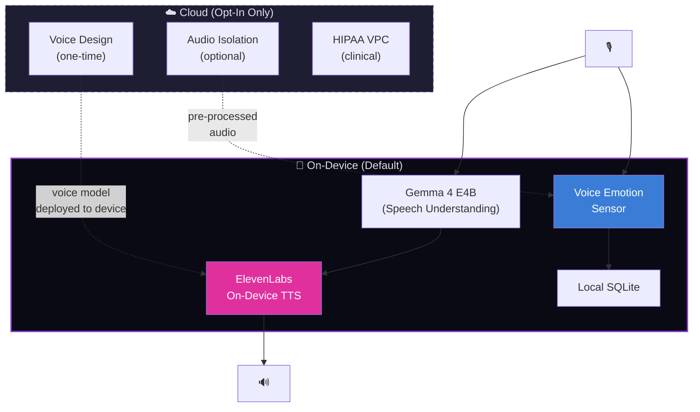

# ElevenLabs Platform Evaluation for Cytonome

> **Status**: Research Evaluation
> **Date**: 2026-05-17
> **Context**: Assessment of ElevenLabs capabilities (ElevenCreative, ElevenAgents, ElevenAPI) for Cytonome's voice layer, with focus on local/private vs cloud-only capabilities

---

## 1. Platform Overview

ElevenLabs is the leading voice AI platform, offering:

| Product | Description | Relevance to Cytonome |
|---|---|---|
| **ElevenAPI** | Core API for TTS, STT, voice cloning, dubbing, audio isolation | TTS output for Yar companion voice |
| **ElevenAgents** | Full-stack conversational AI platform with sub-second latency | Alternative to our Gemma cascade for conversation |
| **ElevenCreative** | Content creation tools (dubbing, sound effects, music) | Low priority; content creation not core mission |

---

## 2. Capability Assessment

### 2.1 Text-to-Speech (TTS)

| Feature | Capability | Local/Private? | Relevance |
|---|---|---|---|
| Eleven v3 (most expressive) | State-of-the-art expressiveness, emotion, and naturalness | ⚠️ Cloud API only (standard) | **HIGH** — companion voice quality matters |
| Eleven Flash v2.5 | Ultra-low latency (~75ms), optimized for real-time | ⚠️ Cloud API only (standard) | **HIGH** — real-time conversation |
| Eleven Turbo v2.5 | Balance of quality and speed | ⚠️ Cloud API only (standard) | MEDIUM |
| **On-device TTS** | Optimized for edge/embedded hardware, offline | ✅ **Fully local** | **CRITICAL** — matches our privacy-first architecture |
| Multi-language TTS | 70+ languages supported | ✅ Both cloud and on-device | **CRITICAL** — multi-language is a core requirement |

### 2.2 Voice Cloning

| Feature | Capability | Local/Private? | Relevance |
|---|---|---|---|
| Instant Voice Clone (IVC) | Clone from 1-2 min of audio, near-instant | ❌ Cloud only | MEDIUM — for companion voice personalization |
| Professional Voice Clone (PVC) | Hyper-realistic "digital twin" from hours of audio | ❌ Cloud only (3-6 hr training) | LOW — requires significant user audio |
| Voice Design | Generate synthetic voices from text description | ❌ Cloud only | **HIGH** — create Yar's default companion voice without recording real people |

> [!IMPORTANT]
> Voice cloning for creating Yar's default voice can be done once in the cloud, then the resulting voice model deployed on-device. The user's audio never needs to be processed in the cloud for daily operation.

### 2.3 Conversational AI Agents (ElevenAgents)

| Feature | Capability | Local/Private? | Relevance |
|---|---|---|---|
| Sub-second turn-taking | Real-time bidirectional conversation | ❌ Cloud only | MEDIUM — we have our own Gemma cascade |
| Multimodal reasoning | Process voice + text + documents simultaneously | ❌ Cloud only | LOW — our supervisor handles multimodal |
| Tool calling (MCP, API) | Execute real-world actions during conversation | ❌ Cloud only | LOW — our architecture handles this natively |
| RAG integration | Pull from knowledge bases | ❌ Cloud only | LOW — we have Anytype + local RAG |
| SOC 2 / HIPAA / GDPR | Enterprise compliance certifications | ✅ With BAA | MEDIUM — relevant for clinical deployments |

### 2.4 Speech-to-Text (STT)

| Feature | Capability | Local/Private? | Relevance |
|---|---|---|---|
| Transcription API | High-quality STT | ⚠️ Cloud (standard) | LOW — we use Gemma 4's native audio understanding |
| Speaker diarization | Identify different speakers | ⚠️ Cloud | LOW — single-user companion use case |

### 2.5 Other Capabilities

| Feature | Capability | Local/Private? | Relevance |
|---|---|---|---|
| Audio isolation | Separate voice from background noise | ⚠️ Cloud | MEDIUM — could improve audio quality for emotion sensor |
| Dubbing | Multi-language voice dubbing | ❌ Cloud | LOW |
| Sound effects | Generate ambient sounds | ❌ Cloud | LOW — could be used for calming environments |
| Music generation | AI music | ❌ Cloud | LOW |

---

## 3. Deployment Options Assessment

### 3.1 On-Device (Most Relevant to Cytonome)

| Aspect | Details |
|---|---|
| **Target** | Edge devices, wearables, phones |
| **Models** | Purpose-built for constrained compute, not cloud ports |
| **Offline** | Full offline capability, air-gapped environments |
| **Data** | No data leaves device, no network calls |
| **Customization** | Custom voice development, language/dialect fine-tuning |
| **Update cadence** | Controlled, enterprise-grade stability |
| **Pricing** | Custom, case-by-case (license + usage) |
| **Availability** | Early access (2026 H1) |

### 3.2 On-Premise

| Aspect | Details |
|---|---|
| **Target** | Own servers, data centers, Confidential Computing |
| **Use case** | Clinical deployments, hospital systems |
| **Data** | Full data sovereignty, customer-controlled |
| **GPU** | Customer provides GPU infrastructure |

### 3.3 Virtual Private Cloud (VPC)

| Aspect | Details |
|---|---|
| **Platforms** | AWS SageMaker, GCP Vertex |
| **Data** | Stays in customer's cloud account |
| **ElevenLabs access** | No access to customer data or logs |

---

## 4. HIPAA Compliance Assessment

| Requirement | ElevenLabs Support | Notes |
|---|---|---|
| Business Associate Agreement (BAA) | ✅ Available | Required for PHI handling |
| SOC 2 Type 2 | ✅ Certified | |
| HIPAA certification | ✅ Certified | |
| Zero Retention Mode | ✅ Available | No audio/text stored |
| Logging controls | ✅ `enable_logging=false` | Must be explicitly disabled |
| On-premise option | ✅ Available | Full data sovereignty |

> [!NOTE]
> For Cytonome's clinical deployment path (Phase 3+), ElevenLabs' HIPAA infrastructure is the most mature in the voice AI space. A BAA + VPC or on-premise deployment would satisfy IRB requirements for clinical research.

---

## 5. Recommendation Matrix for Cytonome

### 5.1 Capabilities to Adopt

| Capability | Priority | Deployment | Rationale |
|---|---|---|---|
| **On-device TTS** | **HIGH** | Local | Replace platform TTS / Kokoro with higher-quality on-device model |
| **Voice Design** | **HIGH** | One-time cloud | Design Yar's default companion voice without recording real humans |
| **Multi-language TTS** | **CRITICAL** | Local | 70+ language support for international users |
| **Audio Isolation** | MEDIUM | Pre-processing | Clean audio before feeding to emotion sensor |
| **HIPAA infrastructure** | MEDIUM | Phase 3 | Clinical research deployments |

### 5.2 Capabilities NOT to Adopt (Cloud-Only, Privacy Conflict)

| Capability | Reason to Skip |
|---|---|
| ElevenAgents (conversational AI) | We have our own edge-first architecture (Gemma cascade + supervisor). Their agents are cloud-only, violating our privacy-first design. |
| Real-time voice cloning of user | User voice biometrics should never leave the device |
| Cloud STT | We use Gemma 4's native audio understanding |
| Content creation tools | Off-mission |

### 5.3 Capabilities to Record for Future "Cloud-Optional" Features

For users who explicitly opt in to cloud features (non-sensitive interactions):

| Capability | Use Case | User Control |
|---|---|---|
| Professional Voice Clone | User creates a "digital twin" voice for accessibility | Explicit opt-in, cloud processing of user's audio |
| Dubbing | Translate companion conversations to other languages | Opt-in per conversation |
| Sound effects/music | Ambient calming environments during sessions | Opt-in |
| ElevenAgents (as fallback) | Higher-quality conversation for users without local GPU | Explicit "cloud mode" toggle |

---

## 6. Integration Architecture

---

## 7. ElevenLabs Accelerator Program

ElevenLabs runs an [accelerator program](https://elevenlabs.io/accelerator) for startups building with voice AI. Relevant aspects:

- Access to enterprise features and custom voice development
- Technical support for on-device/on-premise deployments
- Potential pathway for custom model training (e.g., Yar-specific voice optimized for cognitive accessibility)
- HIPAA-compliant infrastructure consultation

> [!TIP]
> Cytognosis Foundation should apply to the ElevenLabs accelerator program. As a nonprofit building accessibility-focused voice AI by and for neurodivergent communities, we align well with their social impact track. This would give us enterprise-tier on-device TTS at nonprofit pricing.

---

## 8. Competitive Context

| Platform | TTS Quality | On-Device | HIPAA | Multi-Lang | Open-Source Alt |
|---|---|---|---|---|---|
| **ElevenLabs** | ★★★★★ | ✅ | ✅ | 70+ | N/A (proprietary) |
| Kokoro 82M | ★★★☆☆ | ✅ | N/A | ~20 | ✅ Apache 2.0 |
| Platform TTS (Android/iOS) | ★★★☆☆ | ✅ | N/A | Many | Built-in |
| Coqui TTS (deprecated) | ★★★☆☆ | ✅ | N/A | ~15 | ✅ MPL 2.0 |
| Azure Speech | ★★★★☆ | ⚠️ | ✅ | 100+ | ❌ |

**Recommendation**: Start with Kokoro (open-source, immediate) for v1.0. Evaluate ElevenLabs on-device TTS for v1.1+ when their early access matures and pricing is established for nonprofits.
