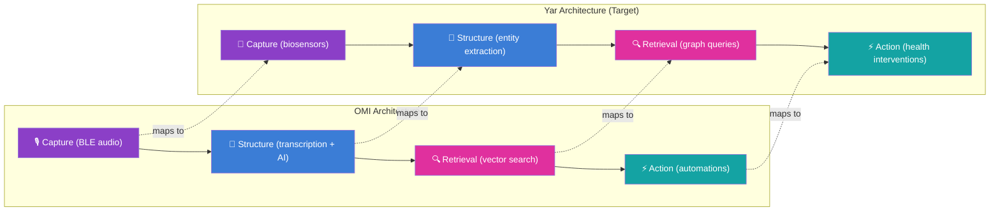
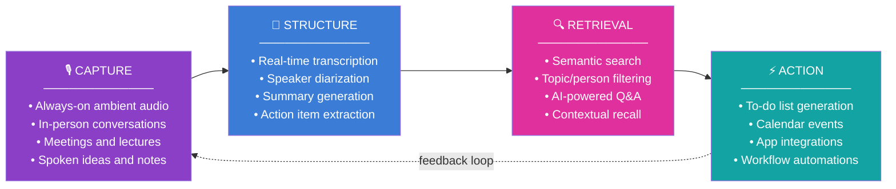
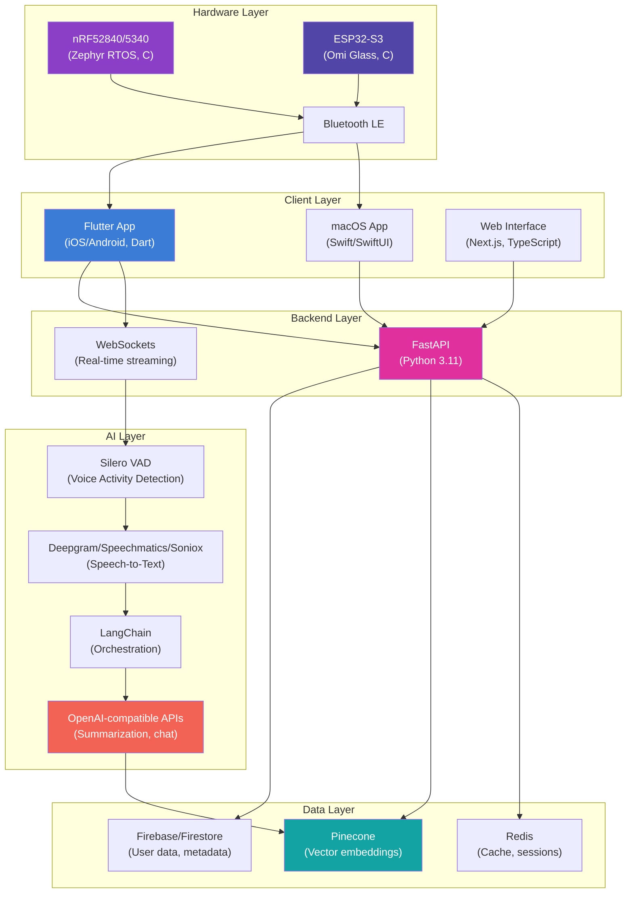
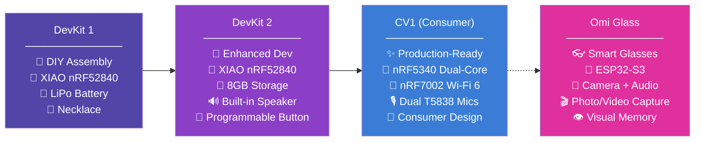
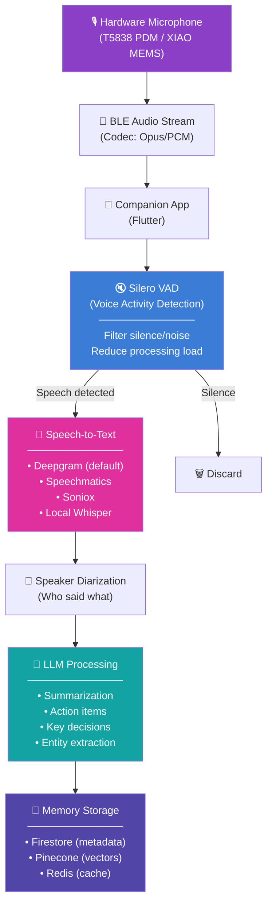
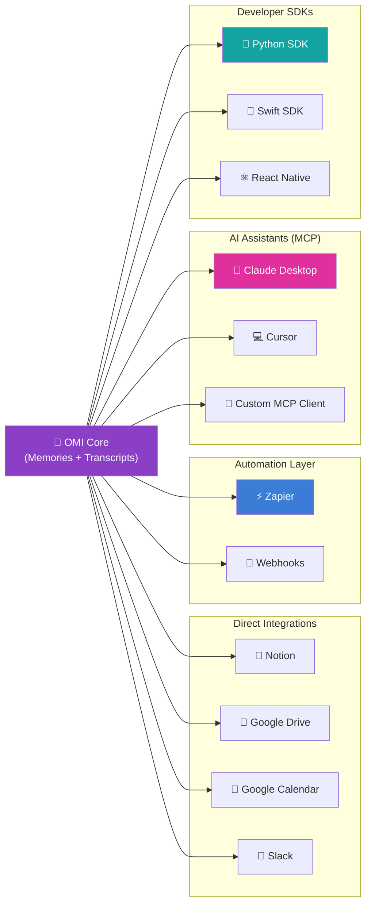
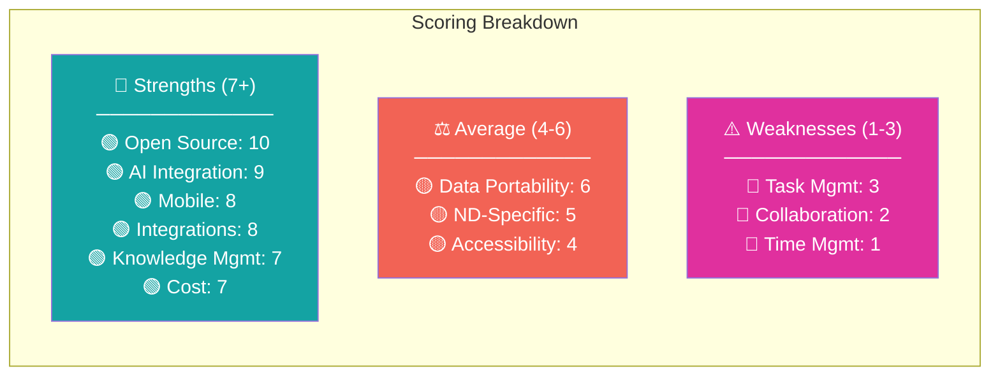
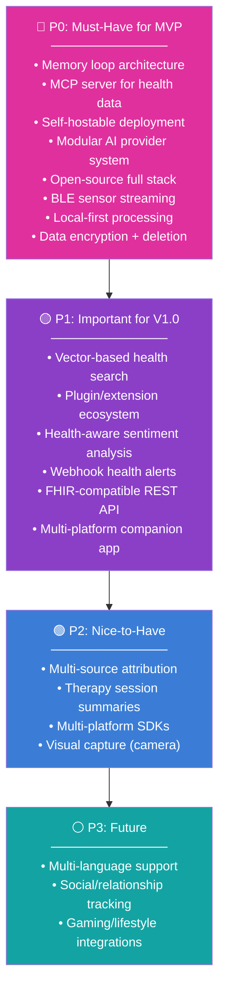
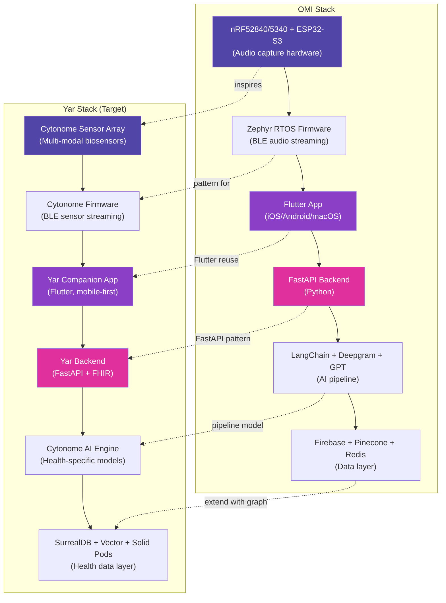
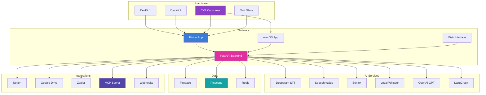

---

# OMI AI Deep Dive: Open-Source Wearable Memory Platform and Yar Mapping

> **Owner**: Shahin Mohammadi · **Created**: 2026-05-30 · **Status**: DRAFT
> **Canonical location**: `~/repos/cytognosis/docs/cytonome/yar/research/omi-ai-deep-dive.md`
> **Purpose**: Exhaustive feature analysis of OMI AI wearable for Cytonome/Yar feature prioritization, with focus on ambient capture, open-source architecture, and neurodivergent applicability

---

## Section Map

| # | Section | Purpose |
|---|---------|---------|
| 1 | [Executive Summary](#1-executive-summary) | Key takeaways for Yar |
| 2 | [Product Overview](#2-product-overview) | What OMI is, philosophy, target users |
| 3 | [Open-Source Architecture](#3-open-source-architecture) | Full tech stack, repos, GitHub metrics |
| 4 | [Hardware Specifications](#4-hardware-specifications) | DevKit 1, DevKit 2, CV1, Omi Glass |
| 5 | [Feature Inventory](#5-feature-inventory) | Complete feature catalog |
| 6 | [Audio and Voice Pipeline](#6-audio-and-voice-pipeline) | Capture → transcription → memory flow |
| 7 | [Plugin Ecosystem and Integrations](#7-plugin-ecosystem-and-integrations) | App store, MCP, developer SDK |
| 8 | [AI and Memory System](#8-ai-and-memory-system) | Second brain, RAG, contextual intelligence |
| 9 | [Emotional Intelligence Features](#9-emotional-intelligence-features) | Sentiment, mood tracking, therapeutic apps |
| 10 | [ND-Specific Evaluation](#10-nd-specific-evaluation) | ADHD/neurodivergent benefits and risks |
| 11 | [Pricing and Business Model](#11-pricing-and-business-model) | Hardware cost, subscription tiers, self-hosting |
| 12 | [Limitations and Known Issues](#12-limitations-and-known-issues) | User complaints, technical debt, privacy concerns |
| 13 | [Competitive Comparison](#13-competitive-comparison) | OMI vs Limitless vs Plaud vs Saner vs Speechify vs Goblin Tools |
| 14 | [Yar Scoring (0-10 Scale)](#14-yar-scoring-0-10-scale) | Unified feature comparison scoring |
| 15 | [Yar Feature Mapping](#15-yar-feature-mapping) | Every feature mapped to Yar equivalent |
| 16 | [Recommendations](#16-recommendations) | Features to adopt, anti-patterns to avoid |

---

## 1. Executive Summary

### Key Finding

OMI represents the most compelling open-source model for ambient AI capture available today. As a fully MIT-licensed wearable platform (hardware, firmware, app, and backend), OMI demonstrates that continuous environmental capture, real-time transcription, and AI-powered memory structuring can be delivered as a community-driven project. Its "second brain" philosophy of Capture → Structure → Retrieval → Action maps directly to Yar's health intelligence pipeline, and its open-source architecture provides a reference implementation for Cytonome's sensor-to-insight data flow. OMI's primary weakness for Yar adoption is its exclusive focus on audio/conversation data with no health-specific structuring, task management, or temporal health tracking.

### Top 5 Features for Yar Adoption

| Priority | OMI Feature | Yar Application | Effort |
|----------|-------------|-----------------|--------|
| **P0** | Memory loop (Capture → Structure → Retrieval → Action) | Health data capture pipeline architecture | Medium (pattern adoption) |
| **P0** | Open-source full-stack wearable platform (MIT) | Cytonome hardware/software reference architecture | Low (study and adapt) |
| **P0** | MCP server for AI assistant integration | Yar MCP server for health data access | Medium (API design) |
| **P1** | Plugin/app marketplace ecosystem | Health app ecosystem for Yar extensions | High (platform design) |
| **P1** | Ambient continuous capture with VAD | Continuous biosensor data capture with event detection | High (sensor pipeline) |

### Architecture Comparison

---

## 2. Product Overview

### What is OMI?

OMI (formerly "Friend") is an open-source AI wearable platform developed by Based Hardware Inc. that functions as an ambient "second brain." The coin-sized pendant (~2.5cm diameter) continuously captures audio from the wearer's environment, streams it via Bluetooth to a companion app, and uses AI to transcribe, summarize, extract action items, and create searchable "memories" of conversations and interactions. The project positions itself as the open-source alternative to proprietary wearable AI devices.

### Core Philosophy

OMI operates on a four-stage **Memory Loop**:

### Target Users

| User Segment | Use Case | Fit Level |
|-------------|----------|-----------|
| **Knowledge workers** | Meeting notes, action items, context retention | High |
| **Students** | Lecture capture, study note generation | High |
| **Developers/tinkerers** | Custom AI agent development, hardware hacking | Very High |
| **ADHD/neurodivergent** | Memory offloading, cognitive load reduction | Medium-High |
| **Journalists** | Interview recording, quote extraction | Medium |
| **Healthcare professionals** | Patient encounter documentation | Low (not designed for this) |

### Platform Availability

| Platform | Status | Key Notes |
|----------|--------|-----------|
| **iOS** | Full | Primary companion app via Flutter |
| **Android** | Full | Flutter-based, feature parity with iOS |
| **macOS** | Full | Native Swift/SwiftUI desktop app |
| **Web** | Partial | Next.js interface for AI personas |
| **Linux/Windows** | Community | Via self-hosted backend |

---

## 3. Open-Source Architecture

> [!IMPORTANT]
> OMI is the most fully open-source AI wearable platform available. Every layer, from hardware schematics to cloud backend, is MIT-licensed and publicly available. This is architecturally significant for Yar: it proves that a privacy-respecting, community-driven wearable AI platform is viable without vendor lock-in.

### GitHub Repository Metrics

| Metric | Value | Assessment |
|--------|-------|------------|
| **Repository** | `BasedHardware/omi` | Monorepo covering all components |
| **Stars** | ~12,600 | Strong community interest |
| **Forks** | ~2,000 | Active fork ecosystem |
| **Open Issues** | 440+ | Indicates active development and community feedback |
| **Open PRs** | 70-76 | Steady contribution flow |
| **License** | MIT | Maximum permissiveness for adoption |
| **Contributors** | Active community with paid bounties | Incentivized contribution model |

### Language Distribution

| Language | Percentage | Component |
|----------|-----------|-----------|
| **Dart** | 40.7% | Flutter mobile/desktop app |
| **C** | 19.5% | nRF/ESP32 firmware |
| **Python** | 14.8% | FastAPI backend |
| **Swift** | 11.5% | macOS native app |
| **TypeScript** | 6.8% | Next.js web interface, integrations |
| **Other** | 6.7% | Build scripts, configs, documentation |

### Full-Stack Architecture

### Repository Structure

| Directory | Contents | Technology |
|-----------|----------|------------|
| `firmware/` | nRF52840/5340 and ESP32-S3 device firmware | C/C++, Zephyr RTOS |
| `app/` | Cross-platform mobile application | Flutter (Dart) |
| `backend/` | API server, AI pipeline, memory processing | Python, FastAPI |
| `plugins/` | Community-built apps and integrations | Various |
| `sdks/` | Client SDKs for custom development | React Native, Swift, Python |
| `docs/` | Developer documentation | Markdown |

### Key Architectural Decisions

| Decision | Implementation | Rationale |
|----------|---------------|-----------|
| **Monorepo** | All components in single repo | Simplified versioning and cross-component changes |
| **BLE streaming** | Audio streamed to phone, not cloud | Privacy-first, reduce cloud dependency |
| **Modular STT** | Pluggable transcription providers | Avoid vendor lock-in, allow local processing |
| **Vector-first memory** | Pinecone for semantic storage | Enable natural language retrieval over structured queries |
| **Docker deployment** | Containerized backend | Reproducible self-hosting for privacy-conscious users |
| **MIT license** | Maximum permissive licensing | Encourage adoption, forking, and commercial use |

---

## 4. Hardware Specifications

### Device Lineup

### Detailed Specifications

| Specification | DevKit 1 | DevKit 2 | CV1 (Consumer) | Omi Glass |
|--------------|----------|----------|----------------|-----------|
| **Processor** | XIAO nRF52840 Sense | XIAO nRF52840 | nRF5340 dual-core BLE SoC | ESP32-S3 |
| **Wireless** | Bluetooth LE | Bluetooth LE | BLE + nRF7002 Wi-Fi 6 | BLE + Wi-Fi |
| **Microphone** | Built-in (XIAO board) | Built-in | Dual T5838 top-port PDM | Integrated array |
| **Storage** | None (streaming only) | 8GB onboard | Onboard flash | Onboard flash |
| **Speaker** | None | Built-in | Yes | Yes |
| **Camera** | None | None | None | Yes (photo + video) |
| **Controls** | On/off switch | Programmable button | Button with 3s hold | Touch/button |
| **Form Factor** | Necklace pendant | Necklace pendant | Consumer pendant (~2.5cm) | Smart glasses |
| **Battery** | LiPo rechargeable | LiPo rechargeable | ~10-24 hours | Variable |
| **Charging** | USB | USB | Magnetic USB-C | USB-C |
| **Assembly** | DIY | Pre-assembled | Factory-built | Factory-built |
| **Target** | Makers/developers | Developers | General consumers | Early adopters |

> [!NOTE]
> The evolution from DevKit 1 to CV1 mirrors the maturation path Cytonome will follow: start with a developer-focused prototyping platform (DevKit equivalent), iterate with enhanced capabilities (8GB storage, speaker feedback), then ship a consumer-grade product with dual microphones and Wi-Fi connectivity for enhanced reliability.

### Omi Glass: Visual Capture Extension

Omi Glass extends the audio-only pendant model by adding camera-based visual capture:

| Feature | Description |
|---------|-------------|
| **Photo capture** | Take photos of what you see for visual memory |
| **Video recording** | Record video clips alongside audio |
| **Simultaneous capture** | Audio + video in the same conversation/memory |
| **Lifelogging** | Continuous visual recording for ambient context |
| **Visual search** | AI-powered search across captured images |

> [!WARNING]
> Omi Glass raises significant privacy concerns in healthcare settings. Visual capture in clinical environments requires explicit consent frameworks and HIPAA-aware processing pipelines, neither of which OMI currently provides. Yar should study this as a cautionary example of feature expansion without adequate privacy infrastructure.

---

## 5. Feature Inventory

### Core Features

| Category | Feature | Description | Maturity |
|----------|---------|-------------|----------|
| **Capture** | Always-on ambient recording | Continuous audio capture via pendant | Stable |
| **Capture** | 25+ language support | Multi-language transcription and translation | Stable |
| **Capture** | Speaker diarization | Identify different speakers in conversations | Beta |
| **Capture** | Online meeting capture | Record virtual meetings alongside in-person | Stable |
| **Processing** | Real-time transcription | Live speech-to-text via Deepgram/Speechmatics/Soniox | Stable |
| **Processing** | AI summarization | Condensed meeting/conversation summaries | Stable |
| **Processing** | Action item extraction | Automatic to-do list generation from conversations | Stable |
| **Processing** | Memory creation | Structured "memory" objects from conversations | Stable |
| **Processing** | Contextual awareness | Remember details like Wi-Fi passwords, phone numbers | Beta |
| **Retrieval** | Semantic search | Natural language search across all memories | Stable |
| **Retrieval** | Person-based filtering | Find memories by who was present | Stable |
| **Retrieval** | Topic-based filtering | Search by subject matter | Stable |
| **Retrieval** | AI-powered Q&A | Ask questions about past conversations | Stable |
| **Action** | Calendar event creation | Auto-generate calendar entries from conversations | Stable |
| **Action** | Task list generation | Convert spoken commitments to structured tasks | Beta |
| **Action** | Workflow automation | Trigger external tools via webhooks/integrations | Stable |
| **Platform** | Cross-platform app | iOS, Android, macOS, web | Stable |
| **Platform** | Offline local processing | On-phone transcription without cloud | Beta |
| **Platform** | Data encryption | Encrypted storage with user control | Stable |
| **Platform** | Data deletion | User can delete all data on demand | Stable |

### Platform-Specific Features

| Platform | Features |
|----------|----------|
| **Mobile (iOS/Android)** | BLE pairing, real-time transcription view, memory browser, AI chat, quick capture, plugin marketplace, settings/developer mode |
| **macOS Desktop** | Native Swift app, BLE connection, conversation view, memory search |
| **Web** | AI persona configuration, memory browsing, basic chat interface |

---

## 6. Audio and Voice Pipeline

### End-to-End Audio Processing

### Voice Activity Detection (VAD)

| Aspect | Implementation |
|--------|---------------|
| **Engine** | Silero VAD (neural network-based) |
| **Purpose** | Distinguish speech from silence/background noise |
| **Benefit** | Reduces processing costs by 60-80% (skip non-speech segments) |
| **Latency impact** | Minimal (runs on-device or locally) |
| **Accuracy** | High for conversational speech, lower for whispered/distant speech |

### Transcription Provider Comparison

| Provider | Strength | Weakness | Cost Model |
|----------|----------|----------|------------|
| **Deepgram** | Speed, real-time streaming | Less accurate for accents | Per-minute |
| **Speechmatics** | Multi-language accuracy | Higher latency | Per-minute |
| **Soniox** | Low-latency streaming | Smaller language coverage | Per-minute |
| **Local Whisper** | Privacy (no cloud) | Slower, requires GPU | Free (compute cost) |

> [!TIP]
> **Yar Relevance**: OMI's modular STT provider architecture is the correct pattern for Yar's audio processing. Health conversations (doctor appointments, therapy sessions) require high accuracy and privacy. Yar should implement the same pluggable provider model, defaulting to local Whisper for sensitive health content and cloud providers for non-sensitive use cases.

---

## 7. Plugin Ecosystem and Integrations

### App Marketplace

OMI features an open-source app marketplace within its ecosystem, supporting 2,000+ external application integrations.

| Category | Example Plugins | Description |
|----------|----------------|-------------|
| **Productivity** | Google Drive, Notion, Zapier | Sync memories to external knowledge bases |
| **Utilities** | Audio Backup, General Summary, Insight Extractor | Enhance core capture functionality |
| **Specialized** | ADHD Assistant, Therapy Session Insight, Lie Detector Pro | Niche AI-powered analysis tools |
| **Social** | Omi Social AI | Behavioral psychology-based relationship tracking |
| **Gaming** | League of Legends Assist | Domain-specific AI assistance |
| **Communication** | Slack, Email integration | Distribute memories to team channels |

### Developer SDK and APIs

| Resource | Description | Authentication |
|----------|-------------|----------------|
| **Developer API** | REST API for memories, conversations, action items | Bearer token (`omi_dev_` prefix) |
| **API Base URL** | `https://api.omi.me/v1/dev` | Via app: Settings → Developer → Create Key |
| **Python SDK** | BLE connection, audio decoding, Deepgram transcription | SDK import |
| **Swift SDK** | iOS/macOS native integration | SDK import |
| **React Native SDK** | Cross-platform mobile development | SDK import |
| **Webhook system** | Real-time notifications on memory/transcript creation | URL registration in app |

### MCP Server

> [!IMPORTANT]
> OMI provides a Model Context Protocol (MCP) server, enabling AI assistants like Claude Desktop, Cursor, and other MCP-compatible tools to directly access OMI memories and conversations. This is a reference implementation for Yar's own MCP server that would expose health data to AI assistants.

| MCP Detail | Value |
|-----------|-------|
| **SSE URL** | `https://api.omi.me/v1/mcp/sse` |
| **Authentication** | Bearer token (`omi_mcp_` prefix) |
| **Capabilities** | Semantic search across memories, CRUD operations for memories, browse conversation transcripts |
| **Compatible clients** | Claude Desktop, Cursor, custom MCP clients |

### Integration Architecture

---

## 8. AI and Memory System

### Second Brain Architecture

OMI's AI system is designed around the concept of persistent, searchable conversational memory with retrieval-augmented generation (RAG).

| Component | Technology | Purpose |
|-----------|-----------|---------|
| **Memory storage** | Firebase/Firestore | Structured metadata: timestamps, participants, topics, summaries |
| **Vector embeddings** | Pinecone | Semantic representations of conversations for similarity search |
| **Session cache** | Redis | Low-latency access to recent conversations and active sessions |
| **Orchestration** | LangChain | Chain LLM calls for multi-step processing (summarize → extract → store) |
| **LLM backend** | OpenAI-compatible APIs | Flexible model selection (GPT-4o, Claude, local models) |

### Memory Processing Pipeline

| Stage | Input | Output | AI Model Used |
|-------|-------|--------|---------------|
| **Transcription** | Raw audio stream | Timestamped text with speaker labels | Deepgram/Speechmatics |
| **Summarization** | Full transcript | 3-5 sentence summary | GPT-4o / Claude |
| **Action extraction** | Full transcript | Structured to-do items with assignees | GPT-4o / Claude |
| **Entity extraction** | Full transcript | People, places, dates, decisions mentioned | GPT-4o / Claude |
| **Embedding** | Summary + key phrases | 1536-dim vector | text-embedding-3-small |
| **Storage** | All outputs | Searchable memory object | N/A (database writes) |

### Contextual Intelligence

Unlike simple transcription apps, OMI aims to understand context:

| Capability | Description | Example |
|-----------|-------------|---------|
| **Intent recognition** | Identify what was promised or decided | "I'll send you the report by Friday" → task created |
| **Detail retention** | Remember specific facts mentioned in passing | Wi-Fi passwords, phone numbers, addresses |
| **Cross-conversation context** | Connect topics across multiple conversations | "You discussed budget concerns in 3 meetings this week" |
| **Proactive recall** | Surface relevant past context in new conversations | Before a meeting, show notes from last meeting with same person |

---

## 9. Emotional Intelligence Features

### Sentiment and Mood Analysis

OMI extends beyond transcription to offer emotional intelligence capabilities through its plugin ecosystem:

| Feature | Description | Availability |
|---------|-------------|-------------|
| **Sentiment analysis** | Analyze emotional tone of conversations | Plugin (marketplace) |
| **Tone identification** | Identify speaker's emotional state and communication quality | Plugin |
| **Mood tracking** | Track behavioral patterns and moods over time | Plugin |
| **Emotional health checks** | Flag patterns like series of stressful conversations | Plugin |
| **Proactive nudges** | Notifications when emotional patterns are detected | Plugin |

### Therapeutic and Social Support Plugins

| Plugin | Purpose | Use Case |
|--------|---------|----------|
| **Therapy Session Insight** | Review counseling sessions, highlight recurring themes and emotions | Mental health self-awareness |
| **Omi Social AI** | Track social trends and emotional shifts using behavioral psychology | Relationship building |
| **ADHD Assistant** | Break down tasks, provide structure for ADHD users | Executive function support |

> [!NOTE]
> **Yar Relevance**: OMI's emotional features demonstrate that ambient audio capture can yield health-relevant insights beyond literal content. Yar's voice capture pipeline should implement similar sentiment analysis, but with clinical-grade emotion detection calibrated to health contexts (anxiety markers, pain level indicators, medication side effect reports, mood disorder tracking).

---

## 10. ND-Specific Evaluation

### ADHD/Neurodivergent Benefits

| Benefit | Description | ADHD Impact |
|---------|-------------|-------------|
| **Memory offloading** | Device remembers what you forget | High: addresses working memory deficits |
| **Cognitive load reduction** | No need to manually take notes | High: frees attention for active engagement |
| **Presence enablement** | Stay engaged in conversations without note anxiety | High: reduces ADHD-related social stress |
| **Automatic organization** | AI structures unstructured conversations | Medium: compensates for executive function challenges |
| **Searchable memory** | Find past decisions and commitments | High: addresses "I know we discussed this but..." |
| **Action item extraction** | Converts spoken commitments to tasks | Medium: bridges intention-action gap |
| **Always-on design** | No need to remember to start recording | High: eliminates "I forgot to record" failure mode |

### ADHD/Neurodivergent Risks

| Risk | Description | Mitigation |
|------|-------------|------------|
| **Information overload** | Too many memories/summaries to review | Needs priority filtering and smart surfacing |
| **Notification fatigue** | Proactive nudges may overwhelm | Requires ND-aware notification design |
| **Executive function demands** | Still requires reviewing and acting on captured data | Needs simplified review workflows |
| **Battery/connectivity anxiety** | Device disconnections create anxiety about lost data | 8GB onboard storage (DevKit 2+) helps |
| **Privacy social friction** | Wearing a recording device in social settings | Needs clear consent indicators |
| **Dependency risk** | Over-reliance on device for memory | Should complement, not replace, memory strategies |
| **No time management** | Zero time-blocking, scheduling, or time awareness features | Critical gap for ADHD time blindness |
| **No task structure** | Action items lack priority, deadlines, or recurring schedules | Insufficient for ADHD task management |

### ND-Specific Evaluation Summary

| Dimension | Score (0-10) | Rationale |
|-----------|:---:|-----------|
| **Memory support** | 9 | Core strength: ambient capture eliminates manual memory burden |
| **Attention support** | 7 | Enables presence but doesn't manage attention switching |
| **Executive function** | 4 | Captures but doesn't structure, prioritize, or schedule |
| **Emotional regulation** | 5 | Sentiment plugins exist but are not clinically validated |
| **Time awareness** | 1 | No time management, time-blocking, or schedule awareness |
| **Sensory considerations** | 6 | Small, unobtrusive device; no haptic feedback for overstimulation |
| **Customization for ND** | 5 | ADHD Assistant plugin exists but is generic, not evidence-based |

> [!WARNING]
> OMI's ND support is strong for **passive memory capture** but weak for **active executive function assistance**. ADHD users need more than recording: they need proactive reminders, time awareness, task decomposition, and emotional regulation support. OMI captures the "what was said" but does not address "what should I do about it now."

---

## 11. Pricing and Business Model

### Hardware Pricing

| Device | Price | Availability |
|--------|-------|-------------|
| **OMI Pendant (CV1)** | $89 USD (one-time) | Available now |
| **DevKit 1** | ~$30-50 (parts cost, DIY) | Open-source build guide |
| **DevKit 2** | ~$50-70 (parts cost, DIY) | Open-source build guide |
| **Omi Glass** | TBA | Limited early access |

### Subscription Model (Freemium)

| Plan | Monthly | Annual | Key Features |
|------|---------|--------|-------------|
| **Free** | $0 | $0 | Unlimited on-phone transcription, 1,200 cloud minutes/month |
| **Unlimited** | $19/month | $199/year (~$16/month) | Unlimited cloud transcription, advanced insights, expanded memory storage |

### Self-Hosting Option

> [!IMPORTANT]
> Because the entire stack is open-source (MIT), advanced users can bypass subscription costs entirely by self-hosting the backend and routing to their own LLMs or API keys (GPT-4o, Claude, local Whisper). This makes OMI unique among wearable AI platforms: the subscription is optional, not mandatory.

| Self-Host Component | What You Need |
|--------------------|---------------|
| **Backend** | Docker + server (can run on home server or cloud VM) |
| **Transcription** | Own Deepgram API key or local Whisper instance |
| **LLM** | Own OpenAI/Anthropic API key or local LLM (Ollama, vLLM) |
| **Vector DB** | Self-hosted Pinecone alternative (Milvus, Weaviate, Chroma) |
| **Storage** | Any Firestore-compatible or Postgres database |

### Cost Comparison with Competitors

| Device | Hardware | Monthly Subscription | Self-Host Option |
|--------|----------|---------------------|-----------------|
| **OMI** | $89 | $0-19 | Yes (full stack) |
| **Limitless** | $99 | $0-19 | No |
| **Plaud NotePin** | $169 | $0-7.99 | No |
| **Rewind/Screenpi.pe** | N/A (software) | $19-29 | No |

---

## 12. Limitations and Known Issues

### User-Reported Issues (Reddit, Product Hunt, Reviews)

| Issue | Severity | Status (2026) |
|-------|----------|---------------|
| **Bluetooth disconnections** | High | Improved but persistent |
| **Phone battery drain** | High | Ongoing (inherent to BLE streaming) |
| **Accidental button presses** | Medium | Fixed (3s hold firmware update) |
| **Not waterproof** | Medium | Hardware limitation |
| **Transcription accuracy in noisy environments** | Medium | Improved with dual mics (CV1) |
| **Speaker diarization errors** | Medium | Improving with each release |
| **Subscription model controversy** | Medium | Introduced post-launch, frustrated early adopters |
| **Cloud dependency for advanced features** | Medium | Mitigated by self-hosting option |
| **Transcript editing limitations** | Low | Now available (was missing in early versions) |
| **Privacy/social concerns** | Variable | Inherent to always-on recording devices |

### Technical Limitations

| Limitation | Impact on Yar |
|-----------|---------------|
| **Audio-only capture** (pendant) | Yar needs multi-modal biosensor data, not just audio |
| **No structured health data** | Memories are unstructured text, not typed health entities |
| **No offline-first architecture** | Requires phone + cloud for full functionality |
| **No local graph database** | Vector search only, no relationship-based queries |
| **No temporal health tracking** | No longitudinal health data visualization |
| **No FHIR/health data standards** | No medical data interoperability |
| **No consent management** | No framework for recording in healthcare settings |
| **No clinical validation** | Emotional/mood features are not evidence-based |

### Product Maturity Assessment

| Dimension | Maturity Level | Notes |
|-----------|:---:|-------|
| **Hardware** | Beta-Stable | CV1 is production-ready; DevKits are prototypes |
| **Mobile app** | Stable | Flutter app is functional across iOS/Android |
| **Backend** | Stable | FastAPI + Firebase + Pinecone is proven at scale |
| **AI pipeline** | Stable | Transcription + summarization works reliably |
| **Plugin ecosystem** | Early | Many plugins are community-quality, not enterprise-grade |
| **MCP server** | Beta | Functional but limited in scope |
| **Documentation** | Good | Comprehensive at docs.omi.me |
| **Community** | Active | Discord + GitHub Issues + paid bounties |

> [!NOTE]
> OMI's community frequently describes the product as best suited for "tinkerers" comfortable with occasional bugs. Long-term users report significant improvement since initial release, with meaningful firmware and app updates. The product is functional and increasingly capable, but not yet "Apple-level" polish.

---

## 13. Competitive Comparison

### OMI vs Wearable AI Competitors

| Feature | OMI | Limitless Pendant | Plaud NotePin | Saner.ai | Speechify | Goblin Tools |
|---------|-----|-------------------|--------------|----------|-----------|--------------|
| **Category** | Open-source second brain | Meeting assistant | Professional recorder | Mental wellness AI | Text-to-speech | ND task tools |
| **Philosophy** | Open bazaar, customizable | Fire-and-forget meetings | High-fidelity capture | Emotional awareness | Reading assistance | ADHD task decomposition |
| **Hardware** | $89 pendant | $99 pendant | $169 pin/clip | No hardware | No hardware | No hardware |
| **Open source** | Yes (MIT, full stack) | No | No | No | No | No |
| **Self-hostable** | Yes | No | No | No | No | No |
| **Always-on capture** | Yes | Yes | No (tap to start) | No | No | No |
| **Transcription quality** | Good (multi-provider) | Good | Excellent | N/A | N/A | N/A |
| **AI summarization** | Yes | Yes | Yes (with mind maps) | Partial | No | No |
| **ND-specific features** | ADHD plugin (basic) | No | No | Yes (mood/journaling) | Yes (reading) | Yes (task breakdown) |
| **Plugin ecosystem** | Large (2000+ integrations) | Limited | Limited | No | Extensions | No |
| **MCP support** | Yes | No | No | No | No | No |
| **Privacy model** | Local + self-host | Cloud only | Cloud (Pro features) | Cloud | Cloud | Cloud |
| **Best for** | Tinkerers, developers, privacy-focused | Meeting-heavy professionals | Students, journalists, lawyers | Mental health tracking | Reading difficulties | ADHD task management |

### Competitive Positioning Matrix

| Dimension | OMI Advantage | OMI Disadvantage |
|-----------|--------------|-----------------|
| **Openness** | Most open wearable AI platform ever built | Open source can mean less polish |
| **Price** | Lowest hardware cost + free tier + self-host | Cheapness can signal lower quality |
| **Customization** | Plugin marketplace + full API + MCP | Requires technical literacy to customize |
| **Privacy** | Self-hostable, local processing option | Cloud features are still the default |
| **Hardware quality** | Adequate for the price | Not as polished as Limitless or Plaud |
| **Ecosystem** | 2000+ integrations via Zapier | Most integrations are shallow/webhook-based |
| **ND support** | ADHD Assistant plugin exists | Not designed for ND; bolt-on rather than core |

### Key Differentiators for Yar Context

| Differentiator | Relevance to Yar |
|----------------|-----------------|
| **Full-stack open source** | Yar can study and adapt OMI's architecture without licensing concerns |
| **Community-driven development** | Model for Yar's open-source health tool ecosystem |
| **Self-hosting capability** | Critical pattern for health data sovereignty |
| **MCP server implementation** | Direct reference for Yar's health data MCP server |
| **Plugin/webhook architecture** | Pattern for Yar's health app extension system |

---

## 14. Yar Scoring (0-10 Scale)

### Unified Feature Comparison Scores

| Dimension | Score | Weight | Weighted | Rationale |
|-----------|:-----:|:------:|:--------:|-----------|
| **Task Management** | 3 | 1.0 | 3.0 | Basic action item extraction only; no priorities, deadlines, recurring tasks, Kanban, or task dashboard |
| **Time Management** | 1 | 1.0 | 1.0 | Zero time management features; no scheduling, time-blocking, pomodoro, or time awareness |
| **Knowledge Management** | 7 | 1.0 | 7.0 | Strong memory system with semantic search, RAG, cross-conversation context; weak on structured knowledge |
| **AI Integration** | 9 | 1.0 | 9.0 | Best-in-class: pluggable LLMs, MCP server, LangChain orchestration, multi-provider STT |
| **ND-Specific Features** | 5 | 1.0 | 5.0 | ADHD plugin exists but generic; strong memory offloading but no executive function support |
| **Collaboration** | 2 | 1.0 | 2.0 | Minimal: can share memories via integrations but no real-time collaboration, shared workspaces, or team features |
| **Integration Ecosystem** | 8 | 1.0 | 8.0 | 2000+ integrations via Zapier/webhooks, MCP server, REST API, multi-platform SDKs |
| **Open Source** | 10 | 1.0 | 10.0 | Perfect score: full stack MIT-licensed (hardware + firmware + app + backend), self-hostable |
| **Accessibility** | 4 | 1.0 | 4.0 | Audio-only output, no screen reader optimization documented, no WCAG compliance claims |
| **Mobile Experience** | 8 | 1.0 | 8.0 | Excellent Flutter app on iOS/Android with BLE pairing, real-time view, search, AI chat |
| **Cost** | 7 | 1.0 | 7.0 | $89 hardware + generous free tier + self-host option; subscription adds up for power users |
| **Data Portability** | 6 | 1.0 | 6.0 | API access to memories, self-host for full control, but no standardized export format (no FHIR, no structured export) |
| **TOTAL** | **70** | | **70.0** | **out of 120** |

### Score Context

### Comparison with Previously Scored Tools

| Tool | Total Score (out of 120) | Top Strength | Biggest Gap |
|------|:---:|-------------|-------------|
| **Capacities** | ~78 | Object system, views | Collaboration (0) |
| **Tana** | ~82 | AI depth, voice features | Offline (limited) |
| **OMI** | **70** | **Open source (10), AI (9)** | **Time management (1)** |

---

## 15. Yar Feature Mapping

> [!IMPORTANT]
> This table maps every significant OMI feature to its Yar equivalent (existing or required). Priority levels: **P0** = must-have for MVP, **P1** = important for v1.0, **P2** = nice-to-have, **P3** = future consideration.

### 15.1 Capture Pipeline Features

| OMI Feature | Description | Yar Equivalent (Existing) | Yar Implementation Required | Priority |
|-------------|-------------|--------------------------|---------------------------|----------|
| Always-on ambient capture | Continuous audio recording via BLE | Not implemented | Implement continuous biosensor data capture pipeline | **P0** |
| Voice Activity Detection | Silero VAD filters silence/noise | Not implemented | Build event detection for biosensor data (anomaly triggers) | **P0** |
| Multi-provider STT | Pluggable Deepgram/Speechmatics/Soniox/Whisper | Not implemented | Implement modular provider architecture for all AI services | **P1** |
| Speaker diarization | Identify who said what | Not implemented | Build multi-source data attribution (which sensor, which context) | **P2** |
| 25+ language support | Multi-language transcription | Not applicable | Health data is language-agnostic (numeric, categorical) | **P3** |
| BLE streaming | Low-energy audio transmission | Cytonome BLE concept | Implement BLE data streaming from Cytonome to companion app | **P0** |

### 15.2 AI and Memory Features

| OMI Feature | Description | Yar Equivalent (Existing) | Yar Implementation Required | Priority |
|-------------|-------------|--------------------------|---------------------------|----------|
| Memory loop (Capture → Structure → Retrieval → Action) | Four-stage pipeline | Partial (entity system) | Build complete health data pipeline: sensor → entity → query → action | **P0** |
| Vector embeddings (Pinecone) | Semantic memory storage | Not implemented | Implement vector storage for health data semantic search | **P1** |
| RAG-powered Q&A | Ask questions about past data | Not implemented | Build health-aware Q&A over patient history | **P1** |
| LangChain orchestration | Multi-step LLM processing | Not implemented | Implement health-specific AI orchestration pipeline | **P1** |
| Contextual awareness | Remember details across sessions | Partial (entity references) | Extend entity system with cross-session context linking | **P0** |
| AI summarization | Condense conversations to summaries | Not implemented | Build health journey summarization (daily/weekly/monthly) | **P1** |
| Action item extraction | Convert speech to tasks | Not implemented | Build health action extraction (medication reminders, follow-ups) | **P0** |

### 15.3 Platform and Integration Features

| OMI Feature | Description | Yar Equivalent (Existing) | Yar Implementation Required | Priority |
|-------------|-------------|--------------------------|---------------------------|----------|
| MCP server | AI assistant access to data | Not implemented | Build Yar MCP server exposing health data to AI assistants | **P0** |
| Plugin marketplace | Community-built apps | Not implemented | Design health app extension system with review/approval process | **P1** |
| REST API | Developer access to memories | Not implemented | Build FHIR-compatible REST API for health data | **P1** |
| Webhook system | Real-time event notifications | Not implemented | Build health event webhook system (anomaly alerts, medication due) | **P1** |
| Multi-platform SDKs | Python, Swift, React Native | Not implemented | Build Yar SDK for health app developers | **P2** |
| Cross-platform app | iOS, Android, macOS, web | Planned (mobile-first) | Implement Flutter-based companion app for Cytonome | **P0** |
| Self-hosting | Full backend self-deployable | Not implemented | Implement self-hosted deployment option for health data sovereignty | **P0** |

### 15.4 Privacy and Data Features

| OMI Feature | Description | Yar Equivalent (Existing) | Yar Implementation Required | Priority |
|-------------|-------------|--------------------------|---------------------------|----------|
| Local on-device processing | Transcription without cloud | Not implemented | Implement on-device health data processing (critical for privacy) | **P0** |
| Data encryption | Encrypted storage | Planned (Solid pods) | Implement end-to-end encryption for health data | **P0** |
| User data deletion | Delete all data on demand | Not implemented | Implement GDPR/HIPAA-compliant data deletion | **P0** |
| Open-source full stack | MIT-licensed, auditable | Planned | Maintain open-source commitment for all Yar components | **P0** |

### 15.5 Emotional and Health-Adjacent Features

| OMI Feature | Description | Yar Equivalent (Existing) | Yar Implementation Required | Priority |
|-------------|-------------|--------------------------|---------------------------|----------|
| Sentiment analysis | Emotional tone of conversations | Not implemented | Build clinical-grade emotion detection for health contexts | **P1** |
| Mood tracking | Longitudinal behavioral patterns | Not implemented | Implement mood tracking with clinical scales (PHQ-9, GAD-7) | **P1** |
| Therapy Session Insight | Review counseling session themes | Not implemented | Build therapy/appointment summary with clinical note generation | **P2** |
| Proactive nudges | Notifications on emotional patterns | Not implemented | Implement health-aware proactive alerts (medication, symptoms) | **P1** |

---

## 16. Recommendations

### 16.1 Immediate Adoption (P0 for Yar)

1. **Memory loop architecture**: Adopt OMI's four-stage pipeline (Capture → Structure → Retrieval → Action) as the foundational pattern for Yar's health data flow, replacing "capture" with "sense" and "memory" with "health entity"
2. **MCP server for health data**: Implement a Yar MCP server following OMI's pattern, exposing health entities, trends, and queries to AI assistants via the Model Context Protocol
3. **Self-hostable architecture**: Follow OMI's Docker-based self-hosting model to enable complete health data sovereignty, critical for HIPAA compliance and user trust
4. **Modular provider architecture**: Adopt OMI's pluggable STT/LLM pattern for all AI services in Yar, allowing users to choose between cloud and local processing
5. **Open-source full stack**: Maintain MIT licensing across hardware, firmware, app, and backend, mirroring OMI's commitment to transparency

### 16.2 V1.0 Features (P1)

1. **Vector-based health search**: Implement semantic search over health data using a vector database, enabling natural language queries like "When did my headaches start getting worse?"
2. **Plugin/extension ecosystem**: Design a health app marketplace with medical review/approval, learning from OMI's open plugin model but adding clinical safety gates
3. **Health-aware sentiment analysis**: Build emotion detection calibrated to health contexts (anxiety markers, pain indicators, cognitive load assessment) using OMI's plugin architecture as reference
4. **Webhook-based health alerts**: Implement real-time notification system for health events (medication due, anomaly detected, trend change) following OMI's webhook pattern
5. **REST API with FHIR compatibility**: Build developer API following OMI's pattern but outputting FHIR-compatible resources for healthcare interoperability

### 16.3 Key Design Lessons from OMI

| Lesson | Application to Yar |
|--------|-------------------|
| **Full-stack open source builds trust** | Health data requires even more transparency than productivity data. OMI proves the model works. |
| **Self-hosting is a feature, not a compromise** | For health data, self-hosting is a premium feature. Follow OMI's Docker deployment pattern. |
| **MCP is the integration future** | OMI's MCP server connects to Claude, Cursor, etc. Yar's MCP server would connect health data to any AI assistant. |
| **Pluggable providers prevent lock-in** | OMI supports 4+ transcription providers. Yar should support multiple biosensor, AI, and storage providers. |
| **Community plugins need guardrails** | OMI's marketplace includes unvetted plugins. Yar's health extension system needs clinical review. |
| **VAD pattern generalizes to all sensors** | OMI uses VAD to filter silence. Yar should use anomaly detection to filter routine sensor data. |
| **Ambient capture enables presence** | OMI's always-on design lets users stay present. Yar's continuous monitoring should similarly be invisible. |
| **Hardware iteration matters** | OMI's DevKit 1 → DevKit 2 → CV1 progression shows the value of shipping early and iterating. |

### 16.4 Anti-Patterns to Avoid

| OMI Anti-Pattern | Why It's Problematic | Yar Approach |
|-----------------|---------------------|-------------|
| **Audio-only capture** | Health requires multi-modal data (biosensors, images, structured input) | Build multi-modal capture from day one |
| **Unstructured memory** | Vector-only storage loses structured relationships | Use graph database + vector search (hybrid) |
| **No health data standards** | Cannot interoperate with healthcare systems | FHIR-compatible from the start |
| **No consent framework** | Always-on recording without explicit consent management | Build granular consent management for health contexts |
| **Cloud-first with local fallback** | Health data should be local-first with optional cloud | Implement local-first architecture (Solid pods, CRDTs) |
| **Generic ND support** | ADHD plugin is not evidence-based | Partner with clinical researchers for validated ND features |
| **No temporal health visualization** | Memories are isolated points, not longitudinal trends | Build time-series visualization as core feature |
| **No offline-first** | Requires phone + internet for full functionality | Ensure core health tracking works completely offline |

### 16.5 Adoption Priority Summary

---

## Appendix A: OMI vs Yar Architecture Mapping

## Appendix B: OMI Ecosystem Map

---

**Document Version**: 1.0
**Last Updated**: 2026-05-30
**Next Review**: After Yar architecture planning session
**Owner**: Shahin Mohammadi, Cytognosis Foundation
