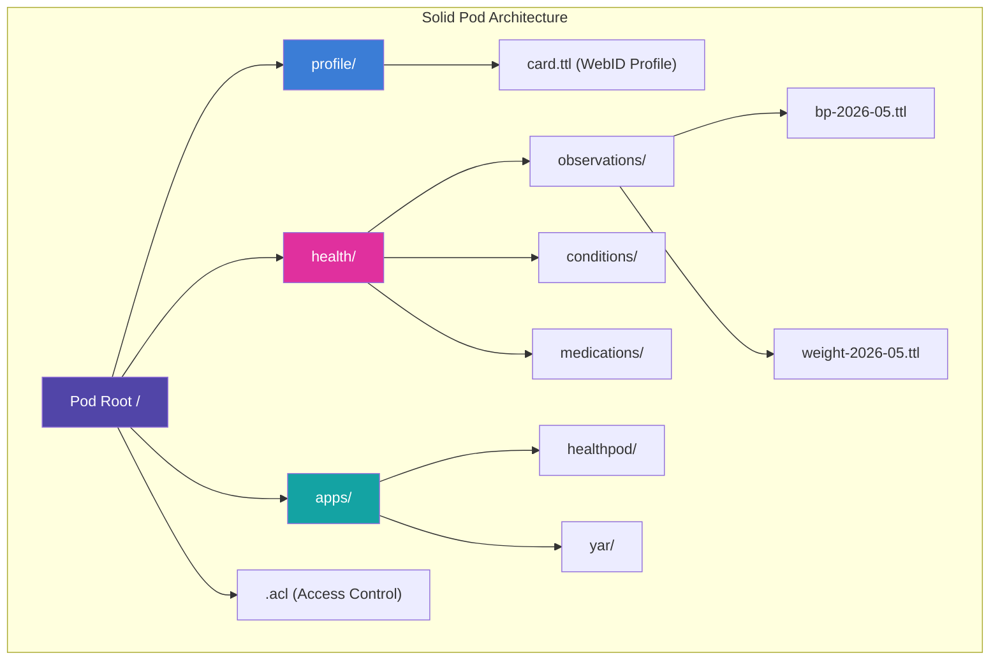
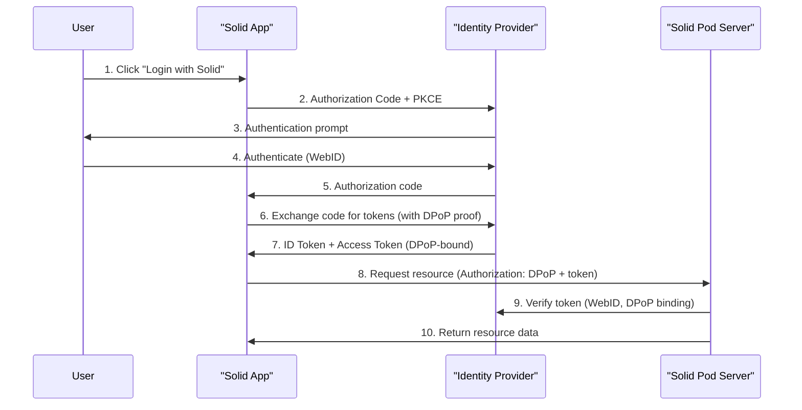
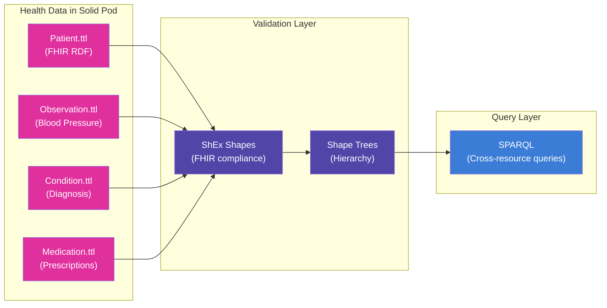
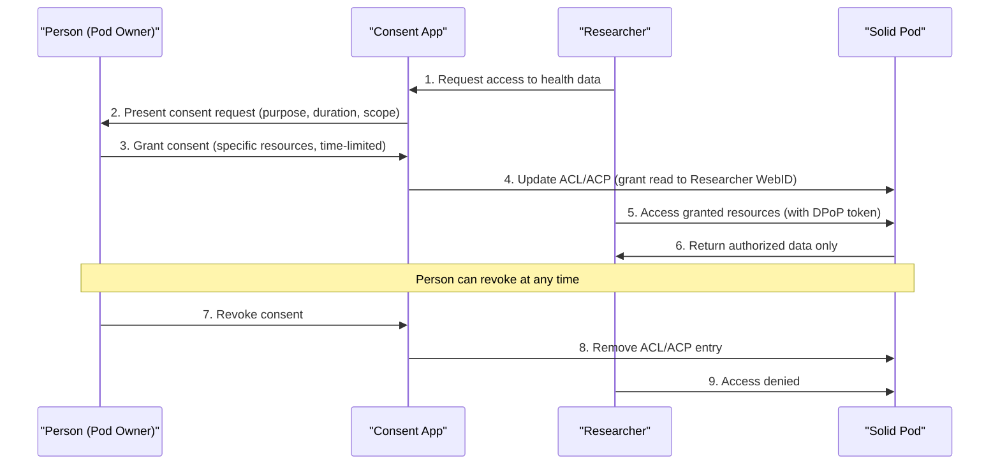
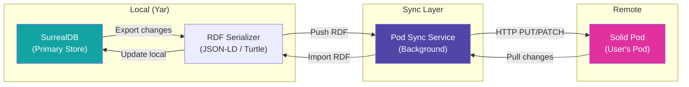
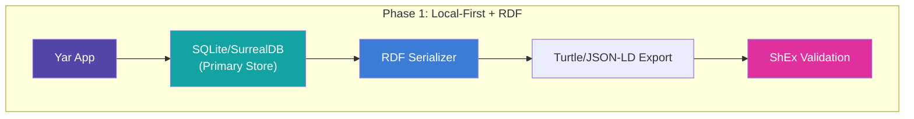
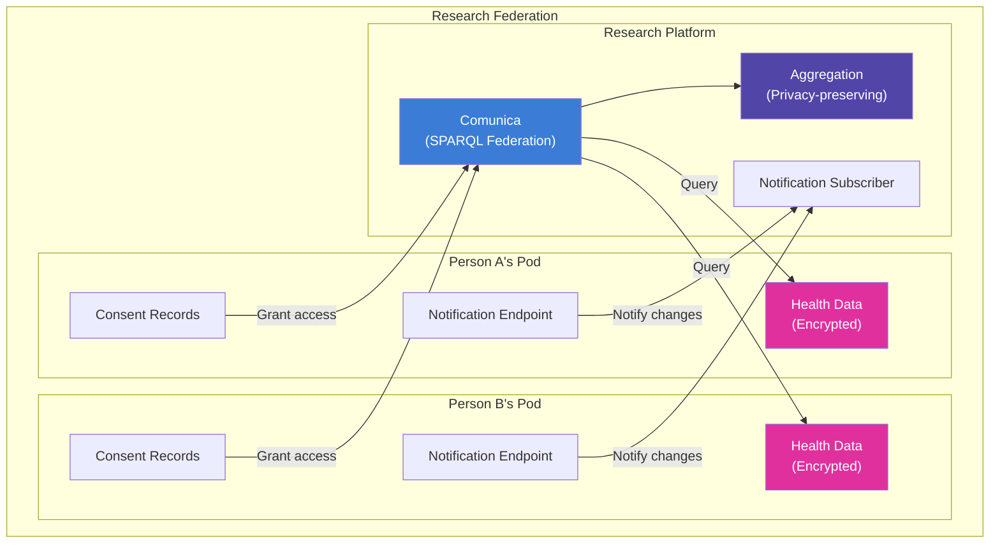
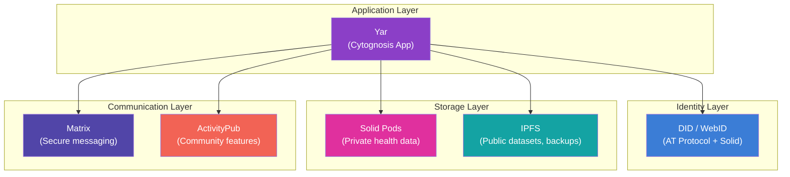

# Solid Pods Ecosystem: Comprehensive Research for Cytognosis

> **Research Date**: May 2026
> **Author**: Cytognosis Research Agent
> **Status**: Complete
> **Classification**: Internal Technical Research

---

## Table of Contents

1. [Executive Summary](#1-executive-summary)
2. [Solid Protocol Deep Dive](#2-solid-protocol-deep-dive)
3. [Server Implementations](#3-server-implementations)
4. [Health Data Architecture](#4-health-data-architecture)
5. [App Architecture Patterns](#5-app-architecture-patterns)
6. [Integration with Existing Databases](#6-integration-with-existing-databases)
7. [Cytognosis Integration Roadmap](#7-cytognosis-integration-roadmap)
8. [Comparison with Alternatives](#8-comparison-with-alternatives)
9. [Risk Assessment and Open Questions](#9-risk-assessment-and-open-questions)
10. [References](#10-references)

---

## 1. Executive Summary

Solid (Social Linked Data) is a W3C Community Group specification led by Sir Tim Berners-Lee that decouples data from applications. Users store personal data in Pods (Personal Online Data Stores), retaining ownership and granting granular, revocable access to applications and other agents via WebID-based authentication.

For Cytognosis, Solid represents a compelling alignment with our mission of health data sovereignty. The protocol's emphasis on user-controlled data, fine-grained access control, and interoperability through Linked Data standards maps directly onto our vision of putting individuals in control of their health information.

### Key Findings

| Dimension | Assessment |
|:---|:---|
| **Protocol maturity** | Core specs stable; WAC mature, ACP evolving; Solid-OIDC production-ready |
| **Server readiness** | Community Solid Server (CSS) is production-viable for self-hosting |
| **Health app ecosystem** | Active Flutter-based ecosystem from ANU SII (HealthPod, VitalStats, SecureDialog) |
| **FHIR integration** | FHIR RDF serialization enables storage in pods; ShEx validates compliance |
| **Encryption** | On-device encryption before pod storage (ANU pattern); server never sees plaintext |
| **Developer tools** | Mature JS/TS SDKs (Inrupt, rdflib.js, Comunica); Flutter SDK (solidpod) for mobile |
| **Risk level** | Medium: ecosystem is real but niche; community smaller than ActivityPub/Matrix |

### Recommendation

Solid is the strongest candidate for Cytognosis's decentralized health data layer. The recommended approach is a phased integration: start with local-first SQLite storage with RDF export capabilities, then add Solid pod synchronization as a secondary storage target, and eventually enable cross-pod federation for consented data sharing in research contexts.

---

## 2. Solid Protocol Deep Dive

### 2.1 Core Architecture

The Solid Protocol is a web standard designed to decentralize data storage by giving users ownership and control over their personal data through Pods (Personal Online Data Stores). It leverages existing W3C standards to create an interoperable ecosystem where data is decoupled from the applications that use it.

#### Pods (Personal Online Data Stores)

A Pod acts as a secure, personal web server where a user stores their data (e.g., profile, contacts, photos, health records). It is identified by a URL and can be hosted on personal or public servers.

A "Storage" in Solid is a space of URIs under a user's control. It is typically represented as a root container.

#### LDP (Linked Data Platform)

Solid uses the W3C Linked Data Platform (LDP) specification to manage data. LDP provides a RESTful API for CRUD (Create, Read, Update, Delete) operations on resources.

#### Containers and Resources

- **LDP Containers**: These are special resources that act as collections, organizing data hierarchically (similar to folders). They use `ldp:contains` to list their children.
- **RDF Resources**: Data in Solid is primarily stored as RDF (Resource Description Framework) documents. These documents allow data to be linked and understood across different applications. Solid servers also support non-RDF resources (binaries, like images or PDFs).



### 2.2 Access Control Models

Solid requires mechanisms to control which agents (users or apps) can access specific resources. There are currently two main specifications for this, though they are distinct and generally not used together on the same resource.

#### Web Access Control (WAC)

| Aspect | Details |
|:---|:---|
| **Model** | ACL-based (Access Control List) |
| **Maturity** | Mature, widely implemented |
| **Granularity** | Resource-level permissions (Read, Write, Append, Control) |
| **Target** | Agents identified by WebID, groups, or public |
| **File format** | `.acl` files (Turtle/RDF) alongside resources |
| **Inheritance** | Default ACLs cascade from parent containers |

#### Access Control Policy (ACP)

| Aspect | Details |
|:---|:---|
| **Model** | Policy-based with matchers and policies |
| **Maturity** | Newer, evolving specification |
| **Granularity** | Fine-grained: can specify client app, issuer/identity provider |
| **Target** | Agents, clients, and issuers in combination |
| **Flexibility** | More expressive than WAC for complex scenarios |
| **Adoption** | Primarily supported in Inrupt's Enterprise Solid Server (ESS) |

#### WAC vs. ACP Comparison

| Feature | WAC | ACP |
|:---|:---|:---|
| **Specification status** | Mature/stable | Evolving |
| **Implementation** | CSS, NSS | ESS (Inrupt) |
| **Complexity** | Simple ACL model | Rich policy model |
| **Client-level control** | No | Yes |
| **Issuer-level control** | No | Yes |
| **Best for Cytognosis** | Self-hosted CSS deployments | Enterprise/multi-tenant |

### 2.3 Authentication: Solid-OIDC

Solid-OIDC is the established authentication protocol within the Solid ecosystem. It serves as a profile of the industry-standard OpenID Connect (OIDC) and OAuth 2.0 frameworks, specifically tailored to support decentralized identity via WebIDs and secure resource access.

#### Key Technical Characteristics

- **DPoP (Demonstration of Proof-of-Possession)**: Solid-OIDC mandates the use of DPoP. This mechanism binds tokens to a specific cryptographic key, preventing token theft and replay attacks, which is critical in a decentralized architecture where applications interact with various independent storage servers (Pods).
- **WebID Integration**: Unlike generic OIDC, which focuses on email or internal user IDs, Solid-OIDC uses the WebID (a URI that uniquely identifies the user) as a core claim.
- **Authorization Code Flow with PKCE**: To ensure security, the specification requires the use of the Authorization Code Flow with Proof Key for Code Exchange (PKCE).
- **Audience Claim**: The audience (`aud`) claim is used to scope tokens to specific resource servers, preventing cross-server token misuse.



#### Specification Status

- **Current State**: Solid-OIDC is the recommended authentication method for the Solid ecosystem. It is maintained by the Solid Community Group under the W3C process.
- **Evolution**: As of 2024-2025, development continues through the Solid Community Group, with active discussions and updates tracked via the Solid-OIDC GitHub repository.
- **Relationship to W3C**: Solid-OIDC is part of the broader Solid Technical Reports, which aim to provide interoperable standards for decentralized data.

### 2.4 Data Interoperability: Shape Trees and ShEx

In the Solid ecosystem, Shape Trees and ShEx (Shape Expressions) are distinct but complementary mechanisms used to manage, validate, and organize Linked Data within Solid Pods.

#### ShEx (Shape Expressions)

A W3C standard language used for data validation. It defines the internal structure of an RDF graph (e.g., which properties are required, their cardinalities, and datatypes). If you have a specific resource (like a Project or a Task), ShEx is the tool that validates whether the triples within that resource conform to the expected schema.

#### Shape Trees

A mechanism for defining and validating data hierarchies and organization. While ShEx validates the contents of a single resource, Shape Trees describe how constellations of resources relate to one another (e.g., a "Project" container might contain multiple "Task" resources). They essentially "marry" RDF vocabularies, ShEx shapes, and resource hierarchies to provide a predictable structure for data storage and discovery.

#### How They Work Together

1. **Definition**: Shape Trees are used to define the layout of data (the "tree" structure). They specify which ShEx shapes should be applied to which resources within that hierarchy.
2. **Validation**: When an application interacts with a Pod, it can use the Shape Tree to identify the appropriate ShEx shape. The application then uses that ShEx schema to perform rigorous validation on the RDF data.
3. **Interoperability**: This combination allows disparate applications to interact with the same data. Because the data structure and hierarchy are explicitly defined and validated through these mechanisms, different applications can confidently read, write, and manage the same information without violating the user's data boundaries.

| Mechanism | Focus | Scope |
|:---|:---|:---|
| **ShEx** | "Micro" level: structural integrity of RDF triples within a specific node/resource | Single resource validation |
| **Shape Trees** | "Macro" level: organization, discovery, and relationship between resources/containers | Cross-resource hierarchy |

### 2.5 Solid Notifications Protocol

The Solid ecosystem maintains a Notifications Protocol that defines an extensible, HTTP-based framework for client applications to receive notifications regarding changes to resources.

#### Notification Channel Types

| Channel Type | Mechanism | Use Case |
|:---|:---|:---|
| **EventSource** | Server-Sent Events (SSE) | Real-time browser updates |
| **WebSockets** | Persistent bidirectional connection | Low-latency apps |
| **Webhooks** | HTTP callbacks to registered endpoints | Server-to-server |
| **Linked Data Notifications** | LDN inbox pattern | Asynchronous messaging |
| **Fetch API** | Polling-based | Simple clients |

#### Related Concepts

- **Type Indexes**: Solid uses type indexes to help applications discover data within a Pod. A type index maps RDF classes to the containers or resources where instances of that class are stored.
- **Per Resource Events Protocol (PREP)**: An alternative/complementary notification mechanism introduced in 2024 that allows applications to receive the current representation of a resource along with notifications in a single HTTP request.
- **Classes of Products**: The Solid CG defines specific classes of products (e.g., Resource Server, Subscription Server, OIDC Provider) to help developers understand which specifications apply to different components.

### 2.6 Technical Reports Index

The Solid ecosystem, managed by the W3C Solid Community Group (CG), maintains a series of Technical Reports (TRs):

| Specification | Status | Purpose |
|:---|:---|:---|
| **Solid Protocol** | Core | Foundational spec for server/client interop |
| **Web Access Control (WAC)** | Mature | ACL-based authorization |
| **Access Control Policy (ACP)** | Evolving | Policy-based authorization |
| **Solid-OIDC** | Stable | Authentication via OpenID Connect profile |
| **Solid Notifications Protocol** | Active | Real-time change notifications |
| **Shape Trees** | Draft | Data hierarchy and organization |
| **Type Indexes** | Draft | Data discovery within pods |

---

## 3. Server Implementations

### 3.1 Community Solid Server (CSS)

CSS is the current primary implementation of the Solid specifications. It is designed to be modular, flexible, and developer-friendly.

| Aspect | Details |
|:---|:---|
| **Status** | Active, recommended |
| **Language** | TypeScript |
| **Architecture** | Modern, modular (component-based) |
| **Deployment** | Docker, Helm (Kubernetes), Node.js (`npx`/`npm`) |
| **Configuration** | JSON configuration files (highly configurable) |
| **Storage backends** | File system, in-memory, SPARQL endpoint |
| **Auth** | Solid-OIDC compliant |
| **Access control** | WAC |
| **License** | MIT |

**Why choose CSS**: It is the only up-to-date open-source implementation actively used by researchers, developers, and the Solid community. It receives regular security updates, has comprehensive test coverage, and supports modern features.

**Use Cases**: Excellent for developers building Solid apps, researchers exploring Solid's capabilities, or individuals/organizations who want to host their own Pod.

**Deployment options**:
- Docker (most stable and easiest to maintain)
- Helm charts for Kubernetes
- Direct Node.js installation

### 3.2 Node Solid Server (NSS)

| Aspect | Details |
|:---|:---|
| **Status** | Legacy, unmaintained |
| **Language** | JavaScript (Express) |
| **Architecture** | Older, monolithic |
| **Maintenance** | Not being developed |
| **Recommendation** | **Avoid for any new projects** |

NSS was one of the earliest Solid server implementations but is now largely obsolete. Because it is unmaintained, it lacks security patches, performance improvements, and protocol updates. Using it in 2025-2026 presents significant security risks and compatibility issues with modern Solid applications.

### 3.3 Inrupt Enterprise Solid Server (ESS)

Inrupt's Enterprise Solid Server (ESS) is a commercial, production-ready implementation of the W3C Solid standard, designed to enable organizations to host and manage millions of Solid Pods.

| Aspect | Details |
|:---|:---|
| **Status** | Active, commercial |
| **Deployment** | Cloud-agnostic (Kubernetes + Kafka) |
| **Scale** | Millions of pods |
| **Access control** | ACP (more granular than WAC) |
| **Compliance** | GDPR audit logging, system events |
| **AI readiness** | "Safe AI" infrastructure (v2.2+) for GenAI with consent/transparency |
| **Data lifecycle** | Simplified deletion/purging APIs, off-boarding tools |
| **Wallet infrastructure** | Data Wallet and Agentic Wallet APIs |
| **Pricing** | Not publicly listed; requires sales engagement |
| **License** | Proprietary/commercial |

#### Key ESS Features (2024-2025)

- **Access Request/Grant System**: Fine-grained, time-based, and revocable data access
- **Comprehensive Audit Events**: Metadata support and filtering for regulatory compliance
- **Safe AI (v2.2+)**: Infrastructure for GenAI services to interact with personal data via consent, transparency, and traceability
- **Data Lifecycle Management (v2.3-v2.5)**: Simplified data deletion/purging APIs, subscription-based notifications via webhooks
- **Enterprise Wallet Infrastructure**: APIs to manage wallet-based interactions, credential storage, and consent

### 3.4 Server Comparison and Recommendation

| Feature | CSS | NSS | ESS |
|:---|:---|:---|:---|
| **Open source** | Yes (MIT) | Yes (MIT) | No (commercial) |
| **Actively maintained** | Yes | No | Yes |
| **Production-ready** | Yes (with care) | No | Yes |
| **Self-hosting** | Easy (Docker) | Not recommended | Requires license |
| **Access control** | WAC | WAC | ACP |
| **Scale** | Small-medium | N/A | Enterprise (millions) |
| **Cost** | Free | Free | Paid |
| **Best for** | Self-hosted, research, dev | Nothing (deprecated) | Enterprise, multi-tenant |

> [!IMPORTANT]
> **Cytognosis Recommendation**: Use **Community Solid Server (CSS)** for self-hosting. It is the only viable open-source option. Deploy via Docker for stability. Consider ESS only if Cytognosis scales to multi-tenant production with enterprise compliance requirements.

---

## 4. Health Data Architecture

### 4.1 FHIR RDF Integration with Solid Pods

The integration of Solid pods with FHIR (Fast Healthcare Interoperability Resources) represents a cutting-edge approach to decentralized health data management, shifting the paradigm from institution-centric records to patient-centric, portable data stores.

#### Core Architecture

- **Solid Pods**: Act as the decentralized storage layer. Individuals maintain autonomy over their health data by decoupling content from the applications used to access it.
- **FHIR RDF**: While FHIR is commonly used as JSON/XML via RESTful APIs, the FHIR RDF specification serializes FHIR resources as RDF triples, making clinical data machine-processable and linkable with other semantic web data.
- **Linked Data Advantage**: By using RDF, health records stored in Solid pods become part of a knowledge graph. This allows for complex querying (using SPARQL), logical reasoning, and the integration of diverse datasets (e.g., combining EHR data with wearable sensor data or genomic information).

#### RDF Vocabulary Stack for Health Data

| Vocabulary | Purpose | Use in Solid |
|:---|:---|:---|
| **FHIR RDF** | Clinical data model (Patient, Observation, Condition, etc.) | Primary health data format in pods |
| **Schema.org** | Web discovery and lightweight metadata | Public-facing annotations |
| **SNOMED CT** | Clinical terminology (diagnoses, procedures) | Coding within FHIR resources |
| **LOINC** | Laboratory and clinical observation codes | Observation coding |
| **ICD-10/11** | Disease classification | Condition coding |
| **ShEx** | Validation of FHIR RDF data | Ensuring conformance |
| **RML** | RDF Mapping Language | Transforming data between formats |



#### Implementation Landscape (2024-2025)

- **Data Transformation**: Recent efforts have focused on building robust pipelines to transform legacy health data (HL7 v2, CCDA, or JSON-based FHIR) into FHIR RDF. This is often handled by transformation toolkits that include validation against FHIR-specific schemas (e.g., ShEx/SHACL).
- **Decentralized Access Control**: A major challenge in healthcare is security. Research has explored combining WAC/ACP with domain-specific consent ontologies.
- **FHIR RDF Round-tripping**: FHIR RDF serialization is "losslessly round-trippable" with standard JSON/XML FHIR formats.

#### Practical Implementation

- **Storage**: Health data (Patient, Observation, Condition resources) stored as RDF documents (Turtle format) in Solid pods
- **Semantic Interoperability**: FHIR as core data model; RDF enables SPARQL querying and cross-dataset merging
- **Validation**: ShEx ensures FHIR RDF conformance; RML creates "views" for different formats/vocabularies
- **Tooling**: HAPI FHIR (RDF parsing/serialization), Jena or RDF4J for RDF graph management

### 4.2 Encryption Patterns

To secure health data within Solid Pods, it is critical to distinguish between the Solid protocol standard encryption and application-level encryption patterns.

#### Encryption at Different Layers

| Layer | Mechanism | Who Provides | Notes |
|:---|:---|:---|:---|
| **In transit** | TLS/HTTPS | Solid server | Standard for all Solid deployments |
| **At rest (server)** | Filesystem encryption | Server administrator | OS-level disk encryption |
| **At rest (application)** | On-device encryption | App (e.g., HealthPod) | Data encrypted before upload to pod |
| **End-to-end** | Client-side encryption | App + key management | Server never sees plaintext |

#### ANU SII Encryption Pattern

The ANU Software Innovation Institute has established a pattern used across their health apps (HealthPod, FilePod, SecureDialog, etc.):

1. **On-device encryption**: Data is encrypted on the user's device before being stored in the Solid Pod
2. **Key management**: The `KeyManager` class in the `solidpod` package handles encryption keys
3. **Trust-No-One model**: Even the server hosting the Pod cannot access the content of stored health data
4. **The `solid-encrypt` package**: Part of the ANU SII toolset for secure data management

> [!TIP]
> For Cytognosis, the ANU SII encryption pattern (encrypt-before-upload) is the right approach for health data. This aligns with our "data sovereignty" principle: the pod server is a dumb storage layer, and the user's device holds the only decryption keys.

### 4.3 Consent Management for Researcher Access

Solid pods offer a decentralized, patient-centric approach to healthcare data management, where individuals can control who accesses their data and under what conditions.

#### Consent Mechanisms

| Mechanism | How It Works | Granularity |
|:---|:---|:---|
| **WAC ACLs** | Grant/revoke read/write per resource | Per-file or per-container |
| **ACP Policies** | Define policies with agent + client + issuer matchers | Per-resource with context |
| **Access Grants (ESS)** | Time-bounded, purpose-specific access tokens | Fine-grained, auditable |
| **Consent ontologies** | RDF-based consent records (e.g., DPV, GConsent) | Machine-readable consent |

#### Research Data Sharing Flow



### 4.4 HealthPod Data Structure

HealthPod is an open-source application developed by the ANU Software Innovation Institute (SII) designed to help individuals collect, store, and manage their health data securely within their own Solid Pod.

#### Key Features

- **Technology Stack**: Built using Flutter, runs on web, Android, macOS, Windows, and Linux
- **On-device encryption**: Data encrypted before storage; decrypted only on user's device
- **Uses `solid-encrypt` package**: Part of the SII secure data management toolset
- **Functionality**:
  - Private dashboard for health information
  - Daily observations (blood pressure, etc.)
  - Doctor's notes and medical reports
  - Appointment history
  - Vaccinations and medication records
  - Data visualization tools
  - Privacy-preserving AI analysis of personal health data
  - Selective sharing with healthcare providers

#### Pod Data Organization

```
/healthpod/
├── profile/
│   └── card.ttl                    # User health profile
├── observations/
│   ├── blood-pressure/
│   │   └── 2026-05-24.ttl          # Daily BP readings
│   ├── weight/
│   │   └── 2026-05-24.ttl          # Weight measurements
│   └── temperature/
├── conditions/
│   └── active-conditions.ttl       # Diagnosed conditions
├── medications/
│   └── current-medications.ttl     # Active prescriptions
├── appointments/
│   └── history.ttl                 # Appointment records
├── vaccinations/
│   └── record.ttl                  # Vaccination history
└── reports/
    └── lab-results/                # Uploaded lab reports
```

### 4.5 VitalStats and SecureDialog

#### VitalStats

VitalStats is designed to track weight and blood pressure on your personal Solid Pod. It provides a simple interface for recording vitals over time and visualizing trends.

- **Data types**: Blood pressure (systolic/diastolic), weight, BMI
- **Storage**: Observations stored as RDF in user's pod
- **Privacy**: Data stays in user's pod; no central database

#### SecureDialog

SecureDialog is a diabetes logging application that stores data in encrypted Solid pods.

- **Purpose**: Daily diabetes management (glucose readings, insulin doses, meals)
- **Encryption**: Uses the same on-device encryption pattern as HealthPod
- **Data model**: Observations and measurements stored as encrypted Turtle files
- **Secure dialog**: Enables secure communication between patient and healthcare provider through the pod

---

## 5. App Architecture Patterns

### 5.1 Core Apps

#### SolidOS Databrowser (Mashlib)

| Aspect | Details |
|:---|:---|
| **URL** | https://solidos.github.io/mashlib/dist/browse.html |
| **Source** | https://github.com/SolidOS/mashlib |
| **Tech stack** | Vanilla JS, custom UI framework (not React) |
| **Purpose** | General-purpose Linked Data browser/editor |
| **Auth** | Solid-OIDC via built-in login |
| **Data model** | Generic RDF viewer/editor (any vocabulary) |
| **Architecture** | `rdflib.js` + `solid-logic` + `solid-ui` + `solid-panes` |

Mashlib bundles several key SolidOS repositories into a single package (`mashlib.js`). It serves as the frontend "Operating System" interface for Solid:

- **`rdflib.js`**: Foundational JavaScript library for parsing, querying, and managing RDF
- **`solid-logic`**: Core business logic
- **`solid-ui`**: UI widgets, utilities, and building blocks
- **`solid-panes`**: Registry of "panes" (modular views/apps) for different data types

> [!NOTE]
> SolidOS/Mashlib is NOT built on React or SolidJS. The naming similarity between "Solid" (the decentralized web project) and "SolidJS" (a reactive JavaScript framework) causes frequent confusion. They are entirely separate projects.

#### ODI Solid File Manager

| Aspect | Details |
|:---|:---|
| **URL** | https://solid-file-manager.theodi.org/ |
| **Source** | https://github.com/solid/solid-file-manager |
| **Tech stack** | Web application |
| **Purpose** | File management for Solid Pods |
| **Steward** | Open Data Institute (ODI) |
| **Auth** | Solid-OIDC |
| **Features** | Browse, upload, download, manage files in pods |

The Solid File Manager is a web-based tool for managing files within Solid Pods. It provides a familiar file-manager interface for users to interact with their pod contents without needing to understand RDF or Linked Data concepts.

#### FilePod

| Aspect | Details |
|:---|:---|
| **URL** | https://filepod.solidcommunity.au/ |
| **Source** | https://github.com/anusii/filepod |
| **Tech stack** | Flutter (cross-platform) |
| **Developer** | ANU Software Innovation Institute |
| **Purpose** | Privacy-first file browser for Solid pods |
| **Auth** | Solid-OIDC via `solidpod` package |
| **Encryption** | On-device encryption before pod storage |
| **Platforms** | Linux, Android, Web, Windows, macOS, iOS |
| **Packages** | `solidpod` (logic) + `solidui` (UI widgets) |

FilePod is part of the broader ANU SII ecosystem at solidcommunity.au. It supports a "Trust No One" approach, ensuring that data hosted on a Solid Server is encrypted so that even server administrators cannot access it.

### 5.2 Health Apps

#### HealthPod

| Aspect | Details |
|:---|:---|
| **URL** | https://healthpod.solidcommunity.au/ |
| **Source** | https://github.com/anusii/healthpod |
| **Tech stack** | Flutter |
| **Developer** | ANU Software Innovation Institute |
| **Purpose** | Encrypted health data management |
| **Auth** | Solid-OIDC via `solid-auth` / `solidpod` |
| **Encryption** | On-device encryption via `solid-encrypt` |
| **RDF support** | Via `rdflib` Dart package |
| **Platforms** | Web, Android, macOS, Windows, Linux |

#### MS Fatigue Assessment

| Aspect | Details |
|:---|:---|
| **URL** | https://msfatigue.solidcommunity.au/ |
| **Source** | https://github.com/anusii/msfatigue |
| **Tech stack** | Flutter |
| **Developer** | ANU Software Innovation Institute |
| **Purpose** | Fatigue assessment surveys for MS patients |
| **Auth** | Solid-OIDC via `solidpod` |
| **Encryption** | Encrypted storage in Solid pod |
| **Data model** | Survey responses stored as encrypted Turtle |

The MS Fatigue Assessment app collects standardized fatigue survey responses and stores them encrypted in the user's pod. It demonstrates a clinical research use case: patients complete assessments on their own devices, data is encrypted and stored in their pods, and researchers can request access through the consent management framework.

#### InnerPod

| Aspect | Details |
|:---|:---|
| **URL** | https://innerpod.solidcommunity.au/ |
| **Source** | https://github.com/gjwgit/innerpod |
| **Tech stack** | Flutter |
| **Developer** | Graham Williams (gjwgit) |
| **Purpose** | Meditation timer and session recorder |
| **Auth** | Solid-OIDC |
| **Data storage** | Session logs stored in Solid pod |

#### SecureDialog

| Aspect | Details |
|:---|:---|
| **URL** | https://securedialog.solidcommunity.au/ |
| **Tech stack** | Flutter |
| **Purpose** | Diabetes logging with encrypted pod storage |
| **Auth** | Solid-OIDC |
| **Encryption** | On-device encryption |

#### VitalStats

| Aspect | Details |
|:---|:---|
| **URL** | https://vitalstats.apps.privatedatapod.com |
| **Purpose** | Blood pressure, weight, and vitals tracking |
| **Data model** | Observations stored as RDF in user's pod |
| **Privacy** | No central database; data stays in user's pod |

### 5.3 Productivity Apps

#### Portable LibreChat

| Aspect | Details |
|:---|:---|
| **URL** | https://chat.solidproject.org/ |
| **Source** | https://github.com/solid/LibreChat |
| **Tech stack** | Node.js (fork of LibreChat) |
| **Purpose** | AI chat with Solid pod conversation history |
| **Default storage** | MongoDB (standard LibreChat) |
| **Solid integration** | Proposed: "Login with Solid" + pod-based chat storage |

The Solid LibreChat integration (GitHub Issue #12068) proposes:
- **Login**: "Login with Solid" button using Solid-OIDC
- **Storage**: Conversations and messages stored in user's pod (e.g., `/librechat/conversations/` and `/librechat/messages/`)
- **Data ownership**: Users can move or revoke access without depending on the application's central database

> [!NOTE]
> This integration is particularly relevant for Yar. The pattern of storing AI chat history in a Solid pod (rather than a central database) aligns directly with our local-first, user-owned data philosophy.

#### Task Management Pod (TodoPod)

| Aspect | Details |
|:---|:---|
| **URL** | https://todopod.solidcommunity.au/ |
| **Source** | https://github.com/gjwgit/todopod |
| **Tech stack** | Flutter |
| **Developer** | Graham Williams (gjwgit) |
| **Purpose** | Task management with pod storage |

#### Diary Pod

| Aspect | Details |
|:---|:---|
| **URL** | https://gjwgit.github.io/diarypod/ |
| **Source** | https://github.com/gjwgit/diarypod |
| **Tech stack** | Flutter |
| **Developer** | Graham Williams (gjwgit) |
| **Purpose** | Personal diary with pod storage |

### 5.4 Developer SDK Ecosystem

#### JavaScript/TypeScript SDKs

| Library | Maintainer | Purpose | Status |
|:---|:---|:---|:---|
| **@inrupt/solid-client** | Inrupt | High-level CRUD operations | Active, production |
| **@inrupt/solid-client-authn-browser** | Inrupt | Browser-based Solid-OIDC | Active, production |
| **@inrupt/solid-client-authn-node** | Inrupt | Node.js Solid-OIDC | Active, production |
| **rdflib.js** | SolidOS | Low-level RDF operations | Active, mature |
| **Comunica** | Community | SPARQL query engine | Active, research-grade |
| **LDO (Linked Data Objects)** | Community | Type-safe Linked Data | Active, newer |

#### Flutter/Dart SDKs (ANU SII)

| Package | Purpose | Key Features |
|:---|:---|:---|
| **`solidpod`** | Core pod interaction | Auth, CRUD, encryption, key management |
| **`solidui`** | UI components | Login screens, permission management widgets |
| **`solid-auth`** | Authentication | Solid-OIDC implementation for Flutter |
| **`rdflib`** | RDF operations | Turtle parsing, triple management |
| **`solid-encrypt`** | Encryption | On-device encryption before pod storage |

---

## 6. Integration with Existing Databases

### 6.1 SurrealDB Integration with Linked Data

SurrealDB is a multi-model database that combines document, relational, and graph capabilities, but it is not natively designed for RDF or Linked Data.

#### Integration Approaches

| Approach | Description | Complexity |
|:---|:---|:---|
| **RDF-to-Graph mapping** | Map RDF triples to SurrealDB's graph model (RELATE statements) | Medium |
| **JSON-LD intermediary** | Serialize RDF as JSON-LD, store in SurrealDB as documents | Low-medium |
| **Sync layer** | Build a synchronization service between SurrealDB and Solid pods | High |
| **SPARQL adapter** | Implement a SPARQL-to-SurrealQL translation layer | Very high |

#### Recommended Pattern for Yar



### 6.2 SQLite to Solid Pod Synchronization

Integrating a local-first SQLite database with Solid pods involves several patterns:

#### Synchronization Strategies

| Strategy | Description | Pros | Cons |
|:---|:---|:---|:---|
| **Export-on-change** | Serialize SQLite rows to RDF on write; push to pod | Simple, predictable | Write amplification |
| **Batch sync** | Periodic bulk export of changed records | Efficient | Stale remote data |
| **CRDT-based** | Use CRDTs for conflict-free merging | Robust offline | Complex implementation |
| **Event-sourced** | Store operations as events; replay to pod | Auditable | Storage overhead |

#### Implementation Considerations

1. **Schema mapping**: Define a mapping from SQLite tables/columns to RDF classes/properties
2. **Change detection**: Use SQLite triggers or WAL monitoring to detect changes
3. **Conflict resolution**: When data changes both locally and in the pod, define merge strategies
4. **Offline-first**: Local SQLite is the source of truth; pod is a backup/sharing layer

### 6.3 SPARQL Endpoints Over Pod Data

Solid pods do not natively expose SPARQL endpoints, but several approaches enable SPARQL querying:

| Approach | How | Performance |
|:---|:---|:---|
| **Comunica** | Client-side SPARQL engine that queries pod resources directly | Good for small datasets |
| **CSS SPARQL backend** | CSS can be configured with a SPARQL store backend | Server-side, scalable |
| **LDflex** | Path-based traversal expressions (SPARQL-like) | Simple queries only |
| **Local triplestore** | Sync pod data to a local Fuseki/Oxigraph/RDF4J | Best performance, full SPARQL 1.1 |

### 6.4 Graph Database Integration

#### Neo4j Integration with Linked Data

| Aspect | Details |
|:---|:---|
| **RDF support** | neo4j-rdf plugin (Neosemantics/n10s) |
| **Import** | `n10s.rdf.import.fetch` from Solid pod URLs |
| **Export** | Serialize Neo4j subgraphs as RDF |
| **Mapping** | Neo4j labels → RDF classes, properties → predicates |

#### SurrealDB Graph Model

| Aspect | Details |
|:---|:---|
| **Native graphs** | RELATE statements create typed edges |
| **RDF mapping** | Subject → Node, Predicate → Edge type, Object → Node |
| **Querying** | SurrealQL graph traversal (not SPARQL) |
| **Trade-off** | Loses RDF semantics but gains SurrealDB's multi-model power |

---

## 7. Cytognosis Integration Roadmap

### 7.1 Short-term: Local-first with RDF Export (0-6 months)

**Goal**: Use existing local-first architecture (SQLite/SurrealDB) with the ability to export data as RDF.

| Action | Details |
|:---|:---|
| Define RDF vocabulary mapping | Map Yar's data model to FHIR RDF + Schema.org |
| Implement RDF serializer | Export health data as Turtle/JSON-LD from local DB |
| Add ShEx validation | Validate exported RDF against FHIR shapes |
| Prototype pod login | Implement "Login with Solid" using Inrupt JS SDK |
| Evaluate CSS deployment | Deploy a test CSS instance via Docker |



### 7.2 Medium-term: SQLite → Solid Pod Sync (6-12 months)

**Goal**: Add Solid pod as a secondary storage target for backup and sharing.

| Action | Details |
|:---|:---|
| Deploy CSS production instance | Self-hosted CSS on Cytognosis infrastructure |
| Implement bidirectional sync | Background service syncing local DB ↔ Solid pod |
| Build consent UI | UI for granting/revoking access to health data |
| Encrypt-before-upload | Implement ANU SII pattern for on-device encryption |
| Type Index registration | Register Yar's data types in pod's type index |

#### Caching and Data Tiering Strategy

| Tier | Storage | Purpose | Freshness |
|:---|:---|:---|:---|
| **Hot (Tier 1)** | Local SQLite/SurrealDB | Active app data, instant access | Real-time |
| **Warm (Tier 2)** | In-memory RDF cache | Recently synced pod data | Minutes |
| **Cold (Tier 3)** | Solid Pod | Durable backup, sharing layer | Sync interval |
| **Archive (Tier 4)** | Pod + encrypted backup | Long-term health records | Batch |

#### Local-First Architecture Principles

Building a robust local-first architecture for Solid applications requires several key strategies:

1. **Offline-first design**: The app must function fully without network connectivity
2. **Local cache as source of truth**: Use IndexedDB/SQLite as primary store; pod is secondary
3. **Background synchronization**: Sync changes to pod when connectivity is available
4. **Conflict resolution**: Define clear merge strategies (last-write-wins, CRDT, manual)
5. **Progressive enhancement**: Add pod features incrementally without breaking local-first UX

### 7.3 Long-term: Pod Federation for Research (12-24 months)

**Goal**: Enable cross-user health data sharing with consent for research collaborations.

| Action | Details |
|:---|:---|
| Cross-pod queries | Use Comunica to query across consented pods |
| Research data aggregation | Build aggregation service for anonymized insights |
| Notification subscriptions | Subscribe to pod changes via WebSocket/Webhooks |
| Interop with external apps | Enable other Solid apps to read Yar's health data |
| Pod-to-pod federation | Direct pod-to-pod data sharing without central server |

#### Cross-Pod Federation Architecture

The Solid Notifications Protocol enables real-time updates and federation across pods:



### 7.4 Interaction with Central Artifact Repository

| Component | Role | Integration Point |
|:---|:---|:---|
| **Solid Pod** | User's personal health data store | User-controlled, decentralized |
| **Cytognosis Central Repo** | Aggregated models, reference data, public datasets | Organization-controlled |
| **Sync Bridge** | Connects pods to central repo with consent | Consent-gated data flow |
| **Type Index** | Maps data types to pod locations | Discovery mechanism |

---

## 8. Comparison with Alternatives

### 8.1 Overview

These four technologies represent different approaches to decentralizing the web, each with unique goals, architectures, and use cases.

| Technology | Primary Focus | Approach | Key Characteristic |
|:---|:---|:---|:---|
| **Solid** | Personal Data Ownership | Pods (Personal Online Datastores) | Fine-grained access control to data |
| **ActivityPub** | Federated Social Networking | Server-to-Server federation | Mature, widely adopted (Fediverse) |
| **Matrix** | Secure Messaging/Communication | Federated rooms with E2EE | Encrypted communication protocol |
| **IPFS** | Distributed Storage | Peer-to-peer file system | Content-addressed, resilient storage |
| **AT Protocol** | Decentralized Social Networking | Personal Data Repositories (PDS) | Portable identity, public-first data |

### 8.2 Solid vs. ActivityPub

| Dimension | Solid | ActivityPub |
|:---|:---|:---|
| **Purpose** | Data ownership and management | Social networking and content distribution |
| **Data model** | RDF/Linked Data (any data type) | Activity Streams 2.0 (social activities) |
| **Identity** | WebID (URI-based, self-hosted) | Server-tied accounts (portability issues) |
| **Access control** | Fine-grained WAC/ACP | Server-level moderation |
| **Ecosystem** | Smaller, growing | Large (Mastodon, PeerTube, Pixelfed) |
| **Best for** | Private/personal data, health records | Public social content, community |
| **Maturity** | Medium (specs stable, ecosystem growing) | High (W3C Recommendation, proven at scale) |

**For Cytognosis**: Solid is better for health data (private, consent-based, fine-grained access). ActivityPub could complement Solid for community features (public health discussions, community support).

### 8.3 Solid vs. Matrix

| Dimension | Solid | Matrix |
|:---|:---|:---|
| **Purpose** | Data storage and ownership | Secure communication |
| **Data model** | RDF/Linked Data | Events in rooms |
| **Encryption** | Application-layer (e.g., solid-encrypt) | End-to-end encryption (Olm/Megolm) |
| **Real-time** | Notifications Protocol (WebSocket/SSE) | Native real-time messaging |
| **Federation** | Pod-to-pod via HTTP | Server-to-server via Matrix federation |
| **Best for** | Structured data storage, health records | Secure messaging, telehealth |
| **Ecosystem** | Growing | Large (Element, bridges to Slack/Discord) |

**For Cytognosis**: Solid for data storage, Matrix for secure communication between patients and providers. They serve different purposes and could be used together.

### 8.4 Solid vs. IPFS

| Dimension | Solid | IPFS |
|:---|:---|:---|
| **Purpose** | Data ownership with access control | Distributed, resilient storage |
| **Addressing** | URL-based (location-addressed) | Content-addressed (CID-based) |
| **Access control** | WAC/ACP (fine-grained) | None native (encryption only) |
| **Mutability** | Native (HTTP CRUD) | Requires IPNS or MFS |
| **Data model** | RDF/Linked Data | Any binary content |
| **Best for** | Private data with controlled sharing | Public, immutable content distribution |
| **Performance** | Standard HTTP | Variable (depends on network) |

**For Cytognosis**: Solid for access-controlled health data. IPFS could be used as a backend storage layer for Solid pods (content-addressed backup) or for distributing public datasets. They can work together: Solid for access control, IPFS for resilient storage.

### 8.5 Solid vs. AT Protocol (Bluesky)

| Dimension | Solid | AT Protocol |
|:---|:---|:---|
| **Purpose** | Data ownership | Portable social networking |
| **Identity** | WebID (URI) | DID-based (decentralized identifiers) |
| **Data model** | RDF/Linked Data | Lexicons (JSON Schema-based) |
| **Privacy** | Private by default, grant access | Public by default |
| **Access control** | WAC/ACP | No fine-grained access control |
| **Federation** | Pod-based | Relay-based (AppViews) |
| **Best for** | Private data, health records | Public social content |
| **Maturity** | Medium | Medium (growing fast with Bluesky) |

**For Cytognosis**: Solid is clearly better for health data (private by default, fine-grained access control). AT Protocol's DID-based identity could be adopted for user identity, but the protocol itself is designed for public content.

### 8.6 Hybrid Architecture Potential

These technologies are not mutually exclusive. A hybrid architecture for Cytognosis could combine:



---

## 9. Risk Assessment and Open Questions

### 9.1 Risk Matrix

| Risk | Likelihood | Impact | Mitigation |
|:---|:---|:---|:---|
| **Solid ecosystem stagnation** | Medium | High | Build abstraction layer; don't couple tightly to Solid-specific APIs |
| **CSS scalability limits** | Medium | Medium | Monitor performance; plan ESS migration path if needed |
| **Encryption key management** | Medium | High | Use proven crypto libraries; implement key recovery mechanisms |
| **FHIR RDF tooling immaturity** | Medium | Medium | Contribute to open-source tooling; build custom adapters |
| **Community fragmentation (WAC vs ACP)** | Low | Medium | Implement WAC first (broader support); add ACP adapter later |
| **Regulatory compliance (HIPAA, GDPR)** | High | Very High | On-device encryption; audit logging; consent tracking; legal review |
| **User adoption of pod concept** | High | High | Abstract pod management behind familiar UX patterns |
| **Conflict resolution in sync** | Medium | Medium | Start with simple last-write-wins; evolve to CRDTs |

### 9.2 Open Questions

1. **HIPAA compliance**: Can a Solid pod architecture meet HIPAA requirements? The encrypt-before-upload pattern helps, but we need legal review of the full data flow.

2. **Key recovery**: If a user loses their encryption key, their health data is irrecoverable. What key recovery/escrow mechanisms are acceptable for health data?

3. **Performance at scale**: How does CSS perform with thousands of RDF resources per pod? What are the practical limits for health data volume?

4. **Migration path**: If we build on Solid and the ecosystem stagnates, what is the migration path? Our abstraction layer should enable switching to alternatives.

5. **Offline-first guarantees**: How long can a user operate offline before sync conflicts become unresolvable? What is the acceptable data staleness window?

6. **Multi-device sync**: How do we handle the same user accessing their pod from multiple devices simultaneously? What conflict resolution strategy works best?

7. **Interoperability testing**: Which other Solid apps can successfully read Yar's health data? How do we ensure our Shape Trees are compatible with the broader ecosystem?

8. **Cost of self-hosting**: What is the total cost of operating CSS infrastructure for N thousand users? How does this compare to ESS licensing?

### 9.3 Technical Debt Considerations

| Decision | Short-term benefit | Long-term risk |
|:---|:---|:---|
| WAC over ACP | Simpler, broader support | May need to migrate to ACP |
| SQLite primary + pod secondary | Proven local-first performance | Dual storage complexity |
| ANU encryption pattern | Proven in health apps | May diverge from future Solid encryption standards |
| Flutter for mobile SDK | Cross-platform, mature ecosystem | ANU SII dependency for Solid packages |
| CSS over ESS | Free, open-source | May lack enterprise features at scale |

---

## 10. References

### Specifications

- [Solid Protocol](https://solidproject.org/TR/protocol)
- [Web Access Control (WAC)](https://solidproject.org/TR/wac)
- [Solid-OIDC](https://solidproject.org/TR/oidc)
- [Solid Technical Reports Index](https://solidproject.org/TR)
- [Shape Trees Specification](https://shapetrees.org)
- [ShEx (Shape Expressions)](https://shex.io)

### Server Implementations

- [Community Solid Server (CSS)](https://github.com/CommunitySolidServer/CommunitySolidServer)
- [Inrupt Enterprise Solid Server](https://www.inrupt.com/products/enterprise-solid-server)
- [CSS Self-Hosting Guide](https://solidproject.org/self-hosting/css)

### Health Apps (ANU SII Ecosystem)

- [HealthPod](https://github.com/anusii/healthpod) — Encrypted health data management
- [MS Fatigue Assessment](https://github.com/anusii/msfatigue) — Clinical survey with encrypted pod storage
- [FilePod](https://github.com/anusii/filepod) — Privacy-first file browser
- [InnerPod](https://github.com/gjwgit/innerpod) — Meditation timer
- [SecureDialog](https://securedialog.solidcommunity.au/) — Diabetes logging
- [VitalStats](https://vitalstats.apps.privatedatapod.com) — Blood pressure and weight tracking

### Developer Resources

- [Solid for Developers](https://solidproject.org/for_developers)
- [SolidOS](https://solidos.solidcommunity.net/) — [GitHub](https://github.com/SolidOS/solidos)
- [Mashlib Databrowser](https://github.com/SolidOS/mashlib)
- [Inrupt JavaScript Client Libraries](https://docs.inrupt.com/developer-tools/javascript/client-libraries/)
- [rdflib.js](https://github.com/linkeddata/rdflib.js)
- [Comunica SPARQL Engine](https://comunica.dev/)
- [solidpod Flutter Package](https://pub.dev/packages/solidpod)

### Productivity Apps

- [Portable LibreChat](https://github.com/solid/LibreChat) — AI chat with pod history
- [TodoPod](https://github.com/gjwgit/todopod) — Task management
- [DiaryPod](https://github.com/gjwgit/diarypod) — Personal diary

### Research and Papers

- FHIR RDF Specification — HL7 FHIR Resource Description Framework serialization
- Solid Community Group — W3C Community Group managing Solid specifications
- solidcommunity.au — ANU SII experimental Solid deployment

### Comparison Protocols

- [ActivityPub](https://www.w3.org/TR/activitypub/) — W3C federated social networking
- [Matrix Protocol](https://matrix.org/) — Secure decentralized communication
- [IPFS](https://ipfs.tech/) — Distributed file system
- [AT Protocol](https://atproto.com/) — Bluesky's decentralized social protocol
