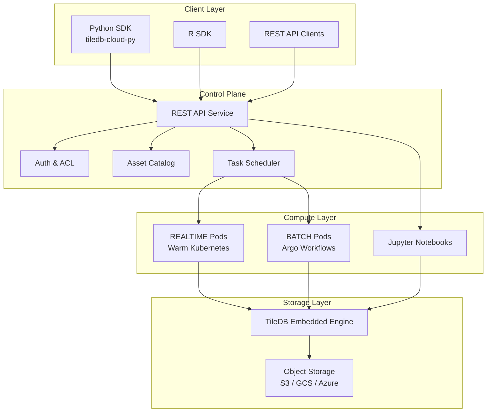
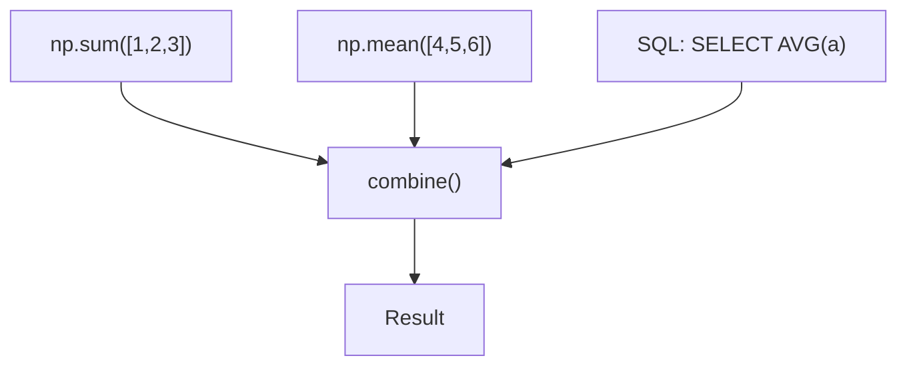
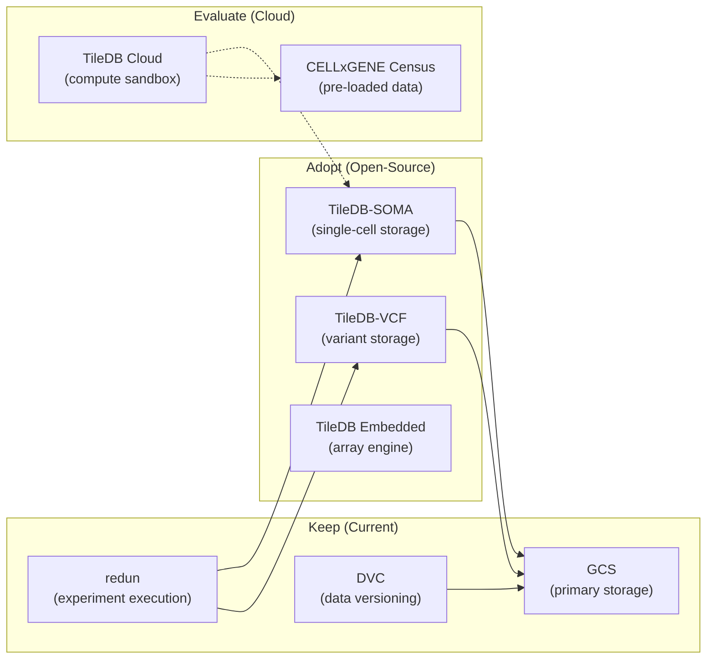

# TileDB Cloud Analysis: Architecture, Data Ingestion, and Compute Infrastructure

> **Owner**: Shahin Mohammadi · **Created**: 2026-05-24 · **Status**: DRAFT
> **Canonical location**: `~/repos/cytognosis/org/plans/research/tiledb-cloud-analysis.md`

---

## Section Map

| # | Section | Purpose |
|---|---------|---------|
| 1 | [Executive Summary](#1-executive-summary) | Key findings and relevance |
| 2 | [Architecture Overview](#2-architecture-overview) | Platform architecture and core engine |
| 3 | [Data Ingestion Modules](#3-data-ingestion-modules) | SOMA, VCF, BioImaging, Geospatial, Files |
| 4 | [Compute Infrastructure](#4-compute-infrastructure) | Delayed, TaskGraphs, UDFs, Workflows |
| 5 | [REST API Architecture](#5-rest-api-architecture) | API spec, endpoints, auth, multi-tenancy |
| 6 | [Python SDK Structure](#6-python-sdk-structure) | tiledb.cloud module layout |
| 7 | [Relevance to Cytognosis](#7-relevance-to-cytognosis) | CytoExplorer, experiment execution, comparison |
| 8 | [Recommendations](#8-recommendations) | Adopt, adapt, or build decision framework |

---

## 1. Executive Summary

TileDB Cloud is a managed data platform built on the open-source TileDB Embedded engine. It provides a unified, array-based storage model for multi-modal biomedical data (single-cell, genomics, imaging, geospatial) combined with serverless compute infrastructure for distributed analysis.

### Key Findings

1. **Data Ingestion**: Three specialized modules (SOMA for single-cell, VCF for genomics, BioImaging for microscopy) convert domain-specific formats into TileDB's multi-dimensional array model. A Geospatial module handles raster and point cloud data. All share the same underlying storage engine.

2. **Compute Infrastructure**: The `Delayed` API provides a Dask-like DAG-based task graph system for serverless, distributed computation. Tasks execute on managed Kubernetes pods in REALTIME (low-latency) or BATCH (heavy workloads) modes. UDFs enable arbitrary Python/R code execution.

3. **REST API**: OpenAPI-specified REST API serves as the control plane for arrays, groups, notebooks, UDFs, task graphs, and access control. Authentication via scoped REST API tokens.

4. **Relevance**: TileDB Cloud's architecture validates our multi-modal data platform strategy. Specific components (SOMA data model, task graph patterns, array-based storage) directly inform CytoExplorer and experiment execution design. The key question is whether to use TileDB Cloud as infrastructure or adopt patterns into our self-hosted stack.

---

## 2. Architecture Overview

### 2.1 Core Architecture

TileDB Cloud is built on three layers:



### 2.2 TileDB Embedded Engine

The open-source TileDB Embedded engine provides:

- **Multi-dimensional arrays**: Dense and sparse, with arbitrary number of dimensions
- **Columnar storage**: Per-attribute compression with configurable compressors
- **Content-addressable fragments**: Immutable, versioned data chunks
- **Filter pipelines**: Compression, encryption, checksumming per attribute
- **Cloud-native I/O**: Minimal byte-range requests to object storage

### 2.3 URI Scheme

TileDB Cloud uses a `tiledb://` URI scheme for cloud-managed assets:

```
tiledb://<namespace>/<asset_name>

Examples:
tiledb://TileDB-Inc/quickstart_sparse
tiledb://my-org/census/soma-experiment
tiledb://user123/vcf/cohort-2025
```

Namespaces can be users or organizations, providing multi-tenancy isolation.

---

## 3. Data Ingestion Modules

### 3.1 SOMA (Single-Cell Data)

#### Data Model

TileDB-SOMA (Stack Of Matrices, Annotated) provides a hierarchical data model for single-cell experiments:

```
SOMAExperiment (top-level container)
├── obs (SOMADataFrame)
│   └── Cell/observation metadata
│       ├── soma_joinid (unique index)
│       ├── cell_type, tissue, donor, ...
│       └── Custom metadata columns
├── ms (SOMACollection of SOMAMeasurements)
│   ├── "RNA" (SOMAMeasurement)
│   │   ├── var (SOMADataFrame)
│   │   │   └── Gene/feature annotations
│   │   ├── X (SOMACollection)
│   │   │   ├── "raw" (SOMASparseNDArray)
│   │   │   ├── "normalized" (SOMASparseNDArray)
│   │   │   └── "scaled" (SOMADenseNDArray)
│   │   ├── obsm (SOMACollection) → embeddings
│   │   ├── obsp (SOMACollection) → pairwise obs metrics
│   │   └── varm (SOMACollection) → pairwise var metrics
│   └── "ATAC" (SOMAMeasurement) → multi-modal
│       └── ... same structure ...
└── Additional experiment-level metadata
```

#### Key Design Decisions

| Feature | Design Choice | Rationale |
|---------|--------------|-----------|
| **Join index** | `soma_joinid` (integer) | Fast cross-array alignment |
| **Memory model** | Apache Arrow | Zero-copy interop with pandas, R, Rust |
| **Multiple layers** | X collection (raw, normalized, scaled) | Store multiple transformations |
| **Multi-modal** | Multiple SOMAMeasurements in ms | RNA + ATAC + protein in one experiment |
| **Sparse storage** | SOMASparseNDArray for expression | Single-cell data is naturally sparse |

#### Ingestion Workflow

```python
import tiledbsoma

# From AnnData (Scanpy)
tiledbsoma.io.from_anndata(
    experiment_uri="tiledb://org/my_experiment",
    anndata=adata,
    measurement_name="RNA",
)

# From Seurat (R)
# tiledbsoma::write_soma(seurat_obj, uri = "tiledb://org/my_experiment")
```

#### Interoperability

TileDB-SOMA provides zero-copy reads back to:
- **Scanpy** (Python): `experiment.to_anndata()`
- **Seurat** (R): `as.Seurat(experiment)`
- **Bioconductor** (R): `as.SingleCellExperiment(experiment)`

### 3.2 VCF (Population Genomics)

#### Data Model

TileDB-VCF models variant data as a **3-dimensional sparse array**:

| Dimension | Type | Purpose |
|-----------|------|---------|
| Chromosome (contig) | String | Genomic contig |
| Position | Integer | Genomic coordinate |
| Sample | String | Sample identifier |

Each cell contains VCF attributes (REF, ALT, QUAL, FILTER, INFO fields, FORMAT fields).

#### Scalability Features

| Feature | Mechanism | Benefit |
|---------|-----------|---------|
| **Incremental ingestion** | Fragment-based append | No full dataset rewrite for new samples |
| **N+1 problem solved** | Per-sample fragments | Add sample N+1 without touching existing data |
| **Parallel ingestion** | Distributed cloud workers | Thousands of VCFs ingested simultaneously |
| **Anchor points** | Break long variant ranges | Fast interval intersection queries |
| **Incomplete queries** | Tunable memory budgets | Handle results exceeding available RAM |
| **Consolidation** | Background fragment merging | Maintain read performance at scale |

#### Query Patterns

```python
import tiledbvcf

# Open dataset
ds = tiledbvcf.Dataset("tiledb://org/my_vcf_dataset")

# Query by region and samples
df = ds.read(
    regions=["chr1:1000000-2000000", "chr7:50000-60000"],
    samples=["sample_001", "sample_002"],
    attrs=["pos_start", "pos_end", "alleles", "fmt_GT", "fmt_DP"],
)
```

#### Storage Efficiency

The sparse array format with per-attribute columnar compression achieves significant compression ratios. Different compressors can be applied to different VCF fields based on their data type characteristics.

### 3.3 BioImaging

#### Data Model

BioImaging data is converted into a **TileDB Group of Arrays**, preserving multi-resolution pyramidal structures:

```
BioImage Group
├── Level 0 (full resolution) → TileDB Dense Array
├── Level 1 (2x downsampled) → TileDB Dense Array
├── Level 2 (4x downsampled) → TileDB Dense Array
├── ...
└── Metadata (OME metadata as JSON)
```

#### Supported Formats

| Source Format | Converter | Target |
|--------------|-----------|--------|
| OME-TIFF | `OMETiffConverter` | TileDB Group |
| OpenSlide formats | `OpenSlideConverter` | TileDB Group |
| OME-Zarr | Direct mapping | TileDB Group |
| DICOM | Via conversion pipeline | TileDB Group |

#### Ingestion

```python
from tiledb.bioimg.converters.ome_tiff import OMETiffConverter

# Convert OME-TIFF to TileDB
OMETiffConverter.to_tiledb(
    src="path/to/image.ome.tiff",
    dest="tiledb://org/wsi_image",
    level_min=0,  # Include all pyramid levels
)
```

#### Cloud Ingestion via UDF

```python
import tiledb.cloud

# Run ingestion as serverless UDF
tiledb.cloud.bioimg.ingest(
    source="s3://bucket/images/slide.ome.tiff",
    output="tiledb://org/slide_array",
    resources={"cpu": "4", "memory": "16Gi"},
)
```

#### Key Benefits

- **Partial reads**: Access specific tiles or resolution levels without downloading entire images
- **Cloud-native**: Operates on object storage with minimal byte-range requests
- **Metadata preservation**: OME metadata stored as group metadata for search and retrieval
- **Multi-resolution**: Pyramidal structure enables efficient visualization at any zoom level

### 3.4 Geospatial

TileDB handles geospatial data using the core array engine with domain-specific schema patterns:

#### Raster and SAR (Dense Arrays)

| Property | Configuration |
|----------|--------------|
| Array type | Dense, 2D or 3D |
| Dimensions | Integer pixel coordinates |
| Time series | Optional third dimension |
| Spatial context | Geotransform metadata |
| Coordinate mapping | Integer indices ↔ lat/lon via geotransform |

#### LiDAR and Point Clouds (Sparse Arrays)

| Property | Configuration |
|----------|--------------|
| Array type | Sparse, 3D+ |
| Dimensions | Float X, Y, Z coordinates |
| Spatial indexing | R-Tree indexes |
| Query pattern | 3D bounding box slicing |

#### Ingestion Patterns

Geospatial ingestion leverages:
- `rioxarray` integration for raster data
- `geopandas` integration for vector/point data
- Custom array schema definitions for specialized formats

### 3.5 Files Module

The general `tiledb.cloud.files` module handles non-specialized file assets:

- Upload/download files to cloud-managed storage
- File cataloging and metadata management
- Access control and sharing via organizations
- Integration with the asset catalog for discovery

---

## 4. Compute Infrastructure

### 4.1 User-Defined Functions (UDFs)

UDFs are the fundamental building blocks of TileDB Cloud compute. They enable execution of arbitrary Python or R code in a sandboxed, serverless environment.

#### UDF Types

| Type | Purpose | Example |
|------|---------|---------|
| **Generic UDF** | Arbitrary Python/R function | Custom analysis, ETL |
| **Array UDF** | Function applied to a TileDB array | Per-tile processing |
| **Multi-Array UDF** | Function across multiple arrays | Cross-dataset joins |
| **SQL UDF** | Serverless SQL query | Aggregation, filtering |

#### Execution

```python
import tiledb.cloud

# Define a simple UDF
def my_analysis(x, y):
    return x + y

# Execute serverlessly
result = tiledb.cloud.udf.exec(
    my_analysis,
    5, 10,
    namespace="my-org",
)
# result = 15
```

#### Serialization

UDFs use `cloudpickle` for function serialization:
1. Local function → serialized bytecode
2. Bytecode → transmitted to cloud pod
3. Cloud pod → deserialized and executed
4. Result → serialized and returned to client

### 4.2 Delayed Computation (Task Graphs)

The `Delayed` API provides Dask-like lazy computation with automatic DAG construction:

#### Core Concepts

```python
import numpy as np
import tiledb.cloud
from tiledb.cloud.compute import Delayed, DelayedSQL

# 1. Define delayed nodes (lazy, not executed)
node_a = Delayed(np.sum)([1, 2, 3])
node_b = Delayed(np.mean)([4, 5, 6])

# 2. Define SQL node
sql_node = DelayedSQL(
    "SELECT AVG(a) FROM `tiledb://TileDB-Inc/quickstart_sparse`"
)

# 3. Combine results (TileDB auto-builds DAG edges)
def combine(sum_val, mean_val, sql_val):
    return (sum_val + mean_val + sql_val.iloc(0)[0]) / 3

final = Delayed(combine, name="final")(node_a, node_b, sql_node)

# 4. Visualize the DAG (in Jupyter)
final.visualize()

# 5. Execute the entire graph
result = final.compute()
```

#### DAG Construction

TileDB automatically tracks dependencies by analyzing the input/output flow between `Delayed` objects:



#### Execution Modes

| Mode | Backend | Latency | Use Case |
|------|---------|---------|----------|
| **REALTIME** | Warm Kubernetes pods | Low (~seconds) | Interactive analysis, API responses |
| **BATCH** | Argo Workflows | Higher (~minutes) | Data ingestion, heavy ETL, training |

```python
# BATCH mode for heavy workload
heavy_task = Delayed(
    train_model,
    mode=tiledb.cloud.dag.Mode.BATCH,
    resources={"cpu": "8", "memory": "32Gi", "gpu": "1"},
)(training_data)
```

#### Error Handling

| Feature | Mechanism |
|---------|-----------|
| Node-level retry | `node.retry()` — re-execute single failed node |
| Graph-level retry | `graph.retry_all()` — re-execute all failed nodes |
| Selective re-run | Successful nodes are NOT re-executed |
| Logging | All task logs available in TileDB Cloud UI |
| Monitoring | `https://cloud.tiledb.com/monitor/logs/tasks` |

### 4.3 Task Graphs

Task graphs extend the `Delayed` API with explicit graph management:

#### Features

| Feature | Description |
|---------|-------------|
| **Heterogeneous compute** | Mix CPU, GPU, memory requirements per node |
| **Cross-namespace** | Execute tasks across different user/org namespaces |
| **Result caching** | Intermediate results stored for reuse |
| **Visualization** | Graph structure viewable in Jupyter and web UI |
| **Auditing** | Full execution history and timing per node |

#### Scalability

- Automatically scales compute resources based on graph structure
- Handles thousands of concurrent tasks without manual cluster sizing
- Resource cleanup after graph completion (no idle cost)
- Multi-region support with data-local execution

### 4.4 Workflows

Workflows layer higher-level orchestration on top of task graphs:

| Aspect | Implementation |
|--------|---------------|
| Orchestration engine | BATCH mode uses Argo Workflows |
| Scheduling | Event-driven or cron-based |
| Parameterization | Template-based with runtime arguments |
| Monitoring | Web UI + API status endpoints |

---

## 5. REST API Architecture

### 5.1 API Specification

The TileDB Cloud REST API is defined using the **OpenAPI specification**. The `TileDB-Cloud-API-Spec` repository on GitHub provides schema definitions for both v1 and v2 routes.

Client libraries are generated from the OpenAPI spec for multiple languages, with `tiledb-cloud-py` as the primary Python SDK.

### 5.2 Key Endpoint Categories

| Category | Purpose | Example Endpoints |
|----------|---------|-------------------|
| **Arrays** | CRUD operations on arrays | Register, discover, manage arrays |
| **Groups** | Hierarchical asset organization | Create, list, manage groups |
| **UDFs** | Serverless function execution | Submit, monitor, retrieve results |
| **Task Graphs** | DAG workflow management | Submit, status, retry, cancel |
| **SQL** | Serverless SQL queries | Execute SQL against arrays |
| **Notebooks** | Jupyter notebook management | Create, list, share notebooks |
| **Organizations** | Multi-tenancy management | Create orgs, manage members |
| **Access Control** | Permissions and sharing | Set policies, share assets |

### 5.3 Authentication

| Method | Description | Use Case |
|--------|-------------|----------|
| **REST API Tokens** (recommended) | Scoped, expirable, revocable | Programmatic access |
| **Environment Variable** | `TILEDB_REST_TOKEN` | SDK configuration |
| **Auto-authentication** | Temporary token in cloud notebooks | TileDB Cloud notebooks |

Token management:
1. Create via TileDB Cloud profile → "API Tokens" tab
2. Set scope and expiration
3. Pass via `tiledb.cloud.login(token="...")` or env var
4. Revoke via profile settings

### 5.4 Multi-Tenancy

| Feature | Implementation |
|---------|---------------|
| **Namespace isolation** | Organizations as shared namespaces |
| **Storage isolation** | Per-org cloud storage connections (S3 buckets) |
| **Access control** | Role-based (admin, member, read-only) per asset |
| **Multi-region** | Automatic redirection to data-local compute |
| **Regional endpoints** | `<region>.aws.api.tiledb.com` for targeted access |

### 5.5 Data Governance

- **Cataloging**: All arrays and groups registered with metadata
- **Versioning**: Time-travel via fragment timestamps
- **Access policies**: Per-asset, per-namespace permissions
- **Audit logging**: Full history of access and modifications
- **Encryption**: At-rest (object storage) and in-transit (TLS)

---

## 6. Python SDK Structure

### 6.1 Module Layout

```
tiledb/                          # Core library (open-source)
├── Array, Group, Schema         # Core array operations
├── DenseArray, SparseArray      # Array types
└── ...

tiledb.cloud/                    # Cloud SDK
├── __init__.py                  # Login, config, client setup
├── asset.py                     # Asset management and cataloging
├── bioimg/                      # BioImaging module
│   └── ingest()                 # Cloud-native image ingestion
├── vcf/                         # VCF module
│   └── Dataset operations       # VCF dataset management
├── dag/                         # Task graph infrastructure
│   ├── Delayed                  # Lazy computation wrapper
│   ├── DelayedSQL               # SQL node type
│   ├── Mode                     # REALTIME / BATCH enum
│   └── DAG                      # Graph management
├── compute/                     # Compute utilities
│   ├── Delayed (re-export)      # From dag module
│   └── DelayedSQL (re-export)   # From dag module
├── udf/                         # UDF management
│   └── exec()                   # Execute UDF
├── sql/                         # SQL execution
├── notebook/                    # Notebook management
├── files/                       # File management
├── groups/                      # Group management
├── array/                       # Array management
└── _vendor/                     # Internal utilities
    └── cloudpickle              # Function serialization

tiledbsoma/                      # SOMA library (separate package)
├── SOMAExperiment               # Top-level container
├── SOMAMeasurement              # Modality container
├── SOMADataFrame                # Observation/variable metadata
├── SOMASparseNDArray            # Sparse expression data
├── SOMADenseNDArray             # Dense expression data
├── SOMACollection               # Generic collection
└── io/
    ├── from_anndata()           # AnnData ingestion
    └── from_h5ad()              # H5AD file ingestion
```

### 6.2 Key Dependencies

| Package | Purpose |
|---------|---------|
| `tiledb` | Core array engine (C++ bindings) |
| `tiledb-cloud` | Cloud SDK (REST API client) |
| `tiledbsoma` | SOMA data model |
| `tiledb-vcf` | VCF data model |
| `tiledb-bioimg` | BioImaging converters |
| `cloudpickle` | UDF serialization |
| `pyarrow` | Apache Arrow integration |

---

## 7. Relevance to Cytognosis

### 7.1 CytoExplorer Integration

CytoExplorer (the Cytognosis data exploration tool) handles multi-modal biomedical data. TileDB Cloud patterns directly inform its architecture:

| CytoExplorer Need | TileDB Cloud Component | Adoptability |
|-------------------|----------------------|--------------|
| Single-cell data storage | TileDB-SOMA | **High** — direct fit for scRNA-seq, ATAC-seq |
| Variant data storage | TileDB-VCF | **High** — sparse array model for our VCF pipeline |
| Image data storage | TileDB-BioImaging | **Medium** — relevant for Cytoscope pathology images |
| Unified query API | TileDB array engine | **High** — consistent API across modalities |
| Data catalog | Asset catalog | **Medium** — complements our `cytognosis://` URI scheme |

### 7.2 Experiment Execution Layer

Our experiment system (currently redun + DVC) maps to TileDB Cloud compute:

| Cytognosis Concept | TileDB Cloud Equivalent | Comparison |
|-------------------|------------------------|------------|
| `redun` tasks | UDFs | Both execute arbitrary Python, similar serialization |
| `redun` scheduler | Task Graph scheduler | TileDB is serverless; redun requires compute provisioning |
| DVC pipelines | Task Graphs (BATCH) | TileDB auto-scales; DVC requires manual compute |
| Nextflow workflows | Argo Workflows (BATCH backend) | Both use container-based execution |
| Experiment definitions | Task Graph definitions | TileDB uses Python DSL; our experiments use YAML/RO-Crate |

### 7.3 Compute Pattern Comparison

| Feature | TileDB Cloud | redun | Nextflow |
|---------|-------------|-------|----------|
| **Execution model** | Serverless (managed K8s) | Self-managed (any executor) | Self-managed (various executors) |
| **DAG definition** | Python DSL (Delayed API) | Python decorators | DSL (Nextflow language) |
| **Serialization** | cloudpickle | redun value store | Channel-based |
| **Caching** | Result caching per task | Content-addressed cache | Resume from checkpoint |
| **GPU support** | Per-task resource spec | Executor-dependent | Executor-dependent |
| **Vendor lock-in** | TileDB Cloud (proprietary) | Open source | Open source |
| **Cost model** | Pay-per-compute | Self-managed infra cost | Self-managed infra cost |

### 7.4 Data Storage Comparison

| Feature | TileDB Arrays | Our Current Stack |
|---------|--------------|-------------------|
| Single-cell | SOMA (native) | AnnData files on GCS |
| Variants | VCF arrays (3D sparse) | VCF files on GCS (via `cytos/tiledb/vcf/`) |
| Imaging | BioImaging groups | Raw files on GCS |
| Tabular | Dense arrays | Parquet on GCS |
| Knowledge graph | Not native | SurrealDB |
| Versioning | Fragment timestamps | DVC + git |
| Access control | Per-asset ACL | GCS IAM |

### 7.5 Decision: Use TileDB Cloud vs. Self-Host

#### Arguments for Using TileDB Cloud

| Factor | Detail |
|--------|--------|
| **Serverless compute** | No cluster management, auto-scaling |
| **Multi-modal unity** | Single API for scRNA, VCF, imaging |
| **Managed infrastructure** | TileDB handles consolidation, optimization |
| **Rapid prototyping** | Notebook-native, immediate cloud execution |
| **CELLxGENE Census** | Pre-loaded 80M+ cell census available |

#### Arguments for Self-Hosting (Using Open-Source Components)

| Factor | Detail |
|--------|--------|
| **Cost control** | Avoid per-compute-second pricing |
| **Data sovereignty** | Keep data in our GCS buckets |
| **Custom workflows** | Full control over execution environment |
| **Integration depth** | Deep integration with cytos KG, redun, DVC |
| **No vendor lock-in** | Open-source components remain available |

#### Hybrid Recommendation



### 7.6 Architecture Patterns to Adopt

Regardless of cloud vs. self-host decision, these patterns from TileDB Cloud inform our design:

#### Pattern 1: Multi-Modal Array Unification

Store all biomedical data modalities as multi-dimensional arrays behind a uniform query API. Map our five Cytoverse modalities:

| Cytognosis Modality | TileDB Array Type | Array Dimensions |
|--------------------|-------------------|-----------------|
| Phenotype | Sparse (observations) | Subject × TimePoint × Phenotype |
| Genotype | Sparse (VCF) | Contig × Position × Sample |
| sc_omics | Sparse (SOMA) | Cell × Gene × Layer |
| Biosignal | Dense (time series) | Channel × TimePoint |
| Imaging | Dense (pyramidal) | X × Y × Resolution |

#### Pattern 2: Lazy DAG Computation

Adopt the `Delayed` pattern for experiment step composition:

```python
# Cytognosis equivalent of TileDB Delayed
from cytoskeleton.compute import Delayed

# Define experiment steps as lazy computations
step1 = Delayed(preprocess_vcf)(raw_vcf_uri)
step2 = Delayed(annotate_variants)(step1, clinvar_db)
step3 = Delayed(compute_prs)(step2, gwas_summary)
final = Delayed(generate_report)(step3)

# Execute with resource specifications
result = final.compute(
    executor="redun",
    resources={"cpu": 4, "memory": "16Gi"},
)
```

#### Pattern 3: Fragment-Based Versioning

Use TileDB's fragment model for incremental data updates:
- Each new ingestion creates a new fragment
- Fragments are immutable and content-addressable
- Consolidation merges fragments for read performance
- Time-travel queries access any historical state

This aligns with our DVC + content-hash versioning strategy but adds temporal query capability.

#### Pattern 4: Asset Catalog with URI Scheme

TileDB's `tiledb://namespace/asset` URI scheme mirrors our `cytognosis://` URI design. Key overlap with our Central Asset Registry:

| Feature | TileDB Cloud | Cytognosis |
|---------|-------------|------------|
| URI scheme | `tiledb://` | `cytognosis://` |
| Namespace | User / Organization | Project / Modality |
| Asset types | Arrays, Groups, Notebooks | Schemas, Datasets, Models, Skills |
| Metadata | Array-level metadata | LinkML-based catalog |
| Versioning | Fragment timestamps | DVC + content-hash |

---

## 8. Recommendations

### Immediate Actions (Phase 0)

1. **Adopt TileDB-SOMA** for single-cell data storage in CytoExplorer
   - Replace raw AnnData file handling with SOMA experiments
   - Use existing `tiledbsoma` Python package
   - Store on GCS via TileDB Embedded (no cloud dependency)

2. **Evaluate TileDB-VCF** for the existing `cytos/tiledb/vcf/` module
   - The directory exists but appears empty; assess whether TileDB-VCF should be the implementation
   - Compare with existing VCF handling in the genomics pipeline

3. **Prototype `Delayed` pattern** in cytoskeleton
   - Implement a lightweight `Delayed` wrapper for redun tasks
   - Support DAG visualization in experiment definitions
   - Enable resource specification per task node

### Near-Term Actions (Phase 1)

4. **Register for TileDB Cloud free tier** for evaluation
   - Test SOMA query performance against CELLxGENE Census
   - Benchmark VCF query patterns against our cohort sizes
   - Evaluate serverless UDF execution for ad-hoc analysis

5. **Design array schema registry** in cytos
   - Define LinkML schemas for TileDB array schema metadata
   - Integrate with the Central Asset Registry (`cytognosis://` URIs)
   - Map array schemas to EDAM Data + Format types

### Medium-Term Actions (Phase 2)

6. **Implement fragment-based versioning** for DVC-managed datasets
   - Add temporal query capability to the data access layer
   - Integrate fragment metadata with experiment provenance

7. **Build multi-modal query layer** that unifies SOMA, VCF, and imaging access
   - Single Python API for cross-modality queries
   - Inspired by TileDB Cloud's unified access pattern
   - Supports our "GPS for Health" coordinate system vision

8. **Decision point**: Adopt TileDB Cloud or continue self-hosted
   - Based on Phase 1 evaluation results
   - Key factors: cost at scale, integration depth, data sovereignty requirements

---

## Appendix A: TileDB Cloud vs. Alternatives

| Feature | TileDB Cloud | Hail (Spark) | GenomicsDB | Zarr + fsspec |
|---------|-------------|-------------|------------|---------------|
| Array engine | TileDB Embedded | Spark RDDs | TileDB-based | Zarr |
| Serverless compute | Yes | No (cluster) | No | No |
| Single-cell native | SOMA | Hail MatrixTable | No | anndata/zarr |
| VCF native | TileDB-VCF | Hail VDS | Yes | No |
| Imaging | BioImaging | No | No | OME-Zarr |
| Cloud-native | Yes | Requires Spark | Self-hosted | fsspec backends |
| Open source core | Yes | Yes | Yes | Yes |
| Managed service | Yes ($) | Hail Batch | No | No |

## Appendix B: Key TileDB Repositories

| Repository | Purpose |
|-----------|---------|
| `TileDB-Inc/TileDB` | Core embedded engine (C++) |
| `TileDB-Inc/TileDB-Py` | Python bindings for core engine |
| `TileDB-Inc/TileDB-Cloud-Py` | Cloud SDK (Python) |
| `TileDB-Inc/TileDB-Cloud-API-Spec` | OpenAPI specification |
| `single-cell-data/TileDB-SOMA` | SOMA data model |
| `TileDB-Inc/TileDB-VCF` | VCF data model |
| `TileDB-Inc/TileDB-BioImaging` | BioImaging converters |

---

**Document Version**: 1.0
**Last Updated**: 2026-05-24
**Next Review**: After Phase 1 evaluation (~July 2026)
**Owner**: Shahin Mohammadi, Cytognosis Foundation
