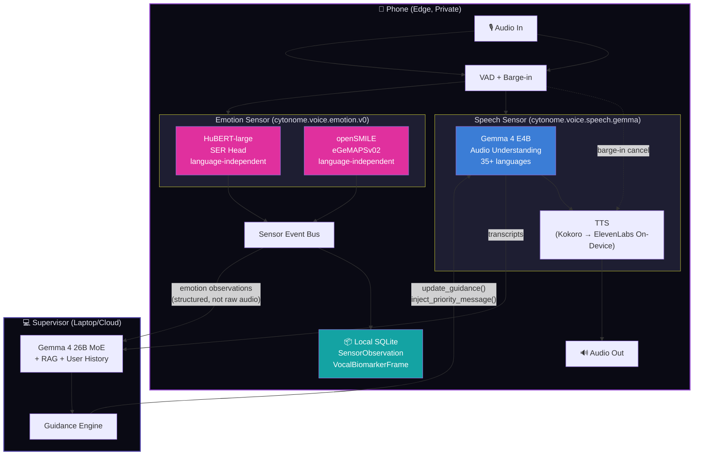

# Voice Model Deep Evaluation — Supervisor Control, Nonverbal Understanding, & Clinical Recording

> **Status**: Draft
> **Date**: 2026-05-17
> **Context**: Evaluation of voice models for Yar/Cytonome across three specific capabilities critical to the neuropsych companion use case

---

## 1. Evaluation Criteria

Three capabilities, evaluated against each candidate model:

| # | Capability | Why It Matters for Yar |
|---|---|---|
| **A** | Supervisor can interrupt and/or inject context to redirect the interviewer | The supervisor needs to steer conversations toward productive territory, inject missed context, redirect when the user is spiraling, or escalate when safety is at risk |
| **B** | Model understands nonverbal communication (prosody, hesitation, breathing, emotional tone) | Neurodivergent users often communicate more through *how* they speak than *what* they say. Flat affect, rapid speech, long pauses, sighing, and vocal quality shifts are clinical signal |
| **C** | Nonverbal cues can be stored/recorded with sufficient comprehensiveness for neuropsych longitudinal tracking | Yar's long-term value is tracking cognitive and emotional patterns over weeks and months, not just transcribing what was said |

---

## 2. Capability A: Supervisor Interrupt & Context Injection

### 2.1 Model Comparison

| Model | User Barge-In | Supervisor Context Injection | Supervisor Mid-Utterance Interrupt | Mechanism | Complexity |
|---|---|---|---|---|---|
| **Moshi 7B** | ✅ NATIVE | ✅ MoshiRAG: async `<ret>` token triggers background retrieval, result injected in-stream | ✅ Dual-stream architecture allows supervisor input while model speaks | Second audio/text stream fed into the model's input alongside user audio | **LOW** |
| **Gemma 4 E4B** (cascade) | ⚠️ Engineered (VAD + TTS cancel) | ✅ Native function calling: `update_guidance(focus, tone, probe_topic, urgency)` | ✅ Cancel TTS mid-output, inject new system prompt, resume | Tool-call mechanism as structured input to next inference step | **MEDIUM** |
| **Qwen3.5-Omni** | ⚠️ Streaming (not full-duplex) | ✅ System prompt update between audio segments | ⚠️ Must wait for segment boundary | System prompt modification between decode segments | **MEDIUM** |
| **LFM2.5-Audio** | ⚠️ Partial (interleaved mode has some overlap) | ⚠️ Text injection between audio decode steps | ⚠️ Insert between decode steps, not truly mid-utterance | Text token insertion in the interleaved generation stream | **MEDIUM-HIGH** |
| **Whisper + LLM + Kokoro** (cascade) | ⚠️ Engineered (VAD + TTS cancel) | ⚠️ Standard prompt injection between turns | ⚠️ Must cancel current TTS, wait for next LLM inference | Three-component pipeline coordination: stop Kokoro → update LLM prompt → re-generate | **HIGH** |

### 2.2 Detailed: How Supervisor Injection Works in Each Architecture

#### Moshi (Best)

```
[Phone: Moshi running in full-duplex mode]
  ├── Stream 1: User audio in → Moshi audio tokens
  ├── Stream 2: Moshi audio tokens → Speaker out
  └── Stream 3: Supervisor → text/audio tokens injected as "other speaker" input

Supervisor sends: "Steer toward sleep patterns, user mentioned insomnia earlier"
  → Encoded as text tokens
  → Fed into Moshi's input stream alongside user audio
  → Moshi naturally integrates the guidance into its next utterance
  → No pipeline break, no visible interruption to user
```

MoshiRAG (April 2026) adds: when Moshi needs external knowledge, it generates a `<ret>` token → background retrieval pipeline fetches context → result encoded and streamed back → Moshi incorporates while continuing to generate filler/acknowledgments. The user hears no gap.

#### Gemma 4 Cascade (Good)

```
[Phone: Gemma 4 E4B + Kokoro TTS]
  1. User speaks → Gemma 4 transcribes + understands
  2. Supervisor sends: function_call: update_guidance(
       focus="sleep patterns",
       tone_shift="gentle",
       probe_topic="insomnia mentioned earlier",
       urgency="normal"
     )
  3. Gemma 4 integrates guidance into next response generation
  4. Kokoro speaks the response

For URGENT supervisor interrupt:
  1. Supervisor sends: function_call: inject_priority_message(
       text="I hear this is really hard...",
       interrupt=true
     )
  2. VAD controller cancels current Kokoro TTS output
  3. Gemma 4 generates safety response
  4. Kokoro speaks the new response
```

Gemma 4's native function calling is a genuine architectural advantage here: the supervisor's instructions are first-class structured inputs, not ad-hoc text injections.

### 2.3 Verdict: Supervisor Control

| Architecture | Supervisor Control Score | Notes |
|---|---|---|
| **Moshi + MoshiRAG** | **9/10** | Native full-duplex = native supervisor channel. MoshiRAG adds knowledge grounding. Only weakness: limited to English, CC-BY license |
| **Gemma 4 cascade** | **7/10** | Clean function-call interface, but requires VAD + cancel engineering. 35+ language support, Apache 2.0 |
| **Qwen3.5-Omni** | **6/10** | Good omni-modal reasoning for supervisor role, but supervisor can only inject between segments, not mid-utterance |
| **LFM2.5-Audio** | **5/10** | Interleaved mode gives some overlap but not a clean supervisor channel |
| **Whisper cascade** | **4/10** | Three-component coordination makes interruption complex and latent |

---

## 3. Capability B: Nonverbal Communication Understanding

### 3.1 What "Nonverbal" Means in Voice AI

| Cue Category | Examples | Clinical Relevance (ND Context) |
|---|---|---|
| **Prosodic** | Pitch variation, intonation contour, speech rate, rhythm | Flat/monotone prosody in autism; rapid/variable rate in ADHD |
| **Disfluency** | Hesitations, filled pauses ("um", "uh"), false starts, repetitions | Cognitive load indicator; higher in ADHD during complex tasks |
| **Temporal** | Response latency, pause duration, silence patterns | Processing speed; executive function; overwhelm indicators |
| **Vocal quality** | Breathiness, hoarseness, vocal fry, tremor | Fatigue, stress, medication effects |
| **Non-speech sounds** | Sighs, laughter, crying, breathing patterns | Emotional state, frustration, relief |
| **Engagement** | Turn length changes, topic coherence, verbal tracking | Attention drift, hyperfocus/disengagement patterns |

### 3.2 Model Comparison: What Each Model Can Detect

| Cue | Moshi 7B | Gemma 4 E4B | Qwen3.5-Omni | LFM2.5-Audio | Whisper | **HuBERT + openSMILE** (parallel sensor) |
|---|---|---|---|---|---|---|
| Pitch variation | ✅ In token stream | ⚠️ Via audio encoder | ✅ Native audio processing | ⚠️ Via codec | ❌ Stripped | ✅ **Quantified** (F0 contour) |
| Intonation contour | ✅ Preserved | ⚠️ Partial | ✅ Can reason about it | ⚠️ Partial | ❌ | ✅ **Quantified** |
| Speech rate | ⚠️ Implicit | ⚠️ Via timing | ✅ Can measure | ⚠️ Implicit | ⚠️ Via timestamps | ✅ **Quantified** (syl/sec) |
| Hesitations | ✅ Non-speech tokens | ⚠️ May transcribe | ⚠️ Can detect | ⚠️ Limited | ⚠️ Transcribes "um" | ✅ **Quantified** (count, duration) |
| Pause duration | ✅ Silence in token stream | ⚠️ Limited | ⚠️ Can reason about | ⚠️ Limited | ⚠️ Via word timestamps | ✅ **Quantified** (ms) |
| Breathing | ⚠️ Partial | ❌ | ⚠️ Possible | ❌ | ❌ | ✅ **Quantified** (respiratory cycle) |
| Sighs | ✅ Non-speech sounds | ❌ | ⚠️ Possible | ❌ | ❌ | ✅ **Detected** |
| Laughter/crying | ✅ In audio tokens | ⚠️ May detect | ✅ Can classify | ⚠️ Limited | ❌ | ✅ **Classified** |
| Vocal quality (jitter/shimmer) | ❌ Not extracted | ❌ | ❌ | ❌ | ❌ | ✅ **Quantified** (Hz, dB) |
| Emotion categories | ⚠️ Implicit | ⚠️ Audio understanding | ✅ Can classify | ⚠️ Limited | ❌ | ✅ **IEMOCAP-calibrated** |
| Valence/arousal | ❌ | ❌ | ⚠️ Can infer | ❌ | ❌ | ✅ **Continuous dimensional** |

### 3.3 Critical Finding

> [!IMPORTANT]
> **No voice model produces quantified, clinically-comparable nonverbal features.** Every model has some awareness of nonverbal cues (Moshi and Qwen3.5-Omni the most), but none produces the structured, numerical features needed for longitudinal tracking.
>
> **The parallel sensor pipeline (HuBERT + openSMILE) is non-negotiable** for the neuropsych use case. It must run alongside whichever base model is chosen.

### 3.4 Verdict: Nonverbal Understanding

| Architecture | Nonverbal Score | Notes |
|---|---|---|
| **Qwen3.5-Omni** (supervisor) | **7/10** | Best native audio reasoning; can interpret nonverbal meaning contextually |
| **Moshi 7B** (edge) | **6/10** | Preserves nonverbal in token stream; can react to sighs, laughter; no quantification |
| **Gemma 4 E4B** | **4/10** | Audio encoder processes but focuses on ASR + understanding; paralinguistic is secondary |
| **LFM2.5-Audio** | **3/10** | Codec preserves some features but sparse documentation on paralinguistic |
| **Whisper** | **2/10** | Strips nonverbal by design (transcription-focused) |
| **HuBERT + openSMILE** (sensor) | **9/10** | Purpose-built for this; quantified, benchmarked, clinically-validated features |

---

## 4. Capability C: Nonverbal Cue Storage for Neuropsych Longitudinal Tracking

### 4.1 Proposed Schema: Digital Vocal Biomarker Record

This is the data model for what Yar records from each voice interaction. Stored locally, never transmitted, used for longitudinal pattern detection.

```python
class VocalBiomarkerFrame(BaseModel):
    """Per-utterance vocal biomarker extraction. ~250ms analysis windows."""
    timestamp: datetime
    utterance_id: str
    session_id: str

    # Prosodic features (openSMILE eGeMAPSv02)
    pitch_mean_hz: float
    pitch_std_hz: float
    pitch_range_hz: float
    pitch_contour: list[float]  # F0 over time, ~25 values for 1 sec
    speech_rate_syl_sec: float
    articulation_rate: float

    # Temporal features
    pre_utterance_pause_ms: float
    within_utterance_pauses: list[PauseEvent]
    response_latency_ms: float  # time from end of Yar's utterance to user's response

    # Disfluency features
    filled_pause_count: int  # "um", "uh", "like"
    false_start_count: int
    repetition_count: int

    # Vocal quality (openSMILE + custom)
    jitter_percent: float       # cycle-to-cycle pitch variation
    shimmer_db: float           # amplitude variation
    hnr_db: float               # harmonic-to-noise ratio
    spectral_centroid_hz: float  # vocal brightness
    formant_frequencies: list[float]  # F1-F4

    # Emotion (HuBERT SER)
    emotion_categorical: str    # anger, sadness, fear, joy, neutral, surprise
    emotion_confidence: float
    valence: float              # -1 to 1 (negative to positive)
    arousal: float              # 0 to 1 (calm to activated)
    dominance: float            # 0 to 1 (submissive to dominant)

    # Non-speech events
    non_speech_events: list[NonSpeechEvent]  # sighs, laughter, breathing

class PauseEvent(BaseModel):
    position_ms: float   # where in the utterance
    duration_ms: float
    pause_type: Literal["silent", "filled", "breath"]

class NonSpeechEvent(BaseModel):
    timestamp_ms: float
    event_type: Literal["sigh", "laugh", "cry", "breath", "cough", "hmm", "other"]
    duration_ms: float
    intensity: float  # 0-1

class SessionVocalProfile(BaseModel):
    """Per-session aggregate vocal biomarkers."""
    session_id: str
    session_date: datetime
    duration_minutes: float

    # Aggregated prosodic
    avg_pitch_hz: float
    pitch_variability: float  # coefficient of variation
    avg_speech_rate: float
    speech_rate_variability: float

    # Emotion arc
    emotion_trajectory: list[tuple[float, str, float]]  # (time, emotion, confidence)
    dominant_emotion: str
    emotion_volatility: float  # how much emotion changes within session

    # Engagement trajectory
    avg_response_latency_ms: float
    response_latency_trend: Literal["decreasing", "stable", "increasing"]  # engagement signal
    avg_turn_duration_sec: float
    turn_duration_trend: Literal["decreasing", "stable", "increasing"]

    # Cognitive load indicators
    total_filled_pauses: int
    filled_pause_rate: float  # per minute
    cognitive_load_estimate: Literal["low", "moderate", "high"]  # derived

    # ND-specific derived metrics
    adhd_markers: ADHDVocalMarkers | None
    asd_markers: ASDVocalMarkers | None

class ADHDVocalMarkers(BaseModel):
    """ADHD-relevant vocal biomarkers derived from session data."""
    speech_rate_variability_zscore: float  # compared to user's baseline
    topic_coherence_score: float  # semantic similarity between consecutive turns
    impulsive_response_count: int  # responses < 200ms after Yar finishes
    tangential_shift_count: int  # abrupt topic changes mid-thought
    hyperfocus_episodes: int  # sustained high engagement on single topic > 5 min
    energy_trajectory: Literal["ascending", "plateau", "descending", "variable"]

class ASDVocalMarkers(BaseModel):
    """ASD-relevant vocal biomarkers derived from session data."""
    prosodic_range_score: float  # pitch range normalized to baseline
    emotional_expression_range: float  # variety of detected emotions
    turn_taking_regularity: float  # how consistent is the user's response timing
    literal_interpretation_flags: int  # when user seems to interpret figuratively literally
    social_script_adherence: float  # formality/script-following in conversation
    sensory_overload_indicators: int  # speech degradation + disengagement spikes
```

### 4.2 Feature Source Mapping

| Feature Category | Primary Source | Secondary Source | Latency |
|---|---|---|---|
| Prosodic (pitch, rate, rhythm) | openSMILE eGeMAPSv02 | Model-derived (Moshi/Qwen) | Real-time (~10ms) |
| Vocal quality (jitter, shimmer, HNR) | openSMILE | Praat (offline batch) | Real-time / batch |
| Emotion categorical | HuBERT-large fine-tuned SER | Model-derived (Qwen3.5-Omni) | ~50ms |
| Valence/arousal/dominance | Dimensional SER model | HuBERT-derived | ~50ms |
| Non-speech events | VAD + non-speech classifier | Moshi's token stream (if used) | Real-time |
| Disfluency | ASR + post-processing | openSMILE pause analysis | ~200ms |
| ADHD/ASD markers | **Derived** from above features | Longitudinal baseline comparison | Post-session batch |

### 4.3 Privacy Architecture for Vocal Biomarkers

> [!CAUTION]
> Vocal biomarkers are biometric data. They NEVER leave the device.

| Data | Storage | Crosses Wire? | Retention |
|---|---|---|---|
| Raw audio | Local only, ephemeral | ❌ NEVER | Deleted after feature extraction |
| VocalBiomarkerFrame | Local SQLite | ❌ NEVER | User-controlled retention |
| SessionVocalProfile | Local SQLite | ❌ NEVER | User-controlled retention |
| ADHD/ASD markers | Local SQLite | ❌ NEVER | User-controlled retention |
| Aggregated trends (no raw) | Local + optionally Anytype | ⚠️ Only if user explicitly exports | User-controlled |

### 4.4 What This Enables for Yar Users

1. **"How am I doing over time?"** — visualize your emotional arc, cognitive load, and engagement patterns across weeks
2. **Medication tracking** — objective before/after comparison of speech features (speech rate variability, response latency, cognitive load estimates)
3. **Burnout early warning** — detect vocal quality degradation (increased jitter/shimmer, decreasing HNR) before conscious awareness
4. **Social interaction preparation** — review your vocal patterns before important conversations, understand how stress manifests in your voice
5. **Therapist collaboration** — optionally share summarized (non-raw) patterns with your therapist for more informed sessions

---

## 5. Finalized Architecture: Two Independent Sensors

> [!IMPORTANT]
> **Design Decision (2026-05-17)**: The voice layer is split into two independent, pluggable sensors conforming to Cytonome's Universal Sensor Architecture (see `docs/architecture/sensor_architecture.md`):
>
> 1. **Speech Sensor** — Gemma 4 E4B cascade (audio understanding + response generation + TTS)
> 2. **Emotion Sensor** — HuBERT + openSMILE (paralinguistic analysis + emotion recognition)
>
> These sensors run in parallel, can be connected/disconnected independently, and produce separate observation streams. This is the first instance of Cytonome's pluggable sensor framework.

### 5.1 Architecture Diagram



### 5.2 Multi-Language Support

> [!IMPORTANT]
> **Multi-language support is a day-one requirement, not a future feature.** Cytonome targets global users, including communities where neurodivergent individuals have even fewer resources than in English-speaking countries.

| Component | Language Support | Mechanism |
|---|---|---|
| **Speech Sensor (Gemma 4)** | 35+ languages | Native multilingual audio understanding |
| **Emotion Sensor (HuBERT + openSMILE)** | **All languages** | Paralinguistic features are acoustic, not linguistic |
| **TTS (Kokoro)** | ~20 languages | Expanding; ElevenLabs on-device covers 70+ |
| **TTS (ElevenLabs on-device)** | 70+ languages | Evaluation target for v1.1+ |
| **Text emotion (future)** | Multilingual | XLM-R or mBERT for cross-lingual sentiment |

### 5.3 Phase 1 (Gemma Hackathon): Both Sensors Live

- **Speech Sensor**: Gemma 4 E4B via LiteRT-LM (35+ languages)
- **Emotion Sensor**: HuBERT-large SER + openSMILE eGeMAPSv02 (language-independent)
- TTS: Kokoro 82M (evaluate ElevenLabs on-device when available)
- Supervisor: Gemma 4 26B MoE via Ollama
- Storage: `SensorObservation` + `VocalBiomarkerFrame` in local SQLite
- App: Sensor Settings page with connect/disconnect toggles

### 5.4 Phase 2 (6-12 months): Additional Sensors + Longitudinal

- Text emotion sensor (XLM-R on transcripts, multilingual)
- `SessionVocalProfile` aggregation and longitudinal trend tracking
- ADHD/ASD vocal marker derivation (baseline establishment period)
- Evaluate ElevenLabs on-device TTS (apply to accelerator)
- Evaluate facial emotion sensor (DeiT/MobileFaceNet, camera opt-in)

### 5.5 Phase 3 (12-18 months): Multimodal Fusion + Clinical

- **Intermediate fusion layer** in Supervisor/Guardian agent (MindMed AI architecture):
  Voice (HuBERT + openSMILE) + Facial (DeiT) + Text (BERT) → Transformer cross-attention
- Fusion achieves 91.89% accuracy (per MindMed benchmarks)
- HIPAA-compliant deployment via ElevenLabs VPC for clinical research

---

## 6. Model Selection Decision Matrix (Finalized)

| Priority | Edge Model | Emotion Sensor | TTS | Supervisor |
|---|---|---|---|---|
| **Fastest to v1** | Gemma 4 E4B | HuBERT + openSMILE | Kokoro 82M | Gemma 4 26B MoE |
| **Best TTS quality** | Gemma 4 E4B | HuBERT + openSMILE | ElevenLabs on-device | Gemma 4 26B MoE |
| **Best supervisor control** | Moshi 7B | HuBERT + openSMILE | Moshi native | Qwen3.5-Omni |
| **Best multimodal emotion** | Any | HuBERT + openSMILE + DeiT + BERT | Any | Fusion layer |
| **Full open-source** | Gemma 4 E4B + Kokoro | HuBERT + openSMILE | Kokoro 82M | Gemma 4 26B MoE |

---

## 7. Related Documents

| Document | Location | Content |
|---|---|---|
| Universal Sensor Architecture | `docs/architecture/sensor_architecture.md` | Sensor protocol, schema, registry, plugin system |
| ElevenLabs Evaluation | `docs/research/05_elevenlabs_evaluation.md` | Local/cloud capability assessment, HIPAA, pricing |
| MindMed AI Reference | [rs-8613173](https://www.researchsquare.com/article/rs-8613173/v1) | Multimodal emotion recognition (HuBERT + DeiT + BERT fusion) |


