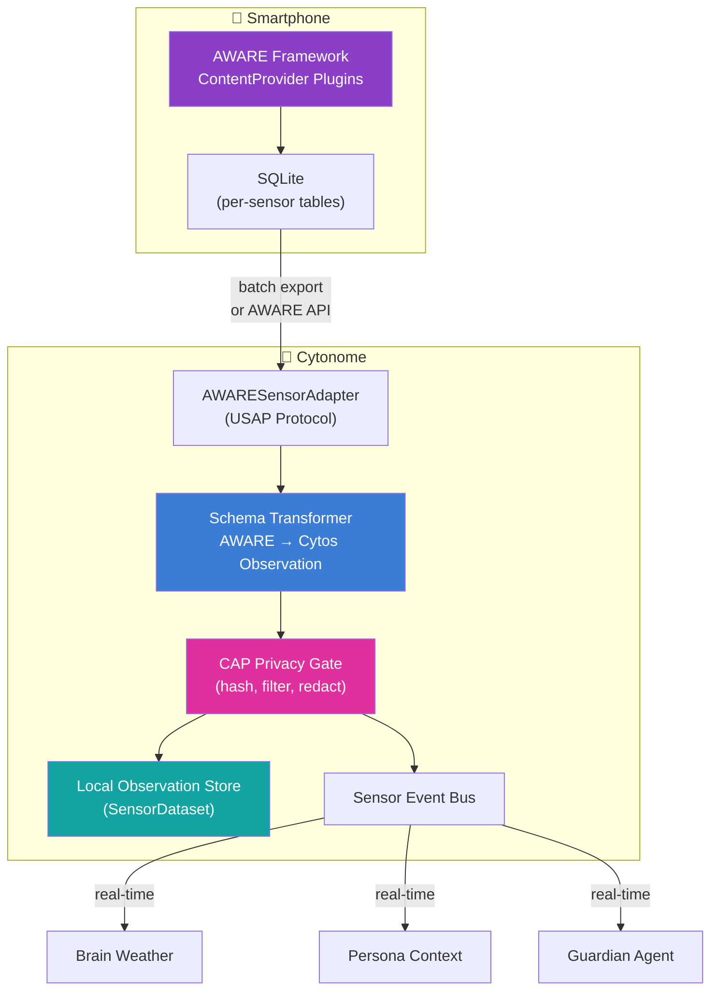
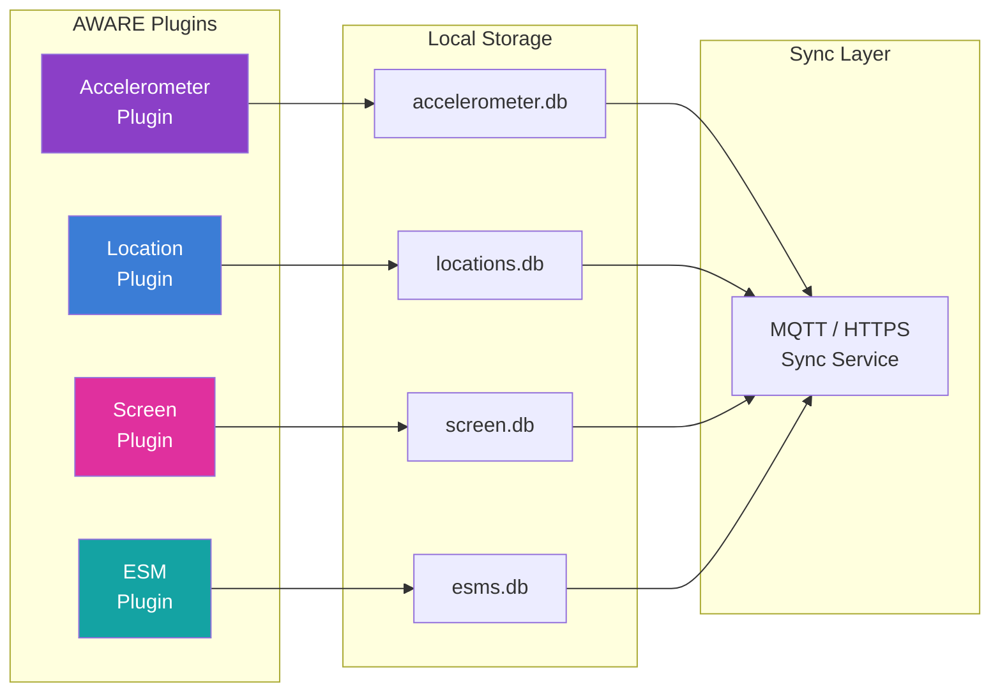
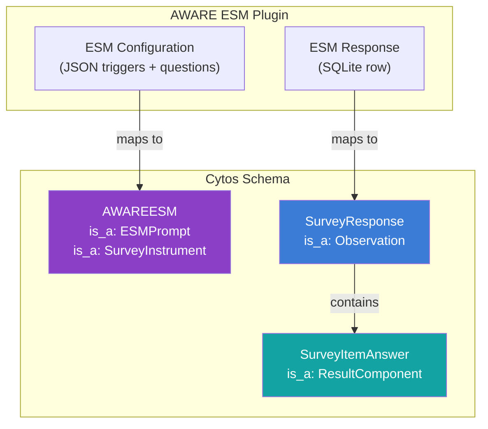
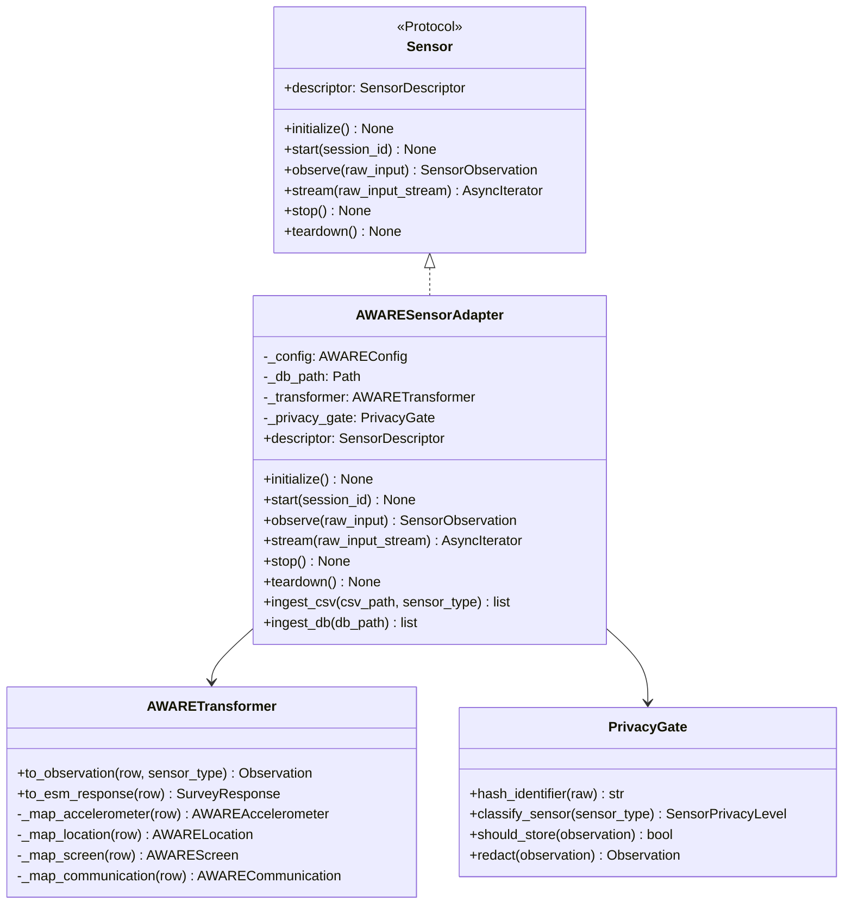

# Implementing AWARE Sensor Data Gathering

> **Status**: v0.1 (Implementation Guide)
> **Date**: 2026-05-30
> **Schema Version**: Cytos Sensor Core v0.1.0
> **Scope**: AWARE framework integration into Cytonome's Universal Sensor Architecture

---

## 1. AWARE Framework Overview

### 1.1 What AWARE Is

AWARE (Advanced Wearable and Ambient Recognition Engine) is an open-source Android and iOS framework for smartphone-based passive sensing. It transforms an individual's phone into a continuous, context-aware research instrument, collecting sensor data through a plugin architecture without requiring active user participation.

For the Cytognosis platform, AWARE represents the richest single source of digital phenotyping data. A single smartphone running AWARE captures motion patterns, environmental context, digital behavior, social interaction metadata, and self-report responses, all from a device the individual already carries.

### 1.2 Why AWARE Matters for Digital Phenotyping

Digital phenotyping captures behavioral signatures from digital device usage to infer health states. For neurodivergent individuals, these behavioral signatures reveal patterns that traditional clinical assessments miss:

| Signal | What It Reveals | Clinical Relevance |
|--------|----------------|-------------------|
| Screen on/off patterns | Sleep-wake regularity | Circadian rhythm disruption in ADHD |
| App switching frequency | Attentional fragmentation | Executive dysfunction markers |
| Location entropy | Routine regularity vs. spontaneity | Behavioral consistency in autism |
| Communication patterns | Social engagement levels | Social withdrawal detection |
| Keystroke dynamics | Motor patterns, typing bursts | Hyperfocus/distraction transitions |
| Activity recognition | Sedentary vs. active periods | Physical activity correlations with mood |

### 1.3 AWARE vs. AWARE-Light

| Dimension | AWARE (Full) | AWARE-Light |
|-----------|-------------|-------------|
| Platform | Android + iOS | Android + iOS |
| Architecture | ContentProvider per sensor | Simplified sensor manager |
| Plugin system | Plugin-based, extensible | Core sensors only |
| Data storage | SQLite per sensor | Unified SQLite |
| Server sync | MQTT/HTTPS to AWARE Dashboard | REST API to custom server |
| Battery impact | Higher (all plugins active) | Lower (selective sensors) |
| Cytonome fit | Full feature coverage | Better for mobile deployment |

Cytonome's adapter supports both variants. The Cytos schema maps identically to either; the adapter normalizes differences at the ingestion layer.

### 1.4 How AWARE Fits into Cytonome's Sensor Architecture

AWARE operates as a **sensor plugin** within Cytonome's [Universal Sensor Architecture](file:///home/mohammadi/repos/cytognosis/docs/cytonome/yar/sensors/sensor-architecture.md). Each AWARE sensor maps to a `SensorDescriptor` and produces `Observation` instances conforming to the [Cytos sensor core schema](file:///home/mohammadi/repos/cytognosis/cytos/schemas/domains/sensor/core/core.yaml).



### 1.5 Privacy Considerations

Cytonome enforces privacy at every layer of the AWARE integration:

1. **On-device processing**: All sensor data processing occurs locally. Raw data never leaves the device.
2. **Hashed identifiers**: Phone numbers, contact names, WiFi SSIDs, and Bluetooth device addresses are irreversibly hashed before persistence. The Cytos schema enforces this through `contact_hash`, `ssid_hash`, `bssid_hash`, and `device_address_hash` fields.
3. **No raw text**: Notification content is hashed (`text_hash`). Keyboard events capture counts only (`key_count`, `backspace_count`), never raw keystrokes.
4. **Privacy classification**: Every sensor carries a `SensorPrivacyLevel` (biometric, health, behavioral, contextual) that determines storage, retention, and export policies.
5. **CAP-enforced gates**: The Consent and Authorization Protocol gates all data access. Users control which sensors are active, which observations are stored, and which can be exported.

---

## 2. Data Collection Architecture

### 2.1 AWARE's Plugin-Based ContentProvider Model

AWARE exposes each sensor as an Android ContentProvider (or equivalent iOS service). Each plugin:

1. Registers with the AWARE framework via a manifest declaration
2. Creates its own SQLite table with a standardized schema prefix
3. Collects data according to configurable sampling parameters
4. Broadcasts sensor events via Android intents or iOS notifications
5. Syncs data to a remote server when connectivity allows



### 2.2 SQLite Schema Pattern

Every AWARE sensor table follows a canonical column pattern:

| Column | Type | Description |
|--------|------|-------------|
| `_id` | INTEGER PRIMARY KEY | Auto-increment row ID |
| `timestamp` | REAL | Unix epoch milliseconds (collection time) |
| `device_id` | TEXT | AWARE-assigned device UUID |
| `label` | TEXT | User-set free-text label for calibration |
| *sensor-specific* | REAL/TEXT/INTEGER | Varies per sensor |

This maps directly to the Cytos [AWAREObservationMixin](file:///home/mohammadi/repos/cytognosis/cytos/schemas/domains/sensor/profiles/profile_aware.yaml#L41-L47):

```yaml
AWAREObservationMixin:
  mixin: true
  description: Mixin adding the canonical AWARE columns.
  attributes:
    aware_label:
      range: string
      description: User-set free-text label for calibration / traceability.
```

The `timestamp` maps to `Observation.phenomenon_time`, and `device_id` maps to `AWAREDevice.aware_device_uuid`.

### 2.3 Sampling Rate Configuration

Optimal sampling rates balance data richness against battery consumption:

| Sensor Category | Default Rate | Low Power Rate | High Fidelity Rate |
|----------------|-------------|----------------|-------------------|
| IMU (accel, gyro, mag) | 5 Hz | 1 Hz | 50 Hz |
| Environmental (light, baro) | 0.1 Hz (10s) | 0.017 Hz (60s) | 1 Hz |
| Location | 0.003 Hz (5 min) | 0.0006 Hz (30 min) | 0.017 Hz (60s) |
| Screen/App events | Event-driven | Event-driven | Event-driven |
| Communication | Event-driven | Event-driven | Event-driven |
| Activity recognition | 0.017 Hz (60s) | 0.003 Hz (5 min) | 0.1 Hz (10s) |
| Battery | 0.017 Hz (60s) | 0.003 Hz (5 min) | 0.1 Hz (10s) |

### 2.4 Battery Optimization Strategies

1. **Adaptive sampling**: Reduce IMU sampling when activity recognition reports "still" for >5 minutes
2. **Batched writes**: Buffer observations in memory, flush to SQLite every 30-60 seconds
3. **Duty cycling**: Disable high-power sensors (GPS, WiFi scan) during sleep hours
4. **Significant-motion trigger**: Wake IMU from low-power mode only on significant motion events
5. **Background processing limits**: Respect Android Doze mode and iOS Background App Refresh

### 2.5 Data Sync Patterns

```
AWARE SQLite (on-device)
    │
    ├─ Batch export → CSV files → AWARESensorAdapter.ingest_csv()
    │
    ├─ AWARE API → Real-time stream → AWARESensorAdapter.stream()
    │
    └─ Manual export → SQLite database file → AWARESensorAdapter.ingest_db()
```

---

## 3. Sensor-by-Sensor Implementation Guide

### 3.1 Motion and Activity Sensors

#### 3.1.1 AWAREAccelerometer

**What it measures**: Three-axis linear acceleration (including gravity) in m/s². Captures movement intensity, posture changes, and device orientation.

**Relevance for neurodivergent individuals**: Accelerometer data reveals fidgeting patterns (a common ADHD trait), sleep quality through nocturnal movement, and restlessness during sustained tasks. Combined with activity recognition, it differentiates productive movement from agitated movement.

**AWARE SQLite columns**:

| Column | Type | Description |
|--------|------|-------------|
| `double_values_0` | REAL | X-axis acceleration (m/s²) |
| `double_values_1` | REAL | Y-axis acceleration (m/s²) |
| `double_values_2` | REAL | Z-axis acceleration (m/s²) |
| `accuracy` | INTEGER | Android sensor accuracy constant |

**Cytos LinkML mapping**: [AWAREAccelerometer](file:///home/mohammadi/repos/cytognosis/cytos/schemas/domains/sensor/profiles/profile_aware.yaml#L49-L62) → `is_a: Observation`

**SOSA alignment**:
- `Sensor`: Smartphone accelerometer hardware
- `ObservableProperty`: Linear acceleration (3-axis)
- `Result`: Compound result with x, y, z components (UnitValue in m/s²)

**Recommended sampling rate**: 5 Hz (default), 50 Hz for tremor analysis

**Privacy classification**: `contextual`

**Example observation (YAML)**:

```yaml
- id: sensor:obs/aware-accel-20260530T143022Z
  observation_local_id: aware-accel-20260530T143022Z
  made_by_sensor: sensor:sensor/pixel8-accel
  subject: sensor:subject/participant-001
  observed_property:
    id: sensor:prop/linear-acceleration
    property_codes:
      - loinc:80493-0
    preferred_unit: m/s2
  phenomenon_time:
    date_time: "2026-05-30T14:30:22.450Z"
  result:
    result_type: compound
    components:
      - code: sensor:channel/x-axis
        value: { value: 0.23, unit: m/s2 }
      - code: sensor:channel/y-axis
        value: { value: 9.78, unit: m/s2 }
      - code: sensor:channel/z-axis
        value: { value: -0.12, unit: m/s2 }
  aware_label: "office-desk"
```

#### 3.1.2 AWAREGyroscope

**What it measures**: Three-axis angular velocity in rad/s. Captures rotational movement, device tilting, and gesture dynamics.

**Relevance for neurodivergent individuals**: Gyroscope data combined with accelerometer captures phone fidgeting patterns, hand tremor characteristics, and device manipulation habits that correlate with stress and attention states.

**AWARE SQLite columns**:

| Column | Type | Description |
|--------|------|-------------|
| `double_values_0` | REAL | X-axis angular velocity (rad/s) |
| `double_values_1` | REAL | Y-axis angular velocity (rad/s) |
| `double_values_2` | REAL | Z-axis angular velocity (rad/s) |
| `accuracy` | INTEGER | Android sensor accuracy constant |

**Cytos LinkML mapping**: [AWAREGyroscope](file:///home/mohammadi/repos/cytognosis/cytos/schemas/domains/sensor/profiles/profile_aware.yaml#L64-L76) → `is_a: Observation`

**SOSA alignment**:
- `Sensor`: Smartphone gyroscope hardware
- `ObservableProperty`: Angular velocity (3-axis)
- `Result`: Compound result with x, y, z components (UnitValue in rad/s)

**Recommended sampling rate**: 5 Hz (default), 50 Hz for gesture analysis

**Privacy classification**: `contextual`

**Example observation (YAML)**:

```yaml
- id: sensor:obs/aware-gyro-20260530T143022Z
  observation_local_id: aware-gyro-20260530T143022Z
  made_by_sensor: sensor:sensor/pixel8-gyro
  observed_property:
    id: sensor:prop/angular-velocity
    preferred_unit: rad/s
  phenomenon_time:
    date_time: "2026-05-30T14:30:22.450Z"
  result:
    result_type: compound
    components:
      - code: sensor:channel/x-axis
        value: { value: 0.003, unit: rad/s }
      - code: sensor:channel/y-axis
        value: { value: -0.001, unit: rad/s }
      - code: sensor:channel/z-axis
        value: { value: 0.015, unit: rad/s }
  aware_label: "office-desk"
```

#### 3.1.3 AWAREMagnetometer

**What it measures**: Three-axis geomagnetic field strength in µT. Captures compass heading, proximity to electromagnetic sources, and indoor positioning context.

**Relevance for neurodivergent individuals**: Magnetometer data contributes to indoor location estimation and environmental context without GPS. Combined with other IMU sensors, it enables dead-reckoning for indoor movement pattern analysis.

**AWARE SQLite columns**:

| Column | Type | Description |
|--------|------|-------------|
| `double_values_0` | REAL | X-axis magnetic field (µT) |
| `double_values_1` | REAL | Y-axis magnetic field (µT) |
| `double_values_2` | REAL | Z-axis magnetic field (µT) |
| `accuracy` | INTEGER | Android sensor accuracy constant |

**Cytos LinkML mapping**: [AWAREMagnetometer](file:///home/mohammadi/repos/cytognosis/cytos/schemas/domains/sensor/profiles/profile_aware.yaml#L78-L90) → `is_a: Observation`

**SOSA alignment**:
- `Sensor`: Smartphone magnetometer hardware
- `ObservableProperty`: Geomagnetic field (3-axis)
- `Result`: Compound result with x, y, z components (UnitValue in µT)

**Recommended sampling rate**: 1 Hz

**Privacy classification**: `contextual`

#### 3.1.4 AWAREActivityRecognition

**What it measures**: Inferred physical activity state from Google Activity Recognition API (or Apple Core Motion). Reports activity type and confidence.

**Relevance for neurodivergent individuals**: Activity recognition is a cornerstone of behavioral phenotyping. Sedentary bouts correlate with hyperfocus episodes. Transitions between activities indicate executive function capacity. Walking patterns reveal regularity of daily routines.

**AWARE SQLite columns**:

| Column | Type | Description |
|--------|------|-------------|
| `activity_name` | TEXT | Recognized activity (still, walking, running, biking, in_vehicle) |
| `activity_type` | INTEGER | Android DetectedActivity type constant |
| `confidence` | INTEGER | Recognition confidence (0-100) |

**Cytos LinkML mapping**: [AWAREActivityRecognition](file:///home/mohammadi/repos/cytognosis/cytos/schemas/domains/sensor/profiles/profile_aware.yaml#L191-L194) → `is_a: ActivityRecognitionEvent`

The parent [ActivityRecognitionEvent](file:///home/mohammadi/repos/cytognosis/cytos/schemas/domains/sensor/core/context.yaml#L107-L114) defines:

```yaml
ActivityRecognitionEvent:
  is_a: Observation
  attributes:
    activity:
      range: RecognizedActivityEnum  # still, walking, running, biking, in_vehicle, on_foot, tilting, unknown
    confidence:
      range: float
```

**SOSA alignment**:
- `Sensor`: Google Activity Recognition API (software sensor)
- `ObservableProperty`: Physical activity type
- `Result`: Coded result (RecognizedActivityEnum) with confidence

**Recommended sampling rate**: 0.017 Hz (every 60 seconds)

**Privacy classification**: `behavioral`

**Example observation (YAML)**:

```yaml
- id: sensor:obs/aware-activity-20260530T150000Z
  observation_local_id: aware-activity-20260530T150000Z
  made_by_sensor: sensor:sensor/google-activity-recognition
  subject: sensor:subject/participant-001
  phenomenon_time:
    date_time: "2026-05-30T15:00:00Z"
  activity: still
  confidence: 0.92
  aware_label: "daily-tracking"
```

---

### 3.2 Environmental Sensors

#### 3.2.1 AWARELight

**What it measures**: Ambient light intensity in lux. Captures environmental brightness.

**Relevance for neurodivergent individuals**: Light exposure drives circadian rhythm regulation. Tracking ambient light helps assess whether individuals receive adequate bright light during daytime (critical for ADHD-related sleep phase delay) and whether evening screen use exposes them to disruptive blue light.

**AWARE SQLite columns**:

| Column | Type | Description |
|--------|------|-------------|
| `double_light_lux` | REAL | Ambient light intensity (lux) |

**Cytos LinkML mapping**: [AWARELight](file:///home/mohammadi/repos/cytognosis/cytos/schemas/domains/sensor/profiles/profile_aware.yaml#L107-L113) → `is_a: Observation`

**SOSA alignment**:
- `Sensor`: Smartphone ambient light sensor
- `ObservableProperty`: Illuminance
- `Result`: Scalar UnitValue in lux

**Recommended sampling rate**: 0.1 Hz (every 10 seconds)

**Privacy classification**: `contextual`

**Example observation (YAML)**:

```yaml
- id: sensor:obs/aware-light-20260530T143022Z
  result:
    result_type: scalar
    value: { value: 342.5, unit: lx }
  lux: 342.5
  aware_label: "office"
```

#### 3.2.2 AWAREBarometer

**What it measures**: Atmospheric pressure in hPa/mbar. Captures altitude changes and weather transitions.

**Relevance for neurodivergent individuals**: Barometric pressure changes correlate with migraine onset and mood shifts in some individuals. Combined with altitude detection, it reveals floor changes (elevator vs. stairs) for activity characterization.

**AWARE SQLite columns**:

| Column | Type | Description |
|--------|------|-------------|
| `double_values_0` | REAL | Atmospheric pressure (hPa) |

**Cytos LinkML mapping**: [AWAREBarometer](file:///home/mohammadi/repos/cytognosis/cytos/schemas/domains/sensor/profiles/profile_aware.yaml#L120-L123) → `is_a: Observation`

**Recommended sampling rate**: 0.1 Hz (every 10 seconds)

**Privacy classification**: `contextual`

#### 3.2.3 AWARETemperature

**What it measures**: Ambient temperature in °C (from the device's temperature sensor, if available).

**Relevance for neurodivergent individuals**: Environmental temperature affects cognitive performance and sensory processing. Autistic individuals often report heightened temperature sensitivity. Tracking ambient temperature alongside productivity and mood data enables personalized environmental optimization.

**Cytos LinkML mapping**: [AWARETemperature](file:///home/mohammadi/repos/cytognosis/cytos/schemas/domains/sensor/profiles/profile_aware.yaml#L125-L128) → `is_a: Observation`

**Recommended sampling rate**: 0.017 Hz (every 60 seconds)

**Privacy classification**: `contextual`

#### 3.2.4 AWAREProximity

**What it measures**: Binary or distance-based proximity sensor reading. Indicates whether an object (typically the individual's face) is near the phone.

**Relevance for neurodivergent individuals**: Proximity sensor events reveal phone-to-ear (call) duration and face-down placement. Face-down phone placement correlates with intentional focus periods, while prolonged phone-to-ear events indicate call engagement.

**Cytos LinkML mapping**: [AWAREProximity](file:///home/mohammadi/repos/cytognosis/cytos/schemas/domains/sensor/profiles/profile_aware.yaml#L115-L118) → `is_a: Observation`

**Recommended sampling rate**: Event-driven (sensor triggers on proximity change)

**Privacy classification**: `contextual`

---

### 3.3 Location

#### 3.3.1 AWARELocation

**What it measures**: Geographic coordinates (latitude, longitude, altitude), speed, bearing, and positioning accuracy from GPS, network, or fused providers.

**Relevance for neurodivergent individuals**: Location data is the foundation for routine regularity analysis. Location entropy (Shannon entropy of visited locations) serves as a proxy for behavioral predictability, a key metric for ADHD management. Dwell time at specific locations (home, work, gym) characterizes daily structure adherence.

**AWARE SQLite columns**:

| Column | Type | Description |
|--------|------|-------------|
| `double_latitude` | REAL | Latitude (degrees) |
| `double_longitude` | REAL | Longitude (degrees) |
| `double_altitude` | REAL | Altitude (meters) |
| `double_bearing` | REAL | Bearing (degrees from north) |
| `double_speed` | REAL | Speed (m/s) |
| `accuracy` | REAL | Horizontal accuracy (meters) |
| `provider` | TEXT | GPS, network, fused |

**Cytos LinkML mapping**: [AWARELocation](file:///home/mohammadi/repos/cytognosis/cytos/schemas/domains/sensor/profiles/profile_aware.yaml#L130-L133) → `is_a: LocationFix`

The parent [LocationFix](file:///home/mohammadi/repos/cytognosis/cytos/schemas/domains/sensor/core/context.yaml#L28-L52) provides the full location schema:

```yaml
LocationFix:
  is_a: Observation
  attributes:
    latitude: { range: float }
    longitude: { range: float }
    altitude_m: { range: float }
    bearing_degrees: { range: float }
    speed_mps: { range: float }
    horizontal_accuracy_m: { range: float }
    vertical_accuracy_m: { range: float }
    provider: { range: LocationProviderEnum }   # gps, network, passive, fused, manual
    positioning_system: { range: PositioningSystemEnum }
    satellite_count_in_view: { range: integer }
    satellite_count_in_fix: { range: integer }
```

**SOSA alignment**:
- `Sensor`: Smartphone GNSS receiver or network location service
- `ObservableProperty`: Geospatial position
- `Result`: Compound result with lat, lon, alt, speed, bearing

**Recommended sampling rate**: 0.003 Hz (every 5 minutes), with significant-location-change triggers

**Privacy classification**: `behavioral` (location is sensitive; on-device processing mandatory)

**Example observation (YAML)**:

```yaml
- id: sensor:obs/aware-loc-20260530T150000Z
  observation_local_id: aware-loc-20260530T150000Z
  made_by_sensor: sensor:sensor/pixel8-fused-location
  subject: sensor:subject/participant-001
  phenomenon_time:
    date_time: "2026-05-30T15:00:00Z"
  latitude: 37.6547
  longitude: -122.4093
  altitude_m: 12.3
  speed_mps: 0.0
  horizontal_accuracy_m: 8.5
  provider: fused
  aware_label: "daily-tracking"
```

---

### 3.4 Digital Behavior Sensors

#### 3.4.1 AWAREScreen

**What it measures**: Screen state transitions: off, on, locked, unlocked. Captures the timestamps of each transition.

**Relevance for neurodivergent individuals**: Screen events are the single most informative AWARE sensor for ADHD behavioral phenotyping. Screen on/off patterns reveal:
- **Sleep onset and wake time** (last screen-off to first screen-on)
- **Phone checking frequency** (unlock count per hour, a proxy for attentional fragmentation)
- **Sustained focus periods** (intervals between screen interactions)
- **Nighttime phone use** (screen events between midnight and 6 AM correlate with sleep disruption)

**AWARE SQLite columns**:

| Column | Type | Description |
|--------|------|-------------|
| `screen_status` | INTEGER | 0=off, 1=on, 2=locked, 3=unlocked |

**Cytos LinkML mapping**: [AWAREScreen](file:///home/mohammadi/repos/cytognosis/cytos/schemas/domains/sensor/profiles/profile_aware.yaml#L166-L169) → `is_a: ScreenEvent`

The parent [ScreenEvent](file:///home/mohammadi/repos/cytognosis/cytos/schemas/domains/sensor/core/context.yaml#L55-L60):

```yaml
ScreenEvent:
  is_a: Observation
  attributes:
    screen_state:
      range: ScreenStateEnum  # off, on, locked, unlocked
```

**SOSA alignment**:
- `Sensor`: Android WindowManager / iOS UIScreen (software sensor)
- `ObservableProperty`: Screen state
- `Result`: Coded result (ScreenStateEnum)

**Recommended sampling rate**: Event-driven (triggered on state change)

**Privacy classification**: `behavioral`

**Example observation (YAML)**:

```yaml
- id: sensor:obs/aware-screen-20260530T143022Z
  screen_state: unlocked
  phenomenon_time:
    date_time: "2026-05-30T14:30:22Z"
  aware_label: "daily-tracking"
```

#### 3.4.2 AWAREApplications

**What it measures**: Foreground application transitions. Captures which app moved to the foreground, its package name, and whether it is a system app.

**Relevance for neurodivergent individuals**: Application foreground events are critical for characterizing attention patterns:
- **App switching rate** (transitions per hour) is a validated marker of attentional instability
- **App category analysis** (social, productivity, entertainment) reveals behavioral patterns
- **Dwell time per app** indicates sustained engagement or rapid cycling
- **Time-of-day app usage** surfaces circadian productivity patterns

**AWARE SQLite columns**:

| Column | Type | Description |
|--------|------|-------------|
| `package_name` | TEXT | Android package name (e.g., `com.twitter.android`) |
| `application_name` | TEXT | Human-readable app name |
| `is_system_app` | INTEGER | 1 if system app, 0 otherwise |

**Cytos LinkML mapping**: [AWAREApplications](file:///home/mohammadi/repos/cytognosis/cytos/schemas/domains/sensor/profiles/profile_aware.yaml#L176-L179) → `is_a: AppForegroundEvent`

The parent [AppForegroundEvent](file:///home/mohammadi/repos/cytognosis/cytos/schemas/domains/sensor/core/context.yaml#L62-L71):

```yaml
AppForegroundEvent:
  is_a: Observation
  attributes:
    package_name: { range: string }
    application_name: { range: string }
    is_system_app: { range: boolean }
```

**Recommended sampling rate**: Event-driven

**Privacy classification**: `behavioral`

**Example observation (YAML)**:

```yaml
- id: sensor:obs/aware-app-20260530T143022Z
  package_name: "com.spotify.music"
  application_name: "Spotify"
  is_system_app: false
  phenomenon_time:
    date_time: "2026-05-30T14:30:22Z"
```

#### 3.4.3 AWARENotifications

**What it measures**: Notification events including source app, whether the notification had sound or vibration, and a hash of the notification text (never raw text).

**Relevance for neurodivergent individuals**: Notification volume and response patterns reveal:
- **Interruption frequency** (notifications per hour as cognitive load indicator)
- **Response latency** (time between notification and app open)
- **Notification-triggered context switches** (linking notifications to app changes)
- **Notification management** (dismissed vs. acted upon)

**AWARE SQLite columns**:

| Column | Type | Description |
|--------|------|-------------|
| `package_name` | TEXT | Source app package name |
| `application_name` | TEXT | Source app display name |
| `text` | TEXT | **Hashed** notification text (never raw) |
| `sound` | INTEGER | Whether notification had sound |
| `vibrate` | INTEGER | Whether notification vibrated |
| `flags` | TEXT | Notification flags |

**Cytos LinkML mapping**: [AWARENotifications](file:///home/mohammadi/repos/cytognosis/cytos/schemas/domains/sensor/profiles/profile_aware.yaml#L181-L184) → `is_a: NotificationEvent`

The parent [NotificationEvent](file:///home/mohammadi/repos/cytognosis/cytos/schemas/domains/sensor/core/context.yaml#L73-L89) enforces privacy:

```yaml
NotificationEvent:
  is_a: Observation
  attributes:
    package_name: { range: string }
    application_name: { range: string }
    text_hash:
      range: string
      description: Hash of the notification text; raw text is not stored.
    sound: { range: boolean }
    vibrate: { range: boolean }
    flags: { range: string }
```

**Recommended sampling rate**: Event-driven

**Privacy classification**: `behavioral`

#### 3.4.4 AWAREKeyboard

**What it measures**: Keystroke counts per app, including backspace count. Captures typing dynamics without recording individual keystrokes.

**Relevance for neurodivergent individuals**: Keyboard metrics reveal:
- **Typing burst patterns** (rapid typing followed by pauses, characteristic of hyperfocus)
- **Backspace ratio** (backspace_count / key_count as a proxy for revision frequency/uncertainty)
- **Per-app typing volume** (messaging vs. productivity apps)
- **Typing speed variability** (correlates with fatigue and attention)

**AWARE SQLite columns**:

| Column | Type | Description |
|--------|------|-------------|
| `key_count` | INTEGER | Total keystrokes in the interval |
| `backspace_count` | INTEGER | Backspace presses in the interval |
| `package_name` | TEXT | Active app during typing |

**Cytos LinkML mapping**: [AWAREKeyboard](file:///home/mohammadi/repos/cytognosis/cytos/schemas/domains/sensor/profiles/profile_aware.yaml#L214-L217) → `is_a: KeyboardEvent`

The parent [KeyboardEvent](file:///home/mohammadi/repos/cytognosis/cytos/schemas/domains/sensor/core/context.yaml#L116-L125):

```yaml
KeyboardEvent:
  is_a: Observation
  description: A keystroke event (counts only; never raw key codes for privacy).
  attributes:
    key_count: { range: integer }
    backspace_count: { range: integer }
    app_package: { range: string }
```

**Recommended sampling rate**: Event-driven (batched per typing session)

**Privacy classification**: `behavioral` (no raw keystrokes, counts only)

#### 3.4.5 AWARETouch

**What it measures**: Touch gesture events (tap, scroll, swipe, long press, pinch) per app. Captures gesture type and context without recording screen coordinates.

**Relevance for neurodivergent individuals**: Touch interaction patterns reveal:
- **Scrolling behavior** (endless scroll detection, doomscrolling patterns)
- **Interaction intensity** (tap rate as engagement/frustration indicator)
- **Gesture complexity** (simple taps vs. complex gestures for motor assessment)

**AWARE SQLite columns**:

| Column | Type | Description |
|--------|------|-------------|
| `touch_action` | TEXT | Gesture type |
| `package_name` | TEXT | Active app during touch |

**Cytos LinkML mapping**: [AWARETouch](file:///home/mohammadi/repos/cytognosis/cytos/schemas/domains/sensor/profiles/profile_aware.yaml#L219-L222) → `is_a: TouchEvent`

The parent [TouchEvent](file:///home/mohammadi/repos/cytognosis/cytos/schemas/domains/sensor/core/context.yaml#L127-L134):

```yaml
TouchEvent:
  is_a: Observation
  description: A touch event (tap, scroll, swipe; counts only).
  attributes:
    gesture: { range: TouchGestureEnum }  # tap, double_tap, long_press, swipe, scroll, pinch
    app_package: { range: string }
```

**Recommended sampling rate**: Event-driven

**Privacy classification**: `behavioral`

---

### 3.5 Communication Sensors

> [!IMPORTANT]
> Communication sensors handle the most privacy-sensitive data. Phone numbers and contact identifiers are **irreversibly hashed** before any persistence. The Cytos schema enforces this through `contact_hash` fields. Raw identifiers are forbidden.

#### 3.5.1 AWARECommunication

**What it measures**: Call and message metadata: type (call, SMS, MMS), direction (incoming, outgoing, missed), duration, and hashed contact identifier.

**Relevance for neurodivergent individuals**: Communication patterns are powerful indicators of social engagement:
- **Call frequency and duration** track social interaction levels
- **Incoming vs. outgoing ratio** reveals social initiative
- **Missed call patterns** indicate phone avoidance (common in ADHD/anxiety)
- **Contact diversity** (unique hashed contacts) measures social network breadth
- **Time-of-day communication** reveals circadian social patterns

**AWARE SQLite columns**:

| Column | Type | Description |
|--------|------|-------------|
| `call_type` | INTEGER | Incoming, outgoing, missed |
| `call_duration` | INTEGER | Duration in seconds |
| `trace` | TEXT | **SHA-256 hash** of phone number |

**Cytos LinkML mapping**: [AWARECommunication](file:///home/mohammadi/repos/cytognosis/cytos/schemas/domains/sensor/profiles/profile_aware.yaml#L186-L189) → `is_a: CommunicationEvent`

The parent [CommunicationEvent](file:///home/mohammadi/repos/cytognosis/cytos/schemas/domains/sensor/core/context.yaml#L91-L105):

```yaml
CommunicationEvent:
  is_a: Observation
  description: >-
    A call or message metadata event. Phone numbers must be irreversibly
    hashed before persistence (AWARE pattern); raw identifiers are
    forbidden in this slot.
  attributes:
    communication_type: { range: CommunicationTypeEnum }   # call, sms, mms, voip, other
    direction: { range: CommunicationDirectionEnum }       # incoming, outgoing, missed, blocked
    duration_seconds: { range: Seconds }
    contact_hash: { range: string }
```

**SOSA alignment**:
- `Sensor`: Android TelephonyManager / CallLog (software sensor)
- `ObservableProperty`: Communication event
- `Result`: Compound result (type, direction, duration, hashed contact)

**Recommended sampling rate**: Event-driven

**Privacy classification**: `behavioral` (all identifiers hashed)

**Example observation (YAML)**:

```yaml
- id: sensor:obs/aware-comm-20260530T160000Z
  communication_type: call
  direction: outgoing
  duration_seconds: 342
  contact_hash: "a3f2b8c1d4e5f6a7b8c9d0e1f2a3b4c5d6e7f8a9b0c1d2e3f4a5b6c7d8e9f0a1"
  phenomenon_time:
    date_time: "2026-05-30T16:00:00Z"
```

#### 3.5.2 AWARETelephony

**What it measures**: Cellular network state, signal strength, and telephony events (distinct from communication content events).

**Cytos LinkML mapping**: [AWARETelephony](file:///home/mohammadi/repos/cytognosis/cytos/schemas/domains/sensor/profiles/profile_aware.yaml#L171-L174) → `is_a: Observation`

**Recommended sampling rate**: Event-driven

**Privacy classification**: `contextual`

---

### 3.6 Device State Sensors

#### 3.6.1 AWAREBattery

**What it measures**: Battery level, charging status, power source, voltage, and temperature.

**Relevance for neurodivergent individuals**: Battery data serves as a proxy for device usage intensity and provides data quality context. Rapidly draining battery indicates heavy phone use. Charging patterns reveal bedtime routines and wake times.

**AWARE SQLite columns**:

| Column | Type | Description |
|--------|------|-------------|
| `battery_level` | INTEGER | Battery percentage (0-100) |
| `battery_status` | INTEGER | Charging, discharging, full, not charging |
| `battery_plugged` | INTEGER | AC, USB, wireless, none |
| `battery_voltage` | INTEGER | Voltage in millivolts |
| `battery_temperature` | INTEGER | Temperature in tenths of °C |

**Cytos LinkML mapping**: [AWAREBattery](file:///home/mohammadi/repos/cytognosis/cytos/schemas/domains/sensor/profiles/profile_aware.yaml#L204-L207) → `is_a: BatteryEvent`

The parent [BatteryEvent](file:///home/mohammadi/repos/cytognosis/cytos/schemas/domains/sensor/core/context.yaml#L147-L160):

```yaml
BatteryEvent:
  is_a: Observation
  attributes:
    level_percent: { range: float }
    status: { range: BatteryStatusEnum }   # unknown, charging, discharging, not_charging, full
    plugged: { range: PluggedEnum }         # none, ac, usb, wireless
    voltage_mv: { range: integer }
    temperature_c: { range: float }
```

**Recommended sampling rate**: 0.017 Hz (every 60 seconds)

**Privacy classification**: `contextual`

#### 3.6.2 AWARENetwork

**What it measures**: Network connectivity state changes: type (WiFi, cellular, Bluetooth, VPN), connected status, and hashed SSID.

**Cytos LinkML mapping**: [AWARENetwork](file:///home/mohammadi/repos/cytognosis/cytos/schemas/domains/sensor/profiles/profile_aware.yaml#L135-L138) → `is_a: NetworkEvent`

The parent [NetworkEvent](file:///home/mohammadi/repos/cytognosis/cytos/schemas/domains/sensor/core/context.yaml#L162-L173):

```yaml
NetworkEvent:
  is_a: Observation
  attributes:
    network_type: { range: NetworkTypeEnum }  # wifi, cellular, ethernet, bluetooth, vpn, none
    connected: { range: boolean }
    ssid_hash: { range: string }
    rssi_dbm: { range: integer }
```

**Recommended sampling rate**: Event-driven

**Privacy classification**: `contextual` (SSID hashed)

#### 3.6.3 AWAREWifi

**What it measures**: WiFi scan results and connection events. Captures hashed SSID, hashed BSSID, signal strength (RSSI), and frequency.

**Relevance for neurodivergent individuals**: WiFi data enables indoor location estimation without GPS. Patterns of WiFi network associations reveal:
- **Routine locations** (home, work, coffee shop)
- **Location dwell time** without GPS battery cost
- **Commute detection** (transition between known networks)

**AWARE SQLite columns**:

| Column | Type | Description |
|--------|------|-------------|
| `ssid` | TEXT | **Hashed** WiFi network name |
| `bssid` | TEXT | **Hashed** access point address |
| `rssi` | INTEGER | Signal strength (dBm) |
| `frequency` | INTEGER | Channel frequency (MHz) |

**Cytos LinkML mapping**: [AWAREWifi](file:///home/mohammadi/repos/cytognosis/cytos/schemas/domains/sensor/profiles/profile_aware.yaml#L140-L153) → `is_a: Observation`

```yaml
AWAREWifi:
  is_a: Observation
  mixins: [AWAREObservationMixin]
  description: WiFi scan or connection event.
  attributes:
    ssid_hash: { range: string }
    bssid_hash: { range: string }
    rssi_dbm: { range: integer }
    frequency_mhz: { range: integer }
```

**Recommended sampling rate**: 0.003 Hz (every 5 minutes), or on network change events

**Privacy classification**: `contextual` (all identifiers hashed)

#### 3.6.4 AWAREBluetooth

**What it measures**: Bluetooth scan results and pairing events. Captures hashed device addresses and signal strength.

**Relevance for neurodivergent individuals**: Bluetooth proximity data reveals social context (co-located devices) and wearable connectivity status.

**Cytos LinkML mapping**: [AWAREBluetooth](file:///home/mohammadi/repos/cytognosis/cytos/schemas/domains/sensor/profiles/profile_aware.yaml#L155-L164) → `is_a: Observation`

```yaml
AWAREBluetooth:
  is_a: Observation
  mixins: [AWAREObservationMixin]
  description: Bluetooth scan or pairing event.
  attributes:
    device_address_hash: { range: string }
    rssi_dbm: { range: integer }
```

**Recommended sampling rate**: 0.003 Hz (every 5 minutes)

**Privacy classification**: `contextual` (device addresses hashed)

---

### 3.7 Additional AWARE Sensors

The AWARE profile also includes several auxiliary sensor classes:

| Sensor | Parent Class | Purpose |
|--------|-------------|---------|
| [AWARELinearAcceleration](file:///home/mohammadi/repos/cytognosis/cytos/schemas/domains/sensor/profiles/profile_aware.yaml#L92-L95) | Observation | Gravity-free acceleration vector |
| [AWARERotation](file:///home/mohammadi/repos/cytognosis/cytos/schemas/domains/sensor/profiles/profile_aware.yaml#L97-L100) | Observation | Device rotation vector |
| [AWAREGravity](file:///home/mohammadi/repos/cytognosis/cytos/schemas/domains/sensor/profiles/profile_aware.yaml#L102-L105) | Observation | Gravity-only acceleration component |
| [AWAREProcessor](file:///home/mohammadi/repos/cytognosis/cytos/schemas/domains/sensor/profiles/profile_aware.yaml#L196-L202) | Observation | CPU load for resource management |
| [AWAREInstallations](file:///home/mohammadi/repos/cytognosis/cytos/schemas/domains/sensor/profiles/profile_aware.yaml#L209-L212) | InstallationEvent | App install/update/uninstall events |
| [AWAREScheduler](file:///home/mohammadi/repos/cytognosis/cytos/schemas/domains/sensor/profiles/profile_aware.yaml#L224-L227) | Observation | AWARE internal scheduling events |

---

### 3.8 Self-Report: AWARE ESM

See [Section 4: ESM/EMA Integration](#4-esmema-integration) for full coverage.

---

## 4. ESM/EMA Integration

### 4.1 What ESM/EMA Means for Cytonome

Experience Sampling Method (ESM), also called Ecological Momentary Assessment (EMA), delivers brief surveys to individuals in their natural environment at strategically timed moments. AWARE's ESM plugin triggers these surveys based on time, location, sensor thresholds, or activity context.

In Cytonome, ESM bridges the gap between passive sensing and subjective experience. Passive sensors capture *what happened*, while ESM captures *how the individual felt about it*.

### 4.2 How AWARE ESM Maps to Cytos

AWARE ESM maps through a two-layer schema:



The [AWAREESM](file:///home/mohammadi/repos/cytognosis/cytos/schemas/domains/sensor/profiles/profile_aware.yaml#L229-L233) class extends [ESMPrompt](file:///home/mohammadi/repos/cytognosis/cytos/schemas/domains/sensor/core/selfreport.yaml#L151-L165), which itself extends [SurveyInstrument](file:///home/mohammadi/repos/cytognosis/cytos/schemas/domains/sensor/core/selfreport.yaml#L30-L57):

```yaml
AWAREESM:
  is_a: ESMPrompt
  mixins: [AWAREObservationMixin]

ESMPrompt:
  is_a: SurveyInstrument
  attributes:
    trigger: { range: ESMTriggerEnum }         # scheduled, random_within_window, location_based,
                                                # activity_based, sensor_threshold, app_event,
                                                # user_initiated
    trigger_definition: { range: string }
    expiration_seconds: { range: Seconds }
    notification_timeout_seconds: { range: Seconds }
    can_branch: { range: boolean }
```

### 4.3 Trigger Types

| Trigger | ESMTriggerEnum | When It Fires | Use Case |
|---------|---------------|---------------|----------|
| **Scheduled** | `scheduled` | Fixed times (e.g., 9 AM, 1 PM, 7 PM) | Regular mood check-ins |
| **Random** | `random_within_window` | Random time within a window | Reducing response bias |
| **Location** | `location_based` | Entering/leaving a geofence | Context-specific assessments |
| **Activity** | `activity_based` | Activity transition detected | Post-exercise mood capture |
| **Sensor** | `sensor_threshold` | Sensor crosses threshold | High screen time alert |
| **App event** | `app_event` | Specific app opened/closed | Post-social-media reflection |
| **User initiated** | `user_initiated` | Individual taps "check in" | On-demand self-report |

### 4.4 Question Types

The Cytos [SurveyAnswerTypeEnum](file:///home/mohammadi/repos/cytognosis/cytos/schemas/domains/sensor/core/selfreport.yaml#L170-L188) supports:

| Type | Description | Typical Use |
|------|-------------|------------|
| `likert` | Ordinal scale (1-5, 1-7) | Symptom severity |
| `visual_analog` | Continuous slider (0-100) | Pain, mood intensity |
| `numeric` | Free numeric entry | Hours of sleep |
| `categorical_single` | Single-choice from options | Yes/No, activity type |
| `categorical_multiple` | Multi-select from options | Symptoms experienced |
| `free_text` | Open text response | Journaling prompts |
| `boolean` | True/false toggle | Quick binary checks |
| `pam_image` | Photographic Affect Meter | Visual mood selection |

### 4.5 Example: ADHD Symptom Check-In ESM

```yaml
- id: sensor:esm/adhd-symptom-checkin-v1
  instrument_local_id: adhd-symptom-checkin-v1
  instrument_name: "ADHD Symptom Check-In"
  instrument_version: "1.0"
  language: en
  trigger: scheduled
  trigger_definition: "cron:0 9,14,20 * * *"  # 9 AM, 2 PM, 8 PM
  expiration_seconds: 3600
  notification_timeout_seconds: 300
  can_branch: true
  items:
    - item_local_id: focus-level
      text: "How focused do you feel right now?"
      answer_type: likert
      answer_options:
        - { display: "Very scattered", ordinal: 1, anchor_label: "Very scattered" }
        - { display: "Somewhat scattered", ordinal: 2 }
        - { display: "Neutral", ordinal: 3 }
        - { display: "Somewhat focused", ordinal: 4 }
        - { display: "Very focused", ordinal: 5, anchor_label: "Very focused" }
      required: true

    - item_local_id: energy-level
      text: "How is your energy level?"
      answer_type: visual_analog
      required: true

    - item_local_id: current-activity
      text: "What are you doing right now?"
      answer_type: categorical_single
      answer_options:
        - { display: "Working", code: "sct:160903007" }
        - { display: "Studying", code: "sct:34895006" }
        - { display: "Socializing", code: "sct:44898005" }
        - { display: "Resting", code: "sct:258158006" }
        - { display: "Exercising", code: "sct:256235009" }
        - { display: "Other" }

    - item_local_id: symptoms
      text: "Any of these present right now?"
      answer_type: categorical_multiple
      answer_options:
        - { display: "Racing thoughts" }
        - { display: "Restlessness" }
        - { display: "Difficulty starting tasks" }
        - { display: "Hyperfocusing" }
        - { display: "Emotional reactivity" }
        - { display: "None of these" }
      required: true

  aware_label: "adhd-daily-checkin"
```

### 4.6 Example: Mood Tracking Micro-Survey

```yaml
- id: sensor:esm/mood-micro-v1
  instrument_local_id: mood-micro-v1
  instrument_name: "Quick Mood Check"
  instrument_version: "1.0"
  language: en
  trigger: random_within_window
  trigger_definition: "window:09:00-21:00,count:4"  # 4 random prompts between 9 AM and 9 PM
  expiration_seconds: 1800
  notification_timeout_seconds: 120
  can_branch: false
  items:
    - item_local_id: valence
      text: "How are you feeling right now?"
      answer_type: visual_analog
      answer_options:
        - { display: "Very negative", ordinal: 0, anchor_label: "😞" }
        - { display: "Very positive", ordinal: 100, anchor_label: "😊" }
      required: true

    - item_local_id: arousal
      text: "How energized are you?"
      answer_type: visual_analog
      answer_options:
        - { display: "Very calm", ordinal: 0, anchor_label: "😴" }
        - { display: "Very activated", ordinal: 100, anchor_label: "⚡" }
      required: true

  aware_label: "mood-micro"
```

---

## 5. Cytonome USAP Adapter Implementation

### 5.1 AWARESensorAdapter Architecture

The AWARESensorAdapter implements Cytonome's [Sensor Protocol](file:///home/mohammadi/repos/cytognosis/docs/cytonome/yar/sensors/sensor-architecture.md) (see [USAP Phase 7](file:///home/mohammadi/repos/cytognosis/docs/cytonome/yar/product-implementation.md#L419-L489)) to bridge AWARE data into Cytos Observations.



### 5.2 Python Implementation

```python
"""AWARESensorAdapter: USAP adapter for AWARE framework data.

Bridges AWARE's ContentProvider/SQLite data model into Cytos Observations
conforming to the profile_aware.yaml schema.
"""

from __future__ import annotations

import csv
import hashlib
import sqlite3
from collections.abc import AsyncIterator
from dataclasses import dataclass, field
from datetime import UTC, datetime
from pathlib import Path
from typing import Any
from uuid import uuid4

from pydantic import BaseModel, Field


# ---------------------------------------------------------------------------
# Configuration
# ---------------------------------------------------------------------------

@dataclass
class AWAREConfig:
    """Configuration for the AWARE sensor adapter."""

    db_path: Path | None = None
    api_endpoint: str | None = None
    device_uuid: str = ""
    study_id: str = ""
    hash_salt: str = field(default_factory=lambda: uuid4().hex)
    enabled_sensors: set[str] = field(default_factory=lambda: {
        "accelerometer", "gyroscope", "magnetometer",
        "light", "barometer", "proximity", "temperature",
        "location",
        "screen", "applications", "notifications", "keyboard", "touch",
        "communication", "telephony",
        "activity_recognition",
        "battery", "network", "wifi", "bluetooth",
        "esm",
    })
    sampling_rates: dict[str, float] = field(default_factory=lambda: {
        "accelerometer": 5.0,
        "gyroscope": 5.0,
        "magnetometer": 1.0,
        "light": 0.1,
        "barometer": 0.1,
        "location": 0.003,
        "activity_recognition": 0.017,
        "battery": 0.017,
        "wifi": 0.003,
        "bluetooth": 0.003,
    })


# ---------------------------------------------------------------------------
# Privacy Gate
# ---------------------------------------------------------------------------

class PrivacyGate:
    """Enforces privacy policies on AWARE observations."""

    PRIVACY_LEVELS: dict[str, str] = {
        "accelerometer": "contextual",
        "gyroscope": "contextual",
        "magnetometer": "contextual",
        "light": "contextual",
        "barometer": "contextual",
        "proximity": "contextual",
        "temperature": "contextual",
        "location": "behavioral",
        "screen": "behavioral",
        "applications": "behavioral",
        "notifications": "behavioral",
        "keyboard": "behavioral",
        "touch": "behavioral",
        "communication": "behavioral",
        "telephony": "contextual",
        "activity_recognition": "behavioral",
        "battery": "contextual",
        "network": "contextual",
        "wifi": "contextual",
        "bluetooth": "contextual",
        "esm": "health",
    }

    HASH_FIELDS: set[str] = {
        "contact_hash", "ssid_hash", "bssid_hash",
        "device_address_hash", "text_hash",
    }

    def __init__(self, salt: str) -> None:
        self._salt = salt

    def hash_identifier(self, raw: str) -> str:
        """Irreversibly hash a PII identifier with a study-specific salt."""
        return hashlib.sha256(
            f"{self._salt}:{raw}".encode()
        ).hexdigest()

    def classify_sensor(self, sensor_type: str) -> str:
        """Return the privacy classification for a sensor type."""
        return self.PRIVACY_LEVELS.get(sensor_type, "contextual")

    def should_store(self, observation: dict[str, Any]) -> bool:
        """Check if an observation should be persisted based on privacy policy."""
        # All observations pass by default; CAP gate handles export restrictions
        return True

    def redact(self, observation: dict[str, Any]) -> dict[str, Any]:
        """Redact any raw PII fields, replacing with hashed values."""
        for field_name in self.HASH_FIELDS:
            if field_name in observation and not observation[field_name].startswith("sha256:"):
                observation[field_name] = self.hash_identifier(observation[field_name])
        return observation


# ---------------------------------------------------------------------------
# Schema Transformer
# ---------------------------------------------------------------------------

# AWARE SQLite table → Cytos LinkML class mapping
AWARE_TABLE_MAP: dict[str, str] = {
    "accelerometer": "AWAREAccelerometer",
    "gyroscope": "AWAREGyroscope",
    "magnetometer": "AWAREMagnetometer",
    "linear_accelerometer": "AWARELinearAcceleration",
    "rotation": "AWARERotation",
    "gravity": "AWAREGravity",
    "light": "AWARELight",
    "barometer": "AWAREBarometer",
    "temperature": "AWARETemperature",
    "proximity": "AWAREProximity",
    "locations": "AWARELocation",
    "screen": "AWAREScreen",
    "applications_foreground": "AWAREApplications",
    "notifications": "AWARENotifications",
    "keyboard": "AWAREKeyboard",
    "touch": "AWARETouch",
    "communication_events": "AWARECommunication",
    "telephony": "AWARETelephony",
    "plugin_google_activity_recognition": "AWAREActivityRecognition",
    "battery": "AWAREBattery",
    "network": "AWARENetwork",
    "wifi": "AWAREWifi",
    "bluetooth": "AWAREBluetooth",
    "processor": "AWAREProcessor",
    "installations": "AWAREInstallations",
    "scheduler": "AWAREScheduler",
    "esms": "AWAREESM",
}


class AWARETransformer:
    """Transforms AWARE SQLite rows into Cytos Observations."""

    def __init__(self, device_uuid: str, study_id: str) -> None:
        self._device_uuid = device_uuid
        self._study_id = study_id

    def to_observation(
        self,
        row: dict[str, Any],
        sensor_type: str,
    ) -> dict[str, Any]:
        """Convert an AWARE SQLite row to a Cytos Observation dict.

        Args:
            row: A dictionary representing one SQLite row.
            sensor_type: AWARE table name (e.g., "accelerometer", "locations").

        Returns:
            A dictionary conforming to the corresponding Cytos LinkML class.
        """
        cytos_class = AWARE_TABLE_MAP.get(sensor_type, "Observation")
        timestamp_ms = row.get("timestamp", 0)
        timestamp_dt = datetime.fromtimestamp(timestamp_ms / 1000.0, tz=UTC)

        base: dict[str, Any] = {
            "id": f"sensor:obs/{sensor_type}-{uuid4().hex[:12]}",
            "observation_local_id": f"{sensor_type}-{uuid4().hex[:12]}",
            "_type": cytos_class,
            "device": {
                "id": f"sensor:device/{self._device_uuid}",
                "aware_device_uuid": self._device_uuid,
                "study_id": self._study_id,
            },
            "phenomenon_time": {
                "date_time": timestamp_dt.isoformat(),
            },
            "aware_label": row.get("label", ""),
        }

        # Dispatch to sensor-specific mapper
        mapper = getattr(self, f"_map_{sensor_type}", None)
        if mapper:
            base.update(mapper(row))

        return base

    def _map_accelerometer(self, row: dict[str, Any]) -> dict[str, Any]:
        return {
            "x": row.get("double_values_0", 0.0),
            "y": row.get("double_values_1", 0.0),
            "z": row.get("double_values_2", 0.0),
            "accuracy": row.get("accuracy", 0),
        }

    def _map_gyroscope(self, row: dict[str, Any]) -> dict[str, Any]:
        return self._map_accelerometer(row)  # Same column pattern

    def _map_magnetometer(self, row: dict[str, Any]) -> dict[str, Any]:
        return self._map_accelerometer(row)  # Same column pattern

    def _map_light(self, row: dict[str, Any]) -> dict[str, Any]:
        return {"lux": row.get("double_light_lux", 0.0)}

    def _map_locations(self, row: dict[str, Any]) -> dict[str, Any]:
        return {
            "latitude": row.get("double_latitude", 0.0),
            "longitude": row.get("double_longitude", 0.0),
            "altitude_m": row.get("double_altitude"),
            "bearing_degrees": row.get("double_bearing"),
            "speed_mps": row.get("double_speed"),
            "horizontal_accuracy_m": row.get("accuracy"),
            "provider": row.get("provider", "fused"),
        }

    def _map_screen(self, row: dict[str, Any]) -> dict[str, Any]:
        status_map = {0: "off", 1: "on", 2: "locked", 3: "unlocked"}
        return {
            "screen_state": status_map.get(row.get("screen_status", 0), "off"),
        }

    def _map_applications_foreground(self, row: dict[str, Any]) -> dict[str, Any]:
        return {
            "package_name": row.get("package_name", ""),
            "application_name": row.get("application_name", ""),
            "is_system_app": bool(row.get("is_system_app", 0)),
        }

    def _map_communication_events(self, row: dict[str, Any]) -> dict[str, Any]:
        type_map = {1: "incoming", 2: "outgoing", 3: "missed"}
        return {
            "communication_type": "call",
            "direction": type_map.get(row.get("call_type", 0), "incoming"),
            "duration_seconds": row.get("call_duration", 0),
            "contact_hash": row.get("trace", ""),  # Already hashed by AWARE
        }

    def _map_plugin_google_activity_recognition(
        self, row: dict[str, Any],
    ) -> dict[str, Any]:
        return {
            "activity": row.get("activity_name", "unknown").lower().replace(" ", "_"),
            "confidence": (row.get("confidence", 0)) / 100.0,
        }

    def _map_battery(self, row: dict[str, Any]) -> dict[str, Any]:
        status_map = {
            1: "unknown", 2: "charging", 3: "discharging",
            4: "not_charging", 5: "full",
        }
        plugged_map = {0: "none", 1: "ac", 2: "usb", 4: "wireless"}
        return {
            "level_percent": row.get("battery_level", 0),
            "status": status_map.get(row.get("battery_status", 1), "unknown"),
            "plugged": plugged_map.get(row.get("battery_plugged", 0), "none"),
            "voltage_mv": row.get("battery_voltage", 0),
            "temperature_c": (row.get("battery_temperature", 0)) / 10.0,
        }

    def _map_network(self, row: dict[str, Any]) -> dict[str, Any]:
        return {
            "network_type": row.get("network_type", "none"),
            "connected": bool(row.get("network_subtype", 0)),
        }

    def _map_wifi(self, row: dict[str, Any]) -> dict[str, Any]:
        return {
            "ssid_hash": row.get("ssid", ""),
            "bssid_hash": row.get("bssid", ""),
            "rssi_dbm": row.get("rssi", 0),
            "frequency_mhz": row.get("frequency", 0),
        }

    def _map_bluetooth(self, row: dict[str, Any]) -> dict[str, Any]:
        return {
            "device_address_hash": row.get("bt_address", ""),
            "rssi_dbm": row.get("bt_rssi", 0),
        }

    def _map_keyboard(self, row: dict[str, Any]) -> dict[str, Any]:
        return {
            "key_count": row.get("key_count", 0),
            "backspace_count": row.get("backspace_count", 0),
            "app_package": row.get("package_name", ""),
        }

    def _map_touch(self, row: dict[str, Any]) -> dict[str, Any]:
        return {
            "gesture": row.get("touch_action", "tap"),
            "app_package": row.get("package_name", ""),
        }

    def _map_notifications(self, row: dict[str, Any]) -> dict[str, Any]:
        return {
            "package_name": row.get("package_name", ""),
            "application_name": row.get("application_name", ""),
            "text_hash": row.get("text", ""),  # AWARE stores as hash
            "sound": bool(row.get("sound", 0)),
            "vibrate": bool(row.get("vibrate", 0)),
            "flags": row.get("flags", ""),
        }


# ---------------------------------------------------------------------------
# USAP Adapter
# ---------------------------------------------------------------------------

class AWARESensorAdapter:
    """USAP adapter for the AWARE smartphone sensing framework.

    Implements Cytonome's Sensor Protocol to bridge AWARE data
    into Cytos Observations. Supports batch ingestion from CSV/SQLite
    exports and real-time streaming from the AWARE API.
    """

    def __init__(self, config: AWAREConfig) -> None:
        self._config = config
        self._transformer = AWARETransformer(
            device_uuid=config.device_uuid,
            study_id=config.study_id,
        )
        self._privacy_gate = PrivacyGate(salt=config.hash_salt)
        self._session_id: str | None = None
        self._running = False

    @property
    def descriptor(self) -> dict[str, Any]:
        """USAP SensorDescriptor for the AWARE adapter."""
        return {
            "sensor_id": "cytonome.aware.smartphone.v1",
            "name": "AWARE Smartphone Sensor Suite",
            "version": "0.1.0",
            "author": "Cytognosis Foundation",
            "license": "Apache-2.0",
            "modality": "multimodal",
            "categories": [
                "activity", "environment", "social", "cognition",
            ],
            "privacy_level": "behavioral",
            "realtime": True,
            "sensor_count": len(self._config.enabled_sensors),
            "enabled_sensors": sorted(self._config.enabled_sensors),
        }

    async def initialize(self) -> None:
        """Validate configuration and test data source connectivity."""
        if self._config.db_path and not self._config.db_path.exists():
            msg = f"AWARE database not found: {self._config.db_path}"
            raise FileNotFoundError(msg)

    async def start(self, session_id: str) -> None:
        """Begin an observation session."""
        self._session_id = session_id
        self._running = True

    async def observe(self, raw_input: bytes | None = None) -> dict[str, Any]:
        """Pull latest observations from the AWARE data source.

        For AWARE, this is a pull-based sensor. raw_input is ignored;
        the adapter queries the local SQLite database for new rows.
        """
        if not self._running:
            msg = "Adapter not started. Call start() first."
            raise RuntimeError(msg)
        # Implementation would query SQLite for unprocessed rows
        # and return the latest observation
        raise NotImplementedError("Real-time observe requires AWARE API connection")

    async def stream(
        self,
        raw_input_stream: AsyncIterator[bytes],
    ) -> AsyncIterator[dict[str, Any]]:
        """Stream observations from AWARE API or database polling."""
        if not self._config.db_path:
            return

        conn = sqlite3.connect(str(self._config.db_path))
        conn.row_factory = sqlite3.Row

        for table_name, cytos_class in AWARE_TABLE_MAP.items():
            if table_name not in self._config.enabled_sensors:
                continue
            try:
                cursor = conn.execute(f"SELECT * FROM {table_name}")  # noqa: S608
                for row in cursor:
                    row_dict = dict(row)
                    obs = self._transformer.to_observation(row_dict, table_name)
                    obs = self._privacy_gate.redact(obs)
                    if self._privacy_gate.should_store(obs):
                        yield obs
            except sqlite3.OperationalError:
                # Table does not exist (sensor not enabled in AWARE)
                continue

        conn.close()

    async def stop(self) -> None:
        """Stop the observation session."""
        self._running = False

    async def teardown(self) -> None:
        """Release all resources."""
        self._session_id = None
        self._running = False

    # ------------------------------------------------------------------
    # Batch ingestion methods
    # ------------------------------------------------------------------

    def ingest_csv(
        self,
        csv_path: Path,
        sensor_type: str,
    ) -> list[dict[str, Any]]:
        """Batch-ingest AWARE sensor data from a CSV export.

        Args:
            csv_path: Path to the AWARE CSV export file.
            sensor_type: AWARE table name (e.g., "accelerometer", "locations").

        Returns:
            List of Cytos Observation dicts.
        """
        observations: list[dict[str, Any]] = []

        with csv_path.open() as f:
            reader = csv.DictReader(f)
            for row in reader:
                # Convert numeric strings to appropriate types
                typed_row = self._coerce_types(row)
                obs = self._transformer.to_observation(typed_row, sensor_type)
                obs = self._privacy_gate.redact(obs)
                if self._privacy_gate.should_store(obs):
                    observations.append(obs)

        return observations

    def ingest_db(self, db_path: Path) -> list[dict[str, Any]]:
        """Batch-ingest all sensor data from an AWARE SQLite database.

        Args:
            db_path: Path to the AWARE SQLite database file.

        Returns:
            List of Cytos Observation dicts across all sensor tables.
        """
        observations: list[dict[str, Any]] = []
        conn = sqlite3.connect(str(db_path))
        conn.row_factory = sqlite3.Row

        # Discover which AWARE tables exist
        cursor = conn.execute(
            "SELECT name FROM sqlite_master WHERE type='table'"
        )
        existing_tables = {row["name"] for row in cursor}

        for table_name in AWARE_TABLE_MAP:
            if table_name not in existing_tables:
                continue
            if table_name not in self._config.enabled_sensors:
                continue

            rows = conn.execute(f"SELECT * FROM {table_name}").fetchall()  # noqa: S608
            for row in rows:
                row_dict = dict(row)
                obs = self._transformer.to_observation(row_dict, table_name)
                obs = self._privacy_gate.redact(obs)
                if self._privacy_gate.should_store(obs):
                    observations.append(obs)

        conn.close()
        return observations

    @staticmethod
    def _coerce_types(row: dict[str, str]) -> dict[str, Any]:
        """Coerce CSV string values to appropriate Python types."""
        result: dict[str, Any] = {}
        for key, value in row.items():
            if value == "":
                result[key] = None
            elif value.replace(".", "", 1).replace("-", "", 1).isdigit():
                result[key] = float(value) if "." in value else int(value)
            else:
                result[key] = value
        return result
```

### 5.3 Plugin Installation

The AWARE adapter installs as a Cytonome plugin in the standard plugin directory:

```
~/.cytonome/plugins/aware/
├── manifest.yaml
├── adapter.py          # AWARESensorAdapter
├── transformer.py      # AWARETransformer
├── privacy.py          # PrivacyGate
└── config_default.yaml
```

**manifest.yaml**:

```yaml
plugin:
  name: cytonome-aware
  version: 0.1.0
  description: AWARE smartphone sensing framework adapter
  author: Cytognosis Foundation
  license: Apache-2.0
  adapter_class: adapter.AWARESensorAdapter
  config_schema: config_default.yaml
  supported_platforms:
    - android
    - ios
  sensor_profiles:
    - profile_aware.yaml
```

---

## 6. Digital Phenotyping Features for ADHD and Neurodivergence

### 6.1 Most Informative AWARE Sensors for ADHD

Not all AWARE sensors contribute equally to ADHD digital phenotyping. The table ranks sensors by informational value for neurodivergent behavioral pattern detection:

| Rank | Sensor | Feature | ADHD Relevance | Evidence Level |
|------|--------|---------|---------------|----------------|
| 1 | **AWAREScreen** | Unlock frequency, screen-on duration, nighttime use | Attentional fragmentation, sleep disruption | Strong (multiple studies) |
| 2 | **AWAREApplications** | App switching rate, category dwell time | Executive dysfunction, hyperfocus episodes | Strong |
| 3 | **AWAREActivityRecognition** | Sedentary bout duration, activity transitions | Physical activity, restlessness patterns | Moderate |
| 4 | **AWARELocation** | Location entropy, home dwell time, routine regularity | Behavioral structure, routine adherence | Moderate |
| 5 | **AWARECommunication** | Call frequency, social initiative ratio | Social engagement, avoidance patterns | Moderate |
| 6 | **AWARELight** | Nighttime light exposure, morning bright light | Circadian rhythm, sleep phase delay | Moderate |
| 7 | **AWAREKeyboard** | Typing burst patterns, backspace ratio | Attention quality, task engagement | Emerging |
| 8 | **AWAREESM** | Mood, focus, symptom self-report | Ground truth labels for passive features | Strong (gold standard) |

### 6.2 Screen Time and App Switching as Attention Markers

Screen and application sensors combine to create a rich attention profile:

```python
"""Derived features from AWAREScreen and AWAREApplications data."""


def compute_screen_features(
    screen_events: list[dict],
    app_events: list[dict],
    window_hours: float = 1.0,
) -> dict[str, float]:
    """Compute attention-relevant features from screen and app data.

    Args:
        screen_events: List of AWAREScreen observations in a time window.
        app_events: List of AWAREApplications observations in a time window.
        window_hours: Duration of the analysis window in hours.

    Returns:
        Dictionary of derived attention features.
    """
    # Screen unlock frequency (unlocks per hour)
    unlocks = [e for e in screen_events if e.get("screen_state") == "unlocked"]
    unlock_rate = len(unlocks) / window_hours if window_hours > 0 else 0

    # App switching rate (unique app transitions per hour)
    app_transitions = 0
    prev_app = None
    for event in sorted(app_events, key=lambda e: e["phenomenon_time"]["date_time"]):
        current_app = event.get("package_name", "")
        if prev_app and current_app != prev_app:
            app_transitions += 1
        prev_app = current_app
    switch_rate = app_transitions / window_hours if window_hours > 0 else 0

    # Screen-on duration (total minutes with screen active)
    # Computed from on/off state transitions
    total_on_minutes = _compute_on_duration(screen_events) / 60.0

    # Unique apps used
    unique_apps = len({e.get("package_name") for e in app_events})

    return {
        "unlock_rate_per_hour": unlock_rate,
        "app_switch_rate_per_hour": switch_rate,
        "screen_on_minutes": total_on_minutes,
        "unique_apps_count": unique_apps,
        "fragmentation_index": switch_rate / max(unlock_rate, 1),
    }


def _compute_on_duration(screen_events: list[dict]) -> float:
    """Compute total screen-on duration in seconds from state transitions."""
    total = 0.0
    last_on_time = None
    for event in sorted(screen_events, key=lambda e: e["phenomenon_time"]["date_time"]):
        state = event.get("screen_state", "")
        ts = event["phenomenon_time"]["date_time"]
        if state in ("on", "unlocked") and last_on_time is None:
            last_on_time = ts
        elif state == "off" and last_on_time is not None:
            # Calculate duration between on and off
            # (simplified; real implementation uses datetime parsing)
            total += 1.0  # Placeholder
            last_on_time = None
    return total
```

### 6.3 Sleep Regularity from Screen Patterns

Screen on/off patterns provide a reliable proxy for sleep onset and wake time:

| Feature | Derivation | Clinical Meaning |
|---------|-----------|-----------------|
| **Sleep onset** | Last `screen_state: off` before midnight (or 2 AM threshold) | Bedtime regularity |
| **Wake time** | First `screen_state: on` after 4 AM | Morning routine consistency |
| **Sleep duration** | Wake time minus sleep onset | Total sleep opportunity |
| **Sleep regularity index** | Standard deviation of sleep onset across 7 days | Circadian stability |
| **Nighttime phone use** | Screen events between midnight and 6 AM | Sleep disruption |
| **Social jet lag** | Weekday vs. weekend sleep timing difference | Circadian misalignment |

ADHD is strongly associated with delayed sleep phase, irregular sleep patterns, and nighttime phone use. The sleep regularity index (SRI) derived from screen data correlates with validated actigraphy measures (r = 0.71 in published validation studies).

### 6.4 Activity Recognition for Sedentary Behavior

AWAREActivityRecognition detects physical activity states. For ADHD phenotyping:

| Pattern | What It Means | Yar Integration |
|---------|--------------|----------------|
| Extended "still" bouts (>2 hours) | Potential hyperfocus or sedentary behavior | Brain Weather: cognitive load indicator |
| Frequent still-walking-still cycles | Restlessness, inability to sustain seated work | Persona: suggest break activities |
| Consistent walking at same time | Regular exercise routine (protective factor) | Positive reinforcement in reflection |
| In-vehicle at irregular times | Irregular schedule, potential commute disruption | Context for routine analysis |

### 6.5 Communication Patterns and Social Engagement

Communication sensors reveal social behavioral patterns without accessing message content:

| Feature | Derivation | ADHD Relevance |
|---------|-----------|---------------|
| **Outgoing/incoming ratio** | Count outgoing / count incoming | Social initiative level |
| **Call avoidance score** | Missed calls / total incoming calls | Phone anxiety (common in ADHD) |
| **Contact diversity** | Unique contact_hash count per week | Social network breadth |
| **Response latency** | Time between incoming event and outgoing to same hash | Executive function in communication |
| **Communication regularity** | Entropy of daily communication timestamps | Routine consistency |

### 6.6 Location Entropy as Routine Regularity Proxy

Location entropy measures the predictability of movement patterns:

```python
"""Location entropy computation for routine regularity assessment."""

import math
from collections import Counter


def compute_location_entropy(
    location_fixes: list[dict],
    grid_precision: int = 3,
) -> float:
    """Compute Shannon entropy of visited locations.

    Low entropy = highly predictable routine (few locations visited regularly).
    High entropy = unpredictable movement (many locations visited irregularly).

    Args:
        location_fixes: List of AWARELocation observations.
        grid_precision: Decimal places for lat/lon rounding (3 = ~110m grid).

    Returns:
        Shannon entropy in bits. Range: 0 (single location) to log2(N) (uniform).
    """
    # Discretize locations into grid cells
    cells = []
    for fix in location_fixes:
        lat = round(fix.get("latitude", 0.0), grid_precision)
        lon = round(fix.get("longitude", 0.0), grid_precision)
        cells.append(f"{lat},{lon}")

    if not cells:
        return 0.0

    # Compute Shannon entropy
    counts = Counter(cells)
    total = sum(counts.values())
    entropy = 0.0
    for count in counts.values():
        p = count / total
        if p > 0:
            entropy -= p * math.log2(p)

    return entropy


def compute_normalized_entropy(
    location_fixes: list[dict],
    grid_precision: int = 3,
) -> float:
    """Compute normalized location entropy (0 to 1 scale).

    Returns:
        0.0 = perfectly regular (single location).
        1.0 = maximally irregular (uniform distribution across all locations).
    """
    cells = []
    for fix in location_fixes:
        lat = round(fix.get("latitude", 0.0), grid_precision)
        lon = round(fix.get("longitude", 0.0), grid_precision)
        cells.append(f"{lat},{lon}")

    if not cells:
        return 0.0

    n_unique = len(set(cells))
    if n_unique <= 1:
        return 0.0

    raw_entropy = compute_location_entropy(location_fixes, grid_precision)
    max_entropy = math.log2(n_unique)

    return raw_entropy / max_entropy if max_entropy > 0 else 0.0
```

**Interpretation for Yar's Brain Weather**:

| Normalized Entropy | Interpretation | Brain Weather Signal |
|-------------------|---------------|---------------------|
| 0.0 - 0.2 | Highly structured routine | Stable; routine adherence is strong |
| 0.2 - 0.5 | Moderate routine with variation | Normal; healthy flexibility |
| 0.5 - 0.7 | Low routine regularity | Alert; routine disruption detected |
| 0.7 - 1.0 | Chaotic movement patterns | Concern; possible destabilization |

---

## 7. Complete Schema Reference

### 7.1 AWARE Profile Class Hierarchy

```mermaid
classDiagram
    SensorEntity <|-- Observation
    SensorEntity <|-- Device
    SensorEntity <|-- Procedure

    Observation <|-- LocationFix
    Observation <|-- ScreenEvent
    Observation <|-- AppForegroundEvent
    Observation <|-- NotificationEvent
    Observation <|-- CommunicationEvent
    Observation <|-- ActivityRecognitionEvent
    Observation <|-- KeyboardEvent
    Observation <|-- TouchEvent
    Observation <|-- InstallationEvent
    Observation <|-- BatteryEvent
    Observation <|-- NetworkEvent

    Procedure <|-- SurveyInstrument
    SurveyInstrument <|-- ESMPrompt
    Observation <|-- SurveyResponse

    Device <|-- AWAREDevice

    LocationFix <|-- AWARELocation
    ScreenEvent <|-- AWAREScreen
    AppForegroundEvent <|-- AWAREApplications
    NotificationEvent <|-- AWARENotifications
    CommunicationEvent <|-- AWARECommunication
    ActivityRecognitionEvent <|-- AWAREActivityRecognition
    KeyboardEvent <|-- AWAREKeyboard
    TouchEvent <|-- AWARETouch
    InstallationEvent <|-- AWAREInstallations
    BatteryEvent <|-- AWAREBattery
    NetworkEvent <|-- AWARENetwork

    Observation <|-- AWAREAccelerometer
    Observation <|-- AWAREGyroscope
    Observation <|-- AWAREMagnetometer
    Observation <|-- AWARELinearAcceleration
    Observation <|-- AWARERotation
    Observation <|-- AWAREGravity
    Observation <|-- AWARELight
    Observation <|-- AWAREBarometer
    Observation <|-- AWARETemperature
    Observation <|-- AWAREProximity
    Observation <|-- AWAREWifi
    Observation <|-- AWAREBluetooth
    Observation <|-- AWARETelephony
    Observation <|-- AWAREProcessor
    Observation <|-- AWAREScheduler

    ESMPrompt <|-- AWAREESM

    class AWAREObservationMixin {
        <<mixin>>
        +aware_label: string
    }

    note for AWAREAccelerometer "All AWARE classes\nuse AWAREObservationMixin"
```



### 7.2 Privacy Classification Summary

| Classification | Sensors | Storage Policy | Export Policy |
|---------------|---------|---------------|--------------|
| **contextual** | Accelerometer, Gyroscope, Magnetometer, Light, Barometer, Temperature, Proximity, Telephony, Battery, Network, WiFi, Bluetooth, Processor | Store locally, longest retention | Export with consent |
| **behavioral** | Screen, Applications, Notifications, Keyboard, Touch, Communication, Activity Recognition, Location | Store locally, medium retention | Export with explicit consent |
| **health** | ESM/EMA responses | Store locally, encrypted at rest | Export requires informed consent and IRB approval |

---

## 8. Next Steps

1. **Full Cytos sensor schema**: Explore the complete schema hierarchy at [cytos/schemas/domains/sensor/](file:///home/mohammadi/repos/cytognosis/cytos/schemas/domains/sensor/)
   - [core.yaml](file:///home/mohammadi/repos/cytognosis/cytos/schemas/domains/sensor/core/core.yaml): Root SOSA-aligned schema
   - [context.yaml](file:///home/mohammadi/repos/cytognosis/cytos/schemas/domains/sensor/core/context.yaml): Smartphone context events
   - [selfreport.yaml](file:///home/mohammadi/repos/cytognosis/cytos/schemas/domains/sensor/core/selfreport.yaml): ESM/EMA survey infrastructure
   - [profile_aware.yaml](file:///home/mohammadi/repos/cytognosis/cytos/schemas/domains/sensor/profiles/profile_aware.yaml): AWARE-specific profile

2. **Semantic alignment**: Reference the semantic alignment documentation at [docs/cytonome/yar/sensors/semantic-alignment.md](file:///home/mohammadi/repos/cytognosis/docs/cytonome/yar/sensors/semantic-alignment.md) (forthcoming) for SOSA/SSN, FHIR R5, and IEEE 1752 interoperability mapping.

3. **USAP integration**: See Yar's [Phase 7: Universal Sensor Adapter Protocol](file:///home/mohammadi/repos/cytognosis/docs/cytonome/yar/product-implementation.md#L419-L489) for the broader adapter architecture and plug-and-play user experience design.

4. **Sensor architecture**: Review the [Universal Sensor Architecture](file:///home/mohammadi/repos/cytognosis/docs/cytonome/yar/sensors/sensor-architecture.md) for the Sensor Protocol interface, SensorDescriptor schema, and SensorRegistry lifecycle.

5. **Implementation priorities**: Start with high-value sensors (Screen, Applications, Activity Recognition, ESM) before adding IMU and environmental sensors.

---

> Built by the Cytognosis Foundation. Open source. Privacy first. Because your data belongs to you.
