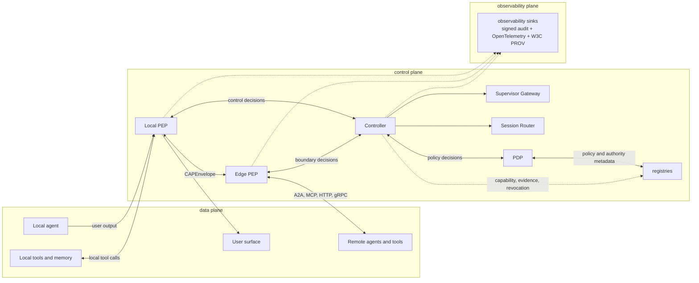

> **Status**: Active
> **Date**: 2026-06-14
> **Author**: @mohammadi
> **Audience**: engineers, stakeholders
> **Tags**: `cytoplex`, `cap`, `overview`

# CAP — Control Authority Protocol

**A supervisory control plane and runtime governance protocol for agentic systems.**

CAP sits one layer above A2A, MCP, HTTP, gRPC, OPA/Cedar, SPIFFE, OpenTelemetry, W3C PROV, and workflow engines. It adds explicit authority, evidence references, privacy boundaries, streaming interruption, typed refusal, execution reporting, audit, and provenance.

## What this release contains

| Area | Status |
|---|---|
| CAP V1 architecture baseline | documented |
| 11 Core schemas | implemented |
| gRPC + HTTP/JSON bindings on V1 CAPEnvelope | implemented |
| V1-C01..V1-C15 conformance | release-blocking |
| 15-case Therapist/Supervisor scenario | implemented |
| federated registries | reference service |
| Biscuit-v2 warrants, SPIFFE SVID, RFC 8785 JCS | scaffold + tests |
| Phase 3 capabilities | deterministic scaffolds |
| Phase 4 readiness packets | readiness packets |
| production deployment certification | not claimed |

## Target planes and enforcement points



## What this release is not

- not a complete production runtime
- not a clinical product
- not externally security-reviewed; packet is ready, execution pending
- not a stable public standard

## Quickstart

```bash
git clone <repo-url> && cd <repo>
python -m venv .venv && source .venv/bin/activate
pip install -e ".[dev]"

cap-check-v1-schema-drift
cap-check-v1-conformance

python -m cap_protocol.scenarios.therapist_supervisor.runner --case all

python VERIFY_RELEASE_BASELINE.py
```

Run outputs land in:

```text
runs/cap_therapist_supervisor_demo/<run-id>/
```

## Reading path

- Baseline index (target archived/removed)
- Architecture (target archived/removed)
- Primitives (target archived/removed)
- Security, trust, and threat model (target archived/removed)
- Examples (target archived/removed)
- Implementation alignment (target archived/removed)
- [Completed task prompts](docs/task_prompts/cap_v1/Done/)

## Safe public claim

> CAP v1 is architecture-documented, conformance-tested, and represented here as a deterministic runtime scaffold. Phase 3 capabilities are present as deterministic scaffolds and tests. Phase 4 external gates are present as planning packets and template configurations, awaiting external execution. This release does not claim production runtime completeness, clinical certification, externally executed security review, or production deployment certification.

## Setup

```bash
cd cap_protocol
python -m venv venv
source venv/bin/activate
python -m pip install -e ".[dev]"
```

For runtime-only installs:

```bash
python -m pip install -r requirements.txt
```

Real-model mode is optional and intentionally not installed by default. Install model dependencies manually when needed:

```bash
python -m pip install --upgrade torch torchvision accelerate safetensors pillow librosa
python -m pip install --upgrade "git+https://github.com/huggingface/transformers.git"
export HF_TOKEN=your_huggingface_token
```

The deterministic local run does not require real-model dependencies. Real-model mode is requested explicitly with:

```bash
python run_final_cap.py --target both --use-real-separate-e2b
python run_final_cap.py --target both --use-real-separate-e2b --require-real-model
```

The reference gRPC binding also accepts `--center-model-id`, `--edge-device-policy`, and `--center-device-policy`. If `--require-real-model` is omitted, model-load failure falls back to deterministic mode.

The Local PEP slow-path classifier, local NER redactor, text/voice embedding encoders, retention TTL deletion checks, lifecycle/profile-inheritance checks, and CAP-SWE reference profile checks are deterministic by default and do not download model weights in CI. Deployments can opt into `OllamaSemanticClassifier` with a caller-supplied local Ollama service, and can provide caller-managed local NER or embedding models, accepting the added latency, availability, privacy, quality-evaluation, and retention-operations responsibilities. CAP-SWE is profile generality evidence, not production SWE-agent certification.

Local deterministic latency and mobile-resource benchmark artifacts are published under `docs/benchmarks/`. They report p50/p95 overhead, CPU-time, memory, streaming delay, and mobile proxy-path proxies for this checkout only; they are not production mobile telemetry or measured battery drain.

## Run

Run the complete deterministic package:

```bash
python run_final_cap.py --target both
```

Run one binding:

```bash
python run_final_cap.py --target reference
python run_final_cap.py --target http
```

Run hardening only:

```bash
python run_final_cap.py --hardening-only
python run_production_hardening.py
```

Run compatibility wrappers directly:

```bash
python reference_grpc/run_demo.py
python second_http/run_demo.py
```

Run the Temporal-style CAP workflow composition sample:

```bash
python -m cap_protocol.runtime.workflow_engine
```

Run the local Go third-implementation CAPEnvelope/JCS fixture suite:

```bash
cd third_impl/go_cap_adapter
go run . --fixtures testdata/cap_v1_interop.json --json
```

Package entry points after editable install:

```bash
cap-run-final --target both
cap-run-hardening
cap-verify-package
cap-verify-release-baseline
cap-check-v1-schema-drift
cap-run-therapist-supervisor-demo --case all
cap-run-v1-benchmarks --iterations 100 --warmup 10
```

Outputs are written under `final_output/` and per-binding `runtime_data/` folders. These are generated artifacts and are ignored by git.

A successful full local run produces:

- `final_output/CAP_FINAL_SUMMARY.json`
- `final_output/production_hardening/CAP_PRODUCTION_HARDENING_REPORT.json`

The latest generated artifacts in this workspace were regenerated by the deterministic local runner at `2026-05-22T12:53:22Z`. They are local runner outputs, not external verification or a security audit.

## Test

```bash
source venv/bin/activate
NO_PROXY=127.0.0.1,localhost no_proxy=127.0.0.1,localhost pytest
python -m cap_protocol.cli.run_benchmarks --iterations 100 --warmup 10
python VERIFY_RELEASE_BASELINE.py
python second_http/run_demo.py
python run_production_hardening.py
python run_final_cap.py --target both
```

The explicit `NO_PROXY` setting is a local environment caveat, not a CAP protocol requirement. It avoids local HTTP smoke-test traffic being routed through system proxy software on machines where that is configured; plain `pytest` can fail in those environments with localhost proxy errors such as Privoxy `HTTP Error 500`.

The gRPC binding uses checked-in generated protobuf modules. The protobuf service still carries generic JSON CAP payloads; the CAP payload on the active gRPC path is v1 `CAPEnvelope`. The HTTP/JSON binding posts v1 `EvidenceRef` and `Directive` envelopes and returns v1 `ExecutionReport` acknowledgment envelopes on its active path. Regenerate protobuf modules only when `cap.proto` changes:

```bash
python scripts/generate_proto.py
```

## Project Layout

```text
src/cap_protocol/
  cli/                         command entry points
  bindings/grpc_reference/     gRPC/protobuf reference binding
  bindings/http_json/          independent HTTP/JSON binding
  conformance/                 shared fixture-based conformance checks
  hardening/                   policy and audit hardening utilities
  security/                    signing, DSSE, key, and cert helpers
schemas/cap.yaml               CAP v1 umbrella LinkML authoring schema
schemas/core.yaml              shared LinkML types/enums/classes
schemas/domains/               CAP v1 LinkML domain schema modules
schemas/cap-core/              JSON Schema artifacts for v0.1 and v1
policies/                      policy-as-data files
docs/                          protocol and developer documentation
docs/mcp_a2a_interop/          multi-organization MCP/A2A interop plan and report template
docs/domain_semantic_quality/   domain semantic-quality evaluation harness and rubric
docs/regulated_profile_review/ regulated-profile review packet and checklist
tests/                         pytest coverage
reference_grpc/                legacy wrapper for the canonical gRPC binding
second_http/                   legacy wrapper for the canonical HTTP/JSON binding
third_impl/go_cap_adapter/     local Go CAP v1 interop fixture adapter
```

More detail:

- [Architecture](spec/architecture.md)
- CAP v1 Task Backlog (target archived/removed)
- [Development](../../../04-Engineering/cytoplex/development.md)
- [API](../../../04-Engineering/cytoplex/api.md)
- [Testing](../../../04-Engineering/cytoplex/testing.md)
- Refactoring Notes (target archived/removed)

## Current Release Status

This is a production-candidate research package for the current Control Authority Profile subset, not an externally audited stable public standard and not a production deployment certification. The CAP v1 architecture documents the intended Control Authority Protocol target, and the repository includes deterministic v1 runtime scaffold evidence plus a local Go third-implementation fixture adapter. Full v1 migration remains tracked in `docs/CAP_v1_TASKS.md`, with release status separated in `docs/CAP_RELEASE_GATES.md`. The current supported labels are `v0.1-production-candidate`, `v1-architecture-documented`, and `v1-runtime-scaffold`; `v1-implemented-runtime`, `v0.1-stable`, and `v1-stable` remain blocked by the gates listed there.
