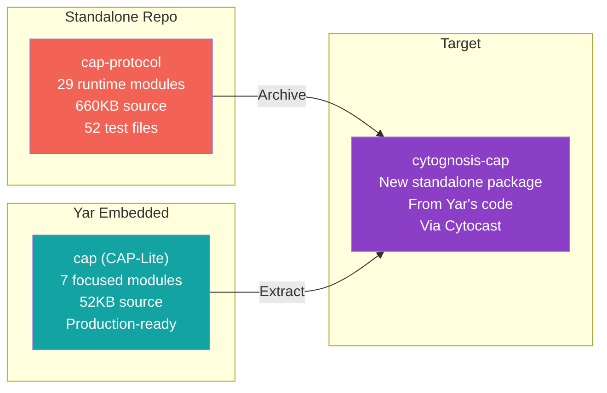
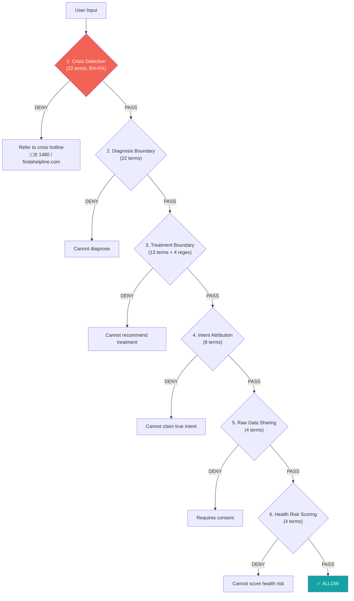
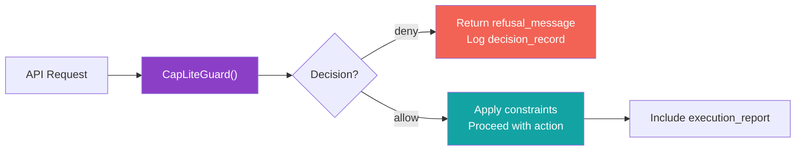
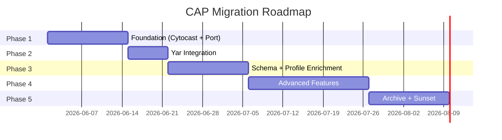

> **Relocated:** 2026-07-01 from `Cytoplex/cap-protocol-assessment.md` to `Cytoplex/research/`. Active design/assessment content, not an overview. Linked from `cytoplex-readme.md`.

> **Status**: Active
> **Date**: 2026-05-29
> **Author**: \@mohammadi
> **Audience**: engineers
> **Tags**: `cap`, `cytoplex`, `architecture`, `migration`

> [!NOTE]
> **TL;DR**: CAP (Control Authority Protocol) exists in two separate codebases that have diverged: a massive standalone research repo (`cap-protocol`, ~660KB of runtime) and a lean production guard in Yar (`cap`, ~52KB). The recommended path is to extract Yar's CAP-Lite as a standalone `cytognosis-cap` package via Cytocast, then deprecate the bloated standalone repo. A 5-phase, 10-week migration roadmap is defined.
> **Source**: [cap-protocol-assessment.md](file:///home/mohammadi/Documents/ObsidianVault/02-Products/cytonome-yar/cap-protocol-assessment.md)

---

## ⚡ Quick Start: The Two CAPs Problem

> [!TIP]
> **Section summary**: There are two separate CAP codebases. They share **no runtime code**. One is research scaffolding (huge). The other is production-ready (lean). They need to be unified.

| Codebase | Package | Lines | Purpose |
|---|---|---|---|
| `CAP/` (standalone) | `cap-protocol` v0.1.0 | 29 runtime modules, 660KB+ | Research artifact with v1 scaffolds |
| `Yar/src/cap/` (embedded) | `cap` (embedded) | 7 modules, ~52KB | **Production** deterministic policy gate |

### 🔑 Key Findings

| # | Finding |
|---|---|
| 1 | Two separate CAP packages coexist with **no shared runtime code** |
| 2 | Yar's CAP-Lite is **mature and production-ready** (757 lines of guard logic) |
| 3 | The standalone CAP repo is **research-quality scaffolding**, not deployable |
| 4 | 52 test files in standalone cover v1 scaffolds that Yar does not use |
| 5 | **Cytocast rebuild** is the recommended unification path |

---

## 🔬 Standalone Repo: What's In There?

> [!TIP]
> **Section summary**: The standalone `CAP/` repo is a massive research artifact. The runtime alone has 29 modules totaling ~650KB. The largest files are 90KB+ monoliths. It has transport bindings (gRPC, HTTP, Go), two domain profiles, and 660+ exported symbols.

### Size at a Glance

| Category | Count | Total Size |
|---|---|---|
| Runtime modules | 29 | ~650KB |
| Test files | 52 | ~400KB |
| Documentation files | 25 | ~150KB |
| JSON schemas (v0.1) | 9 | — |
| JSON schemas (v1) | 12 | — |
| LinkML domain schemas | 7 | — |

### Top 5 Largest Modules (⚠️ Monoliths)

| Module | Size | Purpose |
|---|---|---|
| `conformance/v1_runner.py` | **181.8KB** | Full V1 conformance suite |
| `runtime/registry.py` | **94.6KB** | Federated registries |
| `runtime/local_pep.py` | **90.1KB** | Local Policy Enforcement Point |
| `runtime/observability.py` | **60.5KB** | OTel integration |
| `runtime/substrate_interop.py` | **41.5KB** | MCP/A2A substrate interop |

💡 101: What is a PEP?

**PEP** stands for Policy Enforcement Point. It is the component that actually blocks or allows an action based on policy rules. Think of it as the security guard who checks your badge. In CAP, the PEP evaluates every agent action against the defined safety policies.

📋 Full runtime module inventory (29 modules)

| Module | Size | Purpose |
|---|---|---|
| `local_pep.py` | 90KB | Local Policy Enforcement Point |
| `registry.py` | 94KB | Federated registries |
| `observability.py` | 60KB | OTel integration |
| `supervisor_gateway.py` | 41KB | Supervisor gateway HTTP service |
| `substrate_interop.py` | 41KB | MCP/A2A substrate interop |
| `human_review.py` | 30KB | Human-in-the-loop review |
| `attested_local_pep.py` | 30KB | Platform attestation |
| `controller.py` | 27KB | Controller service |
| `workflow_engine.py` | 27KB | Temporal-style workflows |
| `lifecycle.py` | 25KB | Lifecycle FSM |
| `mobile_local_pep.py` | 20KB | Mobile PEP proxy |
| `edge_pep.py` | 18KB | Edge PEP |
| `live_model_streaming.py` | 18KB | Live model streaming |
| `privacy_pdp.py` | 17KB | Privacy boundary evaluation |
| `redaction.py` | 17KB | NER redaction |
| `session_router.py` | 16KB | Session routing |
| `interrupts.py` | 16KB | Interrupt decisions |
| `service_mesh.py` | 14KB | Service mesh composition |
| `embeddings.py` | 14KB | Embedding-only egress |
| `authority.py` | 13KB | Authority chain |
| `ui_correction.py` | 13KB | UI correction frames |
| `ui_abort.py` | 12KB | UI abort propagation |
| `slow_path_classifier.py` | 10KB | Semantic slow-path |
| `pdp_adapters.py` | 10KB | OPA/Cedar PDP adapters |
| `warrants.py` | 9KB | Biscuit warrants |
| `workload_identity.py` | 6KB | SPIFFE identity |
| `temporal.py` | 5KB | Temporal validation |
| `retention.py` | 3KB | Retention TTL deletion |
| `__init__.py` | 19KB | Re-export index (660+ symbols) |

---

## ✅ Yar CAP-Lite: The Production Guard

> [!TIP]
> **Section summary**: This is the **good one**. Yar's CAP-Lite is 7 focused modules (~52KB) that enforce 6 safety boundaries. Every API route runs through `CapLiteGuard` before any model inference. It is deterministic, has zero network dependencies, and handles crisis detection in English and Farsi.

### Module Structure

| File | Size | Purpose |
|---|---|---|
| `guard.py` | 29.7KB | `CapLiteGuard` class (757 lines of policy evaluation) |
| `primitives.py` | 14.1KB | Factory functions for CAP messages |
| `__init__.py` | 2.6KB | Package init with lazy imports |
| `protocols.py` | 1.6KB | Structural typing contracts |
| `models.py` | 1.5KB | `GuardDecision` Pydantic model |
| `policies.py` | 1.2KB | JSON policy loader |
| `constants.py` | 440B | Version, identity URIs |

### 🛡️ The 6 Guard Boundaries

| Boundary | # Terms | Action on Match |
|---|---|---|
| **Crisis Detection** (highest priority) | 22 (EN+FA) | Immediate deny + crisis hotline referral |
| **Diagnosis** | 22 (EN+FA) | Deny with forbidden action `diagnosis` |
| **Treatment** | 13 static + 4 regex | Deny with forbidden action `medical_treatment_recommendation` |
| **Intent Attribution** | 8 | Deny: cannot claim another's true intent |
| **Raw Data Sharing** | 4 | Deny unless user confirmed external write |
| **Health Risk Scoring** | 4 | Deny: cannot generate health risk scores |

### 5 Public Methods

| Method | What It Checks |
|---|---|
| `evaluate()` | All 6 boundaries on a capture (main entry point) |
| `validate_external_write()` | Anytype write operations (action type, target, confirmation) |
| `validate_local_object_update()` | Local mutations for diagnosis/treatment content |
| `validate_local_link()` | Link creation (safe identifiers, no self-links) |
| `validate_local_relation()` | Relation name format (`^[A-Za-z][A-Za-z0-9_]*$`) |

### Integration Pattern (Every Yar Route)

📋 API routes using CAP guard (9 files)

| File | Guard Methods Called |
|---|---|
| `routes_communication.py` | `evaluate()` (3 call sites) |
| `routes_anytype.py` | `evaluate()`, `validate_external_write()` |
| `routes_cap.py` | Direct guard introspection |
| `routes_objects.py` | `validate_local_object_update()`, `validate_local_link()` |
| `routes_voice.py` | `validate_external_write()` |
| `coordinator.py` | Holds guard instance |
| `interactive_assistant.py` | Holds guard instance |
| `voice_service.py` | Holds guard instance |
| `models/guard.py` | Type reference only |

---

## 🔬 CAP Naming Evolution

> [!TIP]
> **Section summary**: CAP has been renamed 3 times. It started as "Communication Augmentation Protocol," narrowed to "Control Authority Profile" (v0.1), and is now "Control Authority Protocol" (v1 target). The current framing is the strongest: CAP is a supervisory control layer, not a transport protocol.

| Version | Name | Scope |
|---|---|---|
| Original | Communication Augmentation Protocol | Broad schema-first coordination |
| v0.1 | Control Authority Profile | Narrowed to safety/privacy |
| v1 (target) | **Control Authority Protocol** | Supervisory control plane above existing transports |

### v1 Architecture (Two-Tier, Three-Plane)

| Tier | Components |
|---|---|
| **Local** | PEPs near agents, tools, user surfaces |
| **Remote** | Controller, Supervisor, Registries, Observability |

| Plane | What It Carries |
|---|---|
| **Data** | Evidence and actions |
| **Control** | Authority and policy |
| **Observability** | Audit and tracing |

---

## ⚠️ Gaps and Issues

> [!TIP]
> **Section summary**: The biggest problems are the two divergent codebases (Critical), the 90KB+ monolith files, and the missing integration/migration guides. The standalone repo has 13 production-readiness gaps.

### Architectural Gaps

| Gap | Severity |
|---|---|
| Two divergent codebases sharing no runtime code | **Critical** |
| Package naming collision (`cap` vs `cap-protocol`) | High |
| No shared import path | High |
| v0.1/v1 schema mismatch | Medium |
| No production runtime in standalone repo | High |

### Standalone Package Issues

| Issue | Impact |
|---|---|
| Files exceeding 90KB (monoliths) | Unmaintainable |
| 660+ re-exported symbols in `__init__.py` | Unmanageable API surface |
| Uses `setuptools` instead of `uv`/`hatch` | Outdated tooling |
| Pinned exact versions (grpcio, protobuf) | Fragile dependencies |
| Heavy deps required even for policy gate only | Unnecessary bloat |

📋 13 production-readiness gaps in standalone repo

| Gap |
|---|
| No production key infrastructure (no KMS/HSM) |
| No externally owned cross-implementation JCS fixtures |
| No native mobile/device certification |
| No production Controller/Supervisor Gateway |
| No production model-provider rollout |
| No production NER/embedding model rollout |
| No production offline policy-bundle operations |
| No production registry hardening/deployment |
| No production observability exporter/collector |
| No production PROV graph/document store |
| No deployed revocation operations |
| No external multi-organization interoperability |
| No expanded adversarial conformance coverage |

---

## 🏗️ The Migration Roadmap (5 Phases, 10 Weeks)

> [!TIP]
> **Section summary**: Extract Yar's CAP-Lite into a standalone `cytognosis-cap` package via Cytocast. Then update Yar to depend on it. Then selectively adopt v1 features. Then archive the old repo.

### Phase 1: Foundation (Week 1-2)

| Task | Status |
|---|---|
| Create cytocast profile for CAP packages | ☐ |
| Generate new `cap` package from template | ☐ |
| Port Yar CAP-Lite modules (guard, primitives, models, protocols, policies, constants) | ☐ |
| Port and expand unit tests | ☐ |
| Set up CI/CD (lint, test, typecheck, docs) | ☐ |

### Phase 2: Yar Integration (Week 2-3)

| Task | Status |
|---|---|
| Publish `cytognosis-cap` v0.1.0 | ☐ |
| Update Yar `pyproject.toml` to depend on `cytognosis-cap` | ☐ |
| Update import paths in Yar bridge module | ☐ |
| Run Yar test suite for compatibility | ☐ |
| Remove `Yar/src/cap/` source files (keep bridge) | ☐ |

### Phase 3: Schema & Profile Enrichment (Week 3-5)

| Task | Status |
|---|---|
| Add JSON Schema v1 artifacts | ☐ |
| Port profile system (inheritance, cap-med, cap-swe) | ☐ |
| Add privacy boundary model (9 dimensions) | ☐ |
| Write integration guide | ☐ |

### Phase 4: Advanced Features (Week 5-8)

| Task | Status |
|---|---|
| Add configurable guard (custom term dictionaries) | ☐ |
| Add policy engine (beyond static JSON) | ☐ |
| Add audit store interface | ☐ |
| Add transport binding abstractions | ☐ |
| Add observability hooks (OTel) | ☐ |

### Phase 5: Archive & Sunset (Week 8-10)

| Task | Status |
|---|---|
| Archive standalone `CAP/` repo | ☐ |
| Migrate valuable docs to new package | ☐ |
| Update org-wide references | ☐ |
| Write migration guide for external consumers | ☐ |

➡️ **What's Next?** Start Phase 1: create the Cytocast profile and generate the new package skeleton, then port `guard.py` and `primitives.py` first.

---

## 🔬 Schema Architecture

> [!TIP]
> **Section summary**: v0.1 schemas (9 JSON files) are what Yar uses today. v1 schemas (12 JSON files) add CAPEnvelope, InterruptDecision, OperationalConstraints, PrivacyBoundary, and Capability. The source of truth is LinkML YAML with 7 domain modules.

### v0.1 vs v1 Schema Comparison

| Feature | v0.1 (Yar uses) | v1 (standalone scaffolds) |
|---|---|---|
| JSON schemas | 9 files | 12 files |
| CAPEnvelope (typed routing) | ❌ | ✅ |
| InterruptDecision (7 types) | ❌ | ✅ |
| OperationalConstraints | ❌ | ✅ |
| PrivacyBoundary (9 dimensions) | ❌ | ✅ |
| Capability URIs | ❌ | ✅ |

📋 PrivacyBoundary: 9 Dimensions (v1)

| # | Dimension | What It Controls |
|---|---|---|
| 1 | Classification | Confidentiality label |
| 2 | Movement | Data locality constraints |
| 3 | Transformation | Required transforms before egress |
| 4 | Retention | TTL and deletion rules |
| 5 | Logging | What gets logged |
| 6 | Audit visibility | Who sees audit records |
| 7 | Allowed recipients | Permitted data recipients |
| 8 | Raw-data egress | Can raw data leave the boundary? |
| 9 | Minimization | Data minimization requirements |

---

## 📋 Test Coverage Analysis

> [!TIP]
> **Section summary**: 52 test files in the standalone repo cover the v1 scaffolds. Yar's guard is tested in the Yar test suite, not the CAP repo. There are no cross-codebase tests verifying compatibility.

| Test Category | Files | Key Tests |
|---|---|---|
| Core runtime | 15 | `test_cap_v1_pep.py` (56KB!) |
| Registry services | 5 | Federated registries |
| Security | 4 | Crypto, tamper, transparency |
| Transport bindings | 3 | gRPC, HTTP, Go interop |
| Profiles | 3 | cap-med, cap-swe, inheritance |
| Privacy/redaction | 4 | PDP, NER, embeddings, retention |
| UX/interaction | 3 | Human review, correction, abort |
| Infrastructure | 7 | OTel, mesh, workflow, controller |

### Test Gaps

| Gap |
|---|
| No cross-codebase compatibility tests |
| Many tests verify scaffolded fixtures, not real behavior |
| No integration tests with real models |
| No performance regression tests in CI |
| Yar guard unit tests exist only in Yar repo |

---

## 📖 Glossary

Expand terminology table

| Term | Definition |
|---|---|
| **CAP** | Control Authority Protocol. Safety and authority boundary for agent actions. |
| **CAP-Lite** | The lightweight, production-ready subset of CAP used in Yar. |
| **PEP** | Policy Enforcement Point. The component that blocks or allows actions. |
| **PDP** | Policy Decision Point. The component that evaluates policy rules to make a decision. |
| **CapLiteGuard** | The Python class in Yar that implements CAP-Lite boundary enforcement. |
| **CAPEnvelope** | v1 typed envelope with routing, signatures, and payload classification. |
| **Cytocast** | Cytognosis's Copier-based templating engine for standardized project scaffolding. |
| **MCP** | Model Context Protocol. Standard for agents to call external tools. |
| **A2A** | Agent-to-Agent protocol for inter-agent communication. |
| **OPA/Rego** | Open Policy Agent / Rego. Policy-as-code evaluation engine. |
| **OTel** | OpenTelemetry. Observability framework for tracing, metrics, and logs. |
| **SPIFFE** | Secure Production Identity Framework for Everyone. |
| **Biscuit** | A token format for decentralized authorization (like JWT but with attenuation). |
| **DSSE** | Dead Simple Signing Envelope. Signing standard for supply-chain attestation. |
| **LinkML** | Linked Data Modeling Language. Schema definition language that generates JSON Schema, Python, etc. |
| **ShEx** | Shape Expressions. RDF data validation language. |
| **gRPC** | Google Remote Procedure Call. High-performance binary protocol for service communication. |
| **JCS** | JSON Canonicalization Scheme. Standard way to serialize JSON for deterministic signing. |
| **NER** | Named Entity Recognition. AI technique for identifying names, dates, locations in text. |
| **CRDT** | Conflict-free Replicated Data Type for distributed systems. |
| **PHI** | Protected Health Information. HIPAA-regulated data. |

