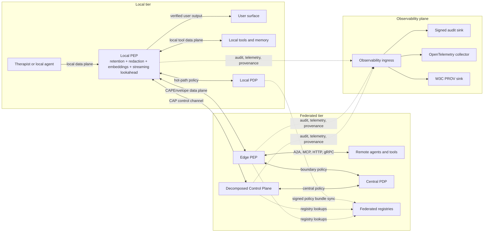
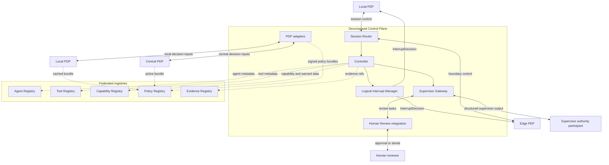
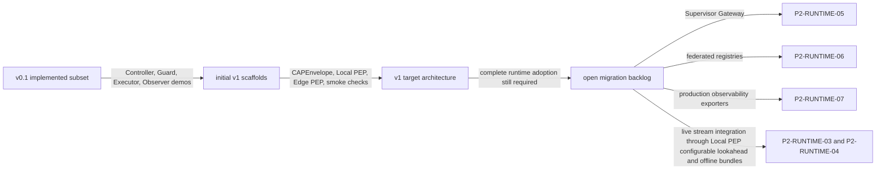

> **Status**: Active
> **Date**: 2026-06-14
> **Author**: @mohammadi
> **Audience**: engineers
> **Tags**: `architecture`, `cap`, `cytoplex`, `spec`

# Architecture

## Overview

The package separates protocol artifacts, executable bindings, shared conformance logic, and hardening utilities. It currently implements the CAP v0.1 production-candidate subset, while the documentation now tracks the CAP v1 Control Authority Protocol target architecture from the consolidated architecture source.

In the current v0.1 subset, CAP Core defines typed authority artifacts: `Directive`, `GuardDecision`, `ExecutionReport`, `RefusalMessage`, `DecisionRecord`, `EvidenceRef`, and `AuthorityChain`. CAP-Med adds non-diagnostic psychology profile constraints, including redaction, evidence minimization, clinical-output blocking, and safe question revision.

CAP v1 reframes this as a **Control Authority Protocol**: a runtime governance protocol and supervisory control plane that owns authority, privacy, interruption, refusal, reporting, and provenance semantics while reusing A2A, MCP, policy engines, identity systems, observability stacks, and workflow engines.

## CAP v1 Target Shape

The target architecture is hybrid, two-tier, and three-plane:

- **Local tier:** Local PEPs sit near agents, tools, local memory, and user surfaces inside the local trust boundary. They are the only required path from the Therapist/interviewer agent to the user and to Supervisor context egress, so they can enforce raw-evidence substitution, local retention TTL deletion, local NER redaction, embedding-only projection, non-diagnostic output, semantic slow-path checks, typed refusal, offline fallback, and streaming interruption before user-visible delivery or cross-boundary consultation. The Local PEP owns the sliding lookahead buffer for outgoing streams, using the configurable lookahead terminology defined in `CAP_03_primitives.md#7-interruptdecision-target-primitive`.
- **Federated tier:** The central Control Plane is decomposed into Controller, Supervisor Gateway, Session Router, logical Interrupt Manager, PDP adapters, and Human Review integration. The central/main Supervisor is a participant behind the Supervisor Gateway, not the whole Control Plane. Edge PEPs sit at service, agent, and tool network boundaries to inspect CAP envelopes and enforce policy at message boundaries.
- **Data plane:** A2A, MCP, HTTP, gRPC, WebSocket, and local IPC traffic carrying `CAPEnvelope` metadata or CAP payload references. CAP governs the traffic through enforcement points but does not define the transport or agent framework.
- **Control plane:** CAP-specific `CAPEnvelope`, `Directive`, `GuardDecision`, `InterruptDecision`, `RefusalMessage`, and `ExecutionReport` messages used for synchronous authority, interruption, refusal, and reporting decisions.
- **Observability plane:** signed audit records, OpenTelemetry telemetry, and W3C PROV graphs on independent sinks. These outputs are fed by enforcement points and control components but are not folded into hot-path control logic.
- **Policy and registries:** PDPs evaluate OPA, Cedar, or equivalent policies locally and centrally. Agent, Tool, Capability, Policy, and Evidence registries distribute metadata, warrant keys, revocation status, signed policy bundles, and evidence pointers independently.

The v0.1 implementation maps onto this target only partially: the Edge/Center demos are simplified demonstrations of Controller, Guard, Executor, Observer, evidence, refusal, and reporting behavior. They are not the full decomposed v1 Control Plane. Initial v1 schemas, examples, Local PEP, local NER redaction, embedding-only Supervisor egress, retention TTL deletion, semantic slow-path classifier, reference live model-stream adapter, CLI/WebSocket abort-presentation adapters, CLI/WebSocket correction-frame adapters, deterministic Android/iOS mobile proxy Local PEP contracts, deterministic attested Local PEP registration hooks, Edge PEP, Controller reference service, Supervisor Gateway reference service, Session Router reference component, Human Review reference integration, SPIFFE SVID workload-identity checks, service-mesh composition helpers, a Capability Registry reference service, observability sink, and release-blocking deterministic scaffold conformance for V1-C01 through V1-C15 now exist. The Controller reference service forms signed Directive envelopes from intents, delegates policy to Guard/PDP evaluators, routes through Session Router, and emits to optional observability sinks while preserving the old Center as v0.1 legacy compatibility. The gRPC and HTTP/JSON demos route selected user-visible output, raw local observation handling, MCP-style local-tool calls, Supervisor context preparation, and demo cross-boundary `CAPEnvelope` paths through Local/Edge PEP scaffolds, and the mesh scaffold documents an Edge PEP application sidecar beside an injected Istio/Linkerd sidecar. Local/registry retention GC deletes expired raw backing content while retaining content-minimized audit/provenance records. The mobile proxy scaffold models Android Service and iOS App Extension route controls for direct user output, network, raw-data egress, and local tools; the attested registration scaffold binds challenge/response evidence to workload identity and Local PEP version before Capability Registry publication. These are not checked-in native mobile projects or production platform verifiers. They still do not use production SPIRE/service-mesh rollout, production network registry deployment, production observability exporters/collectors, production native mobile entitlements/device tests, production provider routing, production local NER or embedding model quality/privacy evaluation, scheduled production retention jobs, or shipping native UI wrappers around the reference live stream adapter.

## Architecture Diagrams

The diagrams below are implementer-oriented views of the CAP v1 target architecture. They are documentation for the target topology, not evidence that the current runtime has completed the full v1 migration. Captions call out the current v0.1/v1 status so readers can distinguish implemented package behavior from the intended architecture.

### Diagram 1: Target Planes And Enforcement Points

Caption: This is the CAP v1 target topology. Retention TTL deletion, local NER redaction, embedding-only projection, and the streaming lookahead buffer sit inside the Local PEP on the paths from local agent output to the user surface and from local context to Supervisor consultation; CAP_03 defines the default window, buffered transform, abort, and correction-frame terms. The current package implements two executable local bindings, deterministic Local PEP including local retention GC, local NER redaction, text/voice embedding-only egress, and semantic slow-path classification, reference live model streaming, CLI/WebSocket-style abort replacement UX, CLI/WebSocket-style correction-frame replacement/annotation UX, Android/iOS mobile proxy route-control scaffolding, deterministic attested Local PEP registration, Edge PEP, Controller service, Supervisor Gateway, a Capability Registry reference service, and observability sink scaffolding. The demos now mediate selected user-output, local-tool, and Supervisor-context paths through Local PEP, but they do not yet enforce the full target split for Edge PEP, production network registry deployment, central PDP, production observability exporters, production model providers, production local NER or embedding model quality/privacy evaluation, scheduled production retention jobs, native mobile projects, real platform attestation verifiers, or shipping native UI wrappers.

### Diagram 2: Decomposed Control Plane

Caption: This is the CAP v1 Control Plane decomposition. In the current local demos, the Center process is only a simplified v0.1 legacy stand-in for combined Controller, Guard, Observer, and Supervisor behavior. The current package includes a Controller reference service that owns intent/orchestration while delegating Guard/PDP evaluation, Session Router delivery, and observability sinks; a Supervisor Gateway reference service; a Session Router reference component; a Human Review reference integration; and a SQLite-backed Capability Registry reference service with live revocation checks, trust-domain federation hooks, audit events, and warrant-key lookup/rotation coverage. Production controller/gateway/router/review deployment, production PDP adapters, networked registry deployment, service authentication, HA replication, operational monitoring, and KMS/HSM custody remain runtime migration work.

### Diagram 3: Implementer Reading Path

Caption: This is the recommended implementer reading path. Start with the v0.1 package to understand existing executable evidence, then read the v1 schemas and PEP scaffolds, then use the target architecture diagrams to guide migration. The final step is the backlog in `CAP_v1_TASKS.md`; the diagram intentionally does not imply that the full v1 runtime is already implemented.

For implementation details after these diagrams, read `CAP_02_core_model.md` for roles, envelopes, lifecycle, and enforcement invariants; then read `CAP_05_integrations.md` for how A2A, MCP, OPA/Cedar, OpenTelemetry, W3C PROV, DSSE, and in-toto compose with CAP.

## Therapist/Supervisor Scenario

The motivating test scenario names the local interviewer persona **Therapist** for readability. This is a profile/scenario label, not CAP Core and not a clinical authority claim. The Therapist must remain supportive, non-diagnostic, non-prescriptive, and privacy-preserving. The central/main **Supervisor** is an authority participant behind a Supervisor Gateway, separate from the gateway endpoint and from the model, human, or rule engine that produces strategy. Local PEP policy can refuse unsafe Supervisor directives, especially requests that would reveal raw transcripts, raw audio, diagnosis, treatment advice, jurisdictionally restricted data, or data outside the profile boundary; embedding-only egress is still subject to recipient-bound PrivacyBoundary checks.

## Layers

- `schemas/cap.yaml`, `schemas/core.yaml`, and `schemas/domains/*.yaml`: LinkML authoring schemas for the CAP v1 target object model, following the Cytos-style umbrella/core/domain layout.
- `schemas/cap-core/`: JSON Schema Draft 2020-12 artifacts for the current v0.1 subset and initial v1 objects. These remain the executable schema artifacts used by current tests.
- `policies/`: portable policy-as-data inputs used by the hardening policy engine.
- `src/cap_protocol/bindings/grpc_reference`: reference gRPC/protobuf runtime.
- `src/cap_protocol/bindings/http_json`: independent HTTP/JSON runtime with separate primitive builders.
- `src/cap_protocol/conformance`: shared fixture-driven checks that are binding-independent.
- `src/cap_protocol/hardening` and `src/cap_protocol/security`: policy, audit-chain, signature, DSSE, in-toto-style, and non-production fallback certificate helpers.
- `reference_grpc/` and `second_http/`: legacy wrappers for the canonical package modules.
- `docs/CAP_v1_TASKS.md`: v1 gap backlog for documentation, schema, runtime, and conformance migration.

## gRPC Reference Flow

1. The Edge Executor redacts raw user text and stores raw transcripts locally.
2. The Edge sends observation packets and question proposals over a local mTLS gRPC stream.
3. The Center acts as Controller, Guard, and Observer. In v1 terminology, this is a simplified central Supervisor/Control Plane stand-in.
4. Unsafe or generic proposals produce a v1 `CAPEnvelope` carrying a deny `GuardDecision`.
5. The Controller creates a safe revised v1 `Directive` inside a `CAPEnvelope`.
6. The Executor validates guard, evidence, expiry, and constraints before producing a v1 `ExecutionReport` envelope; the stop path emits a v1 `InterruptDecision`.
7. The Center emits a final report with conformance, MCP, A2A, OTel, and PROV samples.

## HTTP/JSON Independent Flow

The HTTP binding intentionally does not reuse the gRPC primitive builders. It uses stdlib `ThreadingHTTPServer`, JSON `CAPEnvelope` messages, independent v1 validation logic, and its own CAP-Med guard state. `/edge/event` receives v1 `EvidenceRef` envelopes, `/center/response` receives v1 `Directive` envelopes, and both endpoints return v1 `ExecutionReport` acknowledgment envelopes. CAP v1 remains a semantic governance protocol, not a transport protocol.

## Go Interop Adapter Flow

The local third implementation shape lives under `third_impl/go_cap_adapter`. It is not a service runtime; it is a standard-library Go fixture runner that reads shared CAP v1 `CAPEnvelope` fixtures, verifies RFC 8785/JCS detached Ed25519 signatures, checks required envelope and payload fields, applies timestamp/TTL checks, and reports fixture IDs for pass/fail traceability.

## Hardening Flow

The hardening runner creates deterministic sample CAP messages, validates schemas, signs and verifies Ed25519 detached signatures and DSSE envelopes, creates an in-toto-style attestation, evaluates policy files, runs adversarial fixtures, verifies package-private-key absence, and verifies a hash-chain JSONL audit store.

## Known Architecture Gaps

The primary v1 gaps are tracked in `CAP_v1_TASKS.md`: adoption of v1 schemas by the main runtime, production key infrastructure and externally owned cross-implementation JCS fixtures, KMS/HSM-backed warrant key custody and deployed revocation operations, native mobile/device certification and real platform attestation verifier rollout, production Controller/Supervisor Gateway rollout, production model-provider rollout and shipping native UI wrappers around the reference live adapter, organization-selected semantic model-judge rollout, production offline policy-bundle operations, production registry hardening/deployment, production observability exporter/collector integration, external multi-organization interoperability beyond the local Go adapter, and expanded adversarial conformance coverage.
