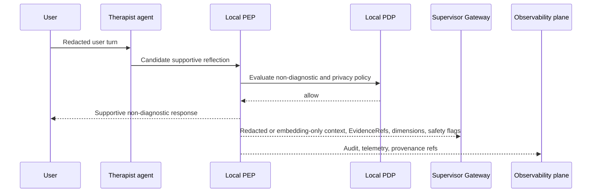
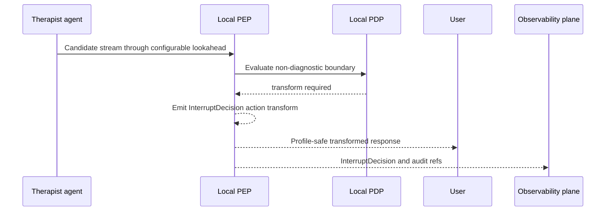
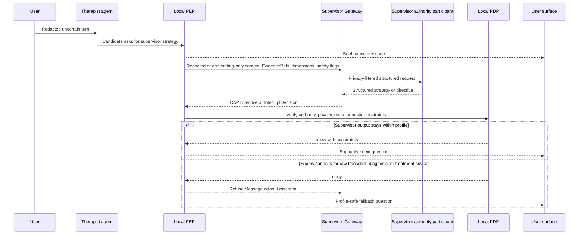
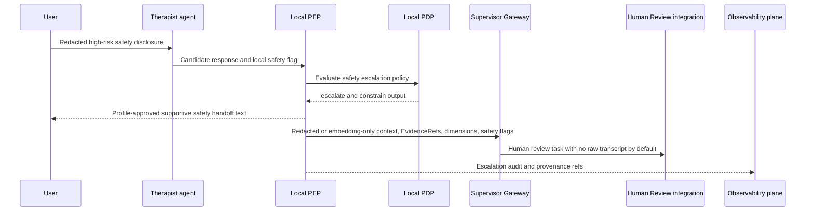
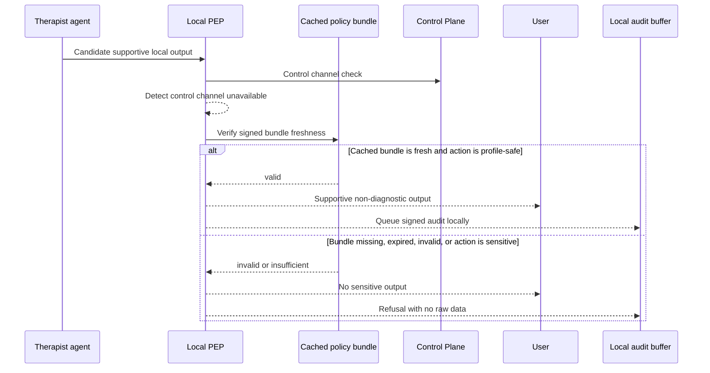
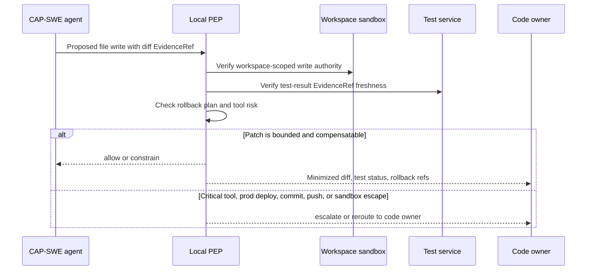

> **Status**: Active
> **Date**: 2026-06-14
> **Author**: @mohammadi
> **Audience**: engineers
> **Tags**: `cytoplex`, `cap`, `spec`, `examples`

# CAP Examples

The examples use simplified identifiers and timestamps. They are valid JSON examples, but real deployments should use verifiable identities, signed attestations, and resolvable evidence stores.

## 1. EvidenceRef

```json
{
  "uri": "cas://sha256/aaaaaaaaaaaaaaaaaaaaaaaaaaaaaaaaaaaaaaaaaaaaaaaaaaaaaaaaaaaaaaaa",
  "hash": "sha256:aaaaaaaaaaaaaaaaaaaaaaaaaaaaaaaaaaaaaaaaaaaaaaaaaaaaaaaaaaaaaaaa",
  "media_type": "application/json",
  "size_bytes": 512,
  "created_at": "2026-05-16T10:00:00Z",
  "expires_at": "2026-05-16T10:30:00Z",
  "freshness_policy": "max_age:30m",
  "producer_identity": "spiffe://example.org/executor/retriever-1",
  "confidentiality_label": "internal",
  "access_policy_ref": {
    "policy_id": "evidence-read-policy",
    "engine": "opa",
    "version": "1.0"
  },
  "provenance_ref": "prov://trace/trace-001/entity/evidence-001"
}
```

## 2. AuthorityChainStep

```json
{
  "agent_id": "spiffe://example.org/controller/planner-1",
  "capability_claim": "cap.directive.issue",
  "authority_scope": ["mcp://github/tools/read_issue", "repo:example/project"],
  "approved_at": "2026-05-16T10:00:00Z",
  "expires_at": "2026-05-16T10:05:00Z",
  "trust_domain": "example.org",
  "policy_ref": {
    "policy_id": "github-read-policy",
    "engine": "opa",
    "version": "1.2.0",
    "digest": "sha256:bbbbbbbbbbbbbbbbbbbbbbbbbbbbbbbbbbbbbbbbbbbbbbbbbbbbbbbbbbbbbbbb"
  },
  "signature_ref": {
    "kind": "dsse",
    "uri": "attest://authority/step-001",
    "digest": "sha256:cccccccccccccccccccccccccccccccccccccccccccccccccccccccccccccccc"
  }
}
```

## 3. Successful MCP tool execution under CAP Directive

```json
{
  "cap_version": "0.1",
  "message_id": "msg-001",
  "message_type": "Directive",
  "session_id": "sess-001",
  "task_id": "task-001",
  "created_at": "2026-05-16T10:00:01Z",
  "expiry": "2026-05-16T10:05:00Z",
  "sender_id": "spiffe://example.org/controller/planner-1",
  "receiver_id": "spiffe://example.org/executor/tool-runner-1",
  "sender_capability": "cap.directive.issue",
  "receiver_capability": "cap.directive.accept",
  "payload": {
    "directive_id": "dir-001",
    "directive_type": "execute",
    "action": {
      "kind": "mcp_tool",
      "target": "mcp://github/tools/read_issue",
      "operation": "tools/call"
    },
    "constraints": {
      "allowed_tools": ["mcp://github/tools/read_issue"],
      "forbidden_tools": ["mcp://github/tools/write_file"],
      "max_wall_time_ms": 5000,
      "max_tool_calls": 1,
      "scope_tags": ["repo:example/project"]
    },
    "authority_chain": [
      {
        "agent_id": "spiffe://example.org/controller/planner-1",
        "capability_claim": "cap.directive.issue",
        "authority_scope": ["mcp://github/tools/read_issue", "repo:example/project"],
        "approved_at": "2026-05-16T10:00:00Z",
        "expires_at": "2026-05-16T10:05:00Z",
        "trust_domain": "example.org"
      }
    ],
    "policy_refs": [
      {
        "policy_id": "github-read-policy",
        "engine": "opa",
        "version": "1.2.0",
        "digest": "sha256:bbbbbbbbbbbbbbbbbbbbbbbbbbbbbbbbbbbbbbbbbbbbbbbbbbbbbbbbbbbbbbbb"
      }
    ],
    "expiry": "2026-05-16T10:05:00Z",
    "reversibility": "reversible",
    "idempotency_key": "idem-dir-001"
  },
  "trace_context": {
    "traceparent": "00-4bf92f3577b34da6a3ce929d0e0e4736-00f067aa0ba902b7-01"
  }
}
```

## 4. GuardDecision allow_with_constraints

```json
{
  "cap_version": "0.1",
  "message_id": "msg-002",
  "message_type": "GuardDecision",
  "session_id": "sess-001",
  "task_id": "task-001",
  "created_at": "2026-05-16T10:00:02Z",
  "sender_id": "spiffe://example.org/guard/policy-1",
  "receiver_id": "spiffe://example.org/controller/planner-1",
  "sender_capability": "cap.guard.evaluate",
  "payload": {
    "decision_id": "gd-001",
    "guarded_message_id": "dir-001",
    "guard_identity": "spiffe://example.org/guard/policy-1",
    "guard_capability": "cap.guard.evaluate",
    "decision": "allow_with_constraints",
    "severity": "warn",
    "policy_refs": [
      {
        "policy_id": "github-read-policy",
        "engine": "opa",
        "version": "1.2.0"
      }
    ],
    "constraints_added": {
      "max_wall_time_ms": 2000,
      "max_tool_calls": 1
    },
    "expires_at": "2026-05-16T10:05:00Z"
  }
}
```

## 5. ExecutionReport with side effects

```json
{
  "cap_version": "0.1",
  "message_id": "msg-003",
  "message_type": "ExecutionReport",
  "session_id": "sess-001",
  "task_id": "task-001",
  "created_at": "2026-05-16T10:00:04Z",
  "sender_id": "spiffe://example.org/executor/tool-runner-1",
  "receiver_id": "spiffe://example.org/controller/planner-1",
  "payload": {
    "report_id": "rep-001",
    "directive_id": "dir-001",
    "status": "succeeded",
    "completed_at": "2026-05-16T10:00:04Z",
    "evidence_produced": [
      {
        "uri": "cas://sha256/dddddddddddddddddddddddddddddddddddddddddddddddddddddddddddddddd",
        "hash": "sha256:dddddddddddddddddddddddddddddddddddddddddddddddddddddddddddddddd",
        "media_type": "application/json",
        "producer_identity": "spiffe://example.org/executor/tool-runner-1",
        "created_at": "2026-05-16T10:00:04Z"
      }
    ],
    "side_effects": [
      {
        "resource_uri": "mcp://github/tools/read_issue#issue-42",
        "mutation_type": "read",
        "occurred_at": "2026-05-16T10:00:03Z",
        "reversibility": "reversible",
        "compensation_hint": "No external mutation occurred."
      }
    ],
    "tool_result_refs": ["mcp-result://github/read_issue/result-001"],
    "metrics": {
      "wall_time_ms": 830,
      "tool_calls": 1
    },
    "trace_ref": "4bf92f3577b34da6a3ce929d0e0e4736"
  }
}
```

## 6. GuardDecision deny

```json
{
  "cap_version": "0.1",
  "message_id": "msg-004",
  "message_type": "GuardDecision",
  "created_at": "2026-05-16T10:01:00Z",
  "sender_id": "spiffe://example.org/guard/privacy-1",
  "receiver_id": "spiffe://example.org/controller/planner-1",
  "payload": {
    "decision_id": "gd-002",
    "guarded_message_id": "dir-002",
    "guard_identity": "spiffe://example.org/guard/privacy-1",
    "guard_capability": "cap.guard.privacy",
    "decision": "deny",
    "severity": "block",
    "policy_refs": [
      {
        "policy_id": "privacy-minimization",
        "engine": "opa",
        "version": "2.0.0"
      }
    ],
    "expires_at": "2026-05-16T10:03:00Z"
  }
}
```

## 7. Refusal due to missing evidence

```json
{
  "cap_version": "0.1",
  "message_id": "msg-005",
  "message_type": "RefusalMessage",
  "created_at": "2026-05-16T10:02:00Z",
  "sender_id": "spiffe://example.org/executor/tool-runner-1",
  "receiver_id": "spiffe://example.org/controller/planner-1",
  "payload": {
    "refusal_id": "ref-001",
    "refused_message_id": "dir-003",
    "refused_by": "spiffe://example.org/executor/tool-runner-1",
    "reason_code": "missing_evidence",
    "reason_detail": "Directive requires evidence cas://sha256/eeee... but it is not present in the evidence store.",
    "safe_alternatives": ["Re-submit Directive after providing required EvidenceRef."],
    "remediation_options": ["Provide fresh evidence with matching hash and access policy."],
    "retryable": true,
    "required_policy_or_evidence": ["cas://sha256/eeeeeeeeeeeeeeeeeeeeeeeeeeeeeeeeeeeeeeeeeeeeeeeeeeeeeeeeeeeeeeee"]
  }
}
```

## 8. DecisionRecord without hidden chain-of-thought

```json
{
  "cap_version": "0.1",
  "message_id": "msg-006",
  "message_type": "DecisionRecord",
  "created_at": "2026-05-16T10:03:00Z",
  "sender_id": "spiffe://example.org/controller/planner-1",
  "payload": {
    "decision_id": "dec-001",
    "decision_question": "Should the GitHub read_issue tool be invoked to retrieve issue context?",
    "selected_option": "invoke_read_issue",
    "alternatives_considered": ["ask_user_for_context", "skip_tool_use"],
    "evidence_used": [],
    "policy_refs": [
      {
        "policy_id": "github-read-policy",
        "engine": "opa",
        "version": "1.2.0"
      }
    ],
    "uncertainty_summary": "Low uncertainty: action is read-only and within repository scope.",
    "known_limitations": ["Tool result may be stale if issue changed after retrieval."],
    "non_cot_rationale_summary": "Read-only issue retrieval is allowed by policy and needed to ground the next step.",
    "created_at": "2026-05-16T10:03:00Z",
    "decider_id": "spiffe://example.org/controller/planner-1"
  }
}
```

## 9. CAP metadata embedded in A2A Task

```json
{
  "kind": "task",
  "id": "a2a-task-001",
  "metadata": {
    "cap": {
      "version": "0.1",
      "directive_ref": "dir-001",
      "required_capabilities": ["cap.directive.accept", "mcp.tools.call"],
      "guard_required": true
    }
  },
  "parts": [
    {
      "kind": "data",
      "mimeType": "application/cap+json",
      "data": {
        "cap_version": "0.1",
        "message_id": "msg-a2a-001",
        "message_type": "Directive",
        "created_at": "2026-05-16T10:04:00Z",
        "sender_id": "spiffe://example.org/controller/planner-1",
        "receiver_id": "spiffe://partner.example/executor/agent-7",
        "payload": {
          "directive_id": "dir-a2a-001",
          "directive_type": "execute",
          "action": {
            "kind": "a2a_task",
            "target": "a2a-task-001"
          },
          "constraints": {
            "max_wall_time_ms": 10000
          },
          "authority_chain": [
            {
              "agent_id": "spiffe://example.org/controller/planner-1",
              "capability_claim": "cap.directive.issue",
              "authority_scope": ["a2a://partner.example/tasks"],
              "approved_at": "2026-05-16T10:04:00Z",
              "expires_at": "2026-05-16T10:09:00Z",
              "trust_domain": "example.org"
            }
          ],
          "policy_refs": [
            {
              "policy_id": "partner-delegation-policy",
              "engine": "opa",
              "version": "1.0.0"
            }
          ],
          "expiry": "2026-05-16T10:09:00Z",
          "reversibility": "partial"
        }
      }
    }
  ]
}
```

## 10. CAP v1 Therapist/Supervisor profile sequences

These examples document the CAP-Med Therapist/Supervisor profile scenario used throughout the v1 architecture notes. The **Therapist** label means a local supportive interviewer persona, not a CAP Core role and not a clinical authority. The Therapist output remains supportive, non-diagnostic, and non-prescriptive. The **Supervisor** is an authority participant behind a Supervisor Gateway; the gateway, the authority role, and the model/human/rule engine behind it are separate concepts.

All examples below are minimized and redacted. They do not include raw transcripts, raw audio, hidden chain-of-thought, or raw sensitive evidence. Supervisor consultation receives locally redacted context, `EvidenceRef` identifiers, dimension vectors, and safety flags by default; when policy requests embedding-only egress, it receives local text/voice embeddings and aggregate dimensions instead of raw or redacted text. The current repository has a dedicated `cap_protocol.profiles.cap_med` v1 runtime-profile fixture, deterministic Local PEP and Supervisor Gateway scaffolding, deterministic local NER redaction, deterministic text/voice embedding-only egress, deterministic retention TTL deletion for expired raw backing content, a deterministic semantic slow-path classifier, a reference live Local PEP model-stream adapter, CLI/WebSocket abort-presentation adapters, CLI/WebSocket correction-frame replacement/annotation adapters, a Supervisor Gateway reference service boundary, and a Capability Registry reference service for these behaviors, including the configurable lookahead terminology defined in `CAP_03_primitives.md#7-interruptdecision-target-primitive`, structured gateway translation, service-routed backend consultation, and cache/version/live-revocation registry checks. Production Supervisor Gateway rollout, production model-provider rollout, shipping native UI wrappers, organization-selected model-judge rollout, production local NER and embedding model quality/privacy evaluation, production policy-bundle distribution, production Human Review portal/workflow deployment, scheduled retention jobs, regulated-profile review completion, and production registry hardening/deployment remain v1 runtime migration work.

Narrative names in these examples, including diagnostic transform, supervisor pause, self-harm escalation, and offline fallback, are profile shorthand. The serialized `InterruptDecision.action` value remains one of the seven Core actions: `allow`, `deny`, `transform`, `constrain`, `pause`, `escalate`, or `reroute`; fallback behavior is expressed as cached-policy `allow`, `deny`, or `constrain`, not as a separate action.

### 10.1 Shared redacted supervisor context

The Supervisor Gateway sends context shaped like this by default. This is a profile payload carried by or referenced from CAP objects; raw user text and raw audio stay local unless a profile explicitly authorizes a narrower exception. The referenced `PrivacyBoundary` uses the nine first-class v1 dimensions: classification, movement, transformation, retention, logging, audit visibility, allowed recipients, raw-data egress, and minimization. Retention applies to local backing content separately from audit records: raw backing bytes can expire and be deleted while content-minimized audit/provenance records remain.

```json
{
  "context_id": "ctx-redacted-session-v1-turn-004",
  "session_id": "session-v1-therapist",
  "trace_id": "trace-v1-therapist-004",
  "redacted_context": "[PERSON] reports recent work stress near [LOCATION] on [DATE]. Email and phone details are [EMAIL] and [PHONE]. Raw transcript is local-only.",
  "evidence_refs": [
    "cas://sha256/redacted-therapist-observation-001",
    "prov://session/session-v1-therapist/entity/redacted-observation-001"
  ],
  "dimension_vector": {
    "affect_valence": -0.36,
    "arousal": 0.64,
    "sleep_disruption_signal": "reported",
    "social_withdrawal_signal": "not_observed"
  },
  "safety_flags": {
    "self_harm_ideation": false,
    "acute_risk": false,
    "raw_transcript_included": false,
    "raw_audio_included": false
  },
  "redaction": {
    "mode": "local_ner_redaction",
    "redaction_ref": "redaction://local-ner/example-session-v1-turn-004",
    "categories": ["DATE", "EMAIL", "LOCATION", "PERSON", "PHONE"],
    "raw_content_logged": false,
    "local_only": true
  },
  "privacy_boundary_ref": "privacy://privacy-boundary-therapist-default",
  "policy_refs": [
    "policy://cytognosis/privacy-minimization-v1",
    "policy://cytognosis/non-diagnostic-boundary"
  ]
}
```

### 10.1.1 Embedding-only supervisor context

When profile policy requests embedding-only Supervisor egress, the gateway payload carries local embeddings, aggregate dimensions, evidence refs, provenance refs, and minimization metadata. The local text/voice encoders consume raw transcript/audio inside the Local PEP boundary; source material and redacted text are not included in the Supervisor payload.

```json
{
  "context_id": "ctx-embedding-session-v1-turn-004",
  "session_id": "session-v1-therapist",
  "trace_id": "trace-v1-therapist-004",
  "data_access_scope": [
    "text_embedding",
    "voice_embedding",
    "dimension_vector",
    "safety_flags",
    "evidence_refs_only"
  ],
  "embeddings": [
    {
      "modality": "text",
      "dimension": 8,
      "encoder_id": "deterministic-local-text-embedding-v1",
      "model_ref": "local-rule://cap/deterministic-text-embedding-v1",
      "source_hash": "sha256:example-text-source",
      "embedding_hash": "sha256:example-text-embedding",
      "source_slot": "transcript",
      "provenance_ref": "prov://local-embedding/example-text-embedding",
      "local_only": true,
      "raw_content_logged": false
    },
    {
      "modality": "voice",
      "dimension": 8,
      "encoder_id": "deterministic-local-voice-embedding-v1",
      "model_ref": "local-rule://cap/deterministic-voice-embedding-v1",
      "source_hash": "sha256:example-voice-source",
      "embedding_hash": "sha256:example-voice-embedding",
      "source_slot": "audio",
      "provenance_ref": "prov://local-embedding/example-voice-embedding",
      "local_only": true,
      "raw_content_logged": false
    }
  ],
  "dimension_vector": {
    "affect_valence": -0.36,
    "arousal": 0.64
  },
  "safety_flags": {
    "acute_risk": false
  },
  "evidence_refs": [
    "cas://sha256/redacted-therapist-observation-001"
  ],
  "embedding_egress": {
    "mode": "embedding_only_egress",
    "recipient_id": "spiffe://cytognosis.local/supervisor/gateway",
    "recipient_binding": {
      "type": "spiffe",
      "spiffe_id": "spiffe://cytognosis.local/supervisor/gateway"
    },
    "privacy_boundary_ref": "privacy://privacy-boundary-therapist-default",
    "minimization": {
      "egress_payload": "embeddings_and_aggregate_dimensions_only",
      "raw_source_material": "local_only",
      "evidence_refs_preserved": true,
      "raw_content_logged": false
    }
  },
  "raw_included": false
}
```

### 10.2 Safe pass-through

Status: v1 target behavior with current deterministic Local PEP scaffolding. No central Supervisor decision is required for the user-visible turn. The Supervisor Gateway may receive a redacted asynchronous context update for session continuity.



Example user-visible output:

```json
{
  "decision": "allow",
  "user_output": "That sounds like a lot to carry. What part of it feels most important to talk through first?",
  "profile_constraints": {
    "cap-med/v1": {
      "non_diagnostic_required": true,
      "non_prescriptive_required": true,
      "raw_transcript_upload_forbidden": true
    }
  }
}
```

### 10.3 Diagnostic transform

Status: v1 target behavior with current reference live-stream, semantic slow-path, configurable-lookahead, and client abort-presentation scaffolding. A candidate stream begins to use diagnostic framing while still inside the Local PEP lookahead buffer. The unsafe diagnostic wording is not rendered to the user; the Local PEP emits a buffered `transform` `InterruptDecision`, applies a pre-cached profile-safe transformed response, aborts the source stream before later chunks are pulled, and maps the terminal stream decision to CLI/WebSocket replacement events. Android and iOS native wrappers remain follow-up implementation work, with `CapStreamAbort` contracts documented in the runtime.



Example `InterruptDecision`:

```json
{
  "interrupt_id": "interrupt-transform-diagnostic-session-v1-turn-005",
  "target_envelope_id": "env-stream-therapist-turn-005",
  "target_stream_id": "stream-therapist-turn-005",
  "action": "transform",
  "reason_code": "diagnostic_language_blocked",
  "policy_refs": [
    {
      "policy_id": "non-diagnostic-boundary",
      "engine": "opa",
      "version": "1.0.0",
      "digest": "sha256:ffffffffffffffffffffffffffffffffffffffffffffffffffffffffffffffff",
      "uri": "policy://cytognosis/non-diagnostic-boundary",
      "entrypoint": "cap.v1.profile.med"
    }
  ],
  "issuer": "spiffe://cytognosis.local/local-pep/therapist",
  "issued_at": "2026-05-21T10:05:00Z",
  "expires_at": "2026-05-21T10:05:05Z",
  "payload_directive_ref": "directive://profile-safe-transform-template",
  "replacement_content": "I cannot diagnose conditions. I can help you reflect on what you have been feeling and what kind of support would feel useful.",
  "profile_extensions": {
    "cap-med/v1": {
      "profile_behavior": "diagnostic_transform",
      "core_action": "transform",
      "detection_source": "local_pep"
    }
  },
  "signature": {
    "protected": "eyJhbGciOiJFZERTQSJ9",
    "signature": "sample-signature",
    "payload_hash": "sha256:1234567890abcdef1234567890abcdef1234567890abcdef1234567890abcdef",
    "payload_included": false,
    "payload_type": "application/cap+json",
    "canonicalization": "rfc8785-jcs"
  }
}
```

### 10.4 Supervisor pause and overreach veto

Status: v1 target behavior. Sensitive or uncertain turns can pause into the control lane for Supervisor review. The Supervisor receives redacted or embedding-only context and returns structured output through the Supervisor Gateway. The Local PEP still verifies privacy, authority, and profile constraints before user-visible delivery.



Example overreach refusal:

```json
{
  "refusal_id": "refusal-supervisor-overreach-turn-006",
  "subject_ref": "directive://supervisor-request-raw-transcript-or-diagnosis",
  "issuer": "spiffe://cytognosis.local/local-pep/therapist",
  "issued_at": "2026-05-21T10:06:00Z",
  "reason_code": "privacy_denied",
  "reason_detail": "Supervisor request exceeded the active privacy boundary or non-diagnostic profile constraints.",
  "retryable": true,
  "corrective_guidance_ref": "docs://cap-med/non-diagnostic-privacy",
  "safe_alternatives": [
    "Request redacted context and EvidenceRefs.",
    "Request dimension vectors and safety flags.",
    "Request one supportive non-diagnostic next-question strategy."
  ],
  "signature": {
    "protected": "eyJhbGciOiJFZERTQSJ9",
    "signature": "sample-signature",
    "payload_hash": "sha256:abcdefabcdefabcdefabcdefabcdefabcdefabcdefabcdefabcdefabcdefabcd",
    "payload_included": false,
    "payload_type": "application/cap+json",
    "canonicalization": "rfc8785-jcs"
  }
}
```

### 10.5 Self-harm escalation

Status: deterministic reference integration exists for the control path; production portal/workflow deployment remains open. The example is intentionally redacted. CAP does not diagnose risk or prescribe treatment. It routes a profile-defined safety flag through a bounded escalation path, records the structural decision, and keeps raw evidence local unless a profile-specific emergency exception authorizes otherwise.



Example escalation payload:

```json
{
  "interrupt_id": "interrupt-self-harm-escalation-turn-007",
  "target_envelope_id": "env-therapist-turn-007",
  "target_stream_id": "stream-therapist-turn-007",
  "action": "escalate",
  "reason_code": "self_harm_safety_flag",
  "policy_refs": [
    {
      "policy_id": "cap-med-safety-escalation",
      "engine": "opa",
      "version": "1.0.0",
      "digest": "sha256:7777777777777777777777777777777777777777777777777777777777777777",
      "uri": "policy://cytognosis/cap-med-safety-escalation",
      "entrypoint": "cap.v1.profile.med.safety"
    }
  ],
  "issuer": "spiffe://cytognosis.local/local-pep/therapist",
  "issued_at": "2026-05-21T10:07:00Z",
  "expires_at": "2026-05-21T10:07:30Z",
  "payload_directive_ref": "directive://profile-approved-safety-handoff",
  "signature": {
    "protected": "eyJhbGciOiJFZERTQSJ9",
    "signature": "sample-signature",
    "payload_hash": "sha256:7777777777777777777777777777777777777777777777777777777777777777",
    "payload_included": false,
    "payload_type": "application/cap+json",
    "canonicalization": "rfc8785-jcs"
  },
  "profile_extensions": {
    "cap-med/v1": {
      "redacted_context_ref": "ctx-redacted-session-v1-turn-007",
      "safety_flags": {
        "self_harm_ideation": true,
        "acute_risk": "requires_profile_escalation",
        "raw_transcript_included": false,
        "raw_audio_included": false
      },
      "human_review_required": true
    }
  }
}
```

Example user-visible handoff text:

```json
{
  "decision": "escalate",
  "user_output": "I am glad you told me. I want to keep this focused on immediate safety and connect you with the profile-approved safety support path now.",
  "raw_evidence_logged": false,
  "human_review_task_ref": "human-review://session-v1/turn-007"
}
```

### 10.6 Offline fallback

Status: deterministic scaffold behavior exists for cached policy checks; production signed-bundle distribution, revocation, and rotation remain open runtime work. When the Control Plane is unreachable, the Local PEP can use a fresh cached signed policy bundle for low-risk supportive output. Sensitive output, raw-data egress, external side effects, and missing or expired policy material fail closed.



Example offline allow/deny decisions:

```json
{
  "offline_mode": true,
  "policy_bundle_ref": "policy-bundle://cap-med/offline-therapist-policy/1.0.0",
  "safe_supportive_turn": {
    "decision": "allow",
    "user_output": "I can stay with this and ask one reflective question at a time.",
    "requires_supervisor": false
  },
  "sensitive_turn": {
    "decision": "deny",
    "reason_code": "policy_denied",
    "blocked_actions": [
      "network://raw_transcript/upload",
      "external_message",
      "edge://diagnosis/label_user"
    ],
    "raw_evidence_logged": false
  }
}
```

### 10.7 CAP-Med v1 runtime profile fixture

Status: deterministic runtime-profile fixture evidence exists in `cap_protocol.profiles.cap_med`, `tests/test_cap_med_v1_profile.py`, and the V1-C05 conformance smoke gate. The fixture uses the same Core `CAPEnvelope`, `PrivacyBoundary`, `OperationalConstraints`, `Capability`, `Directive`, `EvidenceRef`, and `InterruptDecision` schemas as the rest of CAP v1. CAP-Med-owned rules live under `profile_constraints.cap-med/v1` or `profile_extensions.cap-med/v1`; v0.1 CAP-Med constraints remain compatibility evidence, not the active v1 profile shape.

Minimal profile-owned constraints:

```json
{
  "allowed_tools": [
    "edge://therapist/render_supportive_question",
    "mcp://cytognosis/tools/redacted_dimension_summary"
  ],
  "forbidden_tools": [
    "edge://diagnosis/label_user",
    "edge://treatment/prescribe",
    "network://raw_transcript/upload",
    "network://raw_audio/upload"
  ],
  "data_access_scope": [
    "redacted_transcript",
    "dimension_vector",
    "safety_flags",
    "evidence_refs"
  ],
  "profile_constraints": {
    "cap-med/v1": {
      "non_diagnostic_required": true,
      "non_prescriptive_required": true,
      "clinical_output_forbidden": true,
      "raw_transcript_upload_forbidden": true,
      "raw_audio_upload_forbidden": true,
      "supervisor_context_redacted_by_default": true,
      "local_pep_veto_required": true,
      "supervisor_overreach_veto_required": true
    }
  }
}
```

Minimal CAP-Med capability metadata:

```json
{
  "capability_id": "capability-cap-med-supervisor-gateway",
  "kind": "service",
  "subject_id": "spiffe://cytognosis.local/supervisor/gateway",
  "operations": ["prepare_consultation", "translate_supervisor_output"],
  "risk_level": "high",
  "endpoint": "spiffe://cytognosis.local/service/supervisor-gateway",
  "profile_extensions": {
    "cap-med/v1": {
      "backend_ref": "model://cytognosis/supervisor-backend",
      "raw_context_allowed": false,
      "local_pep_veto_required": true
    }
  }
}
```

## 11. CAP-SWE Non-Medical Reference Profile

Status: deterministic reference profile evidence exists in `cap_protocol.profiles.cap_swe`, `tests/test_cap_swe_profile.py`, and the v1 conformance smoke gate. CAP-SWE demonstrates that profile-specific software-engineering rules can use the same CAP Core `PrivacyBoundary`, `OperationalConstraints`, `EvidenceRef`, `Capability`, `Directive`, and `InterruptDecision` objects without adding Core fields. It is not production certification of a deployed software-engineering agent, sandbox, CI service, or repository integration.

CAP-SWE differs from CAP-Med by constraining software-engineering side effects instead of clinical language. CAP-Med requires non-diagnostic and non-prescriptive behavior, redacted or embedding-only Supervisor context, and safety escalation. CAP-SWE requires diff evidence, test-result evidence, sandbox evidence, file-write authority, rollback/commit compensation, tool-risk levels, and code-owner escalation.

### 11.1 Profile-Owned Constraints

The Core `OperationalConstraints` object remains closed. CAP-SWE-specific fields live under `profile_constraints.cap-swe/v1` and profile metadata lives under `profile_extensions.cap-swe/v1`.

```json
{
  "allowed_tools": [
    "tool://git/status",
    "tool://git/diff",
    "tool://tests/run",
    "tool://sandbox/read_file",
    "tool://git/apply_patch"
  ],
  "forbidden_tools": [
    "tool://git/push",
    "tool://deploy/prod",
    "tool://secrets/read"
  ],
  "data_access_scope": [
    "repo_diff",
    "test_logs",
    "sandbox_metadata",
    "rollback_plan",
    "commit_metadata",
    "evidence_refs"
  ],
  "reversibility": "compensatable",
  "side_effect_limits": {
    "sandbox": {
      "network": "off_by_default",
      "filesystem": "workspace_scoped"
    },
    "file_write_authority": {
      "requires_authority_ref": true,
      "max_files": 20
    },
    "commit": {
      "commit_allowed": false,
      "requires_human_confirmation": true,
      "compensation": "revert_commit_or_apply_reverse_patch"
    }
  },
  "profile_constraints": {
    "cap-swe/v1": {
      "diff_evidence_required": true,
      "test_result_evidence_required": true,
      "sandbox_required": true,
      "file_write_authority_required": true,
      "rollback_compensation_required": true,
      "commit_compensation_required": true,
      "commit_requires_human_confirmation": true,
      "secrets_redaction_required": true,
      "tool_risk_levels": {
        "tool://git/apply_patch": "high",
        "tool://git/commit": "critical",
        "tool://git/push": "critical"
      },
      "human_escalation_triggers": [
        "critical_tool_requested",
        "prod_deploy_requested",
        "commit_or_push_requested",
        "sandbox_escape_detected",
        "test_failure_blocks_merge"
      ]
    }
  }
}
```

### 11.2 Evidence-Bound File Write



Example `Directive` profile extension:

```json
{
  "directive_id": "directive-cap-swe-apply-patch-001",
  "directive_type": "execute",
  "action": {
    "kind": "tool_call",
    "operation": "file_write",
    "target": "tool://git/apply_patch",
    "profile_extensions": {
      "cap-swe/v1": {
        "write_paths": ["src/cap_protocol/example.py"],
        "rollback_plan_ref": "cas://sha256/cap-swe-rollback-plan-001"
      }
    }
  },
  "evidence_refs": [
    "cas://sha256/cap-swe-diff-001",
    "cas://sha256/cap-swe-test-results-001",
    "cas://sha256/cap-swe-sandbox-attestation-001"
  ],
  "reversibility": "compensatable",
  "profile_extensions": {
    "cap-swe/v1": {
      "file_write_authority_ref": "authority://cap-swe/session-001/file-write",
      "commit_compensation": "revert_commit_or_apply_reverse_patch",
      "human_escalation": {
        "required_for": ["commit", "push", "prod_deploy"],
        "reviewer": "spiffe://example.dev/human/code-owner"
      }
    }
  }
}
```

### 11.3 Privacy and Conformance

The CAP-SWE privacy boundary allows minimized diff, test, sandbox, rollback, commit metadata, and EvidenceRefs to cross to an authorized reviewer or CI service. Production secrets and credentials are local-only. The v1 conformance smoke gate checks both outcomes through the same structured `PrivacyBoundary` evaluator.

```json
{
  "movement": {
    "local_only": ["prod_secret", "credentials", "uncommitted_worktree"],
    "allowed_cross_boundary": [
      "repo_diff",
      "test_logs",
      "build_logs",
      "sandbox_metadata",
      "rollback_plan",
      "commit_metadata",
      "evidence_refs"
    ]
  },
  "allowed_recipients": [
    "spiffe://example.dev/reviewer",
    "spiffe://example.dev/ci",
    "spiffe://example.dev/human/code-owner"
  ],
  "minimization": {
    "redaction_required": true,
    "evidence_refs_preferred": true,
    "allowed_summary_fields": [
      "repo_diff",
      "test_status",
      "failing_tests",
      "sandbox_digest",
      "rollback_plan",
      "commit_metadata",
      "evidence_refs"
    ]
  }
}
```

CAP-SWE profile shorthand maps back to the seven Core `InterruptDecision.action` values: `allow`, `deny`, `transform`, `constrain`, `pause`, `escalate`, and `reroute`. Profile names such as `sanitize_generated_patch`, `sandbox_network_constrain`, and `privileged_file_write_escalation` appear as `reason_code` or profile extension values, not as new Core actions.
