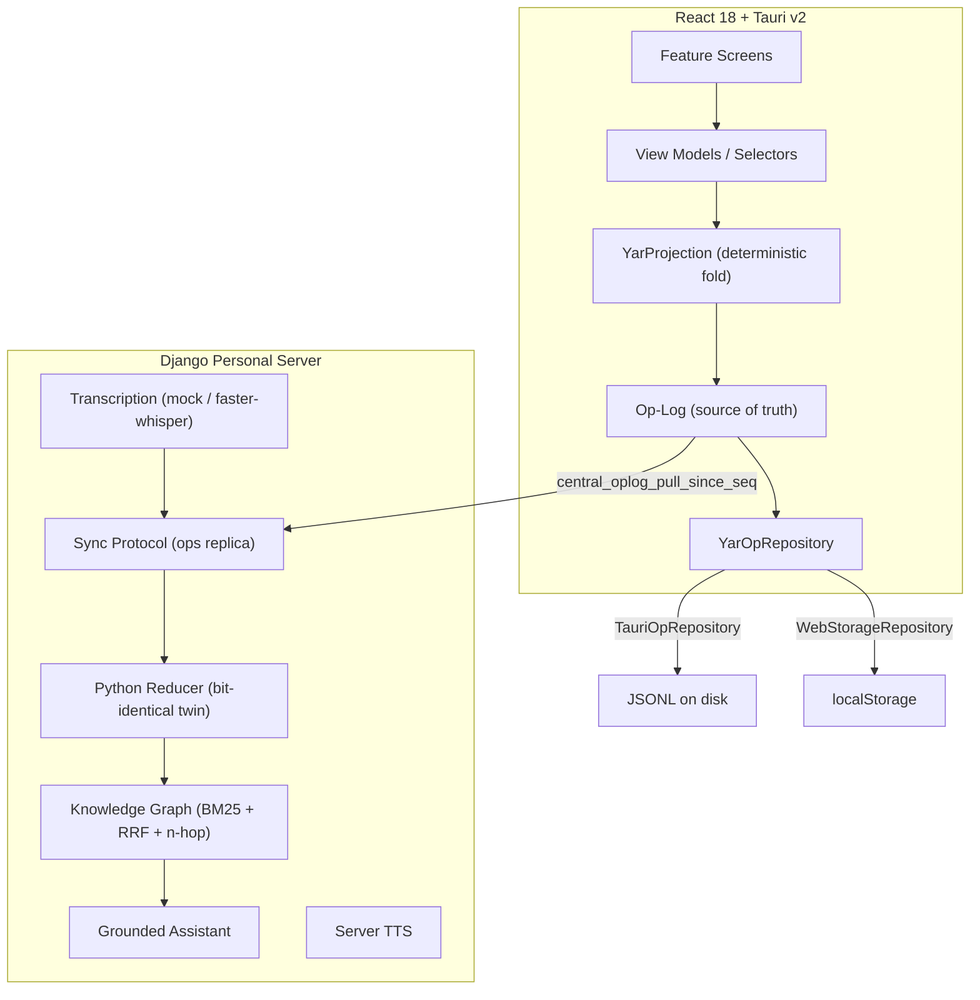
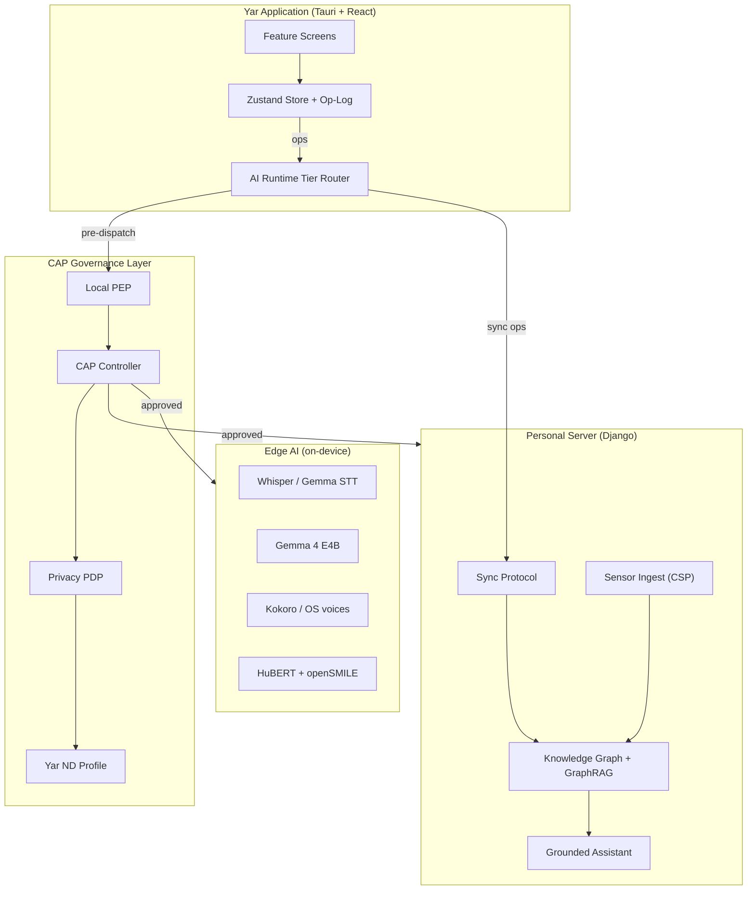
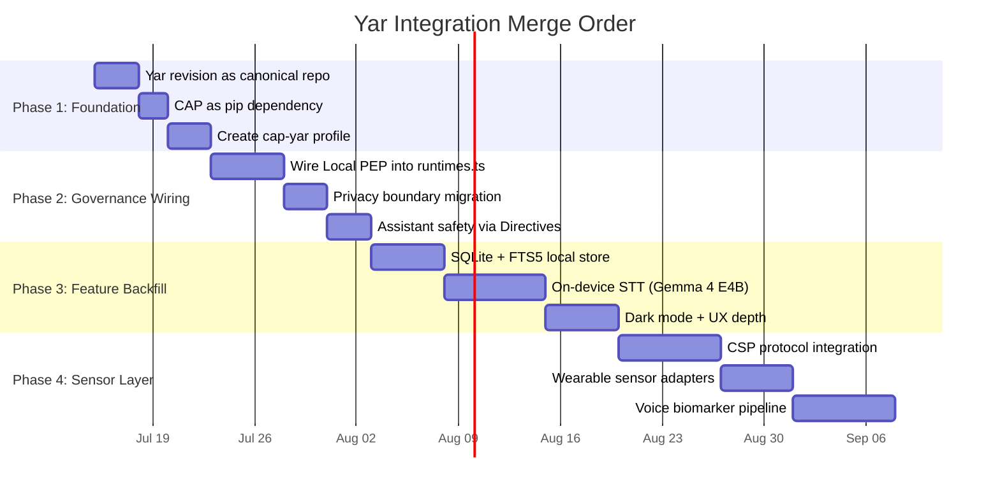

# Yar Integration Plan

> **Status**: Active
> **Date**: 2026-07-10
> **Author**: @shahin
> **Audience**: engineers, stakeholders
> **Tags**: `yar`, `product`
> **Variants**: Technical (this doc) - Readable (Obsidian twin optional, same filename) - Agent (n/a)

**Three codebases need to converge into one product.** This plan maps all 62 Yar features to their implementation status across the Yar revision, Cytoplex (CAP), and the spec corpus, then recommends a merge order, conflict resolution strategy, and test plan.

> [!IMPORTANT]
> **BLUF:** The July 2026 Yar revision ships 22 of 62 features (plus 5 groundwork), covering the entire P1 capture-through-companion wedge. Cytoplex ships CAP v0.1 runtime with v1 scaffolding. The critical integration gap is wiring CAP governance into the Yar runtime, plus the 35 features that remain unstarted. Merge order: Yar revision as the base, CAP as a library dependency, then spec-driven feature backfill.

---

## Table of Contents

1. [Yar Revision Assessment](#1-yar-revision-assessment)
2. [Cytoplex (CAP) Assessment](#2-cytoplex-cap-assessment)
3. [Full Feature Coverage Matrix](#3-full-feature-coverage-matrix)
4. [Integration Architecture](#4-integration-architecture)
5. [Merge Strategy](#5-merge-strategy)
6. [Conflict Assessment](#6-conflict-assessment)
7. [Test Plan](#7-test-plan)
8. [Doc Alignment Tasks](#8-doc-alignment-tasks)
9. [Open Items](#9-open-items)

---

## 1. Yar Revision Assessment

**Source:** `https://github.com/cytognosis/yar_revisions/yar-code-20260705-2354/`

### 1.1 Architecture Overview

The Yar revision is a **Tauri v2 + React 18 + Django** application following a strict op-log-first architecture. Key properties:

- **Op-log as source of truth.** UI dispatches domain operations; databases are projections. No UI module imports a database name.
- **Deterministic reducer.** TypeScript and Python reducers produce bit-identical projection hashes (verified cross-language in tests).
- **Three-tier AI runtime.** STT, LLM, and TTS each independently configurable across device/laptop/server tiers.
- **Content-addressed blob store.** Voice notes archived by SHA-256 hash.
- **Sync protocol.** `central_oplog_pull_since_seq` implemented and tested with idempotency, cursor, tie-breaking, tombstone races, and projection-hash convergence.

### 1.2 Verification Status

| Component | Test Suite | Result |
|-----------|-----------|--------|
| Frontend | `tsc --noEmit` + `vite build` | Clean |
| Backend | `manage.py test` | 34/34 pass |
| E2E (Chromium) | Playwright | 29/29 pass |
| Desktop shell | `npm run tauri dev` | Compiled + ran (macOS, user-verified) |
| Visual QA | Screenshot set | Reviewed, defects fixed in-pass |

### 1.3 Feature Implementation Summary

From `REQUIREMENTS_COVERAGE.md`:

| Status | Count | Feature IDs |
|--------|:-----:|-------------|
| **Shipped** | 22 | F01, F02, F03, F04, F05, F06, F07, F08, F11, F14, F15, F16, F17, F27, F31, F32, F39, F44, F52, F53, F58 (lite), F60 (chat side) |
| **Groundwork** | 5 | F13, F57, F59, F60 (map editing), F54 (placeholder by design) |
| **Infrastructure shipped** | 2 | F18 (privacy/consent UI), F52 (op-log + projections + search) |
| **Not started** | 33 | Remaining features |

### 1.4 Known Remaining Items (from NEXT_STEPS.md)

| Priority | Item | Seam |
|----------|------|------|
| 0 | E2E-encrypt op payloads, real embedder, FalkorDB adapter | `backend/` |
| 1 | Desktop shell hardening, icons, native save dialog | Tauri |
| 2 | SQLite + FTS5 local store (replace JSONL) | `src-tauri/commands.rs` |
| 3 | Tauri-side audio capture + on-device STT | `capture.created` |
| 4 | Background sync, P2P version-vector, blob sync | `store.ts` + `backend/sync` |
| 5 | On-device AI runtime (Gemma-class), generative map reviewer | F13/F31/F60 |
| 6 | Dark mode, drag-to-place, notifications, companion trust arc | UX depth |
| 7 | Vitest, ESLint, CI, iOS/Android shells | Quality infra |

---

## 2. Cytoplex (CAP) Assessment

**Source:** `https://github.com/cytognosis/cytoplex`

### 2.1 What CAP Is

CAP (Control Authority Protocol) is a **runtime supervisory control plane** for agentic systems. It sits above A2A, MCP, HTTP, gRPC, and policy engines, adding explicit authority, evidence references, privacy boundaries, streaming interruption, typed refusal, execution reporting, audit, and provenance.

### 2.2 Implementation Status

| Area | Status |
|------|--------|
| CAP v1 architecture baseline | Documented |
| 11 core schemas | Implemented |
| gRPC + HTTP/JSON bindings (v1 CAPEnvelope) | Implemented |
| V1-C01..V1-C15 conformance | Release-blocking |
| 15-case Therapist/Supervisor scenario | Implemented |
| Federated registries | Reference service |
| Biscuit-v2 warrants, SPIFFE SVID, RFC 8785 JCS | Scaffold + tests |
| Phase 3 capabilities | Deterministic scaffolds |
| Phase 4 readiness packets | Ready |
| Production deployment | **Not claimed** |

### 2.3 Key Runtime Components (60+ Python modules)

| Component | Module | Purpose |
|-----------|--------|---------|
| Controller | `runtime/controller.py` | Intent formation, orchestration |
| Local PEP | `runtime/local_pep.py` | Local policy enforcement |
| Edge PEP | `runtime/edge_pep.py` | Boundary enforcement |
| Privacy PDP | `runtime/privacy_pdp.py` | Structured privacy decisions |
| Supervisor Gateway | `runtime/supervisor_gateway.py` | Authority gateway |
| Session Router | `runtime/session_router.py` | Session management |
| Redaction | `runtime/redaction.py` | Local NER redaction |
| Retention | `runtime/retention.py` | TTL deletion |
| Embeddings | `runtime/embeddings.py` | Text/voice embedding |
| Substrate Interop | `runtime/substrate_interop.py` | MCP/A2A interop |
| Lifecycle | `runtime/lifecycle.py` | FSM/profile-inheritance |
| Observability | `runtime/observability.py` | OpenTelemetry sinks |
| Profiles | `profiles/cap_med.py`, `cap_swe.py` | Domain profiles |

### 2.4 What is NOT Yet in Cytoplex

- **No Yar-specific profile.** The Therapist/Supervisor scenario is the motivating example, but no `cap_yar.py` profile exists.
- **No integration with Yar's op-log.** CAP Directives and ExecutionReports do not flow through `YarOperation`.
- **No runtime bridge.** The Yar revision's `runtimes.ts` routes AI calls directly; CAP's Controller/PEP/PDP pipeline is not wired in.
- **Most docs are redirect stubs.** `CAP_FINAL_STATUS.md`, `CAP_RELEASE_GATES.md`, `CAP_IMPLEMENTATION_ALIGNMENT.md` all point to the central docs repo.

---

## 3. Full Feature Coverage Matrix

All 62 features from the v4 comparison mapped to implementation status across all three codebases.

**Legend:**
- **S** = Shipped in Yar revision
- **G** = Groundwork (seam/data model exists)
- **P** = Placeholder by design
- **C** = CAP provides governance for this feature
- **Spec** = Formal spec exists
- **--** = Not started

### 3.1 AEF: Attention Regulation and Executive Function (15 features)

| ID | Feature | Yar Rev | CAP | Spec | Priority |
|----|---------|:-------:|:---:|:----:|:--------:|
| F01 | Voice brain dump | **S** | -- | -- | P1 |
| F02 | Brain dump to action plan | **S** | -- | -- | P1 |
| F03 | Tasks from your words | **S** | -- | -- | P1 |
| F04 | Right-sized task breakdown | **S** | -- | -- | P1 |
| F06 | Focus companion / body doubling | **S** | -- | -- | P1 |
| F07 | Flexible plan with backup | **S** | -- | -- | P1 |
| F20 | Single-task focus mode | -- | -- | -- | P2 |
| F21 | Graceful activity pause | -- | -- | -- | P2 |
| F22 | Gentle break prompts | -- | -- | -- | P2 |
| F24 | AI morning plan | -- | -- | -- | P2 |
| F26 | Floating task reminder | -- | -- | -- | P2 |
| F28 | Open data connections (MCP) | -- | C | -- | P2 |
| F32 | Stray thought capture | **S** | -- | -- | P2 |
| F41 | All-in-one ND support app | **G** | -- | -- | P3 |
| F59 | Capture from anywhere (Cytomark) | **G** | -- | -- | P2 |

### 3.2 ERM: Emotional Regulation and Mood (18 features)

| ID | Feature | Yar Rev | CAP | Spec | Priority |
|----|---------|:-------:|:---:|:----:|:--------:|
| F05 | Energy / mood map | **S** | -- | -- | P1 |
| F08 | Mood tag on tasks | **S** | -- | -- | P1 |
| F11 | Companion style / voice | **S** | -- | Personas | P1 |
| F17 | Private space before planning | **S** | -- | Privacy | P1 |
| F18 | Safety and consent layer | **S** | **C** | CAP specs | P3 |
| F19 | On-device private AI | **G** | C | Edge-AI | P3 |
| F27 | Rest day support | **S** | -- | -- | P2 |
| F29 | Companion that learns your style | -- | -- | Personas | P2 |
| F35 | Energy check before saying yes | -- | -- | -- | P2 |
| F38 | No-penalty plan change | -- | -- | -- | P2 |
| F40 | Voice wellbeing signals | -- | C | Sensor-speech | P3 |
| F44 | Streaks that honor rest | **S** | -- | -- | P3 |
| F45 | Mood-matched companion | -- | -- | Personas | P3 |
| F48 | Gentle reset after hard day | -- | -- | -- | P3 |
| F49 | Your week as a story | -- | -- | -- | P3 |
| F53 | Morning check-in | **S** | -- | -- | P1 |
| F54 | Voice mood awareness | **P** | C | Sensor-speech | P1 |
| F57 | Adaptive companion / trust | **G** | C | Personas | P1 |

### 3.3 SCI: Social Communication and Interaction (4 features)

| ID | Feature | Yar Rev | CAP | Spec | Priority |
|----|---------|:-------:|:---:|:----:|:--------:|
| F25 | Pre-send tone check-in | -- | C | -- | P2 |
| F36 | Co-planning with trusted person | -- | C | -- | P2 |
| F42 | Two-way communication bridge | -- | C | Social-int | P3 |
| F56 | Social connections and mood | -- | C | Social-int | P2 |

### 3.4 SPR: Sensory Processing and Regulation (2 features)

| ID | Feature | Yar Rev | CAP | Spec | Priority |
|----|---------|:-------:|:---:|:----:|:--------:|
| F23 | Read-aloud with highlighting | -- | -- | -- | P2 |
| F37 | Gentle context change cues | -- | -- | -- | P2 |

### 3.5 CTO: Cognitive Style and Thought Organization (13 features)

| ID | Feature | Yar Rev | CAP | Spec | Priority |
|----|---------|:-------:|:---:|:----:|:--------:|
| F09 | Structured note types | -- | -- | -- | P1 |
| F10 | Saved smart searches | -- | -- | -- | P1 |
| F13 | Voice-grown thought map | **G** | -- | -- | P1 |
| F14 | Thought placement assistant | **S** | -- | -- | P1 |
| F15 | Spatial thought map view | **S** | -- | -- | P1 |
| F16 | Open export | **S** | -- | -- | P1 |
| F31 | Thought map reviewer | **S** | -- | -- | P2 |
| F33 | Your personal vocabulary | -- | -- | -- | P2 |
| F34 | Map to document transform | -- | -- | -- | P2 |
| F47 | Untangling parallel thoughts | -- | -- | -- | P3 |
| F50 | Highlight and link (Cytomark) | -- | -- | -- | Infra |
| F51 | Open schema translation | -- | -- | -- | Infra |
| F52 | Private local knowledge store | **S** | -- | Storage | Infra |
| F58 | Personal NER | **S** | -- | -- | P1 |
| F60 | Conversational thought map | **G/S** | C | -- | P1 |
| F61 | Thought to document templates | -- | -- | -- | P2 |

### 3.6 SMI: Self-Monitoring and Interoception (7 features)

| ID | Feature | Yar Rev | CAP | Spec | Priority |
|----|---------|:-------:|:---:|:----:|:--------:|
| F12 | Open sensor connection (CSP) | -- | C | CSP | P1 |
| F30 | Wearable sensor connection | -- | C | Sensor-phys | P2 |
| F39 | Personalized gentle nudges | **S** | -- | -- | P2 |
| F43 | Layered wellbeing dashboard | -- | -- | Neuro-axes | P3 |
| F46 | Brain sensor connection | -- | C | -- | P3 |
| F55 | Custom tracking axes | -- | C | Neuro-axes | P1 |
| F62 | Opt-in self-assessment tools | -- | C | -- | P2 |

### 3.7 Implementation Summary

| Status | Count | Percentage |
|--------|:-----:|:----------:|
| Shipped in Yar revision | 22 | 35% |
| Groundwork / placeholder | 5 | 8% |
| CAP governance relevant | 14 | 23% |
| Has formal spec | 12 | 19% |
| Completely unstarted | 33 | 53% |

---

## 4. Integration Architecture

### 4.1 Target Architecture

### 4.2 Integration Points

| Integration Point | Current State | Target State |
|-------------------|---------------|--------------|
| AI calls | `runtimes.ts` routes directly to endpoints | Route through CAP Local PEP before dispatch |
| Privacy settings | Op-log `settings.updated` + `privacy.json` mirror | CAP `PrivacyBoundary` objects govern; op-log stores consent records |
| Sensor data | Not implemented | CSP protocol via CAP-governed ingest pipeline |
| Assistant safety | Hard-coded safety prompt | CAP Directive with safety constraints + GuardDecision |
| Sync payloads | Plaintext ops | E2E encrypted via CAP key management |
| Multi-agent | Not implemented | CAP Controller orchestrates Therapist/Supervisor pattern |

---

## 5. Merge Strategy

### 5.1 Recommended Merge Order

### 5.2 Phase Details

#### Phase 1: Foundation (1 week)

1. **Adopt Yar revision as the canonical Yar repo.** The `yar-code-20260705-2354` directory becomes the new `main` branch of `https://github.com/cytognosis/Yar`.
2. **Add Cytoplex as a pip dependency** in `backend/requirements.txt`. Import `cap_protocol` in Django.
3. **Create `cap_yar` profile** in Cytoplex: a Yar-specific ND profile inheriting from the Therapist/Supervisor scenario with Yar-specific constraints (non-diagnostic, non-clinical language, person-first).

#### Phase 2: Governance Wiring (2 weeks)

4. **Wire Local PEP into `runtimes.ts`.** Every AI call (STT, LLM, TTS) passes through CAP Local PEP before dispatch. The PEP applies privacy, redaction, and safety policies.
5. **Migrate privacy settings to CAP PrivacyBoundary.** The op-log `settings.updated` ops that govern privacy become CAP `PrivacyBoundary` objects. The `privacy.json` mirror becomes a CAP-formatted document.
6. **Route assistant safety through Directives.** Replace the hard-coded safety prompt with a CAP Directive containing safety constraints. The grounded assistant becomes a CAP Executor that checks authority before responding.

#### Phase 3: Feature Backfill (3 weeks)

7. **SQLite + FTS5 local store** replacing JSONL. Use rusqlite in Tauri commands. Projection cache table for fast cold starts.
8. **On-device STT.** Bundle Gemma 4 E4B via LiteRT-LM. Wire into the existing `capture.created` operation flow.
9. **Dark mode + UX depth.** Flip `themeMode`, add drag-to-place on map, OS notifications (opt-in).

#### Phase 4: Sensor Layer (3 weeks)

10. **CSP protocol integration.** Implement `SPEC-CSP.md` with CAP-governed sensor ingest. Start with self-report axes (F55).
11. **Wearable sensor adapters.** HRV/sleep from Apple Health, Oura, Fitbit via the CSP adapter pattern.
12. **Voice biomarker pipeline.** HuBERT-large + openSMILE eGeMAPSv02 parallel sensor, producing `VocalBiomarkerFrame` records under CAP governance.

---

## 6. Conflict Assessment

### 6.1 Code-Level Conflicts

| Area | Risk | Mitigation |
|------|:----:|------------|
| **Python reducer vs. CAP runtime** | Low | They operate at different layers: reducer folds ops, CAP governs actions. No overlap. |
| **Privacy model** | Medium | Yar uses op-log `settings.updated`; CAP uses `PrivacyBoundary` objects. Phase 2 migrates. |
| **Assistant safety** | Medium | Hard-coded prompt vs. CAP Directive. Phase 2 replaces. |
| **Storage engine** | Low | Yar uses SQLite/FTS5; CAP has no storage opinion. No conflict. |
| **AI routing** | Medium | `runtimes.ts` direct routing vs. CAP PEP pipeline. Phase 2 wraps. |
| **Schema naming** | Low | Yar uses `YarOperation` types; CAP uses `CAPEnvelope`. Different namespaces. |

### 6.2 Architectural Conflicts

| Conflict | Severity | Resolution |
|----------|:--------:|------------|
| **Op-log vs. CAP event model** | Medium | CAP Directives/Reports become a *parallel stream*, not ops. The op-log stays as the user-data source of truth; CAP events are governance metadata. |
| **Substrate naming** | Low | Rename `substrate_interop.py` per D1/G1 from feature comparison. Use "protocol" or "layer." |
| **CapLiteGuard divergence** | Medium | Reconcile per open item from YAR_CONSOLIDATION_PLAN.md. The Yar profile should inherit from CapLite, not CapFull. |
| **React 18 vs. CAP (Python)** | None | Different runtimes. CAP is backend-only; frontend is unaffected. |

### 6.3 Dependency Conflicts

| Dependency | Yar | CAP | Resolution |
|------------|-----|-----|------------|
| Python | 3.12+ (Django) | 3.12+ | Compatible |
| Node.js | 20+ (Vite/Tauri) | N/A | No conflict |
| Rust | Tauri v2 | N/A | No conflict |
| SQLite | Device store | N/A | No conflict |
| FalkorDB | GraphRAG seam | N/A | No conflict |

---

## 7. Test Plan

### 7.1 Per-Phase Test Strategy

| Phase | Test Type | Criteria |
|-------|-----------|----------|
| **1: Foundation** | Existing suites pass | Backend 34/34, E2E 29/29, CAP conformance V1-C01..C15 |
| **2: Governance** | Integration tests | AI calls routed through PEP; privacy settings reflected as PrivacyBoundary; assistant refuses without valid Directive |
| **3: Backfill** | Feature tests | SQLite cold-start < 200ms; on-device STT produces transcript; dark mode renders all screens |
| **4: Sensors** | Sensor pipeline tests | CSP adapter delivers data; wearable sync produces ops; biomarker frames validate against schema |

### 7.2 Regression Test Matrix

| Existing Test | Phases 1-2 | Phase 3 | Phase 4 |
|---------------|:----------:|:-------:|:-------:|
| `tsc --noEmit` | Must pass | Must pass | Must pass |
| `vite build` | Must pass | Must pass | Must pass |
| `manage.py test` (34) | Must pass | Extend to 40+ | Extend to 50+ |
| E2E Playwright (29) | Must pass | Add 5 dark-mode | Add 3 sensor |
| CAP conformance | Must pass | Must pass | Must pass |
| Cross-language hash convergence | Must pass | Must pass | Must pass |

### 7.3 New Tests Required

| Test | Phase | Validates |
|------|-------|-----------|
| `test_cap_pep_intercepts_ai_call` | 2 | Local PEP receives and evaluates every AI dispatch |
| `test_privacy_boundary_propagates` | 2 | PrivacyBoundary changes reflect in PEP behavior within 1 op |
| `test_assistant_refuses_without_directive` | 2 | Assistant returns typed refusal when no valid Directive exists |
| `test_sqlite_migration_from_jsonl` | 3 | All existing JSONL ops import into SQLite; projection hash matches |
| `test_on_device_stt_produces_transcript` | 3 | Gemma 4 E4B produces non-empty transcript from test audio |
| `test_csp_adapter_delivers_data` | 4 | Mock sensor adapter delivers typed data through CSP pipeline |
| `test_vocal_biomarker_schema` | 4 | HuBERT output validates against `VocalBiomarkerFrame` schema |

---

## 8. Doc Alignment Tasks

### 8.1 Redirect Stubs in `Yar/docs/` (46 files)

The `https://github.com/cytognosis/Yar/tree/main/docs` directory contains 46 files, most of which are substantive docs (not redirect stubs). These need updating:

| Category | Count | Action |
|----------|:-----:|--------|
| Architecture docs (`ARCHITECTURE.md`, `architecture/`) | 5 | Update to reference new Yar revision architecture |
| MVP planning docs (`planning/mvp/`) | 13 | Mark superseded by Yar revision (which ships the MVP) |
| Reports (`reports/`) | 7 | Keep as historical; add superseded headers where applicable |
| Research (`research/`) | 3 | Keep current; cross-link to new feature-research docs |
| Submission docs (`submission/`) | 11 | Keep current; these are presentation materials |
| Integration docs (`integrations/`) | 2 | Update Anytype status (rejected for long-term per substrate analysis) |
| Checkpoint docs (`checkpoint/`) | 1 | Keep as historical |

### 8.2 Specs Needing Revision

| Spec | Issue | Action |
|------|-------|--------|
| `SPEC-storage-engine.md` | Needs benchmark numbers incorporated (O-3 item) | Import results from `BENCHMARK-evaluation-and-results.md`; already promoted to ACTIVE v0.2 |
| `SPEC-multi-agent.md` | CapLiteGuard architectural divergence | Reconcile with Yar revision's actual multi-tier runtime |
| `SPEC-CSP.md` | Missing cytos KG schema | Add schema reference; coordinate with Cytos project |
| `SPEC-sync-protocol.md` | Data-sovereignty content needs extraction | Create `SPEC-data-sovereignty.md` per consolidation plan item 5 |
| `SPEC-personas-voice.md` | Gemma 4 cascade is the new recommendation | Update voice-model section to reflect July evaluation verdict |

### 8.3 New Specs Needed

| Spec | Priority | Scope |
|------|----------|-------|
| `SPEC-data-sovereignty.md` | High | Solid TR ledger, PQC (ML-KEM/ML-DSA), encryption-at-rest, no-blockchain decision, confidential compute watch |
| `SPEC-cytomark.md` (F59) | High | Browser extension for capture-from-anywhere (highest-value unbuilt surface per G2) |
| `SPEC-vocal-biomarker-schema.md` | Medium | VocalBiomarkerFrame, SessionVocalProfile, ADHDVocalMarkers, ASDVocalMarkers |
| `SPEC-cap-yar-profile.md` | Medium | Yar-specific CAP profile (non-diagnostic, ND-first, person-first constraints) |

---

## 9. Open Items

### 9.1 From YAR_CONSOLIDATION_PLAN.md (Unresolved)

| Item | Status | Next Step |
|------|--------|-----------|
| Incorporate benchmark numbers into SPEC-storage-engine | **Partially done** (v0.2 promoted) | Verify latest benchmark data is cited |
| Reconcile CapLiteGuard in SPEC-multi-agent | **Open** | Align with Yar revision's 3-tier runtime model |
| Add cytos KG schema to SPEC-CSP | **Open** | Coordinate with Cytos project |
| Create SPEC-data-sovereignty.md | **Open** | Pull Solid TR ledger from SPEC-sync-protocol SS5; add PQC |
| Standardize CAP expansion | **Open** | Adopt "Control Authority Protocol" everywhere |

### 9.2 Critical Decisions Required

| Decision | Options | Recommendation |
|----------|---------|----------------|
| **D-Int-1:** Yar revision as canonical repo | Merge into existing Yar repo vs. replace | **Replace.** The revision is a complete rewrite with full test coverage. Existing repo is mostly stubs. |
| **D-Int-2:** CAP integration depth at MVP | Full CAP pipeline vs. CAP-Lite shim | **CAP-Lite shim first.** Wire Local PEP only; defer Controller/Supervisor to Wave 2. |
| **D-Int-3:** Storage migration strategy | Big-bang SQLite migration vs. dual-path | **Dual-path.** Keep JSONL as fallback; add SQLite as primary. Migration tool converts. |
| **D-Int-4:** Voice model for day-one | Gemma 4 E4B vs. Whisper-only cascade | **Whisper cascade for day-one** (proven, lighter). Gemma 4 for Wave 2 voice features. |

### 9.3 Blocked Items

| Item | Blocked By | Impact |
|------|------------|--------|
| Tauri desktop build verification | Rust toolchain in dev environment | Cannot ship desktop builds until verified |
| 1M-record benchmark | Docker resource limits | SurrealDB large-scale verdict deferred |
| scispaCy NER models | Python 3.13 incompatibility | Papers pipeline uses fallback NER |
| iOS/Android shells | Desktop shell must settle first | Mobile app deferred |

---

## Appendix A: Codebase File Counts

| Codebase | Source Files | Test Files | Doc Files |
|----------|:-----------:|:----------:|:---------:|
| Yar revision | 15 TS + 4 Rust + 1 Python backend | 6 Playwright specs | 4 (README, ARCH, IMPL, NEXT) |
| Cytoplex (CAP) | 60+ Python modules | 60+ pytest tests | 40+ docs (many redirect stubs) |
| Yar docs (original) | -- | -- | 46 files |
| Consolidated Yar docs | -- | -- | 68 files |

## Appendix B: Feature ID Quick Reference

| Domain | IDs | Count |
|--------|-----|:-----:|
| AEF (Attention/Executive) | F01-F04, F06-F07, F20-F22, F24, F26, F28, F32, F41, F59 | 15 |
| ERM (Emotional/Mood) | F05, F08, F11, F17-F19, F27, F29, F35, F38, F40, F44-F45, F48-F49, F53-F54, F57 | 18 |
| SCI (Social/Communication) | F25, F36, F42, F56 | 4 |
| SPR (Sensory/Processing) | F23, F37 | 2 |
| CTO (Cognitive/Thought) | F09-F10, F13-F16, F31, F33-F34, F47, F50-F52, F58, F60-F61 | 16 |
| SMI (Self-Monitoring) | F12, F30, F39, F43, F46, F55, F62 | 7 |
| **Total** | | **62** |
