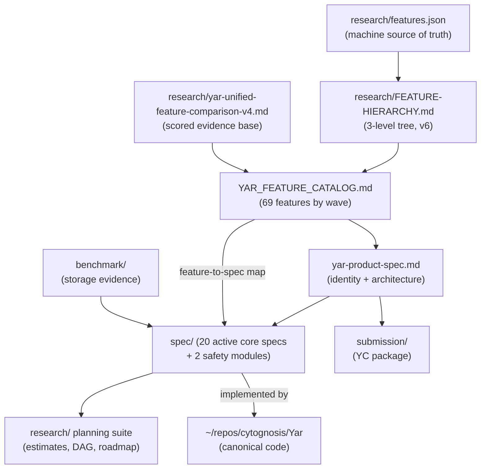

> **Status**: Active
> **Date**: 2026-07-19
> **Author**: @mohammadi
> **Audience**: engineers, stakeholders, funders
> **Tags**: `yar`, `cytonome`, `index`, `master`

# Yar Documentation Pillar: Master Index

**BLUF:** Yar (Your AI Representative) is Cytonome v0.1, a local-first, voice-aware, fully free cognitive companion built by and for neurodivergent adults. This is the master index for every current doc in this pillar: what each represents, where it lives, and how they relate. As of 2026-07-19 the pillar is fully consolidated: 69 features, 20 active core specs, refreshed planning, superseded docs removed (git history retains them).

**If you only read one thing:** the Start-here table below. **ADHD-friendly twin:** [`README.adhd.md`](./README.adhd.md).

## Start here

| You want... | Read |
|---|---|
| What Yar is (product, architecture, safety, positioning) | [`yar-product-spec.md`](./yar-product-spec.md) |
| Every feature, by build wave | [`YAR_FEATURE_CATALOG.md`](./YAR_FEATURE_CATALOG.md) |
| The engineering specs | [`spec/README.md`](./spec/README.md) |
| Effort, dependencies, timeline | [`research/YAR-WAVE-ROADMAP.md`](./research/YAR-WAVE-ROADMAP.md) |
| YC reviewer path | [`submission/README.md`](./submission/README.md) |

## How the docs relate

The chain to trust: **features.json** is the machine source of truth for the taxonomy; **YAR_FEATURE_CATALOG.md** is the human front door; **yar-product-spec.md** is the product identity; **spec/** holds per-area engineering depth; **research/** holds the evidence and the plan.

## Identity and product (top level)

| File | What it represents |
|---|---|
| [`yar-product-spec.md`](./yar-product-spec.md) | Canonical product spec: what Yar is, who it serves, architecture, flagship pillars, feature catalog summary, safety (CAP), positioning (15 sections) |
| [`yar-product-spec_prompt.md`](./yar-product-spec_prompt.md) | Self-contained agent brief; hand to a fresh agent picking up Yar |
| [`YAR_FEATURE_CATALOG.md`](./YAR_FEATURE_CATALOG.md) | Canonical 69-feature index (F01-F69) by build wave, IPS scores, F24 interactive-refinement extension, feature-to-spec map |
| [`INTEGRATION_PLAN.md`](./INTEGRATION_PLAN.md) | Codebase integration plan reconciling this pillar with the Yar code repo and Cytoplex |
| [`DATA-MOVED.md`](./DATA-MOVED.md) | Pointer: feature/prioritization CSV tables live in the datasets tree |
| [`sensor-ecosystem.md`](./sensor-ecosystem.md) | Sensor plug-in ecosystem for CSP (product-facing; engineering equivalent is `spec/SPEC-CSP.md`) |
| [`sensor-architecture.md`](./sensor-architecture.md) | Plain-language summary of the sensor architecture layer (sensing science itself is Cytoscope-owned) |
| [`simple/README.md`](./simple/README.md) | One-minute plain-language pointer into the technical docs |
| [`steering/yar-product.md`](./steering/yar-product.md) | Product steering notes (the structure/tech steering twins were superseded and removed 2026-07-19) |

## Features and research (`research/`)

Full index: **[`research/README.md`](./research/README.md)**. Highlights: the canonical feature chain (features.json, hierarchy v6, comparison v4, CSV, interactive tree in `assets/viz/`), the 2026-07-19 Wave 0 planning suite (verification, specs inventory, effort, dependency DAG, roadmap, agent-productivity evidence), feature research and naming, decision records, and the persona-profiler references.

## Specs (`spec/`)

Full index: **[`spec/README.md`](./spec/README.md)**. 20 active core specs (all founder-approved 2026-07-19) plus 2 design-final safety modules (privacy boundary, crisis detection; deferred post-YC) and the storage/sync session artifacts. The 2026-07-19 Wave 0 suite: sync protocol (any-sync transport-only + Loro), PeT long-term memory (bitemporal, converges with cytomem), multi-agent v0.2 (canonical names: Supervisor, Interviewer, Transcriber, Proofreader, Mind-mapper), model routing (simple local-vs-cloud selection; Cactus removed), the three worker specs, browser extension (WADM + Memex parity), multiplatform delivery (Tauri v2 phone + desktop, founder-decided), personas v0.2, and meeting diarization (Phase 0 internal use; counsel review gates public release only).

## Benchmarks (`benchmark/`)

Full index: **[`benchmark/README.md`](./benchmark/README.md)**. Storage/GraphRAG benchmark evidence behind `SPEC-storage-engine`: results (SQLite wins 10k, FalkorDB 100k), prompts catalog, cytomem GraphRAG integration, the SurrealDB PATCH11 verdict and v3.1.5 retest.

## Submission (`submission/`)

Full index: **[`submission/README.md`](./submission/README.md)**. 11 judge-facing YC Summer 2026 documents (overview, architecture, demo script, evaluation, limitations, safety and trust, roadmap, video storyboard), refreshed 2026-07-16 to the Tauri-reality, fully-free model.

## Prompts (`prompts/`)

| File | What it represents |
|---|---|
| [`prompts/daily-anchor-planner.md`](./prompts/daily-anchor-planner.md) | F24 prompt contract: 3 anchors max, no shame, plus the 2026-07-19 interactive refinement loop |
| [`prompts/object-router.md`](./prompts/object-router.md) | Structured capture router prompt |
| [`prompts/communication-translator.md`](./prompts/communication-translator.md) | ND-to-neurotypical communication translator prompt |

## Assets (`assets/viz/`)

[`yar-feature-tree.html`](./assets/viz/yar-feature-tree.html) (interactive radial dendrogram + packed circles over features.json) plus `yar-feature-radial.svg` and `yar-feature-pack.svg`.

## Removed 2026-07-19 (retrievable from git history)

All were explicitly superseded and banner-marked before removal; the pre-removal state is also in the 2026-07-19 backup tar.

| Removed | Why | Current home of the content |
|---|---|---|
| `mvp/` (14 files) | Superseded 2026-07-16 (Anytype/LinkML skeleton-first MVP era) | `yar-product-spec.md` (product) + code repo `ARCHITECTURE.md` (engineering); WADM work re-grounded in `spec/SPEC-browser-extension.md` |
| `steering/yar-structure.md`, `steering/yar-tech.md` | Superseded 2026-07-16 | `yar-product-spec.md` + code repo `ARCHITECTURE.md` |
| `research/yar-framework-assessment_2026-07-16.md` | Recommended Flutter + FRB; overruled by founder decision 2026-07-19 (Tauri v2 phone + desktop) | Decision recorded in `spec/SPEC-multiplatform-delivery.md` Section 3 |

Earlier archive waves (`_archive/` with the pre-v4 comparisons, ADHD spec twins, 2026-06-21 consolidation snapshot, four retired top-level masters) were already removed from disk; git history retains all of them.

## External anchors

| Anchor | Path |
|---|---|
| **Canonical code repo** | `~/repos/cytognosis/Yar` (Tauri v2 + React + Django; private, default `main`) |
| Deprecated code | `~/repos/cytognosis/Yar_old` (do not build on this) |
| Engineering research + sensor specs | `~/repos/cytognosis/docs/04-Engineering/yar/` (EVAL set, deep dives, sensors) |
| Cytoplex (CAP protocol) | `~/repos/cytognosis/docs/03-Products/Cytonome/Cytoplex/` |
| Org interface templates | `~/repos/cytognosis/docs/04-Engineering/interface_and_fabric_design/` |
| cytomem (PeT convergence partner) | `~/repos/cytognosis/cytomem/` |
| Feature/prioritization CSVs | `~/datasets/cytognosis/yar/data/` (see `DATA-MOVED.md`) |
| Meeting-tools landscape research | `~/Claude/Projects/Infrastructure and Tooling/meeting-transcription-tools-landscape-2026-07.md` (referenced by `spec/SPEC-meeting-diarization.md`; org toolchain home `04-Engineering/toolchain/`) |
| Author/working surface | `~/Claude/Projects/Yar/` (durable output is promoted here into this pillar) |
