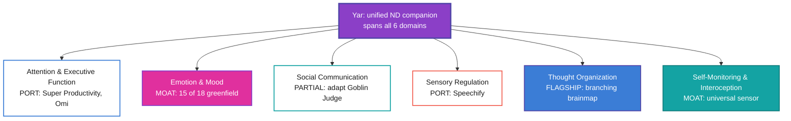

> **Status**: Active
> **Date**: 2026-06-21
> **Author**: @shahin (Cytognosis Foundation)
> **Audience**: stakeholders, founder, product (ADHD-friendly variant)
> **Tags**: `yar`, `feature-matrix`, `neurodiversity`, `adhd-friendly`, `v4`
> **Canonical source**: `yar-unified-feature-comparison-v4.md` (this is the readable twin; content matches)

# Yar Feature Landscape, the Readable Version (v4)

> [!NOTE]
> **TL;DR**: Yar competes in a crowded lane (task and focus apps) and an almost-empty lane (emotional regulation and an adaptive companion). The empty lane is the moat: **28 of 62 features have no competitor at all**, and most of them are emotion and companion features. Build those first, and port the solved stuff (focus timers, supertags, text-to-speech) instead of rebuilding it.

> **Reading time**: ~8 minutes.
> **If you only read one thing**: the **P1 build list** below and the **"Where Yar wins vs. where Yar ports"** table.

**What this doc gives you:**

- [x] One scored list of 62 features across all neurodivergence domains
- [x] A score for how much **AI** helps each feature, and whether anyone already built it
- [x] What to build first, and what to copy instead of reinvent
- [x] The eight features no competitor has

---

## The one-glance picture

| | Where Yar **wins** (build it) | Where Yar **ports** (copy it) |
|---|---|---|
| **Lane** | Emotion, mood, adaptive companion, brainmap, sensors | Focus timers, supertags, text-to-speech, voice capture |
| **Why** | No competitor ships it; AI-native; greenfield | Already solved well by open-source or proprietary leaders |
| **Examples** | Brain Weather, adaptive personas, branching brainmap | Super Productivity, Tana, Speechify, Omi |

> [!IMPORTANT]
> **The big gap = the opportunity.** Across all 18 tools, **emotional regulation is nearly empty**: 15 of 18 emotion features have zero competitor coverage. This is exactly where Yar is strong and where AI helps most. Protect this build time; do not let table-stakes work crowd it out.

---

## The landscape, as a map

---

## Who leads each lane

> [!TIP]
> **Key takeaway:** every lane Yar would "lose" is one to copy, not fight. The leaders are either open-source (port the code) or proprietary (adopt the concept).

| Lane | Leader | Score | What to do |
|---|---|:---:|---|
| Task and focus | Super Productivity | 86 | Port the focus, idle, and break logic (MIT license) |
| Voice capture | Omi AI | 70 | Adopt its open MCP server and pluggable speech-to-text |
| Knowledge and schema | Tana | 61 | Copy the supertag idea on open LinkML, not their schema |
| ND task UX | Goblin Tools | 57 | Adapt the **Judge** tone tool for social calibration |
| Closest to Yar | Saner AI | 63 | Copy the proactive morning-plan model; add the emotion layer it lacks |

---

## The moat: features no one else has

> [!TIP]
> These score highest on AI-Fit (18 to 19 out of 20) **and** have a competitor score of 0. That combination is the definition of a defensible feature.

| Feature | Domain | AI-Fit /20 | Yar status |
|---|---|:---:|---|
| Your energy and mood map | Emotion + sensing | 19 | Planned |
| Mood-matched companion | Emotion | 19 | Planned |
| Voice mood awareness | Emotion | 19 | In progress |
| Voice-grown thought map | Thought org | 19 | Planned |
| Gentle reset after a hard day | Emotion | 19 | Planned |
| Rest day support | Emotion | 19 | Planned |
| Map to document transform | Thought org | 19 | Planned |
| Thought to document templates | Thought org | 19 | Planned |

---

## The eight unique capabilities

| # | Capability | What makes it ours |
|---|---|---|
| CU-1 | Universal sensor system | Open, governed protocol; add any health axis you want |
| CU-2 | Social tracker + communication coach | Links social context to mood; coaches both directions |
| CU-3 | Adaptive personas | Picks the right "voice" for your current mood, on-device |
| CU-4 | Personal-knowledge NER | Learns your names and jargon so transcription stops fighting you |
| CU-5 | Capture-anywhere | Phone, desktop, and a Chrome annotator, one capture layer |
| CU-6 | Conversational mind-mapping | Three agents grow and tidy a thought-tree from your speech |
| CU-7 | Transformation engine | Turns any map or transcript into a real document |
| CU-8 | Self-report tests as sensors | Optional personality and clinical scales feed Brain Weather |

---

## What to build first (P1)

> [!TIP]
> **Key takeaway:** the P1 set is high-impact, high-AI, and mostly greenfield. It is the smallest build that proves the moat.

- **Capture and structure:** Voice brain dump, Brain dump to action plan, Tasks from your words, Right-sized task breakdown, Structured note types, Saved smart searches.
- **Companion and emotion:** Your energy and mood map, Companion style and voice (including Adaptive companion that builds trust), Mood-anchored morning check-in, Voice mood awareness, Mood tag on tasks, Private space before planning, Flexible plan with a backup track, Focus companion and body doubling.
- **Brainmap and knowledge:** Voice-grown thought map, Thought placement assistant, Spatial thought map view, Your data in your own tools, Names and terms you use, Conversational thought map.
- **Sensing:** Open sensor connection layer (CSP), Your custom tracking axes.

That is the full 23-feature P1 set from the formal master; this list now matches it exactly.

---

## Watch-outs (learn from others' scars)

> [!WARNING]
> **Mindstrong died from economics, not bad science.** It relied on insurance reimbursement, positioned itself as replacing care, and scaled passive sensing before it was validated. Yar must not depend on reimbursement, must keep the "assist, never replace" framing, and must keep passive biomarkers in the research track until proven.

> [!WARNING]
> **Plan for the week 4 to 6 drop-off.** Blue Lin's 100-day study shows people disengage once they internalize their patterns, then return later. Shift Yar from daily entry to gentle check-ins and exception-flagging at that point, or it will look like churn.

> [!NOTE]
> **Cite the science carefully.** Brain.fm has only one peer-reviewed study, on ADHD *symptoms* not diagnosis, so never claim strong ADHD evidence. The Chen et al. (2026) CSCW paper supports the social-scaffold and co-regulation ideas; it does not provide a "30 features" list, so do not attribute that count to it.

> [!CAUTION]
> **Two safety gaps block care-adjacent features.** The privacy-boundary schema and the crisis-detection subsystem are not built yet. Both must exist before any therapy-adjacent feature reaches users.

> [!CAUTION]
> **Storage and sync are open decisions.** The local knowledge store (F52), schema mapping (F51), and annotation layer (F50) were previously labeled Built; they are in progress at best. The storage engine (Anytype vs SurrealDB vs other) and cross-node sync protocol have not been selected. Open decisions are tracked in SPEC-storage-engine.md, SPEC-sync-protocol.md, and STORAGE_BENCHMARK_TRACKER.md.

---

## What's next

- Full detail, all 62 scored rows, and methodology: `yar-unified-feature-comparison-v4.md`
- Raw data for sorting and filtering: `yar-feature-matrix-v4.csv`
- Naming fix to apply: adopt **CSP** as the sensor-protocol name; retire "Substrate" in code.

---

<strong>Glossary (plain-language)</strong>

- **AI-Fit /20:** how much AI improves a feature plus how unique, impactful, and buildable it is. Higher is better.
- **Body-doubling:** working next to a presence (real or simulated) to stay on task.
- **Brain Weather:** Yar's at-a-glance view of your focus, energy, mood, sleep, and stress.
- **CAP / CAP-Lite:** the safety rules that keep Yar's AI from overstepping; CAP-Lite is the mobile version.
- **CSP:** Cytonome Sensor Protocol, the open way to plug any sensor into Yar.
- **Double-empathy:** the idea that ND-to-NT miscommunication goes both ways, not one person's fault.
- **Greenfield:** no competitor has built it yet.
- **MCP:** an open standard for connecting tools and data to AI.
- **Supertags:** tags that also give a note structure and fields (Tana's idea).

