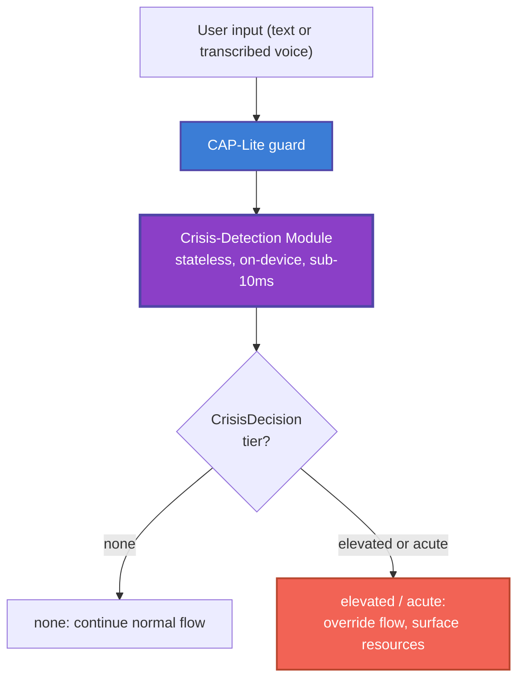

> **Status**: Draft
> **Date**: 2026-06-22
> **Author**: Cytognosis Foundation
> **Audience**: engineers, clinical advisors, counsel, reviewers
> **Tags**: `yar`, `cap`, `crisis-detection`, `safety`, `module-spec`, `adhd-friendly`, `v0`

Technical source: ../MODULE-crisis-detection.md

# 🔍 Crisis-Detection Subsystem

> [!NOTE]
> **TL;DR**: This module detects signals that a person may be in crisis and connects them to human help quickly. It is a hard-coded safety layer that overrides normal app flows when risk is detected. Everything described here is PLANNED; the only shipped protection today is a 22-term keyword gate inside `CapLiteGuard`.
> **Full source**: [MODULE-crisis-detection.md](../MODULE-crisis-detection.md)

**Reading time**: ~6 minutes.

**If you only read one thing**: Section 2, Safety Principles. They are non-negotiable design constraints and require clinical-advisor sign-off before any user-facing release.

> [!CAUTION]
> **Safety-critical system. Implementation is PLANNED.** The only currently built protection is the deterministic `CapLiteGuard` crisis-term gate at `Yar/src/cap/guard.py`, which matches a 22-term English and Farsi keyword list and redirects to 1480 (Iran Social Emergency) and findahelpline.com. Nothing else described here exists as code. Nothing ships to users until a clinical advisor signs off. Crisis content must always defer to professional resources and must never provide means of self-harm. Keep resource pointers (988, local helplines) intact and prominent.

---

## ⚠️ 2. Safety Principles (Non-Negotiable)

> [!IMPORTANT]
> Every requirement in this spec derives from these principles. They reflect established guidance on supporting people in distress.

| Principle | What it means in practice |
|---|---|
| **Augmentation, never replacement** | Yar is not a crisis service or emergency care, and it never presents itself as one |
| **No diagnosis** | The module detects risk signals; it never states or implies a diagnosis |
| **No interrogation** | No risk-assessment questions; express concern and offer resources only |
| **Connect to humans** | The primary action is always a fast path to trained human help |
| **Over-detection bias** | False positive (extra offer of help) is acceptable; missed detection is not |
| **Non-stigmatizing** | Tone stays warm and person-first; never shames, lectures, or gamifies |
| **No false promises** | No claims about confidentiality or authority involvement |

---

## 🔍 1. Purpose and Scope

This module is a standalone, **stateless**, single-responsibility component. It runs **fully on-device** and does not require a network connection to detect risk or display resources.

- **In scope**: detection contract, response actions, resource registry, thresholds, safety requirements.
- **Out of scope**: clinical validation, privacy schema (see [privacy-boundary-spec](../../../Cytoplex/spec/privacy-boundary-spec.md)), claims of clinical efficacy.

> [!NOTE]
> **What is CAP-Lite?** (101)
> The shipped enforcement gate that sits between user input and the rest of the app. It runs the crisis-detection module synchronously on every input, before any other content flow.

---

## 📖 3. Architecture



**Key properties:**
- **Stateless**: no memory of prior inputs
- **Synchronous**: runs before any other content flow
- **Target latency**: under 10 milliseconds
- **No network dependency**: resources display from a local copy

---

## 📖 4. Detection Tiers

> [!WARNING]
> The signal taxonomy below is a starting point requiring clinical-advisor definition. Keyword matching alone is brittle: it misses paraphrase and over-triggers on idiom (for example, "this commute is killing me"). Negation and context handling are required; a clinical advisor must own the final lexicon.

| Tier | Example signal class | Response |
|---|---|---|
| `none` | No risk signal | Continue normal flow |
| `elevated` | Hopelessness or passive-ideation language | Surface supportive resources with a gentle, non-interrogating offer |
| `acute` | Explicit intent or plan language (the current 22-term bilingual direct matches) | Override flow, surface crisis resources, offer one-tap call or text |

**Current shipped state**: 22-term English and Farsi keyword list (for example "end my life", "kill myself", and Farsi equivalents). Paralinguistic signals are explicitly out of v1.

> [!NOTE]
> **What is over-detection bias?** (101)
> Tuning that accepts false positives (showing help to someone who does not need it) to avoid the worse outcome of missing a real crisis signal.

---

## 📖 5. Public API

```text
evaluate(input: UserInput) -> CrisisDecision

CrisisDecision {
  risk_detected: bool
  tier: enum { none, elevated, acute }
  matched_signals: [signal_code]      # codes only, never the matched text
  recommended_actions: [action_code]
}
```

The function returns **codes only**, never the raw matched content, so it composes safely with the privacy-boundary spec.

---

## 📖 6. Response Actions

- **Surface resources first.** On `elevated` or `acute`, interrupt the normal flow and present resources for the active market.
- **One-tap contact.** Provide a one-tap path to call or text the configured hotline.
- **Optional clinician alert.** WHERE the user has opted in, send the minimum-necessary alert per the privacy-boundary spec; never send content.
- **Supportive continuation.** After surfacing resources, continue in a warm, non-clinical tone.
- **No autonomous escalation claims.** The module does not promise contact with authorities and does not claim the conversation is confidential.

---

## 📖 7. Resource Registry

> [!CAUTION]
> Ship ONLY numbers verified for the launch market by a clinical advisor. Do not display an unverified crisis number. The table below is proposed, not approved.

| Market | Proposed resource | Status |
|---|---|---|
| United States | 988 Suicide and Crisis Lifeline (call or text 988); Crisis Text Line (text HOME to 741741) | Verify before ship |
| International | findahelpline.com (global directory, ThroughLine) | Verify coverage per market |
| Iran and other launch markets | Localized, clinically verified numbers | **Unresolved; must be verified, do not guess** |

The registry is data, not code; it can be updated and localized without changing module logic.

---

## 📖 8. Requirements (EARS Notation)

<details>
<summary>🔬 Deep Dive: All 10 EARS Requirements</summary>

| ID | Requirement |
|---|---|
| **CD-1** | THE module SHALL run fully on-device and SHALL NOT depend on network availability to detect risk or display resources |
| **CD-2** | WHEN input matches a configured risk signal, THE SYSTEM SHALL surface crisis resources before continuing any other flow |
| **CD-3** | THE SYSTEM SHALL NOT ask risk-assessment or screening questions; it SHALL express concern and offer resources |
| **CD-4** | THE SYSTEM SHALL NOT state or imply a diagnosis, and SHALL NOT claim to be a crisis service or substitute for emergency care |
| **CD-5** | WHILE in a detected-risk state, THE SYSTEM SHALL continue in a supportive, non-clinical tone and SHALL NOT shame, lecture, or gamify |
| **CD-6** | WHERE the user has opted in to clinician alerting, THE SYSTEM SHALL send only the minimum-necessary alert defined in the privacy-boundary spec |
| **CD-7** | IF the module errors or a signal is ambiguous, THEN THE SYSTEM SHALL fail toward showing resources, not suppress them |
| **CD-8** | THE SYSTEM SHALL NOT make categorical promises about confidentiality or about authority involvement |
| **CD-9** | WHEN surfacing resources, THE SYSTEM SHALL present a one-tap path to call or text the verified hotline for the active market |
| **CD-10** | THE SYSTEM SHALL log crisis events in non-stigmatizing, person-first language, with no PHI or content leaving the device |

</details>

---

## 📖 9. Fail-Safe Behavior

The module fails safe by failing **toward help**. Any internal error, load failure, or ambiguous signal resolves to showing resources, never to suppressing them (CD-7). Resource display must work offline from a local copy of the verified registry.

---

## ⚠️ 10. Open Decisions

| # | Decision | Owner |
|---|---|---|
| 1 | Crisis signal taxonomy and tiers beyond the 22 keywords | Clinical advisor (none contracted yet) |
| 2 | Clinician-alert opt-in mechanics and HIPAA posture | Counsel (Duane Valz) |
| 3 | Verified hotline set per launch market | Product + clinical advisor |
| 4 | Retention of crisis log events under HIPAA and state law | Counsel (Duane Valz) |
| 5 | Who sets the initial threshold before an advisor is contracted | Shahin |
| 6 | Sensitivity and specificity targets and the evaluation set | Clinical advisor |

---

## ➡️ What's Next?

- **Understand the privacy contract**: [privacy-boundary-spec](../../../Cytoplex/spec/privacy-boundary-spec.md) governs what the alert signal may contain.
- **Contract a clinical advisor**: open decisions 1, 3, and 6 block any expansion beyond the current 22-term gate.
- **Legal review**: open decisions 2 and 4 require Duane Valz before enabling clinician alerts.

---

<details>
<summary>📚 Glossary</summary>

| Term | Definition |
|------|-----------|
| **Acute tier** | Explicit intent or plan signals; triggers full resource takeover |
| **Augmentation** | Yar assists and connects to human help; it never replaces care |
| **CAP** | Controller-Authority Protocol; Yar's policy layer that authorizes or blocks actions and data flows |
| **CAP-Lite** | The shipped lightweight enforcement gate that invokes this module |
| **CrossBoundarySignal** | A derived, structured datum permitted to leave the device under consent |
| **Elevated tier** | Hopelessness or passive-ideation signals; triggers a gentle, non-interrogating offer of help |
| **Fail toward help** | On any error, show resources rather than suppress them |
| **Over-detection bias** | Tuning that accepts false positives to avoid missed detections |
| **PHI** | Protected health information |
| **CSP** | Cytognosis Sensor Platform; the on-device universal sensor integration layer |

</details>
