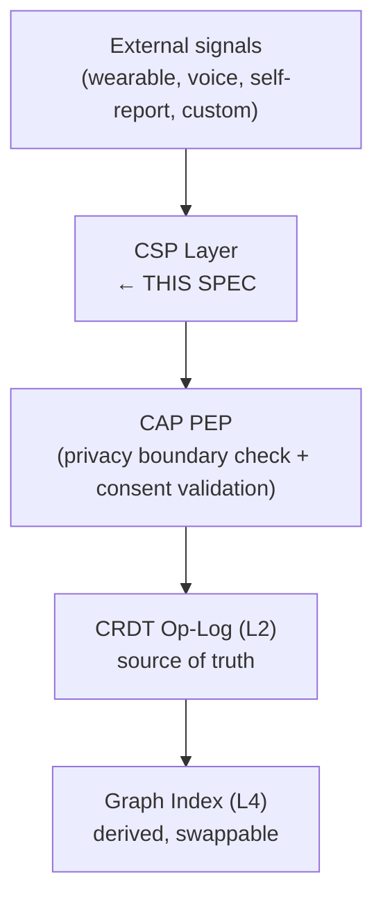
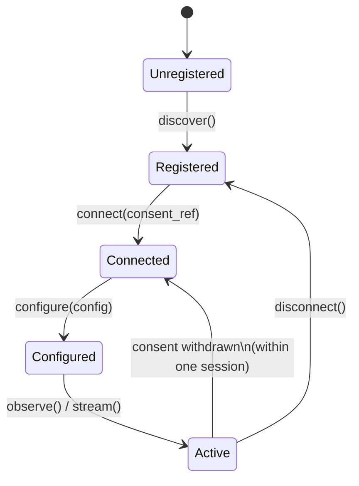

> **Status**: Draft
> **Date**: 2026-06-22
> **Author**: Cytognosis Foundation
> **Audience**: stakeholders, engineers, partner developers
> **Tags**: `yar`, `cytonome`, `csp`, `sensor-protocol`, `adhd-friendly`

# Cytonome Sensor Protocol (CSP)

> [!NOTE]
> **TL;DR**: CSP is the contract every sensor must satisfy to plug into Yar. It defines how adapters register, how data is shaped, and how CAP/Cytoplex governs every observation before it can be stored or cross the privacy boundary.
> **Technical source**: [../SPEC-CSP.md](../SPEC-CSP.md)

**Reading time**: ~7 minutes.

**If you only read one thing**: Section 3 (adapter lifecycle, five phases) and Section 5 (privacy tiers and consent model). These are the two gates every new adapter must satisfy.

---

## 🔍 Overview

**CSP** (Cytonome Sensor Protocol) is the open, **CAP**-governed protocol that lets any sensor or signal source connect to Yar. "Open" means any developer or researcher can build a CSP-compatible adapter using only this spec and the referenced schema files.

CSP sits at the **input boundary** of Yar's data fabric. Nothing enters the system without passing through it.



> [!NOTE]
> **What is CSP?** (101)
> CSP stands for Cytonome Sensor Protocol. It is Yar's "plug standard" for any data source. An adapter is a self-contained module that wraps one sensor (hardware, API, local model, or self-report form) and outputs observations that conform to the CSP schema. The alias USAP (Universal Sensor Adapter Protocol) appeared in older engineering docs and is **deprecated**; use CSP in all new writing and code.

---

## ⚡ Design Goals at a Glance

| Goal | What it means in practice |
|---|---|
| **User sovereignty** | No sensor is mandatory. Users connect and disconnect adapters freely. Data stays on-device unless the user explicitly enables a cross-boundary feature. |
| **CAP governance** | Every adapter is authorized by CAP. No observation enters the op-log without a valid `consent_ref`. |
| **Semantic interoperability** | Observations from an Oura Ring, a voice pipeline, and a user-defined custom axis use the same LinkML/SOSA schema and are query-compatible. |
| **Extensibility** | Users and developers can define new tracking axes (F55). Once registered, custom axes are indistinguishable from built-ins. |

---

## 📖 Adapter Lifecycle: Five Phases

Every CSP adapter passes through exactly five phases. This state machine is normative.



| Phase | Method | What happens |
|---|---|---|
| **Discover** | `discover() -> SensorDescriptor` | Adapter announces itself; returns its descriptor. No data flows yet. Hardware adapters check device availability. |
| **Connect** | `connect(consent_ref: str) -> ConnectionStatus` | Establishes link to signal source; records the consent grant. Fails if consent is missing or mismatched. |
| **Configure** | `configure(config: AdapterConfig) -> ConfigStatus` | Applies axis mapping, sampling rate, privacy-tier overrides. Can be re-applied at runtime without a full disconnect. |
| **Read or Stream** | `observe()` or `stream()` | Adapter emits typed observations referencing the active consent grant. Point-in-time sensors use `observe`; continuous sensors use `stream`. |
| **Disconnect** | `disconnect() -> None` | Severs source connection, flushes pending observations, releases hardware. Pending observations not yet written to op-log are dropped, not queued. |

> [!IMPORTANT]
> If `consent_ref` is withdrawn while the adapter is `active`, the adapter must transition to `connected` and stop emitting observations within one session. This is a hard requirement from the privacy boundary spec (PB-8).

---

## 📖 Adapter Classes and Maturity

| Adapter class | Signal type | Privacy tier | Maturity | Named implementations |
|---|---|---|---|---|
| **Subjective Self-Report** | User-entered scalar or category | `boundary_derived` | **Stable** | Mood check-in (F53) |
| **Validated Instruments** | Scored questionnaire | `clinician_gated` (diagnostic) / `boundary_derived` (severity summary) | **Beta** | ASRS, PHQ-9, GAD-7, BRIEF-A, BIS-11 |
| **Physiological Wearables** | Physiological time-series and daily summaries | `boundary_derived` (summaries) / `on_device_only` (raw waveforms) | **Beta** | Oura Ring, Fitbit, Apple Watch (schema proposed) |
| **Speech and Voice** | Derived acoustic features; never raw audio | `on_device_only` (audio) / `boundary_derived` (derived scalars) | **Research** | HuBERT + openSMILE inference pipeline |
| **Social Interaction** | Call duration, proximity events, social rhythm | `boundary_derived` (summaries) / `on_device_only` (content) | **Research** | AWARE Framework |
| **Future Biosensor** | Neural, optical, or electrical signals | `on_device_only` (raw) / `clinician_gated` (biomarkers) | **Future** | Cytoscope, fNIRS, consumer EEG |

> [!NOTE]
> **What are maturity labels?** (101)
> **Stable** = schema finalized, reference implementation shipped. **Beta** = schema finalized, reference implementation in progress. **Research** = schema draft, inference pipeline under development. **Future** = schema planned, no implementation yet. Maturity labels are honest: do not use a Research-tier adapter in a production context without a confidence fallback.

> [!WARNING]
> The **speech and voice adapter** is Research maturity. The `yar.voice.*` axes carry `quality_flag: research_maturity` until the speech-mentalstate adapter advances to Beta. Axis scoring must handle their absence gracefully; see the missing-modality handling rules in SPEC-neurobehavioral-axes.md.

---

## 📖 Privacy Tiers: Three Levels

Every adapter declares a `privacy_tier` in its `SensorDescriptor`. CAP PEP enforces these at observation emit time.

| Privacy tier | Data class | What may cross the boundary |
|---|---|---|
| `on_device_only` | Device-local | Nothing. Raw audio, transcripts, raw feature vectors, free text, PHI. |
| `boundary_derived` | Crossing allowed under consent | Derived, structured signals only: scalar levels, coded values, opaque hashes, enums. Never raw content. |
| `clinician_gated` | Restricted scope | Same as `boundary_derived`, but only when a clinician integration is active and consented. Requires BAA pathway. |

> [!CAUTION]
> Raw audio is **always** `on_device_only`. The `VoiceAffectPolicy` model (the current reference implementation) hard-rejects any event where `raw_audio_stored = True`. This is not a preference; it is a gate that blocks ingestion.

---

## 📖 Consent Model

CSP uses a **reference-based consent model**. Adapters hold a `consent_ref` ID; the consent grants themselves live outside CSP in the consent layer (L6 of the data fabric).

| Rule | Meaning |
|---|---|
| **Default-deny** | No `consent_ref` = no observations emitted. |
| **Scope specificity** | An Oura adapter with a sleep-data consent grant cannot emit activity-data observations under that grant. |
| **Revocation** | When consent is withdrawn, the adapter stops emitting within one session. Pending observations in the queue are dropped. |
| **Audit** | Every consent check generates a `DecisionRecord` in the local audit log. |

> [!NOTE]
> **What is CAP?** (101)
> CAP is the Cytognosis Authority Protocol. It is the governance layer that decides whether an agent, adapter, or operation is allowed to proceed. **Cytoplex** is the product that houses CAP. "Cognitive Agent Protocol" is an incorrect expansion; never use it. CAP issues `Directive` requests, `GuardDecision` responses, and `DecisionRecord` audit entries.

---

## 📖 User-Extensible Axes (F55)

Users and developers can define new tracking axes. Custom axes are treated identically to built-in axes everywhere in Yar: dashboards, queries, cross-adapter aggregations.

**Registration flow:**

1. Construct a `UserDefinedAxis` record with a unique `axis_id`, display label, domain, and value type.
2. Submit via `register_axis(axis, consent_ref)`. CAP issues a `Directive`; Guard checks for "axis management" consent.
3. On `allow`, the axis is stored as a CRDT operation and immediately queryable.
4. Any adapter listing the new `axis_id` in `axes_produced` automatically populates it.

**Governance rules for custom axes:**

- Custom axes are `on_device_only` by default. The user must explicitly upgrade to `boundary_derived`.
- Custom axis IDs must use `user.<name_slug>` prefix to prevent collision.
- Built-in axes (`yar.*`) are read-only; they cannot be overridden.

**Example: post-meal energy crash axis**

```yaml
axis_id: user.post_meal_energy_crash
axis_label: "Post-meal energy drop"
domain: energy_regulation
value_type: ordinal
range_min: 0
range_max: 4
```

---

## 📖 Decided vs Open

**Decided (stable, do not re-debate):**

| Component | Decision |
|---|---|
| Canonical protocol name | CSP; USAP is a deprecated alias |
| Schema foundation | LinkML with SOSA/SSN alignment; Cytos schema tree is canonical |
| Privacy boundary enforcement | CAP PEP validates every observation before op-log write |
| Consent model | Reference-based; `consent_ref` required at observation level; default-deny |
| Data layer integration | All observations are CRDT operations on the op-log (not direct graph writes) |
| Adapter lifecycle | Five phases: discover, connect, configure, read/stream, disconnect |
| Custom axis namespace | `user.*` for custom; `yar.*` is reserved and read-only |
| Privacy tiers | Three tiers: `on_device_only`, `boundary_derived`, `clinician_gated` |

**Open decisions (need resolution):**

| # | Question | Current leaning |
|---|---|---|
| O-1 | PAP for runtime-updatable adapter policies | Defer to v1 unless modality specs expose a need |
| O-2 | Apple HealthKit adapter schema | Implement once HealthKit FHIR export API is confirmed stable |
| O-5 | Encrypted blob store for `waveform_ref` at L3 | Follows SPEC-sync-protocol.md O-1 and O-4 (iroh-blobs vs any-sync-filenode) |
| O-6 | `VocalBiomarkerFrame` schema finalization | Assigned to SPEC-sensor-speech-mentalstate.md |
| O-8 | Cross-adapter axis aggregation semantics | Assigned to SPEC-neurobehavioral-axes.md |

---

## ➡️ What's Next?

- **Implement a new adapter**: Read the [SensorDescriptor schema](../SPEC-CSP.md#31-sensordescriptor) and follow the five-phase lifecycle. The voice adapter (`Yar/src/yar/models/voice_affect.py`) is the closest working reference.
- **Define a custom axis**: Follow the [user-extensible axis registration flow](../SPEC-CSP.md#72-registration-flow).
- **See how axes become scores**: Read [SPEC-neurobehavioral-axes_adhd.md](./SPEC-neurobehavioral-axes_adhd.md) for the aggregation layer above CSP.

---

<details>
<summary>📚 Glossary</summary>

| Term | Definition |
|---|---|
| **Adapter** | A self-contained CSP-compliant module that wraps a single signal source (hardware sensor, API, local model, or self-report form) and produces typed observations. |
| **AxisRef** | A typed reference to a named tracking axis. Both built-in and user-defined axes use the same `AxisRef` type. |
| **CAP** | Cytognosis Authority Protocol. The governance protocol governing what agents and adapters can do. Implemented in Cytoplex. |
| **CAP-Lite** | The default on-device CAP safety profile for Yar. |
| **CRDT** | Conflict-free Replicated Data Type. The op-log that serves as source of truth for all Yar state. |
| **CSP** | Cytonome Sensor Protocol. The open adapter contract for all sensor integrations. USAP is a deprecated alias; never use it. |
| **Cytoplex** | The Cytognosis product housing CAP. Not synonymous with CAP. |
| **CrossBoundarySignal** | A derived, structured datum permitted to leave the on-device trust zone under consent and PEP validation. |
| **LinkML** | Schema language used to define Yar's data classes; human-readable and machine-validated. |
| **PEP** | Policy Enforcement Point. The CAP/Cytoplex component that validates every observation before it crosses the privacy boundary. |
| **PrivacyTier** | One of three data classifications: `on_device_only`, `boundary_derived`, `clinician_gated`. |
| **SensorDescriptor** | The identity and capability declaration every adapter must register before any data flows. |
| **SOSA/SSN** | W3C Sensor, Observation, Sample, and Actuator ontology. CSP extends SOSA rather than reinventing observation semantics. |
| **USAP** | Deprecated alias for CSP. Do not use in new writing or code. |
| **VoiceAffectPolicy** | The reference consent-attestation model implemented in `Yar/src/yar/models/voice_affect.py`. Hard-rejects raw-audio storage. |

</details>
