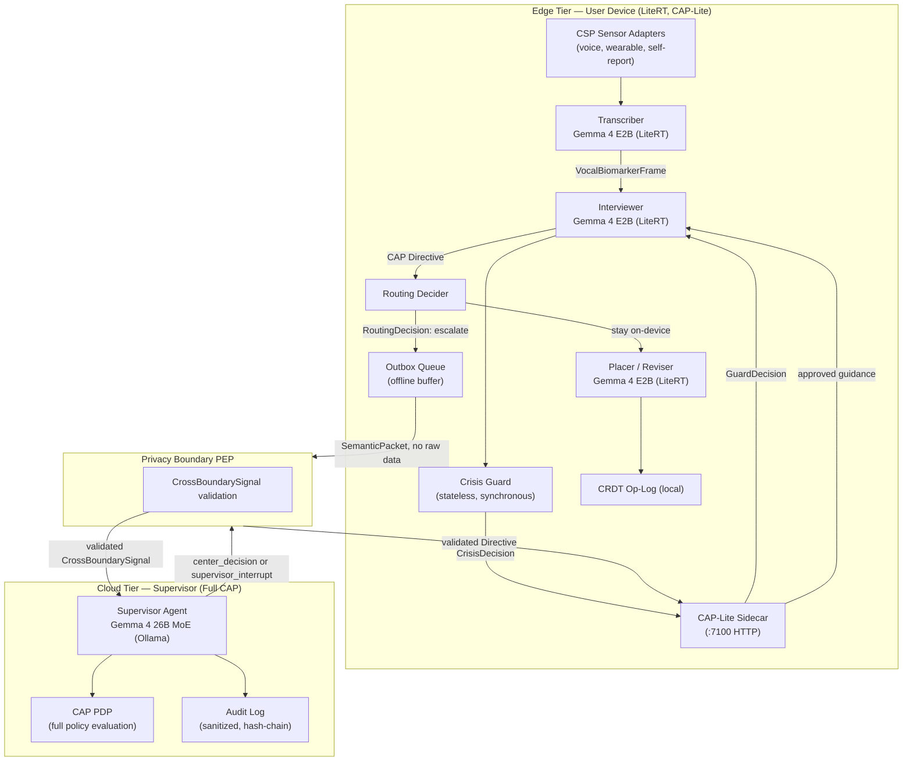
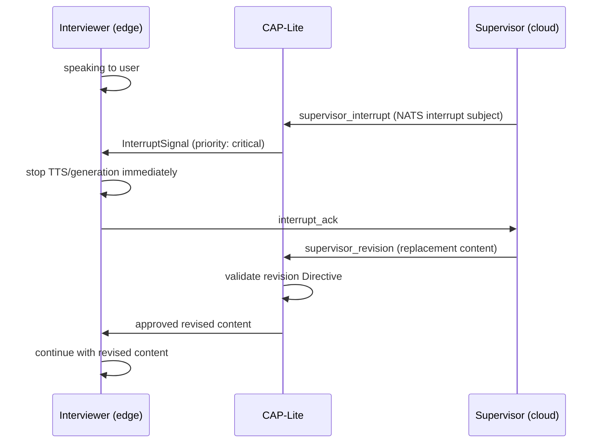

> **Status**: Draft
> **Date**: 2026-06-22
> **Author**: Cytognosis Foundation
> **Audience**: stakeholders, engineers
> **Tags**: `yar`, `edge-ai`, `hybrid`, `cap`, `gemma`, `adhd-friendly`

# Yar Edge-AI and Hybrid Supervisor Architecture

> [!NOTE]
> **TL;DR**: Yar runs all latency-sensitive, privacy-critical computation on-device under CAP-Lite; the cloud supervisor receives only derived semantic packets, never raw data. Every escalation is a declared CrossBoundarySignal crossing, and the default is always on-device.
> **Technical source**: [../SPEC-edge-ai-hybrid.md](../SPEC-edge-ai-hybrid.md)

**Reading time**: ~9 minutes.

**If you only read one thing**: Section 3 (the routing-decision contract) and Section 4 (the handoff protocol). The core invariant: raw audio, raw transcripts, and free text never leave the device. The cloud supervisor controls quality, policy, and safety, but never touches raw data.

---

## ⚡ Implementation Status (Read This First)

> [!IMPORTANT]
> Three components are implemented today. The supervisor and the orchestration runtime are planned.

| Component | Status | Location |
|---|---|---|
| **CapLiteGuard** deterministic gate | **IMPLEMENTED** | `Yar/src/cap/guard.py` |
| **GemmaEdgeIntentService** on-device inference | **IMPLEMENTED** | `Yar/apps/mobile/lib/src/services/gemma_edge_intent_service.dart` |
| **DistilHuBERT-SER** on-device affect inference | **IMPLEMENTED** | `Yar/apps/mobile/lib/src/affect/onnx_distilhubert_ser_inference.dart` |
| Supervisor agent (Gemma 4 26B MoE, Ollama) | **PLANNED** | — |
| CAP-Lite sidecar at `:7100` | **PLANNED** (design concept; not running) | — |
| NATS interrupt stream + Dapr orchestration | **PLANNED** | — |
| DB/sync: SQLite+FTS5 local MVP | **BENCHMARKED AND DECIDED** | See benchmark package |

---

## 🔍 Architecture Overview

Yar has two compute tiers. The **boundary between them is a CAP privacy boundary**, not just a network boundary.



---

## 📖 Tier Definitions

| Tier | Where it runs | Governing profile | Latency target |
|---|---|---|---|
| **Edge tier** | User's phone (LiteRT) | **CAP-Lite** | Under 200ms per op |
| **Cloud tier** | Cytognosis-hosted server, or Ollama on user laptop | **Full CAP** | No hard RT constraint |

---

## 📖 The Five Invariants

These invariants hold always and are not overridable by configuration.

> [!IMPORTANT]
> These five rules are unconditional.

1. **Raw-data locality.** Raw audio, raw transcripts, and unredacted free text stay on the edge device. They are `privacy_tier: on_device_only`.
2. **Privacy-preserving default.** When the routing decider is uncertain, the Directive stays on-device. Escalation requires an explicit trigger.
3. **CAP-Lite always on.** The CAP-Lite gate intercepts every user input and every proposed operation before any model inference.
4. **Crisis gate first.** Crisis detection runs synchronously on every user input before the Interviewer sees it.
5. **Cross-boundary = declared event.** Every escalation to the cloud tier is a `CrossBoundarySignal` event validated by the PEP.

---

## 📖 What Runs Where

| Task type | Default tier | Escalation trigger |
|---|---|---|
| Voice transcription (ASR) | Edge | Never; raw audio always on-device |
| Real-time conversational response | Edge | Supervisor guidance out-of-band (non-blocking) |
| Brainmap node placement (Placer) | Edge | Never; operates on local CRDT |
| Brainmap restructure (Reviser) | Edge | Never; operates on local CRDT |
| Crisis detection | Edge | Crisis Guard result forces cloud notification (signal only, no content) |
| Mood-arc inference | Edge | Low confidence triggers escalation for re-evaluation |
| Dimensional behavioral scoring | Edge (simple) / Cloud | Score confidence below threshold; multi-session context needed |
| Policy evaluation for novel action | Edge (CAP-Lite) | Action not in CAP-Lite ruleset; `refusal_type: missing_evidence` escalates |
| Cross-session context lookup | Cloud | Always; requires Supervisor's session-level guidance state |
| External tool invocation | Cloud | Always; edge cannot issue external tool Directives |
| Final report generation | Cloud | Always |

---

## 📖 Routing Decision Contract

The **routing decider** runs on the edge tier. It produces a `RoutingDecision` for every Directive.

| `RoutingTriggerEnum` value | When it fires |
|---|---|
| `capability_gap` | Action requires model capability unavailable on-device |
| `confidence_low` | Model confidence below 0.70 for a safety-adjacent decision |
| `latency_budget_exceeded` | Op class cannot meet the 200ms edge target |
| `safety_signal` | Crisis Guard returns `tier: elevated` or `tier: acute` |
| `policy_unknown` | CAP-Lite ruleset does not cover this action |
| `cross_session` | Action requires cross-session state held by Supervisor |
| `external_tool` | Action targets an external tool; edge cannot authorize |

**Normative routing thresholds:**

| Parameter | Default | Rationale |
|---|---|---|
| Confidence threshold for on-device execution | 0.70 | Below this, edge model uncertainty is too high for safety-adjacent decisions |
| Max on-device context window | 8192 tokens (Gemma 4 E2B) | Larger context requires cloud model |
| Max time-to-first-response (edge) | 200ms | From SPEC-multi-agent.md Section 7.1 |
| Escalation consent required | Yes | No escalation without active `consent_ref` |

> [!NOTE]
> **What is the routing decider?** (101)
> The routing decider is an on-device component that examines each CAP Directive and decides: should this be handled locally (tier: edge) or escalated to the cloud supervisor (tier: cloud)? It uses capability, confidence, latency, and safety signals to make this decision. Its output is a `RoutingDecision` struct, which is also written to the local audit log (non-PHI only).

---

## 📖 Handoff Protocol

### Escalation requires all three:

> [!IMPORTANT]
> All three conditions must hold simultaneously before any escalation can proceed.

1. **Active consent grant** covering `cloud_supervisor` scope.
2. **Routing trigger declared** (`RoutingDecision.trigger` is a valid `RoutingTriggerEnum` value).
3. **Privacy gate passes**: the `SemanticPacket` passes the `PrivacyGateDecisionEnum: pass` check.

### What the SemanticPacket contains (and does not contain)

The **SemanticPacket** is the only payload that crosses the privacy boundary.

**MUST contain (derived signals only):**
- Derived dimension signals (e.g., `{ dimension_id: "mood_affect", score: 3, evidence_count: 4 }`)
- Mood arc (enum: improving/stable/declining)
- Safety flags (enum codes only)
- Risk level (enum: NONE/LOW/MODERATE/HIGH)
- Non-PHI context summary (derived, never verbatim transcript)
- Model output hash (SHA-256 of model output, not the output itself)

**MUST NOT contain:**
- Raw transcript text
- Raw audio or waveform data
- Unredacted personal names, places, or identifiers
- Any field marked `privacy_tier: on_device_only`

> [!WARNING]
> The Privacy Boundary PEP validates these constraints before the packet reaches the Supervisor. Any violation drops the packet and raises a CAP policy violation (PB-10).

### Supervisor Interrupt Stream

The Supervisor sends `supervisor_interrupt` messages over a **dedicated NATS subject** (`yar.session.<id>.interrupt`), separate from the main Directive stream. This ensures interrupts are not queued behind pending Directives.



**Interrupt authority hierarchy (fixed, not configurable):**

```
Crisis Guard (edge, synchronous)
  > Supervisor interrupt (cloud, async via NATS)
    > CAP-Lite policy denial (edge, synchronous)
      > Normal agent execution
```

A Crisis Guard denial cannot be overridden by any agent, including the Supervisor.

---

## 📖 On-Device Latency Budget

| Op class | Edge latency target | CAP benchmark p50 |
|---|---|---|
| CAP-Lite guard check per Directive | <10ms | 3.010ms (arm64 macOS) |
| CAP-mediated tool call | <10ms | 4.607ms |
| Local PEP user output gate | <1ms | 0.021ms |
| CAP live stream gate | <2ms | 0.303ms |
| Mobile proxy (Android/iOS) | <1ms | 0.026ms |
| Full conversational turn (Interviewer) | <200ms end-to-end | Not yet measured on mobile hardware |
| Brainmap node placement (Placer) | <200ms | Not yet measured |

> [!NOTE]
> **CAP benchmark caveat**: latency numbers are from local arm64 macOS microbenchmarks. Mobile Android/iOS measurements are proxy-path measurements, not native device telemetry. Production model inference, native UI wrappers, and service meshes will change these substantially. Level 16 milestone = production profiling on real mobile hardware.

**On-device inference parameters (normative, from implemented GemmaEdgeIntentService):**

| Method | temperature | topK | topP |
|---|---|---|---|
| `inferIntent` (intent classification) | 0.1 | 16 | 0.8 |
| `generateAssistantReply` (conversational) | 0.4 | 32 | 0.9 |

The intent inference params (`temperature: 0.1`) are normative for the intent-classification path. The lower temperature enforces deterministic JSON output for `VoiceIntent` parsing.

---

## 📖 Offline and Device-Only Mode

When the Supervisor is unreachable or not consented to, Yar operates in **device-only mode**. This is a fully supported operational state, not a degraded fallback.

| Condition | Behavior |
|---|---|
| No network | Routing decider defaults all decisions to `tier: edge` |
| Supervisor 500ms timeout | Interviewer continues with last-known guidance; availability event logged (no PHI) |
| Cloud consent not granted | Same as no network; no escalation attempted |
| Crisis Guard unavailable | Fail toward help: treat as `tier: elevated`; surface resources |
| CAP-Lite sidecar unavailable | Fail closed: no Directive dispatched; session transitions to DRAINING |
| CRDT write failure | Op buffered in per-agent WAL; supervisor notified on reconnect |

The **outbox queue** buffers escalation packets during network loss. On reconnect, the queue flushes in-order. Duplicate detection uses `message_id` idempotency keys (validated in the Level 12 prototype: `"idempotency_enabled": true, "duplicate_retry_detected": true`).

---

## 📖 Storage Decision (Benchmarked and Decided)

The reproducible benchmark package at `yar_supervisor_reproducible_benchmark_package/` contains the authoritative empirical data.

| Role | Decision | Score (10k ops) | Score (100k ops) |
|---|---|---|---|
| Local phone/laptop MVP | SQLite + FTS5 + sqlite-vec | 3.05 (winner) | 5.49 (2nd) |
| Server graph projection | FalkorDB | 5.53 | 4.26 (winner) |

Sync phase decisions:

| Phase | Choice |
|---|---|
| MVP | `central_oplog_pull_since_seq` |
| Local-first | `p2p_version_vector_delta` |
| Blob/encrypted archive | any-sync / Iroh candidate |

> [!CAUTION]
> SPEC-storage-engine.md remains a draft. Do not resolve the storage engine decision in this spec. These benchmark results are the authoritative source until SPEC-storage-engine.md is finalized.

---

## 📖 Open Decisions

| # | Question | Current leaning |
|---|---|---|
| **O-1** | Dapr/NATS version pins, sidecar vs embedded deployment, Dart/Rust shim for mobile | Not specified; shared with SPEC-multi-agent.md O-1 |
| **O-2** | Edge model quantization level for production mobile (INT4, INT8, FP16) | No leaning; Level 16 milestone requires actual device |
| **O-3** | CAP-Lite sidecar: embedded in Yar process or separate lightweight sidecar | Lean toward embedded (single process group) |
| **O-4** | Supervisor location in v1: always local Ollama or optionally cloud-hosted | Lean toward local-only; cloud path must pass same PEP gate |
| **O-6** | Confidence threshold (0.70 default): empirical validation | Not yet validated; design heuristic only |
| **O-7** | `SemanticPacket.context_summary` max character length to prevent PHI leakage | No leaning; 500 chars is a candidate ceiling |

---

## ➡️ What's Next?

- **Supervisor build**: use `cytoplex/scenarios/therapist_supervisor/` as the behavioral template. The `SupervisorGateway` class in `cytoplex/runtime/supervisor_gateway.py` implements the translate-and-veto pattern.
- **Agent inventory**: see [SPEC-multi-agent_adhd.md](./SPEC-multi-agent_adhd.md) for the full agent list and CU-6 brainmap loop.
- **CAP primitives**: read `Cytoplex/spec/03_primitives.md` for the canonical Directive, GuardDecision, RefusalMessage, ExecutionReport, and AuthorityChain schemas.

---

<details>
<summary>📚 Glossary</summary>

| Term | Definition |
|---|---|
| **CAP** | Cytognosis Authority Protocol. The transport-independent governance protocol for all agent actions. |
| **CAP-Lite** | Yar's default on-device safety profile. v0.1 enforcement is CapLiteGuard, a deterministic term-matching guard. The full sidecar at `:7100` is PLANNED. |
| **CapLiteGuard** | The implemented v0.1 on-device safety gate. Deterministic multilingual term-matching; not an LLM. Runs synchronously before any model inference. |
| **CenterDecision** | The Supervisor's response to a SemanticPacket escalation. Contains approve/revise/redirect/interrupt/hold/stop decision. |
| **CrossBoundarySignal** | A derived, structured datum permitted to leave the on-device trust zone under consent and PEP validation. |
| **CRDT** | Conflict-free Replicated Data Type. The op-log serving as source of truth for all Yar state. |
| **CSP** | Cytonome Sensor Protocol. The open adapter contract for all sensor integrations. USAP is a deprecated alias. |
| **Cytoplex** | The Cytognosis product housing CAP. Not synonymous with CAP. |
| **Device-only mode** | The fully supported operational state when the Supervisor is unreachable or not consented to. All routing defaults to `tier: edge`. |
| **Edge tier** | On-device compute (LiteRT, CAP-Lite governance). Contains Interviewer, Transcriber, Placer, Reviser, Crisis Guard, and routing decider. |
| **Cloud tier** | Supervisor compute tier (Ollama on laptop or Cytognosis server, full CAP governance). Controls policy, quality, safety routing, and report generation. |
| **LiteRT** | Google's on-device ML runtime (formerly TensorFlow Lite). Runs Gemma 4 E4B on mobile hardware. |
| **Outbox queue** | A local CRDT-persisted buffer holding escalation packets during network loss. Flushes in-order on reconnect with idempotency key deduplication. |
| **PEP** | Policy Enforcement Point. Validates every CrossBoundarySignal before it reaches any external recipient. |
| **RoutingDecision** | The output of the edge-tier routing decider for each Directive. Declares `tier: edge` or `tier: cloud` and the trigger reason. |
| **RoutingDecider** | On-device component that produces a RoutingDecision for each Directive based on capability, confidence, latency, and safety signals. |
| **SemanticPacket** | The derived, non-PHI payload that crosses the privacy boundary during escalation. Never contains raw transcripts, audio, or free text. |
| **Supervisor interrupt** | An asynchronous signal from the cloud Supervisor over the NATS interrupt stream that halts in-flight edge agent speech. |

</details>
