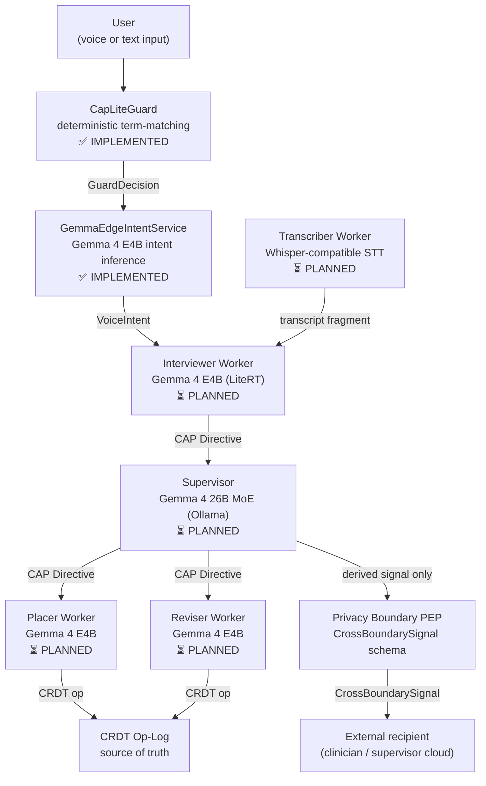
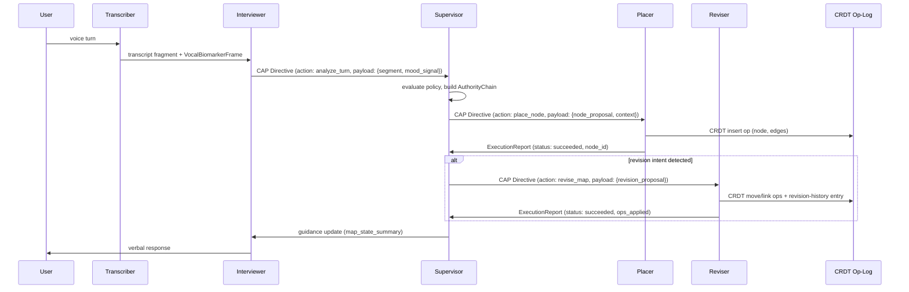

> **Status**: Draft
> **Date**: 2026-06-22
> **Author**: Cytognosis Foundation
> **Audience**: stakeholders, engineers
> **Tags**: `yar`, `multi-agent`, `orchestration`, `cap`, `adhd-friendly`

# Yar Multi-Agent System

> [!NOTE]
> **TL;DR**: Yar targets a supervisor-worker multi-agent architecture where every agent message is a CAP Directive envelope. Today only the on-device safety gate (CapLiteGuard) and the intent service (GemmaEdgeIntentService) are implemented; all supervisor and worker agents are planned.
> **Technical source**: [../SPEC-multi-agent.md](../SPEC-multi-agent.md)

**Reading time**: ~8 minutes.

**If you only read one thing**: Section 2 (agent roles and the implemented-vs-planned distinction) and Section 6 (the brainmap loop as a concrete worked example). Know what is built before reasoning about what is designed.

---

## ⚡ Implementation Status (Read This First)

> [!IMPORTANT]
> Only two components are implemented today. Everything else is planned architecture.

| Component | Status | Location |
|---|---|---|
| **CapLiteGuard** deterministic safety gate | **IMPLEMENTED** | `Yar/src/cap/guard.py` |
| **GemmaEdgeIntentService** on-device intent inference | **IMPLEMENTED** | `Yar/apps/mobile/lib/src/services/gemma_edge_intent_service.dart` |
| CAP-Lite sidecar at `:7100` | Designed, not running | — |
| Supervisor agent (Gemma 4 26B MoE, Ollama) | **PLANNED** | Reference: `cytoplex/scenarios/therapist_supervisor/` |
| Interviewer, Placer, Reviser, Transcriber worker agents | **PLANNED** | — |
| Dapr and NATS orchestration runtime | **PLANNED** | — |
| AgentCard registration and attestation | **PLANNED** | — |

---

## 🔍 Overview

Yar's multi-agent system uses a **strict supervisor-worker topology**. Workers run on-device and handle latency-sensitive, user-facing interactions. The supervisor arbitrates policy, routes complex tasks, and manages cross-agent state.

**The central invariant**: no worker communicates with another worker directly. All coordination passes through the supervisor. Every message between any two agents is a **CAP Directive** envelope.

> [!NOTE]
> **What is CAP?** (101)
> CAP is the Cytognosis Authority Protocol. It defines the governance envelope for all agent actions. Every Directive has an `action.target`, `authority_chain`, `policy_refs`, `expiry`, `reversibility`, and a `nonce`. Workers must verify the authority chain signature before accepting any Directive. **CAP** is the protocol; **Cytoplex** is the product that implements it. Do not call it "Cognitive Agent Protocol."

---

## 📖 Agent Inventory and Roles

| Agent | Model | Runs on | CAP Role | Status | Key responsibility |
|---|---|---|---|---|---|
| **CapLiteGuard** | Deterministic term-matching (no LLM) | Device | Guard | IMPLEMENTED | First-pass safety: crisis, diagnosis, treatment, intent-claim, raw-data-sharing |
| **GemmaEdgeIntentService** | Gemma 4 E4B | Device (LiteRT) | Executor | IMPLEMENTED | On-device intent classification and conversational reply generation |
| **Supervisor** | Gemma 4 26B MoE | Laptop or cloud (Ollama) | Controller | PLANNED | Policy routing, cross-agent state, crisis escalation, sole emitter of CrossBoundarySignal |
| **Interviewer** | Gemma 4 E4B | Device (LiteRT) | Controller + Executor | PLANNED | Real-time conversational response, mood-arc inference, crisis trigger |
| **Transcriber** | Whisper-compatible STT | Device | Executor | PLANNED | Continuous ASR, voice-turn segmentation, VocalBiomarkerFrame emission |
| **Placer** | Gemma 4 E4B | Device (LiteRT) | Executor | PLANNED | New thought-node CRDT insert ops |
| **Reviser** | Gemma 4 E4B | Device (LiteRT) | Executor | PLANNED | Existing node restructure (move, rename, link) CRDT ops |

> [!NOTE]
> **What is CapLiteGuard?** (101)
> CapLiteGuard is a deterministic, multilingual (English + Farsi) term-matching guard. It is **not** an LLM. It runs synchronously before any model inference on every user input. It evaluates six boundary categories in order: crisis terms, diagnosis terms, treatment advice, intent claims, raw-data sharing, and health-risk scoring. Crisis denial routes to 1480 (Iran Social Emergency) and findahelpline.com. Matched terms are never retained in any log.

---

## 📖 Discovery: How Agents Find Each Other

All discovery is **MCP-based**. Agents advertise capabilities via `YarAgentCard`; the supervisor queries the registry at session start.

- **Cards are session-scoped**: they expire when the session ends. Cross-session caching is not permitted.
- **Attestation**: each card includes a detached JWS signed with the agent's Ed25519 key. The supervisor verifies this before adding the agent to the registry.
- **Constraints**: each card lists what the agent cannot do (e.g., `no_external_write`, `no_raw_audio_retention`). The supervisor enforces these before dispatching any Directive.
- **Timeout**: agents not responding within 500ms are marked unavailable; supervisor degrades gracefully.

> [!NOTE]
> **What is MCP?** (101)
> MCP is the Model Context Protocol, an open standard for AI tool invocation. In Yar's multi-agent system, CAP wraps MCP tool calls: `Directive.action.target` takes the form `mcp://<server>/<tool>`. MCP is the discovery and invocation layer; CAP is the governance layer on top of it.

---

## 📖 The CAP Directive Envelope

Every message between supervisor and worker is a `Directive`. No agent-to-agent channel bypasses this envelope. This is the foundational invariant.

Workers **must**:
1. Verify the `authority_chain` signature.
2. Verify the Directive has not expired.
3. Verify `policy_refs` match their advertised CAP profile.
4. Emit an `ExecutionReport` regardless of outcome (success, failure, or refusal).

Workers **must not**:
- Accept a Directive targeting a tool not in their published `ToolManifest`.
- Execute a Directive denied by the Guard.
- Retain raw audio, raw transcripts, or free text beyond a single op scope.

**Refusal reason codes (CAP 16 typed codes):**

| Reason code | Supervisor response |
|---|---|
| `unauthorized` | Log, escalate to session audit, do not retry |
| `expired` | Reissue with refreshed expiry if action is still valid |
| `policy_denied` | Accept; do not override |
| `safety_denied` | Accept; surface appropriate response to user; do not retry |
| `forbidden_tool` | Log; do not retry; audit flag |

---

## 📖 Brainmap Loop: A Worked Example (CU-6)

This is the highest-priority founder-elevated feature cluster (F13, F14, F31, F60 from the v4 feature matrix). It shows how three agents coordinate through the supervisor.

**Undo is always available.** Every CRDT op is in the op-log. The UI exposes undo at the granularity of individual voice turns by replaying the log.

**The Supervisor sees only structure, not content.** Its `BrainmapSessionState` contains node count, active thread IDs, last-placed node ID, mood arc (enum), and pending revision count. No raw text.

---

## 📖 Edge vs. Supervisor Split

Everything that must respond in under 200ms runs on-device. Everything requiring larger context, cross-session policy, or external tool access runs on the supervisor tier.

| Tier | Runs | Latency target | Model |
|---|---|---|---|
| **Edge (on-device)** | Transcriber, Placer, Reviser, Interviewer, Crisis Guard | Under 200ms per op | Gemma 4 E4B (LiteRT) |
| **Supervisor** | Policy evaluation, complex reasoning, cross-agent coordination, external tool Directives | No hard RT constraint | Gemma 4 26B MoE (Ollama) |

**Handoff contract**: the Interviewer reads from `yar.session.<id>.guidance` (NATS subject, retained last value). The Supervisor writes to that subject after processing each batch of `ExecutionReport`s. The Interviewer does not block on Supervisor guidance; it continues the conversational turn with last-known guidance and incorporates updates at the next turn boundary.

---

## 📖 Failure Handling

| Failure mode | Behavior |
|---|---|
| Worker unresponsive (>500ms) | Supervisor marks worker unavailable; degrades feature gracefully; no PHI logged |
| **Guard unavailable** | **Fail closed**: no Directive dispatched until Guard responds or session terminates |
| **Crisis guard error** | **Fail toward help**: return `tier: elevated` and surface resources immediately |
| NATS publish failure | Retry 3× with exponential backoff (50/100/200ms); after exhaustion, session transitions to DRAINING |
| CRDT write failure | Op buffered in per-agent WAL; supervisor decides retry, skip, or abort |

> [!IMPORTANT]
> Two special cases: **Guard unavailable = fail closed** (nothing moves). **Crisis guard error = fail toward help** (user gets resources). These are unconditional; they cannot be configured away.

---

## 📖 Naming Rules (Non-Negotiable)

> [!CAUTION]
> These naming rules apply to all specs, code, and documentation.

| Do NOT use | Use instead |
|---|---|
| "Substrate" for the data layer | "storage layer", "data layer", or "local runtime" |
| USAP | CSP (Cytonome Sensor Protocol) |
| "Cognitive Agent Protocol" | CAP (Cytognosis Authority Protocol) |
| "Cognitive Assertion Protocol" | CAP (Cytognosis Authority Protocol) |
| Agent IDs without the `yar.<role>.<version>` form | `yar.placer.v1`, `yar.supervisor.v1`, etc. |

---

## 📖 Open Decisions

| # | Question | Current leaning |
|---|---|---|
| **O-1** | Dapr/NATS version pins, deployment topology, and mobile binding | Not specified; depends on SPEC-edge-ai-hybrid.md |
| **O-2** | AgentCard attestation key rotation during a session | No leaning; borrow any-sync per-space key model as reference |
| **O-3** | Supervisor actor persistence across app backgrounding | No leaning; iOS/Android lifecycle semantics differ |
| **O-4** | Concurrent brainmap sessions (two active threads simultaneously) | No leaning; lean toward no for v1 |
| **O-5** | Maximum op-log depth for undo: lifetime or session-bounded | No leaning; HIPAA data retention rules apply; coordinate with Duane Valz |
| **O-7** | Supervisor location in v1: always local (Ollama) or optionally cloud-hosted | Lean toward local-only; cloud supervisor must pass the same PEP gate |

---

## ➡️ What's Next?

- **Build the supervisor**: use `cytoplex/src/cytoplex/scenarios/therapist_supervisor/supervisor_agent.py` as the behavioral template and `cytoplex/src/cytoplex/profiles/cap_med.py` as the profile constraints source.
- **Wire CAP-Lite sidecar**: the `SupervisorGateway` class in `cytoplex/src/cytoplex/runtime/supervisor_gateway.py` implements the translate-and-veto pattern any Yar supervisor must replicate.
- **Latency budgets**: [SPEC-edge-ai-hybrid_adhd.md](./SPEC-edge-ai-hybrid_adhd.md) specifies the on-device latency targets per op class.

---

📚 Glossary

| Term | Definition |
|---|---|
| **AgentCard** | A session-scoped capability advertisement published by each agent at initialization. Embeds CAP metadata; attested with a detached JWS. |
| **AuthorityChain** | CAP Primitive 7. Binds Controller, Guard, and Executor under session keys with temporal bounds. |
| **CAP** | Cytognosis Authority Protocol. The transport-independent authority protocol governing what agents can do. |
| **CAP-Lite** | The default CAP safety profile for Yar. v0.1 enforcement is CapLiteGuard. |
| **CapLiteGuard** | The implemented v0.1 on-device safety gate at `Yar/src/cap/guard.py`. Deterministic multilingual term-matching; not an LLM. |
| **CRDT op-log** | The single source of truth for all persistent Yar state. Append-only; the graph index is derived from it. |
| **CrossBoundarySignal** | A derived, structured datum permitted to leave the on-device trust zone under consent and PEP validation. |
| **Dapr** | Distributed application runtime providing service invocation, actor model, and state management for multi-agent orchestration. |
| **Directive** | CAP Primitive 1. A bounded authorization request from Controller to Executor. Contains action target, parameters, authority chain, policy refs, expiry, and reversibility flag. |
| **ExecutionReport** | CAP Primitive 4. Emitted by every Executor after any Directive, regardless of outcome. |
| **GemmaEdgeIntentService** | The implemented v0.1 on-device intent inference service at `Yar/apps/mobile/lib/src/services/gemma_edge_intent_service.dart`. |
| **GuardDecision** | CAP Primitive 2. The output of a Guard check: allow, deny, allow_with_constraints, or escalate. |
| **Interviewer** | The on-device worker agent for real-time conversational response and mood-state inference. PLANNED. |
| **LiteRT** | Google's on-device ML runtime (formerly TensorFlow Lite). Runs Gemma 4 E4B on mobile. |
| **MCP** | Model Context Protocol. The open standard for AI tool invocation. CAP wraps MCP calls via Directive. |
| **NATS** | Messaging transport for Dapr orchestration. Used for supervisor-to-worker Directive delivery and report collection. |
| **Placer** | On-device worker agent that inserts new thought-nodes into the brainmap CRDT. PLANNED. |
| **Reviser** | On-device worker agent that restructures existing brainmap nodes (move, rename, link). PLANNED. |
| **Supervisor** | The Gemma 4 26B MoE agent on laptop or cloud. Owns the AuthorityChain, policy routing, crisis escalation, and cross-agent state. PLANNED. |
| **Transcriber** | On-device ASR worker. Converts voice to transcript fragments and VocalBiomarkerFrames. Never retains raw audio. PLANNED. |
| **VocalBiomarkerFrame** | Structured acoustic feature frame emitted by the Transcriber. Defined in the forthcoming SPEC-sensor-speech-mentalstate.md. |

