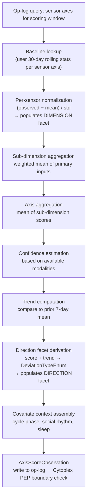
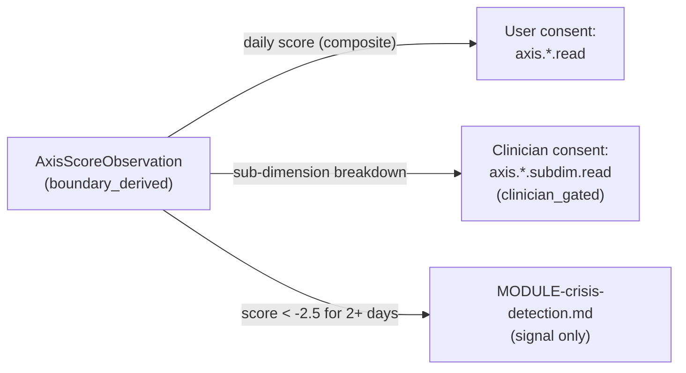

> **Status**: Draft
> **Date**: 2026-06-22
> **Author**: Cytognosis Foundation
> **Audience**: stakeholders, product, engineering
> **Tags**: `yar`, `cytonome`, `csp`, `neurobehavioral`, `axes`, `adhd-friendly`

# Dimensional Neurobehavioral Axes

> [!NOTE]
> **TL;DR**: Yar tracks three continuous behavioral dimensions (Mood, Thought, Cognitive) relative to each user's personal baseline, not population norms or diagnostic categories. Scores are the most sensitive data Yar produces and are governed accordingly.
> **Technical source**: [../SPEC-neurobehavioral-axes.md](../SPEC-neurobehavioral-axes.md)

**Reading time**: ~10 minutes.

**If you only read one thing**: The sensor-to-axis mapping table (Section 4) and the score computation pipeline (Section 5). Everything in this spec serves those two sections.

---

## 🔍 Overview

**Neurobehavioral axes** are Yar's primary output. They turn raw sensor signals (heart rate variability, voice features, sleep quality, self-report scores) into three longitudinal tracks that users can understand without clinical training.

Every score is **baseline-relative**: it compares you to yourself over the past 30 days, not to any external norm. A score of `+1.0` means one standard deviation above your own recent typical level. A score of `-1.0` means one standard deviation below. Population norms are never used after baseline is established.

The three axes feed the **Brain Weather** visualization, not numeric displays. Users see weather metaphors, not z-scores.

> [!IMPORTANT]
> **Axes are dimensional, not diagnostic.** The Mood axis is not a mood-disorder measure. The Thought axis is not a thought-disorder measure. They are windows into normal personal variation. Scores must never be surfaced with clinical diagnostic language.

---

## ⚡ The Three Axes at a Glance

| Axis | User-visible label | Core question | Sub-dimensions |
|---|---|---|---|
| `yar.axis.mood` | Mood and Energy | How is your emotional and energetic state varying? | valence, activation, irritability, anhedonia_signal |
| `yar.axis.thought` | Thought Patterns | How is your verbal-ideational processing varying? | rate, organization, pressure |
| `yar.axis.cognitive` | Cognitive Capacity | How is your executive and attentional capacity varying? | attention, working_memory, processing_speed, executive |

> [!NOTE]
> **What is a sub-dimension?** (101)
> Each axis has 3-4 finer-grained components. The Mood axis, for example, breaks into valence (hedonic tone), activation (energy/arousal), irritability (emotional threshold), and anhedonia_signal (engagement/interest). Each sub-dimension is scored on the same z-score scale as its parent axis.

---

## 📖 Conceptual Model: Why Dimensional?

### The EQ Dimension+Direction Model

Each sub-dimension is formally a **dimension** (a sign-free bearer of a neurobehavioral function) plus a **deviation** (the signed direction and type of change from baseline). This is the Entity-Quality (EQ) formalism.

```
neurobehavioral_feature = Dimension (bearer) + Deviation (signed quality)
```

> [!NOTE]
> **What is the EQ dimension+direction model?** (101)
> EQ stands for Entity-Quality. In this model, an "entity" (the dimension) is a neutral, sign-free behavioral function like "energy level" or "speech rate." A "quality" (the deviation) is a signed descriptor like "decreased" or "fluctuating." The clinical term "anhedonia," for example, is a shorthand for `hedonic capacity` (dimension) + `decreased` (deviation). Separating them lets Yar track function bidirectionally without pre-baking a direction into the axis name.

The three Yar axes (Mood, Thought, Cognitive) are **high-level groupings** over EQ sub-dimensions, not axis bearers themselves. Their theoretical basis is grounded in RDoC, HiTOP, ICF Body Function b-codes, and OBA.

### Why Not Diagnostic Categories?

- **Dimensional models are the current scientific standard** in biological psychiatry (Insel 2010; Cuthbert and Insel 2013; Kotov HiTOP 2017).
- **Neurodivergent users show higher within-person variability** than neurotypical populations. A categorical "normal" is especially inapplicable here.
- **Safety**: continuous, baseline-relative outputs cannot be directly mapped to a specific diagnostic label, reducing misuse risk.

---

## 📖 Sub-Dimension Reference Tables

### Mood Axis

| Sub-dimension | What it tracks | Primary sensors |
|---|---|---|
| `mood.valence` | Affective polarity (hedonic tone) | Voice valence, PHQ-9 score |
| `mood.activation` | Energy and arousal level | HRV, voice arousal, sleep efficiency, step count, social rhythm |
| `mood.irritability` | Emotional reactivity threshold | Voice distress signal, GAD-7 score, app-switch rate |
| `mood.anhedonia_signal` | Engagement and interest level | Social contact index, vocal affect index, social withdrawal flag |

### Thought Axis

| Sub-dimension | What it tracks | Primary sensors |
|---|---|---|
| `thought.rate` | Speed of verbal-ideational processing | Speech rate, response latency |
| `thought.organization` | Coherence and linearity of expressed thought | Pause index, disfluency counts |
| `thought.pressure` | Urgency and compulsion in speech production | Speech rate + filled pause composite, app-switch rate |

### Cognitive Axis

| Sub-dimension | What it tracks | Primary sensors |
|---|---|---|
| `cognitive.attention` | Attentional stability and focus capacity | ASRS score, screen-unlock rate, app-switch rate |
| `cognitive.working_memory` | Short-term information-holding capacity | BRIEF-A score, vocal cognitive load estimate |
| `cognitive.processing_speed` | Speed of information processing | Response latency, sleep efficiency, SpO2 |
| `cognitive.executive` | Planning, initiation, and inhibition capacity | BRIEF-A, WFIRS, circadian stability |

> [!TIP]
> **Key takeaway**: Every sub-dimension maps to validated ICF b-codes and RDoC constructs. The 11 Yar sub-dimensions are a focused subset of Cytognosis's 63-axis neurobehavioral registry.

---

## 📖 The 8-Type Deviation Typology

Every axis score carries a **direction facet type** that adds semantic precision beyond "higher" or "lower."

| Type | Short name | What it means | Detectable from sensors? |
|---|---|---|---|
| 1 | `deficit` | Level below personal baseline range | Yes (score < -0.5, stable) |
| 2 | `excess` | Level above personal baseline range | Yes (score > +0.5, stable) |
| 3 | `absence` | Complete loss (limit of deficit) | Yes (score < -3.0, declining) |
| 4 | `distortion` | Function runs but yields qualitatively altered output | Not yet (reserved for clinical track) |
| 5 | `release` | Output generated with no normal input | Not yet (reserved for clinical track) |
| 6 | `dysregulation` | Abnormal variability rather than fixed shift | Yes (std of 7-day scores > 1.5) |
| 7 | `mistiming` | Temporal or phase disturbance | Yes (circadian anchor deviation > 1.5h) |
| 8 | `context_decoupling` | Normal magnitude mismatched to context | Not yet (requires external stressor annotation) |
| — | `neutral` | Score within [-0.5, +0.5] stable | Yes |

> [!WARNING]
> Types 4, 5, and 8 (`distortion`, `release`, `context_decoupling`) are **not derivable from current passive sensors**. The scoring engine must never set these values from sensor data alone. They are reserved for future clinical-track instrument items under IRB.

<details>
<summary>🔬 Deep Dive: PATO and SNOMED anchors for each type</summary>

| Type | PATO quality | SNOMED qualifier |
|---|---|---|
| deficit | PATO:0000911 (decreased amount/rate) | 1250004 Decreased |
| excess | PATO:0001563 (increased amount/rate) | 35105006 Increased |
| absence | PATO:0000462 absent | 2667000 Absent |
| distortion | PATO:0000460 abnormal (qualitative) | 263654008 Abnormal |
| release | PATO:0000467 present (context-inappropriate) | 52101004 Present |
| dysregulation | PATO:0001303 fluctuating | 25153009 Labile |
| neutral | — | — |

</details>

---

## 📖 Score Computation Pipeline



### Key Computation Rules

- **Baseline window**: 30-day rolling per sensor axis.
- **Minimum for baseline-relative scoring**: 14 days of valid observations. Before that, all scores carry `quality_flag: pre_baseline`.
- **Score range**: z-score capped at [-4.0, +4.0].
- **Confidence levels**: `high` (3+ primary sensors, no stale flags), `medium` (2 primary sensors or stale instrument), `low` (1 primary sensor or pre-baseline), `insufficient` (below minimum inputs, score is null).

> [!NOTE]
> **What is a z-score?** (101)
> A z-score measures how far a value is from your own average, in units of your own standard deviation. A z-score of 0.0 = exactly your typical level. A z-score of +1.0 = one standard deviation above your typical level. A z-score of -2.0 = two standard deviations below. Yar uses personal z-scores only, never population z-scores.

### Missing Modality Handling

No single sensor is required. The system degrades gracefully.

| Scenario | Behavior |
|---|---|
| Voice sensor offline | Sub-dimensions relying on `yar.voice.*` receive lower confidence; axis still computed from remaining inputs |
| Wearable disconnected | HRV input lost; mood activation and cognitive axes lose primary input; quality flag set |
| All instruments overdue (>14 days) | `quality_flag: stale_instrument_score` added |
| Social-interaction adapter not connected | `yar.social.*` excluded; mood anhedonia loses primary input |
| Menstrual covariate absent | `cycle_phase = null`; deviation interpretation proceeds without phase conditioning |
| Fewer than minimum inputs for a sub-dimension | Sub-dimension score is `null`; not imputed |

> [!IMPORTANT]
> The scoring cycle **never imputes or interpolates** missing axis scores. Nulls propagate. The CRDT op-log captures the null as a valid observation with `quality_flags` explaining why.

---

## 📖 Privacy and Governance



**Consent scopes defined by this spec:**

| Scope | Covers | Privacy tier |
|---|---|---|
| `axis.mood.read` | Daily Mood composite score | `boundary_derived` |
| `axis.thought.read` | Daily Thought composite score | `boundary_derived` |
| `axis.cognitive.read` | Daily Cognitive composite score | `boundary_derived` |
| `axis.mood.subdim.read` | Mood sub-dimension scores | `clinician_gated` |
| `axis.thought.subdim.read` | Thought sub-dimension scores | `clinician_gated` |
| `axis.cognitive.subdim.read` | Cognitive sub-dimension scores | `clinician_gated` |

> [!CAUTION]
> **Default at install: all three axis consent scopes are OFF.** The user must opt in explicitly. Axis scores are computed and stored on-device by default. They do not cross the privacy boundary without an active consent grant.

> [!WARNING]
> Sub-dimension scores (e.g., `mood.irritability`) are `clinician_gated` because they carry higher diagnostic specificity than the composite score. They must never appear in standard UI without explicit user request and affirming framing.

---

## 📖 Affirming Language Requirements

These rules are technical requirements enforced at every output layer, not style preferences.

| Do NOT use | Use instead |
|---|---|
| "normal" / "abnormal" | "in your typical range" / "higher than your usual" |
| "impaired" / "deficient" / "declined" | "lower than your usual" / "below your recent pattern" |
| Diagnostic labels (e.g., "depressive episode", "hypomanic") | Axis names only: "Mood and Energy", "Thought Patterns", "Cognitive Capacity" |
| Numeric z-scores in user UI | Brain Weather metaphor |
| "direction_facet_type" in any user-visible string | Never surfaced |

---

## 📖 CRDT Longitudinal State Model

> [!NOTE]
> **What is a CRDT op-log?** (101)
> CRDT stands for Conflict-free Replicated Data Type. The op-log is an append-only record of all state changes. Every axis score is added as a new entry; prior scores are never modified. This design enables undo (by replaying the log) and multi-device sync (entries from different devices are merged without conflicts). The graph index (the queryable view) is rebuilt from the op-log and can always be regenerated.

Key CRDT rules for axis scores:

| Record type | CRDT semantic | Reason |
|---|---|---|
| `AxisScoreObservation` | `append` (immutable) | Daily scores are historical facts; never overwrite |
| `AxisBaselineState` | `lww_register` (last-write-wins) keyed on `(sensor_axis_id, date)` | Daily baseline supersedes yesterday's |
| Sub-dimension scores | Embedded in parent; inherits `append` | Components of the daily score |
| Axis configuration (weights, window sizes) | `lww_register` keyed on `(axis_id, config_key)` | User preferences supersede prior settings |

**Multi-device rule**: if two devices score the same axis on the same cycle, both observations are retained. The query layer surfaces the one with higher confidence.

---

## ⚠️ Open Decisions (Needs Resolution)

| # | Question | Current leaning | Next step |
|---|---|---|---|
| O-1 | Cross-adapter aggregation when Oura and Fitbit both write `yar.physio.hrv_rmssd` | Most recent + highest provenance quality | sensor-physiological spec v0.2 |
| O-2 | Uniform vs. learned sub-dimension weights | Uniform for v0.1 | Requires labeled pilot dataset + IRB |
| O-3 | Brain Weather discrete states (continuous vs. 5-class vs. 7-class) | 5 states: clear/partly cloudy/overcast/stormy/unknown | UX + SPEC-personas-voice.md |
| O-8 | PMDD-aware cycle-adjusted Mood score | Opt-in "cycle-adjusted view" for v0.2 | Requires SPEC-sensor-menstrual + 90-day pilot data |
| O-9 | Crisis detection threshold calibration | Keep conservative (score < -2.5, 2+ days) for v0.1 | North Star pilot; IRB |

<details>
<summary>🔬 Full open-questions list (O-1 through O-12)</summary>

| # | Question |
|---|---|
| O-4 | Trend window: 7-day default vs. longer for slower-moving Cognitive sub-dimensions |
| O-5 | Per-session scoring for research track (currently daily only) |
| O-6 | Weekday/weekend stratification for social rhythm covariate |
| O-7 | Clinician sub-dimension granularity for BAA integration |
| O-10 | `yar.aware.call_duration_daily` deprecation timeline (axis-ID collision) |
| O-11 | `eq_dimension_id` CURIE sourcing: OBA vs. ICF b-code when OBA coverage is incomplete |
| O-12 | Crisis detection module authorization to assign distortion/release/context-decoupling types from instrument items |

</details>

---

## ➡️ What's Next?

- **Build the sensor layer first**: [SPEC-CSP.md](../SPEC-CSP.md) is the parent protocol. Per-modality specs (physiological, speech, social, menstrual) must be finalized before axis scoring can operate at full confidence.
- **Verify crisis detection wiring**: [MODULE-crisis-detection.md](../MODULE-crisis-detection.md) is the consumer of crisis signals; confirm the threshold contract is aligned.
- **Coordinate Brain Weather design**: Axis score discretization (O-3) must be resolved jointly with the UX team and [SPEC-personas-voice.md](../SPEC-personas-voice.md).

---

<details>
<summary>📚 Glossary</summary>

| Term | Definition |
|---|---|
| **Axis** | One of the three high-level neurobehavioral groupings (Mood, Thought, Cognitive). A grouping of EQ sub-dimensions sharing a common neurobiological substrate. |
| **Baseline-relative** | Expressed as a deviation from the user's own rolling average, not from a population norm. |
| **BLUF** | Bottom Line Up Front. Summary first, details second. |
| **CAP** | Cytognosis Authority Protocol. The governance protocol that controls what data may leave the device. |
| **Covariate** | A contextual variable (e.g., menstrual cycle phase) that conditions how a score is interpreted without entering the score computation directly. |
| **CRDT** | Conflict-free Replicated Data Type. An op-log design that allows multi-device sync without conflicts. |
| **CSP** | Cytonome Sensor Protocol. The open protocol every sensor adapter must implement to plug into Yar. USAP is a deprecated alias; never use it. |
| **Cytoplex** | The Cytognosis product that houses CAP. Not synonymous with CAP. |
| **Dimension facet** | The sign-free bearer of a neurobehavioral function in the EQ model. |
| **Deviation facet** | The signed direction and type of change from baseline in the EQ model. |
| **EQ** | Entity-Quality. The ontology formalism used to decompose each sub-dimension into a sign-free dimension bearer plus a typed deviation quality. |
| **HiTOP** | Hierarchical Taxonomy of Psychopathology. The factor-analytic dimensional model that grounds Yar's 13-factor groupings. |
| **ICF b-code** | International Classification of Functioning body-function code. Used as canonical bearer references for EQ dimensions. |
| **LinkML** | A schema language used to define Yar's data classes in a way that is both human-readable and machine-validated. |
| **OBA** | Ontology of Biological Attributes. The preferred source of `eq_dimension_id` CURIEs for sign-free bearer dimensions. |
| **PATO** | Phenotype and Trait Ontology. Provides the quality vocabulary for deviation types. |
| **PEP** | Policy Enforcement Point. The CAP/Cytoplex component that validates every observation before it crosses the privacy boundary. |
| **RDoC** | Research Domain Criteria. NIMH's dimensional framework for mental health research; one of the scientific foundations for the axis taxonomy. |
| **Sub-dimension** | A finer-grained EQ dimension within an axis grouping (e.g., `mood.valence` within the Mood axis). |
| **Z-score** | A score expressed in units of standard deviations from the user's personal mean. 0.0 = typical; ±1.0 = one standard deviation from typical. |

</details>
