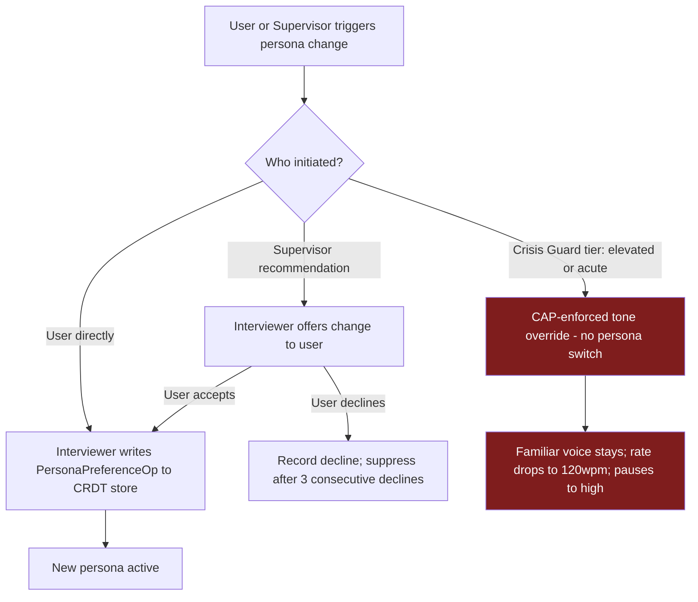
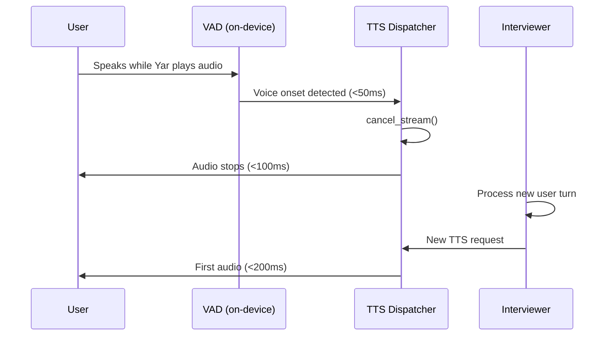

> **Status**: Draft
> **Date**: 2026-06-22
> **Author**: Cytognosis Foundation
> **Audience**: stakeholders
> **Tags**: `yar`, `cytonome`, `personas`, `voice`, `tts`, `adhd-friendly`

# Yar Personas, Voice, and Character System

**Technical source**: [../SPEC-personas-voice.md](../SPEC-personas-voice.md)

**Reading time**: ~7 minutes.
**If you only read one thing**: Section 3 (persona model) and Section 5 (voice layer). Personas are consent-governed character configurations that shape how Yar speaks. They are NOT autonomous agents. Kokoro TTS is implemented now; ElevenLabs is a planned future integration.

---

> [!NOTE]
> **TL;DR**: Yar presents itself through switchable, consent-governed personas that control tone, pacing, and character. CSP sensor signals (distress, cognitive load, mood arc) modulate tone within the active persona in real time. Current voice (v0.1) uses Kokoro on-device TTS; ElevenLabs integration is planned, not built.

---

> [!IMPORTANT]
> **Implementation alert**: Kokoro TTS and the 5-mode PersonaMode REST API are IMPLEMENTED now. ElevenLabs integration is PLANNED, not built. Do not confuse the rich `PersonaDefinition` schema in Section 3 with the simpler `PersonaMode` enum that is currently running.

> [!TIP]
> **Crisis voice rule**: When crisis is detected, Yar does NOT switch personas. The familiar voice stays active throughout. Only tone parameters (rate, pause frequency) are adjusted by CAP override.

---

## 🔍 Overview

**Personas** are named, versioned character configurations that determine how Yar speaks: tone, pacing, vocabulary register, and behavioral boundaries. A persona is a style envelope applied by the Interviewer worker, not an agent with its own goals.

**Character** is the cross-persona invariant: warmth, honesty, non-judgment, and safety. No persona can override character. Character constraints are enforced by CAP regardless of which persona is active.

**Voice** is the acoustic rendering layer. A voice is a TTS model plus a voice identifier (Kokoro model path, or eventually an ElevenLabs voice ID). Voice is assigned to a persona but can be overridden by the user independently.

> [!TIP]
> **Key takeaway**: Persona controls *how* Yar sounds and speaks. Character controls *who* Yar fundamentally is. They are separate layers.

---

> [!NOTE]
> **What is CSP?** (101)
> **CSP (Cytonome Sensor Protocol)** is the protocol governing sensor adapters that feed signals into Yar, including distress level, cognitive load, and mood valence. Defined in `SPEC-CSP.md`. CSP signals modulate tone *within* a persona; they never force a persona switch.

> [!NOTE]
> **What is CAP?** (101)
> **CAP (Cytognosis Authority Protocol)** is the transport-independent authority protocol governing what agents and personas can do. It enforces behavioral boundaries and safety gates. Implemented in Cytoplex. "CAP-Lite" is the default safety profile for Yar.

> [!NOTE]
> **What is CAP-Lite?** (101)
> **CAP-Lite** is the default CAP safety profile applied to all Yar interactions. It enforces character constraints and persona behavioral limits. The Crisis Guard's output flows through CAP-Lite; even the Supervisor cannot cancel a crisis tone override through it.

---

## ⚡ Current v0.1 Implementation

What is actually running today:

| Component | Status | Location |
|---|---|---|
| `PersonaMode` enum (5 modes) | **Implemented** | `Yar/src/yar/models/planning.py` |
| `GET /persona`, `PATCH /persona`, `GET /persona/modes` | **Implemented** | `Yar/src/yar/api/routes_persona.py` |
| Kokoro TTS (`kokoro-v1.0.onnx` + Misaki G2P) | **Implemented** | `Yar/src/yar/core/tts/kokoro_english.py` |
| Full `PersonaDefinition` LinkML schema | Planned | Section 3.1 |
| CSP signal-driven tone modulation | Planned | Section 4.2 |
| CRDT preference state | Planned | Section 6 |
| ElevenLabs integration | Planned | Section 5.2 |
| Affirming-language post-generation filter | Planned | Section 7.2 |

---

## 📖 Persona Model

### The 5-Mode Enum (What Exists Now)

The implemented system uses a simple `PersonaMode` StrEnum. These five modes are live:

| Mode | Character | Closest Spec Persona | Default? |
|---|---|---|---|
| `assistant` | Professional, explains reasoning | Anchor (structured) | Yes |
| `buddy` | Casual, warm, informal | Curious (approximate) | |
| `guardian` | Protective, calm, safety-focused | Steady (close match) | |
| `coach` | Direct, action-oriented, short messages | Anchor (partial) | |
| `quiet` | Minimal output, essential messages only | No spec analogue | |

> [!NOTE]
> **Use `PersonaMode` (the enum) for any current work.** Do not build against the `PersonaDefinition` LinkML schema until it is implemented and the enum is migrated. Section 3.1 describes the target state, not current behavior.

### The Three Planned Spec Personas (v1 Target)

Three built-in personas are designed for v1. All share universal disallowed behaviors (diagnose, prescribe, pathologize, shame).

| Persona | Best for | Speaking rate | Warmth | Directness |
|---|---|---|---|---|
| **Steady** | Overwhelmed, needs structure | 130 wpm | 5/5 | 3/5 |
| **Curious** | Flow state, thinking out loud | 160 wpm | 4/5 | 4/5 |
| **Anchor** | Task execution, planning mode | 150 wpm | 3/5 | 5/5 |

<details>
<summary>🔬 Deep Dive: PersonaDefinition LinkML Schema</summary>

Each persona is a `PersonaDefinition` object with these key fields:

- `persona_id`: reverse-DNS style, e.g., `yar.persona.steady.v1`
- `tone`: a `ToneParams` object (speaking_rate_wpm, pause_frequency, pitch_target, warmth, directness)
- `voice_ref`: a `VoiceRef` object (provider, voice_id, model_id, fallback_voice_ref)
- `language_register`: `casual`, `warm_professional`, or `clinical_neutral`
- `allowed_behaviors` and `disallowed_behaviors`: positive/negative lists checked by CAP Guard
- `modulation_ranges`: declares CSP-signal-driven adjustable ranges within this persona
- `affirming_language_profile`: references `yar.language.affirming_v1`

The canonical schema file is at `Yar/spec/schemas/personas/persona.yaml`. All field names and cardinalities are normative.

</details>

---

## 📖 How CSP Signals Modulate Tone

CSP signals adjust tone parameters *within* the active persona's declared ranges. They do NOT switch personas.

| CSP Signal | Axis ID | Effect when high |
|---|---|---|
| Distress level | `yar.distress.level` | Slower rate, more pauses, gentler directness |
| Cognitive load | `yar.cognitive_load.index` | More pauses, shorter sentences |
| Mood valence | `yar.mood.valence` | Higher warmth at low valence; more exploratory behaviors at high valence |
| Time of day | `yar.context.time_of_day` | Morning = more structured; evening = lower pace, higher warmth |


> [!NOTE]
> **What is a CRDT op-log?** (101)
> **CRDT (Conflict-free Replicated Data Type)** op-log is a log of operations where any two devices that receive the same operations converge to identical state, with no conflicts. Every persona preference change is written as a CRDT operation, not a direct database write. This makes preferences sync-safe across devices.

---

## 📖 Persona Switching Rules



Key rules:

- **User has unconditional authority** over persona selection.
- **Supervisor may recommend**, but never force, a switch (maximum 1 recommendation per 10-minute interval).
- **Crisis never switches personas.** Only tone is adjusted via CAP-enforced override.
- **Three consecutive user declines** suppress further Supervisor recommendations for that session.

---

## 📖 Voice Layer

### Current: Kokoro (Implemented)

> [!NOTE]
> **What is Kokoro?** (101)
> **Kokoro** is an open-source (Apache 2.0), fully on-device TTS engine using `kokoro-v1.0.onnx` with Misaki English G2P phoneme preprocessing. Zero network calls. Implemented at `Yar/src/yar/core/tts/kokoro_english.py`.

Available Kokoro voices:

| Voice ID | Name | Tone | Best for |
|---|---|---|---|
| `af_sarah` | Sarah | Calm | assistant, guardian, quiet |
| `af_bella` | Bella | Warm | buddy |
| `af_heart` | Heart | Friendly | buddy |
| `af_nicole` | Nicole | Gentle | quiet, guardian |
| `am_michael` | Michael | Clear | coach, assistant |
| `am_fenrir` | Fenrir | Energetic | coach, buddy |

Environment variables: `YAR_TTS_ENABLED` (must be `true` to activate), `YAR_KOKORO_MODEL_PATH`, `YAR_KOKORO_VOICES_PATH`, `YAR_TTS_OUTPUT_DIR`, `YAR_TTS_SAMPLE_RATE` (default 24,000 Hz).

Current fallback chain:

```
Kokoro (kokoro-v1.0.onnx + Misaki G2P)    [IMPLEMENTED]
    |-- model files missing or TTS_ENABLED=false
    v
Text-only mode                              [FALLBACK]
```

### Planned: ElevenLabs (Not Yet Built)

> [!IMPORTANT]
> **ElevenLabs is PLANNED, not implemented.** The design below is forward-looking. Do not build against it until the ElevenLabs integration sprint is scheduled.

> [!NOTE]
> **What is ElevenLabs?** (101)
> **ElevenLabs** is a commercial TTS provider offering ultra-low-latency on-device and cloud voice synthesis. The planned primary model is `eleven_flash_v2_5` (~75ms first audio). When integrated, it will be the primary voice path; Kokoro becomes the fallback. Note: `eleven_monolingual_v1` and `eleven_multilingual_v1` are deprecated by ElevenLabs (removal July 9, 2026). Do not reference them.

Planned model tiers (when ElevenLabs is integrated):

| Tier | Model | Latency | Privacy |
|---|---|---|---|
| Primary (planned) | `eleven_flash_v2_5` | ~75ms | On-device only |
| Quality opt-in (planned) | `eleven_multilingual_v2` | ~200ms | On-device only |
| Cloud opt-in (planned) | `eleven_v3` | ~200ms | Requires consent + zero-retention |
| Fallback (implemented) | Kokoro 82M | ~150ms | On-device only |
| Last resort | Platform TTS | Varies | On-device only |

<details>
<summary>🔬 Deep Dive: Planned Barge-In (ElevenLabs Path)</summary>

Barge-in is the ability to interrupt Yar mid-speech by speaking. The planned architecture:



Total perceived interruption latency: under 350ms. This requires the ElevenLabs WebSocket streaming endpoint and is not available in the current Kokoro path (Kokoro synthesizes to WAV; barge-in requires a separate OS-level audio interrupt).

</details>

---

## 📖 Safety and Guardrails

### Crisis Behavior

When the Crisis Guard returns `tier: elevated` or `tier: acute`:

1. Speaking rate drops to **120 wpm** (CAP-enforced, no persona can override this).
2. Pause frequency is set to **high**.
3. **Voice does not change.** Familiar voice stays throughout.
4. **Persona does not switch.** Only tone is adjusted.
5. All behaviors except `reflect_feelings`, `suggest_breaks`, and safety-resource delivery are suspended.
6. After the session ends, Yar reverts to `PersonaPreferenceState.preferred_persona_id`.

> [!TIP]
> **Why keep the same voice during crisis?** Familiarity is calming. Switching to an unfamiliar voice during a high-distress moment would add cognitive load, not reduce it.

### Affirming-Language Guardrails

Every Yar response passes through the `yar.language.affirming_v1` post-generation filter before TTS. Rules enforced:

| Rule | What it prevents | Action on violation |
|---|---|---|
| No diagnostic labels as address | "As someone with ADHD..." | Regenerate |
| No normative comparisons | "Below average focus" | Regenerate |
| No negative self-talk reinforcement | Agreeing with harmful self-perception | Regenerate |
| No shame or disappointment | "You didn't finish again" | Regenerate |
| Person-first language | Identity-first violations (unless user prefers) | Rewrite |
| Controlled severity vocabulary | "abnormal", "pathological", "severe" | Rewrite |

If a response fails guardrails after 2 regeneration attempts, Yar delivers a safe fallback: "I want to make sure I'm saying this well — can I try again?"

---

## ⚠️ Common Pitfalls

- **Building against PersonaDefinition schema now**: Use `PersonaMode` (the enum) for current work. The rich schema is not yet implemented.
- **Assuming ElevenLabs is available**: Kokoro is the only TTS path in v0.1. Plan accordingly.
- **Expecting persona to switch during crisis**: Crisis tone override adjusts parameters only; the persona and voice stay constant.
- **Issuing more than 1 Supervisor directive per 10 minutes**: The CAP Guard rate-limits `PersonaSwitchDirective` emissions. Design for this.

---

## ➡️ What's Next?

- **For current TTS work**: read `Yar/src/yar/core/tts/kokoro_english.py` and set `YAR_TTS_ENABLED=true`.
- **For persona API work**: see `Yar/src/yar/api/routes_persona.py` for the 3 live endpoints.
- **For CSP signal design**: read [SPEC-CSP.md](../SPEC-CSP.md) for the sensor protocol that feeds tone modulation.
- **For crisis rules**: read [MODULE-crisis-detection.md](../MODULE-crisis-detection.md) for CD-1 through CD-10.
- **For storage of persona preferences**: read [SPEC-storage-engine_adhd.md](./SPEC-storage-engine_adhd.md) for the CRDT op-log.

---

<details>
<summary>📚 Glossary</summary>

| Term | Definition |
|---|---|
| **AffirmingLanguageProfile** | Named rule set applied post-generation to ensure Yar output is non-stigmatizing and person-first. Referenced by every persona. |
| **Anchor** | Built-in persona. Structured, clear, direct. Best for task execution and planning. |
| **Barge-in** | The ability to interrupt Yar's speech by speaking. Requires VAD + TTS stream cancel (planned for ElevenLabs path). |
| **CAP** | Cytognosis Authority Protocol. Governs what agents and personas can do. Implemented in Cytoplex. |
| **CAP-Lite** | Default CAP safety profile for Yar. Enforces all persona behavioral constraints and crisis overrides. |
| **Character** | Cross-persona invariant: warmth, honesty, non-judgment, safety. Holds regardless of which persona is active. |
| **CRDT op-log** | Single source of truth for all persistent Yar state including persona preferences. Every change is a logged operation, not a direct write. |
| **CSP** | Cytonome Sensor Protocol. Governs sensor adapters that feed signals (distress, cognitive load, mood) into Yar. |
| **Curious** | Built-in persona (planned v1). Exploratory, engaged, faster paced. Best for thinking out loud. |
| **ElevenLabs** | Commercial TTS provider. Planned but not yet integrated. Primary future voice path. |
| **Interviewer** | On-device worker agent (Gemma 4 E4B) responsible for real-time conversation. Applies persona config and dispatches TTS. |
| **Kokoro** | Open-source (Apache 2.0) on-device TTS engine. Current v0.1 voice path. |
| **Modulation** | Within-persona adjustment of tone parameters driven by real-time CSP signals. Does not switch personas. |
| **Persona** | Named, versioned character configuration. Controls tone, voice, behavioral constraints, and language register. |
| **PersonaMode** | Currently implemented 5-mode StrEnum (assistant, buddy, guardian, coach, quiet). |
| **PersonaPreferenceState** | User's persistent persona and voice preferences. Stored as a CRDT Map. On-device only. |
| **PersonaRegistry** | On-device list of all available personas. Read-only for workers; write access via CAP Directive. |
| **PersonaSwitchDirective** | CAP Directive from the Supervisor recommending a persona switch. Requires user confirmation. |
| **Steady** | Built-in persona (planned v1). Calm, grounded, low pace, high warmth. |
| **Supervisor** | Gemma 4 26B MoE agent. May recommend persona switches; does not own persona state. |
| **ToneParams** | Adjustable acoustic parameters within a persona: speaking rate, pause frequency, pitch, warmth, directness. |
| **VAD** | Voice Activity Detection. On-device model detecting user speech onset. Triggers barge-in cancel. |
| **VoiceRef** | Schema class identifying a TTS provider, voice ID, and model ID. |

</details>
