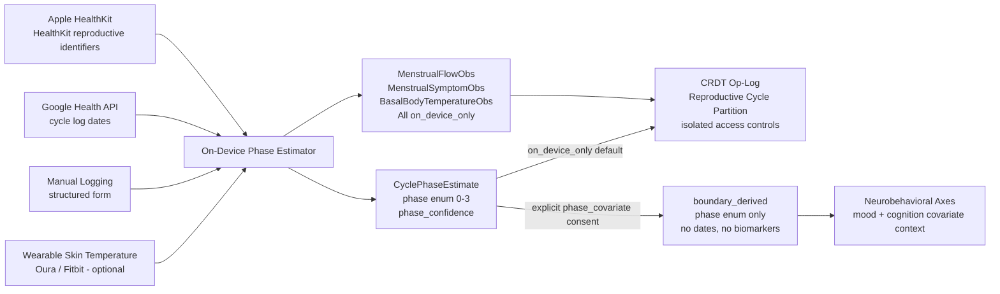

> **Status**: Draft
> **Date**: 2026-06-22
> **Author**: Cytognosis Foundation
> **Audience**: stakeholders, engineers, collaborators
> **Tags**: `yar`, `cytonome`, `csp`, `sensor`, `menstrual`, `reproductive-health`, `privacy`, `adhd-friendly`

# 🔬 Menstrual and Reproductive-Cycle Sensing (ADHD-Friendly)

**Technical source**: [../SPEC-sensor-menstrual.md](../SPEC-sensor-menstrual.md)

> [!NOTE]
> **TL;DR**: Yar can track menstrual cycle phase as a contextual covariate for mood and cognition axes, because cycle phase measurably modulates dopamine availability and executive function. Reproductive-cycle data is the highest-sensitivity category in Yar: it stays on-device by default, requires opt-in consent per data type, and is never shared with any third party under any circumstances.
>
> **Reading time**: ~9 minutes (full spec ~14 min).
> **If you only read one thing**: Section 6 (Privacy and Governance). Every design choice in this spec flows from that section.

> [!NOTE]
> **Design-only: not yet implemented.** No menstrual-cycle sensor adapter code exists in any Cytognosis repo as of June 2026. The HealthKit reproductive identifiers, Google Health API integration, and the on-device phase estimator are all design-only.

---

## 🔍 Why Cycle Phase Matters for Neurodivergent People

Cycle phase is not tracked as a health monitoring feature in isolation. It is tracked because it explains variance in neurobehavioral axes that would otherwise look unexplained.

- **Estrogen rises** during the follicular phase, promoting dopamine release. Attention, mood, and energy often improve.
- **Estrogen drops** in the late luteal phase, reducing dopamine availability. Attention difficulties, emotional reactivity, and executive function challenges typically worsen in people with ADHD.
- **PMDD** (Premenstrual Dysphoric Disorder) co-occurs with ADHD at elevated rates, producing a compounding luteal-phase burden.

Without cycle-phase as a covariate, Yar's longitudinal mood and cognition axes will show periodic variance that looks unexplained but is actually phase-driven. Anchoring that variance to phase makes the model more accurate, not more invasive.

**Inclusive language note**: throughout this spec and in all user-facing output, "people who menstruate" is the preferred construction. Cycle variation is variation, not deviation. Labels such as "normal cycle" or "abnormal cycle" are prohibited.

---

## 📊 What Is in Scope

| Category | What Yar captures |
|---|---|
| Cycle-phase estimation | Follicular / ovulatory / luteal / menstrual phases, estimated on-device |
| Flow logging | Period onset, offset, relative flow level |
| Symptom logging | Enumerated symptoms (cramping, cognitive fog, mood shifts), never free text |
| Biomarker inputs | Basal body temperature (BBT), ovulation test result, cervical mucus quality, intermenstrual bleeding |
| Fertile-window estimate | Derived on-device; permanently `on_device_only` |
| Cycle-phase covariate axis | Ordinal scalar (0-3) that feeds neurobehavioral axes as a contextual covariate |

**Explicitly not in scope:**
- Fertility or contraception advice. Yar does not give medical guidance.
- Pregnancy detection or monitoring. `HKCategoryTypeIdentifier.pregnancy` is ignored at the adapter level.
- Third-party data sharing of any reproductive-health observation, under any consent scope.
- Covert tracking. No passive background collection of reproductive-cycle signals is permitted.

---

## 📖 Data Sources

| Source | Adapter ID | Maturity | Privacy Tier |
|---|---|---|---|
| Apple HealthKit (reproductive identifiers) | `org.cytognosis.yar.healthkit.repro` | Beta | `on_device_only` |
| Google Health API (cycle log, period dates) | `org.cytognosis.yar.googlehealth.cycle` | Beta | `on_device_only` |
| Manual user logging (structured form) | `org.cytognosis.yar.menstrual.log` | Stable | `on_device_only` |
| On-device cycle-phase estimator | `org.cytognosis.yar.menstrual.estimator` | Beta | `on_device_only` by default; `boundary_derived` for phase enum only under explicit consent |

**Why everything is `on_device_only` by default**: the legal and personal risk of reproductive-data exposure is categorically higher than physiological wearable data (see Privacy section). The sole boundary-crossable output is the `CyclePhaseEstimate` (phase enum 0-3), and only after a full-screen, reproductive-health-specific opt-in.

> [!NOTE]
> **Google Health API note**: The Fitbit Web API is being deprecated in September 2026. All integrations use the Google Health API exclusively. The Google Health API surfaces aggregated cycle log and period dates only (no raw BBT, cervical mucus). Manual logging is the primary input path.

---

## 🏗️ Data Flow



---

## 📖 Cycle-Phase Estimation (on-device, Bayesian)

The estimator runs entirely on-device. No raw dates, biomarker values, or cycle data are transmitted.

**Algorithm:**
1. **Prior initialization**: user enters (or adapter infers) typical cycle length (default 28 days) and period duration (default 5 days).
2. **Phase boundary computation**: menstrual = days 1 through period_duration; follicular = period_duration+1 through ovulation_day-2; ovulatory = ovulation_day-1 through ovulation_day+1; luteal = ovulation_day+2 through cycle_length.
3. **Biomarker updating**: BBT rise (> 0.2°C sustained 3 days) shifts ovulation estimate. Positive LH test pins ovulation day to test date. Egg-white cervical mucus shifts ovulatory window estimate forward.
4. **Confidence scoring**: `high` if period start logged + >= 1 biomarker; `medium` if period start only; `low` if estimated from historical average alone.
5. **Wearable temperature (optional)**: if Oura or Fitbit skin temperature deviation is available and consented, it is used as a BBT proxy.

**Handling irregular cycles (PCOS, perimenopause, hormonal contraception):**
- No period logged in last 90 days: `phase = unknown`, `phase_confidence = low`.
- HealthKit reports infrequent or irregular cycles: estimator widens uncertainty window.
- `unknown` phase passes as `null` (not 0) to downstream models.

Users see affirming language: "cycle pattern varies" or "phase estimation paused — no recent data." Never "irregular" or "abnormal."

---

## 📊 Cycle Phase as a Covariate (Not an Axis)

**This is the most important architectural point**: `yar.repro.phase_covariate` is NOT a neurobehavioral axis you track. It is a context modifier.

| Axes conditioned by cycle phase | How it is used |
|---|---|
| `mood.activation` | Reduced dopamine in luteal phase shifts the normative midpoint; a z-score of -0.8 in the luteal phase has different weight than the same score in the follicular phase |
| `mood.irritability` | Luteal-phase flag raises the expected irritability baseline |
| `cognitive.executive` | Executive function z-scores are adjusted for phase context |
| `cognitive.working_memory` | Working memory z-scores are adjusted for phase context |

The covariate is stored in `AxisCovariateContext.cycle_phase` and used by the neurobehavioral axes model. The user never sees a "cycle phase score" or trend; they see that their mood and attention readings are contextualized by phase.

---

## 📊 Axis Registry

| axis_id | axis_label | Value type | Default tier | Registry role |
|---|---|---|---|---|
| `yar.repro.phase_covariate` | Cycle phase (covariate scalar) | Ordinal 0-3 | `boundary_derived` with explicit consent | **Contextual covariate** (not a registry axis) |
| `yar.repro.cycle_phase` | Cycle phase estimate | Categorical | `on_device_only` | Health-record signal; estimator output |
| `yar.repro.cycle_day` | Estimated cycle day | Continuous {day} | `on_device_only` | Temporal anchor for estimation |
| `yar.repro.menstrual_flow` | Menstrual flow level | Ordinal | `on_device_only` | Flow input to estimator |
| `yar.repro.bbt` | Basal body temperature | Continuous Cel | `on_device_only` | Ovulation signal input |
| `yar.repro.cervical_mucus` | Cervical mucus quality | Categorical | `on_device_only` | Ovulation signal input |
| `yar.repro.ovulation_test` | Ovulation test result | Categorical | `on_device_only` | Ovulation event pin |
| `yar.repro.symptom_burden` | Cycle-associated symptom burden | Continuous {score} | `on_device_only` | Feeds `mood.irritability` context |

**Phase covariate encoding:** 0 = menstrual, 1 = follicular, 2 = ovulatory, 3 = luteal. The covariate is an ordinal integer; it contains no patient-identifiable content.

---

## 🔒 Privacy and Governance

### The Legal Context

> [!CAUTION]
> **Reproductive-cycle data is maximally sensitive under current US law.** The 2024 HIPAA Privacy Rule amendments protecting reproductive health data were vacated by a federal court in June 2025. State-level protections vary dramatically. The FTC has taken enforcement action against period-tracking apps that shared personal data with advertisers. Yar's approach is architectural, not just policy: this data cannot leave the device without explicit consent, because the enforcement mechanism is built into the CAP PEP and schema, not a settings toggle.

### What Can and Cannot Cross the Boundary

| Signal | Privacy tier | What may cross the boundary |
|---|---|---|
| Period onset/offset dates | `on_device_only` | Nothing |
| Menstrual flow level | `on_device_only` | Nothing |
| BBT readings | `on_device_only` | Nothing |
| Cervical mucus quality | `on_device_only` | Nothing |
| Ovulation test results | `on_device_only` | Nothing |
| Intermenstrual bleeding events | `on_device_only` | Nothing |
| Symptom log entries | `on_device_only` | Nothing |
| CyclePhaseEstimate | `on_device_only` by default; `boundary_derived` under explicit consent | Phase enum (0-3), confidence level, no dates or biomarkers |
| Fertile window estimate | `on_device_only` permanently | Nothing |

> [!IMPORTANT]
> **Reproductive data is excluded from all aggregate analytics.** No counts, rates, or distributions derived from reproductive-cycle data are ever transmitted, even non-identifiable ones.

### Consent Scopes (each requires a separate, distinct consent act)

| Scope | Covers | Tier |
|---|---|---|
| `reproductive_cycle.flow_log` | Period onset/offset, flow level | `on_device_only` |
| `reproductive_cycle.biomarkers` | BBT, cervical mucus, ovulation test, intermenstrual bleeding | `on_device_only` |
| `reproductive_cycle.symptoms` | Symptom log entries | `on_device_only` |
| `reproductive_cycle.healthkit` | HealthKit read access for reproductive identifiers | `on_device_only` |
| `reproductive_cycle.google_health` | Google Health API cycle data read | `on_device_only` |
| `reproductive_cycle.phase_covariate` | Export of CyclePhaseEstimate (phase enum only) to neurobehavioral axes | `boundary_derived` (opt-in upgrade) |

**Bundled consent ("allow Yar to track your health") is prohibited for reproductive-cycle data.** The `phase_covariate` upgrade dialog must be full-screen, explicitly reproductive-health-themed, and separate from the general permissions flow.

### No-Sharing Architectural Invariant

The following rule is verified at each conformance review:

> Reproductive-cycle data (any tier, any class in this spec) must never appear in: (a) any network-bound payload, (b) any cloud analytics pipeline, (c) any third-party SDK call, (d) any clinician integration payload, or (e) any research data export. The only permitted boundary crossing is the `CyclePhaseEstimate` under explicit `reproductive_cycle.phase_covariate` consent, carrying no dates, biomarker values, or identifying context.

### Retention, Export, and Deletion

- **Retention**: all reproductive-cycle observations stored in the on-device encrypted op-log only.
- **User-controlled export**: user may export all data at any time as a local file. Never transmitted to any server.
- **Deletion**: user may delete all reproductive-cycle data at any time. Deletion is irreversible and propagates to all synced nodes in the next sync session.

---

## 📖 Apple HealthKit: What Yar Ingests

| HealthKit Identifier | Ingested? |
|---|---|
| `menstrualFlow` | Yes |
| `basalBodyTemperature` | Yes |
| `cervicalMucusQuality` | Yes |
| `ovulationTestResult` | Yes |
| `intermenstrualBleeding` | Yes |
| `infrequentMenstrualCycles` | Yes |
| `irregularMenstrualCycles` | Yes |
| `prolongedMenstrualPeriods` | Yes |
| `pregnancyTestResult` | **No** (ignored at adapter level) |
| `pregnancy` | **No** (out of scope) |
| `lactation` | **No** (out of scope) |
| `sexualActivity` | **No** (out of scope) |
| `contraceptive` | **No** (out of scope) |

---

<details>
<summary>🔬 Deep Dive: CRDT Op-Log Examples</summary>

**MenstrualFlowObs (always on_device_only):**

```yaml
op_id: "crdt:op/menstrual-flow-20260622"
op_type: append
partition: reproductive_cycle   # isolated partition, elevated access control
payload:
  axis_ref:
    axis_id: yar.repro.menstrual_flow
  result:
    coded_value: "medium"
  privacy_tier: on_device_only  # never crosses boundary
  cycle_day: 2
```

**CyclePhaseEstimate (boundary_derived only after explicit phase_covariate consent):**

```yaml
op_id: "crdt:op/cycle-phase-est-20260622"
op_type: append
partition: reproductive_cycle
payload:
  axis_ref:
    axis_id: yar.repro.phase_covariate
  result:
    scalar: 0.0   # 0 = menstrual phase
  privacy_tier: boundary_derived  # only under phase_covariate consent
  phase: menstrual
  phase_confidence: high
  data_inputs_used: [period_log, historical_pattern]
  # No raw dates, biomarker values, or flow data in this payload.
```

</details>

<details>
<summary>🔬 Deep Dive: Conformance Requirements</summary>

- **REQ-REPRO-001**: Reject any observation without an active `consent_ref` matching the required `reproductive_cycle.*` scope.
- **REQ-REPRO-003**: Enforce `on_device_only` at the CAP PEP for all `ReproductiveCycleObservation` subclasses except `CyclePhaseEstimate` under active `phase_covariate` consent.
- **REQ-REPRO-004**: Log every CAP Directive and GuardDecision for reproductive-cycle observations with `sensitivity_level: reproductive` in the local audit chain.
- **REQ-REPRO-005**: Never include any reproductive-cycle observation in any network-bound payload, analytics pipeline, third-party SDK call, clinician integration, or research export.
- **REQ-REPRO-007**: Provide user-accessible deletion that irreversibly removes all observations including CRDT tombstones.
- **REQ-HK-001**: Request HealthKit authorization only for the identifiers listed as "Ingested by Yar: Yes." Never request authorization for `pregnancy`, `lactation`, `contraceptive`, or `sexualActivity`.
- **REQ-EST-001**: `CyclePhaseEstimate` payload must not contain raw period dates, BBT values, mucus quality values, or any data that could identify a specific cycle event.

</details>

---

## ➡️ What's Next?

- **Neurobehavioral axes**: `SPEC-neurobehavioral-axes.md` (planned) — how cycle phase integrates as a covariate for mood and cognition axes.
- **Physiological sensors**: [SPEC-sensor-physiological_adhd.md](./SPEC-sensor-physiological_adhd.md) — companion spec; CSP patterns this spec reuses.
- **Social sensor**: [SPEC-sensor-social-interaction_adhd.md](./SPEC-sensor-social-interaction_adhd.md) — social rhythm spec that has an open question (O-8) linking to cycle-phase context.
- **CSP anchor protocol**: [SPEC-CSP.md](../SPEC-CSP.md)
- **Privacy boundary**: [Cytoplex/spec/privacy-boundary-spec.md](../../../Cytoplex/spec/privacy-boundary-spec.md)

---

<details>
<summary>📚 Glossary</summary>

| Term | Definition |
|---|---|
| **BBT** | Basal Body Temperature. Waking body temperature measured before any physical activity. Rises after ovulation; used as an ovulation signal. |
| **covariate** | A secondary variable that conditions interpretation of primary measurements without being a tracked phenotype itself. Cycle phase contextualizes mood and attention scores; it is not a score to track. |
| **cycle day** | The day within the current menstrual cycle, counted from the start of the period (day 1 = first day of bleeding). |
| **FHIR** | Fast Healthcare Interoperability Resources. A standard for exchanging healthcare data electronically. Yar uses LOINC codes for semantic alignment with FHIR but does not require a FHIR server. |
| **follicular phase** | Phase of the menstrual cycle from the end of menstruation through ovulation. Estrogen rises, promoting dopamine availability. Often associated with improved mood and energy. |
| **luteal phase** | Phase after ovulation through the start of the next period. Estrogen drops in late luteal; dopamine availability decreases. Often associated with worsening ADHD symptoms and PMDD. |
| **LOINC** | Logical Observation Identifiers Names and Codes. Standardized codes for clinical observations used here for semantic alignment. |
| **LH surge** | Luteinizing hormone surge. The hormonal signal that triggers ovulation. Detectable by home ovulation tests. |
| **people who menstruate** | Preferred inclusive term in this spec. Not all women menstruate; not all people who menstruate are women. |
| **PMDD** | Premenstrual Dysphoric Disorder. A severe form of PMS characterized by significant mood symptoms in the late luteal phase. Co-occurs with ADHD at elevated rates. |
| **phase_covariate** | The single boundary-crossable output from this spec. An ordinal integer (0=menstrual, 1=follicular, 2=ovulatory, 3=luteal) with no patient-identifiable content. |
| **ReproductiveSensitivityMixin** | A marker mixin applied to all reproductive-cycle observation classes. Signals to the CAP PEP that elevated audit logging is required. |

</details>
