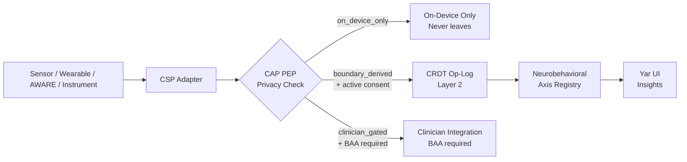
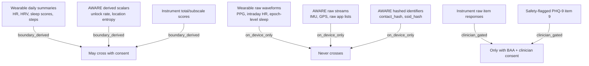

> **Status**: Draft
> **Date**: 2026-06-22
> **Author**: Cytognosis Foundation
> **Audience**: stakeholders, engineers, collaborators
> **Tags**: `yar`, `cytonome`, `csp`, `sensor`, `wearables`, `physiological`, `adhd-friendly`

# 🔬 Physiological and Passive-Sensing Modalities (ADHD-Friendly)

**Technical source**: [../SPEC-sensor-physiological.md](../SPEC-sensor-physiological.md)

> [!NOTE]
> **TL;DR**: This spec defines how Yar reads physiological data from wearables (Oura, Fitbit), passive phone sensing (AWARE), and validated questionnaires (PHQ-9, GAD-7, ASRS, PSQI). Every signal is formally bound to the CSP schema and stored as a CRDT op-log entry. Nothing leaves your device unless you explicitly consent to it.
>
> **Reading time**: ~10 minutes (full spec ~15 min).
> **If you only read one thing**: Section 3 (CSP Binding). Every modality here must satisfy the CSP adapter lifecycle and schema contract.

> [!NOTE]
> **Design-only: not yet implemented.** No wearable or AWARE adapter code exists in any Cytognosis repo as of June 2026. The CSP SensorDescriptor LinkML schema does not yet exist as a file artifact. The voice-affect and Cytoplex guard implementations in `Yar/src/` demonstrate the on-device sensing pattern that wearable adapters will follow.

---

## 🔍 Overview

**Yar** aggregates three classes of physiological signal to track neurobehavioral axes over time:

1. **Wearable biometrics** (Oura, Fitbit, HealthKit): heart rate, HRV, sleep architecture, steps, skin temperature, SpO2.
2. **Passive smartphone sensing** (AWARE): screen behavior, app switching, location entropy, communication metadata.
3. **Validated clinical instruments** (PHQ-9, GAD-7, ASRS, PSQI): structured questionnaire scores.

All three classes share one pipeline. The data flows through the **CSP** (Cytonome Sensor Protocol) adapter layer, enters the CRDT op-log, and only crosses the device boundary as an explicit `CrossBoundarySignal` with active user consent.

> [!TIP]
> **Key takeaway**: raw data stays on-device. Only derived scalars (e.g., "HRV = 45 ms") cross the boundary, and only after you consent to each specific data type.

> [!NOTE]
> **What is CSP?** (101)
> CSP (Cytonome Sensor Protocol) is Yar's internal protocol that governs how sensor data is collected, labeled, and stored. Every sensor in Yar is a CSP "adapter" that must go through a `discover → connect → configure → observe → disconnect` lifecycle. Think of it as a universal data contract that ensures privacy rules are enforced at the source, not as an afterthought.

---

## 📊 Modality Inventory

All 27 sensor sources covered by this spec, with their privacy tier:

| Sensor Source | Adapter Class | Maturity | Privacy Tier |
|---|---|---|---|
| Oura Ring Cloud API v2 | Physiological Wearable | Beta | `boundary_derived` (summaries), `on_device_only` (raw PPG/HRV) |
| Fitbit Web API | Physiological Wearable | Beta | `boundary_derived` (summaries), `on_device_only` (raw intraday) |
| Apple HealthKit | Physiological Wearable | Future stub | `boundary_derived` |
| AWARE Accelerometer / Gyroscope / Magnetometer | AWARE Passive | Beta | `on_device_only` (raw) |
| AWARE Activity Recognition | AWARE Passive | Beta | `boundary_derived` |
| AWARE Light / Barometer | AWARE Passive | Beta | `boundary_derived` |
| AWARE Location (GPS) | AWARE Passive | Beta | `on_device_only` (raw GPS); `boundary_derived` (entropy scalar) |
| AWARE Screen / Apps / Notifications | AWARE Passive | Beta | `boundary_derived` |
| AWARE Keyboard | AWARE Passive | Beta | `boundary_derived` (keystroke **counts only**, never content) |
| AWARE Communication | AWARE Passive | Beta | `boundary_derived` (hashed contacts, duration) |
| AWARE WiFi / Bluetooth | AWARE Passive | Beta | `boundary_derived` (hashed SSIDs/addresses) |
| AWARE ESM / EMA | AWARE ESM | Beta | `clinician_gated` (scores); `boundary_derived` (symptom-severity summaries) |
| PHQ-9 / PHQ-2 | Validated Instrument | Beta | `clinician_gated` (items); `boundary_derived` (total score) |
| GAD-7 / GAD-2 | Validated Instrument | Beta | `clinician_gated` (items); `boundary_derived` (total score) |
| ASRS v1.1 | Validated Instrument | Beta | `clinician_gated` (items); `boundary_derived` (subscale scores) |
| WFIRS / BRIEF-A | Validated Instrument | Beta | `clinician_gated` |
| PSQI | Validated Instrument | Beta | `clinician_gated` (items); `boundary_derived` (global score) |

> [!NOTE]
> **What is a CrossBoundarySignal?** (101)
> Any data that might leave your device is formally declared as a `CrossBoundarySignal`. It gets a privacy tier (`on_device_only`, `boundary_derived`, or `clinician_gated`), a consent scope, and a CAP PEP (Policy Enforcement Point) evaluation before it can move. If no consent is active, the signal stays local.

---

## 🏗️ CSP Binding: How Data Flows



**The three adapter classes and their CSP sections:**

| Adapter Class | CSP Section | adapter_class value |
|---|---|---|
| Physiological Wearable | CSP §6.3 | `physiological_wearable` |
| AWARE Passive | CSP §6.5 | `passive_digital_phenotyping` |
| AWARE ESM | CSP §6.1 + §6.2 | `ecological_momentary_assessment` |
| Validated Instrument | CSP §6.2 | `validated_instrument` |

> [!NOTE]
> **What is a CRDT op-log?** (101)
> CRDT stands for Conflict-free Replicated Data Type. The op-log is an append-only log of sensor observations. "Append-only" means we never overwrite or delete entries. If you use Yar on two devices, the op-logs merge automatically without conflicts. This is how your data stays consistent across devices without a server.

> [!NOTE]
> **What is LinkML / Biolink?** (101)
> LinkML is a modeling language for structured data schemas. Biolink is a standardized vocabulary for biological and health concepts. Together they let Yar's schemas interoperate with clinical systems (FHIR, LOINC) and research ontologies (ICF, RDoC) without custom translation layers.

---

## 📖 Wearables in Depth

### Oura Ring

**What it provides:** heart rate (5-min intervals), HRV (RMSSD), sleep stages, daily activity, readiness score, skin temperature deviation, SpO2.

> [!IMPORTANT]
> Raw PPG waveforms and intraday heart rate data are `on_device_only` and never transmitted. Only daily-summary scalars cross the boundary.

**Signal cadence:**

| Signal | Cadence | Privacy tier |
|---|---|---|
| Heart rate | 5-min intervals | `boundary_derived` (interval avg); raw = `on_device_only` |
| HRV (RMSSD) | 5-min during sleep | Same as above |
| Sleep stages | 5-min epochs | Stage durations = `boundary_derived`; epoch string = `on_device_only` |
| Daily activity / readiness | Daily summary | `boundary_derived` |
| Skin temperature deviation | Daily (nightly) | `boundary_derived` |
| SpO2 (avg/min/max) | Daily summary | `boundary_derived` |

### Fitbit

**What it provides:** everything Oura provides, plus LF/HF HRV spectral power, respiratory rate per sleep stage, active zone minutes, and VO2 max.

**Fitbit advantage:** Fitbit provides RMSSD plus LF and HF spectral power, enabling autonomic nervous system balance metrics. Oura only provides RMSSD.

**Rate limit:** 150 requests/hour per user. The adapter batches daily summaries first, then fills intraday data within the remaining quota.

### Apple HealthKit

Schema stub only. Implementation blocked on confirming HealthKit FHIR export API stability. Will include menstrual cycle data when it arrives.

---

## 📖 AWARE Passive Sensing

**AWARE** is the Android/iOS framework Yar uses for passive smartphone sensing. It captures behavioral signals without any explicit user interaction.

> [!CAUTION]
> **Privacy invariants enforced at the schema level, not configuration:**
> - Phone numbers, contact identifiers, WiFi SSIDs, BSSIDs, and Bluetooth addresses are SHA-256 hashed with a per-device salt before any persistence.
> - Notification text is hashed. Raw content is never stored.
> - Keyboard adapter records keystroke **counts only** (`key_count`, `backspace_count`). Raw keystrokes are never recorded.
> - Raw GPS coordinates are `on_device_only`. The only boundary-crossable location signal is the derived scalar `location_entropy`.

**Sensor groups and their ND relevance:**

| Group | Sensors | Key ND signal |
|---|---|---|
| IMU | Accelerometer, Gyroscope, Magnetometer | Fidgeting, device manipulation patterns |
| Activity | Activity Recognition | Sedentary bouts, hyperfocus detection |
| Environmental | Light, Barometer, Temperature, Proximity | Circadian light exposure |
| Location | GPS / fused location | Routine regularity, location entropy |
| Digital behavior | Screen, Apps, Notifications, Keyboard, Touch | Attentional fragmentation, doomscrolling |
| Communication | Call / SMS metadata (all IDs hashed) | Social rhythm |
| Device state | Battery, Network, WiFi, Bluetooth | Usage intensity proxy |
| ESM | AWARE ESM plugin | Momentary subjective state |

**Default sampling rates:**

| Sensor group | Default rate |
|---|---|
| IMU (accel, gyro, mag) | 5 Hz |
| Environmental (light, baro) | 0.1 Hz (every 10 s) |
| Location | 0.003 Hz (every 5 min) |
| Activity recognition | 0.017 Hz (every 60 s) |
| Screen / App / Comm / Touch / Keyboard | Event-driven |
| Battery / Network / WiFi / Bluetooth | 0.017 Hz or event-driven |

---

## 📖 Clinical Instruments as Sensors

Validated questionnaires (PHQ-9, GAD-7, ASRS, PSQI) are **first-class CSP sensors**. The same adapter lifecycle applies: `discover → connect(consent_ref) → configure → observe → disconnect`.

**Privacy rules:**

| Data | Privacy tier |
|---|---|
| Raw item responses | `clinician_gated` (BAA required for clinical instruments) |
| Total and subscale scores | `boundary_derived` (standard consent) |
| Any safety-flagged item (e.g., PHQ-9 item 9 > 0) | `clinician_gated` regardless of overall score |

**Adaptive screening (automatic, not user-visible):**

- PHQ-2 score >= 3 automatically schedules full PHQ-9 at next ESM window.
- GAD-2 score >= 3 automatically schedules full GAD-7 at next ESM window.
- ASRS Part A: 4+ shaded items flags consideration of Part B at next session.

> [!IMPORTANT]
> **Safety flag**: when PHQ-9 item 9 (suicidal ideation) returns > 0, the system sets `safety_flag = true` and invokes the crisis-detection module hook within the same session. This behavior is non-configurable.

**Instrument catalog:**

| Instrument | CSP axis populated | Safety flag trigger |
|---|---|---|
| PHQ-9 | `yar.instrument.phq9_score` | Item 9 > 0 |
| PHQ-2 (screen) | `yar.instrument.phq9_score` (partial) | No; triggers full PHQ-9 |
| GAD-7 | `yar.instrument.gad7_score` | No (see crisis module) |
| GAD-2 (screen) | `yar.instrument.gad7_score` (partial) | No; triggers full GAD-7 |
| ASRS v1.1 | `yar.instrument.asrs_parta_score` | No |
| WFIRS / BRIEF-A | User-defined axes | No |
| PSQI | `yar.instrument.psqi_global` | No |

---

## 📊 Axis Registry Alignment

Compact mapping: CSP axis ID to canonical 63-axis registry dimension.

| axis_id | Canonical registry name | Category | Factor grouping |
|---|---|---|---|
| `yar.physio.hrv_rmssd` | Autonomic Arousal | Somatic | Somatic/Physiological |
| `yar.physio.sleep_efficiency` | Sleep Quality/Architecture | Sleep | Sleep/Arousal/Circadian |
| `yar.physio.sleep_deep_duration` | Sleep Quality/Architecture | Sleep | Sleep/Arousal/Circadian |
| `yar.physio.sleep_rem_duration` | Sleep Onset/Maintenance | Sleep | Sleep/Arousal/Circadian |
| `yar.physio.sleep_latency` | Sleep Onset/Maintenance | Sleep | Sleep/Arousal/Circadian |
| `yar.physio.spo2` | Cardiovascular Symptoms | Somatic | Somatic/Physiological |
| `yar.physio.step_count` | Psychomotor Activity | Behavioral | Somatic/Physiological |
| `yar.physio.skin_temp_deviation` | Circadian Rhythm | Sleep | Sleep/Arousal/Circadian |
| `yar.physio.readiness_score` | Fatigue/Energy | Somatic | Somatic/Physiological |
| `yar.physio.heart_rate` | Cardiovascular Symptoms | Somatic | Somatic/Physiological |
| `yar.aware.screen_unlock_rate` | Attention (Selective/Divided) | Cognitive | Cognitive Control |
| `yar.aware.app_switch_rate` | Cognitive Flexibility | Cognitive | Cognitive Control |
| `yar.aware.location_entropy` | Habit/Automaticity | Behavioral | Somatic/Physiological |
| `yar.aware.notification_rate` | Attention (Sustained) | Cognitive | Cognitive Control |
| `yar.aware.ambient_light` | Circadian Rhythm | Sleep | Sleep/Arousal/Circadian |
| `yar.instrument.phq9_score` | Sadness/Depressed Mood + Anhedonia | Emotional | Negative Affect |
| `yar.instrument.gad7_score` | Anxiety/Worry + Fear/Acute Threat | Emotional | Negative Affect |
| `yar.instrument.asrs_parta_score` | Attention (Sustained) + Impulse Control | Cognitive + Behavioral | Cognitive Control |
| `yar.instrument.psqi_global` | Sleep Quality/Architecture | Sleep | Sleep/Arousal/Circadian |

**Axis labels use experienced-state language, not diagnostic categories.** "Attention difficulty screen" (not "ADHD symptom score"). Severity outputs use `low | moderate | elevated | high`; never "abnormal" or "pathological."

**Deprecation note:** `yar.aware.call_duration_daily` is DEPRECATED. Use `yar.social.call_duration_total_daily` from SPEC-sensor-social-interaction.md for all new code.

---

## 📊 ND-Relevant Derived Features

These are computed on-device from raw signals. They are `boundary_derived` and map directly to registered CSP axes.

| Derived feature | Source signals | ND relevance |
|---|---|---|
| **Circadian stability score** | Sleep onset variability, first screen-on, morning light | ADHD circadian phase delay |
| **Autonomic regulation index** | HRV RMSSD 7-day trend, HRV HF/LF ratio | Vagal tone, executive function readiness |
| **Sleep architecture quality** | Deep sleep %, REM %, sleep latency, SpO2 | ADHD sleep fragmentation |
| **Attentional fragmentation index** | Screen unlock rate, app switch rate, notification rate | Attentional instability proxy |
| **Behavioral routine regularity** | Location entropy, activity state consistency, sleep-wake consistency | Autism/ADHD routine tracking |
| **Physical capacity estimate** | Step count trend, active zone minutes, readiness score | Activity-capacity for executive load |
| **Light-circadian alignment** | Ambient lux at morning/evening + screen-on patterns | Circadian disruption flag |

---

## 🔒 Privacy: What Can Cross the Boundary?



**Default at install**: all adapters are `on_device_only`. You must explicitly upgrade each data type.

**Upgrade flow:**
1. Navigate to adapter settings.
2. CAP PEP issues a Directive requesting scope upgrade.
3. You confirm; GuardDecision = `allow_with_constraints`.
4. DecisionRecord is written to the local audit log.
5. Subsequent observations at the upgraded tier are permitted to cross.

**Revocation is immediate** within one session (PB-8 of privacy-boundary-spec.md).

---

<details>
<summary>🔬 Deep Dive: CRDT Op-Log Entry Format</summary>

Each sensor observation becomes one CRDT `append` entry. Example for an Oura HRV reading:

```yaml
op_id: "crdt:op/oura-hrv-20260622T023000Z"
op_type: append
payload_type: CSPObservation
payload:
  observation_id: "oura-hrv-20260622T023000Z"
  adapter_id: "org.cytognosis.yar.oura"
  axis_ref:
    axis_id: yar.physio.hrv_rmssd
    axis_label: "HRV (RMSSD)"
    domain: autonomic_regulation
    value_type: continuous
    unit: ms
  timestamp: "2026-06-22T02:30:00Z"
  result:
    scalar: 45.2
  privacy_tier: boundary_derived
  consent_ref: "consent:grant/oura.heartrate/abc"
```

Key invariants: `op_type` is always `append` (never update, never delete). Raw waveform data is referenced by `waveform_ref` to an encrypted on-device blob, never inlined.

</details>

<details>
<summary>🔬 Deep Dive: Conformance Requirements (EARS-style)</summary>

**All adapters:**
- REQ-PHYS-001: Reject any observation without an active `consent_ref` matching declared consent scopes.
- REQ-PHYS-002: Write every accepted observation to the CRDT op-log as `append` before acknowledging acceptance.
- REQ-PHYS-003: Enforce `on_device_only` at the CAP PEP for raw PPG, raw IMU, raw GPS, and raw notification text.
- REQ-PHYS-004: Stop accepting observations within one session when consent is withdrawn.

**AWARE-specific:**
- REQ-AWARE-001: Hash all contact identifiers, SSIDs, BSSIDs, and Bluetooth addresses with SHA-256 + per-device salt before any persistence.
- REQ-AWARE-002: Keyboard adapter records counts only. Reject any observation containing raw keystroke content.
- REQ-AWARE-003: Raw GPS coordinates are `on_device_only`. Only location entropy scalar is boundary-crossable.

**Instrument-specific:**
- REQ-INST-001: Raw item responses = `clinician_gated`. Total/subscale scores = `boundary_derived`. Never co-mingle in a single payload.
- REQ-INST-002: PHQ-9 item 9 > 0 sets `safety_flag = true` and invokes crisis-detection within the same session.

</details>

---

## ➡️ What's Next?

- **CSP anchor protocol**: [SPEC-CSP.md](../SPEC-CSP.md) — adapter lifecycle, consent model, full privacy tier taxonomy.
- **Privacy boundary detail**: [Cytoplex/spec/privacy-boundary-spec.md](../../../Cytoplex/spec/privacy-boundary-spec.md) — CrossBoundarySignal schema, PB-1 through PB-10.
- **Speech sensing**: [SPEC-sensor-speech-mentalstate_adhd.md](./SPEC-sensor-speech-mentalstate_adhd.md) — voice signals and paralinguistic features.
- **Social sensing**: [SPEC-sensor-social-interaction_adhd.md](./SPEC-sensor-social-interaction_adhd.md) — social rhythm and co-presence.
- **Menstrual sensing**: [SPEC-sensor-menstrual_adhd.md](./SPEC-sensor-menstrual_adhd.md) — cycle-phase covariate.
- **Storage**: [SPEC-storage-engine.md](../SPEC-storage-engine.md) — CRDT op-log Layer 2 and graph index Layer 4.

---

<details>
<summary>📚 Glossary</summary>

| Term | Definition |
|---|---|
| **AWARE** | Advanced Wearable and Ambient Recognition Engine. Android/iOS framework for passive smartphone sensing. |
| **BAA** | Business Associate Agreement. A legal contract required under HIPAA before sharing clinical health data with a third party. |
| **Biolink** | Standardized vocabulary for biological and health data concepts; enables schema interoperability with FHIR and research ontologies. |
| **boundary_derived** | Privacy tier: a derived scalar or coded result that may cross the device boundary under active user consent. |
| **CAP PEP** | Cytoplex Agent Protocol Policy Enforcement Point. The component that evaluates whether a CrossBoundarySignal is permitted to cross the device boundary. |
| **clinician_gated** | Privacy tier: data that may only cross the boundary with an active clinician consent scope and a signed BAA. |
| **CRDT** | Conflict-free Replicated Data Type. Data structure that merges automatically without conflicts across devices. |
| **CSP** | Cytonome Sensor Protocol. Yar's internal protocol governing sensor data collection, labeling, and privacy. |
| **CrossBoundarySignal** | A formally declared data element that may cross the device privacy boundary; subject to CAP PEP evaluation. |
| **EMA** | Ecological Momentary Assessment. Brief, in-context surveys delivered at scheduled or triggered moments during daily life. |
| **ESM** | Experience Sampling Method. Similar to EMA; used in the AWARE plugin name. |
| **HRV** | Heart Rate Variability. Variation in time between heartbeats; a proxy for autonomic nervous system regulation. |
| **LinkML** | Linked data Modeling Language. Schema definition language for structured, interoperable data models. |
| **LOINC** | Logical Observation Identifiers Names and Codes. Standardized codes for clinical observations and laboratory results. |
| **on_device_only** | Privacy tier: data that never leaves the user's device under any consent scope. |
| **PPG** | Photoplethysmography. Optical technique used by smartwatches to measure heart rate and blood volume changes. |
| **RMSSD** | Root Mean Square of Successive Differences. The standard HRV metric derived from beat-to-beat intervals. |
| **SpO2** | Blood oxygen saturation. Measured by pulse oximetry; normal range ~95-100%. |

</details>
