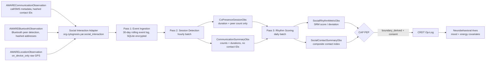

> **Status**: Draft
> **Date**: 2026-06-22
> **Author**: Cytognosis Foundation
> **Audience**: stakeholders, engineers, collaborators
> **Tags**: `yar`, `cytonome`, `csp`, `sensor`, `social-interaction`, `social-rhythm`, `aware`, `adhd-friendly`

# 🔬 Social Interaction Sensor (ADHD-Friendly)

**Technical source**: [../SPEC-sensor-social-interaction.md](../SPEC-sensor-social-interaction.md)

> [!NOTE]
> **TL;DR**: Yar passively tracks the rhythm and quantity of your social contact (not content, not identities) to detect social rhythm disruption — an established early-warning signal for mood episodes. All contact identifiers are pseudonymized on-device. No contact graph ever leaves your device, under any consent scope.
>
> **Reading time**: ~9 minutes (full spec ~14 min).
> **If you only read one thing**: Sections 4 and 5 (CSP binding and social rhythm modeling). The adapter converts raw interaction events into rhythm metrics and diversity indices that feed mood and energy axes as contextual covariates.

> [!NOTE]
> **Design-only: not yet implemented.** No social-interaction adapter code exists in any Cytognosis repo as of June 2026. The AWARE communication and Bluetooth primitives this spec extends are also design-only. Existing infrastructure (`sqlite_store.py`, `CapLiteGuard`) will form the foundation once implementation begins.

---

## 🔍 Overview

Social withdrawal and social rhythm disruption are established behavioral markers for:
- **Mood disorders and bipolar disorder**: disrupted social zeitgebers dis-entrain circadian rhythms, increasing episode risk.
- **Neurodivergent presentations**: routine disruption is a meaningful behavioral dimension for ADHD and autism; social withdrawal is a documented feature of depressive episodes and autistic burnout.

Passive smartphone sensing can approximate the Social Rhythm Metric (SRM) from communication metadata and Bluetooth co-presence signals. A 2016 study (Canzian et al., JAMIA) validated this approach, achieving 0.85 precision and 0.86 recall for distinguishing stable from unstable states.

Yar uses these signals as **contextual covariates** for mood and energy axes, not as independent behavioral phenotypes.

> [!NOTE]
> **What is the Social Rhythm Metric?** (101)
> The Social Rhythm Metric (SRM; Monk et al., 1991) quantifies how regularly a person performs daily activities, including social contacts. Lower SRM scores correlate with increased mood-episode risk in bipolar disorder. Yar approximates the SRM on-device from call timing regularity, co-presence sessions, and communication patterns, without the clinician-administered diary that the original instrument requires.

---

## 📊 What Is and Is Not Captured

| Signal class | What Yar captures | Privacy tier |
|---|---|---|
| Communication event metadata | Call duration, direction, SMS count (hashed contact IDs only) | `boundary_derived` |
| Bluetooth co-presence | Peer device count, proximity duration (hashed device addresses) | `boundary_derived` |
| Interaction timing regularity | Hour-of-day distribution, weekly rhythm deviation | `boundary_derived` |
| Contact diversity | Count of unique hashed contacts over a window | `boundary_derived` |
| Social rhythm index | Composite regularity score (computed on-device) | `boundary_derived` |
| Co-presence sessions | Duration of Bluetooth-inferred proximity with any device | `boundary_derived` |

> [!IMPORTANT]
> **What Yar never captures (prohibited at the schema level):**
> - Call or message content of any kind.
> - Message text, subject lines, or notification text.
> - Contact names, phone numbers, or contact-book entries. Only stable, salted SHA-256 hashes are permitted.
> - The contact graph (set of contacts, frequency matrix, relationship topology). This never leaves the device under any consent scope.
> - Inference about who the user is with or communicating with.
> - Eavesdropping, ambient audio, or any acoustic signal. This spec is metadata-only.

---

## 🏗️ Data Flow



---

## 📖 The Three-Pass Pipeline

### Pass 1: Event Ingestion (event-driven)

The adapter subscribes to the AWARE communication and Bluetooth event bus. Each event is appended to a rolling 30-day encrypted SQLite log. Contact hashes are irreversible at this stage (SHA-256 + per-device salt). Timing metadata (hour-of-day, day-of-week) is extracted separately for rhythm modeling.

### Pass 2: Session Detection (hourly batch)

**Co-presence session detection (Bluetooth):**
1. Cluster Bluetooth scan events by time (gap threshold: 15 min).
2. A session starts when at least 1 non-self device (hashed address) is detected with RSSI >= -75 dBm.
3. Session ends when no qualifying device appears for 15 min.
4. Output: duration, max peer count, mean RSSI. No device addresses in the output.

**Communication window detection:**
1. Group events by day and clock-hour.
2. Count unique hashed contacts per day (stored on-device only).
3. Compute `outgoing_ratio` = outgoing events / total events.
4. Output: `CommunicationSummaryObs` per daily window.

### Pass 3: Rhythm Scoring (daily batch)

**Interaction timing entropy:**
```
H = -Σ p(h) * log2(p(h))   for each clock-hour h with ≥1 event
```
Lower entropy = more regular timing = higher social rhythm.

**SRM score approximation:**
```
srm_score = 7.0 * (1 - normalize(H))
```
Maps to a 0-7 scale matching the clinical SRM range.

**Social contact index:**
```
sci = weighted_mean(
  0.4 * norm(call_duration_total_daily),
  0.2 * norm(call_volume_daily),
  0.1 * norm(sms_volume_daily),
  0.3 * norm(copresence_duration_daily)
)
```
Normalized against user's 28-day rolling mean per signal.

> [!NOTE]
> **What is a covariate?** (101)
> A covariate is a secondary variable that explains variance in your primary measurements without being a tracking target itself. Cycle-phase covariate, social rhythm, and time-of-day are all covariates in Yar. They help the system understand why a mood score looks different on two otherwise similar days, without those secondary variables becoming their own "scores" you have to manage.

---

## 📊 Axis Registry

All axes in namespace `yar.social.*`. Default tier is `boundary_derived`.

| axis_id | axis_label | Domain | Role |
|---|---|---|---|
| `yar.social.call_volume_daily` | Daily call count | social_engagement | Primary driver: `mood.anhedonia_signal` |
| `yar.social.call_duration_total_daily` | Total call duration (daily) | social_engagement | Primary driver: `mood.anhedonia_signal`; supersedes deprecated `yar.aware.call_duration_daily` |
| `yar.social.sms_volume_daily` | Daily message count | social_engagement | Supporting driver: `mood.anhedonia_signal` |
| `yar.social.outgoing_ratio` | Outgoing communication ratio | social_engagement | Proxy: social initiative / approach motivation |
| `yar.social.contact_diversity_7d` | Contact diversity (7-day) | social_engagement | Supporting driver: `mood.anhedonia_signal` |
| `yar.social.copresence_duration_daily` | Daily co-presence duration | social_engagement | Supporting driver: `mood.anhedonia_signal` |
| `yar.social.social_rhythm_score` | Social rhythm regularity | behavioral_regularity | Type-7 (mistiming) deviation detector; covariate for mood axis |
| `yar.social.social_rhythm_deviation` | Social rhythm deviation | behavioral_regularity | Deviation magnitude; covariate for `mood.activation` |
| `yar.social.interaction_timing_entropy` | Interaction timing entropy | behavioral_regularity | Input to SRM scoring |
| `yar.social.social_contact_index` | Social contact index | social_engagement | Primary covariate: `mood.anhedonia_signal` |
| `yar.social.social_withdrawal_flag` | Reduced social contact signal | social_engagement | Non-diagnostic flag; secondary input to crisis-detection module |

**Affirming language note:** `social_withdrawal_flag` values in the user interface are "within your usual range," "somewhat less than usual," "less than usual," and "notably less than usual." Never "abnormal," "isolated," or "social withdrawal" as a user-facing label.

---

## 📊 Axis Alignment to Canonical Registry

| axis_id | Canonical registry name | Factor grouping | Axis role |
|---|---|---|---|
| `yar.social.call_volume_daily` | Social Motivation/Attachment | Social/Interpersonal | Primary driver of `mood.anhedonia_signal` |
| `yar.social.call_duration_total_daily` | Social Motivation/Attachment | Social/Interpersonal | Primary driver; supersedes deprecated physiological axis |
| `yar.social.outgoing_ratio` | Approach/Reward Seeking | Positive Affect/Reward | Proxy for social initiative |
| `yar.social.social_rhythm_score` | Circadian Rhythm + Sleep Onset/Maintenance | Sleep/Arousal/Circadian | Type-7 (mistiming) covariate for whole Mood axis |
| `yar.social.social_contact_index` | Social Motivation/Attachment + Anhedonia | Social + Emotional | Primary covariate for `mood.anhedonia_signal` |
| `yar.social.social_withdrawal_flag` | Avoidance/Withdrawal | Negative Affect | Non-diagnostic flag; secondary crisis-detection input |

---

## 🔒 Third-Party Privacy

Communication and co-presence data involves **third parties** — people you contact or are near. They have not consented to Yar data collection. The spec addresses their privacy through the following invariants, enforced at the schema level:

| Invariant | How it is enforced |
|---|---|
| **Metadata only**: no content, text, or call audio | `CommunicationEvent.contact_hash` schema enforces; content fields forbidden |
| **Pseudonymization**: phone numbers and contact IDs are SHA-256 hashed with per-device salt | REQ-AWARE-001; enforced in `PrivacyGate.hash_identifier()` |
| **No contact graph egress**: contact hash sets, pairs, or network topology never cross the boundary | CrossBoundarySignal classification: all hash-set fields are `on_device_only` |
| **No identity inference**: Yar does not attempt to re-identify contact hashes | Schema prohibition; model inference forbidden on hash fields |
| **Bluetooth pseudonymization**: device addresses are SHA-256 hashed before persistence | `AWAREBluetoothObservation.device_address_hash` enforced in AWARE adapter |
| **Peer count only crosses boundary**: only the scalar peer count (integer) crosses | `CoPresenceSessionObs.max_peer_count` is `boundary_derived`; device hash set is `on_device_only` |

---

## 📖 Consent and Retention

**Three separate consent scopes**, all default-off:

| Scope | Covers |
|---|---|
| `aware.communication` | Call/SMS metadata |
| `aware.bluetooth` | Bluetooth co-presence data |
| `social.derived` | All derived rhythm scores and composite indices |

`social.derived` is distinct from the raw AWARE scopes. Revoking `social.derived` stops the rhythm modeling pipeline but does not affect raw AWARE ingestion.

**Retention:**
- Raw communication event log (SQLite, encrypted): 30 days by default.
- Derived observation log (op-log): per SPEC-storage-engine.md retention policy.
- On revocation: raw event log purged within 24 hours, including all contact and peer-address hashes (since these represent data about third parties).

---

## 📖 Baseline Bootstrapping

During onboarding (first 28 days), `baseline_sufficient = false` on all rhythm observations. The UI shows "still building your personal rhythm baseline," not a zero or error state.

The minimum viable baseline is 7 days of valid daily observations. Once met, deviation metrics become active even before the full 28-day window is populated.

---

## 📖 ND-Relevant Signal Flags

| Flag | Condition | ND relevance |
|---|---|---|
| `social_withdrawal` | Moderate or marked reduction in contact for >= 3 consecutive days | Depression, autistic burnout, ADHD avoidance |
| `behavioral_routine_disruption` | SRM deviation < -1.5 for >= 2 consecutive days | Circadian dysregulation, mood prodrome |
| `low_contact_diversity` | Contact diversity < 0.2 relative to baseline for >= 5 days | Social isolation proxy |

These flags are `boundary_derived` and never carry diagnostic labels. They feed the crisis-detection module only when combined with co-occurring safety signals from instrument observations.

---

<details>
<summary>🔬 Deep Dive: CrossBoundarySignal Classifications</summary>

| Signal | Privacy tier | CAP primitive |
|---|---|---|
| `CommunicationSummaryObs` aggregate scalars (counts, durations, ratios) | `boundary_derived` | `Directive` scope `aware.communication` + `social.derived` |
| `call_timing_hours` list | `on_device_only` | N/A — used only for on-device entropy computation |
| `contact_hash` values (any set or list) | `on_device_only` | N/A — never crosses under any consent scope |
| `CoPresenceSessionObs.max_peer_count`, `session_duration_s` | `boundary_derived` | `Directive` scope `aware.bluetooth` + `social.derived` |
| `CoPresenceSessionObs.device_address_hash` (any set) | `on_device_only` | N/A — contact-graph proxy |
| `SocialRhythmMetricObs` scalars | `boundary_derived` | `Directive` scope `social.derived` |
| `SocialContactSummaryObs.social_contact_index`, `contact_diversity_index` | `boundary_derived` | `Directive` scope `social.derived` |

</details>

---

## ➡️ What's Next?

- **Physiological sensors**: [SPEC-sensor-physiological_adhd.md](./SPEC-sensor-physiological_adhd.md) — AWARE primitives this spec extends.
- **CSP anchor protocol**: [SPEC-CSP.md](../SPEC-CSP.md)
- **Menstrual covariate**: [SPEC-sensor-menstrual_adhd.md](./SPEC-sensor-menstrual_adhd.md) — Open item O-8 in this spec.
- **Neurobehavioral axes**: `SPEC-neurobehavioral-axes.md` (planned) — how social rhythm integrates as a mood covariate.
- **Crisis detection**: [MODULE-crisis-detection.md](../MODULE-crisis-detection.md) — secondary consumer of social withdrawal flags.

---

<details>
<summary>📚 Glossary</summary>

| Term | Definition |
|---|---|
| **Bluetooth co-presence** | Inferring physical proximity from Bluetooth device detection. When your phone detects another Bluetooth device nearby for a sustained period, Yar counts this as a co-presence session. Device identity is never retained. |
| **circadian anchor** | The time of day at which your first social contact typically occurs. A stable anchor time is associated with better circadian entrainment and lower mood-episode risk. |
| **contact diversity** | Count of distinct (hashed) contacts you communicate with over a window. Higher diversity = broader social network engagement. |
| **covariate** | A secondary variable that explains variance in a primary measurement without being a tracking target itself. Social rhythm is a covariate for mood; it conditions interpretation without being a "score." |
| **interaction timing entropy** | Shannon entropy of your communication events across clock hours. Low entropy = regular daily timing (good rhythm); high entropy = scattered interactions (disrupted rhythm). |
| **outgoing ratio** | Fraction of communication events that you initiate. A proxy for social approach motivation. |
| **pseudonymization** | Replacing identifying information (phone numbers) with non-reversible hashes. The hash is consistent within a device (so patterns can be tracked) but cannot be reversed to identify anyone. |
| **social contact index** | Composite score (0-1) combining call duration, call volume, SMS volume, and co-presence duration, normalized to your 28-day baseline. |
| **social rhythm** | The regularity with which you engage in social activities at consistent times of day. Disruption of social rhythm is an early-warning indicator for mood episodes. |
| **Social Rhythm Metric (SRM)** | Clinician-administered diary instrument (Monk et al., 1991) measuring daily social activity regularity. Scores 0-7; higher = more regular. Yar approximates this from passive sensing. |
| **social zeitgeber** | "Social time-giver." A social cue (meal time with others, morning conversation) that helps synchronize your internal circadian clock. Disruption of zeitgebers is associated with mood-episode risk. |

</details>
