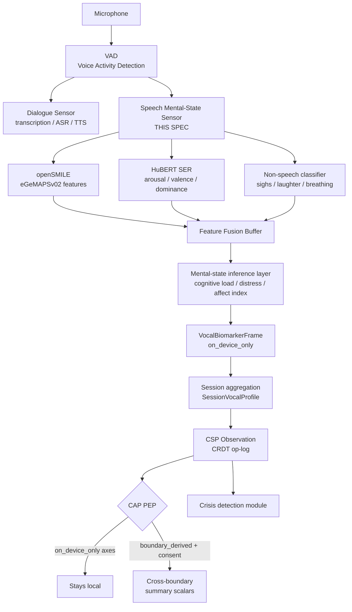

> **Status**: Draft
> **Date**: 2026-06-22
> **Author**: Cytognosis Foundation
> **Audience**: stakeholders, engineers, collaborators
> **Tags**: `yar`, `cytonome`, `csp`, `sensor`, `speech`, `mental-state`, `paralinguistic`, `adhd-friendly`

# 🔬 Speech Mental-State Sensor (ADHD-Friendly)

**Technical source**: [../SPEC-sensor-speech-mentalstate.md](../SPEC-sensor-speech-mentalstate.md)

> [!NOTE]
> **TL;DR**: Yar analyzes how you speak (acoustic features, pace, pauses), not what you say. It never stores raw audio. On-device models infer vocal arousal, valence, cognitive load, and distress signals. Derived scalars only cross your device boundary if you explicitly consent.
>
> **Reading time**: ~9 minutes (full spec ~14 min).
> **If you only read one thing**: Sections 3 and 4 (signal taxonomy and inference pipeline). The sensor produces quantified acoustic features; it never stores audio or labels you with a diagnosis.

> [!NOTE]
> **Partially implemented.** Core data models (`VoiceAffectConstants`, `VoiceAffectSignal`, `VoiceAffectPolicy`) are live in `Yar/src/yar/models/voice_affect.py`. The Flutter/Dart mobile sidecar is implemented at `Yar/apps/mobile/lib/src/affect/`. **Not yet implemented:** the full CSP adapter lifecycle, openSMILE eGeMAPSv02 extraction, CRDT op-log integration, and the CAP PEP boundary enforcement.

---

## 🔍 Overview

The **speech mental-state sensor** runs silently alongside Yar's voice layer. It listens for how you speak during sessions, extracts acoustic properties (pitch, pace, pauses, vocal quality), and infers mid-level mental-state dimensions like arousal and cognitive load.

It does none of the following: transcribe your words, recognize who you are from your voice, or label you with a clinical diagnosis. Those capabilities are either out of scope or actively prohibited.

The governing constraint is `VoiceAffectPolicy`: `raw_audio_stored = false`, `diagnostic_use_allowed = false`, `on_device_only = true`. These are enforced at the API boundary today, not aspirational.

> [!CAUTION]
> **Raw audio is never stored or transmitted.** The audio buffer is an in-memory ring buffer. It is overwritten immediately after feature extraction. It is never flushed to disk, logged, or included in any CSP observation. This is an architectural invariant, not a configurable policy.

> [!NOTE]
> **What is prosody?** (101)
> Prosody is the acoustic properties of speech beyond the words: pitch, rhythm, tempo, loudness, and intonation. Prosodic features carry emotional and cognitive information across all languages. A slower speech rate or monotone pitch can signal fatigue or low mood; rapid speech can signal elevated arousal. Yar measures prosody because it is language-independent and clinically meaningful without touching content.

---

## 📊 How It Fits in the Stack

The **VAD** (Voice Activity Detection) gates all downstream processing. No feature extraction begins on silence or background noise.

---

## 📖 Signal Taxonomy: Three Tiers

### Tier 1: Raw Acoustic Features (on_device_only)

These are extracted per utterance, never stored as CSP observations, and never transmitted. They feed the mental-state inference layer.

| Feature group | Key features | Clinical relevance |
|---|---|---|
| **Pitch** | Mean Hz, std dev, range, F0 contour | Monotone pitch: low arousal; high variability: anxiety |
| **Energy** | RMS mean dB, range | Low energy: fatigue or low-mood state |
| **Speech rate** | Syllables/sec, articulation rate | Elevated: high arousal; reduced: cognitive fatigue |
| **Pauses** | Pre-utterance pause ms, within-utterance count/duration, response latency | Extended pauses: cognitive load or processing difficulty |
| **Vocal quality** | Jitter %, shimmer dB, HNR dB | Elevated jitter/shimmer: vocal tension, stress |
| **Disfluency** | Filled pauses, false starts, repetitions | Elevated in ADHD-relevant cognitive load contexts |
| **Non-speech** | Sigh count, laughter, breathing pattern | Fatigue, frustration, emotional regulation signals |

### Tier 2: Mid-Level Mental-State Dimensions (inferred)

These are derived from Tier 1 using on-device models and map directly to CSP axes.

| Dimension | Range | Model | CSP axis |
|---|---|---|---|
| **Arousal** | 0.0 to 1.0 | HuBERT SER dimensional head | `yar.voice.arousal` |
| **Valence** | -1.0 to 1.0 | HuBERT SER dimensional head | `yar.voice.valence` |
| **Cognitive load estimate** | low / moderate / elevated / high | Rule-based fusion | `yar.voice.cognitive_load` |
| **Distress signal level** | minimal / mild / moderate / elevated | Fusion model | `yar.voice.distress_signal` |
| **Speech rate** | syl/sec | openSMILE direct | `yar.voice.speech_rate` |
| **Pause index** | 0.0 to 1.0 | Derived from VAD | `yar.voice.pause_index` |
| **Vocal affect index** | 0.0 to 1.0 | Composite: pitch range + energy range + rate variability | `yar.voice.vocal_affect_index` |
| **Energy in voice** | z-score vs 30-day baseline | openSMILE + longitudinal baseline | `yar.voice.energy_in_voice` |

**Affirming language rule**: no user-visible label uses "normal," "abnormal," or any diagnostic-adjacent term. `distress_signal = elevated` shows as "your voice is showing elevated distress signals today," never a diagnosis.

### Tier 3: CSP Axis Observations (what is stored)

Only session-level aggregates are written to the CRDT op-log. Per-utterance frames are discarded per the retention policy.

---

## 📊 Axis Registry Alignment

| Adapter axis | Canonical registry axis | Category | EQ dimension |
|---|---|---|---|
| `yar.voice.valence` | Pleasure/Positive Affect + Sadness/Depressed Mood | Emotional | Affective valence / hedonic tone |
| `yar.voice.arousal` | Arousal/Wakefulness + Autonomic Arousal | Sleep + Somatic | Emotional arousal / affective activation |
| `yar.voice.speech_rate` | Speech/Communication + Psychomotor Activity | Behavioral | Verbal output / speech rate (ICF b1671) |
| `yar.voice.pause_index` | Language/Verbal + Reasoning/Abstraction | Cognitive | Thought organization / verbal fluency (ICF b160) |
| `yar.voice.cognitive_load` | Executive Function + Working Memory | Cognitive | Executive and working-memory load (ICF b164) |
| `yar.voice.distress_signal` | Emotional Lability + Distress/Stress Response | Emotional | Affective regulation threshold (ICF b1521) |
| `yar.voice.vocal_affect_index` | Anger/Irritability (blunted) + Positive Affect | Emotional | Prosodic expressiveness / affective range |
| `yar.voice.energy_in_voice` | Fatigue/Energy + Speech/Communication | Somatic + Behavioral | Vocal energy / speech amplitude (ICF b1671) |

**What may cross the device boundary:**

| Signal | Privacy tier | Boundary-crossable? |
|---|---|---|
| Raw audio (in-memory ring buffer) | `on_device_only` | Never |
| VocalBiomarkerFrame (per-utterance features) | `on_device_only` | Never |
| ADHDAVocalMarkers, ASDVocalMarkers | `on_device_only` | Never |
| SessionVocalProfile (session aggregate) | `on_device_only` | Never as a record |
| Scalar axes (arousal, valence, vocal affect, energy) | `boundary_derived` | Only with active consent + only the scalar |
| Ordinal axes (cognitive_load, distress_signal) | `boundary_derived` | Same conditions |
| speech_rate axis | `on_device_only` | Never (biometric-adjacent) |
| pause_index axis | `on_device_only` | Never (biometric-adjacent) |

---

## 📖 Inference Pipeline Details

### Voice Activity Detection (VAD)

**Model:** WebRTC VAD (primary, lowest latency) or Silero VAD (higher accuracy, research deployments).

**Behavior:**
- Segments audio stream into speech segments and silence intervals.
- Each speech segment maps to one or more `VocalBiomarkerFrame` instances (~250 ms sliding windows, 50% overlap).
- Non-speech events (sighs, laughter, breathing) within silence intervals are logged as event records (type, duration, intensity only, never audio).
- **Latency budget**: VAD must complete within 20 ms of each segment boundary.

### openSMILE eGeMAPSv02

- Produces 88 features per 250 ms frame with 125 ms hop.
- Key features: pitch (F0 mean/std), jitter, shimmer, HNR (harmonic-to-noise ratio), loudness, speech rate.
- **Latency target**: 40 ms per frame on a mobile A-class chip.

### HuBERT Speech Emotion Recognition

- `HuBERT-large` fine-tuned on IEMOCAP, INT8 quantized for on-device deployment.
- Outputs per utterance: arousal, valence, dominance (continuous), plus categorical emotion (anger/sadness/fear/joy/neutral/surprise/disgust).
- **Language note**: prosodic features are acoustic, not linguistic. This works across languages without language detection.
- **Latency target**: 50 ms per utterance. Model footprint ~150 MB INT8.

### Mental-State Inference Layer

**Cognitive load estimate** (rule-based, interpretable):

| Signal | Threshold for elevated |
|---|---|
| Filled pause rate | > 6 per min vs user baseline |
| Response latency | > 2 std devs above user baseline |
| Speech rate deviation | > 1.5 std devs above or below baseline |
| False start count | > 3 per utterance |

Count how many signals are in their elevated range. That count maps to `low / moderate / elevated / high`.

**Distress signal level** (composite): combines high arousal + low valence, elevated jitter/shimmer/HNR, sigh rate, and high-confidence negative emotion. Feeds the crisis-detection module directly.

**Vocal affect index**: `weighted_mean(norm(pitch_range), norm(energy_range), norm(speech_rate_variability), penalize_jitter)` normalized against 30-day rolling baseline.

---

## 📖 Session Lifecycle and Baseline

### Session Aggregation (post-session, not real-time)

After each session, a background task:
1. Loads all `VocalBiomarkerFrame` records from the session buffer.
2. Computes aggregate statistics (means, variabilities, trends) per feature group.
3. Computes ND-relevant derived markers (`ADHDAVocalMarkers`, `ASDVocalMarkers`) if the user has opted in.
4. Emits one CSP observation per axis to the CRDT op-log.
5. Discards all `VocalBiomarkerFrame` records per the retention policy.

### Longitudinal Baseline

Accurate personalized inference requires a per-user baseline. Baseline builds over the first 14 sessions (~2 weeks of daily use), then updates on a rolling 30-day window.

Before the baseline is established, outputs carry `quality_flag: pre_baseline`. Users see: "Your voice patterns are still being learned." ND-specific markers (`ADHDAVocalMarkers`, `ASDVocalMarkers`) are null until session 14.

---

## 📖 Consent Model

This adapter requires `consent.voice.mental_state_sensing`. It is separate from any consent for recording, transcription, or cloud processing.

**What the consent UI must disclose:**
1. Acoustic features (how you speak) are analyzed; your words are not processed by this sensor.
2. All feature data is stored on your device only.
3. You can turn this sensor off at any time. Past data is deleted within 24 hours.
4. Summary signals (arousal, distress, cognitive load, affect, energy) may optionally be shared with Yar's supervisor model. This sharing requires separate confirmation.
5. Your voice patterns are never used to identify you to any third party.

**Consent revocation**: adapter stops emitting within one session. Pending observations are dropped. Retention timer starts immediately.

---

## 📖 Retention Policy

| Data artifact | Default retention | User-configurable? |
|---|---|---|
| Raw audio (in-memory buffer) | Overwritten immediately after extraction | Not configurable; always ephemeral |
| VocalBiomarkerFrame (per-utterance) | 7 days | 1 to 30 days |
| SessionVocalProfile | 365 days | 30 days to unlimited |
| Longitudinal baseline data | Until user deletes | Always deletable |
| CSP axis observations in op-log | Per SPEC-storage-engine.md policy | Inherits op-log policy |

On consent revocation or sensor disconnection: all VocalBiomarkerFrame and SessionVocalProfile records are queued for deletion within 24 hours.

---

🔬 Deep Dive: VoiceAffectConstants Backend vs Mobile Divergence

The `VoiceAffectConstants` class is defined in both the Python backend and the Flutter/Dart mobile app. The values diverge significantly and are **not yet reconciled**:

| Constant | Python backend | Dart mobile | Status |
|---|---|---|---|
| `HOP_MS` | 250 ms | 1500 ms | **To reconcile** (6x diff) |
| `TTL_MS` | 120,000 ms | 10,000 ms | **To reconcile** (12x diff) |
| `CONFIDENCE_FLOOR` | 0.45 | 0.25 | **To reconcile** |
| `MIN_SPEECH_MS` | 800 ms | 1000 ms | Minor difference |
| `DEFAULT_MODEL_ID` | `distilhubert-ser-onnx` | `distilhubert-ser-int8-onnx` | Intentional (INT8 for mobile memory) |
| `HISTORY_FOR_TREND` | 4 observations | 3 observations | Minor difference |

The HOP_MS and TTL_MS differences are large enough to produce meaningfully different runtime behavior. This spec cannot be normative on these constants until they are resolved. Assign a reconciliation task before this adapter advances from Research to Beta.

🔬 Deep Dive: Performance Constraints

| Constraint | Target | Notes |
|---|---|---|
| VAD latency | < 20 ms | Per segment boundary |
| openSMILE frame latency | < 40 ms | Per 250 ms frame |
| HuBERT utterance latency | < 50 ms | End-to-end per utterance |
| Peak memory (combined) | < 300 MB | openSMILE + HuBERT INT8 + buffers |
| Battery impact | < 3% per hour | Measured on iPhone 14-class device |
| Model update | Over-the-air, user-consented | Model files are code assets, not user data |

---

## ⚠️ Key Open Questions

| # | Question | Priority |
|---|---|---|
| OQ-1 | On-device SER model: HuBERT-large INT8 (~150 MB) vs HuBERT-base INT8 (~45 MB) vs wav2vec 2.0? | High (blocks Phase 1) |
| OQ-2 | Distress signal validation against PHQ-9/GAD-7 trajectories in a pilot study? | High (required for Research→Beta promotion) |
| OQ-3 | Cognitive load: rule-based (current) vs learned fusion model (Phase 2)? | Medium |
| OQ-5 | VAD model: WebRTC VAD vs Silero VAD benchmark on-device? | Medium |

---

## ➡️ What's Next?

- **CSP anchor protocol**: [SPEC-CSP.md](../SPEC-CSP.md)
- **Crisis detection**: [MODULE-crisis-detection.md](../MODULE-crisis-detection.md) — consumes `distress_signal = elevated`
- **Physiological sensors**: [SPEC-sensor-physiological_adhd.md](./SPEC-sensor-physiological_adhd.md)
- **Social sensing**: [SPEC-sensor-social-interaction_adhd.md](./SPEC-sensor-social-interaction_adhd.md)
- **Storage**: [SPEC-storage-engine.md](../SPEC-storage-engine.md)

---

📚 Glossary

| Term | Definition |
|---|---|
| **arousal** | In the circumplex model of emotion: the activation dimension. Calm = low arousal; excited or panicked = high arousal. Distinct from valence (pleasant/unpleasant). |
| **eGeMAPSv02** | Extended Geneva Minimalistic Acoustic Parameter Set v02. A standardized 88-feature acoustic feature set used in speech emotion research. |
| **HNR** | Harmonic-to-Noise Ratio. Ratio of periodic (voiced) to aperiodic (noise) components in speech. Low HNR indicates vocal fatigue or tension. |
| **HuBERT** | Hidden-Unit BERT. A self-supervised speech representation model. Used here for its Speech Emotion Recognition (SER) fine-tuned head. |
| **jitter** | Cycle-to-cycle variation in vocal fold vibration frequency. Elevated jitter indicates vocal tension or stress. |
| **openSMILE** | Open-source media interpretation by Large feature-space Extraction. A C++ acoustic feature extraction library widely used in affective computing. |
| **prosody** | The acoustic properties of speech beyond the words: pitch, rhythm, tempo, loudness, intonation. Carries emotional and cognitive information across languages. |
| **SessionVocalProfile** | Per-session aggregate of all VocalBiomarkerFrames. The CRDT-persisted summary stored on-device. |
| **shimmer** | Cycle-to-cycle variation in vocal fold vibration amplitude. Elevated shimmer indicates vocal tension. |
| **VAD** | Voice Activity Detection. Segmenting an audio stream into speech vs silence. Gates all downstream feature extraction in this sensor. |
| **valence** | In the circumplex model: the pleasantness dimension. -1.0 = very unpleasant; +1.0 = very pleasant. |
| **VocalBiomarkerFrame** | Per-utterance record of all Tier 1 and Tier 2 features for one ~250 ms speech segment. Always `on_device_only`; never stored beyond the retention window. |

