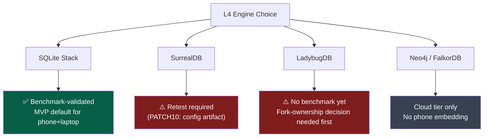

> **Status**: Draft
> **Date**: 2026-06-22
> **Author**: Cytognosis Foundation
> **Audience**: stakeholders
> **Tags**: `yar`, `storage`, `graph-db`, `surrealdb`, `sqlite`, `crdt`, `local-first`, `adhd-friendly`

# Yar Storage Engine

**Technical source**: [../SPEC-storage-engine.md](../SPEC-storage-engine.md)

**Reading time**: ~6 minutes.
**If you only read one thing**: The CRDT op-log is the single source of truth. The L4 graph engine is a derived index that is swappable. SQLite is the validated MVP default. The L4 engine choice is NOT decided yet.

---

> [!NOTE]
> **TL;DR**: The CRDT op-log is the foundation; the graph engine at L4 is a derived, rebuildable index. SQLite + sqlite-vec is the benchmark-validated MVP default for phone and laptop. SurrealDB is the preferred multi-model candidate but requires a retest. LadybugDB has no benchmark yet. No L4 engine is committed.

---

> [!WARNING]
> **The L4 engine choice is NOT decided.** This spec is a working draft pending the SurrealDB retest (O-3). LadybugDB is a candidate but has no benchmark results. Do not treat any engine as committed. SQLite is the only benchmark-validated option for on-device MVP.

---

## 🔍 Overview

Yar's storage architecture follows one keystone principle:

> **The CRDT op-log is the single source of truth. The graph or query engine at L4 is a derived, materialized index that is swappable and rebuildable by replaying the op-log.**

This has two important consequences:

1. **The engine choice is reversible.** If SurrealDB or LadybugDB proves untenable, switching costs are bounded: replay the log into a different engine.
2. **"Single-engine" means one logical source of truth** (the op-log), not one binary on every tier.

> [!TIP]
> **Key takeaway**: Build against the CRDT op-log abstraction, not against any specific engine. The engine is an implementation detail.

---

> [!NOTE]
> **What is a CRDT op-log?** (101)
> **CRDT (Conflict-free Replicated Data Type) op-log** is a log of operations where any two devices that receive the same operations converge to identical state, with no master node and no "last write wins." Adding a new operation never conflicts with any prior operation. This makes it ideal for local-first, offline-capable health data.

---

## 📖 Six Make-or-Break Requirements

Any engine that fails one of these is disqualified as the primary on-device store:

| Criterion | Requirement |
|---|---|
| **Embeds on iOS + Android** | Runs in-process or via thin FFI on both platforms |
| **CRDT / offline-first** | Tolerates op-log replay as the import path |
| **HIPAA pathway** | Encryption at rest; BAA-eligible hosting for cloud tiers |
| **2-year vendor survival** | Weighted equally with benchmark scores for a healthcare product |
| **License for commercial PBC** | MIT, Apache 2.0, or source-available with clear embed terms |
| **Schema fit** | Typed long-lived entities, graph traversal, vector search, bi-temporal queries |

---

## 📖 Candidate Engines

### SQLite Stack (sqlite + sqlite-vec + SQLCipher)

**Role**: Device-tier front-runner and safest fallback.

**Why it wins on device:**

- Embeds on every phone and laptop; public domain; no single maintainer dependency.
- SQLCipher provides field-level and full-disk encryption; direct HIPAA pathway.
- sqlite-vec adds HNSW approximate nearest-neighbor (vector) search.
- FTS5 provides full-text search.
- **Benchmark result**: validated MVP default. Wins across phone and laptop tiers at all dataset sizes.
- **Vendor risk**: essentially zero.

**Limitations**: no off-the-shelf Cypher query language on-device; graph traversals at scale are slower than a native graph engine.

### SurrealDB

**Role**: Co-front-runner for multi-model and cloud tiers, pending retest.

**Why it is interesting:**

- Multi-model: graph, relational, document, KV, time-series in one engine.
- Native HNSW vector index, bi-temporal `VERSION` queries, Rust core.
- Single-engine pitch: same engine for embedded, edge, and cluster.

**Why the benchmark result is suspect:**

- PATCH10 last-place score (8.68 at 100k) was a configuration and methodology artifact.
- SurrealDB FTS improved dramatically post-tuning (214ms untuned to 3.6ms tuned).
- `task_lookup` and `cold_open` remain materially slower than SQLite.
- A confirmed retest (O-3) is required before ruling SurrealDB in or out.

**Active risks:**

- Architecture 3.0 rewrite (Feb 2026): short production track record.
- BSL license: embedding in a commercial PBC requires confirming BSL terms permit it. This check has not been done.
- $44M raised; $23M Series A extension Feb 2026; concentration risk on recently-rewritten architecture.

### LadybugDB

**Role**: Candidate, pending benchmark. Not a co-front-runner until measured.

**Context:**

- Kuzu was the strongest embedded graph DB for on-device GraphRAG. Apple acquired and archived it on 2025-10-09.
- LadybugDB is the best active community fork.
- iOS embedding works. Android binding requires DIY work estimated at weeks.
- No cloud clustering capability.

> [!WARNING]
> **LadybugDB has no benchmark results.** It does not appear in any measured result in the `yar_supervisor_reproducible_benchmark_package`. It must not be treated as a co-front-runner until a PATCH10-comparable run is completed. The fork-ownership decision (O-2) is a prerequisite even for benchmarking.

### Neo4j and FalkorDB

**Role**: Cloud GraphRAG and supervisor tier only.

- Neither embeds on mobile. Both are disqualified as primary on-device store.
- Neo4j has the best GraphRAG tooling; lowest vendor risk. Best for cloud-tier knowledge graph search.
- FalkorDB wins server-tier graph workloads at 100k (score 4.01, best of server candidates).

---

## 📖 PATCH10 Benchmark Status

> [!WARNING]
> **These numbers are data, not a decision.** The SurrealDB retest (O-3) is required before any decision that would exclude it.

**Weighted decision scores (lower is better):**

| Engine | 10k score | 100k score | Status |
|---|---|---|---|
| SQLite + FTS5 + sqlite-vec | 3.05 | 5.49 | Measured (PATCH10) |
| FalkorDB | 5.53 | 4.26 | Measured (PATCH10) |
| SurrealDB (tuned) | 8.35 | 9.37 | Measured; retest pending (see O-3) |
| LadybugDB | -- | -- | Not benchmarked |

**p50 latency at 10k (ms):**

| Operation | FalkorDB | SQLite | SurrealDB tuned |
|---|---|---|---|
| lexical_search | 0.349 | 0.132 | 3.555 |
| hybrid_rrf | 3.244 | 2.289 | 5.923 |
| vector_search | 2.894 | 2.229 | 2.722 |
| task_lookup | 0.573 | 0.579 | 46.003 |
| cold_open | 0.783 | 12.432 | 63.654 |

🔬 Deep Dive: Three Architecture Patterns

Three patterns survive the six requirements. The right choice depends on the open decisions:

| Pattern | Engine stack | Best for | Key risk |
|---|---|---|---|
| **A: Best Tech** | LadybugDB on device + Loro CRDT + Iroh | Fastest on-device graph, MIT throughout | No benchmark; Android DIY; fork-ownership required |
| **B: Elegant Bet** | SurrealDB everywhere + CRDT log | One engine, best native time-travel | Mobile FFI thin; 3.0 rewrite young; BSL license check needed |
| **C: Safest** | SQLite + sqlite-vec on device + Neo4j or FalkorDB cloud | Lowest risk, benchmark-validated, HIPAA via SQLCipher | Slower graph traversal at scale; no Cypher on-device |

Under the **recommended interpretation** (CRDT log is the single source; engine is a swappable read index), all three survive.

---

## 📖 What Is Decided vs Open

### Decided

| Component | Decision |
|---|---|
| CRDT op-log = single source of truth | Decided |
| L4 graph engine = derived swappable index | Decided as principle |
| Single-engine rule = one logical source of truth | Decided; recommended interpretation adopted |
| SQLite + FTS5 + sqlite-vec = validated MVP default | Decided (Ali's benchmark) |
| Neo4j = cloud tier only | Decided |
| FalkorDB = cloud tier only | Decided |
| Kuzu = dead; LadybugDB = best fork | Fact |
| Encryption at rest via SQLCipher (SQLite path) | Decided (requirement) |
| Do not adopt ASAL-licensed Anytype clients | Decided |

### Open (These Block the L4 Decision)

| # | Decision | Current leaning | Blocker |
|---|---|---|---|
| **O-1** | L4 engine: SurrealDB vs SQLite vs LadybugDB | SurrealDB preferred multi-model; SQLite safest fallback | SurrealDB: soak test + benchmark retest; LadybugDB: fork-ownership + benchmark |
| **O-2** | LadybugDB fork ownership | No leaning yet | Android binding DIY; Kuzu archived |
| **O-3** | SurrealDB benchmark retest | Run with correct FTS index, persistent WebSocket, SurrealKV, schemafull | Ali reruns before any decision that would exclude SurrealDB |
| **O-4** | SurrealDB BSL license for commercial PBC | Not checked | Legal check required before launch |
| **O-5** | Encrypted blob store at L3 | iroh-blobs (Option B) or any-sync-filenode (Option A) | Follows sync protocol decision in `SPEC-sync-protocol.md` |

---

## ⚠️ Common Pitfalls

- **Treating SurrealDB PATCH10 score as final**: the result is a configuration artifact; retest is required.
- **Treating LadybugDB as a co-front-runner**: it has no benchmark results. It is a candidate, pending benchmark and fork-ownership decision.
- **Assuming "single-engine rule" means one binary everywhere**: the adopted interpretation is one logical source of truth (the op-log), not one binary per tier.
- **Using CR-SQLite for sync**: it is stalled as of mid-2026. Use Loro or any-sync at L2 instead.

---

## ➡️ What's Next?

- **Immediate (unblocked)**: build against the SQLite MVP stack; use `Yar/src/yar/storage/sqlite_store.py`.
- **Before L4 decision**: complete SurrealDB retest (O-3) and BSL license check (O-4).
- **Before LadybugDB is viable**: team decides on fork ownership (O-2), then runs PATCH10-comparable benchmark.
- **For sync details**: read [SPEC-sync-protocol_adhd.md](./SPEC-sync-protocol_adhd.md) for the L2 replication layer.
- **For benchmark tracker**: see `STORAGE_BENCHMARK_TRACKER.md` for the living status table.

---

📚 Glossary

| Term | Definition |
|---|---|
| **ACP** | Access Control Policy. Fine-grained, contextual access control for Solid; more expressive than WAC. Scheduled for ~6 months. |
| **BSL** | Business Source License. SurrealDB's license. Requires confirming embed terms allow commercial PBC use before launch. |
| **CRDT op-log** | Conflict-free Replicated Data Type operation log. The single source of truth for all Yar state. Every change is a logged operation. |
| **FalkorDB** | Labeled property graph on Redis. Server-only. Best cloud-tier graph benchmark result. |
| **FTS5** | SQLite's full-text search extension. Provides lexical/keyword search. |
| **GraphRAG** | Graph-based Retrieval-Augmented Generation. Using a knowledge graph to enrich LLM context retrieval. |
| **HIPAA** | Health Insurance Portability and Accountability Act. US federal law governing health data. Requires encryption at rest, BAA with vendors. |
| **HNSW** | Hierarchical Navigable Small World. Approximate nearest-neighbor graph algorithm for vector search. |
| **Iroh** | Modular Rust networking stack. "Dial keys, not IP addresses." Used at L0 for P2P transport. |
| **LadybugDB** | Community fork of Kuzu (acquired/archived by Apple Oct 2025). Candidate embedded graph DB. No benchmark results yet. |
| **Loro** | Rust CRDT library with mobile bindings. Movable Tree CRDT, built-in time-travel. Leaning for L2 sync. |
| **L4** | The graph index and query layer in Yar's eight-layer data fabric. Engine choice is open. |
| **Neo4j** | JVM-based server graph database. Best GraphRAG tooling. Cloud tier only; no mobile embedding. |
| **PATCH10** | First valid SurrealDB tuned benchmark run: SCHEMAFULL, FTS indexes, vector indexes, all operations confirmed passing. |
| **SQLCipher** | SQLite extension providing full-disk and field-level encryption. Direct HIPAA pathway. |
| **sqlite-vec** | SQLite extension adding HNSW approximate nearest-neighbor vector search. |
| **SurrealDB** | Multi-model database (graph, relational, document, KV, time-series). Rust core. Requires retest before inclusion or exclusion from L4 decision. |
| **WAC** | Web Access Control. Simple owner/group/public ACLs. Supported by all major Solid servers. Implemented now. |

