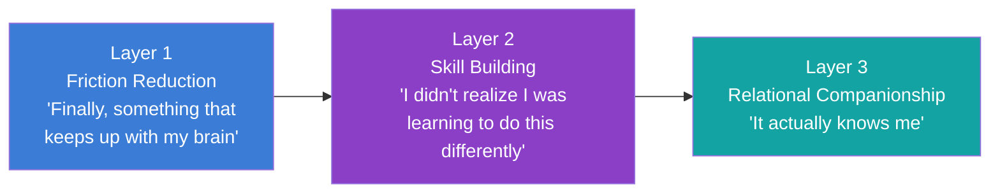
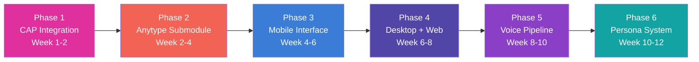

> **Status:** SUPERSEDED · **Archived:** 2026-07-01 · **Superseded by:** `03-Products/Cytonome/Yar/yar-product-spec.md`
>
> Consolidated into the canonical product spec. Kept for provenance; do not edit.

> **Status**: Active
> **Date**: 2026-05-29
> **Author**: \@mohammadi
> **Audience**: engineers, stakeholders
> **Tags**: `yar`, `cytonome`, `product`, `implementation`

> [!NOTE]
> **TL;DR**: Yar is a personalized cognitive companion built by neurodivergent minds, for everyone. Three product pillars: friction reduction (capture thoughts before they vanish), cognitive skill building (invisible growth via CBT-adjacent conversation), and relational companionship (longitudinal understanding of your patterns). Six implementation phases over 12 weeks. Privacy by architecture, not by promise.
> **Source**: [yar-product-implementation.md](file:///home/mohammadi/Documents/ObsidianVault/02-Products/cytonome-yar/yar-product-implementation.md) (canonical: [product-implementation-vault.md](file:///home/mohammadi/Documents/ObsidianVault/03-Engineering/docs-repo/cytonome/yar/product-implementation-vault.md))

# 🧠 Yar Product Implementation (ADHD-Friendly)

**Status**: Draft | **Date**: 2026-05-17

---

> [!TIP]
> **Section Summary**: This document defines what Yar is (and is not), who it serves, the three-pillar product model, the five-surface product ecosystem, six implementation phases, and model evaluation results for ASR/TTS.

## ⚡ What Yar Is (One Paragraph)

Yar is the companion that sits beside you and reduces the **invisible tax** of existing in systems not designed for your cognition. It remembers what you forget. It translates what you mean into what they need to hear. It catches you when your brain is looping. It holds context about you, so you do not have to carry everything yourself.

## ⚠️ What Yar Is NOT

| Not | Why |
|---|---|
| ❌ A therapist or diagnostic tool | It is a companion, not a clinician |
| ❌ A productivity system | No streaks, no red overdue tasks, no optimization guilt |
| ❌ A masking engine | It never teaches you to hide who you are |
| ❌ A replacement for professional support | It builds bridges to support, not walls around it |
| ❌ A dependency machine | It teaches fishing, not just gives fish |

## 🏗️ The Three Pillars

| Pillar | What It Does |
|---|---|
| **Friction Reduction** | Voice/text capture before thoughts vanish, brain-dump routing, gentle planning, semantic lookup |
| **Skill Building** | ND/NT communication translation (both directions), emotional aftercare, pattern surfacing, CBT-adjacent scaffolding |
| **Relational Companionship** | Communication preferences per person, vocal biomarker tracking, reflection without judgment |

## 🎯 Target Audience

| Segment | Pain Point | How Yar Helps |
|---|---|---|
| **ADHD adults** | Thought loss, executive dysfunction, shame spirals | Voice capture, gentle planning without guilt |
| **Autistic adults** | Communication mismatch, social load, sensory overwhelm | Bidirectional translator, consistent interface |
| **2e (twice-exceptional)** | Brilliant but can not operationalize | Schema-aware capture, auto-linking, semantic retrieval |
| **Late-diagnosed adults** | Decades of half-working coping strategies | Emotional aftercare, longitudinal pattern visibility |
| **ND researchers** | Hyperfocus without capture, context-switching | Browser extension, knowledge graph, gentle task management |

## 📱 Product Ecosystem

| Product | Interface | Status |
|---|---|---|
| **Yar** (backend) | API + CLI | ✅ MVP |
| **Yar Mobile** | Flutter app (iOS/Android) | ✅ Hackathon MVP |
| **Yar Browser Extension** (Cytomark) | Chrome/Firefox MV3 | 🔜 Planned |
| **Yar Desktop** | Tauri v2 wrapper | 🔜 Planned |
| **Yar Web** | Static web shell | ⚠️ Basic |

> [!IMPORTANT]
> **The browser extension may be the most important interface.** People spend enormous time in browsers. Contextual capture where cognition already happens is more valuable than a separate app switch.

## 🎨 Design Principles (by ND, for ND)

| Principle | In Practice |
|---|---|
| **No shame, ever** | No streaks. No red overdue tasks. No "you missed 3 days." |
| **Identity-safe** | Communication translation preserves intent. Never teaches masking. |
| **Frictionless** | Support where cognition already happens (browser, voice). |
| **Trust-first** | Health tracking is a Layer 3 feature, not day-1 surveillance. |
| **Teaching fishing** | Skill building embedded in companionship, not separate lessons. |
| **Consistent, predictable** | Interface never rearranges. Surprising UI changes are hostile. |
| **Private by architecture** | On-device AI. "We literally can not look at your data." |

## 🏗️ Six Implementation Phases

| Phase | Key Deliverables |
|---|---|
| **1: CAP Integration** | Replace dict factories with Pydantic models, implement sidecar with in-process fallback |
| **2: Anytype Submodule** | Refactor 48KB monolithic adapter into 8 modules, connection pooling, CAP guard at write boundary |
| **3: Mobile Interface** | Evaluate Cactus vs LiteRT-LM, offline queue, persona animation (Rive) |
| **4: Desktop + Web** | Enhanced static web shell (Path A), Tauri v2 desktop wrapper |
| **5: Voice Pipeline** | Gemma 4 native audio input for ASR, platform TTS for v1 |
| **6: Persona System** | YAML persona definition, visual state machine (idle/listening/thinking/speaking/empathic), Character Card V3 export |

## 🎤 Voice Model Evaluations

### ASR (Speech-to-Text)

| Model | Speed | Accuracy | Edge Size | Multilingual |
|---|---|---|---|---|
| Whisper (base/small) | Good | Good | 74 to 244 MB | ✅ 99 langs |
| **Gemma 4 E2B** | Good | Good | ~1.5 GB | ✅ 35+ langs |
| Parakeet TDT-0.6B | **Best** | **Best** | ~400 MB | ❌ English only |

**Recommendation**: Use Gemma 4's native audio input (already integrated). It collapses ASR + understanding into one model call.

### TTS (Text-to-Speech)

| Model | Quality | Size |
|---|---|---|
| Platform TTS | Variable | 0 MB |
| Kokoro 82M | High (#1 HF Arena) | ~82 MB |
| Fish Audio S2 Pro | Excellent | ~3 GB |

**Recommendation**: Start with platform TTS for v1. Kokoro 82M is the first upgrade when voice quality matters.

## 🧪 Testing Strategy

| Layer | Tool | Coverage |
|---|---|---|
| Unit tests | pytest | >80% on cap/, anytype/ |
| Integration | pytest + httpx | All API routes |
| CAP conformance | CAP runner | 120+ tests |
| CAP hardening | Adversarial suite | 40+ tests |
| E2E backend | pytest + subprocess | Capture to route to store to retrieve |
| E2E mobile | Flutter integration | Voice to capture to display |
| Pressure | locust / custom | Concurrent load, guard throughput |

## ⚠️ Known Sub-Optimal Decisions

| Decision | Concern | Revisit When |
|---|---|---|
| SQLite as only store | No vector store for RAG | Semantic retrieval needs upgrade |
| Ollama as model host | No NPU acceleration on mobile | Cactus evaluation completes |
| 48KB monolithic Anytype adapter | Untestable, unmaintainable | Phase 2 |
| Static web shell | Ugly, limited | Phase 4 |
| No persona system | No sense of Yar's character | Phase 6 |
| Platform TTS only | Robotic, not warm | When voice quality matters |

---

> [!TIP]
> **Glossary**

| Term | Plain-Language Definition |
|---|---|
| **ND/NT** | Neurodivergent / Neurotypical |
| **2e** | Twice-exceptional: gifted with a co-occurring learning difference or disability |
| **CBT** | Cognitive Behavioral Therapy, a structured approach to changing thought patterns |
| **CAP** | Cytognosis Assurance Protocol, the safety framework for AI outputs |
| **Anytype** | A decentralized knowledge management tool used as Yar's graph storage backend |
| **Cactus** | A Flutter-native on-device LLM framework with hybrid cloud/edge routing |
| **LiteRT-LM** | Google's Lightweight Runtime for Language Models, optimized for Gemma |
| **Rive** | A real-time animation tool for creating interactive vector animations |
| **MV3** | Chrome Manifest V3, the current standard for browser extensions |