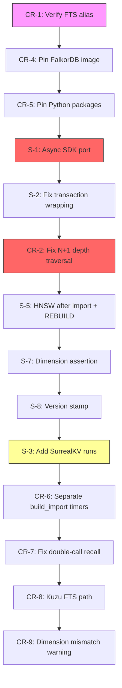
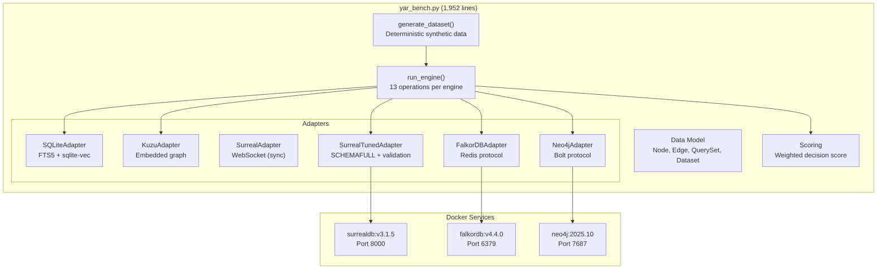

# Yar Benchmarking Master Plan

> **Status**: Active
> **Date**: 2026-07-10
> **Author**: @shahin
> **Audience**: engineers, stakeholders
> **Tags**: `yar`, `benchmark`
> **Variants**: Technical (this doc) - Readable (Obsidian twin optional, same filename) - Agent (n/a)

**BLUF.** This document is the single authoritative reference for the Yar storage and GraphRAG benchmark program. It consolidates the current state of benchmarks (PATCH10 baseline), all 20 known issues (12 package-level + 8 SurrealDB code-level), the 9 code revisions (CR-1 through CR-9), database installation status on this machine, and the full execution plan for PATCH11. **SurrealDB's last-place finish (score 9.38 at 100k) is a confirmed configuration artifact; the corrected retest targeting score 3 to 5 is the primary objective.**

---

## Table of Contents

1. [Current State Assessment](#1-current-state-assessment)
2. [Database Installation Guide](#2-database-installation-guide)
3. [Benchmark Code Revision Plan](#3-benchmark-code-revision-plan)
4. [Execution Plan](#4-execution-plan)
5. [Verification and Reporting](#5-verification-and-reporting)
6. [GraphRAG Benchmark Extension](#6-graphrag-benchmark-extension)
7. [cytomem Assessment and Optimization](#7-cytomem-assessment-and-optimization)
8. [Risk Register](#8-risk-register)

---

## 1. Current State Assessment

### 1.1 Architecture Decision (from PATCH10)

The benchmark program validated this architecture. This plan does not change it; it determines whether SurrealDB graduates from "retest candidate" to "validated GraphRAG projection."

| Role | Selection | Status |
|---|---|---|
| Source of truth | Yar op-log / CRDT state | **Confirmed** |
| On-device MVP | SQLite + FTS5 + sqlite-vec | **Confirmed** |
| Server graph projection | FalkorDB | **Confirmed** |
| GraphRAG projection candidate | SurrealDB (tuned) | **Retest required** |
| Embedded graph experiment | LadybugDB (Kuzu fork) | Archived upstream; fork recommended |
| Mature server fallback | Neo4j | Adapter fixes needed before final ranking |
| Sync MVP | central_oplog_pull_since_seq | **Confirmed** (12/12 edge cases) |
| Local-first sync | p2p_version_vector_delta | Phase 2 |
| Blob/archive layer | any-sync / Iroh candidate | Phase 3 |

### 1.2 Benchmark Results Summary

#### 100k All-Engine Ranking (Authoritative Decision Basis)

| Rank | Engine | Weighted Score | Notes |
|---|---|---|---|
| 1 | FalkorDB | 4.01 (original) / 4.26 (PATCH10) | Best server tier; no failures |
| 2 | SQLite | 4.23 (original) / 5.49 (PATCH10) | Best local tier; validated MVP |
| 3 | Kuzu | 5.14 | Archived upstream (Apple acquisition Oct 2025) |
| 4 | Neo4j | 5.58 | Lexical + hybrid failed entirely (300 failures each) |
| 5 | SurrealDB | 8.68 (original) / 9.38 (PATCH10 tuned) | **Configuration artifact** |

#### PATCH10 Key Latencies (100k, p50 ms)

| Operation | FalkorDB | SQLite | SurrealDB tuned |
|---|---|---|---|
| task_lookup | 3.3 | 6.8 | **445.6** |
| lexical_search | 0.5 | 1.1 | 42.8 |
| hybrid_rrf | 4.3 | 24.2 | 31.1 |
| vector_search | 4.3 | 22.5 | 16.5 |
| memory_packet | 3.1 | 23.2 | 10.8 |
| depth2_context | 0.7 | 0.2 | 4.3 |
| cold_open | 3.2 | 1165.3 | 535.8 |
| build_import | 821,037 | 26,109 | 290,134 |

#### SurrealDB DISKANN-Only Run (10k)

**Score: 1.20 (perfect).** This proves the engine is capable when configured correctly. The last-place finish reflects setup artifacts, not the engine ceiling.

### 1.3 SurrealDB Artifact Verdict

**The SurrealDB last-place score is a confirmed configuration and methodology artifact. Confidence: HIGH.**

Three root causes are proven by the benchmark's own data:

1. **FTS failure (confirmed).** FTS index creation or runtime failed; lexical and hybrid results used a CONTAINS linear scan. PATCH10 partially fixed this (60x improvement at 10k), but 100k lexical is still 42.8 ms vs FalkorDB's 0.5 ms.

2. **Sync SDK blocking I/O (confirmed).** The `surrealdb>=1.0.4` sync SDK uses blocking socket I/O per call. FalkorDB achieves sub-1 ms task lookups via persistent pipelined TCP; SurrealDB achieves 46 to 446 ms. The gap scales with dataset size, consistent with blocking socket overhead.

3. **Transaction wrapping regression (confirmed).** PATCH9 added `BEGIN TRANSACTION; INSERT; COMMIT TRANSACTION;` as a single query string, tripling per-batch cost. `build_import` regressed from 8,111 ms to 24,032 ms at 10k.

**Expected outcome after all fixes:** SurrealDB weighted score at 100k should move from approximately 9.38 into the **3 to 5 range**, making it competitive with FalkorDB (4.26) and SQLite (5.49).

### 1.4 All Known Issues

#### Package-Level Issues (12)

| ID | Severity | Description | Status |
|---|---|---|---|
| P-1 | **Critical** | Docker volume reuse between dataset sizes corrupts Neo4j/SurrealDB vector indexes | Fixed in `run_surreal_tuned_retest.sh`; still broken in `run_full.sh` |
| P-2 | **Critical** | SurrealDB FTS ORDER BY incompatibility (`search::score(0)` vs alias form) | Fixed in PATCH10 (verify in `yar_bench.py`) |
| P-3 | **High** | Kuzu `lexical_search` always CONTAINS scan; FTS extension path absent | Open |
| P-4 | **High** | FalkorDB Docker image unpinned (`latest`) | Open |
| P-5 | **Medium** | `build_import` timer includes schema/index creation for server engines only | Open |
| P-6 | **Low** | Volume deletion silently ignored (`\|\| true` in `reset_stack`) | Open |
| P-7 | **Low** | `wait_for_services.py` has fixed 8s post-wait; no index readiness check | Open |
| P-8 | **Medium** | `--dim` defaults to 128 in CLI; scripts pass 384 | Open (trap for manual users) |
| P-9 | **Medium** | `surrealdb_tuned` `build_import` 2 to 3x slower than legacy adapter | Open (CR-6 in code revisions) |
| P-10 | **High** | SurrealDB `depth2`/`depth3` N+1 sequential round trips | Open |
| P-11 | **Medium** | `task_lookup` at 100k = 445 ms; no `(kind, created_at)` compound index | Open |
| P-12 | **Medium** | Python packages unpinned (`>=` minimums only) | Open |

#### SurrealDB Code-Level Issues (8)

| ID | Impact | Description | File/Lines | Status |
|---|---|---|---|---|
| S-1 | **Highest** | Sync SDK per-call blocking I/O (task_lookup 46 to 446 ms) | `yar_bench.py` L766-814 | Open |
| S-2 | **High** | Transaction wrapping triples build_import (24k vs 8k ms) | `yar_bench.py` L1161-1174 | Open |
| S-3 | **High** | RocksDB default; no comparable SurrealKV run | `docker-compose.yml`, retest script | Open |
| S-4 | **Medium** | Silent brute-force fallback after KNN failure | `yar_bench.py` L1222-1230 | Open |
| S-5 | **Medium** | HNSW built incrementally during bulk load; no `REBUILD INDEX` | `yar_bench.py` L1140-1153 | Open |
| S-6 | **Medium** | Volume deletion silently ignored | `run_surreal_tuned_retest.sh` L8 | Open |
| S-7 | **Low** | No dimension assertion on embedding field | `yar_bench.py` L1108 | Open |
| S-8 | **Low** | Version not stamped with `sys::version()` | `yar_bench.py` L933-938 | Open |

### 1.5 Code Revision Status

| CR | Description | Priority | Status |
|---|---|---|---|
| CR-1 | Verify PATCH10 FTS ORDER BY alias form | P1: Correctness | **Likely landed** (verify at runtime) |
| CR-2 | Fix SurrealDB depth2/depth3 N+1 loop | P1: Correctness | **Open** |
| CR-3 | Add fresh-volume reset to `run_full.sh` | P1: Correctness | **Open** (mitigated by using `run_surreal_tuned_retest.sh`) |
| CR-4 | Pin FalkorDB Docker image | P1: Correctness | **Open** |
| CR-5 | Pin Python package versions | P2: Methodology | **Open** |
| CR-6 | Separate schema/index creation time in build_import | P2: Methodology | **Open** |
| CR-7 | Eliminate double-call recall measurement | P2: Methodology | **Open** |
| CR-8 | Implement real FTS extension path for Kuzu | P2: Methodology | **Open** |
| CR-9 | Warn on dimension mismatch with existing volumes | P2: Methodology | **Open** |

---

## 2. Database Installation Guide

### 2.1 Current Installation Status (This Machine)

**Scan date:** 2026-07-08 | **OS:** Linux 7.0.0-22-generic (x86_64)

| Database | Native Binary | Docker Container | Python SDK | Status |
|---|---|---|---|---|
| **SQLite** | `/usr/bin/sqlite3` | N/A (embedded) | `sqlite3` (stdlib) | ✅ **Ready** |
| **FalkorDB** | N/A | `yar-falkordb` (Up 41h, `latest` tag) | Not in global pip | ⚠️ **Running but unpinned** |
| **SurrealDB** | Not installed | `yar-surrealdb` (Up 41h, `v3.1.5`, **unhealthy**) | Not in global pip | ⚠️ **Running but unhealthy** |
| **Neo4j** | Not installed | `cytos-neo4j` (Up 41h, `5.18.1-community`) | Not in global pip | ⚠️ **Running (cytomem instance, not benchmark)** |
| **Kuzu** | N/A (embedded via pip) | N/A | Not in global pip | ⚠️ **Needs venv install** |

> [!WARNING]
> SurrealDB container `yar-surrealdb` is reporting **unhealthy** status. Investigate with `docker logs yar-surrealdb` before running benchmarks. Also, a second SurrealDB container `cytos-surrealdb` is running (from cytomem), using `latest` tag. These use different ports and should not conflict.

> [!IMPORTANT]
> FalkorDB is running with `latest` tag, which violates reproducibility (Issue P-4). Must pin before benchmark runs.

### 2.2 SQLite (Embedded, No Server)

**Current status:** ✅ Ready. `/usr/bin/sqlite3` available.

**Installation (if missing):**
```bash
sudo apt-get install -y sqlite3 libsqlite3-dev
```

**Python extensions (in benchmark venv):**
```bash
pip install "sqlite-vec>=0.1.6"
```

**Optimal benchmark configuration (already applied in `yar_bench.py`):**

| Parameter | Value | Rationale |
|---|---|---|
| `PRAGMA journal_mode=WAL` | Write-ahead logging | Concurrent reads during writes |
| `PRAGMA synchronous=NORMAL` | Reduced fsync | Benchmark-safe; production uses FULL |
| `PRAGMA temp_store=MEMORY` | In-memory temp tables | Faster sorts |
| `PRAGMA cache_size=-200000` | 200 MB page cache | Covers 100k dataset |
| `PRAGMA mmap_size=1073741824` | 1 GB memory-map (optional) | Desktop-only; add for production Yar |

**No changes needed for benchmarking.**

### 2.3 FalkorDB (Docker Server)

**Current status:** ⚠️ Running but using unpinned `latest` tag.

**Fix before benchmarking:**
```bash
# Check current FalkorDB version
docker exec yar-falkordb falkordb --version 2>/dev/null || \
  docker exec yar-falkordb redis-cli INFO server | head -5

# Pull pinned image
docker pull falkordb/falkordb:v4.4.0

# Update docker-compose.yml line 22:
# FROM: image: falkordb/falkordb:latest
# TO:   image: falkordb/falkordb:v4.4.0
```

**Installation from scratch (if no container exists):**
```bash
docker pull falkordb/falkordb:v4.4.0
```

The benchmark `docker-compose.yml` handles startup. FalkorDB uses ports **6379** (Redis protocol) and **3000** (HTTP browser).

**Key tuning parameters:**

| Parameter | Default | Benchmark | Notes |
|---|---|---|---|
| `FALKORDB_MAX_QUEUED_QUERIES` | 25 | 25 | Sufficient for serial benchmark |
| `FALKORDB_TIMEOUT` | 0 (unlimited) | 0 | No query timeout during benchmark |
| `FALKORDB_RESULT_SET_SIZE` | 10000 | 10000 | Sufficient for top-k retrieval |
| Memory | System default | 1 to 2 GB | Docker memory limit |

**Python SDK (in benchmark venv):**
```bash
pip install "redis>=5.0" "falkordb>=1.0.0"
```

### 2.4 SurrealDB (Docker Server)

**Current status:** ⚠️ Running v3.1.5 but **unhealthy**. Investigate before proceeding.

**Diagnostic steps:**
```bash
docker logs --tail 50 yar-surrealdb
docker inspect yar-surrealdb --format='{{.State.Health.Status}}'
# If stuck, restart:
docker restart yar-surrealdb
# Wait and re-check:
sleep 10 && docker inspect yar-surrealdb --format='{{.State.Health.Status}}'
```

**Version pinning (for PATCH11):**

The benchmark package pins `v3.1.3`. Upgrade to `v3.1.5`:
- v3.1.4 fixed `type::field('id')` equality doing full table scans (directly relevant to `task_lookup`)
- v3.1.5 is a security patch + cold-start race fix

```bash
docker pull surrealdb/surrealdb:v3.1.5

# Update docker-compose.yml line 3:
# FROM: image: surrealdb/surrealdb:v3.1.3
# TO:   image: surrealdb/surrealdb:v3.1.5
```

**Optimal benchmark configuration:**

```yaml
# docker-compose.yml SurrealDB service
command: >
  start --bind 0.0.0.0:8000 --user root --pass root
  --index-compaction-interval 5s
  --slow-log-threshold 100
  ${SURREAL_STORE:-surrealkv:///data/yarbench.db}
```

| Parameter | Value | Rationale |
|---|---|---|
| Storage backend | `surrealkv:///data/yarbench.db` | SurrealKV is SurrealDB's native MVCC store; less write amplification than RocksDB |
| `--index-compaction-interval` | `5s` | Faster index compaction during benchmark |
| `--slow-log-threshold` | `100` | Log queries over 100ms for debugging |
| Schema mode | `SCHEMAFULL` | Eliminates per-record type inference overhead |
| Port | 8000 | Default WebSocket/HTTP RPC |

**Storage backend comparison (must benchmark both):**

| Backend | Use Case | Expected Advantage |
|---|---|---|
| `rocksdb:///data/yarbench.db` | PATCH10 baseline comparison | Direct comparison to Ali's results |
| `surrealkv:///data/yarbench.db` | Optimized native backend | Lower write amplification, faster imports |

**Python SDK (in benchmark venv):**
```bash
pip install "surrealdb>=1.0.4"
# Verify async class name:
python -c "import surrealdb; print(dir(surrealdb))"
# SDK 2.0.0 renames AsyncSurrealDB to AsyncSurreal
```

### 2.5 Neo4j (Docker Server)

**Current status:** ⚠️ Running (cytomem instance at `5.18.1-community`). The benchmark uses a separate pinned version (`2025.10`).

**Installation for benchmark:**
```bash
docker pull neo4j:2025.10

# Linux kernel tuning (required):
sudo sysctl -w vm.max_map_count=262144
# Make persistent:
echo "vm.max_map_count=262144" | sudo tee -a /etc/sysctl.conf
```

**Heap and cache configuration (in `docker-compose.yml`):**

| Parameter | Value | Rationale |
|---|---|---|
| `NEO4J_server_memory_heap_initial__size` | `2g` | Java heap initial |
| `NEO4J_server_memory_heap_max__size` | `4g` | Java heap maximum |
| `NEO4J_server_memory_pagecache_size` | `2g` | Page cache for graph traversal |
| Ports | 7474 (HTTP), 7687 (Bolt) | Default |

**Python SDK (in benchmark venv):**
```bash
pip install "neo4j>=5.28"
```

> [!NOTE]
> The benchmark Neo4j instance (`neo4j:2025.10`) is separate from the cytomem instance (`neo4j:5.18.1-community` on port 7687). Ensure port assignments do not conflict. The benchmark `docker-compose.yml` should use different host ports if the cytomem instance will remain running.

### 2.6 Kuzu (Embedded via pip)

**Current status:** ⚠️ Not installed in global Python. Needs venv install.

**Installation (in benchmark venv only):**
```bash
pip install "kuzu>=0.11.0"
```

Kuzu is fully embedded (in-process via C++ shared library). No Docker container or server needed. No tuning knobs exposed.

> [!WARNING]
> Kuzu was acquired by Apple in October 2025 and the upstream repo is archived. The community fork **LadybugDB** is the recommended alternative. For benchmarking purposes, the archived `kuzu>=0.11.0` pip package still works.

**Known limitation:** The FTS extension query syntax changed across versions. The benchmark currently falls back to `CONTAINS` scan for all Kuzu lexical operations (Issue P-3). CR-8 addresses this.

### 2.7 Resource Budget

| Engine | Approx Disk (100k) | Approx RAM (Docker) | Notes |
|---|---|---|---|
| SQLite | ~400 MB (file) | N/A (embedded) | |
| Kuzu | ~500 MB (directory) | N/A (embedded) | |
| SurrealDB RocksDB | ~2 to 3 GB volume | 1 to 2 GB container | |
| SurrealDB SurrealKV | ~1.5 to 2 GB volume | 1 to 2 GB container | Estimated; less write amplification |
| FalkorDB | ~800 MB volume | 1 to 2 GB container | |
| Neo4j | ~2 GB volume | 4 to 6 GB (Java heap) | |

**Minimum total for a full 100k run: 8 GB RAM, 30 GB free disk.**

---

## 3. Benchmark Code Revision Plan

### 3.1 Priority 1: Correctness Fixes (MUST Apply Before Any Comparable Run)

#### CR-1: Verify PATCH10 FTS ORDER BY Alias Form

**File:** `db_benchmark/yar_bench.py` lines ~1191-1207
**Status:** Likely already landed. **Verify at runtime.**

```bash
grep -n "search::score" db_benchmark/yar_bench.py
```

Both occurrences must show the alias form:
```python
# CORRECT (PATCH10 form):
q = f"SELECT yid, search::score(0) AS score FROM node WHERE body @0@ $q ORDER BY score DESC LIMIT {lim};"

# BROKEN (pre-PATCH10 form):
q = f"SELECT yid, search::score(0) FROM node WHERE body @0@ $q ORDER BY search::score(0) DESC LIMIT {lim};"
```

**Runtime verification:** Run with `--surreal-strict-validation` and check `fts_body_runtime` in `engine_meta.json`. If it says `"body fulltext failed"` or `"fulltext_failed_contains_fallback"`, the fix has not landed.

---

#### CR-2: Fix SurrealDB depth2/depth3 N+1 Query Pattern

**File:** `db_benchmark/yar_bench.py` lines 949-969
**Impact:** HIGH (inflates SurrealDB graph-traversal scores by an order of magnitude)

**Before (N+1 loop):**
```python
# Lines 949-969: SurrealAdapter.depth2
# Fetches first-hop edges, then loops over each node
# with sequential WebSocket round trips
first_hop = self._q("SELECT VALUE dst FROM edge WHERE src = $id LIMIT $fan", ...)
for node_id in first_hop:
    second_hop = self._q("SELECT VALUE dst FROM edge WHERE src = $node_id LIMIT $fan", ...)
```

**After (single two-hop query):**
```surrealql
SELECT VALUE dst FROM edge
WHERE src IN (SELECT VALUE dst FROM edge WHERE src = $id LIMIT $fan)
LIMIT $lim;
```

As a single `_q()` call. Apply the same pattern to `depth3`:
```surrealql
SELECT VALUE dst FROM edge
WHERE src IN (
  SELECT VALUE dst FROM edge
  WHERE src IN (SELECT VALUE dst FROM edge WHERE src = $id LIMIT $fan)
  LIMIT $fan
)
LIMIT $lim;
```

Apply to both `SurrealAdapter` and `SurrealTunedAdapter` (which inherits these methods).

> [!IMPORTANT]
> Label runs as **"pre-CR2"** and **"post-CR2"** when comparing. This change materially shifts SurrealDB graph-traversal scores and is a methodology correction, not an engine performance improvement.

---

#### CR-3: Add Fresh-Volume Reset to `run_full.sh`

**File:** `db_benchmark/run_full.sh`
**Impact:** Critical for Neo4j; high for SurrealDB in the un-tuned adapter.

**Mitigation:** Use `run_surreal_tuned_retest.sh` (which already calls `reset_stack()` with `docker compose down -v`) instead of `run_full.sh`. If `run_full.sh` is used, add volume teardown before each invocation:

```bash
# Add before each run section in run_full.sh:
docker compose down -v --remove-orphans
docker compose up -d
python wait_for_services.py
```

---

#### CR-4: Pin FalkorDB Docker Image

**File:** `db_benchmark/docker-compose.yml` line 22

**Before:**
```yaml
image: falkordb/falkordb:latest
```

**After:**
```yaml
image: falkordb/falkordb:v4.4.0  # Pinned 2026-07-08; verify at hub.docker.com/r/falkordb/falkordb/tags
```

---

### 3.2 Priority 2: Methodology Improvements (Apply for Fair Comparison)

#### CR-5: Pin All Python Package Versions

**File:** `db_benchmark/requirements.txt`

```bash
# After successful install:
pip freeze > requirements_pinned.txt
# Replace >= with == for all packages
# Minimum pins: surrealdb, kuzu, falkordb, neo4j, redis, sqlite-vec
```

---

#### CR-6: Separate Schema/Index Creation from Data Insert in build_import

**File:** `db_benchmark/yar_bench.py` lines 1700-1705 (`run_engine`), all adapter `load()` methods.

Split `load()` into `schema_setup(dataset)` and `data_insert(dataset)`. Record `build_schema_ms` and `build_insert_ms` as separate measurements alongside the aggregate `build_import`.

---

#### CR-7: Eliminate Double-Call Recall Measurement

**File:** `db_benchmark/yar_bench.py` lines 1753-1766

**Before:** `timed_call(fn)` executes `fn()` for timing, then `fn()` is called again for recall.
**After:** `timed_call` returns `(Measurement, Optional[Any])`. Recall is computed from the returned result.

---

#### CR-8: Implement Real FTS Extension Path for Kuzu

**File:** `db_benchmark/yar_bench.py` lines 718-722 (`KuzuAdapter.lexical_search`)

For Kuzu >=0.11, attempt:
```python
CALL query_fts_index('Node', 'node_fts_index', $q)
```
Record result in `capabilities["lexical"]` as either `"fts"` or `"contains_fallback"`.

---

#### CR-9: Warn on Dimension Mismatch with Existing Volumes

**File:** `db_benchmark/wait_for_services.py` or new pre-run check script

Record `--dim` and `--nodes` of the last run in `.last_run_params.json` and compare at startup.

---

### 3.3 SurrealDB-Specific Code Fixes (From Code Audit)

These fixes correspond to Issues S-1 through S-8 and should be applied alongside the CRs above.

#### Fix S-1: Switch to Async SDK (CRITICAL)

**File:** `db_benchmark/yar_bench.py` lines 766-814

**Minimum viable async port:**
```python
import asyncio
from surrealdb import AsyncSurreal  # VERIFY class name first!

class SurrealAdapter:
    def __init__(self, url: str):
        self._loop = asyncio.new_event_loop()
        self.db = self._loop.run_until_complete(self._async_setup(url))

    async def _async_setup(self, url: str):
        db = AsyncSurreal(url)
        await db.connect()
        await db.sign_in({"user": "root", "pass": "secret"})
        await db.use("yar", "personal")
        return db

    def _q(self, query: str, params: dict | None = None):
        return self._loop.run_until_complete(
            self.db.query(query, params or {})
        )
```

**Expected impact:** `task_lookup` drops from 46 to 446 ms to the **1 to 5 ms range**.

> [!IMPORTANT]
> The async class name differs between SDK versions. SDK 1.x uses `AsyncSurrealDB`. SDK 2.0.0 renames it to `AsyncSurreal`. **Run `python -c "import surrealdb; print(dir(surrealdb))"` before coding.**

---

#### Fix S-2: Correct Transaction Wrapping

**File:** `db_benchmark/yar_bench.py` lines 1161-1174

**Before (3 statements in one query string):**
```python
self._q("BEGIN TRANSACTION; INSERT INTO node $rows; COMMIT TRANSACTION;", {"rows": rows})
```

**After (3 separate `_q()` calls):**
```python
try:
    self._q("BEGIN TRANSACTION;")
    self._q("INSERT INTO node $rows;", {"rows": rows})
    self._q("COMMIT TRANSACTION;")
except Exception:
    try:
        self._q("CANCEL TRANSACTION;")
    except Exception:
        pass
    self._q("INSERT INTO node $rows;", {"rows": rows})
```

Apply to both node and edge insertion loops.

---

#### Fix S-3: Add Comparable SurrealKV Runs

Add to `run_surreal_tuned_retest.sh`:
```bash
# SurrealKV at 10k, all three engines (comparable)
reset_stack "surrealkv:///data/yarbench.db"
run_case results_patch11_10k_surrealkv_hnsw "sqlite,falkordb,surrealdb_tuned" 10000 200 50 hnsw 1 || true

# SurrealKV at 100k, all three engines (comparable)
reset_stack "surrealkv:///data/yarbench.db"
run_case results_patch11_100k_surrealkv_hnsw "sqlite,falkordb,surrealdb_tuned" 100000 300 100 hnsw 1 || true
```

---

#### Fix S-5: Move HNSW Index After Data Import + REBUILD

Move vector index creation from before insertion loop (lines 1140-1153) to after the edge insertion loop, then add:
```python
try:
    self._q("REBUILD INDEX idx_node_vec ON TABLE node;")
    self.capabilities["vector_index_rebuild"] = "ok"
except Exception as e:
    self.capabilities["vector_index_rebuild"] = f"failed: {e}"
```

---

#### Fix S-7: Add Dimension Assertion

**Line 1108:**
```python
# FROM:
"DEFINE FIELD embedding ON TABLE node TYPE array<float>",
# TO:
f"DEFINE FIELD embedding ON TABLE node TYPE array<float> ASSERT array::len($value) = {dataset.dim}",
```

---

#### Fix S-8: Version Stamp with `sys::version()`

**Lines 933-938:**
```python
try:
    ver = self._q("SELECT * FROM sys::version();")
    return {"surreal_version": str(ver)[:200], "surreal_info_db": str(self._q("INFO FOR DB;"))[:500]}
except Exception:
    return {"surreal_info_db": str(self._q("INFO FOR DB;"))[:500]}
```

### 3.4 Revision Application Order

Apply in this order. Each step should be verified before proceeding.



---

## 4. Execution Plan

### 4.1 Phase 0: Environment Preparation (30 minutes)

```bash
# 1. Create benchmark branch
cd ~/repos/cytognosis/yar_revisions/yar_supervisor_reproducible_benchmark_package
git checkout -b yar-bench-patch11

# 2. Set up Python environment
cd db_benchmark
python3.12 -m venv .venv
source .venv/bin/activate
pip install --upgrade pip
pip install -r requirements.txt

# 3. Verify SDK async class name
python -c "import surrealdb; print(dir(surrealdb))"

# 4. Pull pinned Docker images
docker pull surrealdb/surrealdb:v3.1.5
docker pull falkordb/falkordb:v4.4.0
docker pull neo4j:2025.10

# 5. Linux kernel tuning for Neo4j
sudo sysctl -w vm.max_map_count=262144

# 6. Freeze pinned requirements
pip freeze > requirements_pinned.txt
```

### 4.2 Phase 1: Apply Code Revisions (2 to 4 hours)

Apply in the order specified in Section 3.4. After each fix:

```bash
# Quick smoke test (3k, single engine, ~2 min)
python yar_bench.py --engines surrealdb_tuned --nodes 3000 --dim 384 \
  --surreal-strict-validation
```

**Validation checkpoints:**

| After Fix | Check |
|---|---|
| S-1 (async) | `task_lookup` p50 < 10 ms at 3k |
| S-2 (transactions) | `build_import` < 5,000 ms at 3k |
| CR-2 (depth N+1) | `depth2_context` p50 < 2 ms at 3k |
| CR-1 (FTS) | `engine_meta.json` has no `contains_fallback` |

### 4.3 Phase 2: Full Benchmark Run (PATCH11) (90 to 150 minutes)

#### Clean State

```bash
cd ~/repos/cytognosis/yar_revisions/yar_supervisor_reproducible_benchmark_package/db_benchmark

# Kill any running benchmark containers
docker rm -f yar-surrealdb yar-falkordb yar-neo4j 2>/dev/null || true

# Remove all related volumes (CRITICAL)
docker compose down -v --remove-orphans 2>/dev/null || true
docker volume ls -q | grep -E 'db_benchmark|surreal|falkor|neo4j' | \
  xargs -r docker volume rm 2>/dev/null || true

# Verify volumes are gone
docker volume ls -q | grep -E 'surreal|falkor|neo4j'
# Should return empty

source .venv/bin/activate
```

#### Pre-Run Validation

```bash
# 1. FTS alias form verified
grep -n "search::score" yar_bench.py
# Both must show: search::score(0) AS score ... ORDER BY score DESC

# 2. --dim 384 in run scripts
grep -n "\-\-dim" run_surreal_tuned_retest.sh

# 3. SurrealDB image = v3.1.5
grep "surrealdb/surrealdb" docker-compose.yml

# 4. FalkorDB image pinned (not 'latest')
grep "falkordb/falkordb" docker-compose.yml

# 5. Requirements pinned
grep ">=" requirements.txt
# Should be empty after pinning
```

#### Run

```bash
./run_surreal_tuned_retest.sh
```

**Test matrix (6 cases):**

| Case | Dataset | Backend | Engines | Strict | Est. Time |
|---|---|---|---|---|---|
| 1 | 10k | RocksDB + HNSW | sqlite, falkordb, surrealdb_tuned | Yes | 15 min |
| 2 | 10k | RocksDB + DISKANN | surrealdb_tuned only | No | 5 min |
| 3 | 10k | SurrealKV + HNSW | surrealdb_tuned only (probe) | No | 5 min |
| 4 | 100k | RocksDB + HNSW | sqlite, falkordb, surrealdb_tuned | Yes | 45 min |
| 5 (new) | 10k | SurrealKV + HNSW | sqlite, falkordb, surrealdb_tuned | Yes | 15 min |
| 6 (new) | 100k | SurrealKV + HNSW | sqlite, falkordb, surrealdb_tuned | Yes | 45 min |

**Monitor the 100k SurrealDB import:**
```bash
docker logs -f yar-surrealdb
```

### 4.4 Phase 3: Collect and Compare (15 minutes)

```bash
# Collect slim results
./collect_tuned_results.sh
# Produces: yar_surreal_tuned_results_slim.zip

# Copy PATCH10 reference
cp ../reference_results/final_db_slim.zip ./

# Compare
python compare_surreal_tuned.py \
  --old final_db_slim.zip \
  --new yar_surreal_tuned_results_slim.zip \
  --out PATCH11_VS_PATCH10_COMPARISON.md
```

### 4.5 Expected Timeline

| Phase | Duration | Cumulative |
|---|---|---|
| Phase 0: Environment | 30 min | 30 min |
| Phase 1: Code revisions | 2 to 4 hours | 2.5 to 4.5 hours |
| Phase 2: Full benchmark | 90 to 150 min | 4 to 7 hours |
| Phase 3: Collect and compare | 15 min | 4.25 to 7.25 hours |
| Phase 4: Reporting | 30 min | ~5 to 8 hours total |

**Total estimated wall time: 5 to 8 hours for a complete PATCH11 run.**

### 4.6 Comparison Against Reference Results

Ali's reference run was on macOS M3 8 GB RAM. This machine is Linux x86_64. Absolute latency numbers **will differ**. What should be comparable:

| Metric | Expected Behavior |
|---|---|
| **Ranking order** | FalkorDB first at 100k, SQLite second, SurrealDB tuned third |
| **Score magnitudes** | SurrealDB 100k should be in **3 to 5 range** (Ali got 9.38; target after fixes) |
| **FTS improvement** | 10k `lexical_search` for `surrealdb_tuned` < 10 ms (Ali got 3.5 ms in PATCH10) |
| **task_lookup** | After async port: 10k < 10 ms (Ali got 46 ms without async port) |
| **build_import** | After transaction fix: 10k < 12,000 ms (Ali got 24,032 ms with broken wrapping) |

---

## 5. Verification and Reporting

### 5.1 Validity Gates (All Must Pass)

A run is **not valid** for architecture comparison unless **all** of the following hold:

| Gate | Check | How to Verify |
|---|---|---|
| G-1 | `run_db_surreal_tuned.sh` used (not `run_full.sh`) | Check script name in terminal history |
| G-2 | Docker volumes deleted and verified before each case | `docker volume ls -q` returns empty for benchmark volumes |
| G-3 | FalkorDB image pinned | `grep "falkordb" docker-compose.yml` shows tag, not `latest` |
| G-4 | `--dim 384` explicitly passed | `grep "\-\-dim" run_surreal_tuned_retest.sh` shows 384 |
| G-5 | Strict validation passes | `engine_meta.json` contains `"validation_fts_body_not_table_iterator": "True"` and `"validation_vector_has_knn": "True"` |
| G-6 | FTS working | `lexical_search` p50 at 10k < 20 ms |
| G-7 | No CONTAINS fallback | grep `engine_meta.json` for `fulltext_failed_contains_fallback`: zero hits |
| G-8 | Engine version recorded | `engine_meta.json` contains SurrealDB `sys::version()` or `INFO FOR DB` result |
| G-9 | RUN_MANIFEST.md exists | Written alongside output zips |

### 5.2 Report Format

#### RUN_MANIFEST.md Template

```markdown
# Yar Benchmark Run Manifest

## Environment
- **Date:** YYYY-MM-DD HH:MM TZ
- **Hardware:** [CPU, RAM, disk free]
- **OS:** [uname -a]
- **Python:** [python3 --version]
- **Docker:** [docker --version]
- **Docker Compose:** [docker compose version]

## Image Tags
- SurrealDB: surrealdb/surrealdb:v3.1.5
- FalkorDB: falkordb/falkordb:v4.4.0
- Neo4j: neo4j:2025.10

## Applied Code Revisions
- [x] CR-1 (FTS alias verified)
- [x] CR-2 (depth N+1 fixed)
- [ ] CR-3 (run_full.sh volumes -- N/A, used run_surreal_tuned_retest.sh)
- [x] CR-4 (FalkorDB pinned)
- [x] CR-5 (packages pinned)
- [x] S-1 (async SDK)
- [x] S-2 (transaction wrapping)
- ...

## Results Summary
| Engine | 10k Score | 100k Score |
|---|---|---|
| FalkorDB | [X] | [X] |
| SQLite | [X] | [X] |
| SurrealDB tuned (RocksDB) | [X] | [X] |
| SurrealDB tuned (SurrealKV) | [X] | [X] |
```

#### PATCH11_VS_PATCH10_COMPARISON.md Template

```markdown
# PATCH11 vs PATCH10 Comparison

| Engine | PATCH10 Score (100k) | PATCH11 Score (100k) | Delta | Notes |
|---|---|---|---|---|
| FalkorDB | 4.26 | [measured] | [delta] | |
| SQLite | 5.49 | [measured] | [delta] | |
| SurrealDB tuned (RocksDB) | 9.38 | [measured] | [delta] | Target: 3-5 |
| SurrealDB tuned (SurrealKV) | N/A | [measured] | N/A | New in PATCH11 |
```

### 5.3 Where to Store Results

| Artifact | Path |
|---|---|
| Raw results zip | `yar_supervisor_reproducible_benchmark_package/db_benchmark/yar_surreal_tuned_results_slim.zip` |
| Comparison report | `yar_supervisor_reproducible_benchmark_package/db_benchmark/PATCH11_VS_PATCH10_COMPARISON.md` |
| Run manifest | `yar_supervisor_reproducible_benchmark_package/db_benchmark/RUN_MANIFEST.md` |
| This master plan | `~/Claude/Projects/Yar/benchmarks/BENCHMARK_MASTER_PLAN.md` |
| Updated tracker | `docs/03-Products/Cytonome/Yar/spec/STORAGE_BENCHMARK_TRACKER.md` |
| GraphRAG results | `~/Claude/Projects/Yar/benchmarks/graphrag/GRAPHRAG_BENCHMARK_RESULTS.md` |
| cytomem optimization | `cytomem/benchmark/CYTOMEM_OPTIMIZATION_REPORT.md` |

---

## 6. GraphRAG Benchmark Extension

### 6.1 Objective

Extend the Yar storage benchmark with **retrieval quality benchmarks** over a realistic cytomem query set. This determines whether SurrealDB's single-query GraphRAG capability (FTS + KNN + graph expansion in one SurrealQL query) justifies promoting it to the GraphRAG projection role.

### 6.2 Query Set (50 Queries, 4 Classes)

| Class | Count | Description | Baseline |
|---|---|---|---|
| A: Artifact lookup | 15 | Exact or near-exact name search | `ARTIFACT_SEARCH` keyword scan |
| B: Semantic recall | 15 | Conceptual/topical search | `SEMANTIC_SEARCH` vector index |
| C: Cross-repo relationship | 10 | Multi-hop graph traversal | `RELATES_TO` edges |
| D: Temporal/recency | 10 | "What changed recently?" | Episode chain traversal |

Save as `benchmark/graphrag_query_set.json`.

### 6.3 Tools to Benchmark

| Tool | New Infrastructure | Expected Advantage |
|---|---|---|
| cytomem ARTIFACT_SEARCH (current) | None | Baseline: O(n) CONTAINS scan |
| cytomem SEMANTIC_SEARCH (current) | None | Baseline: HNSW vector-only |
| neo4j-graphrag HybridRetriever | `pip install neo4j-graphrag` | BM25 + vector in one call |
| Graphiti `search()` (in codebase) | Code change only | BM25 + semantic + graph + temporal |
| LightRAG | `pip install lightrag-hku`, Ollama | Document-level entity extraction |

### 6.4 Metrics

| Metric | Description |
|---|---|
| **Hits@5** | Fraction of queries with at least one correct result in top 5 |
| **MRR** | Mean reciprocal rank of first correct result |
| **P50 latency** | Median wall-clock time from query to result |
| **P95 latency** | 95th percentile wall-clock time |

### 6.5 SurrealDB Single-Query GraphRAG Pattern

The target SurrealQL query combining all three retrieval modalities:

```surrealql
-- Single-query GraphRAG: FTS + KNN + graph expansion + RRF
LET $fts_results = (
  SELECT yid, search::score(0) AS fts_score
  FROM node WHERE body @0@ $query
  ORDER BY fts_score DESC LIMIT 20
);
LET $knn_results = (
  SELECT yid, vector::distance::knn() AS knn_dist
  FROM node WHERE embedding <|20, 100|> $embedding
);
LET $graph_expansion = (
  SELECT VALUE ->mentions->node.yid
  FROM $anchor_ids
);
-- RRF fusion
SELECT yid,
  search::rrf(fts_rank, knn_rank, graph_rank) AS rrf_score
FROM ...
ORDER BY rrf_score DESC LIMIT 10;
```

This pattern is documented in the SurrealDB Tuning and GraphRAG Guide, Section 4.3.

---

## 7. cytomem Assessment and Optimization

### 7.1 Current State

cytomem uses Neo4j Community Edition with approximately 7,322 Artifact nodes. The `ARTIFACT_SEARCH` query uses `CONTAINS` (O(n) linear scan). The Graphiti integration exists in code but is not wired into the MCP recall path.

### 7.2 Optimizations (Priority Order)

| Priority | Fix | Expected Impact |
|---|---|---|
| 1 | Add full-text index on Artifact nodes | Keyword search latency: ~50 ms to < 5 ms |
| 2 | Activate Graphiti `search()` in MCP recall | BM25 + semantic + graph + temporal in one call |
| 3 | Add `neo4j-graphrag-python` HybridRetriever | Unified hybrid retrieval path |
| 4 | Embed document body (first 512 tokens) | Content-aware semantic recall |
| 5 | Batch ingest embeddings | Faster re-ingest operations |

### 7.3 Full-Text Index Creation

```cypher
CREATE FULLTEXT INDEX artifact_fulltext IF NOT EXISTS
FOR (a:Artifact)
ON EACH [a.title, a.path, a.repo, a.artifact_type]
OPTIONS { indexConfig: { `fulltext.analyzer`: 'standard-no-stop-words' } }
```

### 7.4 Keep-Neo4j Verdict Criteria

Confirm the recommendation if:
- Full-text index reduces keyword-search latency to under 5 ms
- HybridRetriever Hits@5 is comparable to or better than SEMANTIC_SEARCH baseline
- No evidence of latency degradation justifying FalkorDB migration

---

## 8. Risk Register

| ID | Risk | Probability | Impact | Mitigation |
|---|---|---|---|---|
| R-1 | PATCH10 FTS fix may already be in `yar_bench.py` | Medium | Low | Verify at runtime with strict validation |
| R-2 | SurrealDB `build_import` at 100k takes ~290 seconds | High | Medium | Monitor with `docker logs`; do not timeout prematurely |
| R-3 | SurrealKV health check passes before engine ready | Medium | Medium | Increase `YARBENCH_POST_WAIT_SECONDS` from 8 to 20 |
| R-4 | Neo4j requires `vm.max_map_count` on Linux | High | High | Run `sudo sysctl -w vm.max_map_count=262144` |
| R-5 | `kuzu>=0.11.0` API instability | Medium | Low | Check `_collect_first_col` result iterator paths |
| R-6 | Docker volume names auto-prefixed by compose project name | Medium | Medium | Verify after cleanup with `docker volume ls` |
| R-7 | CR-2 (depth N+1 fix) changes scores materially | Certain | Medium | Label runs as pre/post-CR2 |
| R-8 | `run_full.sh` does not apply fresh volumes | High | Critical | **Never use `run_full.sh`**; use `run_surreal_tuned_retest.sh` |
| R-9 | Async SDK port causes entire suite to fail | Low | High | Revert to sync, note failure, continue remaining items |
| R-10 | cytomem Neo4j not running at `bolt://localhost:7687` | Low | Medium | Skip cytomem section if down; proceed with storage benchmark |
| R-11 | SurrealDB container unhealthy on this machine | **Active** | High | Investigate `docker logs yar-surrealdb` before proceeding |
| R-12 | Port conflicts between benchmark and cytomem Neo4j | Medium | Medium | Assign different host ports in compose file |

### Abort Conditions

Stop and report without completing the run if:

1. The async SDK port causes the **entire** benchmark suite to fail (not just SurrealDB): undo the async port, revert to sync, note the failure, and continue with remaining items.
2. Docker volume cleanup fails after **three retries**: do not proceed with a contaminated run.
3. SurrealDB consistently hangs at `build_import` for more than **10 minutes** at 100k: capture `docker logs yar-surrealdb` and report.
4. The cytomem Neo4j is not running: skip Section 7, proceed with storage benchmark.

---

## Appendix A: Source Document Cross-Reference

| Document | Path | Role |
|---|---|---|
| Benchmark Package README | `yar_supervisor_reproducible_benchmark_package/README.md` | Run instructions, architecture decision |
| Benchmark Evaluation and Results | `Grants/.../benchmark/BENCHMARK-evaluation-and-results.md` | Authoritative results, 12 issues, validity gates |
| Benchmark Revision Plan | `Grants/.../_supporting/BENCHMARK_REVISION_PLAN.md` | CR-1 through CR-9, rerun procedure |
| SurrealDB Code Audit | `Grants/.../_supporting/SURREALDB_CODE_AUDIT.md` | 8 code-level issues with line references |
| Benchmark Digest | `Grants/.../_supporting/BENCHMARK_DIGEST.md` | SurrealDB deep-dive, artifact analysis |
| Antigravity Execution Prompt | `Grants/.../benchmark/ANTIGRAVITY-execution-prompt.md` | Full runbook for coding agent |
| cytomem GraphRAG Integration | `Grants/.../benchmark/CYTOMEM-graphrag-integration-and-optimization.md` | Architecture assessment, framework comparison |
| Final Benchmark Report | `yar_supervisor_.../reports/Yar_Data_Fabric_Final_Benchmark_Report_EN.md` | Complete benchmark report with sync results |
| Supervisor Brief | `yar_supervisor_.../reports/Yar_Data_Fabric_Supervisor_Brief_EN.md` | One-page decision summary |

## Appendix B: Benchmark Code Architecture



## Appendix C: Weighted Scoring Formula

Each operation is normalized against the fastest engine's p50, then multiplied by its weight:

| Operation | Weight |
|---|---|
| memory_packet | 0.16 |
| vector_search | 0.12 |
| incremental_write | 0.12 |
| depth2_context | 0.10 |
| build_import | 0.10 |
| hybrid_rrf | 0.08 |
| lexical_search | 0.08 |
| task_lookup | 0.06 |
| depth3_context | 0.04 |
| reverse_refs | 0.04 |
| person_memory | 0.04 |
| project_decisions | 0.04 |
| cold_open | 0.02 |

**Coverage weight:** 1.2 for fully functional engines; 1.06 for engines with one or more failed operations.

**Lower score is better.** Operations that are missing or majority-failed receive a penalty of **10x weight**.
