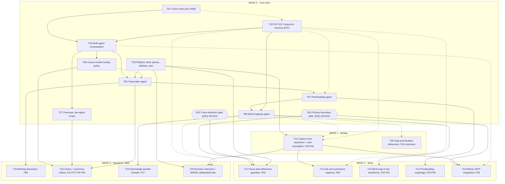

> **Status**: Active
> **Date**: 2026-07-19
> **Author**: research agent (subagent, Cowork session)
> **Audience**: whoever schedules and staffs the Wave 0 build next
> **Tags**: `yar`, `dependency-graph`, `wave-0`, `build-order`, `planning`

# Yar Wave 0: Implementation Dependency Graph

**BLUF:** This graph covers **20 implementation tasks plus 2 governance/policy gates** (22 nodes total) needed to build Yar's Wave 0 core infrastructure and its Wave 1 to 3 follow-ups. **Five tasks have zero hard dependencies** and anchor the whole build: cross-node sync, the PeT knowledge graph, the platform shell, and the two safety/privacy governance gates. No hard-dependency cycles exist; the main risks are soft-coupling tensions between the spec-writing tiers in `SPECS-INVENTORY.md` and the actual engineering build order, detailed in Section 4.

**Reading time:** about 8 minutes. **If you only read one thing:** Section 3, the topological build order.

**Method note:** this graph merges two lenses that were each partial on their own. `SPECS-INVENTORY.md` gives the depends_on chain for the 10 Wave 0 *specs* that still need writing or updating. `FEATURE-VERIFICATION.md` gives the wave/architecture view tying those specs to the actual F-id features they unlock or gate, through Wave 3. This document combines both into one task-level build-order DAG, adds 2 governance-gate nodes (privacy-boundary schema, crisis-detection module) that recur as blockers across multiple tasks, and resolves a few places where the two source documents' orderings diverge (flagged explicitly in Section 4, not silently picked one way).

---

## 1. Dependency graph

Solid arrows are hard dependencies (cannot start without). Dotted arrows are soft dependencies (better with, not required). Hexagons are governance/policy gates, not engineering tasks. Subgraphs mirror the Wave 0 to 3 continuum from `FEATURE-VERIFICATION.md`.

---

## 2. Task table

| Task / feature (+F-id) | Hard depends-on | Soft depends-on | Blocks | Rationale |
|---|---|---|---|---|
| **T01** Cross-node sync (F68) | None. Foundational. Builds on the already-decided `SPEC-storage-engine.md` (SQLite device, FalkorDB server, ACTIVE). | None. | T04 | Finalizes the open O-1 decision (Loro+Iroh, scored 36/45, vs. any-sync, scored 35/45) plus the wire-protocol, ACL, and conflict-resolution design. Every agent and every multi-device feature needs a settled sync substrate first. |
| **T02** PeT KG / long-term memory (F67) | None new (storage substrate already ACTIVE). Must first confirm what "PeT" stands for (zero grep hits in the docs tree) and state whether it reuses or stays distinct from `cytomem` (a separate, already-decided Neo4j system, explicitly out of scope for Yar). | T01 (design coherence: the KG's op-log and versioning format should align with the sync CRDT format). | T04, T08, T07 (soft), T12 (soft), T20 (soft) | Resolves the HippoRAG vs. ReMem vs. SurrealDB Spectron choice. No agent should start writing long-term-memory operations before this lands. |
| **T03** Platform shell: phone, desktop, web (supports F41, F59) | None. Reuses the already-built org-wide interface templates (Flutter phone, React 19 + Tailwind + shadcn web, Tauri v2 desktop, MV3 extension). | None. | T06, T10, T11, T20 | Thin adoption spec by research cost (SPECS-INVENTORY Tier 4), but structurally it is the shell every feature surface renders inside. Drafting the doc is cheap and can happen anytime; the shell existing is a real prerequisite for shipping any UI. |
| **G01** Privacy-boundary schema gate (policy decision, no F-id) | None. `privacy-boundary-spec.md` is design-final; only a business/legal decision to un-defer it post-YC is outstanding. | None. | T11, T15 | Gates F65, F28, and F42 alike, per `FEATURE-VERIFICATION.md`'s own rationale. This is a policy decision, not an engineering task; flag for counsel before scheduling engineering work against it. |
| **G02** Crisis-detection module gate (policy decision, no F-id) | None. `MODULE-crisis-detection.md` is design-final; only the `CapLiteGuard` keyword gate is shipped. | None. | T11 | `features.json`'s own gated_note pairs crisis-detection with the privacy-boundary schema as the two conditions both required before any gated feature ships. |
| **T04** Multi-agent orchestration (architecture spec, no F-id) | T01, T02 | None. | T05, T06, T17, T15 (soft) | Reconciles three different agent-naming schemes already in the corpus (the README's placer/reviser/side-thread framing, `SPEC-multi-agent.md`'s 5-role Supervisor/Interviewer/Transcriber/Placer/Reviser topology, and `YAR-CLIENT-EVAL.md`'s shipped 3-agent framing). Must land before the three worker specs so they inherit one naming scheme. |
| **T05** Cactus model-routing policy (no F-id) | T04 | T06, T07, T08 (better formalized against real agents with measured latency and cost; not required to draft the policy) | T18 | Mirrors `SPEC-edge-ai-hybrid.md`'s own dependency list (multi-agent, CSP, storage-engine). Formalizes the existing Cactus-routing sketch from `cap-comprehensive.md` section 5, rather than re-deriving it. |
| **T17** Personas: per-agent scope (`SPEC-personas-voice.md` update, no F-id) | T04 | None. | T18 | Cannot decide whether the transcriber, proofreader, and mind-mapper each need a distinct persona, or stay voiceless, until T04 finalizes what those agent roles are even named and scoped as. |
| **T06** Transcriber agent (supports F01, F59) | T04, T03 | T05 (can default to the already-decided Edge/Supervisor split in `SPEC-edge-ai-hybrid.md` until Cactus policy lands) | T07, T16, T18 | First pipeline stage per `SPEC-multi-agent.md`'s brainmap loop; captures raw input. Needs an STT model choice (whisper.cpp, WhisperKit, faster-whisper), streaming partial-transcript handling, and the latency budget already referenced in `SPEC-edge-ai-hybrid.md`. |
| **T07** Proofreading agent / NER (supports F58, F33) | T06 | T02 (only the "maps to prior conversations" enhancement needs this; base NER via the existing Instructor/spaCy/scispaCy tiered pattern does not) | T08, T14 | Consumes the transcript. Reuses the canonical Cytognosis structured-extraction pattern (OntoGPT, then Instructor/PydanticAI, then spaCy/scispaCy) already documented for Cytos rather than re-deriving it; adds medSpacy and DSPy evaluation. |
| **T08** Mind-mapping agent (supports F13, F14, F15, F31, F60) | T07, T02 | None additional (the base spatial/conversational loop already works against the existing local store, F52; only cross-session resume strictly needs T02) | T13, T19, T09 (soft), T10 (soft), T20 (soft) | Consumes proofread and tagged output, organizes it into the KG/memory layer, per SPECS-INVENTORY's own description of this spec. "Resume prior conversations" is the specific piece gated on the new F67; the core loop already rates "Full" coverage today. |
| **T09** Daily prioritization refinement (F24 extension; supports F07, F04) | F24, F07, F04 (existing, shipped or planned; already satisfied, no unresolved dependency inside this graph) | T08 (reuse F60's conversational-iteration pattern as the interaction model, explicitly named "the model to reuse") | None modeled further | F24's spec already prioritizes tasks by confidence and recency, but as a single JSON pass, not a back-and-forth loop. Extends F24's scope rather than minting a new id, per the source document's own recommendation. Flag: F24 sits at official Wave 2 despite reading like a Wave 1 wedge feature; a founder call on reprioritizing it is still open. |
| **T10** Capture from anywhere + web annotation base (F59, F50) | T03 | T08, T02 (richer linking of highlights into the mind-map and PeT KG; not required for basic capture and annotate) | T12, T15, T20 | F59 already names phone, computer, and browser as capture surfaces; F50 is WADM-based (W3C Web Annotation Data Model). This is the baseline capture/annotate surface, shipping on phone, desktop, and web ahead of the dedicated browser extension (T20). |
| **T11** Focus and adherence guardian (F65) | G01, G02, T03 | F06, F39 (existing shipped focus-companion and nudges; the base UX this differentiates from, not a blocker) | None modeled further | No existing feature combines permissioned cross-app monitoring, plan-deviation detection, and adjustable enforcement strength. Gated for the same reason as F28 and F42. Flag for counsel and privacy review before scheduling engineering work; the gate is a policy call, not a technical one. |
| **T12** Ask and summarize captures (F66) | T10; F52, F19 (existing, already satisfied) | T02 (better longitudinal recall quality; usable against F52's existing local store on day one without it) | None modeled further | Closes the Memex "Summarize" and "Ask" capabilities. Explicitly documented as shippable before F67 lands, just weaker. |
| **T13** Mind-map to doc transforms (F34, F61) | T08 | None. | None modeled further | Turns a thought map into a document, report, or email via templates; a direct consumer of the Mind-mapping agent's output. |
| **T14** Proofreading supertags later (F33 refinement, F09) | T07 | None (Tana-style competitive research already done via `EVAL-tana.md` and `tana-outliner-deep-dive.md`, external to this graph) | None modeled further | "Later: supertags" extension of personal-vocabulary recognition; needs the Proofreading agent's base NER first. |
| **T15** Memex MCP integration (F28) | G01, T10 | T04 (uses the MCP/A2A tooling already named in `SPEC-multi-agent.md`'s toolset) | None modeled further | Gated for the identical reason as F65 (privacy-boundary schema); needs a capture surface to connect external tools to. |
| **T16** Meeting diarization (F69) | T06 | None. | None modeled further | Reverses a 2026-07-18 deferral (`CANONICAL-EDITS-SPEC.md:41`, "Defer, do not add now") on the grounds that the Transcriber and Mind-mapping agents now make multi-speaker capture concretely in scope. Flag for counsel: diarization processes other people's speech, and multi-party recording consent law varies by US state; this is a distinct legal gate from the usual crisis/privacy-boundary review. |
| **T18** Cactus + personas rollout (F11, F57 base; F29, F45 refinement) | T05, T17, T06 | None. | None modeled further | Activates dynamic local/cloud routing plus per-agent persona voice across the shipped pipeline. Realistically a Wave 3 concern per `FEATURE-VERIFICATION.md`, even though the routing policy (T05) is drafted much earlier. |
| **T19** Disentangle parallel threads (F47) | T08 | None. | None modeled further | Sorts several simultaneous thought-map threads into workable strands. Independently lands in Wave 3 in both this build-order lens and the official IPS-scored catalog, a cross-check that the placement logic is sound. |
| **T20** Browser extension / WADM + Memex parity (refreshes F50/F59 surface, no new F-id) | T03, T10 (both clear by Layer 2 to 3; held to Layer 6 by deliberate product sequencing, not a technical blocker) | T02, T08 (richer highlight-to-note linking once the PeT KG and Mind-mapping agent exist) | None modeled further | `06_WADM_ANNOTATION_INTEGRATION.md` is explicitly superseded; needs re-grounding in current architecture plus a refreshed Memex-parity gap check. Anchored explicitly as "late" per the build instructions, so it is deliberately held even though its dependencies resolve early. |

---

## 3. Topological build order

Six layers. Layer 1 has no hard prerequisites. Every later layer's tasks hard-depend on at least one task in an earlier layer. Order within a layer does not matter for scheduling.

| Layer | Tasks | Wave | Notes |
|---|---|---|---|
| **1** | T01, T02, T03, G01, G02 | Wave 0 | Zero hard in-degree. Start all five in parallel. G01 and G02 need a decision-maker, not an engineer; do not staff them like engineering tickets. |
| **2** | T04, T10, T11 | Wave 0 to 2 | T04 needs T01 and T02. T10 and T11 only need the platform shell (T03), plus, for T11, both governance gates. |
| **3** | T05, T17, T06, T12, T15 | Wave 0, 1, 2 | T05, T17, and T06 need T04. T12 and T15 need T10. |
| **4** | T07, T16, T18 | Wave 0, 3 | T07 needs T06. T16 needs T06. T18 needs T05, T17, and T06 together. |
| **5** | T08, T14 | Wave 0, 2 | T08 needs T07 and T02. T14 needs T07. |
| **6** | T09, T13, T19, T20 | Wave 1, 2, 3 | T09, T13, and T19 need T08. T20's hard dependencies (T03, T10) actually clear at Layer 2 to 3; it sits here by deliberate product sequencing ("browser extension is late"), not a technical blocker. |

Pipeline order inside Layers 3 to 5 is strict and sequential, matching the anchoring instruction: **Transcriber (T06) before Proofreading (T07) before Mind-mapping (T08)**. Each consumes the previous stage's output; none can be reordered without redefining the pipeline.

---

## 4. Cycles and risky coupling

**No hard-dependency cycles exist in this graph.** A full trace confirms nothing points back into T01, T02, T03, G01, or G02, and every edge flows strictly from an earlier layer to a later one.

Six coupling risks are worth flagging, in order of how much schedule damage they could do if missed:

1. **Cactus spec vs. Cactus rollout.** `SPECS-INVENTORY.md` tiers the Cactus routing spec (T05) right after multi-agent orchestration (T04), ahead of the pipeline workers. `FEATURE-VERIFICATION.md`'s wave lens places full Cactus rollout (T18) at Wave 3, after the pipeline ships. Break this by treating T05 as policy-drafting only; do not let "Cactus isn't finished" block the pipeline, which already has an interim routing default in `SPEC-edge-ai-hybrid.md`'s Edge/Supervisor split.

2. **Platform shell tiering mismatch.** `SPECS-INVENTORY.md` places the platform-delivery spec in Tier 4 (last) because it is a thin, low-research-cost document. This graph places the underlying shell (T03) at Layer 1, because no feature surface (T10, T11, T20) can ship without it existing. Break this by separating "write the adoption doc" (cheap, do anytime) from "the shell exists and Yar's deltas are wired in" (a real prerequisite); do not let the doc's low tier ranking imply the shell itself can wait.

3. **PeT KG's depth inside Mind-mapping.** The current shipped and groundwork mind-map loop (F13, F14, F15, F31, F60) already works against the existing local store (F52) and does not need to sit idle waiting on T02. Only the cross-session "resume conversations" piece strictly needs it. This document keeps T08 as one node for readability; split it into a base-loop task (soft-depends on T02) and a resume-integration task (hard-depends on T02) if the schedule needs finer granularity.

4. **Governance gates are decisions, not tickets.** G01 and G02 are both already design-final specs, blocked purely on a business or legal call to un-defer them post-YC. If nobody owns that decision, T11 and T15 stall silently with no engineering fix available. Assign an owner and a deadline for the G01/G02 review, separate from the engineering sprint board. The same applies to T16's counsel flag: multi-party recording consent law varies by US state, and that is a distinct gate from the usual crisis/privacy-boundary review.

5. **T01 and T02 are undeclared siblings.** Cross-node sync and the PeT KG sit in the same tier with no stated dependency between them, but their designs are logically coupled: the KG's op-log and versioning format should match the sync layer's CRDT format, or a costly rework follows later. Recommend one joint design review between the two spec owners before either is marked done, even though neither blocks the other's start.

6. **T09 looks unblocked but should not jump the queue.** Its only hard dependencies (F24, F07, F04) are pre-existing shipped or planned features outside this graph, so a schedule built on hard dependencies alone could start it at Layer 1. It sits at Layer 6 here because it soft-depends on reusing T08's conversational-iteration pattern (F60); building a bespoke iteration loop first and reworking it later is the trap to avoid.

---

## Sources checked

- `Yar/_planning-20260719/FEATURE-VERIFICATION.md` (F65 to F69 gap definitions, wave/architecture mermaid, mapping table)
- `Yar/_planning-20260719/SPECS-INVENTORY.md` (spec inventory, Wave 0 build list, depends_on tiering)
- `docs/03-Products/Cytonome/Yar/research/features.json` (canonical 69-feature hierarchy, status and gated flags)

---

## Addendum: 2026-07-19 spec-refresh (post Wave 0 spec suite)

All 10 Wave 0 spec areas (plus SPEC-meeting-diarization) were written or updated on 2026-07-19 and committed to `docs/03-Products/Cytonome/Yar/spec/` on the `yar-specs` branch. Decisions that change this document's inputs:

| Area | Resolution | Effect |
|---|---|---|
| **Sync (O-1)** | **any-sync** (MIT server nodes) adopted transport-only; Yar reducer stays sole authority; **Loro** (MIT) as CRDT container lib, Automerge 3.0 fallback | Effort revised **28-48 down to 12-24 eng-weeks** (core transport adoption 4-6 wk; the rest is E2E encryption, key custody, and hardening; E2E encryption is a hard launch gate) |
| **PeT KG (F67)** | PeT defined (Personal Temporal KG, bitemporal facts); substrate is the already-decided SQLite+FTS5+sqlite-vec device store and FalkorDB server projection, no new database; cytomem converges at the schema/API layer | Effort revised **35-65 down to 28-50 eng-weeks** (the "PeT is undefined" risk premium is retired; retrieval-quality tuning risk remains) |
| **Cactus routing** | Borrow the RoutingPolicy concept, do **not** ship the Cactus binary: its custom source-available license terminates free use at $2M funding or revenue (30-day commercial-license clause), incompatible with the YC spinout; license-clean alternatives (llama.cpp MIT, MLC-LLM Apache-2.0, LiteRT Apache-2.0, ONNX Runtime MIT) cover every runtime role. **Gemma 4 confirmed plain Apache-2.0** (ai.google.dev/gemma/apache_2) | Effort revised **7-13 down to 5-10 eng-weeks**; both license-verification flags are closed |
| **Transcriber** | whisper.cpp (MIT) + WhisperKit (MIT, Apple) + sherpa-onnx (Apache-2.0) device tier; faster-whisper (MIT) server tier (already shipped); raw audio stays device-only; cloud STT not adopted | Estimate stands (15-25) |
| **Proofreader** | Gazetteer (shipped) then GLiNER (Apache-2.0) + spaCy (MIT) then Instructor (MIT) tiers; DSPy offline-only; medSpaCy evaluated, not adopted for MVP | Estimate stands (6-12) |
| **Mind-mapper** | LLM placement + strict conservatism contract; river (BSD-3) advisory only; no adoptable core library confirmed | Estimate stands (24-40); still the highest-risk worker |
| **Diarization (F69)** | pyannote.audio (MIT code, CC-BY-4.0 community pipeline) + diart (MIT) streaming + FluidAudio (Apple) + sherpa-onnx fallback; NVIDIA Sortformer excluded (CC-BY-NC weights). Phone-call recording is OS-blocked on iOS/Android, so mobile scope is in-person meeting mode only | Estimate stands (10-20); counsel questions are now structured in the spec (consent states, BIPA voiceprints, GDPR Art. 9) |
| **Personas** | One Voice Persona, worn by the Interviewer only; workers voiceless by design (config, not character) | Scope-creep risk retired (2-5 stands) |
| **Multiplatform** | Thin adoption spec done; **Tauri v2 mobile recommended** for phone (one codebase), Flutter stays the org-template fallback; founder sign-off pending | Estimate stands (16-30); flagged founder decision |

**Revised total: approximately 149 to 276 eng-weeks** (was 174 to 318; midpoint about 213, down from about 246). Wave 0 core drops to about **75 eng-weeks** midpoint (was about 85). Spec-writing uncertainty is retired; remaining wide ranges are genuine engineering risk (mind-mapper structure inference, PeT retrieval quality, sync E2E hardening).

Graph-specific notes: the Section 4 spec-tier vs build-order tensions are resolved (all specs now exist, engineering can follow this graph directly). T01 risk drops (transport adopted, not built). T05 is concept-only (no vendor dependency). T16's engineering can proceed in parallel with counsel review but cannot ship before it.

### Founder decisions, 2026-07-19 (same day, post-review)

| Area | Decision | Effect |
|---|---|---|
| **Cactus routing** | Cactus REMOVED entirely (nonprofit/fully-free framing does not durably fix its license: the $2M funding-or-revenue clause is organizational, and the YC PBC arm would trip it). Feature descoped to a **simple local-vs-cloud model selection** (three-state user setting + per-agent defaults + CAP/privacy gates) | Effort revised **5-10 down to 2-4 eng-weeks**; learned routing is a reopenable later enhancement |
| **Phone framework** | **Tauri v2 on both phone and desktop, DECIDED** (Rust performance, unified framework, React ecosystem access, growing community); Flutter is contingency only | Founder-decision flag closed |
| **F69 diarization** | Counsel review DEFERRED to public release; **Phase 0 internal use ships now** (founder + consenting design partners, consent UX + PHI exclusion on). Landscape research (meeting-transcription-tools-landscape-2026-07) incorporated into the spec; no separate tooling spec needed | Legal gate no longer blocks internal builds; G01/G02 + counsel gate apply only to the public release |
| **E2E encryption** | PHASED: plaintext transition builds acceptable while all agents are local and relays are self-hosted single-tenant; hard prerequisite before any Cytognosis-hosted relay or cloud agent | Removed from the local-first launch critical path; scheduled with the cloud-agent milestone |

**Re-revised total: approximately 146 to 270 eng-weeks.** All specs promoted from draft to active on 2026-07-19.
