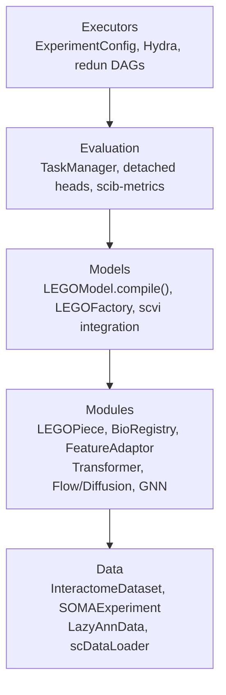
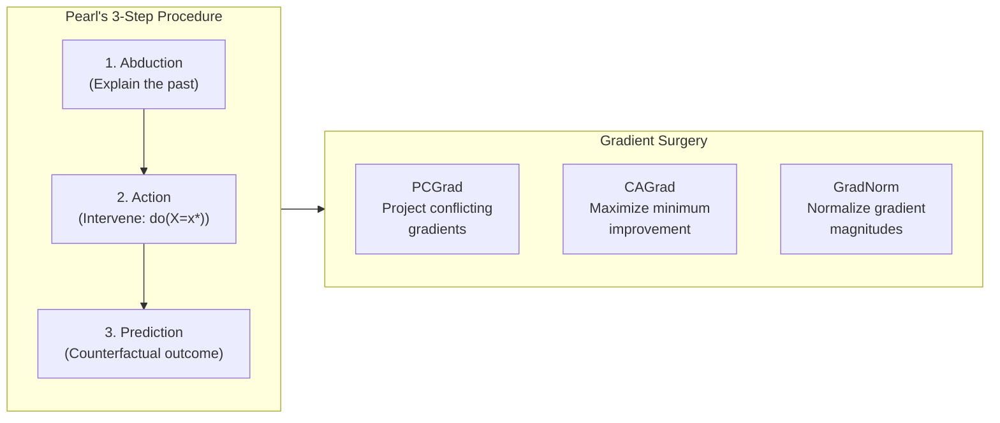

> **Status**: Active
> **Date**: 2026-05-29
> **Author**: \@mohammadi
> **Audience**: engineers
> **Tags**: `research`, `evaluation`

> [!NOTE]
> **TL;DR**: Five biological model zoos were analyzed (MONAI, Kipoi, sfaira, scvi-hub, Bioimage.IO). No single zoo is sufficient. The LEGO Registry design combines MONAI's bundle format, Kipoi's biological entity typing, sfaira's ontology integration, scvi-hub's HuggingFace patterns, and Bioimage.IO's tensor I/O specification.
> **Source**: [bio-model-zoos-research.md](file:///home/mohammadi/repos/cytognosis/docs/cytonome/yar/research/bio-model-zoos-research.md)

---

# ⚡ Biological Model Zoos: Analysis for LEGO Registry Design

📍 **Breadcrumbs**: Cytonome > Yar > Research > Bio Model Zoos

---

## ⚡ What We Take From Each Zoo

> [!TIP]
> **Section Summary**: Each zoo contributes one best-in-class capability to our LEGO Registry.

| What We Need | Best Zoo | What We Adopt |
|---|---|---|
| **Bundle structure** with config-driven composition | **MONAI** | `lego.yaml` + `configs/` directory layout |
| **Biological entity typing** (DNASeq, GenomicRanges) | **Kipoi** | LinkML BioEntity schemas (protein, gene, cell) |
| **Ontology-driven metadata** harmonization | **sfaira** | Cell Ontology, EFO, NCBITaxon via bionty |
| **HuggingFace hub** integration patterns | **scvi-hub** | HubModel + HubMetadata for model distribution |
| **Rigorous tensor I/O** typing with axes semantics | **Bioimage.IO** | Input/output tensor specs with shape constraints |
| **Multi-weight format** support | **Bioimage.IO** | PyTorch, ONNX, TorchScript export |
| **Generative model evaluation** | **scvi-hub** | scvi-criticism PPCs, scib-metrics |
| **Standardized pre/postprocessing** | **Bioimage.IO** | Transform chains in model manifests |

➡️ **What's Next?** See the `lego.yaml` manifest design in Section 7.

---

## 🔬 1. MONAI Model Zoo

> [!TIP]
> **Section Summary**: Most mature bundle format. Config-driven composition is the gold standard. Medical imaging focused (no biological entity types).

**MONAI** (Medical Open Network for AI) hosts **39+ pre-trained models** for medical imaging. **8.2k GitHub stars**, **5.5M downloads**, adopted by Siemens, NHS, Mayo Clinic.

### What We Take: Bundle Format + Config System

| Feature | Details |
|---|---|
| **Bundle structure** | `configs/` + `models/` + `docs/` + `LICENSE` |
| **Config directives** | `_target_` (class), `@` (reference), `$` (expression), `%` (macro) |
| **Composability** | Modular configs merged at runtime, CLI overrides |
| **ONNX export** | Built-in support |

<details>
<summary>🔬 Deep Dive: MONAI Config Example</summary>

```yaml
# inference.yaml
network:
  _target_: monai.networks.nets.BasicUNet
  spatial_dims: 3
  in_channels: 1
  out_channels: 2

preprocessing:
  _target_: Compose
  transforms:
    - _target_: LoadImaged
      keys: ["image"]
    - _target_: ScaleIntensityd
      keys: ["image"]

evaluator:
  _target_: monai.engines.SupervisedEvaluator
  device: "$torch.device('cuda' if torch.cuda.is_available() else 'cpu')"
  network: "@network"
  postprocessing: "@post_transforms"
```

The `@` references enable passing instantiated objects between pipeline stages. The `$` expressions evaluate Python at runtime.

</details>

**Limitations**: Medical imaging only, no biological entity types, no ontology integration, no standardized benchmarking.

---

## 🔬 2. Kipoi

> [!TIP]
> **Section Summary**: Introduced biological entity typing (DNASeq, GenomicRanges). Archived in 2022, but the concept is essential.

**Kipoi** hosted **2,206 genomics models** before being **archived in July 2022** (~242 stars). Despite sunsetting, it introduced the most important concept: **biological entity typing**.

### What We Take: Bio Entity Types

| Entity Type | What It Flags | Why It Matters |
|---|---|---|
| **`DNASeq`** | One-hot encoded DNA sequence | Enables automatic variant effect prediction |
| **`DNAStringSeq`** | String-format DNA sequence | Alternative input format |
| **`GenomicRanges`** | Chromosome, start, end coordinates | Links model inputs to genomic locations |

These types enable:
- Automatic variant effect prediction via `kipoi-veff`
- In-silico mutagenesis with reference/alternative allele comparison
- Unified interface across models

<details>
<summary>🔬 Deep Dive: Kipoi model.yaml + dataloader.yaml</summary>

```yaml
# dataloader.yaml
output_schema:
  inputs:
    name: seq
    shape: (1000, 4)
    special_type: DNASeq       # Biological entity typing!
    associated_metadata: ranges
  metadata:
    ranges:
      type: GenomicRanges      # Genomic coordinate metadata
```

```yaml
# model.yaml
schema:
  inputs:
    name: seq
    shape: (1000, 4)
    special_type: DNASeq
  targets:
    name: binding_prob
    shape: (1,)
```

</details>

⚠️ **Cautionary lesson**: The field evolved faster than Kipoi could adapt. HuggingFace absorbed the model-sharing use case. The biological entity typing concept needs modern implementation.

---

## 🔬 3. sfaira

> [!TIP]
> **Section Summary**: Ontology-driven metadata harmonization for single-cell data. Being superseded by CZ CELLxGENE Census, but the ontology patterns remain valuable.

**sfaira** (Theis Lab) provides ontology-driven metadata for single-cell RNA-seq. ~136 stars, low activity, being superseded by CELLxGENE Census.

### What We Take: Ontology Integration

| Ontology | What It Standardizes |
|---|---|
| **Cell Ontology (CL)** | Cell type identifiers (e.g., `CL:0000236`) |
| **UBERON** | Anatomical tissue identifiers |
| **TSV mapping files** | Per-dataset ontology mappings |

This enables cross-dataset comparison without manual curation. Different datasets using different names for the same cell type get harmonized automatically.

---

## 🔬 4. scvi-hub

> [!TIP]
> **Section Summary**: HuggingFace integration is the distribution standard. Also provides the best evaluation toolkit for generative models (PPCs).

**scvi-hub** is the model sharing module within **scvi-tools** (~1.6k stars). Most widely adopted probabilistic framework for single-cell genomics.

### What We Take: HuggingFace Patterns + Evaluation

| Feature | Details |
|---|---|
| **HubModel** | Pull/push pre-trained models from HuggingFace |
| **HubModelCardHelper** | Auto-generate Model Cards with metadata |
| **HubMetadata** | Standardized metadata for hub interoperability |
| **scvi-criticism** | Posterior Predictive Checks for evaluating generative models |
| **scib-metrics** | Batch correction + biological conservation metrics (JAX-accelerated) |

<details>
<summary>🔬 Deep Dive: scvi-hub Code Example</summary>

```python
from scvi.hub import HubModel

# Pull a pre-trained model
hub_model = HubModel.pull_from_huggingface_hub(
    repo_name="scvi-tools/my-scvi-model"
)
model = hub_model.model  # Lazy loading
adata = hub_model.adata

# Push a trained model
hub_model.push_to_huggingface_hub(
    repo_name="myorg/my-new-model",
    repo_create=True
)
```

</details>

---

## 🔬 5. Bioimage.IO

> [!TIP]
> **Section Summary**: Gold standard for tensor I/O typing, preprocessing specification, and multi-weight format support. Runs across 10+ consumer applications.

**Bioimage.IO** provides FAIR (Findable, Accessible, Interoperable, Reusable) deep learning models for bioimage analysis. Supported by AI4Life and Euro-BioImaging.

### What We Take: Tensor Typing + Multi-Weight + Pre/Postprocessing

| Feature | Details |
|---|---|
| **Axes system** | `b` (batch), `c` (channel), `x`/`y` (spatial), `z` (depth), `t` (time) |
| **Shape specs** | Fixed, dynamic (min + step), or reference-based |
| **Preprocessing** | Declarative transform pipelines (zero_mean_unit_variance, scale_range, etc.) |
| **Multi-weight** | PyTorch, ONNX, TorchScript, TensorFlow, Keras in one manifest |
| **Consumer software** | Fiji, ilastik, QuPath, Napari, Galaxy, and more |

<details>
<summary>🔬 Deep Dive: Bioimage.IO RDF Example</summary>

```yaml
inputs:
  - id: input_image
    axes: bcyx
    data_type: float32
    shape:
      min: [1, 1, 64, 64]
      step: [0, 0, 16, 16]
    preprocessing:
      - name: zero_mean_unit_variance
        kwargs: {mode: per_sample, axes: yx}

outputs:
  - id: segmentation_mask
    axes: bcyx
    shape:
      reference_tensor: input_image
      scale: [1, 1, 1, 1]
    postprocessing:
      - name: binarize
        kwargs: {threshold: 0.5}

weights:
  pytorch_state_dict:
    source: ./weights/model.pt
  onnx:
    source: ./weights/model.onnx
  torchscript:
    source: ./weights/model.ts
```

</details>

---

## 🔬 6. Comprehensive Comparison

> [!TIP]
> **Section Summary**: Side-by-side comparison across all dimensions.

| Dimension | MONAI | Kipoi | sfaira | scvi-hub | Bioimage.IO |
|---|---|---|---|---|---|
| **Domain** | Medical imaging | Genomics | Single-cell RNA | Single-cell omics | Bioimage analysis |
| **Status** | ✅ Active | ❌ Archived | ⚠️ Low activity | ✅ Very active | ✅ Active |
| **Stars** | ~8.2k | ~242 | ~136 | ~1.6k | ~38 |
| **Entity typing** | None | ✅ DNASeq, GenomicRanges | Cell Ontology | AnnData-native | Tensor axes |
| **Ontology** | None | None | ✅ CL, UBERON | bionty (via scverse) | None |
| **Benchmarking** | None | kipoi-veff | None | ✅ scvi-criticism PPCs | Test validation |
| **Distribution** | GitHub + CLI | pip + CLI | pip | ✅ HuggingFace | Website |
| **ONNX** | ✅ | ❌ | ❌ | ❌ | ✅ Multi-weight |

### Best-in-Class by Feature

| Feature | Winner | Why |
|---|---|---|
| Bundle/package structure | **MONAI** | Most mature, config-driven |
| Biological entity typing | **Kipoi** | Explicit bio-awareness |
| Ontology integration | **sfaira** | Harmonized annotations |
| Hub integration | **scvi-hub** | HuggingFace patterns |
| Tensor I/O specification | **Bioimage.IO** | Axes semantics + shape constraints |
| Multi-weight formats | **Bioimage.IO** | 6 formats in one manifest |
| Generative model evaluation | **scvi-hub** | PPCs + scib-metrics |
| Community/adoption | **MONAI** | 8.2k stars, clinical use |

---

## 🏗️ 7. LEGO Registry Design

> [!TIP]
> **Section Summary**: The `lego.yaml` manifest combines the best of all five zoos, tailored for Cytognosis's biological model needs.

### Existing LEGO Architecture (4 Layers)



### What `lego.yaml` Contains

| Section | Source Zoo | Purpose |
|---|---|---|
| **Metadata** | MONAI | Name, version, authors, changelog, tags |
| **bio_entities** | Kipoi + LinkML | Input/output biological entity types with ontology refs |
| **inputs/outputs** | Bioimage.IO | Tensor specs with axes, shapes, pre/postprocessing |
| **ontology_metadata** | sfaira | Organism, assay, tissue with ontology IDs |
| **lego_piece** | Custom | Module class, feature_info, frozen/detached flags |
| **weights** | Bioimage.IO | Multi-weight format (PyTorch, ONNX) |
| **benchmarks** | scvi-hub | PPCs, scib-metrics, custom metrics, test data |
| **provenance** | RO-Crate | MLflow run wrapping, training data description |
| **multi_scale** | Literature | Gradient surgery config (PCGrad/CAGrad/GradNorm) |

<details>
<summary>🔬 Deep Dive: Complete lego.yaml Example</summary>

```yaml
format_version: "1.0.0"
type: lego_model

# Metadata (MONAI)
name: "CellType Classifier v2"
version: "0.3.1"
license: Apache-2.0
tags: [single-cell, cell-type, annotation]

# Biological Entity Typing (Kipoi + LinkML)
bio_entities:
  input_entities:
    - type: bio:Gene
      schema: https://cytognosis.org/schemas/bio/gene
      identifier_type: ensembl_id
    - type: bio:Cell
      schema: https://cytognosis.org/schemas/bio/cell
      identifier_type: barcode
  output_entities:
    - type: bio:CellType
      ontology: CL

# Tensor I/O (Bioimage.IO)
inputs:
  - id: expression_matrix
    axes: "cells x genes"
    data_type: float32
    shape: {min: [1, 2000], step: [1, 0]}
    preprocessing:
      - name: log1p_normalize
      - name: highly_variable_genes

# Ontology (sfaira)
ontology_metadata:
  organism: NCBITaxon:9606
  assay: EFO:0009922
  tissue: UBERON:0000955

# Weights (Bioimage.IO)
weights:
  pytorch_state_dict:
    source: ./weights/model.pt
  onnx:
    source: ./weights/model.onnx

# Benchmarks (scvi-hub)
benchmarks:
  integration_metrics:
    suite: scib-metrics
    metrics: [silhouette_batch, nmi, ari]
```

</details>

---

## 🔬 8. Causal Models & Gradient Surgery

> [!TIP]
> **Section Summary**: Deep Structural Causal Models need special support: invertibility (normalizing flows), gradient surgery (PCGrad/CAGrad), and Pareto-optimal multi-task learning.



<details>
<summary>🔬 Deep Dive: Why Normalizing Flows for Causal Models?</summary>

**Normalizing Flows (NFs)** are preferred for Deep Structural Causal Models because:
- **Invertibility**: Bijection enables exact mapping between observed data and noise variables
- **Tractable abduction**: Noise inference is efficient via the inverse of the flow network
- **Composable modules**: Each layer can mirror a causal mechanism in the graph
- **Tractable likelihood**: Exact density evaluation via change of variables formula

In single-cell biology, CNFs (Continuous Normalizing Flows) model cell state transformations, trajectory inference, and counterfactual predictions.

</details>

<details>
<summary>🔬 Deep Dive: Gradient Surgery Methods</summary>

| Method | How It Works | When to Use |
|---|---|---|
| **PCGrad** | Projects conflicting task gradients onto each other's normal planes | Default; simple, effective |
| **CAGrad** | Finds gradient maximizing minimum improvement across all tasks | Stronger theoretical guarantees |
| **GradNorm** | Normalizes gradient magnitudes by relative training rates | When tasks have very different scales |
| **DWA** | Adjusts weights based on training progress | Dynamic task weighting |
| **MGDA** | Finds minimum-norm element in convex hull of task gradients | Pareto-optimal solutions |

</details>

---

## 🏗️ 9. Implementation Roadmap

> [!TIP]
> **Section Summary**: 17 weeks of work, prioritized from P0 (manifest format) to P4 (cloud inference).

| Priority | Component | Source | Effort |
|---|---|---|---|
| **P0** | `lego.yaml` manifest format | MONAI + Bioimage.IO | 2 weeks |
| **P0** | LinkML bio-entity typing in manifests | Kipoi + existing schemas | 1 week |
| **P1** | `LEGOHubModel` for HuggingFace | scvi-hub patterns | 2 weeks |
| **P1** | Ontology metadata in manifests | sfaira + bionty | 1 week |
| **P1** | Tensor I/O specification | Bioimage.IO axes system | 1 week |
| **P2** | ONNX export pipeline | MONAI + Bioimage.IO | 1 week |
| **P2** | scvi-criticism PPC integration | scvi-hub | 1 week |
| **P2** | Multi-weight format support | Bioimage.IO | 1 week |
| **P3** | RO-Crate provenance wrapping | RO-Crate + MLflow | 2 weeks |
| **P3** | Gradient surgery (PCGrad/CAGrad) | Literature | 2 weeks |
| **P4** | CLI tools (validate, export, publish) | MONAI CLI | 2 weeks |
| **P4** | BioEngine-style cloud inference | Bioimage.IO | 3 weeks |

---

## ❓ Open Questions

1. **Schema evolution**: How to handle breaking changes in `lego.yaml` across versions?
2. **Private models**: Should the registry support private/internal models alongside public HuggingFace distribution?
3. **Model composition**: How to specify LEGO model graphs (encoder, backbone, task heads) in YAML without losing the power of `compile()`?
4. **Validation**: Should `lego.yaml` validation be a pre-commit hook, CI step, or both?
5. **Backward compatibility**: How to wrap existing scvi-tools models in `lego.yaml` format?

---

## 📖 Glossary

<details>
<summary>Expand terminology table</summary>

| Term | Definition |
|---|---|
| **LEGO** | Cytognosis's composable biological model framework. Models are assembled from "pieces" like LEGO bricks. |
| **LEGOPiece** | The core composable unit: an `nn.Module` with biological entity metadata and frozen/detached flags. |
| **LEGOModel** | A compiled assembly of LEGOPieces with validated biological entity compatibility. |
| **BioRegistry** | Registry of biological entities (genes, proteins, cell types) with ontology IDs. |
| **FeatureAdaptor** | Dimension alignment layer between LEGOPieces with different input/output sizes. |
| **TaskManager** | Multi-objective orchestration with uncertainty weighting for multi-task learning. |
| **MONAI** | Medical Open Network for AI. The most widely adopted medical imaging AI framework. |
| **Kipoi** | A genomics model repository (archived 2022) that introduced biological entity typing. |
| **sfaira** | A single-cell data/model zoo from Theis Lab with ontology-driven metadata. |
| **scvi-hub** | The model sharing module within scvi-tools for HuggingFace distribution. |
| **Bioimage.IO** | A community-driven FAIR model zoo for bioimage analysis with rigorous tensor typing. |
| **Bundle** | A standardized directory structure containing model weights, configs, metadata, and docs. |
| **RDF** | Resource Description File. Bioimage.IO's central metadata manifest (`bioimageio.yaml`). |
| **PPC** | Posterior Predictive Check. A statistical method for evaluating generative models. |
| **scib-metrics** | A JAX-accelerated toolkit for evaluating batch correction and biological conservation. |
| **LinkML** | Linked Data Modeling Language. Used for defining biological entity schemas. |
| **Cell Ontology (CL)** | A standardized vocabulary for cell types (e.g., `CL:0000236` for B cell). |
| **UBERON** | A cross-species anatomical ontology for tissue types. |
| **EFO** | Experimental Factor Ontology. Standardized experimental assay identifiers. |
| **NCBITaxon** | NCBI Taxonomy. Standardized organism identifiers. |
| **ONNX** | Open Neural Network Exchange. A format for cross-platform model deployment. |
| **TorchScript** | PyTorch's serialization format for deploying models without Python. |
| **RO-Crate** | Research Object Crate. A standard for packaging research data with metadata. |
| **Normalizing Flow** | An invertible neural network that transforms a simple distribution into a complex one. |
| **PCGrad** | Projecting Conflicting Gradients. Removes conflicting gradient components in multi-task learning. |
| **CAGrad** | Conflict-Averse Gradient. Finds gradients that maximize minimum improvement across tasks. |
| **GradNorm** | A method that normalizes gradient magnitudes across tasks based on relative training rates. |
| **Pareto front** | The set of solutions where no objective can be improved without degrading another. |
| **MGDA** | Multiple Gradient Descent Algorithm. Finds the minimum-norm element in the convex hull of task gradients. |
| **DSCM** | Deep Structural Causal Model. Neural networks that implement causal reasoning. |
| **HuggingFace Hub** | A platform for sharing machine learning models, datasets, and demos. |
| **AnnData** | A Python data structure for annotated data matrices, standard in single-cell genomics. |

</details>