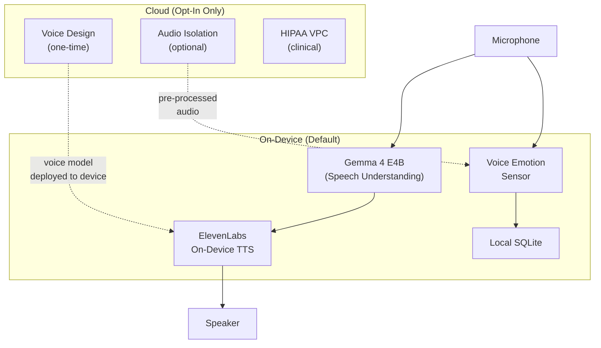

> **Status**: Active
> **Date**: 2026-05-29
> **Author**: \@mohammadi
> **Audience**: engineers
> **Tags**: `yar`, `tts`, `evaluation`, `elevenlabs`

> [!NOTE]
> **TL;DR**: ElevenLabs offers the best voice AI quality in the market. For Cytonome, adopt their **on-device TTS** (privacy-first, offline) and **Voice Design** (create Yar's companion voice). Skip their cloud-only conversational agents since we have our own Gemma cascade.
> **Source**: [elevenlabs_evaluation.md](file:///home/mohammadi/repos/cytognosis/docs/cytonome/yar/research/elevenlabs_evaluation.md)

---

# ⚡ ElevenLabs Platform Evaluation for Cytonome

📍 **Breadcrumbs**: Cytonome > Yar > Research > ElevenLabs Evaluation

---

## 🔬 1. Platform Overview

> [!TIP]
> **Section Summary**: ElevenLabs has three products. We care most about the API (TTS output) and their on-device capabilities. Their Agents product overlaps with our own architecture.

| Product | What It Does | Relevance to Cytonome |
|---|---|---|
| **ElevenAPI** | Core API for TTS, STT, voice cloning, dubbing, audio isolation | TTS output for Yar companion voice |
| **ElevenAgents** | Full-stack conversational AI with sub-second latency | Alternative to our Gemma cascade (but cloud-only) |
| **ElevenCreative** | Content creation tools (dubbing, sound effects, music) | Low priority; off-mission |

---

## 🔬 2. Capability Assessment

> [!TIP]
> **Section Summary**: On-device TTS and multi-language support are the two critical capabilities. Voice Design lets us create Yar's voice without recording a real person.

### Text-to-Speech (TTS)

| Feature | Quality | Local/Private? | Priority |
|---|---|---|---|
| **Eleven v3** | State-of-the-art expressiveness | ⚠️ Cloud API only | **HIGH** |
| **Eleven Flash v2.5** | Ultra-low latency (~75ms) | ⚠️ Cloud API only | **HIGH** |
| **On-device TTS** | Optimized for edge hardware | ✅ **Fully local** | **CRITICAL** |
| **Multi-language TTS** | 70+ languages | ✅ Both cloud and on-device | **CRITICAL** |

💡 **101 Sidebar: What is "on-device TTS"?**

> Text-to-Speech that runs entirely on your phone or laptop. No internet required. Your words never leave your device.

### Voice Cloning

| Feature | Local/Private? | Priority |
|---|---|---|
| **Instant Voice Clone** (1-2 min audio) | ❌ Cloud only | MEDIUM |
| **Professional Voice Clone** (hours of audio) | ❌ Cloud only | LOW |
| **Voice Design** (generate from text description) | ❌ Cloud only | **HIGH** |

> [!IMPORTANT]
> Voice cloning for creating Yar's default voice can be done **once** in the cloud. The resulting voice model then deploys on-device. User audio **never** needs cloud processing for daily operation.

### Conversational AI Agents (ElevenAgents)

| Feature | Local/Private? | Priority |
|---|---|---|
| Sub-second turn-taking | ❌ Cloud only | MEDIUM |
| Multimodal reasoning | ❌ Cloud only | LOW |
| Tool calling (MCP, API) | ❌ Cloud only | LOW |
| SOC 2 / HIPAA / GDPR | ✅ With BAA | MEDIUM |

⚠️ We have our own Gemma cascade for conversation. ElevenAgents is cloud-only, violating our privacy-first design.

### Speech-to-Text (STT)

| Feature | Local/Private? | Priority |
|---|---|---|
| Transcription API | ⚠️ Cloud | LOW |
| Speaker diarization | ⚠️ Cloud | LOW |

We use **Gemma 4's native audio understanding** instead.

---

## ⚡ 3. Quick Decision: What to Adopt vs. Skip

> [!TIP]
> **Section Summary**: Two clear "adopt" items, two "record for later," and everything else is a skip.

### ✅ Adopt

| Capability | Deployment | Rationale |
|---|---|---|
| **On-device TTS** | Local | Replace platform TTS with higher-quality on-device model |
| **Voice Design** | One-time cloud | Design Yar's companion voice without recording real humans |
| **Multi-language TTS** | Local | 70+ language support for international users |

### ❌ Skip (Cloud-Only, Privacy Conflict)

| Capability | Reason to Skip |
|---|---|
| ElevenAgents | We have our own edge-first architecture. Their agents are cloud-only. |
| Real-time voice cloning of user | User voice biometrics must **never** leave the device |
| Cloud STT | We use Gemma 4's native audio understanding |
| Content creation tools | Off-mission |

### 📋 Record for Future "Cloud-Optional"

| Capability | Use Case | User Control |
|---|---|---|
| Professional Voice Clone | User creates a "digital twin" voice for accessibility | Explicit opt-in |
| Dubbing | Translate companion conversations | Opt-in per conversation |
| ElevenAgents (as fallback) | Higher-quality conversation for users without local GPU | Explicit "cloud mode" toggle |

➡️ **What's Next?** Apply to the ElevenLabs Accelerator Program.

---

## 🏗️ 4. Deployment Options

> [!TIP]
> **Section Summary**: Three deployment models. On-device is most relevant for us. On-premise and VPC matter for clinical deployments.

| Deployment | Target | Data Sovereignty | Relevance |
|---|---|---|---|
| **On-Device** | Edge devices, phones, wearables | ✅ No data leaves device | **Primary** (Phase 1+) |
| **On-Premise** | Own servers, hospitals | ✅ Full customer control | Clinical (Phase 3+) |
| **VPC** | AWS SageMaker, GCP Vertex | ✅ Customer's cloud account | Enterprise (Phase 3+) |

🔬 Deep Dive: On-Device Specifics

- Purpose-built models for constrained compute (not cloud ports)
- Full offline capability, air-gapped environments
- Custom voice development and language/dialect fine-tuning
- Controlled, enterprise-grade update cadence
- Custom pricing (case-by-case license + usage)
- **Availability**: Early access (2026 H1)

---

## 🏗️ 5. Integration Architecture

---

## 🔐 6. HIPAA Compliance

> [!TIP]
> **Section Summary**: ElevenLabs has the most mature HIPAA infrastructure in the voice AI space. Relevant for clinical deployments (Phase 3+).

| Requirement | ElevenLabs Support |
|---|---|
| Business Associate Agreement (BAA) | ✅ Available |
| SOC 2 Type 2 | ✅ Certified |
| HIPAA certification | ✅ Certified |
| Zero Retention Mode | ✅ Available |
| Logging controls | ✅ `enable_logging=false` |
| On-premise option | ✅ Full data sovereignty |

---

## 🔬 7. Competitive Context

| Platform | TTS Quality | On-Device | HIPAA | Languages | Open-Source |
|---|---|---|---|---|---|
| **ElevenLabs** | ★★★★★ | ✅ | ✅ | 70+ | ❌ Proprietary |
| **Kokoro 82M** | ★★★☆☆ | ✅ | N/A | ~20 | ✅ Apache 2.0 |
| Platform TTS | ★★★☆☆ | ✅ | N/A | Many | Built-in |
| Azure Speech | ★★★★☆ | ⚠️ | ✅ | 100+ | ❌ |

**Recommendation**: Start with **Kokoro** (open-source, immediate) for v1.0. Evaluate **ElevenLabs on-device TTS** for v1.1+ when early access matures and nonprofit pricing is established.

---

## 💡 8. ElevenLabs Accelerator Program

> [!TIP]
> **Action Item**: Cytognosis Foundation should apply to the [ElevenLabs Accelerator](https://elevenlabs.io/accelerator).

Benefits include:
- Access to enterprise features and custom voice development
- Technical support for on-device/on-premise deployments
- Potential pathway for custom model training (Yar-specific voice for cognitive accessibility)
- HIPAA-compliant infrastructure consultation

As a nonprofit building accessibility-focused voice AI by and for neurodivergent communities, we align well with their social impact track.

---

## 📖 Glossary

Expand terminology table

| Term | Definition |
|---|---|
| **TTS** | Text-to-Speech. Converting written text into spoken audio. |
| **STT** | Speech-to-Text. Converting spoken audio into written text. |
| **On-device** | Processing that happens entirely on the user's phone or laptop, with no internet required. |
| **Voice cloning** | Creating a synthetic voice model that sounds like a specific person. |
| **Voice Design** | Generating a synthetic voice from a text description, without recording a real person. |
| **BAA** | Business Associate Agreement. A legal contract required by HIPAA for handling protected health information. |
| **SOC 2** | Service Organization Control 2. A security compliance framework for service providers. |
| **HIPAA** | Health Insurance Portability and Accountability Act. US law governing health data privacy. |
| **LiteRT** | Google's on-device ML runtime (formerly TensorFlow Lite). |
| **Gemma** | Google's open-weight language model family used in Cytonome. |
| **VPC** | Virtual Private Cloud. An isolated cloud environment within a larger cloud provider. |
| **Diarization** | Identifying which speaker said what in a multi-speaker audio recording. |
| **MCP** | Model Context Protocol. A standard for AI tool invocation. |
| **Audio isolation** | Separating voice from background noise in an audio recording. |

