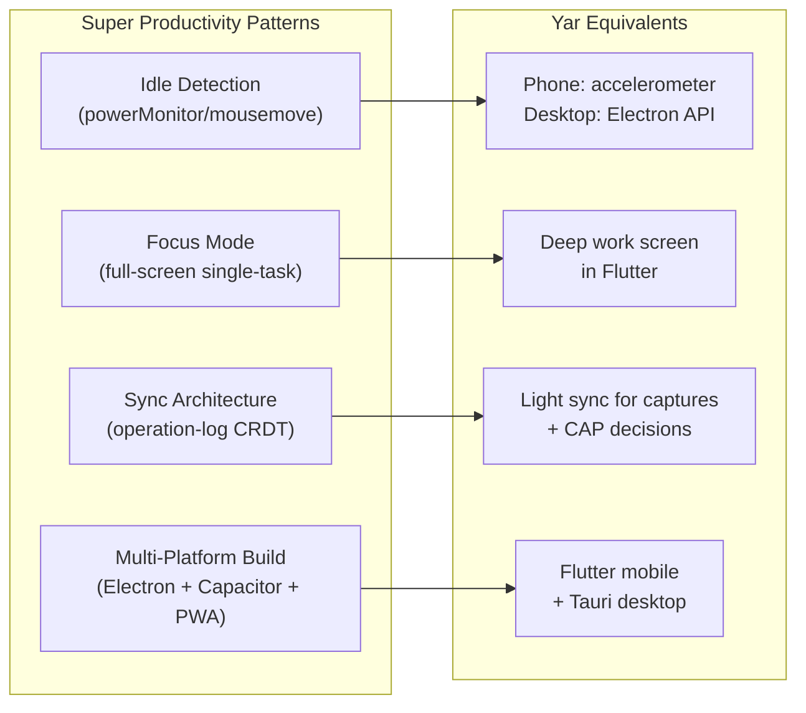
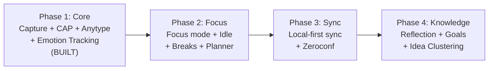

> **Status**: Active
> **Date**: 2026-05-29
> **Author**: \@mohammadi
> **Audience**: engineers, stakeholders
> **Tags**: `yar`, `competitive`, `features`, `comparison`

> [!NOTE]
> **TL;DR**: Leantime is a project management tool for teams; Super Productivity is a deep work task manager for individuals. Yar borrows focus features from Super Productivity (Pomodoro, idle detection, break reminders) and reframes Leantime's reflection tools, but Yar's core differentiators (voice input, emotion tracking, CAP safety) are unique to Cytonome.
> **Source**: [feature_comparison_leantime_vs_sp.md](file:///home/mohammadi/repos/cytognosis/docs/cytonome/yar/research/feature_comparison_leantime_vs_sp.md)

---

# ⚡ Feature Comparison: Leantime vs Super Productivity vs Yar

📍 **Breadcrumbs**: Cytonome > Yar > Research > Leantime vs Super Productivity

---

## ⚡ Quick Comparison

> [!TIP]
> **Section Summary**: Three tools, three different philosophies. Yar is the only one built by and for neurodivergent minds with safety-first AI.

| Dimension | Leantime | Super Productivity | Yar (Cytonome) |
|---|---|---|---|
| **Core Identity** | Project management for non-PMs | Deep work task manager | Cognitive companion, by neurodivergent minds |
| **Architecture** | Server-side PHP + MySQL | Angular mono-app, Electron/Capacitor/Web | Python backend + Flutter mobile + browser extension |
| **ND Focus** | "Built for ADHD" (marketing claim) | ADHD & Focus use-case page | **Core mission**: CAP safety, emotion tracking, local-first |
| **Data Model** | Server-first, SQL-backed | Local-first, IndexedDB | Local-first, knowledge graph (Anytype) |
| **License** | AGPLv3 | MIT | Apache 2.0 |

---

## 🟢 Features That Fit Yar Perfectly

> [!TIP]
> **Section Summary**: Focus management, time awareness, and gentle planning are the highest-value features to adopt.

### From Super Productivity (Phase 2 Priority)

| Feature | What It Does | Why Yar Needs It | 🤖 AI-Automatable? |
|---|---|---|---|
| **Focus Mode** | Full-screen single-task view with timer | Critical for ADHD | Implement as "deep work" screen in Flutter |
| **Pomodoro Timer** | Built-in focus/break timer | Focus management is core ND need | — |
| **Idle Detection** | Detects AFK, offers resume/discard | Reduces manual tracking burden | Phone: accelerometer; Desktop: Electron API |
| **Take-a-Break Reminders** | Configurable interval reminders | Burnout prevention for hyperfocus | 🤖 Agent learns personal break patterns |
| **Tracking Reminders** | Gentle nudges | Gentle nudges without guilt | 🤖 Agent personalizes timing |
| **Day Planner** | Drag-and-drop daily planning | Daily anchor is core to Yar | 🤖 Agent pre-drafts from pending tasks |

### From Both Tools

| Feature | Source | Why Yar Needs It | 🤖 AI-Automatable? |
|---|---|---|---|
| **Task CRUD** | Both | Core: YarObjects already model this | 🤖 Agent pre-drafts from captures |
| **Subtasks/Dependencies** | Both | Graph links already support this | 🤖 Agent decomposes tasks |
| **Tags/Labels** | Both | YarObject.type + properties | 🤖 Agent auto-tags from content |
| **Time Tracking** | Both | Critical for ND users to understand time perception | 🤖 Agent tracks via voice session timestamps |
| **Dark Mode** | Both | Default (WCAG AAA) | — |
| **i18n** | Both (20-40+ languages) | Critical for global reach | — |

---

## 🟡 Features That Need Adaptation

> [!TIP]
> **Section Summary**: Some concepts are useful but need reframing for a personal cognitive companion (no corporate overhead).

| Feature | Original Context | Yar Reframing | 🤖 AI-Automatable? |
|---|---|---|---|
| **Kanban boards** | Project management views | Visual planning (useful but not core) | — |
| **Goals & metrics** | Leantime strategic tools | "Personal Compass": gentle goal tracking, no pressure | 🤖 Agent tracks progress automatically |
| **Retrospectives** | Leantime team retros | "Daily Reflection": AI-generated, not manual | 🤖 Agent generates reflection prompts |
| **Idea boards** | Leantime ideas domain | "Insight Clusters": AI-grouped capture themes | 🤖 Agent clusters captures |
| **Calendar integration** | Both (CalDAV/iCal) | Useful but secondary | — |
| **Guided onboarding** | SP shepherded tours | Reduces cognitive load of setup | 🤖 Agent walks through setup conversationally |
| **Worklog/Time reports** | SP daily/weekly summaries | Useful but must avoid "surveillance" feel | 🤖 Agent generates reflective summaries |

---

## 🔴 Features That Do Not Fit Yar

> [!TIP]
> **Section Summary**: Enterprise, team, and organizational features are off-scope for a personal cognitive companion.

| Feature | Source | Why It Does Not Fit |
|---|---|---|
| Sprint management | Leantime | Scrum is organizational overhead |
| Milestone tracking | Leantime | Too formal for personal companion |
| Lean/SWOT/Risk Canvas | Leantime | Business/enterprise strategic tools |
| Comments/Discussions | Leantime | Multi-user feature |
| Jira integration | SP | Enterprise tooling |
| User roles/permissions | Leantime | Yar is personal |
| 2FA, LDAP, OIDC | Leantime | No server auth needed |
| Slack/Discord integration | Leantime | Organizational tool |

---

## 🟢 Yar's Unique Differentiators

> [!TIP]
> **Section Summary**: Three features that only Yar has. These are the core competitive advantage.

| Feature | Description | Status |
|---|---|---|
| **Voice Input** | Gemma + HuBERT speech understanding | ✅ Built |
| **Emotion Tracking** | Voice sentiment sensor | ✅ Architecture built |
| **CAP Safety Gate** | No clinical claims, no harmful advice | ✅ Built |
| **Anytype Integration** | Knowledge graph with two-way linking | ✅ Built |

Neither Leantime nor Super Productivity has any of these capabilities.

---

## 🤖 AI Agent Automation Candidates

> [!TIP]
> **Section Summary**: Nine features where the AI agent can reduce cognitive burden. Prioritized by phase.

| Task | Approach | Priority |
|---|---|---|
| **Task creation from captures** | Agent parses voice/text, generates YarObjects | **P0** (partially built) |
| **Daily plan generation** | Agent analyzes pending tasks + energy patterns | **P0** (critical for ADHD) |
| **Task decomposition** | Agent breaks large tasks into subtasks with durations | P1 |
| **Auto-tagging** | Agent classifies captures into knowledge graph categories | P1 |
| **Reflection/worklog summaries** | Agent generates end-of-day narrative | P1 |
| **Break timing optimization** | Agent learns personal focus/fatigue patterns | P2 |
| **Goal progress tracking** | Agent aggregates completions, reports progress | P2 |
| **Idea clustering** | Agent groups thematically related captures | P2 |
| **Calendar suggestion** | Agent proposes time blocks from task estimates + free slots | P3 |

---

## 🏗️ Implementation Patterns Worth Adopting

> [!TIP]
> **Section Summary**: Super Productivity has several code patterns that map directly to Yar's architecture.



<details>
<summary>🔬 Deep Dive: Super Productivity Sync Architecture</summary>

SP uses an **operation-log based CRDT-like sync**:
- Each mutation generates an `OpLogEntry` with **vector clock**
- Conflict resolution via last-writer-wins on per-entity basis
- Providers: WebDAV, local file, Dropbox, SuperSync
- Package boundary enforcement via ESLint rules

**Yar adoption**: Anytype already handles sync for structured objects. We need a lighter sync for captures and CAP decisions.

</details>

<details>
<summary>🔬 Deep Dive: Leantime Domain Architecture</summary>

Clean hexagonal architecture with 57 domain modules:
```
app/Domain/Tickets/
├── Controllers/          # HTTP handlers
├── Models/               # Data models
├── Repositories/         # Database access
├── Services/             # Business logic
├── Templates/            # Blade views
└── Hxcontrollers/        # HTMX partial endpoints
```

**Yar parallel**: Yar already uses a similar pattern with `api/routes_*.py`, `models/`, `core/`, `storage/`.

</details>

---

## 🏗️ Phased Adoption Roadmap



| Phase | Status | Key Features |
|---|---|---|
| **Phase 1: Core Companion Loop** | ✅ Built | Capture pipeline, CAP safety, Anytype integration, emotion tracking |
| **Phase 2: Focus & Time Awareness** | 🚧 Next | Focus mode, idle detection, break reminders, daily planner |
| **Phase 3: Sync & Multi-Device** | 📋 Planned | Local-first sync (operation-log), Zeroconf discovery |
| **Phase 4: Knowledge & Reflection** | 📋 Planned | Daily Reflection (AI-generated), Personal Compass, Insight Clusters |

---

## 📖 Glossary

<details>
<summary>Expand terminology table</summary>

| Term | Definition |
|---|---|
| **ND** | Neurodivergent. Refers to ADHD, autism, dyslexia, and other neurological variations. |
| **CRUD** | Create, Read, Update, Delete. The four basic data operations. |
| **NgRx** | Redux-style state management for Angular applications. |
| **CRDT** | Conflict-free Replicated Data Type. A data structure that allows concurrent edits to be merged automatically. |
| **Vector clock** | A mechanism for tracking event ordering across distributed systems. |
| **Kanban** | A visual workflow management method using columns and cards. |
| **Pomodoro** | A time management technique using focused work intervals (typically 25 min) separated by short breaks. |
| **CalDAV** | An internet standard for calendar synchronization. |
| **IndexedDB** | A browser-based database for storing large amounts of structured data locally. |
| **Electron** | A framework for building cross-platform desktop apps using web technologies. |
| **Capacitor** | A framework for building cross-platform mobile apps using web technologies. |
| **Tauri** | A Rust-based framework for building lightweight cross-platform desktop apps. |
| **CAP** | Cytognosis Authority Protocol. The safety layer governing AI agent behavior. |
| **HuBERT** | Hidden-Unit BERT. A self-supervised speech representation model used for emotion detection. |
| **Anytype** | A local-first, open-source knowledge management tool with graph storage. |
| **YarObject** | The core typed entity in Yar's data model (Note, Task, Idea, etc.). |
| **WCAG AAA** | Web Content Accessibility Guidelines, highest compliance level. |

</details>