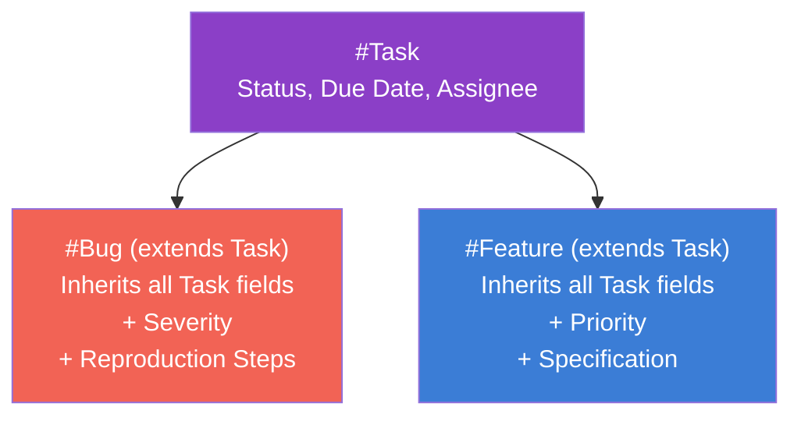
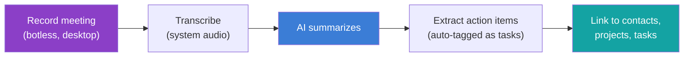

> **Status**: Active
> **Date**: 2026-05-29
> **Author**: \@mohammadi
> **Audience**: engineers, stakeholders
> **Tags**: `yar`, `competitive`, `tana`, `evaluation`

> [!NOTE]
> **TL;DR**: Tana is the closest existing product to Yar's vision: an AI-native, graph-based outliner where everything is a node with persistent IDs. Its **supertags** (typed schemas), **live searches** (queries-as-objects), and **command nodes** (automation) are the three patterns Yar should adopt. Key differentiator for Yar: biomedical domain specificity that Tana's general-purpose architecture cannot provide. 9 features are P0 for Yar MVP.
> **Source**: [tana-outliner-deep-dive.md](file:///home/mohammadi/Documents/ObsidianVault/02-Products/cytonome-yar/tana-outliner-deep-dive.md)

---

## ⚡ Quick Start: Why Tana Matters for Yar

> [!TIP]
> **Section summary**: Tana validates 5 critical assumptions for Yar's design. It proves users want typed objects, queries as first-class objects, AI that works with structure, graph-first architecture, and composable template bundles.

### 5 Critical Insights

| # | Insight | Yar Impact |
|---|---|---|
| 1 | **Supertags = Node Types with Schemas** | Users want and will adopt typed objects with fields and inheritance |
| 2 | **Live Searches = Dynamic Retrieval** | Queries should be first-class objects, composable and embeddable |
| 3 | **AI-Native Design** | AI must work *with* structured data, not just raw text |
| 4 | **Graph-First Architecture** | Everything-is-a-node with persistent IDs validates Yar's graph model |
| 5 | **Template Bundles** | Composable packages (supertags + fields + commands + views) are the extensibility model |

### Strategic Assessment

Tana is the **closest existing product to Yar's vision**. Yar's key differentiator is biomedical domain specificity, cellular intelligence integration, and health-context awareness that Tana cannot provide. Adopt Tana's proven UX patterns while layering on Cytognosis-specific intelligence.

---

## 🔬 Product Overview

> [!TIP]
> **Section summary**: Tana is an AI-native graph-based outliner. Founded ~2022 by former Notion/Linear engineers. Free tier is limited (5 supertags, 2 workspaces). Pro ($18/mo) unlocks the Input API, model selection, and unlimited storage.

### Pricing

| Plan | Monthly | Annual | Key Limits |
|---|---|---|---|
| **Free** | $0 | $0 | 5 supertags, 2 workspaces, 500 AI credits |
| **Plus** | $10 | $8 | Unlimited supertags, calendar, 2K AI credits |
| **Pro** | $18 | $14 | Input API, model selection, 5K AI credits |

**Discounts**: 50% off for students and NGOs.

### Platforms

| Platform | Status |
|---|---|
| Desktop (Mac, Windows, Linux) | ✅ Full with offline |
| Mobile (iOS, Android) | ✅ Full with voice capture |
| Web | ✅ Browser-based |

---

## 🏗️ Core Data Model: Everything is a Node

> [!TIP]
> **Section summary**: No files, no folders. Every piece of information is a **node** with a unique persistent ID. Nodes nest infinitely (outliner model). Editing a reference edits the original (shared ID).

### Key Concepts

| Concept | Description |
|---|---|
| **Node** | The atomic unit of information |
| **Unique Node ID** | Persistent identifier, visible in URLs |
| **Infinite nesting** | Outliner model with indent/outdent |
| **References = mirrors** | Editing a reference edits the original |

### System Fields (Auto-Tracked)

| Field | Description |
|---|---|
| Created Time | Auto-recorded at creation |
| Last Modified Time | Tracks updates |
| Last Modified By | Who changed it |
| Owner | Home location in outline |
| Tags | Applied supertags |
| Workspace | Which workspace |
| Number of References | Backlink count |

💡 101: What does "everything is a node" mean?

In most apps, you have different containers: files, folders, databases, pages. In Tana, **all of these are the same thing**: a node. A note is a node. A project is a node. A query is a node. Even a template is a node. They all have the same persistent ID, can link to each other, and can be nested inside each other. This makes the system extremely flexible but also requires more upfront learning.

---

## ⭐ Supertags System

> [!TIP]
> **Section summary**: Supertags are schemas applied to nodes. They transform a plain node into a structured object with typed fields. They support **inheritance** (Extend) and **composition** (multiple supertags on one node). This maps directly to Yar's node type system.

### How Supertags Work

Applying a supertag (type `#` + name) gives a node specific attributes. Think of it as applying a class to an object.

| Feature | Description |
|---|---|
| **Apply** | Type `#` + tag name on any node |
| **Multiple tags** | One node can have many supertags |
| **Default content** | Template sub-nodes auto-appear |
| **Base types** | Task, Person, Meeting unlock specialized UI |

### Field Types

| Field Type | Description |
|---|---|
| **Plain** | Any text |
| **Options** | Fixed dropdown selections |
| **Options from Supertag** | Dynamic dropdown from all instances of a type |
| **Date** | Date picker |
| **Number** | Numeric value |
| **URL** | Web link |
| **Email** | Email address |
| **Checkbox** | Boolean toggle |

### Inheritance: The "Extend" Feature

When Supertag B **extends** Supertag A, it inherits all fields and template content. Changes to the parent propagate to children. This creates taxonomic hierarchies (e.g., `#Bug` extends `#Task`).

💡 101: Inheritance vs Composition

- **Inheritance** (vertical): `#Bug` extends `#Task`. Bug IS a Task with extra fields. One-directional parent-child relationship.
- **Composition** (horizontal): Apply both `#Meeting` and `#Project-Update` to get fields from both. Mix and match. No parent-child relationship.

Yar should support both: health entity types can inherit (Symptom → Neurological Symptom) AND compose (a node can be both a Medication Log and a Daily Note entry).

### Tana → Yar Mapping

| Tana Concept | Yar Equivalent |
|---|---|
| Supertag | Node Type / Object Schema |
| Field | Property / Attribute |
| Extend | Schema Inheritance |
| Multiple supertags | Multi-type composition |
| Default content | Template instantiation |
| Base types | Core type categories |
| Options from Supertag | Dynamic enum from type instances |

---

## 🏗️ Automations and Templates

> [!TIP]
> **Section summary**: **Command nodes** are Tana's automation primitive. They package AI prompts, API requests, and field manipulations into reusable actions. **Template bundles** are composable workflow packages (supertags + fields + commands + views). Yar should adopt this model for health workflow packages.

### Command Nodes

| Capability | Description |
|---|---|
| **AI Commands** | Custom prompts that process node content |
| **Make API Request** | Send HTTP requests to external services |
| **Set Field Values** | Programmatically update fields |
| **Compound Commands** | Chain multiple commands together |

### Template Bundles

| Template | Contents |
|---|---|
| Simple Projects | Project supertag, task tracking, Kanban |
| Goals (OKRs) | Objectives, Key Results, linked tasks |
| Meeting to Comms | Meeting supertag, attendees, AI extraction |
| Habit Tracking | Habit supertag, streak tracking, daily check-ins |
| AI-Enabled Tasks | Task automation with AI classification |

📋 How to create a command node

1. Create an empty node and name it (e.g., "Send to Make")
2. Select the node, use `Cmd/Ctrl + K` → "Convert to command node"
3. Add child nodes with commands (`@Make API request`, AI prompts, etc.)
4. Attach to a supertag as a button via "AI and Commands" panel

---

## 🔬 AI Features

> [!TIP]
> **Section summary**: Tana is AI-native. Botless meeting transcription (no bot joins your call). Voice-to-structure on mobile. Custom AI command buttons on supertags. Multi-model support (GPT, Claude, Gemini). AI chat on any node with context.

### Key AI Capabilities

| Feature | Description |
|---|---|
| **Botless transcription** | Record system audio directly, no meeting bot |
| **Post-meeting AI** | Auto-summaries, action item extraction |
| **Voice memos** | Transcribed and auto-structured by supertags |
| **Voice chat** | Two-way voice interaction with your data |
| **Custom AI commands** | Single-click: raw transcript → project plan |
| **AI chat on nodes** | Space bar → chat referencing current node |
| **Multi-model** | GPT, Claude, Gemini (Pro plan) |
| **Image generation** | Nano Banana Pro integration |

### Meeting Intelligence Flow

---

## 🔬 Live Searches and Dynamic Queries

> [!TIP]
> **Section summary**: Search nodes are queries that are themselves nodes. They update dynamically, can be embedded anywhere, and support AND/OR/NOT logic with multiple view modes (List, Table, Kanban, Calendar, Tabs).

### Creating Live Searches

| Method | How |
|---|---|
| Command Palette | `Cmd/Ctrl + K` → "Find nodes..." |
| Keyboard | Type `?` on empty node |
| Query Builder | Click "Edit query" for conditions |

### Query Logic

| Condition Type | Example |
|---|---|
| By tag | `#book`, `#task` |
| By field value | `Status == "Reading"` |
| By date | `CREATED LAST 7 DAYS` |
| By text | Exact text match |
| Dynamic refs | `PARENT`, `GRANDPARENT` |
| Operators | AND (default), OR, NOT |

### View Modes

| View | Description |
|---|---|
| **List** | Simple vertical list |
| **Table** | Spreadsheet with field columns |
| **Kanban/Card** | Grouped by field (e.g., Status) |
| **Calendar** | Plotted by date field |
| **Tabs** | Grouped results in switchable tabs |

---

## 🏗️ Graph and Relationships

> [!TIP]
> **Section summary**: Everything-is-a-node with unique IDs enables deep bidirectional references. Creating an @-mention auto-generates a backlink. Multiple "mirrors" of a node share the same ID; editing one edits all. Unlinked mentions suggest potential links from plain text.

| Feature | Description |
|---|---|
| **@-mentions** | Create inline references with autocomplete |
| **Auto-backlinks** | Created automatically on @-mention |
| **Mirrors** | Multiple copies of same node, all stay synced |
| **Unlinked mentions** | System finds plain-text matches and suggests linking |
| **Reference panel** | All backlinks shown at bottom of every node |

---

## 🔬 Import, Export & API

> [!TIP]
> **Section summary**: Export to Markdown (.zip) or JSON. Input API (Pro only) for programmatic node creation. No public read API. No native webhooks. Integrations via Make API Request command nodes and community tools.

### Export

| Format | Description |
|---|---|
| **Markdown** | .zip of .md files, preserves links |
| **JSON** | Full metadata and structure |
| **Selective** | Export by supertag or search results |

### Input API

| Aspect | Detail |
|---|---|
| Availability | Pro plan only |
| Method | POST |
| Capabilities | Create nodes, apply supertags, upload files |
| Read access | **None** (no public read API) |

### Integrations

| Integration | Type |
|---|---|
| Google Calendar | Native (auto-import meetings) |
| Readwise | Native (sync highlights) |
| Make.com / Zapier / n8n | Via API request command |
| Tana Capture (Chrome) | Extension for web clipping |

---

## 🏗️ UX and Navigation

> [!TIP]
> **Section summary**: Keyboard-first design. Command palette (`Cmd+K`), tabs, side panels, zoom into any node. Quick Add captures to daily notes without context switching. Slash commands for inline creation.

### Essential Shortcuts

| Action | Shortcut |
|---|---|
| Command Palette | `Cmd/Ctrl + K` |
| Quick Add (to daily notes) | `Cmd/Ctrl + Shift + Space` |
| Move Node Up/Down | `Cmd/Ctrl + Shift + ↑/↓` |
| Indent/Outdent | `Tab` / `Shift + Tab` |
| Zoom In/Out | `Cmd/Ctrl + .` / `Cmd/Ctrl + ,` |
| Open in New Tab | `Cmd/Ctrl + Click` |
| Open in Side Panel | `Shift + Click` |

### Inline Creation

| Trigger | Action |
|---|---|
| `/` | Creation menu (fields, structures) |
| `>` | Add field by name |
| `#` | Apply supertag |
| `@` | Create reference |
| `?` | Create search node |

---

## 🔬 Comparative Analysis

> [!TIP]
> **Section summary**: Tana vs Capacities vs Notion vs Obsidian. Tana wins on automation depth, AI, and graph flexibility. Capacities wins on accessibility and offline. Notion wins on collaboration.

| Feature | Tana | Capacities | Notion | Obsidian |
|---|---|---|---|---|
| **Paradigm** | Outliner (nested nodes) | Object-based | Block database | File markdown |
| **Automation** | High (commands, AI) | Moderate | Low | Plugin |
| **AI** | Deep, multi-model | Growing | Bolt-on | Plugin |
| **Learning curve** | Steep | Intuitive | Moderate | Moderate |
| **Offline** | Desktop only | Full offline-first | Partial | Full |
| **Collaboration** | Basic | None | Full team | Publish |

---

## ⭐ Yar Feature Mapping

> [!TIP]
> **Section summary**: 9 P0 features for Yar MVP. 10 P1 features. 9 P2 features. The mapping covers data model, supertags, automations, AI, queries, graph, import/export, and UX.

### P0 Must-Haves (9 Features)

| # | Feature | Yar Implementation |
|---|---|---|
| 1 | Unified node model with persistent IDs | Foundation of everything |
| 2 | Schema-based node types (supertags) | Core differentiator |
| 3 | Property type system | Text, Date, Number, URL, Checkbox, Options |
| 4 | Query objects with visual builder | Queries as first-class citizens |
| 5 | Multi-view rendering | List, Table, Kanban, Calendar |
| 6 | Bidirectional references with backlinks | Graph relationships |
| 7 | Command palette + keyboard shortcuts | Power user UX |
| 8 | Navigation sidebar | Today, Pinned, Types, Search |
| 9 | Slash commands | Inline content creation menu |

### P1 High Priority (10 Features)

| # | Feature |
|---|---|
| 1 | Schema inheritance (Extend) |
| 2 | AI Chat on nodes with pluggable LLMs |
| 3 | Custom AI commands |
| 4 | Dynamic option lists from type instances |
| 5 | Template instantiation on type application |
| 6 | Markdown/JSON export |
| 7 | REST API for programmatic access |
| 8 | Multi-tab interface + side panels |
| 9 | Quick capture to inbox/daily notes |
| 10 | Group by / Sort by controls |

📋 P2 future features (9 items)

| # | Feature |
|---|---|
| 1 | Meeting transcription and intelligence |
| 2 | Voice-to-structure capture |
| 3 | Template bundles (composable workflow packages) |
| 4 | Event-based automation triggers |
| 5 | HTTP request action nodes |
| 6 | Unlinked mention detection |
| 7 | Calendar integration |
| 8 | Image generation |
| 9 | Publishing (read-only web views) |

---

## 💡 Key Design Decisions for Yar

> [!TIP]
> **Section summary**: 5 key architectural decisions that Tana validates for Yar.

| # | Decision | Rationale |
|---|---|---|
| 1 | **Adopt "everything is a node" model** | Tana validates this. Every object, query, view, template should be a node. |
| 2 | **Make queries first-class objects** | Search nodes that ARE nodes is elegant and powerful. |
| 3 | **Support inheritance AND composition** | Types should extend other types AND objects should have multiple types. |
| 4 | **AI should work WITH structure** | Schema-aware AI commands > raw-text AI. |
| 5 | **Template bundles > static templates** | Package schemas + fields + queries + AI commands as installable workflows. |

➡️ **What's Next?** Build the unified node model with persistent IDs, implement schema-based node types (supertags), and set up the property type system. Then add query objects and multi-view rendering.

---

## 📖 Glossary

Expand terminology table

| Term | Definition |
|---|---|
| **Supertag** | A schema/class applied to a node that gives it typed fields and template content. Tana's core primitive. |
| **Node** | The fundamental, atomic unit of information in Tana. Everything is a node. |
| **Node ID** | Unique persistent identifier assigned to every node at creation. |
| **Extend** | Tana's inheritance mechanism. Supertag B extends Supertag A, inheriting all fields. |
| **Command node** | Tana's automation primitive. Packages AI prompts, API requests, and field manipulations. |
| **Live search** | A query that is itself a node. Updates dynamically as data changes. |
| **Template bundle** | A composable package of supertags + fields + commands + views that can be installed as a workflow. |
| **Reference (mirror)** | A copy of a node that shares the same Node ID. Editing one edits all. |
| **Backlink** | An automatic reference showing where a node is linked from. |
| **Unlinked mention** | Plain-text occurrence of a node's name that the system suggests linking. |
| **Base type** | Built-in supertag categories (Task, Person, Meeting) that unlock specialized UI behavior. |
| **Options from Supertag** | A field type that dynamically populates its dropdown from all instances of another supertag. |
| **Prompt expression** | Dynamic variable syntax (`${name}`, `${sys:nodeId}`) for command node payloads. |
| **Botless transcription** | Recording meeting audio directly via desktop app without a bot joining the call. |
| **Input API** | Tana's write-only REST API for programmatically creating nodes (Pro plan). |
| **PKM** | Personal Knowledge Management. Tools for organizing individual knowledge. |

